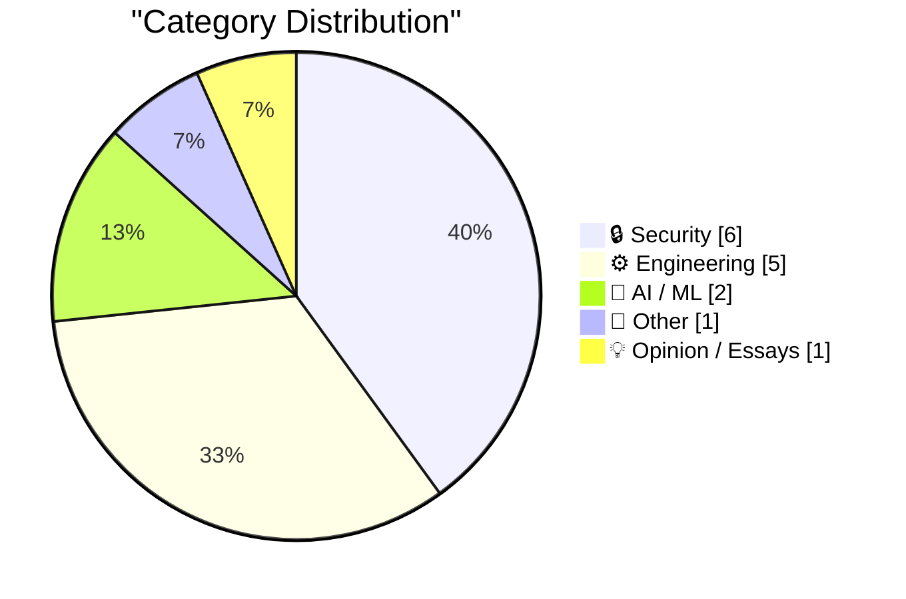
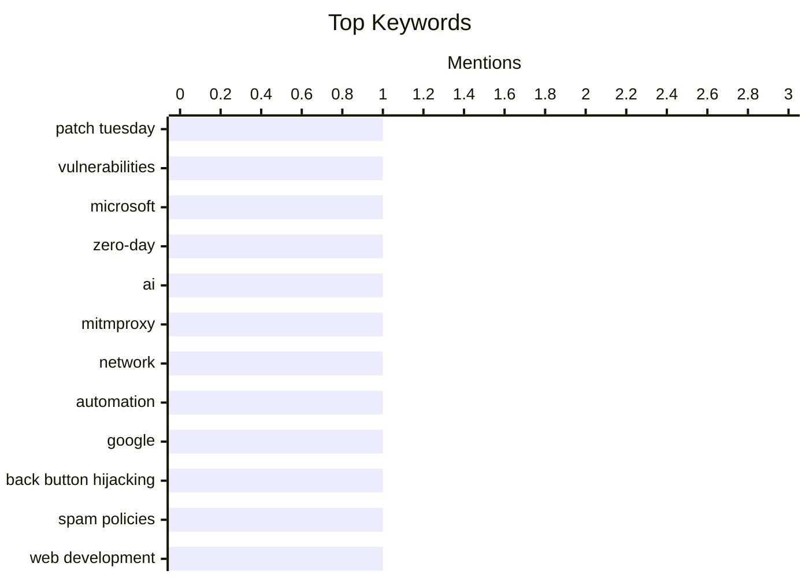

## Today's Highlights
Today's tech highlights reveal an escalating cybersecurity landscape, where AI is emerging as a double-edged sword, powering both advanced defensive strategies and sophisticated offensive tools. This comes amidst a relentless stream of vulnerabilities, with Microsoft patching 167 flaws, and persistent threats like fraudulent crypto apps stealing millions from users. Companies are actively working to enhance platform security and user experience, as seen with Google's crackdown on deceptive web practices and the adoption of new web security protocols. The overall trend points to an increasingly complex and demanding environment for securing digital systems.
---
## Must Read Today
1. **Patch Tuesday, April 2026 Edition**
[Patch Tuesday, April 2026 Edition](https://krebsonsecurity.com/2026/04/patch-tuesday-april-2026-edition/) — krebsonsecurity.com · 16h ago · 🔒 Security
> Microsoft today addressed a staggering 167 security vulnerabilities in its Windows operating systems and related software. Key fixes include a SharePoint Server zero-day and a publicly disclosed weakness in Windows Defender dubbed "BlueHammer." Separately, Google Chrome patched its fourth zero-day of 2026, and an emergency update for Adobe Reader fixed an actively exploited flaw leading to remote code execution. This highlights the continuous and widespread need for urgent patching across major software platforms to mitigate active threats.
💡 **Why read it**: It provides critical information on widespread security vulnerabilities and essential patches across major software platforms like Microsoft, Google Chrome, and Adobe.
🏷️ Patch Tuesday, vulnerabilities, Microsoft, zero-day
2. **zappa: an AI powered mitmproxy**
[zappa: an AI powered mitmproxy](https://geohot.github.io//blog/jekyll/update/2026/04/15/zappa-mitmproxy.html) — geohot.github.io · 22h ago · 🔒 Security
> The article introduces "zappa," an AI-powered mitmproxy, anticipating a future where AI can interact with the internet indistinguishably from humans. The author posits that advanced AI, like zappa, could offer liberation from attention-targeting mechanisms prevalent online. While specific technical details of zappa are not provided, the concept centers on AI's capability to mediate and potentially filter internet interactions. This technology aims to empower users by leveraging AI to manage their online experience and combat pervasive digital distractions.
💡 **Why read it**: It introduces a novel concept of an AI-powered mitmproxy ("zappa") that could revolutionize how users interact with the internet and manage digital attention.
🏷️ AI, mitmproxy, Network, Automation
3. **Google Will Finally Begin Punishing Sites for Back-Button Hijacking in June**
[Google Will Finally Begin Punishing Sites for Back-Button Hijacking in June](https://developers.google.com/search/blog/2026/04/back-button-hijacking) — daringfireball.net · 17h ago · ⚙️ Engineering
> Google is addressing "back button hijacking," a deceptive practice where websites prevent users from returning to the previous page by manipulating browser history. Google announced on its Search Central Blog that this practice will become an explicit violation of its "malicious practices" spam policies. Starting in June, sites engaging in back button hijacking will face potential spam actions. This policy aims to restore the fundamental user expectation of the back button's functionality. Google is taking concrete steps to improve user experience and combat deceptive web practices by penalizing sites that violate basic browser navigation principles.
💡 **Why read it**: It informs web developers and users about Google's new policy to penalize "back button hijacking," which will improve web navigation and user experience.
🏷️ Google, back button hijacking, spam policies, web development
---
## Data Overview
| Sources Scanned | Articles Fetched | Time Window | Selected |
|:---:|:---:|:---:|:---:|
| 89/92 | 2541 -> 22 | 24h | **15** |
### Category Distribution

### Top Keywords

<details>
<summary>Plain Text Keyword Chart (Terminal Friendly)</summary>
```
patch tuesday         │ ████████████████████ 1
vulnerabilities       │ ████████████████████ 1
microsoft             │ ████████████████████ 1
zero-day              │ ████████████████████ 1
ai                    │ ████████████████████ 1
mitmproxy             │ ████████████████████ 1
network               │ ████████████████████ 1
automation            │ ████████████████████ 1
google                │ ████████████████████ 1
back button hijacking │ ████████████████████ 1
```
</details>
### Topic Tags
**patch tuesday**(1) · **vulnerabilities**(1) · **microsoft**(1) · zero-day(1) · ai(1) · mitmproxy(1) · network(1) · automation(1) · google(1) · back button hijacking(1) · spam policies(1) · web development(1) · openai(1) · gpt-5.4-cy(1) · cyber defense(1) · ai model(1) · zig(1) · release notes(1) · programming language(1) · cybersecurity(1)
---
## Security
### 1. Patch Tuesday, April 2026 Edition
[Patch Tuesday, April 2026 Edition](https://krebsonsecurity.com/2026/04/patch-tuesday-april-2026-edition/) — **krebsonsecurity.com** · 16h ago · ⭐ 29/30
> Microsoft today addressed a staggering 167 security vulnerabilities in its Windows operating systems and related software. Key fixes include a SharePoint Server zero-day and a publicly disclosed weakness in Windows Defender dubbed "BlueHammer." Separately, Google Chrome patched its fourth zero-day of 2026, and an emergency update for Adobe Reader fixed an actively exploited flaw leading to remote code execution. This highlights the continuous and widespread need for urgent patching across major software platforms to mitigate active threats.
🏷️ Patch Tuesday, vulnerabilities, Microsoft, zero-day
---
### 2. zappa: an AI powered mitmproxy
[zappa: an AI powered mitmproxy](https://geohot.github.io//blog/jekyll/update/2026/04/15/zappa-mitmproxy.html) — **geohot.github.io** · 22h ago · ⭐ 29/30
> The article introduces "zappa," an AI-powered mitmproxy, anticipating a future where AI can interact with the internet indistinguishably from humans. The author posits that advanced AI, like zappa, could offer liberation from attention-targeting mechanisms prevalent online. While specific technical details of zappa are not provided, the concept centers on AI's capability to mediate and potentially filter internet interactions. This technology aims to empower users by leveraging AI to manage their online experience and combat pervasive digital distractions.
🏷️ AI, mitmproxy, Network, Automation
---
### 3. Cybersecurity Looks Like Proof of Work Now
[Cybersecurity Looks Like Proof of Work Now](https://simonwillison.net/2026/Apr/14/cybersecurity-proof-of-work/#atom-everything) — **simonwillison.net** · 18h ago · ⭐ 26/30
> The article discusses the evolving landscape of cybersecurity, likening it to a "Proof of Work" system, particularly in the context of AI's role. The UK's AI Safety Institute recently published "Our evaluation of Claude Mythos Preview’s cyber capabilities," an independent analysis backing previous findings. This suggests that advanced AI models like Claude Mythos are being rigorously assessed for their potential impact on cybersecurity. The "Proof of Work" analogy implies that continuous effort and verifiable actions are becoming crucial in defense against increasingly sophisticated threats. The cybersecurity domain is increasingly characterized by a "Proof of Work" paradigm, with AI models like Claude Mythos undergoing stringent evaluation for their defensive potential.
🏷️ Cybersecurity, Proof of Work, AI Safety
---
### 4. Fraudulent Cryptocurrency App in Mac App Store Stole $9.5 Million From 50-Some Users
[Fraudulent Cryptocurrency App in Mac App Store Stole $9.5 Million From 50-Some Users](https://www.web3isgoinggreat.com/?id=fake-ledger-app) — **daringfireball.net** · 15h ago · ⭐ 25/30
> A fraudulent cryptocurrency wallet app, mimicking Ledger, infiltrated the Apple Mac App Store and stole $9.5 million from approximately 50 users. The fake Ledger app, despite the App Store's curation, tricked users into entering their seed phrases, leading to immediate draining of their wallets. One victim, musician G. Love, reported losing his retirement fund due to the scam. This incident highlights the significant security risks even on supposedly secure platforms and the devastating financial impact of crypto scams. This event underscores the critical need for extreme vigilance in cryptocurrency transactions and the persistent challenge of combating sophisticated scams even within curated app ecosystems.
🏷️ Cryptocurrency, fraud, App Store, Ledger
---
### 5. datasette PR #2689: Replace token-based CSRF with Sec-Fetch-Site header protection
[datasette PR #2689: Replace token-based CSRF with Sec-Fetch-Site header protection](https://simonwillison.net/2026/Apr/14/replace-token-based-csrf/#atom-everything) — **simonwillison.net** · 14h ago · ⭐ 23/30
> Datasette is migrating from traditional token-based CSRF protection, which is cumbersome to implement, to a more modern and streamlined method. Datasette's PR #2689 proposes replacing its existing CSRF token implementation, based on the `asgi-csrf` Python library, with protection leveraging the `Sec-Fetch-Site` HTTP header. Token-based CSRF requires manual insertion of hidden input fields (`<input type="hidden" name="csrftoken" value="{{ csrftoken() }}">`) in templates, which is described as a "pain to work with." The `Sec-Fetch-Site` header offers a more elegant, browser-native solution. Datasette is adopting `Sec-Fetch-Site` header protection to simplify CSRF defense, enhancing security while improving developer experience by eliminating manual token management.
🏷️ CSRF, web security, Sec-Fetch-Site
---
### 6. Why is it so hard to passively stalk my friends' locations?
[Why is it so hard to passively stalk my friends' locations?](https://shkspr.mobi/blog/2026/04/why-is-it-so-hard-to-passively-stalk-my-friends-locations/) — **shkspr.mobi** · 2h ago · ⭐ 22/30
> The article addresses the common problem of missing opportunities to meet friends in new cities or at events due to a lack of passive location awareness. The author expresses guilt over discovering friends were nearby only after posting travel photos or encountering them serendipitously. Existing solutions like Apple's "Find My" require active checking, which doesn't facilitate spontaneous meetups. The core issue is the absence of a privacy-respecting, ambient location-sharing mechanism that enables serendipitous social interactions without constant interaction. The main conclusion is that there's a need for a better system to facilitate spontaneous social connections through passive location awareness.
🏷️ Location Sharing, Privacy, Social Apps, UX
---
## Engineering
### 7. Google Will Finally Begin Punishing Sites for Back-Button Hijacking in June
[Google Will Finally Begin Punishing Sites for Back-Button Hijacking in June](https://developers.google.com/search/blog/2026/04/back-button-hijacking) — **daringfireball.net** · 17h ago · ⭐ 28/30
> Google is addressing "back button hijacking," a deceptive practice where websites prevent users from returning to the previous page by manipulating browser history. Google announced on its Search Central Blog that this practice will become an explicit violation of its "malicious practices" spam policies. Starting in June, sites engaging in back button hijacking will face potential spam actions. This policy aims to restore the fundamental user expectation of the back button's functionality. Google is taking concrete steps to improve user experience and combat deceptive web practices by penalizing sites that violate basic browser navigation principles.
🏷️ Google, back button hijacking, spam policies, web development
---
### 8. Zig 0.16.0 release notes: "Juicy Main"
[Zig 0.16.0 release notes: "Juicy Main"](https://simonwillison.net/2026/Apr/15/juicy-main/#atom-everything) — **simonwillison.net** · 12h ago · ⭐ 26/30
> The Zig programming language has released version 0.16.0, introducing significant new features and improvements. The release notes are highlighted as comprehensive and detailed, including relevant usage examples for each new feature. A notable addition in Zig 0.16.0 is "Juicy Main," a dependency injection feature for the program's `main()` function where it can accept a `process.Init` parameter. Zig 0.16.0 brings substantial enhancements, particularly with "Juicy Main," improving the language's flexibility and developer experience through better dependency management.
🏷️ Zig, release notes, programming language
---
### 9. Apple Has Hidden the Pre-Creator-Studio Versions of Keynote, Numbers, and Pages in the Mac App Store
[Apple Has Hidden the Pre-Creator-Studio Versions of Keynote, Numbers, and Pages in the Mac App Store](https://9to5mac.com/2026/04/13/apple-removes-old-pages-keynote-numbers-apps-for-macos/) — **daringfireball.net** · 16h ago · ⭐ 23/30
> Apple's rollout of new "Creator Studio" features for iWork apps on Mac was initially confusing, with both old and new versions available simultaneously. While iOS received these features as updates to existing apps, Mac users saw separate new versions of Pages, Keynote, and Numbers. According to Aaron Perris, Apple has now removed the older, pre-Creator-Studio versions of these apps from the Mac App Store. This move streamlines the iWork app offerings on Mac, aligning the experience more closely with iOS. The main takeaway is that Apple has consolidated its iWork app strategy on Mac by discontinuing the older versions.
🏷️ Apple, Mac App Store, software updates, iWork
---
### 10. Intersecting spheres and GPS
[Intersecting spheres and GPS](https://www.johndcook.com/blog/2026/04/14/intersecting-spheres-and-gps/) — **johndcook.com** · 23h ago · ⭐ 22/30
> This article explains the fundamental geometric principle behind GPS localization using satellite distances. Knowing the distance 'd' to a single satellite defines a sphere of radius 'd' centered on the satellite, whose intersection with the Earth's surface forms a circle of possible locations. A second satellite observation provides another circle, with their intersection yielding two possible points. A third satellite observation is then required to uniquely determine the user's location by intersecting its sphere with these two candidate points. The main takeaway is that GPS relies on the intersection of at least three spheres (from satellites and Earth's surface) to precisely pinpoint a location.
🏷️ GPS, Geometry, Mathematics, Satellite Navigation
---
### 11. Pressed For Options
[Pressed For Options](https://feed.tedium.co/link/15204/17319282/linux-external-fingerprint-reader-challenges) — **tedium.co** · 11h ago · ⭐ 16/30
> The article highlights the significant challenges Linux users face when trying to find compatible and functional external USB fingerprint readers. The author specifically notes purchasing a USB fingerprint reader from Temu because it was one of the few known to work reliably with Linux. This situation underscores the limited options and prevalent compatibility issues due to a lack of proper Linux drivers or community support for many biometric peripherals. The main takeaway is that Linux users often struggle with hardware compatibility for external fingerprint readers, necessitating careful selection of specific, tested models.
🏷️ Linux, Hardware, Compatibility, Fingerprint
---
## AI / ML
### 12. Trusted access for the next era of cyber defense
[Trusted access for the next era of cyber defense](https://simonwillison.net/2026/Apr/14/trusted-access-openai/#atom-everything) — **simonwillison.net** · 16h ago · ⭐ 27/30
> OpenAI is developing advanced AI models for defensive cybersecurity use cases, in response to competitor offerings like Claude Mythos. OpenAI's answer appears to be a new model called GPT-5.4-Cyber, which is being fine-tuned specifically for cybersecurity applications. This initiative prepares for increasingly capable models from OpenAI over the next few months, focusing on enhancing cyber defense capabilities. OpenAI is actively scaling its AI models to provide trusted access and advanced tools for the evolving landscape of cyber defense.
🏷️ OpenAI, GPT-5.4-Cy, cyber defense, AI model
---
### 13. Pluralistic: Rights for robots (15 Apr 2026)
[Pluralistic: Rights for robots (15 Apr 2026)](https://pluralistic.net/2026/04/15/artificial-lifeforms/) — **pluralistic.net** · 6h ago · ⭐ 26/30
> The article touches upon the philosophical and ethical debate surrounding "Rights for robots" within a broader collection of diverse links. The author directly addresses the concept by stating, "Not everything deserves moral consideration." While the snippet doesn't elaborate on specific arguments, it frames the discussion as a critical inquiry into the moral status of artificial lifeforms. This piece briefly introduces the contentious topic of granting moral consideration or rights to robots, suggesting a skeptical viewpoint on the matter.
🏷️ AI Ethics, Robot Rights, Moral Consideration
---
## Other
### 14. Amazon to Acquire Globalstar, Announces Agreement With Apple to Continue Service for iPhone and Apple Watch
[Amazon to Acquire Globalstar, Announces Agreement With Apple to Continue Service for iPhone and Apple Watch](https://www.aboutamazon.com/news/company-news/amazon-globalstar-apple) — **daringfireball.net** · 18h ago · ⭐ 26/30
> Amazon is expanding its satellite communication capabilities and direct-to-device services through a major acquisition and partnership. Amazon.com, Inc. announced a definitive merger agreement to acquire Globalstar, Inc. This acquisition will enable Amazon Leo to integrate direct-to-device (D2D) services into its low Earth orbit satellite network, extending cellular coverage. Furthermore, Amazon and Apple reached an agreement for Amazon Leo to power satellite services for iPhone and Apple Watch, including Emergency SOS. Amazon's acquisition of Globalstar and partnership with Apple significantly advances its satellite communication ambitions, promising expanded connectivity for consumers globally.
🏷️ Amazon, Globalstar, Acquisition, Satellite
---
## Opinion / Essays
### 15. Nothing ever dies. It merely becomes embarrassing.
[Nothing ever dies. It merely becomes embarrassing.](https://www.experimental-history.com/p/nothing-ever-dies-it-merely-becomes) — **experimental-history.com** · 21h ago · ⭐ 17/30
> The article explores the nature of scientific theories and ideas, arguing that they don't truly 'die' but rather evolve or persist in different forms. Introducing the "Halo theory of science," it suggests that disproven or superseded scientific concepts often become embarrassing or are relegated to niche contexts rather than being completely eradicated. This perspective challenges the simplistic view of scientific progress as a linear replacement of false ideas with true ones. The main conclusion is that scientific progress involves a more complex and persistent lifecycle for concepts, where ideas transform or diminish in relevance rather than simply disappearing.
🏷️ Science, History, Ideas, Philosophy
---
*Generated at 2026-04-15 14:02 | Scanned 89 sources -> 2541 articles -> selected 15*
*Based on the [Hacker News Popularity Contest 2025](https://refactoringenglish.com/tools/hn-popularity/) RSS source list recommended by [Andrej Karpathy](https://x.com/karpathy)*
*Produced by Dongdianr AI. Follow the same-name WeChat public account for more AI practical tips 💡*
