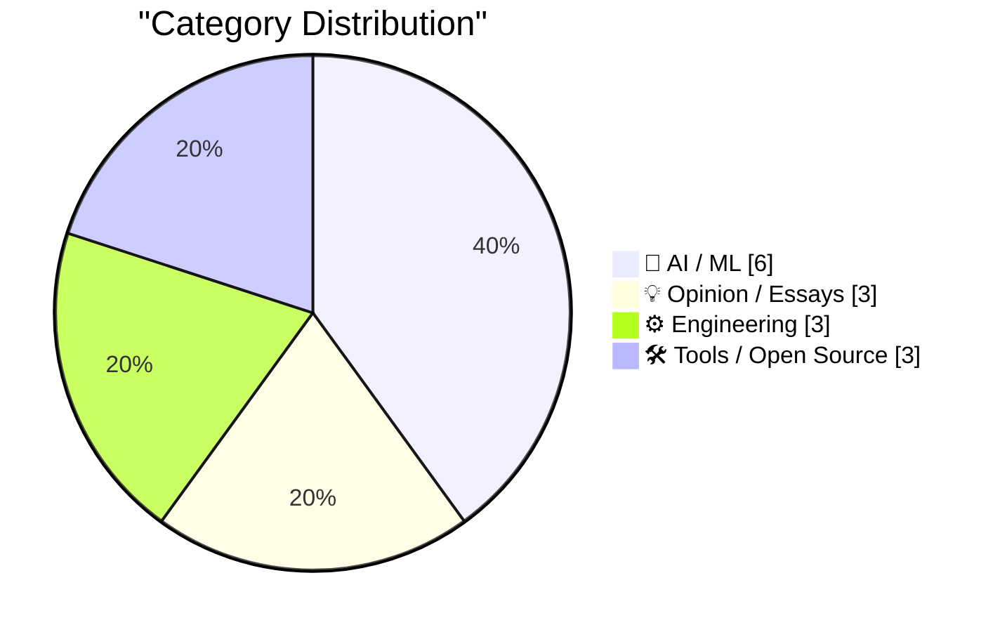
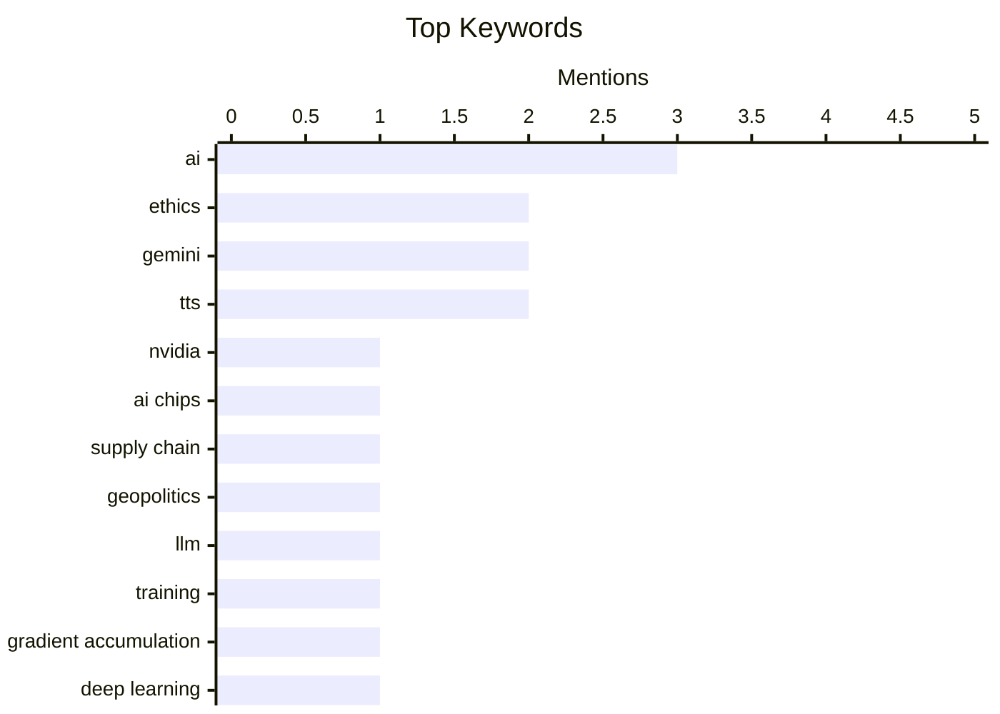

## Today's Highlights
Today's tech highlights underscore the dual nature of artificial intelligence: rapid advancement alongside intense strategic and ethical scrutiny. Companies are navigating complex geopolitical landscapes for AI hardware, while developers continue to push boundaries, from training advanced LLMs locally to deploying new text-to-speech models. This swift progress fuels a critical discourse, with ongoing debates addressing AI's societal impact, safety concerns, and even existential risks.
---
## Must Read Today
1. **Jensen Huang – TPU competition, why we should sell chips to China, & Nvidia’s supply chain moat**
[Jensen Huang – TPU competition, why we should sell chips to China, & Nvidia’s supply chain moat](https://www.dwarkesh.com/p/jensen-huang) — dwarkesh.com · 22h ago · 💡 Opinion / Essays
> This article features an interview with Jensen Huang, CEO of Nvidia, discussing the company's strategic position in the AI chip market. Huang addresses competition from Google's TPUs, emphasizing Nvidia's full-stack approach with CUDA software and a broad ecosystem as a key differentiator beyond raw chip performance. He argues for selling chips to China to foster global innovation and prevent market fragmentation, while also highlighting Nvidia's robust supply chain, capable of scaling to a "trillion dollars in scale" in the coming years. The core takeaway is Nvidia's confidence in its integrated hardware-software strategy, global market approach, and supply chain resilience to maintain its leadership in the rapidly expanding AI sector.
💡 **Why read it**: It offers direct insights from Nvidia's CEO on critical industry topics like AI chip competition, geopolitical trade, and supply chain strategy.
🏷️ Nvidia, AI chips, supply chain, geopolitics
2. **Writing an LLM from scratch, part 32k -- Interventions: training a better model locally with gradient accumulation**
[Writing an LLM from scratch, part 32k -- Interventions: training a better model locally with gradient accumulation](https://www.gilesthomas.com/2026/04/llm-from-scratch-32k-interventions-training-our-best-model-locally-gradient-accumulation) — gilesthomas.com · 18h ago · 🤖 AI / ML
> This article details the process of training a GPT-2-small-style LLM locally, building upon Sebastian Raschka's "Build a Large Language Model (from Scratch)" book. The author focuses on "interventions" to improve model performance, specifically using gradient accumulation to simulate larger batch sizes on resource-constrained local hardware. This technique allows for more stable and effective training by accumulating gradients over several mini-batches before performing a single optimization step, mimicking the effect of a larger batch size without requiring excessive GPU memory. The key finding is that gradient accumulation is a viable strategy for achieving better model training outcomes locally, especially when cloud resources are limited or expensive.
💡 **Why read it**: It provides practical, hands-on advice for training LLMs on local hardware using gradient accumulation, a crucial technique for resource-constrained developers.
🏷️ LLM, Training, Gradient Accumulation, Deep Learning
3. **AI cybersecurity is not proof of work**
[AI cybersecurity is not proof of work](http://antirez.com/news/163) — antirez.com · 3h ago · 🤖 AI / ML
> This article argues against the analogy of AI cybersecurity to "proof of work" systems, highlighting fundamental differences in their operational dynamics. The author contends that while proof of work guarantees a solution with enough effort due to its probabilistic nature, bug finding in software, even with AI, is not guaranteed and doesn't follow the same resource asymmetry. Bugs are distinct because LLM executions take different branches, eventually saturating possible states, and sampling a model for a bug in a given code doesn't equate to finding a hash collision. The main conclusion is that the "proof of work" metaphor is misleading for AI cybersecurity, as bug discovery involves exploring a finite but complex state space rather than a probabilistic search with guaranteed success.
💡 **Why read it**: It offers a critical perspective on common analogies in AI cybersecurity, clarifying why the "proof of work" model is inappropriate for understanding bug discovery.
🏷️ AI, Cybersecurity, Proof of Work, Bugs
---
## Data Overview
| Sources Scanned | Articles Fetched | Time Window | Selected |
|:---:|:---:|:---:|:---:|
| 89/92 | 2542 -> 26 | 24h | **15** |
### Category Distribution

### Top Keywords

<details>
<summary>Plain Text Keyword Chart (Terminal Friendly)</summary>
```
ai           │ ████████████████████ 3
ethics       │ █████████████░░░░░░░ 2
gemini       │ █████████████░░░░░░░ 2
tts          │ █████████████░░░░░░░ 2
nvidia       │ ███████░░░░░░░░░░░░░ 1
ai chips     │ ███████░░░░░░░░░░░░░ 1
supply chain │ ███████░░░░░░░░░░░░░ 1
geopolitics  │ ███████░░░░░░░░░░░░░ 1
llm          │ ███████░░░░░░░░░░░░░ 1
training     │ ███████░░░░░░░░░░░░░ 1
```
</details>
### Topic Tags
**ai**(3) · **ethics**(2) · **gemini**(2) · tts(2) · nvidia(1) · ai chips(1) · supply chain(1) · geopolitics(1) · llm(1) · training(1) · gradient accumulation(1) · deep learning(1) · cybersecurity(1) · proof of work(1) · bugs(1) · doomerism(1) · cory doctorow(1) · criticism(1) · limitations(1) · gary marcus(1)
---
## AI / ML
### 1. Writing an LLM from scratch, part 32k -- Interventions: training a better model locally with gradient accumulation
[Writing an LLM from scratch, part 32k -- Interventions: training a better model locally with gradient accumulation](https://www.gilesthomas.com/2026/04/llm-from-scratch-32k-interventions-training-our-best-model-locally-gradient-accumulation) — **gilesthomas.com** · 18h ago · ⭐ 28/30
> This article details the process of training a GPT-2-small-style LLM locally, building upon Sebastian Raschka's "Build a Large Language Model (from Scratch)" book. The author focuses on "interventions" to improve model performance, specifically using gradient accumulation to simulate larger batch sizes on resource-constrained local hardware. This technique allows for more stable and effective training by accumulating gradients over several mini-batches before performing a single optimization step, mimicking the effect of a larger batch size without requiring excessive GPU memory. The key finding is that gradient accumulation is a viable strategy for achieving better model training outcomes locally, especially when cloud resources are limited or expensive.
🏷️ LLM, Training, Gradient Accumulation, Deep Learning
---
### 2. AI cybersecurity is not proof of work
[AI cybersecurity is not proof of work](http://antirez.com/news/163) — **antirez.com** · 3h ago · ⭐ 26/30
> This article argues against the analogy of AI cybersecurity to "proof of work" systems, highlighting fundamental differences in their operational dynamics. The author contends that while proof of work guarantees a solution with enough effort due to its probabilistic nature, bug finding in software, even with AI, is not guaranteed and doesn't follow the same resource asymmetry. Bugs are distinct because LLM executions take different branches, eventually saturating possible states, and sampling a model for a bug in a given code doesn't equate to finding a hash collision. The main conclusion is that the "proof of work" metaphor is misleading for AI cybersecurity, as bug discovery involves exploring a finite but complex state space rather than a probabilistic search with guaranteed success.
🏷️ AI, Cybersecurity, Proof of Work, Bugs
---
### 3. Peak absurdity, Part II
[Peak absurdity, Part II](https://garymarcus.substack.com/p/peak-absurdity-part-ii) — **garymarcus.substack.com** · 17h ago · ⭐ 26/30
> This article, titled "Peak absurdity, Part II," likely continues a critique of current trends or claims within the field of artificial intelligence. While the provided snippet is minimal ("You can’t make this up"), Gary Marcus is known for his skeptical stance on the capabilities and hype surrounding large language models and general AI. The article implicitly targets instances of overstatement, logical fallacies, or unrealistic expectations regarding AI's current state or future potential. The likely conclusion is a reinforcement of the author's consistent argument that much of the AI discourse is detached from reality, bordering on the absurd.
🏷️ AI, Criticism, Limitations, Gary Marcus
---
### 4. Gemini 3.1 Flash TTS
[Gemini 3.1 Flash TTS](https://simonwillison.net/2026/Apr/15/gemini-31-flash-tts/#atom-everything) — **simonwillison.net** · 20h ago · ⭐ 24/30
> Google has released Gemini 3.1 Flash TTS, a new text-to-speech model accessible via the standard Gemini API using the `gemini-3.1-flash-tts-preview` model ID. This model distinguishes itself by allowing direction through prompts, enabling users to influence the generated speech's style or characteristics. Currently, it is limited to outputting audio files. This advancement suggests a move towards more controllable and nuanced speech synthesis, integrating generative AI capabilities into TTS. The main takeaway is that Gemini 3.1 Flash TTS represents a significant step in making highly customizable and prompt-driven text-to-speech technology available to developers.
🏷️ Gemini, TTS, AI model, Google AI
---
### 5. Quoting Kyle Kingsbury
[Quoting Kyle Kingsbury](https://simonwillison.net/2026/Apr/15/kyle-kingsbury/#atom-everything) — **simonwillison.net** · 22h ago · ⭐ 24/30
> This article quotes Kyle Kingsbury (Aphyr) on the emerging role of "meat shields" in the context of machine learning systems. Kingsbury posits that as ML systems become more prevalent, human beings will be employed, explicitly or implicitly, to bear accountability for their decisions. This accountability can manifest internally, such as Meta hiring humans to review automated moderation, or externally, like lawyers facing penalties for submitting LLM-generated lies in court. The concept extends to various forms of liability, including financial and legal. The core takeaway is that human oversight and accountability will become increasingly critical and formalized roles as ML systems are deployed in sensitive applications.
🏷️ AI accountability, ML systems, ethics, meat shields
---
### 6. Gemini 3.1 Flash TTS
[Gemini 3.1 Flash TTS](https://simonwillison.net/2026/Apr/15/gemini-flash-tts/#atom-everything) — **simonwillison.net** · 21h ago · ⭐ 21/30
> This article introduces a new text-to-speech (TTS) model, Gemini 3.1 Flash TTS, developed by Google. Simon Willison provides notes on Google's new Gemini 3.1 Flash TTS model, highlighting its capabilities as a text-to-speech tool. The article points to `tools.simonwillison.net/gemini-flash-tts` as a direct tool for interacting with this model. It is tagged under "gemini" and "google," indicating its origin and integration within the Gemini ecosystem. Gemini 3.1 Flash TTS represents Google's latest offering in text-to-speech technology, available for practical use through Simon Willison's tool.
🏷️ Gemini, TTS, AI tool, text-to-speech
---
## Opinion / Essays
### 7. Jensen Huang – TPU competition, why we should sell chips to China, & Nvidia’s supply chain moat
[Jensen Huang – TPU competition, why we should sell chips to China, & Nvidia’s supply chain moat](https://www.dwarkesh.com/p/jensen-huang) — **dwarkesh.com** · 22h ago · ⭐ 29/30
> This article features an interview with Jensen Huang, CEO of Nvidia, discussing the company's strategic position in the AI chip market. Huang addresses competition from Google's TPUs, emphasizing Nvidia's full-stack approach with CUDA software and a broad ecosystem as a key differentiator beyond raw chip performance. He argues for selling chips to China to foster global innovation and prevent market fragmentation, while also highlighting Nvidia's robust supply chain, capable of scaling to a "trillion dollars in scale" in the coming years. The core takeaway is Nvidia's confidence in its integrated hardware-software strategy, global market approach, and supply chain resilience to maintain its leadership in the rapidly expanding AI sector.
🏷️ Nvidia, AI chips, supply chain, geopolitics
---
### 8. Pluralistic: A Pascal's Wager for AI Doomers (16 Apr 2026)
[Pluralistic: A Pascal's Wager for AI Doomers (16 Apr 2026)](https://pluralistic.net/2026/04/16/pascals-wager/) — **pluralistic.net** · 2h ago · ⭐ 26/30
> This article presents "A Pascal's Wager for AI Doomers," framing the debate around AI's existential risks. The core argument suggests that even if the probability of AI leading to catastrophic outcomes (like being "turned into paperclips") is low, the potential consequences are so severe that it warrants significant preventative action. The author implies that the current trajectory of AI development already exhibits concerning trends, referencing various contemporary issues like "Open DRM" and "Copyrighted Klingon" in the context of digital rights and control. The main takeaway is a call for caution and proactive measures against potential negative AI impacts, regardless of the perceived likelihood of extreme scenarios.
🏷️ AI, Ethics, Doomerism, Cory Doctorow
---
### 9. Quoting John Gruber
[Quoting John Gruber](https://simonwillison.net/2026/Apr/15/john-gruber/#atom-everything) — **simonwillison.net** · 20h ago · ⭐ 21/30
> This article quotes John Gruber's observation about the waning competitive edge of Apple's platforms (iPhone, Mac, iPad) regarding third-party software quality. Gruber argues that Apple's "real goldmine" isn't App Store cuts, but rather having the best apps, which draws users to their hardware. He notes this edge is diminishing, not because competing platforms' software is improving, but because third-party software on Apple platforms is "regressing to the mean." This regression is attributed to fewer developers caring deeply about crafting exceptional software, leading to a decline in overall app quality and distinctiveness. The decline in unique, high-quality third-party software on Apple platforms threatens their long-term competitive advantage, as it removes a key differentiator for users.
🏷️ Apple, App Store, platform strategy, user acquisition
---
## Engineering
### 10. SQLAlchemy 2 In Practice - Chapter 5 - Advanced Many-To-Many Relationships
[SQLAlchemy 2 In Practice - Chapter 5 - Advanced Many-To-Many Relationships](https://blog.miguelgrinberg.com/post/sqlalchemy-2-in-practice---chapter-5---advanced-many-to-many-relationships) — **miguelgrinberg.com** · 2h ago · ⭐ 24/30
> This article, Chapter 5 of "SQLAlchemy 2 in Practice," delves into advanced many-to-many relationships within relational databases using SQLAlchemy 2. It builds upon foundational database design blocks, focusing on scenarios where standard many-to-many implementations require "tweaking" for specific business logic or data requirements. The chapter likely covers techniques such as associating additional data with the association table itself, using custom association objects, or handling complex join conditions. The main takeaway is that SQLAlchemy 2 provides powerful and flexible tools for modeling and interacting with intricate many-to-many relationships beyond simple linking tables.
🏷️ SQLAlchemy, Python, ORM, database
---
### 11. A sufficiently comprehensive spec is not (necessarily) code
[A sufficiently comprehensive spec is not (necessarily) code](https://buttondown.com/hillelwayne/archive/a-sufficiently-comprehensive-spec-is-not/) — **buttondown.com/hillelwayne** · 21h ago · ⭐ 22/30
> This article addresses the common misconception that a sufficiently detailed specification can replace code or that a spec *is* code, often illustrated by a comic where a business person believes a detailed spec eliminates the need for coders. It argues against the idea that a spec, no matter how comprehensive, can fully capture the executable logic and nuances of a software system in the same way code does. Specs define *what* should be built, while code defines *how* it is built and executed, including handling edge cases and implementation details. The author emphasizes that the act of coding involves translating abstract requirements into concrete, runnable instructions, a process distinct from writing a specification. A detailed specification is a valuable tool for communication and design, but it serves a different purpose than actual code and cannot fully substitute for the implementation effort.
🏷️ specifications, software design, requirements
---
### 12. An Arm Mainboard for the Framework Laptop
[An Arm Mainboard for the Framework Laptop](https://www.jeffgeerling.com/blog/2026/arm-mainboard-for-framework-laptop/) — **jeffgeerling.com** · 23h ago · ⭐ 21/30
> This article explores the performance of an Arm-based mainboard within the repair-friendly Framework 13 laptop chassis, comparing it to existing x86 and RISC-V options. Jeff Geerling tested the MetaComputing AI PC, the only Arm Mainboard available for the Framework 13, featuring a 12-core Arm SoC and up to 32 GB of RAM. This test follows previous evaluations of a low-end x86 Ryzen AI 5 340 Mainboard and the fastest RISC-V option, the DC-ROMA II. The article likely details the performance benchmarks and user experience of this Arm configuration. The MetaComputing AI PC provides an Arm-based alternative for the Framework 13, expanding the modular laptop's hardware ecosystem beyond x86 and RISC-V.
🏷️ Framework Laptop, Arm mainboard, RISC-V, modular hardware
---
## Tools / Open Source
### 13. Features everyone should steal from npmx
[Features everyone should steal from npmx](https://nesbitt.io/2026/04/16/features-everyone-should-steal-from-npmx.html) — **nesbitt.io** · 4h ago · ⭐ 23/30
> This article explores innovative features from `npmx`, a user-designed package registry frontend, suggesting they should be adopted by other package managers. The core idea is to highlight how user-centric design can lead to superior developer experience in package management. While specific features aren't detailed in the snippet, `npmx` is known for enhancing the command-line interface for `npm` with features like better search, interactive package exploration, and improved dependency visualization. The main takeaway is that package manager developers should look to community-driven tools like `npmx` for inspiration to significantly improve usability and functionality.
🏷️ npmx, package manager, developer tools, UX
---
### 14. datasette 1.0a27
[datasette 1.0a27](https://simonwillison.net/2026/Apr/15/datasette/#atom-everything) — **simonwillison.net** · 14h ago · ⭐ 22/30
> This article announces the release of Datasette 1.0a27, featuring two major changes. The first significant update is the removal of Django-style CSRF form tokens, replaced by modern browser headers for CSRF protection, as recommended by Filippo Valsorda. This shift simplifies security implementation and aligns with contemporary web security practices. The second major change, though not fully detailed in the snippet, likely involves another substantial improvement to Datasette's core functionality or architecture. The main takeaway is that Datasette 1.0a27 brings important security and potentially other architectural enhancements, moving towards a more robust and modern platform.
🏷️ Datasette, alpha release, major changes, CSRF
---
### 15. datasette-export-database 0.3a1
[datasette-export-database 0.3a1](https://simonwillison.net/2026/Apr/15/datasette-export-database/#atom-everything) — **simonwillison.net** · 14h ago · ⭐ 19/30
> The `datasette-export-database` plugin required an update due to a change in how Datasette handles CSRF tokens in its 1.0a27 release. Version 0.3a1 of the `datasette-export-database` plugin was released to address a breaking change introduced in Datasette 1.0a27. Previously, the plugin used the `ds_csrftoken` cookie as part of a custom signed URL, but Datasette 1.0a27 "no longer sets that cookie." The update likely modifies the plugin's logic to adapt to this new CSRF token handling mechanism. `datasette-export-database 0.3a1` ensures compatibility with Datasette 1.0a27 by updating its CSRF token handling.
🏷️ Datasette plugin, CSRF token, release, security fix
---
*Generated at 2026-04-16 14:01 | Scanned 89 sources -> 2542 articles -> selected 15*
*Based on the [Hacker News Popularity Contest 2025](https://refactoringenglish.com/tools/hn-popularity/) RSS source list recommended by [Andrej Karpathy](https://x.com/karpathy)*
*Produced by Dongdianr AI. Follow the same-name WeChat public account for more AI practical tips 💡*
