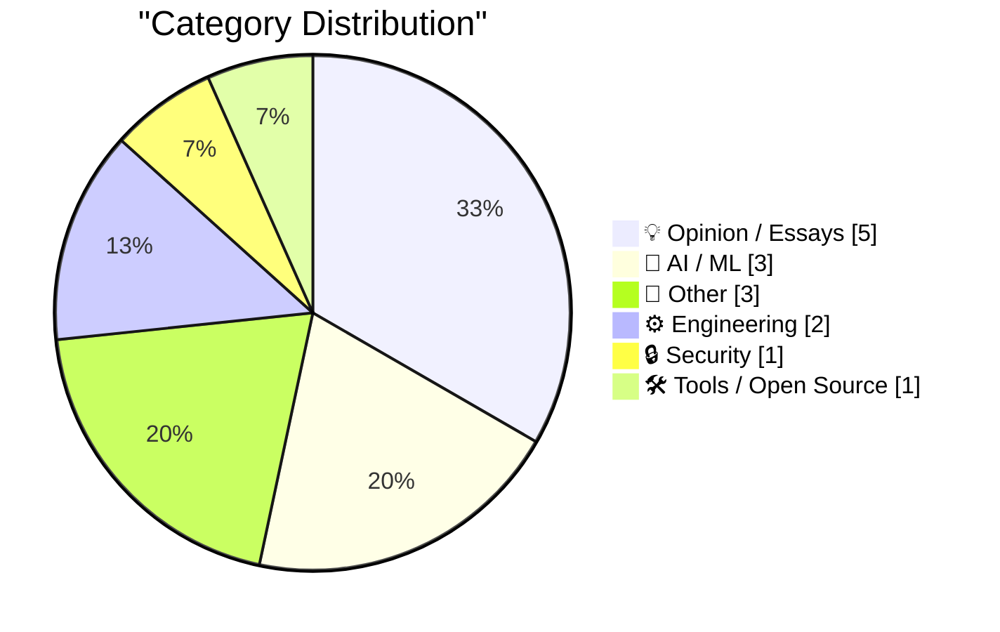
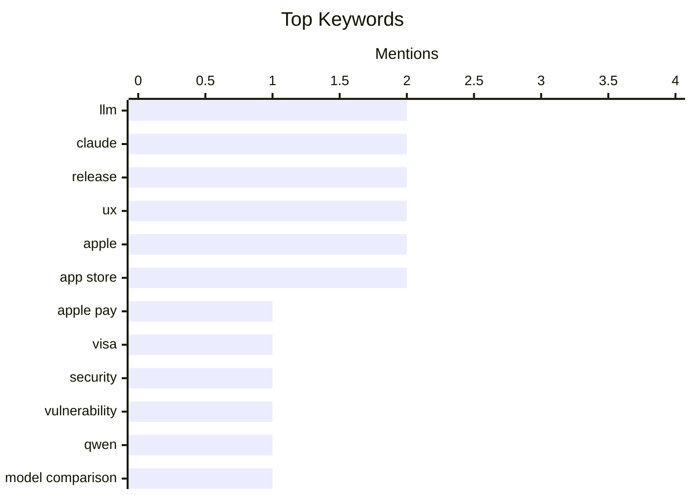

## Today's Highlights
Today's tech landscape showcases the rapid advancement of AI, with new models excelling in image generation and agentic capabilities finding practical security applications. Despite these innovations, critical vulnerabilities persist, notably a scam risk identified in Apple Pay's Express Transit mode when paired with Visa cards. This comes as user experience challenges also emerge, from Netflix's custom video player reportedly degrading its Apple TV app to broader discussions on digital platform influence.
---
## Must Read Today
1. **Apple Pay Express Transit Mode, When Used With a Visa Card, Is Vulnerable to Scam Tap-to-Pay Readers**
[Apple Pay Express Transit Mode, When Used With a Visa Card, Is Vulnerable to Scam Tap-to-Pay Readers](https://www.macrumors.com/2026/04/15/apple-pay-visa-transit-exploit/) — daringfireball.net · 19h ago · 🔒 Security
> Apple Pay's Express Transit Mode, when paired with a Visa card, is susceptible to a scam where unauthorized tap-to-pay readers can process transactions without user authentication. This vulnerability is specific to Visa cards due to their security methods and does not affect Mastercard, American Express, or Samsung Pay. The exploit requires the victim to have Express Transit Mode enabled and a Visa card linked, allowing a malicious reader to bypass the usual payment authentication. This is identified as a Visa-related security loophole, not an iPhone issue. Users with Apple Pay Express Transit Mode and a Visa card should be aware of this specific security risk.
💡 **Why read it**: It highlights a critical security vulnerability in a widely used payment system, specifically affecting Apple Pay with Visa cards in Express Transit Mode.
🏷️ Apple Pay, Visa, security, vulnerability
2. **Qwen3.6-35B-A3B on my laptop drew me a better pelican than Claude Opus 4.7**
[Qwen3.6-35B-A3B on my laptop drew me a better pelican than Claude Opus 4.7](https://simonwillison.net/2026/Apr/16/qwen-beats-opus/#atom-everything) — simonwillison.net · 20h ago · 🤖 AI / ML
> The article compares the image generation capabilities of two new large language models, Alibaba's Qwen3.6-35B-A3B and Anthropic's Claude Opus 4.7, using a "pelican riding a bicycle" benchmark. Qwen3.6-35B-A3B, despite running locally on a laptop, produced a visually superior pelican image compared to Claude Opus 4.7. This suggests that smaller, locally runnable models can sometimes outperform larger, cloud-based models in specific creative tasks. The comparison uses a non-robust, anecdotal benchmark for illustrative purposes. Qwen3.6-35B-A3B demonstrates impressive local image generation capabilities, potentially challenging the perceived superiority of larger, more complex models for certain creative prompts.
💡 **Why read it**: It offers a direct, anecdotal comparison of new LLM image generation capabilities, highlighting that local models like Qwen3.6-35B-A3B can compete with or surpass leading cloud models like Claude Opus 4.7 for specific creative tasks.
🏷️ LLM, Qwen, Claude, model comparison
3. **Here's What Agentic AI Can Do With Have I Been Pwned's APIs**
[Here's What Agentic AI Can Do With Have I Been Pwned's APIs](https://www.troyhunt.com/heres-what-agentic-ai-can-do-with-have-i-been-pwneds-apis/) — troyhunt.com · 14h ago · 🤖 AI / ML
> The article explores the practical applications of agentic AI, specifically demonstrating how it can interact with the Have I Been Pwned (HIBP) APIs to perform useful tasks. Agentic AI, when integrated with HIBP's APIs, can automate the process of checking for data breaches related to email addresses or domains. This allows for proactive security monitoring and rapid assessment of exposure to known breaches. The author emphasizes finding "gold" in AI by focusing on genuinely useful applications rather than hyperbole. Agentic AI offers significant potential for enhancing cybersecurity by automating interactions with services like HIBP, providing practical and meaningful security benefits.
💡 **Why read it**: It provides a concrete example of how agentic AI can be leveraged for practical cybersecurity applications by interacting with real-world APIs like Have I Been Pwned.
🏷️ Agentic AI, Have I Been Pwned, APIs, AI Applications
---
## Data Overview
| Sources Scanned | Articles Fetched | Time Window | Selected |
|:---:|:---:|:---:|:---:|
| 89/92 | 2542 -> 17 | 24h | **15** |
### Category Distribution

### Top Keywords

<details>
<summary>Plain Text Keyword Chart (Terminal Friendly)</summary>
```
llm           │ ████████████████████ 2
claude        │ ████████████████████ 2
release       │ ████████████████████ 2
ux            │ ████████████████████ 2
apple         │ ████████████████████ 2
app store     │ ████████████████████ 2
apple pay     │ ██████████░░░░░░░░░░ 1
visa          │ ██████████░░░░░░░░░░ 1
security      │ ██████████░░░░░░░░░░ 1
vulnerability │ ██████████░░░░░░░░░░ 1
```
</details>
### Topic Tags
**llm**(2) · **claude**(2) · **release**(2) · ux(2) · apple(2) · app store(2) · apple pay(1) · visa(1) · security(1) · vulnerability(1) · qwen(1) · model comparison(1) · agentic ai(1) · have i been pwned(1) · apis(1) · ai applications(1) · anthropic(1) · datasette(1) · data tool(1) · python(1)
---
## Opinion / Essays
### 1. Pluralistic: Tiktokification shall set us free (17 Apr 2026)
[Pluralistic: Tiktokification shall set us free (17 Apr 2026)](https://pluralistic.net/2026/04/17/for-youze/) — **pluralistic.net** · 3h ago · ⭐ 23/30
> This article, part of Cory Doctorow's "Pluralistic" series, discusses the concept of "Tiktokification" and its implications for user freedom and platform control. The central theme, "Zuck keeps accidentally freeing his hostages," suggests that platform changes, even those intended to increase control or engagement (like "Tiktokification"), can inadvertently create opportunities for users to escape walled gardens or regain agency. The article also lists various other links and topics, indicating a broader commentary on technology, politics, and consumer rights. The article posits that the "Tiktokification" trend, despite its potential for platform lock-in, might paradoxically lead to greater user freedom by exposing vulnerabilities or creating unintended escape routes from dominant platforms.
🏷️ Tech Policy, Platform Lock-in, Interoperability, Tiktokification
---
### 2. Why I refrain from infosec punditry
[Why I refrain from infosec punditry](https://lcamtuf.substack.com/p/why-i-refrain-from-infosec-punditry) — **lcamtuf.substack.com** · 22h ago · ⭐ 21/30
> The author explains their deliberate choice to avoid engaging in information security (infosec) punditry on their Substack, despite it being their primary field of expertise. While the author possesses a deep professional background in infosec, they choose not to use their platform for commentary on the subject. The article implies a distinction between professional work and public commentary, possibly due to the nature of punditry, its potential for misinterpretation, or a desire to focus on other topics. The author consciously refrains from infosec punditry, indicating a personal or professional boundary regarding public discourse in their expert domain.
🏷️ Infosec, Punditry, Career, Personal Reflection
---
### 3. Bonus Thought Regarding the Name ‘iPhone Ultra’
[Bonus Thought Regarding the Name ‘iPhone Ultra’](https://daringfireball.net/linked/2026/04/14/name-of-foldable-iphone) — **daringfireball.net** · 22h ago · ⭐ 20/30
> The article speculates on the implications of Apple potentially naming its rumored two-screen folding iPhone "iPhone Ultra." If Apple uses "iPhone Ultra" for a folding phone, it would strongly suggest they have no plans to release a "rugged" iPhone model, similar to the Apple Watch Ultra. The author believes Apple sees no market for a dedicated rugged iPhone, as users who desire durability typically opt for extra-thick cases on standard iPhones, unlike the distinct need for a rugged Apple Watch. Naming a folding iPhone "Ultra" would likely signal Apple's strategy to differentiate its high-end, innovative devices rather than creating a rugged phone category.
🏷️ iPhone, folding phone, Apple, product naming
---
### 4. App Store Reviews Are Busted
[App Store Reviews Are Busted](https://blog.terrygodier.com/2026/04/13/app-store-reviews-are-busted.html) — **daringfireball.net** · 13h ago · ⭐ 19/30
> App Store Reviews Are Busted
🏷️ App Store, reviews, ratings, UX
---
### 5. Freecash Was More Like Scamcash
[Freecash Was More Like Scamcash](https://techcrunch.com/2026/04/14/how-the-rewards-app-freecash-scammed-its-way-to-the-top-of-the-app-stores/) — **daringfireball.net** · 13h ago · ⭐ 19/30
> Freecash Was More Like Scamcash
🏷️ Freecash, scam, TikTok, app store
---
## AI / ML
### 6. Qwen3.6-35B-A3B on my laptop drew me a better pelican than Claude Opus 4.7
[Qwen3.6-35B-A3B on my laptop drew me a better pelican than Claude Opus 4.7](https://simonwillison.net/2026/Apr/16/qwen-beats-opus/#atom-everything) — **simonwillison.net** · 20h ago · ⭐ 27/30
> The article compares the image generation capabilities of two new large language models, Alibaba's Qwen3.6-35B-A3B and Anthropic's Claude Opus 4.7, using a "pelican riding a bicycle" benchmark. Qwen3.6-35B-A3B, despite running locally on a laptop, produced a visually superior pelican image compared to Claude Opus 4.7. This suggests that smaller, locally runnable models can sometimes outperform larger, cloud-based models in specific creative tasks. The comparison uses a non-robust, anecdotal benchmark for illustrative purposes. Qwen3.6-35B-A3B demonstrates impressive local image generation capabilities, potentially challenging the perceived superiority of larger, more complex models for certain creative prompts.
🏷️ LLM, Qwen, Claude, model comparison
---
### 7. Here's What Agentic AI Can Do With Have I Been Pwned's APIs
[Here's What Agentic AI Can Do With Have I Been Pwned's APIs](https://www.troyhunt.com/heres-what-agentic-ai-can-do-with-have-i-been-pwneds-apis/) — **troyhunt.com** · 14h ago · ⭐ 27/30
> The article explores the practical applications of agentic AI, specifically demonstrating how it can interact with the Have I Been Pwned (HIBP) APIs to perform useful tasks. Agentic AI, when integrated with HIBP's APIs, can automate the process of checking for data breaches related to email addresses or domains. This allows for proactive security monitoring and rapid assessment of exposure to known breaches. The author emphasizes finding "gold" in AI by focusing on genuinely useful applications rather than hyperbole. Agentic AI offers significant potential for enhancing cybersecurity by automating interactions with services like HIBP, providing practical and meaningful security benefits.
🏷️ Agentic AI, Have I Been Pwned, APIs, AI Applications
---
### 8. llm-anthropic 0.25
[llm-anthropic 0.25](https://simonwillison.net/2026/Apr/16/llm-anthropic/#atom-everything) — **simonwillison.net** · 17h ago · ⭐ 26/30
> This article announces the release of `llm-anthropic` version 0.25, an update to a tool for interacting with Anthropic's language models. The new version introduces support for the `claude-opus-4.7` model, including its `thinking_effort: xhigh` parameter. It also adds new boolean options `thinking_display` and `thinking_adaptive`, with `thinking_display` summarized output currently limited to JSON output or logs. The default `max_tokens` has been increased, and a bug where `llm logs` would fail if `thinking_display` was enabled for a non-JSON output has been fixed. `llm-anthropic 0.25` enhances interaction with Anthropic models by adding support for the latest Claude Opus version and improving logging and output options.
🏷️ LLM, Anthropic, Claude, release
---
## Other
### 9. Rory Goss’s Accessibility Story
[Rory Goss’s Accessibility Story](https://www.apple.com/education/college-students/success-stories/goss/) — **daringfireball.net** · 23h ago · ⭐ 20/30
> This article and short film from Apple detail the accessibility journey of 16-year-old Rory Goss, who experienced sudden vision loss in January 2024. Rory, an 11th-grade straight-A student from Northern Ireland, suddenly lost the ability to see the whiteboard in class, impacting his studies for A-levels and university applications. The story highlights his passion for golf and cars, implying how his life and aspirations were affected. Apple's feature story likely showcases how their accessibility tools or support helped Rory navigate this challenge. Rory Goss's story underscores the profound impact of sudden vision loss on a young student's life and implicitly demonstrates the role of accessibility solutions in overcoming such challenges.
🏷️ Accessibility, Apple, Vision Loss, Human Interest
---
### 10. The last MP3 patent
[The last MP3 patent](https://dfarq.homeip.net/mp3-is-dead-long-live-mp3-oh-wait-its-just-the-patent/?utm_source=rss&#038;utm_medium=rss&#038;utm_campaign=mp3-is-dead-long-live-mp3-oh-wait-its-just-the-patent) — **dfarq.homeip.net** · 3h ago · ⭐ 20/30
> The last MP3 patent
🏷️ MP3, Patents, Intellectual Property, Tech History
---
### 11. How to Format 10-Digit Phone Numbers
[How to Format 10-Digit Phone Numbers](https://www.threads.com/@apstylebook/post/DXKtXVXEh7T) — **daringfireball.net** · 17h ago · ⭐ 18/30
> How to Format 10-Digit Phone Numbers
🏷️ phone numbers, formatting, AP Style, style guide
---
## Engineering
### 12. Chance Miller: ‘Netflix Ruined Its Apple TV App by Switching to a Custom Video Player’
[Chance Miller: ‘Netflix Ruined Its Apple TV App by Switching to a Custom Video Player’](https://9to5mac.com/2026/04/15/netflix-ruined-its-apple-tv-app-by-switching-to-a-custom-video-player/) — **daringfireball.net** · 18h ago · ⭐ 22/30
> Netflix has reportedly "ruined" its Apple TV app by replacing the native video player with a custom one, leading to widespread user frustration and subscription cancellations. The switch, rolled out weeks ago, eliminates key Apple TV features such as full playback controls via the Apple TV Remote app on iPhone and the ability to enable "Enhance Dialogue" directly from the video player. It also removes the clever feature that automatically enables subtitles when dialogue is quiet or unclear. Users are expressing their discontent on Reddit, with some canceling subscriptions. Netflix's decision to implement a custom video player on Apple TV has significantly degraded the user experience by removing essential native functionalities, causing substantial backlash.
🏷️ Netflix, Apple TV, video player, UX
---
### 13. The Secret Life of Circuits
[The Secret Life of Circuits](https://lcamtuf.substack.com/p/the-secret-life-of-circuits) — **lcamtuf.substack.com** · 17h ago · ⭐ 20/30
> The Secret Life of Circuits
🏷️ Circuit Design, Electronics, Hardware, Embedded Systems
---
## Security
### 14. Apple Pay Express Transit Mode, When Used With a Visa Card, Is Vulnerable to Scam Tap-to-Pay Readers
[Apple Pay Express Transit Mode, When Used With a Visa Card, Is Vulnerable to Scam Tap-to-Pay Readers](https://www.macrumors.com/2026/04/15/apple-pay-visa-transit-exploit/) — **daringfireball.net** · 19h ago · ⭐ 29/30
> Apple Pay's Express Transit Mode, when paired with a Visa card, is susceptible to a scam where unauthorized tap-to-pay readers can process transactions without user authentication. This vulnerability is specific to Visa cards due to their security methods and does not affect Mastercard, American Express, or Samsung Pay. The exploit requires the victim to have Express Transit Mode enabled and a Visa card linked, allowing a malicious reader to bypass the usual payment authentication. This is identified as a Visa-related security loophole, not an iPhone issue. Users with Apple Pay Express Transit Mode and a Visa card should be aware of this specific security risk.
🏷️ Apple Pay, Visa, security, vulnerability
---
## Tools / Open Source
### 15. datasette 1.0a28
[datasette 1.0a28](https://simonwillison.net/2026/Apr/17/datasette/#atom-everything) — **simonwillison.net** · 9h ago · ⭐ 24/30
> This article announces Datasette 1.0a28, a bugfix release addressing issues introduced in the previous alpha version, 1.0a27. The release specifically fixes a compatibility bug in 1.0a27 where `execute_write_fn()` callbacks with parameters would fail. It also resolves an issue where `datasette publish cloud` would incorrectly attempt to publish to a non-existent `datasette-cloud` plugin. These fixes ensure smoother operation and compatibility for users upgrading Datasette Cloud. Datasette 1.0a28 is a critical maintenance release that rectifies regressions from 1.0a27, improving stability and functionality for Datasette Cloud deployments.
🏷️ Datasette, release, data tool, Python
---
*Generated at 2026-04-17 14:01 | Scanned 89 sources -> 2542 articles -> selected 15*
*Based on the [Hacker News Popularity Contest 2025](https://refactoringenglish.com/tools/hn-popularity/) RSS source list recommended by [Andrej Karpathy](https://x.com/karpathy)*
*Produced by Dongdianr AI. Follow the same-name WeChat public account for more AI practical tips 💡*
