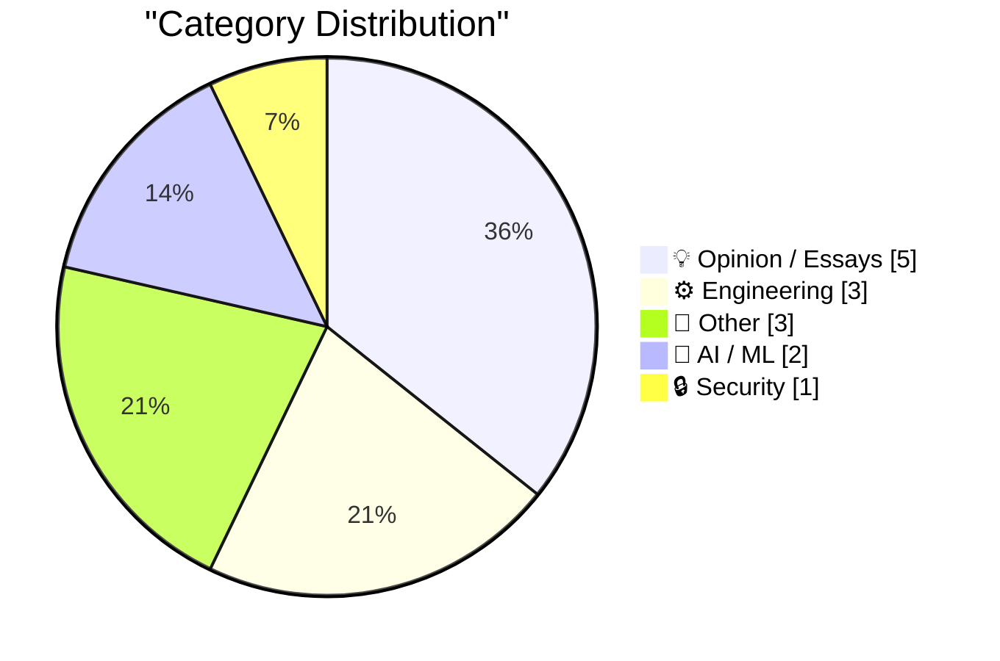
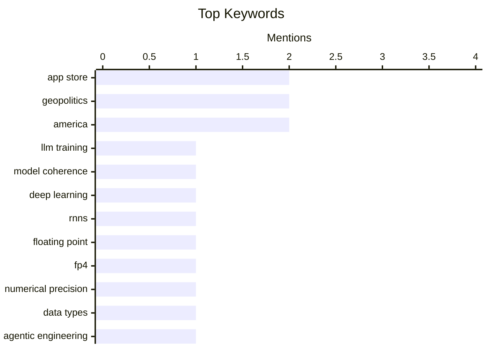

## Today's Highlights
Today's tech news highlights the rapid evolution and practical integration of AI, from improving LLM coherence and optimizing models with 4-bit floating point to its growing presence at major conferences. Meanwhile, the developer landscape faces ongoing challenges, exemplified by persistent issues with App Store reviews and guidelines. These advancements and platform dynamics underscore broader concerns about technology's societal impact, including critical security vulnerabilities in systems like voting technology.
---
## Must Read Today
1. **How an LLM becomes more coherent as we train it**
[How an LLM becomes more coherent as we train it](https://www.gilesthomas.com/2026/04/how-an-llm-becomes-more-coherent-over-training) — gilesthomas.com · 14h ago · 🤖 AI / ML
> This article explores the evolution of output coherence in a transformer-based LLM during training, drawing parallels to Andrej Karpathy's 2015 RNN observations. The author trained a GPT-2-small-style LLM, featuring 163 million parameters, on approximately 3.2 billion tokens (12.8 GiB of text). The goal was to visually demonstrate the progressive improvement in text generation quality as the model learns. The core takeaway is the observable, gradual emergence of linguistic structure and meaning in the generated text throughout the training process.
💡 **Why read it**: It provides a concrete, empirical demonstration of how LLM coherence develops over training with specific model parameters and data volume.
🏷️ LLM Training, Model Coherence, Deep Learning, RNNs
2. **4-bit floating point FP4**
[4-bit floating point FP4](https://www.johndcook.com/blog/2026/04/17/fp4/) — johndcook.com · 12h ago · ⚙️ Engineering
> This article introduces 4-bit floating point (FP4) numbers, contrasting them with traditional 32-bit `float` and 64-bit `double` precision formats. It briefly touches upon the historical evolution of floating-point standards and the potential implications of such low-precision formats. The article suggests FP4 could be a significant development for applications prioritizing memory or computational efficiency, particularly in AI/ML contexts. The main takeaway is the emergence of extremely low-precision floating-point formats like FP4, pushing the boundaries of numerical representation for specialized computing needs.
💡 **Why read it**: It highlights the cutting-edge development of FP4, a very low-precision floating-point format, which is crucial for understanding future computational efficiency in areas like AI.
🏷️ Floating Point, FP4, Numerical Precision, Data Types
3. **Adding a new content type to my blog-to-newsletter tool**
[Adding a new content type to my blog-to-newsletter tool](https://simonwillison.net/guides/agentic-engineering-patterns/adding-a-new-content-type/#atom-everything) — simonwillison.net · 10h ago · 🤖 AI / ML
> The article details the process of integrating a new content type into Simon Willison's blog-to-newsletter tool, which leverages Substack for distribution. It exemplifies an "agentic engineering pattern" where a concise prompt effectively accomplished substantial work in a single shot. The author utilizes this system to regularly syndicate blog content to a free Substack newsletter. The core takeaway is the demonstrated efficiency of well-crafted, short prompts in automating complex content management tasks within an "agentic engineering" framework.
💡 **Why read it**: It demonstrates a practical application of "agentic engineering" and prompt design for automating content syndication, offering insights into efficient development workflows.
🏷️ Agentic Engineering, LLM, Prompt Engineering, Newsletter Tool
---
## Data Overview
| Sources Scanned | Articles Fetched | Time Window | Selected |
|:---:|:---:|:---:|:---:|
| 88/92 | 2529 -> 14 | 24h | **14** |
### Category Distribution

### Top Keywords

<details>
<summary>Plain Text Keyword Chart (Terminal Friendly)</summary>
```
app store           │ ████████████████████ 2
geopolitics         │ ████████████████████ 2
america             │ ████████████████████ 2
llm training        │ ██████████░░░░░░░░░░ 1
model coherence     │ ██████████░░░░░░░░░░ 1
deep learning       │ ██████████░░░░░░░░░░ 1
rnns                │ ██████████░░░░░░░░░░ 1
floating point      │ ██████████░░░░░░░░░░ 1
fp4                 │ ██████████░░░░░░░░░░ 1
numerical precision │ ██████████░░░░░░░░░░ 1
```
</details>
### Topic Tags
**app store**(2) · **geopolitics**(2) · **america**(2) · llm training(1) · model coherence(1) · deep learning(1) · rnns(1) · floating point(1) · fp4(1) · numerical precision(1) · data types(1) · agentic engineering(1) · llm(1) · prompt engineering(1) · newsletter tool(1) · pycon us(1) · conference(1) · ai track(1) · security track(1) · anti-ai(1)
---
## Opinion / Essays
### 1. Many anti-AI arguments are conservative arguments
[Many anti-AI arguments are conservative arguments](https://seangoedecke.com/many-anti-ai-arguments-are-conservative/) — **seangoedecke.com** · 14h ago · ⭐ 24/30
> The article posits that many popular anti-AI criticisms, often framed with left-wing concerns like techno-fascism, carbon emissions, or labor displacement, are fundamentally conservative. It suggests these arguments frequently exhibit a resistance to change and innovation, aligning with a conservative impulse to preserve existing structures. The author challenges the common perception of AI critiques, arguing that a significant portion stems from an aversion to technological advancement rather than purely progressive ideals. The core takeaway is that a substantial number of anti-AI arguments, despite their progressive veneer, share underlying characteristics with conservative resistance to change.
🏷️ Anti-AI, AI Ethics, Political Arguments, Social Impact
---
### 2. We Are All Playing Politics at Work
[We Are All Playing Politics at Work](https://idiallo.com/blog/we-are-playing-politics?src=feed) — **idiallo.com** · 11h ago · ⭐ 20/30
> The article challenges the naive assumption that workplaces are purely rational environments where truth dictates action, defining "politics" as any discussion not solely steered by truth. It argues that individuals are inherently "political animals" navigating an imperfect world, not merely data-processing machines. The author contends that attempting to separate politics from work is unrealistic, as human interactions inevitably involve navigating differing agendas and perceptions. The core takeaway is that workplace politics are an unavoidable aspect of professional life, and acknowledging this reality is crucial for effective navigation.
🏷️ Workplace Politics, Career Advice, Soft Skills, Professional Development
---
### 3. Premium: The Hater's Guide to Private Credit
[Premium: The Hater's Guide to Private Credit](https://www.wheresyoured.at/hatersguide-privatecredit/) — **wheresyoured.at** · 21h ago · ⭐ 12/30
> The article appears to be a critical examination, or "hater's guide," to the private credit market, potentially highlighting aggressive marketing tactics and the nature of these financial products. The author recounts a personal experience of being inundated with daily text offers for business loans ranging from $150,000 after a single inquiry. This anecdote likely serves to illustrate the aggressive and potentially intrusive nature of private credit solicitation. The "hater's guide" framing suggests a critical analysis of the industry's practices and implications. The article likely aims to expose the downsides and potentially predatory aspects of the private credit sector, using personal experience as a starting point.
🏷️ Private Credit, Business Loans, Finance
---
### 4. America lost the Mandate of Heaven
[America lost the Mandate of Heaven](https://geohot.github.io//blog/jekyll/update/2026/04/18/america-mandate-of-heaven.html) — **geohot.github.io** · 22h ago · ⭐ 11/30
> This article discusses the concept of "Mandate of Heaven" in the context of America, questioning what constitutes national "winning" and implying a loss of this metaphorical mandate. While the snippet only poses the question "What does it mean if a country is winning?", the title suggests an argument that America has lost its perceived global or internal legitimacy and success. The article likely explores various metrics or societal conditions that indicate a decline in national standing, drawing parallels to the historical Chinese concept. It implicitly critiques current national performance by invoking a framework traditionally associated with leadership legitimacy and societal well-being. The piece likely concludes that America is no longer "winning" by certain unstated criteria, suggesting a need for re-evaluation of national direction and purpose.
🏷️ America, Geopolitics, Philosophy
---
### 5. Five Simple Steps to Fix America
[Five Simple Steps to Fix America](https://geohot.github.io//blog/jekyll/update/2026/04/18/five-simple-steps.html) — **geohot.github.io** · 22h ago · ⭐ 11/30
> This article proposes a series of "five simple steps" to address perceived issues and improve the state of America, driven by the author's belief in the nation's potential for "winning." The author, George Hotz, states they are returning to America for the summer and intends to outline specific, actionable advice to "fix up" the country. The premise is that America has significant untapped potential for success ("so much winning left") if it adopts these proposed straightforward measures. The article is framed as a direct intervention or guidance from the author, offering a clear path to national improvement. It aims to provide an optimistic roadmap for national improvement, asserting that simple changes can restore America's prosperity and standing.
🏷️ America, Politics, Solutions
---
## Engineering
### 6. 4-bit floating point FP4
[4-bit floating point FP4](https://www.johndcook.com/blog/2026/04/17/fp4/) — **johndcook.com** · 12h ago · ⭐ 26/30
> This article introduces 4-bit floating point (FP4) numbers, contrasting them with traditional 32-bit `float` and 64-bit `double` precision formats. It briefly touches upon the historical evolution of floating-point standards and the potential implications of such low-precision formats. The article suggests FP4 could be a significant development for applications prioritizing memory or computational efficiency, particularly in AI/ML contexts. The main takeaway is the emergence of extremely low-precision floating-point formats like FP4, pushing the boundaries of numerical representation for specialized computing needs.
🏷️ Floating Point, FP4, Numerical Precision, Data Types
---
### 7. Follow-Up Regarding App Store Reviews, Which Are Definitely Busted
[Follow-Up Regarding App Store Reviews, Which Are Definitely Busted](https://daringfireball.net/linked/2026/04/16/app-store-reviews-are-busted) — **daringfireball.net** · 13h ago · ⭐ 24/30
> This article follows up on the problematic state of App Store reviews, asserting they are "definitely busted." It discusses the dilemma developers face: apps that adhere to best practices by not soliciting reviews are penalized, while those that use review prompts gain thousands of reviews. Steven Troughton-Smith is quoted, emphasizing that review prompts are crucial for an app's visibility and to avoid "App Store Editorial suicide." The main takeaway is that despite Apple's guidelines, actively prompting for reviews is almost a necessity for app success and visibility on the App Store.
🏷️ App Store, App Reviews, Developer Experience, Apple Policy
---
### 8. Apple’s Developer Guidelines for Ratings and Review Prompts
[Apple’s Developer Guidelines for Ratings and Review Prompts](https://developer.apple.com/design/human-interface-guidelines/ratings-and-reviews#Best-practices) — **daringfireball.net** · 13h ago · ⭐ 20/30
> This article outlines Apple's Human Interface Guidelines for implementing ratings and review prompts within applications. Key best practices include avoiding pestering users, recommending a minimum of one to two weeks between requests, and prompting only after users demonstrate additional engagement. It also emphasizes utilizing the system-provided prompt in iOS, iPadOS, and macOS for a consistent, non-intrusive user experience. The main takeaway is Apple's official stance on ethical and user-friendly implementation of review prompts, aiming to balance developer needs with a positive user experience.
🏷️ Apple, App Store, Review Prompts, Developer Guidelines
---
## Other
### 9. Join us at PyCon US 2026 in Long Beach - we have new AI and security tracks this year
[Join us at PyCon US 2026 in Long Beach - we have new AI and security tracks this year](https://simonwillison.net/2026/Apr/17/pycon-us-2026/#atom-everything) — **simonwillison.net** · 14h ago · ⭐ 24/30
> This article announces PyCon US 2026, scheduled from May 13th to May 19th in Long Beach, California, with core conference talks from May 15th to 17th. A key highlight is the introduction of new AI and security tracks, signifying a notable expansion of the conference's thematic focus. This event marks PyCon US's first return to the West Coast since 2017 and to California since 2013. The main takeaway is the strategic addition of AI and security tracks to PyCon US 2026, reflecting the growing importance of these areas within the Python ecosystem.
🏷️ PyCon US, Conference, AI Track, Security Track
---
### 10. Reading List 04/18/2026
[Reading List 04/18/2026](https://www.construction-physics.com/p/reading-list-04182026) — **construction-physics.com** · 2h ago · ⭐ 17/30
> This article presents a curated reading list for April 18, 2026, covering a diverse range of topics relevant to construction, technology, and geopolitics. It highlights subjects such as a quadruped welding robot, the economic phenomenon termed "China Shock 2.0," emerging transformer startups, and observations on China’s mysteriously moving satellites. The list serves as a digest of interesting developments and analyses across various technical and economic domains. The main takeaway is a collection of intriguing, forward-looking articles spanning robotics, geopolitics, and emerging technologies.
🏷️ Reading List, Robotics, Geopolitics, Technology News
---
### 11. The Mystery of Rennes-le-Château, Part 4: Non-Fiction Meets Fiction
[The Mystery of Rennes-le-Château, Part 4: Non-Fiction Meets Fiction](https://www.filfre.net/2026/04/the-mystery-of-rennes-le-chateau-part-4-non-fiction-meets-fiction/) — **filfre.net** · 21h ago · ⭐ 17/30
> This article explores the historical and pseudo-historical foundations, particularly the book "The Holy Blood and the Holy Grail," that influenced the narrative of the video game Gabriel Knight 3: Blood of the Sacred, Blood of the Damned. It details the publication of "The Holy Blood and the Holy Grail" by Jonathan Cape in Britain on January 18, 1982, and its American release by Delacorte five weeks later. The series chronicles how these non-fiction (or pseudo-non-fiction) works shaped the fictional world and plot of the game. It highlights the direct connection between real-world publications and their adaptation into a popular cultural product. The article demonstrates how specific historical and pseudo-historical texts can profoundly influence and provide source material for fictional narratives, particularly in video games.
🏷️ Gabriel Knight, Video Game History, Mystery, Rennes-le-Château
---
## AI / ML
### 12. How an LLM becomes more coherent as we train it
[How an LLM becomes more coherent as we train it](https://www.gilesthomas.com/2026/04/how-an-llm-becomes-more-coherent-over-training) — **gilesthomas.com** · 14h ago · ⭐ 29/30
> This article explores the evolution of output coherence in a transformer-based LLM during training, drawing parallels to Andrej Karpathy's 2015 RNN observations. The author trained a GPT-2-small-style LLM, featuring 163 million parameters, on approximately 3.2 billion tokens (12.8 GiB of text). The goal was to visually demonstrate the progressive improvement in text generation quality as the model learns. The core takeaway is the observable, gradual emergence of linguistic structure and meaning in the generated text throughout the training process.
🏷️ LLM Training, Model Coherence, Deep Learning, RNNs
---
### 13. Adding a new content type to my blog-to-newsletter tool
[Adding a new content type to my blog-to-newsletter tool](https://simonwillison.net/guides/agentic-engineering-patterns/adding-a-new-content-type/#atom-everything) — **simonwillison.net** · 10h ago · ⭐ 24/30
> The article details the process of integrating a new content type into Simon Willison's blog-to-newsletter tool, which leverages Substack for distribution. It exemplifies an "agentic engineering pattern" where a concise prompt effectively accomplished substantial work in a single shot. The author utilizes this system to regularly syndicate blog content to a free Substack newsletter. The core takeaway is the demonstrated efficiency of well-crafted, short prompts in automating complex content management tasks within an "agentic engineering" framework.
🏷️ Agentic Engineering, LLM, Prompt Engineering, Newsletter Tool
---
## Security
### 14. Pluralistic: Georgia's voting technology blunder (18 Apr 2026)
[Pluralistic: Georgia's voting technology blunder (18 Apr 2026)](https://pluralistic.net/2026/04/18/dominion-sucks-actually/) — **pluralistic.net** · 1h ago · ⭐ 24/30
> This article discusses a voting technology blunder in Georgia, specifically concerning Dominion machines. It clarifies that while Dominion machines may have legitimate issues, these are distinct from the claims propagated by figures like Tucker Carlson. The piece implicitly distinguishes between verifiable technical flaws or operational problems and politically motivated misinformation regarding voting technology. The core takeaway is the importance of discerning factual issues with voting technology, such as Dominion machines, from politically charged narratives.
🏷️ Voting Technology, Election Security, Dominion Machines, Georgia
---
*Generated at 2026-04-18 14:01 | Scanned 88 sources -> 2529 articles -> selected 14*
*Based on the [Hacker News Popularity Contest 2025](https://refactoringenglish.com/tools/hn-popularity/) RSS source list recommended by [Andrej Karpathy](https://x.com/karpathy)*
*Produced by Dongdianr AI. Follow the same-name WeChat public account for more AI practical tips 💡*
