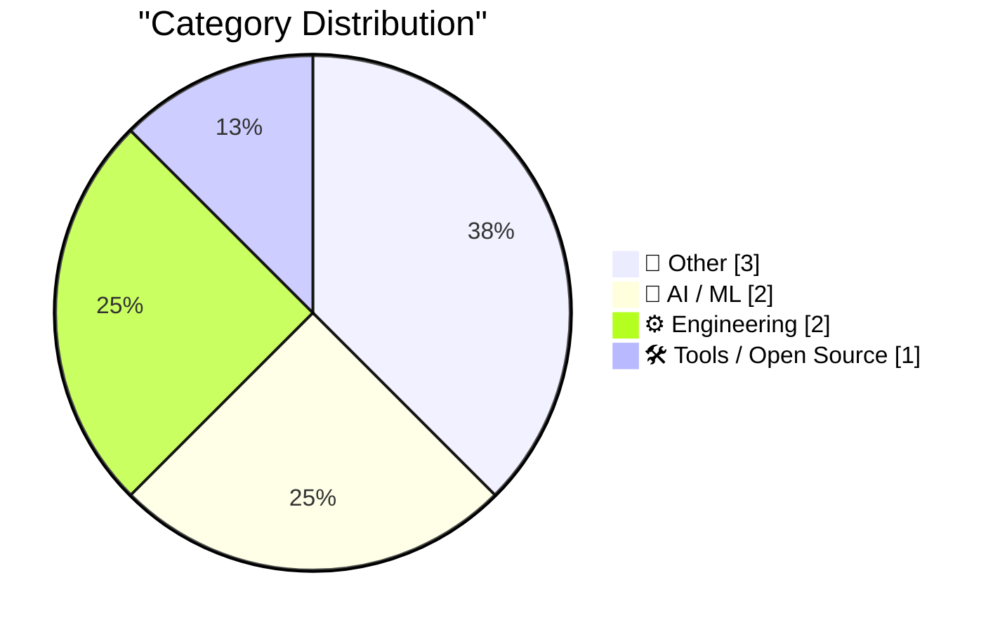
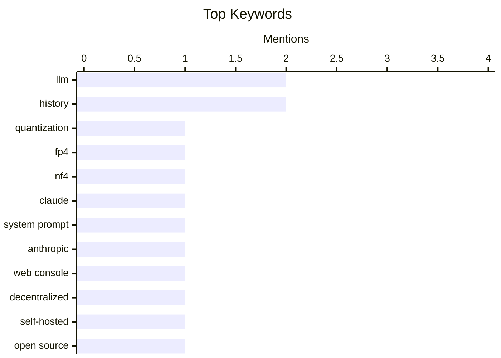

## Today's Highlights
Today's tech news showcases rapid advancements in AI, particularly in optimizing large language models through efficient quantization methods and evolving system prompts. Complementing this, new decentralized tools are emerging for self-hosted web management, reflecting a push towards greater user control. However, the hardware sector faces ongoing challenges, with significant supply shortages reported for popular devices like the Mac Mini and Mac Studio.
---
## Must Read Today
1. **Gaussian distributed weights for LLMs**
[Gaussian distributed weights for LLMs](https://www.johndcook.com/blog/2026/04/18/qlora/) — johndcook.com · 23h ago · 🤖 AI / ML
> This article discusses NF4 and FP4, two common 4-bit floating-point data types used for quantizing LLM weights within the bitsandbytes library. It explores their characteristics and higher-precision analogs, noting that downloaded Hugging Face LLM weights are frequently in one of these formats. Building on a previous discussion of FP4, the post likely delves into how these quantization methods affect model performance or efficiency. Understanding these specific 4-bit formats is crucial for optimizing LLM deployment and resource utilization. The core takeaway is the importance of these precise quantization schemes for practical LLM applications.
💡 **Why read it**: It provides technical insight into the specific 4-bit quantization formats (NF4, FP4) commonly used for LLM weights, which is essential for anyone working with efficient LLM deployment.
🏷️ LLM, Quantization, FP4, NF4
2. **Changes in the system prompt between Claude Opus 4.6 and 4.7**
[Changes in the system prompt between Claude Opus 4.6 and 4.7](https://simonwillison.net/2026/Apr/18/opus-system-prompt/#atom-everything) — simonwillison.net · 14h ago · 🤖 AI / ML
> This article examines the evolution of Anthropic's Claude.ai system prompts, specifically comparing the changes between Claude Opus 4.6 and the recently shipped Opus 4.7 (April 16, 2026). Anthropic uniquely publishes these prompts, with an archive dating back to Claude 3 in July 2024. Analyzing these iterative updates reveals how Anthropic refines its models' core instructions and desired behavior. The post highlights the critical significance of system prompt design in shaping AI model interactions and overall performance. The main conclusion is that subtle changes in system prompts can significantly alter an AI's operational characteristics.
💡 **Why read it**: It offers a rare look into how a major AI lab (Anthropic) iteratively refines its foundational model instructions through system prompt updates, providing valuable insights for prompt engineering and AI development.
🏷️ Claude, LLM, System Prompt, Anthropic
3. **Wander Console 0.5.0**
[Wander Console 0.5.0](https://susam.net/code/news/wander/0.5.0.html) — susam.net · 14h ago · 🛠 Tools / Open Source
> Wander Console 0.5.0 is the fifth release of a small, decentralized, self-hosted web console designed to help website visitors explore interesting sites recommended by a community of independent owners. The major new feature in this release is a built-in console network crawler, enhancing its ability to discover and present content. Users can try the console at susam.net/wander/ and find setup instructions in the project README. This update significantly expands Wander's functionality for community-driven web exploration and content discovery. The core takeaway is the introduction of a powerful new crawling capability for this unique web console.
💡 **Why read it**: It introduces a new version of a unique self-hosted, decentralized web console with a built-in network crawler, offering an alternative approach to web content discovery.
🏷️ Web Console, Decentralized, Self-hosted, Open Source
---
## Data Overview
| Sources Scanned | Articles Fetched | Time Window | Selected |
|:---:|:---:|:---:|:---:|
| 89/92 | 2541 -> 8 | 24h | **8** |
### Category Distribution

### Top Keywords

<details>
<summary>Plain Text Keyword Chart (Terminal Friendly)</summary>
```
llm           │ ████████████████████ 2
history       │ ████████████████████ 2
quantization  │ ██████████░░░░░░░░░░ 1
fp4           │ ██████████░░░░░░░░░░ 1
nf4           │ ██████████░░░░░░░░░░ 1
claude        │ ██████████░░░░░░░░░░ 1
system prompt │ ██████████░░░░░░░░░░ 1
anthropic     │ ██████████░░░░░░░░░░ 1
web console   │ ██████████░░░░░░░░░░ 1
decentralized │ ██████████░░░░░░░░░░ 1
```
</details>
### Topic Tags
**llm**(2) · **history**(2) · **quantization**(1) · fp4(1) · nf4(1) · claude(1) · system prompt(1) · anthropic(1) · web console(1) · decentralized(1) · self-hosted(1) · open source(1) · mac mini(1) · mac studio(1) · supply shortage(1) · apple(1) · ffmpeg(1) · video processing(1) · fisheye(1) · equirectangular(1)
---
## Other
### 1. Mac Mini and Mac Studio Supply Shortages
[Mac Mini and Mac Studio Supply Shortages](https://www.wsj.com/tech/personal-tech/apple-mac-mini-supply-3e7a7509?st=fKpr4Q) — **daringfireball.net** · 21h ago · ⭐ 19/30
> The Wall Street Journal reports significant supply shortages for Apple's Mac Mini and Mac Studio models. Specifically, Mac Minis with larger RAM capacities—an M4 model with 32GB RAM starting at $999, and M4 Pro models with 64GB RAM starting at $1,999—are "currently unavailable" on Apple.com. Other Mini models face estimated shipping wait times of about a month, extending up to 12 weeks, with similar scarcity at other retailers. The more powerful Mac Studio, which makes up an even smaller market share, is also affected by these supply chain issues. This indicates a widespread disruption impacting Apple's desktop computer availability.
🏷️ Mac Mini, Mac Studio, Supply Shortage, Apple
---
### 2. ★ ‘A Reading Room on Wheels, a Lover’s Lane, and, After 11 PM, a Flophouse’
[★ ‘A Reading Room on Wheels, a Lover’s Lane, and, After 11 PM, a Flophouse’](https://daringfireball.net/2026/04/kubrick_new_york_subway) — **daringfireball.net** · 20h ago · ⭐ 8/30
> This article presents a collection of photographs taken by a teenage Stanley Kubrick in the 1940s, documenting scenes from the New York Subway. The evocative title quote vividly describes the diverse roles the subway played in daily life during that era. The photographs offer a unique historical perspective on urban transit and social dynamics through the lens of a future cinematic master. The core takeaway is the early photographic talent of Kubrick and the rich historical context captured in his images.
🏷️ Photography, Kubrick, New York, Subway
---
### 3. A Taxing Discussion
[A Taxing Discussion](https://feed.tedium.co/link/15204/17321557/tax-forms-history-irs) — **tedium.co** · 18h ago · ⭐ 8/30
> This article explores the historical origins and inherent complexity of tax forms, specifically focusing on the IRS Form 1040. It highlights that the confusing nature of taxes is not a modern phenomenon but has been present since their initial introduction. The discussion likely delves into how the 1040 form evolved and the challenges taxpayers have faced over time. The core takeaway is that tax systems have historically been, and continue to be, a source of confusion for the public. The article suggests that understanding this historical context can shed light on current tax frustrations.
🏷️ Taxes, History, 1040
---
## AI / ML
### 4. Gaussian distributed weights for LLMs
[Gaussian distributed weights for LLMs](https://www.johndcook.com/blog/2026/04/18/qlora/) — **johndcook.com** · 23h ago · ⭐ 26/30
> This article discusses NF4 and FP4, two common 4-bit floating-point data types used for quantizing LLM weights within the bitsandbytes library. It explores their characteristics and higher-precision analogs, noting that downloaded Hugging Face LLM weights are frequently in one of these formats. Building on a previous discussion of FP4, the post likely delves into how these quantization methods affect model performance or efficiency. Understanding these specific 4-bit formats is crucial for optimizing LLM deployment and resource utilization. The core takeaway is the importance of these precise quantization schemes for practical LLM applications.
🏷️ LLM, Quantization, FP4, NF4
---
### 5. Changes in the system prompt between Claude Opus 4.6 and 4.7
[Changes in the system prompt between Claude Opus 4.6 and 4.7](https://simonwillison.net/2026/Apr/18/opus-system-prompt/#atom-everything) — **simonwillison.net** · 14h ago · ⭐ 24/30
> This article examines the evolution of Anthropic's Claude.ai system prompts, specifically comparing the changes between Claude Opus 4.6 and the recently shipped Opus 4.7 (April 16, 2026). Anthropic uniquely publishes these prompts, with an archive dating back to Claude 3 in July 2024. Analyzing these iterative updates reveals how Anthropic refines its models' core instructions and desired behavior. The post highlights the critical significance of system prompt design in shaping AI model interactions and overall performance. The main conclusion is that subtle changes in system prompts can significantly alter an AI's operational characteristics.
🏷️ Claude, LLM, System Prompt, Anthropic
---
## Engineering
### 6. Reprojecting Dual Fisheye Videos to Equirectangular (LG 360)
[Reprojecting Dual Fisheye Videos to Equirectangular (LG 360)](https://shkspr.mobi/blog/2026/04/reprojecting-dual-fisheye-videos-to-equirectangular-lg-360/) — **shkspr.mobi** · 2h ago · ⭐ 19/30
> This article addresses the problem of converting "Dual Fisheye" MP4 videos from an obsolete LG 360 Camera into the "Equirectangular" format required for spherical playback in VLC and YouTube. The author provides a simple `ffmpeg` command for this conversion: `ffmpeg -i original.mp4 -vf "v360=input=dfisheye:output=equirect:ih_fov=189:iv_fov=189"`. This command utilizes the `v360` filter with specific input/output types and field-of-view parameters (189 degrees for both horizontal and vertical FOV). The solution enables continued use of older 360 cameras with modern playback platforms. The key takeaway is a practical, command-line method for a common 360-video format conversion challenge.
🏷️ ffmpeg, Video Processing, Fisheye, Equirectangular
---
### 7. The electromechanical angle computer inside the B-52 bomber's star tracker
[The electromechanical angle computer inside the B-52 bomber's star tracker](http://www.righto.com/feeds/8382904110431912671/comments/default) — **righto.com** · 21h ago · ⭐ 18/30
> Before GPS, celestial navigation was a critical but complex method for aircraft, leading to the development of automated systems. This article details an electromechanical angle computer used in the B-52 bomber's star tracker from the early 1960s. This system automatically tracked stars and computed navigation data, overcoming the limitations of manual celestial navigation. The post likely explores the intricate design and function of this analog computing device, highlighting its role in pre-digital aerospace technology. The main conclusion is that sophisticated electromechanical systems were vital for precise navigation before the advent of digital computers and GPS.
🏷️ Celestial Navigation, B-52, Electromechanical, History
---
## Tools / Open Source
### 8. Wander Console 0.5.0
[Wander Console 0.5.0](https://susam.net/code/news/wander/0.5.0.html) — **susam.net** · 14h ago · ⭐ 21/30
> Wander Console 0.5.0 is the fifth release of a small, decentralized, self-hosted web console designed to help website visitors explore interesting sites recommended by a community of independent owners. The major new feature in this release is a built-in console network crawler, enhancing its ability to discover and present content. Users can try the console at susam.net/wander/ and find setup instructions in the project README. This update significantly expands Wander's functionality for community-driven web exploration and content discovery. The core takeaway is the introduction of a powerful new crawling capability for this unique web console.
🏷️ Web Console, Decentralized, Self-hosted, Open Source
---
*Generated at 2026-04-19 14:01 | Scanned 89 sources -> 2541 articles -> selected 8*
*Based on the [Hacker News Popularity Contest 2025](https://refactoringenglish.com/tools/hn-popularity/) RSS source list recommended by [Andrej Karpathy](https://x.com/karpathy)*
*Produced by Dongdianr AI. Follow the same-name WeChat public account for more AI practical tips 💡*
