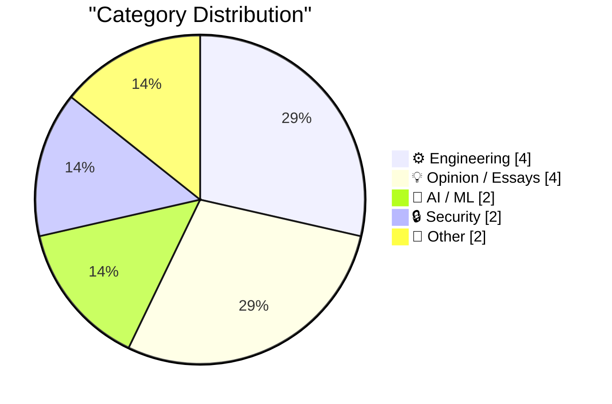
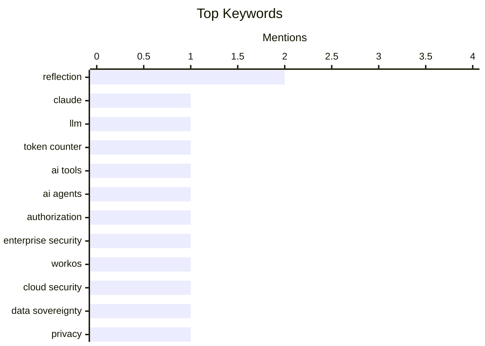

## Today's Highlights
Today's tech news underscores the accelerating practical application of AI, from advanced token comparison tools to the emerging trend of "headless" personal AI services. This rapid advancement, however, brings critical security and governance challenges, particularly concerning authorization for AI agents and the inherent risks associated with big tech cloud providers. Amidst these developments, engineers continue to innovate with practical data integration tools while also reflecting on foundational computing history.
---
## Must Read Today
1. **Claude Token Counter, now with model comparisons**
[Claude Token Counter, now with model comparisons](https://simonwillison.net/2026/Apr/20/claude-token-counts/#atom-everything) — simonwillison.net · 13h ago · 🤖 AI / ML
> Simon Willison upgraded his Claude Token Counter tool to allow comparing token counts across different models. The upgrade enables running the same count against various Claude models, specifically noting that Claude Opus 4.7 is the first model to change its tokenizer, making comparisons between 4.7 and 4.6 particularly relevant. This feature helps users understand how tokenization varies and impacts cost or context window usage across different versions of Anthropic's Claude models. The tool provides practical insights into the underlying tokenization differences that affect LLM interactions.
💡 **Why read it**: It offers a practical tool and insight into how tokenization differs across Claude LLM versions, which is crucial for cost and context management.
🏷️ Claude, LLM, Token Counter, AI Tools
2. **WorkOS FGA: The Authorization Layer for AI Agents**
[WorkOS FGA: The Authorization Layer for AI Agents](https://workos.com/blog/agents-need-authorization-not-just-authentication?utm_source=daringfireball&amp;utm_medium=newsletter&amp;utm_campaign=q22026) — daringfireball.net · 20h ago · 🔒 Security
> The core problem for deploying AI agents in enterprise environments is not model quality or latency, but authorization, which defines an agent's "blast radius." While authentication proves an agent's identity, authorization controls its access to specific resources. WorkOS FGA (Fine-Grained Authorization) addresses this by providing resource-level permissions to scope an agent's capabilities. This ensures enterprises can safely trust AI agents by precisely defining what they can and cannot access. The main takeaway is that robust authorization is critical for enterprise AI adoption and security.
💡 **Why read it**: It highlights the often-overlooked but critical role of authorization in securely deploying AI agents in enterprise settings, offering a specific solution.
🏷️ AI Agents, Authorization, Enterprise Security, WorkOS
3. **Big tech clouds worden niet veiliger met stapels papier**
[Big tech clouds worden niet veiliger met stapels papier](https://berthub.eu/articles/posts/big-tech-clouds-niet-veiliger-met-papier/) — berthub.eu · 19h ago · 🔒 Security
> The article discusses the inherent risks of relying on US-based big tech cloud providers for European society and government data. It highlights two main issues: data access is contingent on US approval, and US legal instruments grant America access to European data even if servers are located in Europe. This means that despite "special" agreements or local server placement, US laws like the CLOUD Act can still compel access to data. The conclusion is that paper-based compliance or local server placement does not fundamentally mitigate the risk of US legal access to data stored in big tech clouds.
💡 **Why read it**: It critically examines the geopolitical and legal implications of storing sensitive data with US big tech cloud providers, even with local server placement.
🏷️ Cloud Security, Data Sovereignty, Privacy, Geopolitics
---
## Data Overview
| Sources Scanned | Articles Fetched | Time Window | Selected |
|:---:|:---:|:---:|:---:|
| 89/92 | 2544 -> 14 | 24h | **14** |
### Category Distribution

### Top Keywords

<details>
<summary>Plain Text Keyword Chart (Terminal Friendly)</summary>
```
reflection          │ ████████████████████ 2
claude              │ ██████████░░░░░░░░░░ 1
llm                 │ ██████████░░░░░░░░░░ 1
token counter       │ ██████████░░░░░░░░░░ 1
ai tools            │ ██████████░░░░░░░░░░ 1
ai agents           │ ██████████░░░░░░░░░░ 1
authorization       │ ██████████░░░░░░░░░░ 1
enterprise security │ ██████████░░░░░░░░░░ 1
workos              │ ██████████░░░░░░░░░░ 1
cloud security      │ ██████████░░░░░░░░░░ 1
```
</details>
### Topic Tags
**reflection**(2) · **claude**(1) · **llm**(1) · token counter(1) · ai tools(1) · ai agents(1) · authorization(1) · enterprise security(1) · workos(1) · cloud security(1) · data sovereignty(1) · privacy(1) · geopolitics(1) · personal ai(1) · headless services(1) · ai trends(1) · user experience(1) · google sheets(1) · datasette(1) · sql(1)
---
## Engineering
### 1. SQL functions in Google Sheets to fetch data from Datasette
[SQL functions in Google Sheets to fetch data from Datasette](https://simonwillison.net/2026/Apr/20/datasette-sql/#atom-everything) — **simonwillison.net** · 11h ago · ⭐ 21/30
> This article provides patterns for fetching data from a Datasette instance directly into Google Sheets using various methods. It details how to use Google Sheets' `importdata()` function for basic data retrieval. For more complex scenarios, it suggests wrapping `importdata()` in a "named function" or employing a Google Apps Script when an API token needs to be sent in an HTTP header, as `importdata()` does not support this directly. The main takeaway is that Datasette data can be effectively integrated into Google Sheets for analysis and reporting, with different approaches for varying security and complexity needs.
🏷️ Google Sheets, Datasette, SQL, Data Integration
---
### 2. Gordon Moore and Moore’s Law
[Gordon Moore and Moore’s Law](https://dfarq.homeip.net/gordon-moore-and-moores-law/?utm_source=rss&#038;utm_medium=rss&#038;utm_campaign=gordon-moore-and-moores-law) — **dfarq.homeip.net** · 3h ago · ⭐ 21/30
> The article introduces Gordon Moore, co-founder of Intel Corporation, and his famous observation known as Moore's Law. Moore's Law states that the number of transistors in an integrated circuit, or computer chip, doubles approximately every two years. This observation, made by Moore, has been a driving force and a benchmark for the semiconductor industry's rapid advancement. The article serves as a brief tribute to Moore and his foundational contribution to computing.
🏷️ Moore's Law, Gordon Moore, Intel, Semiconductors
---
### 3. More on Newton’s diameter theorem
[More on Newton’s diameter theorem](https://www.johndcook.com/blog/2026/04/20/newton-diameter-quintic/) — **johndcook.com** · 11m ago · ⭐ 20/30
> This article revisits Newton’s diameter theorem, building on a previous post. The theorem involves plotting a curve defined by the solutions to a polynomial equation `f(x, y) = 0` of degree `n`. It then describes drawing several parallel lines that intersect the curve at `n` points. The theorem's core insight lies in the properties of the midpoints of the line segments formed by these intersections. This exploration delves deeper into the geometric implications and applications of Newton's original mathematical theorem.
🏷️ Newton's Theorem, Mathematics, Geometry, Polynomials
---
### 4. Hitachi Ltd, Part II
[Hitachi Ltd, Part II](https://www.abortretry.fail/p/hitachi-ltd-part-ii) — **abortretry.fail** · 17h ago · ⭐ 17/30
> This article, "Hitachi Ltd, Part II," continues an exploration of Hitachi's computing history, specifically focusing on its involvement with various processor architectures. It highlights Hitachi's work with the H8, PA-RISC, and SuperH processor families. These architectures represent key periods in Hitachi's semiconductor and computing development, showcasing their contributions to different computing paradigms. The article likely delves into the technical specifications, market impact, or historical context of these specific processor designs within Hitachi's broader portfolio.
🏷️ Hitachi, CPU, Architectures, PA-RISC
---
## Opinion / Essays
### 5. How we lost the living Now
[How we lost the living Now](https://www.joanwestenberg.com/how-we-lost-the-living-now/) — **joanwestenberg.com** · 13h ago · ⭐ 18/30
> The article discusses the historical shift from localized, natural time to standardized, precise time, driven by technological necessity. Before 1840, local noon varied by location (e.g., Bristol's noon was 10 minutes after London's), which was inconsequential until the advent of railways. The railway system necessitated a common minute for operational efficiency and safety. This need for synchronization evolved from a common minute to the current common nanosecond, reflecting an increasing demand for precise, real-time coordination across global systems.
🏷️ Time Standardization, History, Society, Philosophy
---
### 6. Hook It Up to the Machine
[Hook It Up to the Machine](https://blog.jim-nielsen.com/2026/hook-it-up-to-the-machine/) — **blog.jim-nielsen.com** · 19h ago · ⭐ 14/30
> The provided snippet describes a personal anecdote about a family road trip in the early 2000s in a green Dodge Caravan that experienced persistent overheating issues. The vehicle ran fine on the interstate but consistently had its temperature gauge rise into unsafe zones when driven under 40 MPH. The article's core problem, key arguments, or main conclusion cannot be fully determined from the truncated content.
🏷️ Personal Anecdote, Road Trip, Reflection
---
### 7. Advice from a millionaire
[Advice from a millionaire](https://idiallo.com/blog/advice-from-a-millionaire?src=feed) — **idiallo.com** · 2h ago · ⭐ 13/30
> The provided snippet initiates a 'storytime' narrative, introducing a man in a black suit who attempts to take a seat at a table occupied by a woman and her two children. This interaction sets the scene for what the title suggests will be 'Advice from a millionaire.' However, the actual advice, the core problem, or any key findings are not present in this truncated text.
🏷️ Life Advice, Career, Personal Growth
---
### 8. Discovering Prince, Ten Years Later
[Discovering Prince, Ten Years Later](https://anildash.com/2026/04/20/prince-ten-years/) — **anildash.com** · 14h ago · ⭐ 8/30
> The article commemorates the tenth anniversary of Prince's passing, reflecting on his enduring artistic legacy. The author offers a retrospective of their own writings and work related to Prince, aiming to guide readers in exploring his vast artistry. It suggests starting points, including a curated list of selected albums from Prince's extensive catalog of over 40 albums. This serves as a valuable resource for both new and existing fans to delve deeper into his musical contributions.
🏷️ Prince, Music, Reflection, Anniversary
---
## AI / ML
### 9. Claude Token Counter, now with model comparisons
[Claude Token Counter, now with model comparisons](https://simonwillison.net/2026/Apr/20/claude-token-counts/#atom-everything) — **simonwillison.net** · 13h ago · ⭐ 26/30
> Simon Willison upgraded his Claude Token Counter tool to allow comparing token counts across different models. The upgrade enables running the same count against various Claude models, specifically noting that Claude Opus 4.7 is the first model to change its tokenizer, making comparisons between 4.7 and 4.6 particularly relevant. This feature helps users understand how tokenization varies and impacts cost or context window usage across different versions of Anthropic's Claude models. The tool provides practical insights into the underlying tokenization differences that affect LLM interactions.
🏷️ Claude, LLM, Token Counter, AI Tools
---
### 10. Headless everything for personal AI
[Headless everything for personal AI](https://simonwillison.net/2026/Apr/19/headless-everything/#atom-everything) — **simonwillison.net** · 16h ago · ⭐ 24/30
> The article explores the emerging trend of "headless" services becoming more prevalent, particularly in the context of personal AI. Matt Webb argues that personal AIs offer a superior user experience compared to direct service interaction, and headless services are more efficient and reliable for AIs than GUI-based interactions. This paradigm shift suggests that services will increasingly expose APIs for AI agents rather than relying solely on graphical user interfaces. The main takeaway is that headless architectures will be foundational for the next generation of AI-driven user experiences.
🏷️ Personal AI, Headless Services, AI Trends, User Experience
---
## Security
### 11. WorkOS FGA: The Authorization Layer for AI Agents
[WorkOS FGA: The Authorization Layer for AI Agents](https://workos.com/blog/agents-need-authorization-not-just-authentication?utm_source=daringfireball&amp;utm_medium=newsletter&amp;utm_campaign=q22026) — **daringfireball.net** · 20h ago · ⭐ 26/30
> The core problem for deploying AI agents in enterprise environments is not model quality or latency, but authorization, which defines an agent's "blast radius." While authentication proves an agent's identity, authorization controls its access to specific resources. WorkOS FGA (Fine-Grained Authorization) addresses this by providing resource-level permissions to scope an agent's capabilities. This ensures enterprises can safely trust AI agents by precisely defining what they can and cannot access. The main takeaway is that robust authorization is critical for enterprise AI adoption and security.
🏷️ AI Agents, Authorization, Enterprise Security, WorkOS
---
### 12. Big tech clouds worden niet veiliger met stapels papier
[Big tech clouds worden niet veiliger met stapels papier](https://berthub.eu/articles/posts/big-tech-clouds-niet-veiliger-met-papier/) — **berthub.eu** · 19h ago · ⭐ 25/30
> The article discusses the inherent risks of relying on US-based big tech cloud providers for European society and government data. It highlights two main issues: data access is contingent on US approval, and US legal instruments grant America access to European data even if servers are located in Europe. This means that despite "special" agreements or local server placement, US laws like the CLOUD Act can still compel access to data. The conclusion is that paper-based compliance or local server placement does not fundamentally mitigate the risk of US legal access to data stored in big tech clouds.
🏷️ Cloud Security, Data Sovereignty, Privacy, Geopolitics
---
## Other
### 13. Book Review: Up - A scientist's guide to the magic above us by Dr Lucy Rogers ★★★★★
[Book Review: Up - A scientist's guide to the magic above us by Dr Lucy Rogers ★★★★★](https://shkspr.mobi/blog/2026/04/book-review-up-a-scientists-guide-to-the-magic-above-us-by-dr-lucy-rogers/) — **shkspr.mobi** · 2h ago · ⭐ 14/30
> This is a five-star book review of "Up - A scientist's guide to the magic above us" by Dr. Lucy Rogers. The reviewer describes the book as a charming, thought-provoking, and deeply personal exploration of everything above our heads, blending science with anecdotes and the thrill of discovery. It is praised for its spectacular accessibility, relaxed tone, and encouragement of domestic science. The review emphasizes that the book makes complex scientific topics engaging and relatable for a broad audience.
🏷️ Book Review, Science, Lucy Rogers
---
### 14. Jessica Chastain Says Apple TV Will Finally Release ‘The Savant’
[Jessica Chastain Says Apple TV Will Finally Release ‘The Savant’](https://variety.com/2026/tv/columns/jessica-chastain-apple-tv-finally-release-the-savant-after-postponement-charlie-kirk-assassination-1236725384/) — **daringfireball.net** · 19h ago · ⭐ 9/30
> The core topic is the long-awaited release of the political thriller series "The Savant" on Apple TV, which had been in limbo. Actress Jessica Chastain confirmed to Variety that the series will finally be released, stating, "now I can say, ‘We’re going to see it.’" Sources indicate Apple is planning for a July release, resolving previous uncertainty regarding its availability. This confirms the show's future for viewers anticipating its debut.
🏷️ Apple TV, TV Series, Entertainment News
---
*Generated at 2026-04-20 14:01 | Scanned 89 sources -> 2544 articles -> selected 14*
*Based on the [Hacker News Popularity Contest 2025](https://refactoringenglish.com/tools/hn-popularity/) RSS source list recommended by [Andrej Karpathy](https://x.com/karpathy)*
*Produced by Dongdianr AI. Follow the same-name WeChat public account for more AI practical tips 💡*
