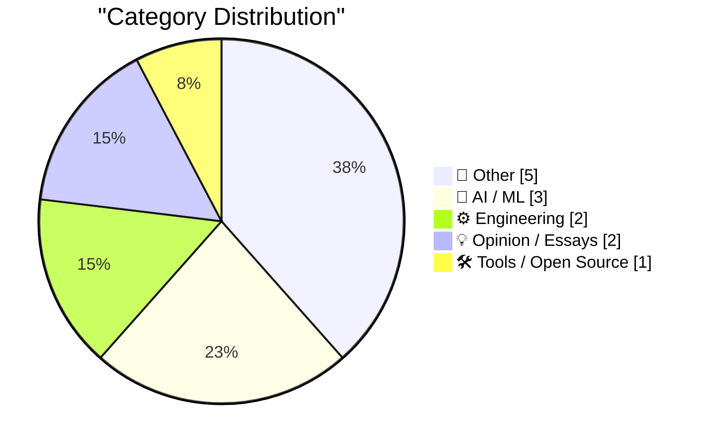
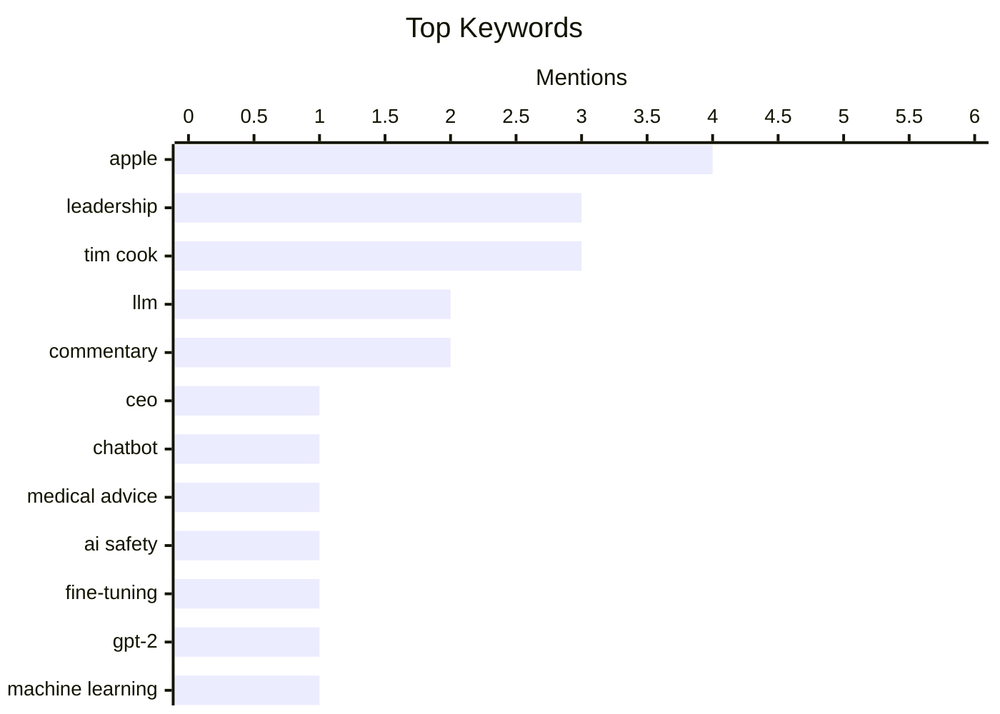

## Today's Highlights
Today's tech highlights feature a significant leadership transition at Apple, as Tim Cook prepares to become Executive Chairman and John Ternus steps into the CEO role, marking a new era for the company. Concurrently, the artificial intelligence sector shows both rapid advancement and growing caution. While developers continue to refine LLM capabilities, users are strongly advised against relying on chatbots for critical information like medical advice. The business model for AI tools is also evolving, with services like GitHub Copilot shifting to token-based billing.
---
## Must Read Today
1. **Apple: ‘Tim Cook to Become Apple Executive Chairman; John Ternus to Become Apple CEO’**
[Apple: ‘Tim Cook to Become Apple Executive Chairman; John Ternus to Become Apple CEO’](https://www.apple.com/newsroom/2026/04/tim-cook-to-become-apple-executive-chairman-john-ternus-to-become-apple-ceo/) — daringfireball.net · 17h ago · ⚙️ Engineering
> This article announces a significant leadership transition at Apple, effective September 1, 2026. Tim Cook will become Executive Chairman of Apple’s board of directors, and John Ternus, Senior Vice President of Hardware Engineering, will assume the role of CEO. This unanimous board decision follows a thoughtful, long-term succession planning process. Cook will continue as CEO through summer 2026 to ensure a smooth transition. The change marks a new era for Apple's executive leadership, reflecting careful strategic planning.
💡 **Why read it**: It details a major leadership change at one of the world's most influential technology companies, impacting its future direction and strategy.
🏷️ Apple, CEO, Leadership, Tim Cook
2. **Please don’t trust your chatbot for medical advice**
[Please don’t trust your chatbot for medical advice](https://garymarcus.substack.com/p/please-dont-trust-your-chatbot-for) — garymarcus.substack.com · 1h ago · 🤖 AI / ML
> The article strongly advises against relying on chatbots for medical advice, citing four separate studies that consistently highlight their unreliability in this critical domain. These studies indicate that current AI models often lack the necessary accuracy, nuance, and ethical safeguards for healthcare applications. Chatbots may generate plausible but incorrect or potentially harmful information, leading to risks like misdiagnosis or inappropriate self-treatment. Therefore, the main conclusion is that users should always consult human medical professionals for health-related concerns and exercise extreme caution with AI-generated health information.
💡 **Why read it**: It provides a critical warning, backed by multiple studies, about the significant risks of using current AI chatbots for medical advice.
🏷️ Chatbot, Medical Advice, AI Safety, LLM
3. **Writing an LLM from scratch, part 32l -- Interventions: updated instruction fine-tuning results**
[Writing an LLM from scratch, part 32l -- Interventions: updated instruction fine-tuning results](https://www.gilesthomas.com/2026/04/llm-from-scratch-32l-interventions-instruction-fine-tuning-tests) — gilesthomas.com · 18h ago · 🤖 AI / ML
> This article details ongoing efforts to improve a GPT-2-small-style LLM, built from scratch based on Sebastian Raschka's book, to approach the quality of the original OpenAI GPT-2-small. The author experimented with various instruction fine-tuning interventions, systematically measuring performance by loss on a held-back test dataset. The goal was to identify effective strategies to reduce the loss and enhance the custom model's capabilities. The updated instruction fine-tuning results provide insights into practical techniques for improving LLM performance through targeted interventions.
💡 **Why read it**: It offers practical insights into the iterative process and specific techniques for fine-tuning a custom GPT-2-small-style LLM to improve its performance.
🏷️ LLM, Fine-tuning, GPT-2, Machine Learning
---
## Data Overview
| Sources Scanned | Articles Fetched | Time Window | Selected |
|:---:|:---:|:---:|:---:|
| 88/92 | 2532 -> 13 | 24h | **13** |
### Category Distribution

### Top Keywords

<details>
<summary>Plain Text Keyword Chart (Terminal Friendly)</summary>
```
apple          │ ████████████████████ 4
leadership     │ ███████████████░░░░░ 3
tim cook       │ ███████████████░░░░░ 3
llm            │ ██████████░░░░░░░░░░ 2
commentary     │ ██████████░░░░░░░░░░ 2
ceo            │ █████░░░░░░░░░░░░░░░ 1
chatbot        │ █████░░░░░░░░░░░░░░░ 1
medical advice │ █████░░░░░░░░░░░░░░░ 1
ai safety      │ █████░░░░░░░░░░░░░░░ 1
fine-tuning    │ █████░░░░░░░░░░░░░░░ 1
```
</details>
### Topic Tags
**apple**(4) · **leadership**(3) · **tim cook**(3) · llm(2) · commentary(2) · ceo(1) · chatbot(1) · medical advice(1) · ai safety(1) · fine-tuning(1) · gpt-2(1) · machine learning(1) · github copilot(1) · billing(1) · token-based(1) · rate limits(1) · john ternus(1) · community(1) · elon musk(1) · muskism(1)
---
## Other
### 1. Apple’s Annual Environmental Progress Report
[Apple’s Annual Environmental Progress Report](https://www.apple.com/newsroom/2026/04/apple-accelerates-progress-with-highest-ever-recycled-material-in-its-products/) — **daringfireball.net** · 20h ago · ⭐ 19/30
> Apple's annual Environmental Progress Report details the company's advancements towards its Apple 2030 goal of carbon neutrality across its entire footprint. The report highlights that Apple’s greenhouse gas emissions in 2025 remained over 60 percent lower compared to 2015 levels, holding constant from 2024 even with significant business growth. Key progress areas include the highest-ever recycled material content in its products, advancements in renewable energy adoption, and water stewardship. This demonstrates Apple's continued commitment and tangible progress in environmental sustainability efforts, aligning with its ambitious 2030 target.
🏷️ Apple, Environment, Sustainability, Carbon Neutral
---
### 2. Spaced Repetition: Beginner Guide/FAQ
[Spaced Repetition: Beginner Guide/FAQ](https://entropicthoughts.com/spaced-repetition-beginner-guide-faq) — **entropicthoughts.com** · 16h ago · ⭐ 19/30
> This article serves as a beginner's guide and FAQ for spaced repetition, a learning technique designed to optimize memory retention. It explains the core concept of reviewing information at increasing intervals to combat the forgetting curve, making learning more efficient. The guide likely covers how spaced repetition works, its cognitive benefits, and practical advice for implementation, potentially mentioning popular tools like Anki. The main takeaway is that spaced repetition is a highly effective, evidence-based method for long-term knowledge retention and improved learning outcomes.
🏷️ Spaced Repetition, Learning, Memory, Study Guide
---
### 3. Pluralistic: Comrade Trump (20 Apr 2026)
[Pluralistic: Comrade Trump (20 Apr 2026)](https://pluralistic.net/2026/04/20/praxis/) — **pluralistic.net** · 21h ago · ⭐ 14/30
> This Pluralistic post by Cory Doctorow is a link aggregation, curating diverse articles on contemporary issues. It covers political commentary, such as "Comrade Trump: Burning down the American empire to save it," alongside critical discussions on digital rights, including the MPAA's threat-based 'education' and AT&T's internet practices. Economic topics like British tax-havens and the definition of neoliberalism are also featured. The collection provides a broad, critical lens on technology, politics, and societal structures. The main takeaway is that it offers a curated digest of external articles presenting varied critical perspectives.
🏷️ Trump, Politics, Commentary
---
### 4. Timex Sinclair 1000 computer: Revisiting its legacy
[Timex Sinclair 1000 computer: Revisiting its legacy](https://dfarq.homeip.net/timex-sinclair-1000/?utm_source=rss&#038;utm_medium=rss&#038;utm_campaign=timex-sinclair-1000) — **dfarq.homeip.net** · 3h ago · ⭐ 10/30
> This article revisits the legacy of the Timex Sinclair 1000, the U.S. version of the Sinclair ZX81. Announced on April 20, 1982, and released in July, it was marketed as a "real computer" for an accessible price of $99. This affordability contributed to its significant market penetration, selling 500,000 units in 1982 alone. The device played a crucial role in democratizing personal computing by making it available to a broader audience. The article highlights its historical significance as an early, low-cost home computer.
🏷️ Timex Sinclair 1000, Vintage Computer, History
---
### 5. DF Paraphernalia: T-Shirts and Hoodies Are Back
[DF Paraphernalia: T-Shirts and Hoodies Are Back](https://store.daringfireball.net/) — **daringfireball.net** · 16h ago · ⭐ 8/30
> This Daring Fireball post announces the immediate availability of official Daring Fireball t-shirts and hoodies for purchase. Customers are encouraged to place orders now, with the production timeline specifying that printing will commence at the end of the current week. Shipping of the merchandise is scheduled to begin the following week. The announcement serves as a direct call to action for readers interested in acquiring Daring Fireball apparel. The main takeaway is that official Daring Fireball merchandise is back in stock for a limited ordering window.
🏷️ Daring Fireball, Merchandise, T-shirts
---
## AI / ML
### 6. Please don’t trust your chatbot for medical advice
[Please don’t trust your chatbot for medical advice](https://garymarcus.substack.com/p/please-dont-trust-your-chatbot-for) — **garymarcus.substack.com** · 1h ago · ⭐ 28/30
> The article strongly advises against relying on chatbots for medical advice, citing four separate studies that consistently highlight their unreliability in this critical domain. These studies indicate that current AI models often lack the necessary accuracy, nuance, and ethical safeguards for healthcare applications. Chatbots may generate plausible but incorrect or potentially harmful information, leading to risks like misdiagnosis or inappropriate self-treatment. Therefore, the main conclusion is that users should always consult human medical professionals for health-related concerns and exercise extreme caution with AI-generated health information.
🏷️ Chatbot, Medical Advice, AI Safety, LLM
---
### 7. Writing an LLM from scratch, part 32l -- Interventions: updated instruction fine-tuning results
[Writing an LLM from scratch, part 32l -- Interventions: updated instruction fine-tuning results](https://www.gilesthomas.com/2026/04/llm-from-scratch-32l-interventions-instruction-fine-tuning-tests) — **gilesthomas.com** · 18h ago · ⭐ 28/30
> This article details ongoing efforts to improve a GPT-2-small-style LLM, built from scratch based on Sebastian Raschka's book, to approach the quality of the original OpenAI GPT-2-small. The author experimented with various instruction fine-tuning interventions, systematically measuring performance by loss on a held-back test dataset. The goal was to identify effective strategies to reduce the loss and enhance the custom model's capabilities. The updated instruction fine-tuning results provide insights into practical techniques for improving LLM performance through targeted interventions.
🏷️ LLM, Fine-tuning, GPT-2, Machine Learning
---
### 8. Exclusive: Microsoft To Shift GitHub Copilot Users To Token-Based Billing, Tighten Rate Limits
[Exclusive: Microsoft To Shift GitHub Copilot Users To Token-Based Billing, Tighten Rate Limits](https://www.wheresyoured.at/news-microsoft-to-shift-github-copilot-users-to-token-based-billing-reduce-rate-limits-2/) — **wheresyoured.at** · 20h ago · ⭐ 28/30
> Microsoft plans to transition GitHub Copilot users from request-based to token-based billing and temporarily suspend individual account sign-ups. Internal documents reveal that the weekly operational cost of GitHub Copilot has doubled since its inception, necessitating this change. This shift will also involve tightening rate limits, impacting how users consume the AI coding assistant. The move aims to manage escalating infrastructure costs and optimize resource allocation for the service, signaling a significant change in its economic model.
🏷️ GitHub Copilot, Billing, Token-based, Rate Limits
---
## Engineering
### 9. Apple: ‘Tim Cook to Become Apple Executive Chairman; John Ternus to Become Apple CEO’
[Apple: ‘Tim Cook to Become Apple Executive Chairman; John Ternus to Become Apple CEO’](https://www.apple.com/newsroom/2026/04/tim-cook-to-become-apple-executive-chairman-john-ternus-to-become-apple-ceo/) — **daringfireball.net** · 17h ago · ⭐ 28/30
> This article announces a significant leadership transition at Apple, effective September 1, 2026. Tim Cook will become Executive Chairman of Apple’s board of directors, and John Ternus, Senior Vice President of Hardware Engineering, will assume the role of CEO. This unanimous board decision follows a thoughtful, long-term succession planning process. Cook will continue as CEO through summer 2026 to ensure a smooth transition. The change marks a new era for Apple's executive leadership, reflecting careful strategic planning.
🏷️ Apple, CEO, Leadership, Tim Cook
---
### 10. ★ Another Day Has Come
[★ Another Day Has Come](https://daringfireball.net/2026/04/another_day_has_come) — **daringfireball.net** · 10h ago · ⭐ 24/30
> This article reflects on Apple's recent executive transition, praising it as an exceptionally orderly and confidence-inspiring process. The author suggests that the succession, where Tim Cook becomes Executive Chairman and John Ternus becomes CEO, feels both exciting and entirely appropriate. It highlights the seamless nature of the leadership change, implying careful long-term planning and a well-executed strategy. The overall sentiment is that this transition represents a positive and stable step for Apple's future.
🏷️ Apple, Leadership, Tim Cook, John Ternus
---
## Opinion / Essays
### 11. ‘Community Letter From Tim’
[‘Community Letter From Tim’](https://www.apple.com/community-letter-from-tim/) — **daringfireball.net** · 16h ago · ⭐ 23/30
> This article presents a letter from Tim Cook to the Apple community, reflecting on his 15 years as CEO and his daily routine of reading user emails. Cook emphasizes the personal connection he feels with users, highlighting stories of how Apple products, like the Apple Watch, have positively impacted their lives. The letter serves as a heartfelt message of appreciation and a reflection on the company's mission. It underscores the importance of user feedback and the human impact of Apple's technology, reinforcing the company's user-centric philosophy.
🏷️ Tim Cook, Apple, Leadership, Community
---
### 12. Pluralistic: Quinn Slobodian and Ben Tarnoff's "Muskism: A Guide for the Perplexed" (21 Apr 2026)
[Pluralistic: Quinn Slobodian and Ben Tarnoff's "Muskism: A Guide for the Perplexed" (21 Apr 2026)](https://pluralistic.net/2026/04/21/torment-nexusism/) — **pluralistic.net** · 42m ago · ⭐ 20/30
> This article introduces "Muskism: A Guide for the Perplexed" by Quinn Slobodian and Ben Tarnoff, which critically examines the phenomenon of "Muskism." The piece likely delves into the ideology, impact, and public perception surrounding Elon Musk and his ventures, exploring its socio-technological implications. It appears to be a review or commentary on the book, analyzing its arguments and insights into this contemporary force. The core takeaway is an intellectual analysis of "Muskism" as a significant and complex cultural and economic phenomenon.
🏷️ Elon Musk, Muskism, Tech Culture, Commentary
---
## Tools / Open Source
### 13. Better TTS on Linux
[Better TTS on Linux](https://shkspr.mobi/blog/2026/04/better-tts-on-linux/) — **shkspr.mobi** · 2h ago · ⭐ 20/30
> This article addresses the limitations of eSpeak, the venerable but robotic-sounding Text-To-Speech (TTS) program commonly found on Linux distributions. While eSpeak offers a phenomenally wide variety of languages and accents, its 1980s-era vocal fidelity is monotonous, clipped, and painful to listen to for many users. The core problem is the lack of natural-sounding speech synthesis on Linux, making accessibility and user experience suboptimal. The article implicitly suggests the need for or explores alternatives to achieve better, more natural TTS output on the platform.
🏷️ Linux, TTS, eSpeak, Accessibility
---
*Generated at 2026-04-21 14:01 | Scanned 88 sources -> 2532 articles -> selected 13*
*Based on the [Hacker News Popularity Contest 2025](https://refactoringenglish.com/tools/hn-popularity/) RSS source list recommended by [Andrej Karpathy](https://x.com/karpathy)*
*Produced by Dongdianr AI. Follow the same-name WeChat public account for more AI practical tips 💡*
