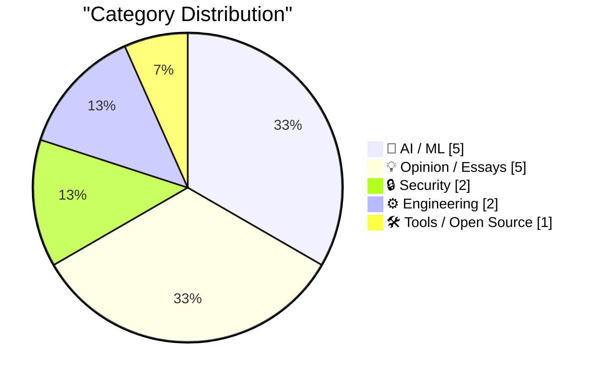
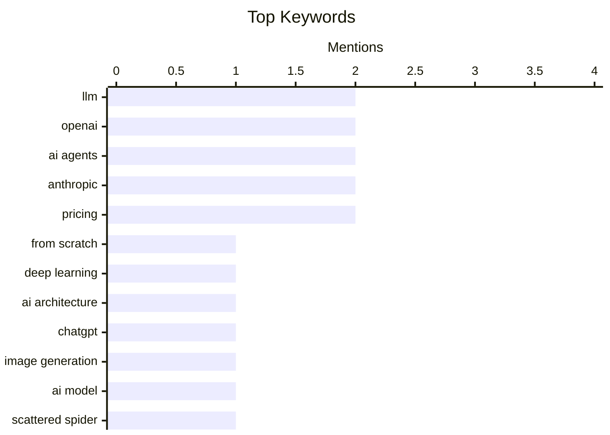

## Today's Highlights
Today's tech highlights a landscape of rapid AI advancement, with significant progress in LLM training, sophisticated AI coding agents, and new image generation capabilities. This innovation is met with evolving business dynamics, as seen in Anthropic's confusing pricing adjustments and broader market skepticism regarding AI's long-term competitive moats. Concurrently, societal concerns are escalating, ranging from potential "AIpocalypse" scenarios and growing anti-AI sentiment to ongoing cybercrime threats like the Scattered Spider group.
---
## Must Read Today
1. **Writing an LLM from scratch, part 32m -- Interventions: conclusion**
[Writing an LLM from scratch, part 32m -- Interventions: conclusion](https://www.gilesthomas.com/2026/04/llm-from-scratch-32m-interventions-conclusion) — gilesthomas.com · 18h ago · 🤖 AI / ML
> This article concludes a multi-part series detailing the process of training a GPT-2 base model from scratch. The author successfully trained a model that is "almost -- if not quite -- as good as GPT-2 small" in 44 hours on their own machine. This achievement fulfilled a follow-on goal set after completing the book "Build a Large Language Model (from Scratch)". The project demonstrates the feasibility of training a competitive LLM like GPT-2 small on personal hardware within a reasonable timeframe.
💡 **Why read it**: It provides a practical demonstration and validation of training a significant LLM (GPT-2 small equivalent) from scratch on personal hardware, offering insights into the effort and results.
🏷️ LLM, From scratch, Deep learning, AI architecture
2. **Where's the raccoon with the ham radio? (ChatGPT Images 2.0)**
[Where's the raccoon with the ham radio? (ChatGPT Images 2.0)](https://simonwillison.net/2026/Apr/21/gpt-image-2/#atom-everything) — simonwillison.net · 17h ago · 🤖 AI / ML
> This article evaluates the capabilities of OpenAI's newly released ChatGPT Images 2.0, which Sam Altman claimed represents a generational leap equivalent to GPT-3 to GPT-5. The author tested the model with a complex "Where's Waldo" style prompt: "Do a where's Waldo style image but it's where is the raccoon holding a ham radio". This challenging prompt aims to assess the model's understanding and generation quality. The article seeks to determine if ChatGPT Images 2.0 lives up to the hype regarding its significant improvements in image generation and complex prompt comprehension.
💡 **Why read it**: It offers a practical, real-world test of OpenAI's ChatGPT Images 2.0, providing an early assessment of its claimed significant improvements in image generation capabilities.
🏷️ ChatGPT, image generation, OpenAI, AI model
3. **‘Scattered Spider’ Member ‘Tylerb’ Pleads Guilty**
[‘Scattered Spider’ Member ‘Tylerb’ Pleads Guilty](https://krebsonsecurity.com/2026/04/scattered-spider-member-tylerb-pleads-guilty/) — krebsonsecurity.com · 23h ago · 🔒 Security
> A 24-year-old British national and senior member of the cybercrime group "Scattered Spider," Tyler Robert Buchanan (aka "Tylerb"), has pleaded guilty to wire fraud conspiracy and aggravated identity theft. Buchanan admitted his role in a series of text-message phishing attacks during the summer of 2022. These attacks enabled the group to hack into at least a dozen major technology companies and steal tens of millions of dollars worth of cryptocurrency from investors. This guilty plea highlights the successful prosecution of a key individual within a prominent cybercrime organization responsible for significant financial and data breaches.
💡 **Why read it**: It provides an important update on the legal consequences for members of sophisticated cybercrime groups like "Scattered Spider," detailing their methods and impact.
🏷️ Scattered Spider, cybercrime, phishing, identity theft
---
## Data Overview
| Sources Scanned | Articles Fetched | Time Window | Selected |
|:---:|:---:|:---:|:---:|
| 88/92 | 2532 -> 22 | 24h | **15** |
### Category Distribution

### Top Keywords

<details>
<summary>Plain Text Keyword Chart (Terminal Friendly)</summary>
```
llm              │ ████████████████████ 2
openai           │ ████████████████████ 2
ai agents        │ ████████████████████ 2
anthropic        │ ████████████████████ 2
pricing          │ ████████████████████ 2
from scratch     │ ██████████░░░░░░░░░░ 1
deep learning    │ ██████████░░░░░░░░░░ 1
ai architecture  │ ██████████░░░░░░░░░░ 1
chatgpt          │ ██████████░░░░░░░░░░ 1
image generation │ ██████████░░░░░░░░░░ 1
```
</details>
### Topic Tags
**llm**(2) · **openai**(2) · **ai agents**(2) · anthropic(2) · pricing(2) · from scratch(1) · deep learning(1) · ai architecture(1) · chatgpt(1) · image generation(1) · ai model(1) · scattered spider(1) · cybercrime(1) · phishing(1) · identity theft(1) · coding(1) · llms(1) · software development(1) · claude code(1) · subscription(1)
---
## AI / ML
### 1. Writing an LLM from scratch, part 32m -- Interventions: conclusion
[Writing an LLM from scratch, part 32m -- Interventions: conclusion](https://www.gilesthomas.com/2026/04/llm-from-scratch-32m-interventions-conclusion) — **gilesthomas.com** · 18h ago · ⭐ 27/30
> This article concludes a multi-part series detailing the process of training a GPT-2 base model from scratch. The author successfully trained a model that is "almost -- if not quite -- as good as GPT-2 small" in 44 hours on their own machine. This achievement fulfilled a follow-on goal set after completing the book "Build a Large Language Model (from Scratch)". The project demonstrates the feasibility of training a competitive LLM like GPT-2 small on personal hardware within a reasonable timeframe.
🏷️ LLM, From scratch, Deep learning, AI architecture
---
### 2. Where's the raccoon with the ham radio? (ChatGPT Images 2.0)
[Where's the raccoon with the ham radio? (ChatGPT Images 2.0)](https://simonwillison.net/2026/Apr/21/gpt-image-2/#atom-everything) — **simonwillison.net** · 17h ago · ⭐ 26/30
> This article evaluates the capabilities of OpenAI's newly released ChatGPT Images 2.0, which Sam Altman claimed represents a generational leap equivalent to GPT-3 to GPT-5. The author tested the model with a complex "Where's Waldo" style prompt: "Do a where's Waldo style image but it's where is the raccoon holding a ham radio". This challenging prompt aims to assess the model's understanding and generation quality. The article seeks to determine if ChatGPT Images 2.0 lives up to the hype regarding its significant improvements in image generation and complex prompt comprehension.
🏷️ ChatGPT, image generation, OpenAI, AI model
---
### 3. An AI Odyssey, Part 4: Astounding Coding Agents
[An AI Odyssey, Part 4: Astounding Coding Agents](https://www.johndcook.com/blog/2026/04/21/an-ai-odyssey-part-4-astounding-coding-agents/) — **johndcook.com** · 17h ago · ⭐ 26/30
> This article, part of an "AI Odyssey" series, discusses the significant advancements in AI coding agents observed since late last year. The author notes that AI coding agents improved greatly last summer and again in December-January, feeling "subjectively much smarter." They can now accomplish a broader range of tasks and possess a larger, more comprehensive understanding of codebases. The article suggests that current AI coding agents have reached a new level of sophistication, making them considerably more effective and versatile tools for developers.
🏷️ AI agents, Coding, LLMs, Software development
---
### 4. [UPDATED] News: Anthropic (Briefly) Removes Claude Code From $20-A-Month "Pro" Subscription Plan For New Users
[[UPDATED] News: Anthropic (Briefly) Removes Claude Code From $20-A-Month "Pro" Subscription Plan For New Users](https://www.wheresyoured.at/news-anthropic-removes-pro-cc/) — **wheresyoured.at** · 15h ago · ⭐ 26/30
> Anthropic briefly removed access to "Claude Code" from its $20-a-month "Pro" subscription plan for new users on April 21, 2026. This change was observed on various pricing pages, though existing Pro users appeared to retain access via the Claude web app. Claude Code support documents were also briefly updated to reflect this change. This incident indicates potential pricing or feature restructuring by Anthropic regarding its specialized coding AI, Claude Code, for new subscribers.
🏷️ Anthropic, Claude Code, Subscription, AI news
---
### 5. Is Claude Code going to cost $100/month? Probably not - it's all very confusing
[Is Claude Code going to cost $100/month? Probably not - it's all very confusing](https://simonwillison.net/2026/Apr/22/claude-code-confusion/#atom-everything) — **simonwillison.net** · 11h ago · ⭐ 24/30
> This article addresses confusion surrounding Anthropic's pricing for Claude Code, specifically whether it would cost $100/month, following a brief removal from the $20/month Pro plan. Anthropic quietly updated its `claude.com/pricing` page, but not its `support.claude.com` page, leading to inconsistencies. The article notes that the pricing change was quickly reverted, indicating internal flux or a mistake. The incident suggests Anthropic is navigating complex decisions regarding Claude Code's pricing and feature availability, causing temporary confusion for users.
🏷️ Claude, pricing, Anthropic, LLM
---
## Opinion / Essays
### 6. Four Horsemen of the AIpocalypse
[Four Horsemen of the AIpocalypse](https://www.wheresyoured.at/four-horsemen-of-the-aipocalypse/) — **wheresyoured.at** · 21h ago · ⭐ 26/30
> This article introduces the concept of "Four Horsemen of the AIpocalypse," likely referring to major challenges or entities in the AI landscape. The piece serves as a promotional summary for a premium newsletter, promising "vast, detailed analyses of NVIDIA, Anthropic and OpenAI." It suggests in-depth coverage of key players and trends in the AI industry. The article functions as a teaser for a paid subscription service offering extensive analysis of leading AI companies and their potential impact.
🏷️ AI risks, AI future, NVIDIA, OpenAI
---
### 7. AI has no moat
[AI has no moat](https://geohot.github.io//blog/jekyll/update/2026/04/22/ai-has-no-moat.html) — **geohot.github.io** · 22h ago · ⭐ 26/30
> This article expresses skepticism about the high valuations and perceived lack of sustainable competitive advantage ("moat") in certain AI companies. The author cites the reported $60B acquisition of Cursor by SpaceX, comparing it to Twitter's $44B acquisition. The article questions the rationale for such high valuations, noting that "Nobody I know even uses Cursor any more." The author argues that the current AI market might be overvalued, with companies lacking true moats, potentially indicating a bubble or unsustainable business models.
🏷️ AI industry, Moat, Competition, Valuations
---
### 8. Luddites and AI datacenters
[Luddites and AI datacenters](https://seangoedecke.com/luddites-and-ai-datacenters/) — **seangoedecke.com** · 14h ago · ⭐ 24/30
> This article discusses growing anti-AI sentiment, specifically targeting AI datacenters, drawing parallels to historical Luddite movements. The author cites incidents where an Indianapolis city council member's house was shot up with a "no data centers" note, and Sam Altman's home was firebombed (and later attacked again). These events illustrate escalating physical threats against AI infrastructure and proponents. The article highlights a concerning rise in violent opposition to AI development and its physical manifestations, particularly datacenters, reflecting a modern "Luddite" backlash.
🏷️ AI datacenters, Luddites, societal impact, AI backlash
---
### 9. Quoting Andreas Påhlsson-Notini
[Quoting Andreas Påhlsson-Notini](https://simonwillison.net/2026/Apr/21/andreas-pahlsson-notini/#atom-everything) — **simonwillison.net** · 21h ago · ⭐ 23/30
> Quoting Andreas Påhlsson-Notini
🏷️ AI agents, human-like AI, AI design, critique
---
### 10. The Scapegoat
[The Scapegoat](https://feed.tedium.co/link/15204/17323348/mcclatchy-journalism-ai-scapegoat) — **tedium.co** · 10h ago · ⭐ 22/30
> The Scapegoat
🏷️ AI impact, Corporate change, Human agency, Business
---
## Security
### 11. ‘Scattered Spider’ Member ‘Tylerb’ Pleads Guilty
[‘Scattered Spider’ Member ‘Tylerb’ Pleads Guilty](https://krebsonsecurity.com/2026/04/scattered-spider-member-tylerb-pleads-guilty/) — **krebsonsecurity.com** · 23h ago · ⭐ 26/30
> A 24-year-old British national and senior member of the cybercrime group "Scattered Spider," Tyler Robert Buchanan (aka "Tylerb"), has pleaded guilty to wire fraud conspiracy and aggravated identity theft. Buchanan admitted his role in a series of text-message phishing attacks during the summer of 2022. These attacks enabled the group to hack into at least a dozen major technology companies and steal tens of millions of dollars worth of cryptocurrency from investors. This guilty plea highlights the successful prosecution of a key individual within a prominent cybercrime organization responsible for significant financial and data breaches.
🏷️ Scattered Spider, cybercrime, phishing, identity theft
---
### 12. Quoting Bobby Holley
[Quoting Bobby Holley](https://simonwillison.net/2026/Apr/22/bobby-holley/#atom-everything) — **simonwillison.net** · 8h ago · ⭐ 24/30
> This article quotes Bobby Holley regarding the successful application of an early version of Anthropic's Claude Mythos Preview to identify vulnerabilities in Firefox. Through collaboration with Anthropic, Mozilla used Claude Mythos Preview to identify 271 vulnerabilities, which were subsequently fixed in Firefox 150. This demonstrates the AI's effectiveness in security auditing. The experience highlights the promising potential of advanced AI models like Claude Mythos Preview as powerful tools for identifying and mitigating software security vulnerabilities.
🏷️ AI security, Firefox, vulnerabilities, zero-day
---
## Engineering
### 13. People get confused when language implementations break language guarantees
[People get confused when language implementations break language guarantees](https://buttondown.com/hillelwayne/archive/people-get-confused-when-language-implementations/) — **buttondown.com/hillelwayne** · 20h ago · ⭐ 23/30
> People get confused when language implementations break language guarantees
🏷️ Programming languages, Python, Language guarantees, Implementation
---
### 14. [RSS Club] How do you preserve an RSS feed?
[[RSS Club] How do you preserve an RSS feed?](https://shkspr.mobi/blog/2026/04/rss-club-how-do-you-preserve-an-rss-feed/) — **shkspr.mobi** · 2h ago · ⭐ 22/30
> [RSS Club] How do you preserve an RSS feed?
🏷️ RSS, Preservation, Blogging, Digital archiving
---
## Tools / Open Source
### 15. Changes to GitHub Copilot Individual plans
[Changes to GitHub Copilot Individual plans](https://simonwillison.net/2026/Apr/22/changes-to-github-copilot/#atom-everything) — **simonwillison.net** · 10h ago · ⭐ 23/30
> Changes to GitHub Copilot Individual plans
🏷️ GitHub Copilot, pricing, developer tools, AI assistant
---
*Generated at 2026-04-22 14:01 | Scanned 88 sources -> 2532 articles -> selected 15*
*Based on the [Hacker News Popularity Contest 2025](https://refactoringenglish.com/tools/hn-popularity/) RSS source list recommended by [Andrej Karpathy](https://x.com/karpathy)*
*Produced by Dongdianr AI. Follow the same-name WeChat public account for more AI practical tips 💡*
