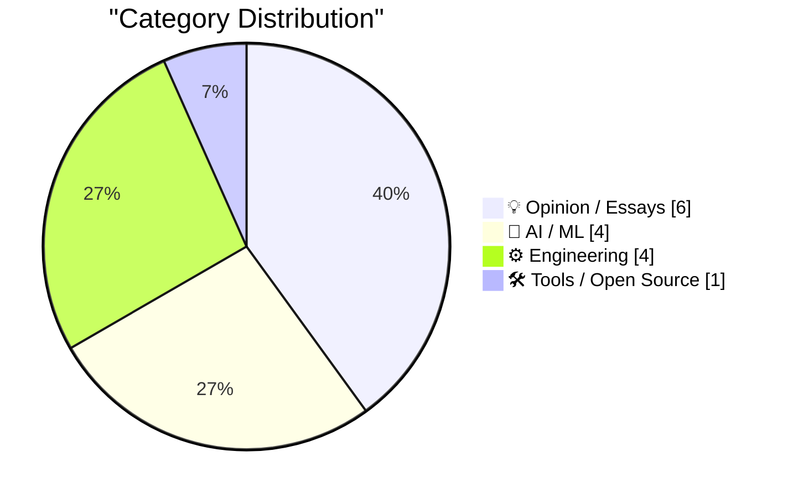
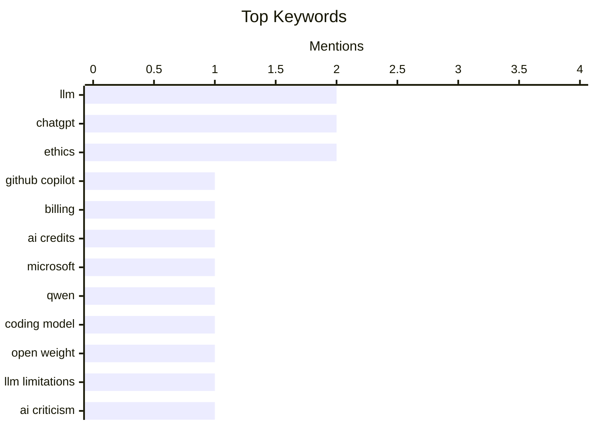

## Today's Highlights
Today's tech news underscores the rapid, yet often debated, evolution of artificial intelligence. While new open-weight models like Qwen3.6-27B demonstrate advanced coding capabilities, critical analyses continue to question the genuine understanding and intelligence of platforms such as ChatGPT. This dynamic AI landscape is also driving shifts in monetization, exemplified by GitHub Copilot's move to token-based billing, and sparking broader conversations about AI's profound impact on education and global competition.
---
## Must Read Today
1. **Exclusive: Microsoft Moving All GitHub Copilot Subscribers To Token-Based Billing In June**
[Exclusive: Microsoft Moving All GitHub Copilot Subscribers To Token-Based Billing In June](https://www.wheresyoured.at/exclusive-microsoft-moving-all-github-copilot-subscribers-to-token-based-billing-in-june/) — wheresyoured.at · 20h ago · 🛠 Tools / Open Source
> Microsoft is transitioning all GitHub Copilot subscribers to a new token-based billing model, effective June. Internal documents reveal Copilot Business customers will pay $19 per-user-per-month and receive $30 of pooled AI credits. Copilot Enterprise customers will pay $39 per-user-per-month and receive $70 of pooled AI credits. This shift moves from a flat per-user fee to a consumption-based model. This change will significantly alter how organizations budget for and utilize GitHub Copilot, potentially leading to increased costs for heavy users.
💡 **Why read it**: This article is worth reading to understand the upcoming fundamental change in GitHub Copilot's billing model and its financial implications for users.
🏷️ GitHub Copilot, billing, AI credits, Microsoft
2. **Qwen3.6-27B: Flagship-Level Coding in a 27B Dense Model**
[Qwen3.6-27B: Flagship-Level Coding in a 27B Dense Model](https://simonwillison.net/2026/Apr/22/qwen36-27b/#atom-everything) — simonwillison.net · 21h ago · 🤖 AI / ML
> Qwen has released Qwen3.6-27B, an open-weight model claiming flagship-level agentic coding performance. This 27B dense model reportedly surpasses the previous-generation open-source flagship, Qwen3.5-397B-A17B (a 397B total / 17B active MoE model), across all major coding benchmarks. The model's efficiency is notable, achieving superior performance with a significantly smaller parameter count. Qwen3.6-27B demonstrates that highly capable coding LLMs can be developed with fewer parameters, making advanced AI coding tools more accessible.
💡 **Why read it**: This article is worth reading for developers and researchers interested in efficient, high-performing open-source LLMs for coding tasks.
🏷️ Qwen, LLM, Coding model, Open weight
3. **ChatGPT doesn’t know its whisk from its elbow**
[ChatGPT doesn’t know its whisk from its elbow](https://garymarcus.substack.com/p/chatgpt-doesnt-know-its-whisk-from) — garymarcus.substack.com · 21h ago · 🤖 AI / ML
> Gary Marcus critiques ChatGPT's lack of genuine understanding, highlighting its inability to grasp basic physical concepts. The article implies that despite impressive language generation, ChatGPT struggles with common-sense reasoning and practical knowledge, suggesting it merely regurgitates patterns rather than comprehending meaning. The phrase 'Medical illustrators can rest easy' suggests that AI is far from replacing human understanding in nuanced fields. ChatGPT's current capabilities are limited by its inability to truly understand the world, making it unreliable for tasks requiring deep conceptual knowledge.
💡 **Why read it**: This article is worth reading for a critical perspective on the limitations of current large language models, particularly regarding common-sense reasoning.
🏷️ ChatGPT, LLM limitations, AI criticism, Common sense
---
## Data Overview
| Sources Scanned | Articles Fetched | Time Window | Selected |
|:---:|:---:|:---:|:---:|
| 87/92 | 2432 -> 20 | 24h | **15** |
### Category Distribution

### Top Keywords

<details>
<summary>Plain Text Keyword Chart (Terminal Friendly)</summary>
```
llm            │ ████████████████████ 2
chatgpt        │ ████████████████████ 2
ethics         │ ████████████████████ 2
github copilot │ ██████████░░░░░░░░░░ 1
billing        │ ██████████░░░░░░░░░░ 1
ai credits     │ ██████████░░░░░░░░░░ 1
microsoft      │ ██████████░░░░░░░░░░ 1
qwen           │ ██████████░░░░░░░░░░ 1
coding model   │ ██████████░░░░░░░░░░ 1
open weight    │ ██████████░░░░░░░░░░ 1
```
</details>
### Topic Tags
**llm**(2) · **chatgpt**(2) · **ethics**(2) · github copilot(1) · billing(1) · ai credits(1) · microsoft(1) · qwen(1) · coding model(1) · open weight(1) · llm limitations(1) · ai criticism(1) · common sense(1) · image generation(1) · generative ai(1) · ai understanding(1) · from scratch(1) · ai development(1) · deep learning(1) · ai policy(1)
---
## Opinion / Essays
### 1. Do you really want the US to “win” AI?
[Do you really want the US to “win” AI?](https://geohot.github.io//blog/jekyll/update/2026/04/23/us-win-ai.html) — **geohot.github.io** · 22h ago · ⭐ 27/30
> George Hotz questions the prevailing narrative of the US 'winning' AI, expressing skepticism about the current direction and beneficiaries of AI development. Hotz, who identifies as someone who 'should be a neofeudalist,' reflects on the current state where 'engineer-type strongmen are sort of in charge.' He ponders if his dissatisfaction stems from not having a 'seat at the table,' suggesting a critique of power concentration and the potential for a few to control AI's future. The article challenges the simplistic notion of national victory in AI, urging readers to consider the ethical, societal, and power distribution implications of who controls and benefits from advanced AI.
🏷️ AI policy, geopolitics, ethics, George Hotz
---
### 2. Ben Thompson on Tim Cook’s Legacy
[Ben Thompson on Tim Cook’s Legacy](https://stratechery.com/2026/tim-cooks-impeccable-timing/) — **daringfireball.net** · 21h ago · ⭐ 24/30
> Ben Thompson of Stratechery analyzes Tim Cook's legacy at Apple, particularly focusing on his operational genius and 'impeccable timing.' Cook is lauded as an 'operational genius' who transformed Apple's supply chain. Upon joining in 1998, he shut down Apple's own factories and warehouses, shifting manufacturing to China to create a 'just-in-time supply chain' that consistently delivered products at scale. This strategic move was crucial for scaling the iPhone to 'unimaginable scale.' Tim Cook's most significant contribution to Apple was his masterful overhaul of its global operations and supply chain, which enabled the company's unprecedented growth and success.
🏷️ Tim Cook, Apple, Leadership, Business strategy
---
### 3. AI and Teaching – The Brave New World
[AI and Teaching – The Brave New World](https://steveblank.com/2026/04/22/ai-and-teaching-the-brave-new-world/) — **steveblank.com** · 22h ago · ⭐ 24/30
> Steve Blank discusses the profound impact of AI on teaching, particularly observed during the 16th year of the Stanford Lean LaunchPad class. From the very first hour of the class, the instructors recognized an 'extraordinary' shift, signaling 'both the end and beginning of a new era.' This suggests that AI tools fundamentally altered student engagement, learning processes, or the nature of assignments, prompting a re-evaluation of traditional teaching methods. The article implies AI's immediate and significant disruption to established educational paradigms. AI is rapidly transforming the educational landscape, necessitating a re-evaluation of teaching methodologies and student learning experiences.
🏷️ AI, education, teaching, Stanford
---
### 4. Quoting Maggie Appleton
[Quoting Maggie Appleton](https://simonwillison.net/2026/Apr/23/maggie-appleton/#atom-everything) — **simonwillison.net** · 32m ago · ⭐ 23/30
> Quoting Maggie Appleton
🏷️ Learn in public, Digital gardening, Knowledge sharing, Career growth
---
### 5. Pluralistic: It's not a crime if we do it (to nurses) with an app (22 Apr 2026)
[Pluralistic: It's not a crime if we do it (to nurses) with an app (22 Apr 2026)](https://pluralistic.net/2026/04/22/uber-for-nurses/) — **pluralistic.net** · 22h ago · ⭐ 23/30
> Pluralistic: It's not a crime if we do it (to nurses) with an app (22 Apr 2026)
🏷️ Tech ethics, Labor exploitation, Apps, Societal impact
---
### 6. Why prediction markets are a sure sign that our civilisation is in decay
[Why prediction markets are a sure sign that our civilisation is in decay](https://www.joanwestenberg.com/why-prediction-markets-are-a-sure-sign-that-our-civilisation-is-in-decay/) — **joanwestenberg.com** · 10h ago · ⭐ 21/30
> Why prediction markets are a sure sign that our civilisation is in decay
🏷️ prediction markets, ethics, society, technology impact
---
## AI / ML
### 7. Qwen3.6-27B: Flagship-Level Coding in a 27B Dense Model
[Qwen3.6-27B: Flagship-Level Coding in a 27B Dense Model](https://simonwillison.net/2026/Apr/22/qwen36-27b/#atom-everything) — **simonwillison.net** · 21h ago · ⭐ 28/30
> Qwen has released Qwen3.6-27B, an open-weight model claiming flagship-level agentic coding performance. This 27B dense model reportedly surpasses the previous-generation open-source flagship, Qwen3.5-397B-A17B (a 397B total / 17B active MoE model), across all major coding benchmarks. The model's efficiency is notable, achieving superior performance with a significantly smaller parameter count. Qwen3.6-27B demonstrates that highly capable coding LLMs can be developed with fewer parameters, making advanced AI coding tools more accessible.
🏷️ Qwen, LLM, Coding model, Open weight
---
### 8. ChatGPT doesn’t know its whisk from its elbow
[ChatGPT doesn’t know its whisk from its elbow](https://garymarcus.substack.com/p/chatgpt-doesnt-know-its-whisk-from) — **garymarcus.substack.com** · 21h ago · ⭐ 28/30
> Gary Marcus critiques ChatGPT's lack of genuine understanding, highlighting its inability to grasp basic physical concepts. The article implies that despite impressive language generation, ChatGPT struggles with common-sense reasoning and practical knowledge, suggesting it merely regurgitates patterns rather than comprehending meaning. The phrase 'Medical illustrators can rest easy' suggests that AI is far from replacing human understanding in nuanced fields. ChatGPT's current capabilities are limited by its inability to truly understand the world, making it unreliable for tasks requiring deep conceptual knowledge.
🏷️ ChatGPT, LLM limitations, AI criticism, Common sense
---
### 9. ChatGPT's “powerful new image engine”
[ChatGPT's “powerful new image engine”](https://garymarcus.substack.com/p/chatgpts-powerful-new-image-engine) — **garymarcus.substack.com** · 23h ago · ⭐ 28/30
> Gary Marcus evaluates the capabilities of ChatGPT's new image engine, arguing that its output reflects regurgitation rather than genuine understanding. The article suggests that while the image engine can generate impressive visuals, it lacks a true grasp of the underlying concepts, leading to errors or nonsensical compositions when pushed beyond its training data. The core argument is 'Regurgitating ≠ understanding,' implying a fundamental limitation in AI's creative and reasoning abilities. Despite advancements in image generation, AI models like ChatGPT's engine still operate on pattern matching without true comprehension, limiting their utility for complex or novel visual tasks.
🏷️ ChatGPT, Image generation, Generative AI, AI understanding
---
### 10. Writing an LLM from scratch, part 33 -- what I learned from finally getting round to the appendices
[Writing an LLM from scratch, part 33 -- what I learned from finally getting round to the appendices](https://www.gilesthomas.com/2026/04/llm-from-scratch-33-what-i-learned-from-the-appendices) — **gilesthomas.com** · 20h ago · ⭐ 27/30
> The author reflects on insights gained while completing the appendices for his book, 'Build a Large Language Model (from Scratch),' after finishing the main body. He previously set goals including training a full GPT-2-small-style base model, which was 'reasonably easy to do' and detailed in earlier parts of the series. This process likely involved practical implementation challenges and discoveries that informed the supplementary material. Even after completing the core development, the process of documenting and refining supplementary materials for an LLM project can yield significant new learning and consolidate practical knowledge.
🏷️ LLM, from scratch, AI development, deep learning
---
## Engineering
### 11. Pluralistic: The (other) problem with automatic conversion of free software to proprietary software (23 Apr 2026)
[Pluralistic: The (other) problem with automatic conversion of free software to proprietary software (23 Apr 2026)](https://pluralistic.net/2026/04/23/poison-pill/) — **pluralistic.net** · 1h ago · ⭐ 25/30
> Cory Doctorow discusses a less-obvious issue with automatically converting free software into proprietary software. The article highlights that 'You can't add ANY license to a public domain work,' implying that attempts to privatize truly free or public domain software are fundamentally flawed or illegal. This points to a legal and ethical challenge in how software licenses are understood and enforced, especially concerning works that lack explicit proprietary claims. The article underscores the critical distinction between free software and proprietary software, emphasizing that public domain works cannot be retroactively privatized through licensing.
🏷️ Free software, Proprietary software, Software licensing, Open source
---
### 12. Debugging WASM in Chrome DevTools
[Debugging WASM in Chrome DevTools](https://eli.thegreenplace.net/2026/debugging-wasm-in-chrome-devtools/) — **eli.thegreenplace.net** · 11h ago · ⭐ 25/30
> The author shares insights on effectively debugging WebAssembly (WASM) code using Chrome DevTools, based on challenges encountered while developing a Scheme compiler backend for WASM. The article highlights that Chrome DevTools offers a 'very capable WASM debugger.' This implies that developers can set breakpoints, inspect variables, and step through WASM code directly within the browser, significantly aiding in troubleshooting complex WASM applications. The author's experience with a Scheme compiler backend demonstrates the practical utility of these tools. Chrome DevTools provides robust and essential debugging capabilities for WebAssembly, making it a valuable resource for developers working with WASM-compiled languages.
🏷️ WebAssembly, WASM, debugging, Chrome DevTools
---
### 13. SQLAlchemy 2 In Practice - Chapter 6: A Page Analytics Solution
[SQLAlchemy 2 In Practice - Chapter 6: A Page Analytics Solution](https://blog.miguelgrinberg.com/post/sqlalchemy-2-in-practice---chapter-6-a-page-analytics-solution) — **miguelgrinberg.com** · 57m ago · ⭐ 24/30
> SQLAlchemy 2 In Practice - Chapter 6: A Page Analytics Solution
🏷️ SQLAlchemy, Python, ORM, database
---
### 14. Sneaky spam in conversational replies to blog posts
[Sneaky spam in conversational replies to blog posts](https://shkspr.mobi/blog/2026/04/sneaky-spam-in-conversational-replies-to-blog-posts/) — **shkspr.mobi** · 2h ago · ⭐ 18/30
> Sneaky spam in conversational replies to blog posts
🏷️ Blog spam, Antispam, Website comments, Content moderation
---
## Tools / Open Source
### 15. Exclusive: Microsoft Moving All GitHub Copilot Subscribers To Token-Based Billing In June
[Exclusive: Microsoft Moving All GitHub Copilot Subscribers To Token-Based Billing In June](https://www.wheresyoured.at/exclusive-microsoft-moving-all-github-copilot-subscribers-to-token-based-billing-in-june/) — **wheresyoured.at** · 20h ago · ⭐ 29/30
> Microsoft is transitioning all GitHub Copilot subscribers to a new token-based billing model, effective June. Internal documents reveal Copilot Business customers will pay $19 per-user-per-month and receive $30 of pooled AI credits. Copilot Enterprise customers will pay $39 per-user-per-month and receive $70 of pooled AI credits. This shift moves from a flat per-user fee to a consumption-based model. This change will significantly alter how organizations budget for and utilize GitHub Copilot, potentially leading to increased costs for heavy users.
🏷️ GitHub Copilot, billing, AI credits, Microsoft
---
*Generated at 2026-04-23 14:07 | Scanned 87 sources -> 2432 articles -> selected 15*
*Based on the [Hacker News Popularity Contest 2025](https://refactoringenglish.com/tools/hn-popularity/) RSS source list recommended by [Andrej Karpathy](https://x.com/karpathy)*
*Produced by Dongdianr AI. Follow the same-name WeChat public account for more AI practical tips 💡*
