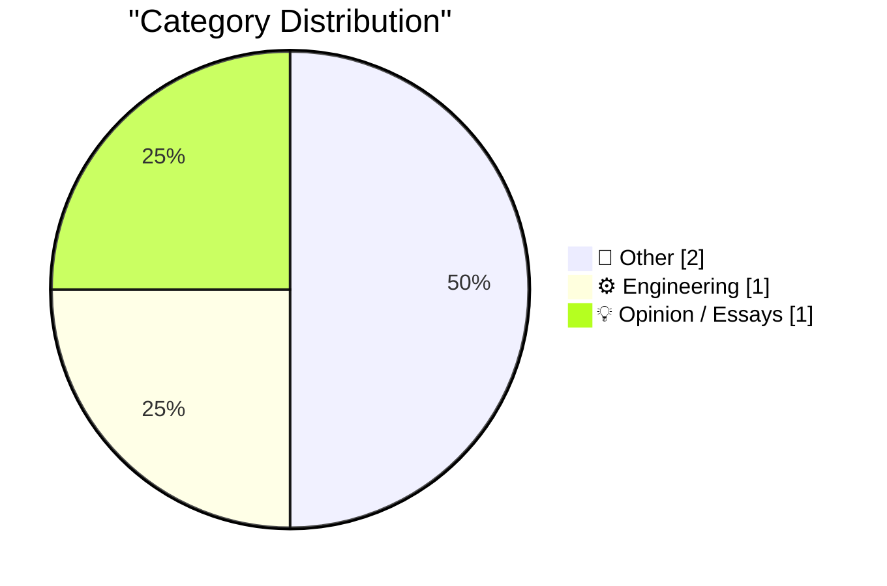
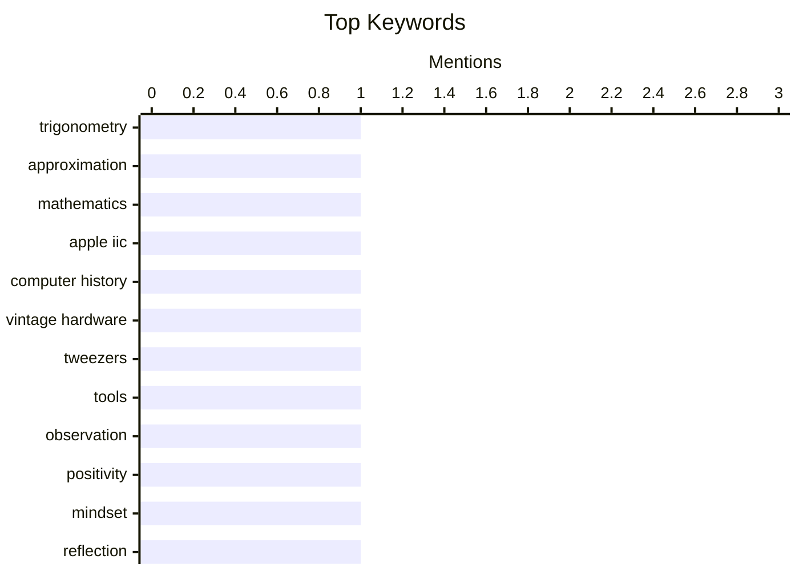

## Today's Highlights
Today's highlights reveal a fascinating interplay between historical technological evolution and the enduring importance of fundamental tools. From the miniaturization breakthroughs seen in classic computing to the simple utility of precision instruments, innovation often builds on foundational concepts. Meanwhile, new engineering approximations continue to refine our ability to solve complex problems efficiently.
---
## Must Read Today
1. **Approximation to solve an oblique triangle**
[Approximation to solve an oblique triangle](https://www.johndcook.com/blog/2026/04/23/solve-an-oblique-triangle/) — johndcook.com · 22h ago · ⚙️ Engineering
> This article extends a simple and accurate approximation method for angles in right triangles to solve oblique triangles. It builds on the previous post's approximation where the smaller angle of a right triangle is approximately a/c radians (shortest side 'a', hypotenuse 'c'). For an oblique triangle, the approach involves dropping an altitude to divide it into two right triangles. The approximation is then applied twice to these right triangles, yielding a practical method for angle estimation. This technique is particularly effective and accurate for small angles.
💡 **Why read it**: It offers a practical, simple, and accurate approximation method for calculating angles in right and oblique triangles, particularly useful for small angles.
🏷️ Trigonometry, Approximation, Mathematics
2. **Apple IIc: A smaller, sleeker Apple II from 1984**
[Apple IIc: A smaller, sleeker Apple II from 1984](https://dfarq.homeip.net/apple-iic/?utm_source=rss&#038;utm_medium=rss&#038;utm_campaign=apple-iic) — dfarq.homeip.net · 3h ago · 📝 Other
> The article introduces the Apple IIc, the fourth computer in the Apple II line, launched on April 24, 1984, marking a significant design departure from its predecessors. Unlike the desktop-bound Apple II, II+, and IIe, the IIc was designed as a compact, "transportable" machine. It integrated many components that were previously external peripherals, such as a 5.25-inch floppy drive and dedicated ports for a mouse, joystick, and printer. This design philosophy aimed to provide a more integrated and user-friendly computing experience. The Apple IIc thus represented a notable shift towards portability and all-in-one design within the Apple II series.
💡 **Why read it**: It provides historical context and technical details about the Apple IIc's innovative integrated design and its role in the evolution of personal computing.
🏷️ Apple IIc, Computer History, Vintage Hardware
3. **A Plethora of Tweezers**
[A Plethora of Tweezers](https://feed.tedium.co/link/15204/17324561/tweezer-weird-facts-history) — tedium.co · 11h ago · 📝 Other
> This brief article ponders the fundamental utility of tweezers in precisely isolating objects at a small scale. It highlights the inherent precision and dexterity required for effective tweezer use. The text surprisingly mentions the existence of an aptitude test for professional tweezing, suggesting a specialized skill set beyond casual application. This implies that mastering tweezers can be a professional-level capability. Ultimately, the article points out that this seemingly simple tool demands significant skill and precision for certain tasks.
💡 **Why read it**: It offers an interesting, albeit brief, perspective on the overlooked precision and specialized skill involved in using a common tool like tweezers.
🏷️ Tweezers, Tools, Observation
---
## Data Overview
| Sources Scanned | Articles Fetched | Time Window | Selected |
|:---:|:---:|:---:|:---:|
| 72/92 | 2112 -> 4 | 24h | **4** |
### Category Distribution

### Top Keywords

<details>
<summary>Plain Text Keyword Chart (Terminal Friendly)</summary>
```
trigonometry     │ ████████████████████ 1
approximation    │ ████████████████████ 1
mathematics      │ ████████████████████ 1
apple iic        │ ████████████████████ 1
computer history │ ████████████████████ 1
vintage hardware │ ████████████████████ 1
tweezers         │ ████████████████████ 1
tools            │ ████████████████████ 1
observation      │ ████████████████████ 1
positivity       │ ████████████████████ 1
```
</details>
### Topic Tags
**trigonometry**(1) · **approximation**(1) · **mathematics**(1) · apple iic(1) · computer history(1) · vintage hardware(1) · tweezers(1) · tools(1) · observation(1) · positivity(1) · mindset(1) · reflection(1)
---
## Other
### 1. Apple IIc: A smaller, sleeker Apple II from 1984
[Apple IIc: A smaller, sleeker Apple II from 1984](https://dfarq.homeip.net/apple-iic/?utm_source=rss&#038;utm_medium=rss&#038;utm_campaign=apple-iic) — **dfarq.homeip.net** · 3h ago · ⭐ 14/30
> The article introduces the Apple IIc, the fourth computer in the Apple II line, launched on April 24, 1984, marking a significant design departure from its predecessors. Unlike the desktop-bound Apple II, II+, and IIe, the IIc was designed as a compact, "transportable" machine. It integrated many components that were previously external peripherals, such as a 5.25-inch floppy drive and dedicated ports for a mouse, joystick, and printer. This design philosophy aimed to provide a more integrated and user-friendly computing experience. The Apple IIc thus represented a notable shift towards portability and all-in-one design within the Apple II series.
🏷️ Apple IIc, Computer History, Vintage Hardware
---
### 2. A Plethora of Tweezers
[A Plethora of Tweezers](https://feed.tedium.co/link/15204/17324561/tweezer-weird-facts-history) — **tedium.co** · 11h ago · ⭐ 9/30
> This brief article ponders the fundamental utility of tweezers in precisely isolating objects at a small scale. It highlights the inherent precision and dexterity required for effective tweezer use. The text surprisingly mentions the existence of an aptitude test for professional tweezing, suggesting a specialized skill set beyond casual application. This implies that mastering tweezers can be a professional-level capability. Ultimately, the article points out that this seemingly simple tool demands significant skill and precision for certain tasks.
🏷️ Tweezers, Tools, Observation
---
## Engineering
### 3. Approximation to solve an oblique triangle
[Approximation to solve an oblique triangle](https://www.johndcook.com/blog/2026/04/23/solve-an-oblique-triangle/) — **johndcook.com** · 22h ago · ⭐ 17/30
> This article extends a simple and accurate approximation method for angles in right triangles to solve oblique triangles. It builds on the previous post's approximation where the smaller angle of a right triangle is approximately a/c radians (shortest side 'a', hypotenuse 'c'). For an oblique triangle, the approach involves dropping an altitude to divide it into two right triangles. The approximation is then applied twice to these right triangles, yielding a practical method for angle estimation. This technique is particularly effective and accurate for small angles.
🏷️ Trigonometry, Approximation, Mathematics
---
## Opinion / Essays
### 4. Positivity
[Positivity](https://geohot.github.io//blog/jekyll/update/2026/04/24/positivity.html) — **geohot.github.io** · 22h ago · ⭐ 6/30
> This article is a personal reflection on the importance of maintaining a positive outlook in daily life. The author states that today is a good day to focus on positivity. They acknowledge a personal tendency to sometimes become overly focused on negative aspects, which can obscure the appreciation for good things. The piece serves as a simple, direct reminder to consciously shift perspective. The main takeaway is a personal commitment to embracing positivity and recognizing the good things that are present.
🏷️ Positivity, Mindset, Reflection
---
*Generated at 2026-04-24 14:09 | Scanned 72 sources -> 2112 articles -> selected 4*
*Based on the [Hacker News Popularity Contest 2025](https://refactoringenglish.com/tools/hn-popularity/) RSS source list recommended by [Andrej Karpathy](https://x.com/karpathy)*
*Produced by Dongdianr AI. Follow the same-name WeChat public account for more AI practical tips 💡*
