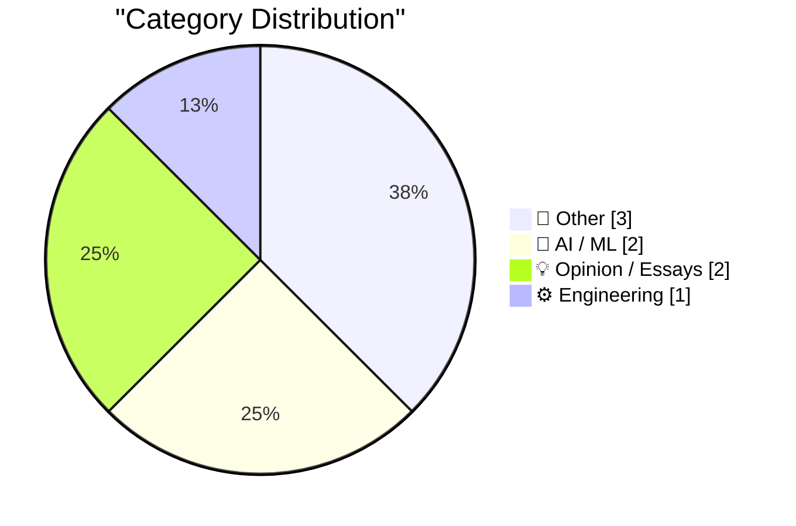
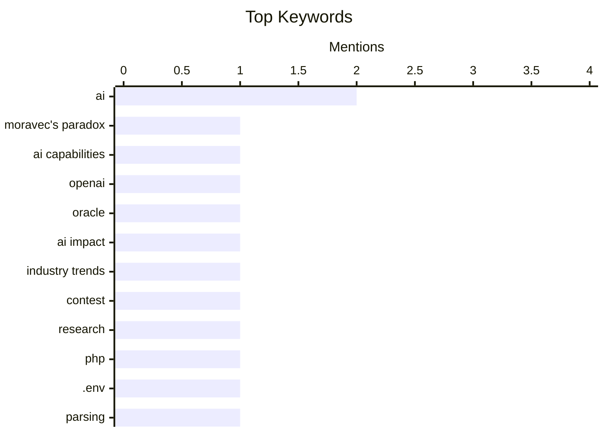

## Today's Highlights
Artificial intelligence continues to be a transformative force, sparking discussions on its disruptive market power against industry titans and raising profound questions about its evolving capabilities, including the concept of mutating AI. This rapid advancement prompts deeper inquiry into AI's future and its societal impact. Alongside these cutting-edge developments, the tech world remains engaged with practical engineering challenges and philosophical reflections on the nature of digital artifacts and foundational technical principles.
---
## Must Read Today
1. **A Mutating AI Powered Virus**
[A Mutating AI Powered Virus](https://geohot.github.io//blog/jekyll/update/2026/04/25/a-mutating-virus.html) — geohot.github.io · 22h ago · 🤖 AI / ML
> This article briefly discusses Moravec's paradox, highlighting the inverse order in which computers acquire skills compared to humans. It notes that AI first mastered calculations and board games, then progressed to writing and talking, and is now learning physical movement. This progression is presented as the opposite of animal development, where motor skills precede abstract thought. The core idea is that tasks easy for humans are hard for AI, and vice-versa, with AI's development path reinforcing this paradox. The piece suggests that Moravec's paradox remains a relevant framework for understanding AI's evolving capabilities.
💡 **Why read it**: It offers a concise perspective on Moravec's paradox, illustrating how AI's developmental path continues to challenge traditional notions of intelligence.
🏷️ AI, Moravec's paradox, AI capabilities
2. **Premium: How OpenAI Kills Oracle**
[Premium: How OpenAI Kills Oracle](https://www.wheresyoured.at/how-openai-kills-oracle/) — wheresyoured.at · 21h ago · 💡 Opinion / Essays
> This article's title sets the stage for a discussion on how OpenAI could disrupt Oracle's market position. The provided snippet, dated January 21, 2025, introduces Larry Ellison, CEO of Oracle, in Washington D.C., suggesting a high-stakes scenario. While the full content is not available, the introduction hints at a significant industry shift or strategic challenge for Oracle. The article's premise implies an analysis of competitive dynamics between a leading AI innovator and an established enterprise software giant. It aims to explore the potential for OpenAI's advancements to fundamentally impact Oracle's business model.
💡 **Why read it**: It hints at a significant and timely industry disruption scenario, exploring the potential competitive impact of OpenAI on a tech giant like Oracle.
🏷️ OpenAI, Oracle, AI impact, industry trends
3. **Blog prize for the big questions about AI**
[Blog prize for the big questions about AI](https://www.dwarkesh.com/p/blog-prize) — dwarkesh.com · 21h ago · 🤖 AI / ML
> This article announces a blog prize contest focused on addressing significant questions surrounding Artificial Intelligence. The primary, albeit not-so-secret, objective behind launching this contest is to identify and recruit a talented researcher. By soliciting public contributions on complex AI topics, the organizer aims to discover individuals with deep insights and strong analytical skills. This unconventional recruitment strategy leverages community engagement to source potential candidates. The initiative serves as a unique method for talent acquisition within the AI research domain.
💡 **Why read it**: It reveals an innovative and public-facing approach to recruiting AI researchers by leveraging a blog prize contest focused on critical AI questions.
🏷️ AI, contest, research
---
## Data Overview
| Sources Scanned | Articles Fetched | Time Window | Selected |
|:---:|:---:|:---:|:---:|
| 78/92 | 2206 -> 8 | 24h | **8** |
### Category Distribution

### Top Keywords

<details>
<summary>Plain Text Keyword Chart (Terminal Friendly)</summary>
```
ai                │ ████████████████████ 2
moravec's paradox │ ██████████░░░░░░░░░░ 1
ai capabilities   │ ██████████░░░░░░░░░░ 1
openai            │ ██████████░░░░░░░░░░ 1
oracle            │ ██████████░░░░░░░░░░ 1
ai impact         │ ██████████░░░░░░░░░░ 1
industry trends   │ ██████████░░░░░░░░░░ 1
contest           │ ██████████░░░░░░░░░░ 1
research          │ ██████████░░░░░░░░░░ 1
php               │ ██████████░░░░░░░░░░ 1
```
</details>
### Topic Tags
**ai**(2) · **moravec's paradox**(1) · **ai capabilities**(1) · openai(1) · oracle(1) · ai impact(1) · industry trends(1) · contest(1) · research(1) · php(1) · .env(1) · parsing(1) · configuration(1) · artifacts(1) · photography(1) · digital media(1) · philosophy(1) · physics(1) · pendulum(1) · nonlinearity(1)
---
## Other
### 1. How nonlinearity affects a pendulum
[How nonlinearity affects a pendulum](https://www.johndcook.com/blog/2026/04/24/nonlinear-pendulum/) — **johndcook.com** · 14h ago · ⭐ 16/30
> This article discusses the mathematical treatment of a pendulum's motion, specifically focusing on the impact of nonlinearity. It highlights that the true equation of motion is a nonlinear differential equation, `g/l * sin(theta)`. In introductory physics, this is often simplified by assuming small angles, allowing `sin(theta)` to be approximated as `theta`, which linearizes the equation. The article's purpose is to explore the consequences and behaviors that emerge when this small-angle approximation is not applied. Understanding the full nonlinear model is crucial for accurately describing a pendulum's behavior, especially during larger oscillations. This approach provides a deeper insight into the system's dynamics beyond simplified linear models.
🏷️ physics, pendulum, nonlinearity
---
### 2. nth derivative of a quotient
[nth derivative of a quotient](https://www.johndcook.com/blog/2026/04/25/nth-derivative-of-a-quotient/) — **johndcook.com** · 54m ago · ⭐ 15/30
> This article delves into the less commonly known and more complex formula for calculating the `nth` derivative of a quotient, contrasting it with the well-known `nth` derivative of a product. While the product rule's `nth` derivative bears a resemblance to the binomial theorem, the quotient rule's counterpart is significantly more intricate. The author begins by illustrating the application of the standard quotient rule once and then twice, laying the groundwork for understanding its recursive nature. This initial exploration hints at the complexity involved in deriving a general formula for higher-order derivatives of quotients. The article aims to demystify this advanced calculus topic.
🏷️ calculus, derivatives, mathematics
---
### 3. This Week on The Analog Antiquarian
[This Week on The Analog Antiquarian](https://www.filfre.net/2026/04/this-week-on-the-analog-antiquarian/) — **filfre.net** · 21h ago · ⭐ 10/30
> This article serves as an introduction to a new segment or topic within "The Analog Antiquarian" series, titled "At Long Last, the Bard." The brief snippet signals the commencement of an in-depth exploration related to this specific subject. While the content provided is minimal, the title and introduction suggest a focus on historical, cultural, or literary analysis, likely pertaining to a significant figure or theme. Readers can anticipate a detailed discussion that delves into the chosen topic from an "analog antiquarian" perspective. The article sets the stage for a potentially rich and informative piece of historical or cultural commentary.
🏷️ history, literature, antiquarian
---
## AI / ML
### 4. A Mutating AI Powered Virus
[A Mutating AI Powered Virus](https://geohot.github.io//blog/jekyll/update/2026/04/25/a-mutating-virus.html) — **geohot.github.io** · 22h ago · ⭐ 27/30
> This article briefly discusses Moravec's paradox, highlighting the inverse order in which computers acquire skills compared to humans. It notes that AI first mastered calculations and board games, then progressed to writing and talking, and is now learning physical movement. This progression is presented as the opposite of animal development, where motor skills precede abstract thought. The core idea is that tasks easy for humans are hard for AI, and vice-versa, with AI's development path reinforcing this paradox. The piece suggests that Moravec's paradox remains a relevant framework for understanding AI's evolving capabilities.
🏷️ AI, Moravec's paradox, AI capabilities
---
### 5. Blog prize for the big questions about AI
[Blog prize for the big questions about AI](https://www.dwarkesh.com/p/blog-prize) — **dwarkesh.com** · 21h ago · ⭐ 24/30
> This article announces a blog prize contest focused on addressing significant questions surrounding Artificial Intelligence. The primary, albeit not-so-secret, objective behind launching this contest is to identify and recruit a talented researcher. By soliciting public contributions on complex AI topics, the organizer aims to discover individuals with deep insights and strong analytical skills. This unconventional recruitment strategy leverages community engagement to source potential candidates. The initiative serves as a unique method for talent acquisition within the AI research domain.
🏷️ AI, contest, research
---
## Opinion / Essays
### 6. Premium: How OpenAI Kills Oracle
[Premium: How OpenAI Kills Oracle](https://www.wheresyoured.at/how-openai-kills-oracle/) — **wheresyoured.at** · 21h ago · ⭐ 26/30
> This article's title sets the stage for a discussion on how OpenAI could disrupt Oracle's market position. The provided snippet, dated January 21, 2025, introduces Larry Ellison, CEO of Oracle, in Washington D.C., suggesting a high-stakes scenario. While the full content is not available, the introduction hints at a significant industry shift or strategic challenge for Oracle. The article's premise implies an analysis of competitive dynamics between a leading AI innovator and an established enterprise software giant. It aims to explore the potential for OpenAI's advancements to fundamentally impact Oracle's business model.
🏷️ OpenAI, Oracle, AI impact, industry trends
---
### 7. Artifacts Are Alive (And Photographs are Dead)
[Artifacts Are Alive (And Photographs are Dead)](https://worksonmymachine.ai/p/artifacts-are-alive-and-photographs) — **worksonmymachine.substack.com** · 16m ago · ⭐ 18/30
> This article's provocative title, "Artifacts Are Alive (And Photographs are Dead)," suggests a philosophical exploration into the evolving nature and significance of digital artifacts versus traditional photographs. The provided snippet begins with an observation about a photograph of a coral reef in a dentist's office, setting a contemplative tone. While the full argument is not present, the title implies a discussion on how digital creations, perhaps due to their dynamic and interactive potential, possess a different kind of 'life' compared to static, immutable photographs. It likely delves into the changing perception and utility of visual media in the digital age. The article aims to challenge conventional views on what constitutes a 'living' or 'dead' form of media.
🏷️ artifacts, photography, digital media, philosophy
---
## Engineering
### 8. You can parse an .env file as an .ini with PHP - but there's a catch
[You can parse an .env file as an .ini with PHP - but there's a catch](https://shkspr.mobi/blog/2026/04/you-can-parse-an-env-file-as-an-ini-with-php-but-theres-a-catch/) — **shkspr.mobi** · 2h ago · ⭐ 19/30
> This article explores the possibility of parsing `.env` files, commonly used for environment variables, using PHP's `parse_ini_file()` function. It highlights that while this method appears to work and offers a simpler alternative to dedicated parsing libraries, there's a crucial caveat. The core issue lies in the subtly different parsing behaviors between `.env` and `.ini` file formats. These discrepancies can lead to unexpected results or misinterpretations of variables, despite the initial appearance of compatibility. Developers are cautioned to be aware of these behavioral differences to avoid potential configuration issues.
🏷️ PHP, .env, parsing, configuration
---
*Generated at 2026-04-25 14:07 | Scanned 78 sources -> 2206 articles -> selected 8*
*Based on the [Hacker News Popularity Contest 2025](https://refactoringenglish.com/tools/hn-popularity/) RSS source list recommended by [Andrej Karpathy](https://x.com/karpathy)*
*Produced by Dongdianr AI. Follow the same-name WeChat public account for more AI practical tips 💡*
