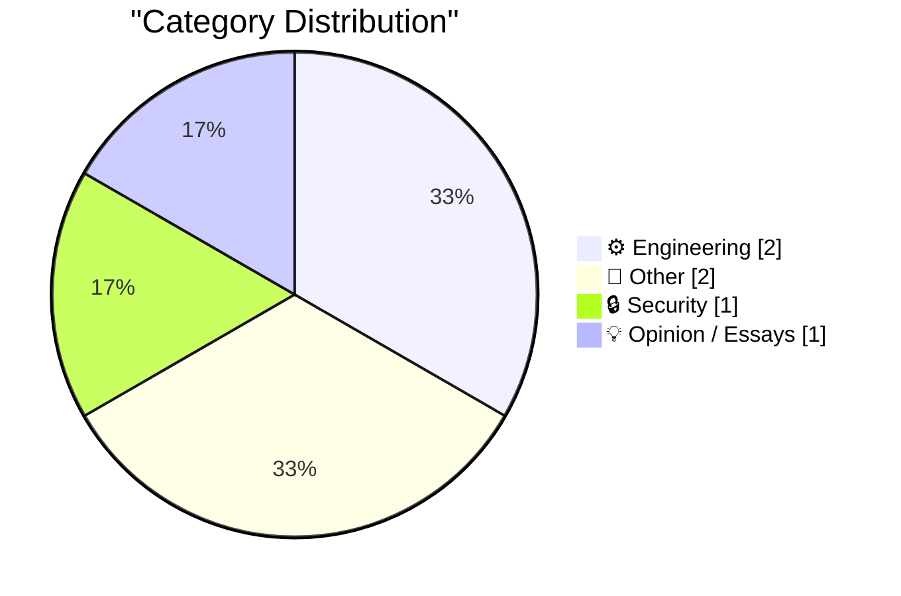
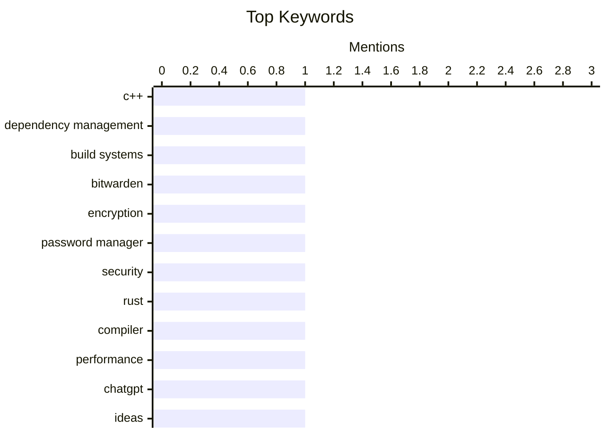

## Today's Highlights
The tech world is navigating a landscape defined by escalating complexity, from the notoriously difficult C/C++ dependency management to the humorous absurdity of AI image generation prompts. Artificial intelligence continues to profoundly impact how we work and interact, with tools like ChatGPT even influencing how ideas are presented. Amidst these evolving engineering challenges, the critical importance of robust security, exemplified by advanced encryption methods, remains a constant priority.
---
## Must Read Today
1. **A breakthrough in C/C++ dependency management**
[A breakthrough in C/C++ dependency management](https://lcamtuf.substack.com/p/a-breakthrough-in-cc-dependency-management) — lcamtuf.substack.com · 14h ago · ⚙️ Engineering
> C/C++ dependency management is notoriously complex due to header files, preprocessor directives, and build system intricacies, leading to slow builds and fragile configurations. The article proposes a novel approach using a custom preprocessor to generate a single, self-contained `.c` or `.cpp` file for each translation unit, eliminating complex include paths and build flags. This method also introduces a "dependency hash" to detect changes in transitive dependencies, ensuring efficient recompilation only when necessary. This promises to drastically reduce build times and simplify C/C++ project setup, making dependency management more robust and less error-prone.
💡 **Why read it**: It offers a potentially revolutionary, yet simple, approach to solve one of the most persistent and frustrating problems in C/C++ development.
🏷️ C++, dependency management, build systems
2. **How Bitwarden Encrypts and Decrypts Secrets**
[How Bitwarden Encrypts and Decrypts Secrets](https://blog.miguelgrinberg.com/post/how-bitwarden-encrypts-and-decrypts-secrets) — miguelgrinberg.com · 1m ago · 🔒 Security
> The article explains the cryptographic mechanisms Bitwarden uses to securely store and retrieve user secrets, particularly in the context of self-hosting with Vaultwarden. Bitwarden employs a multi-layered encryption strategy: a user's master password generates a master key via PBKDF2 (100,000 iterations for AES-256), which then encrypts an "organization key" and individual item keys. Each secret is encrypted with its own unique key, derived from the organization or master key, using AES-256-CBC with a unique IV. This robust, client-side encryption architecture ensures that even if the server is compromised, user secrets remain protected, as decryption keys are never transmitted or stored on the server.
💡 **Why read it**: It provides a clear, detailed technical breakdown of Bitwarden's client-side encryption architecture, which is crucial for understanding its security model.
🏷️ Bitwarden, encryption, password manager, security
3. **WHY ARE YOU LIKE THIS**
[WHY ARE YOU LIKE THIS](https://simonwillison.net/2026/Apr/25/why-are-you-like-this/#atom-everything) — simonwillison.net · 21h ago · ⚙️ Engineering
> The article humorously explores the escalating absurdity and complexity of AI image generation prompts, moving beyond simple requests to highly specific and bizarre scenarios. It showcases examples of increasingly convoluted prompts, such as a pelican riding a bicycle chased by a police car and an astronaut on a unicycle. The author highlights the AI's impressive ability to interpret and render these intricate, often nonsensical, instructions. The piece suggests that users are pushing the boundaries of AI's creative interpretation, leading to a fascinating and often comical exploration of its capabilities and limitations in generating complex, multi-element scenes.
💡 **Why read it**: It offers an entertaining and insightful look into the creative and often absurd ways users interact with and push the boundaries of AI image generation.
🏷️ Rust, compiler, performance
---
## Data Overview
| Sources Scanned | Articles Fetched | Time Window | Selected |
|:---:|:---:|:---:|:---:|
| 88/92 | 2532 -> 6 | 24h | **6** |
### Category Distribution

### Top Keywords

<details>
<summary>Plain Text Keyword Chart (Terminal Friendly)</summary>
```
c++                   │ ████████████████████ 1
dependency management │ ████████████████████ 1
build systems         │ ████████████████████ 1
bitwarden             │ ████████████████████ 1
encryption            │ ████████████████████ 1
password manager      │ ████████████████████ 1
security              │ ████████████████████ 1
rust                  │ ████████████████████ 1
compiler              │ ████████████████████ 1
performance           │ ████████████████████ 1
```
</details>
### Topic Tags
**c++**(1) · **dependency management**(1) · **build systems**(1) · bitwarden(1) · encryption(1) · password manager(1) · security(1) · rust(1) · compiler(1) · performance(1) · chatgpt(1) · ideas(1) · ai trends(1) · pendulum(1) · nonlinear equation(1) · mathematics(1) · reading list(1) · industrial engineering(1) · materials science(1)
---
## Engineering
### 1. A breakthrough in C/C++ dependency management
[A breakthrough in C/C++ dependency management](https://lcamtuf.substack.com/p/a-breakthrough-in-cc-dependency-management) — **lcamtuf.substack.com** · 14h ago · ⭐ 27/30
> C/C++ dependency management is notoriously complex due to header files, preprocessor directives, and build system intricacies, leading to slow builds and fragile configurations. The article proposes a novel approach using a custom preprocessor to generate a single, self-contained `.c` or `.cpp` file for each translation unit, eliminating complex include paths and build flags. This method also introduces a "dependency hash" to detect changes in transitive dependencies, ensuring efficient recompilation only when necessary. This promises to drastically reduce build times and simplify C/C++ project setup, making dependency management more robust and less error-prone.
🏷️ C++, dependency management, build systems
---
### 2. WHY ARE YOU LIKE THIS
[WHY ARE YOU LIKE THIS](https://simonwillison.net/2026/Apr/25/why-are-you-like-this/#atom-everything) — **simonwillison.net** · 21h ago · ⭐ 24/30
> The article humorously explores the escalating absurdity and complexity of AI image generation prompts, moving beyond simple requests to highly specific and bizarre scenarios. It showcases examples of increasingly convoluted prompts, such as a pelican riding a bicycle chased by a police car and an astronaut on a unicycle. The author highlights the AI's impressive ability to interpret and render these intricate, often nonsensical, instructions. The piece suggests that users are pushing the boundaries of AI's creative interpretation, leading to a fascinating and often comical exploration of its capabilities and limitations in generating complex, multi-element scenes.
🏷️ Rust, compiler, performance
---
## Other
### 3. Closed-form solution to the nonlinear pendulum equation
[Closed-form solution to the nonlinear pendulum equation](https://www.johndcook.com/blog/2026/04/25/exact-solution-nonlinear-pendulum/) — **johndcook.com** · 21h ago · ⭐ 17/30
> The article addresses the challenge of finding an exact, closed-form solution for the nonlinear pendulum equation, which is typically approximated by linearizing `sin θ` to `θ` for small displacements. It explains that while linearization is common, a more accurate closed-form solution exists using elliptic integrals. Specifically, the period of a nonlinear pendulum can be expressed using the complete elliptic integral of the first kind, `K(k)`, where `k = sin(θ₀/2)` and `θ₀` is the initial displacement. This demonstrates that a precise, closed-form solution for the nonlinear pendulum's period is achievable through the application of elliptic integrals, offering a significant improvement over simple linearization for a wider range of initial conditions.
🏷️ pendulum, nonlinear equation, mathematics
---
### 4. Reading List 04/25/26
[Reading List 04/25/26](https://www.construction-physics.com/p/reading-list-042526) — **construction-physics.com** · 23h ago · ⭐ 10/30
> This article is a curated reading list, presenting a collection of diverse topics related to engineering, manufacturing, and infrastructure. The list covers subjects such as transformer steel manufacturing, textile engineering, the rapid commissioning of power plants, and infrasound. It serves as a digest of interesting technical articles and insights from various fields. The article offers a broad overview of recent developments and intriguing topics across multiple engineering and scientific disciplines, encouraging further exploration.
🏷️ reading list, industrial engineering, materials science
---
## Security
### 5. How Bitwarden Encrypts and Decrypts Secrets
[How Bitwarden Encrypts and Decrypts Secrets](https://blog.miguelgrinberg.com/post/how-bitwarden-encrypts-and-decrypts-secrets) — **miguelgrinberg.com** · 1m ago · ⭐ 26/30
> The article explains the cryptographic mechanisms Bitwarden uses to securely store and retrieve user secrets, particularly in the context of self-hosting with Vaultwarden. Bitwarden employs a multi-layered encryption strategy: a user's master password generates a master key via PBKDF2 (100,000 iterations for AES-256), which then encrypts an "organization key" and individual item keys. Each secret is encrypted with its own unique key, derived from the organization or master key, using AES-256-CBC with a unique IV. This robust, client-side encryption architecture ensures that even if the server is compromised, user secrets remain protected, as decryption keys are never transmitted or stored on the server.
🏷️ Bitwarden, encryption, password manager, security
---
## Opinion / Essays
### 6. The Satisfaction of a ChatGPT Plan
[The Satisfaction of a ChatGPT Plan](https://idiallo.com/byte-size/the-satisfaction-of-a-chatgpt-plan?src=feed) — **idiallo.com** · 20h ago · ⭐ 23/30
> The article discusses a phenomenon where people, instead of sharing raw ideas, now present detailed "ChatGPT plans" for business ideas, generated entirely by AI, finding satisfaction in the telling rather than the building. The author observes that AI tools like ChatGPT enable individuals to quickly generate comprehensive business plans, including market analysis and strategy, without traditional effort. This shifts the "satisfaction" from the arduous process of development to the immediate gratification of articulating a seemingly complete plan. The prevalence of AI-generated plans highlights a new form of idea sharing and satisfaction, where the perceived completeness of an AI-produced blueprint can overshadow the practical challenges and rewards of bringing an idea to fruition.
🏷️ ChatGPT, ideas, AI trends
---
*Generated at 2026-04-26 14:07 | Scanned 88 sources -> 2532 articles -> selected 6*
*Based on the [Hacker News Popularity Contest 2025](https://refactoringenglish.com/tools/hn-popularity/) RSS source list recommended by [Andrej Karpathy](https://x.com/karpathy)*
*Produced by Dongdianr AI. Follow the same-name WeChat public account for more AI practical tips 💡*
