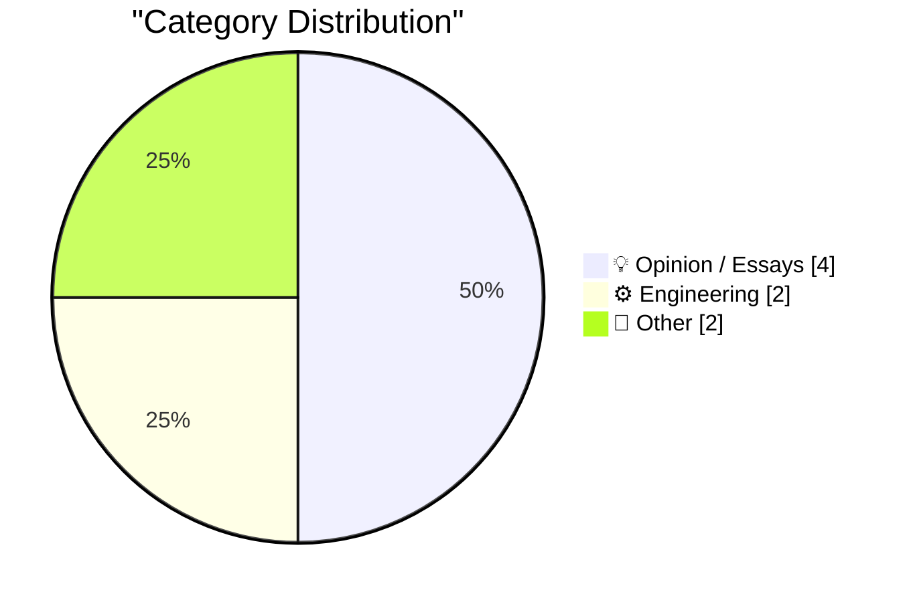
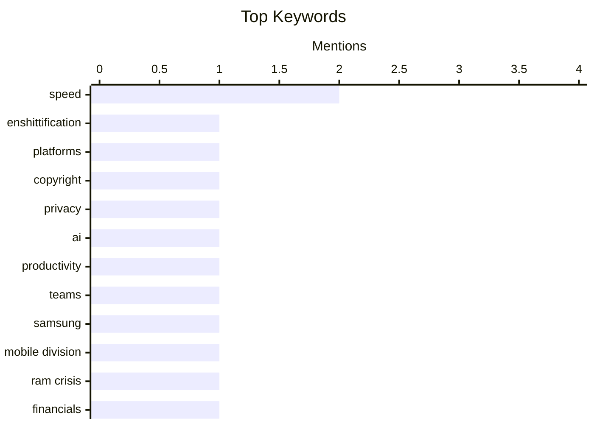

## Today's Highlights
Today's tech highlights point to a challenging landscape marked by both decline and complex productivity issues. Concerns are rising over the "enshittification multiverse" of platforms, while major players like Samsung face unprecedented mobile division losses. Simultaneously, new perspectives on engineering productivity suggest that boosting individual speed, even with AI, doesn't always translate to collective gains. This echoes historical lessons from companies like Xerox, who pioneered groundbreaking innovations but ultimately failed to capitalize on them.
---
## Must Read Today
1. **Pluralistic: The enshittification multiverse (27 Apr 2026)**
[Pluralistic: The enshittification multiverse (27 Apr 2026)](https://pluralistic.net/2026/04/27/analogs-and-analogies/) — pluralistic.net · 5h ago · 💡 Opinion / Essays
> This article introduces the concept of the "enshittification multiverse" as a useful analogy for the degradation of complex digital and societal ecosystems. It presents a curated collection of links and commentary on diverse topics, including the prevalence of "parasites" in complex systems and legal issues like "attempted infringement" and DMCA's impact on medical implants. Further discussions touch on copyright, privacy, and political issues, all viewed through this critical lens. The overarching theme suggests a critical examination of how systems tend to decay or become exploitative over time. The article serves as a digest of current events and critical observations illustrating the pervasive nature of enshittification.
💡 **Why read it**: It offers a critical perspective on the degradation of digital and societal systems, providing a diverse set of examples to illustrate the "enshittification multiverse" concept.
🏷️ enshittification, platforms, copyright, privacy
2. **Collective Speed Is Not the Summation of Individual Speed**
[Collective Speed Is Not the Summation of Individual Speed](https://blog.jim-nielsen.com/2026/collective-speed-isnt-the-sum-of individual-speed/) — blog.jim-nielsen.com · 19h ago · ⚙️ Engineering
> The article argues that increasing individual speed, such as through AI-assisted coding that might make developers 10x faster, does not proportionally increase collective or organizational speed and quality. Drawing an analogy to a 4x100 relay race, it highlights that team performance depends on coordination, handoffs, and overall system efficiency, not just the raw speed of individual runners. While AI can accelerate individual tasks, it doesn't inherently improve the complex interdependencies and communication required for a "fast company" or better software. The core takeaway is that optimizing for individual velocity without addressing systemic bottlenecks can be counterproductive to overall project success.
💡 **Why read it**: It provides a crucial perspective on team productivity, arguing that individual speed enhancements, like those from AI, do not automatically translate to improved collective output or software quality.
🏷️ speed, AI, productivity, teams
3. **Report Claims Samsung Might Post Its First-Ever Mobile Division Loss This Year, Blaming RAM Crisis**
[Report Claims Samsung Might Post Its First-Ever Mobile Division Loss This Year, Blaming RAM Crisis](https://9to5google.com/2026/04/22/samsung-is-increasingly-worried-about-first-ever-mobile-division-loss-in-ram-crisis-report/) — daringfireball.net · 20h ago · 📝 Other
> Samsung's mobile (MX) division, historically always profitable, is reportedly facing its first-ever operating loss this year, a significant financial downturn. This concerning development is primarily attributed to a severe RAM crisis impacting the industry. Internal cuts were initiated in March, and a new report from Korea (via Jukan) suggests this loss is now "all but certain." TM Roh, head of Samsung's mobile division, has explicitly voiced concerns about the "possibility" of this unprecedented financial downturn. This situation highlights the severe impact of supply chain issues, specifically in memory components, on even dominant tech giants.
💡 **Why read it**: It reveals a significant financial challenge for Samsung's mobile division, potentially marking its first-ever operating loss due to a RAM crisis, underscoring the volatility of the tech supply chain.
🏷️ Samsung, mobile division, RAM crisis, financials
---
## Data Overview
| Sources Scanned | Articles Fetched | Time Window | Selected |
|:---:|:---:|:---:|:---:|
| 86/92 | 2402 -> 8 | 24h | **8** |
### Category Distribution

### Top Keywords

<details>
<summary>Plain Text Keyword Chart (Terminal Friendly)</summary>
```
speed            │ ████████████████████ 2
enshittification │ ██████████░░░░░░░░░░ 1
platforms        │ ██████████░░░░░░░░░░ 1
copyright        │ ██████████░░░░░░░░░░ 1
privacy          │ ██████████░░░░░░░░░░ 1
ai               │ ██████████░░░░░░░░░░ 1
productivity     │ ██████████░░░░░░░░░░ 1
teams            │ ██████████░░░░░░░░░░ 1
samsung          │ ██████████░░░░░░░░░░ 1
mobile division  │ ██████████░░░░░░░░░░ 1
```
</details>
### Topic Tags
**speed**(2) · **enshittification**(1) · **platforms**(1) · copyright(1) · privacy(1) · ai(1) · productivity(1) · teams(1) · samsung(1) · mobile division(1) · ram crisis(1) · financials(1) · xerox(1) · gui(1) · history(1) · innovation(1) · intelligence(1) · power(1) · science(1) · verification(1)
---
## Opinion / Essays
### 1. Pluralistic: The enshittification multiverse (27 Apr 2026)
[Pluralistic: The enshittification multiverse (27 Apr 2026)](https://pluralistic.net/2026/04/27/analogs-and-analogies/) — **pluralistic.net** · 5h ago · ⭐ 24/30
> This article introduces the concept of the "enshittification multiverse" as a useful analogy for the degradation of complex digital and societal ecosystems. It presents a curated collection of links and commentary on diverse topics, including the prevalence of "parasites" in complex systems and legal issues like "attempted infringement" and DMCA's impact on medical implants. Further discussions touch on copyright, privacy, and political issues, all viewed through this critical lens. The overarching theme suggests a critical examination of how systems tend to decay or become exploitative over time. The article serves as a digest of current events and critical observations illustrating the pervasive nature of enshittification.
🏷️ enshittification, platforms, copyright, privacy
---
### 2. What I've been thinking about this weekend - More open questions, intelligence vs power, the problem of verification in science, the parallel discovery of Darwinism
[What I've been thinking about this weekend - More open questions, intelligence vs power, the problem of verification in science, the parallel discovery of Darwinism](https://www.dwarkesh.com/p/what-ive-been-thinking-april-27) — **dwarkesh.com** · 15m ago · ⭐ 19/30
> This article presents a "hodge podge" of reflections on various intellectual topics considered over a weekend. Key themes include the relationship between intelligence and power, exploring whether one necessarily leads to the other or if they are distinct pursuits. It also delves into the critical "problem of verification in science," questioning how scientific claims are rigorously validated and the challenges involved. Another point of contemplation is the "parallel discovery of Darwinism," highlighting instances where significant scientific theories emerge independently from multiple researchers. The article offers a collection of open-ended philosophical and scientific questions for readers to ponder.
🏷️ intelligence, power, science, verification
---
### 3. ★ The New York Times Printed the Wrong Crossword Grid Last Sunday, and I Find That Timing Serendipitous
[★ The New York Times Printed the Wrong Crossword Grid Last Sunday, and I Find That Timing Serendipitous](https://daringfireball.net/2026/04/nyt_wrong_crossword_grid) — **daringfireball.net** · 18h ago · ⭐ 17/30
> The article uses the New York Times mistakenly printing the wrong crossword grid as a serendipitous event to reflect on contrasting philosophies of work and error. It juxtaposes the "Software brain" mindset, which prioritizes speed and iteration ("Go faster; do more; the only mistake you can’t fix is having gone too slow"), with the "Hardware brain" approach. The "Hardware brain" advocates for meticulousness and perfection ("Slow down; do less; focus; strive for perfection and never settle for less than excellence; mistakes are forever"). The incident serves as a tangible example of how even in seemingly low-stakes scenarios, the consequences of haste can be permanent, prompting a deeper consideration of quality versus velocity.
🏷️ perfection, speed, reflection, crossword
---
### 4. DF Paraphernalia: Last Call for This Round of T-Shirts and Hoodies
[DF Paraphernalia: Last Call for This Round of T-Shirts and Hoodies](https://store.daringfireball.net/) — **daringfireball.net** · 18h ago · ⭐ 11/30
> This article announces the "last call" for the current round of Daring Fireball T-shirts and hoodies, serving as a merchandise promotion. Coincidentally, the announcement aligns with the 20th anniversary of the author, John Gruber, transitioning to full-time writing for Daring Fireball, after four years of part-time work. Gruber reflects on his initial declaration, "Daring Fireball is what I love to do," affirming its continued truth two decades later. The piece invites readers, both new and old, to revisit his original 2006 announcement and consider purchasing merchandise. It celebrates a significant milestone in the site's history while promoting its branded apparel.
🏷️ Daring Fireball, merchandise, anniversary
---
## Engineering
### 5. Collective Speed Is Not the Summation of Individual Speed
[Collective Speed Is Not the Summation of Individual Speed](https://blog.jim-nielsen.com/2026/collective-speed-isnt-the-sum-of individual-speed/) — **blog.jim-nielsen.com** · 19h ago · ⭐ 24/30
> The article argues that increasing individual speed, such as through AI-assisted coding that might make developers 10x faster, does not proportionally increase collective or organizational speed and quality. Drawing an analogy to a 4x100 relay race, it highlights that team performance depends on coordination, handoffs, and overall system efficiency, not just the raw speed of individual runners. While AI can accelerate individual tasks, it doesn't inherently improve the complex interdependencies and communication required for a "fast company" or better software. The core takeaway is that optimizing for individual velocity without addressing systemic bottlenecks can be counterproductive to overall project success.
🏷️ speed, AI, productivity, teams
---
### 6. How Xerox invented the GUI and lost it
[How Xerox invented the GUI and lost it](https://dfarq.homeip.net/how-xerox-invented-the-gui-and-lost-it/?utm_source=rss&#038;utm_medium=rss&#038;utm_campaign=how-xerox-invented-the-gui-and-lost-it) — **dfarq.homeip.net** · 3h ago · ⭐ 22/30
> The article discusses how Xerox, a seemingly visionary company in the 1960s, pioneered the Graphical User Interface (GUI) but ultimately failed to capitalize on its invention. Xerox PARC developed groundbreaking technologies like the Alto computer, Ethernet, and the first laser printer, alongside the GUI with icons, windows, and a mouse. However, due to internal corporate culture, a focus on copiers, and a failure to understand the market potential, Xerox did not commercialize these innovations effectively. This allowed companies like Apple (with the Lisa and Macintosh) and later Microsoft to adopt and popularize the GUI, leading to Xerox losing its lead in a technology it created. The article serves as a cautionary tale about innovation without effective commercialization.
🏷️ Xerox, GUI, history, innovation
---
## Other
### 7. Report Claims Samsung Might Post Its First-Ever Mobile Division Loss This Year, Blaming RAM Crisis
[Report Claims Samsung Might Post Its First-Ever Mobile Division Loss This Year, Blaming RAM Crisis](https://9to5google.com/2026/04/22/samsung-is-increasingly-worried-about-first-ever-mobile-division-loss-in-ram-crisis-report/) — **daringfireball.net** · 20h ago · ⭐ 22/30
> Samsung's mobile (MX) division, historically always profitable, is reportedly facing its first-ever operating loss this year, a significant financial downturn. This concerning development is primarily attributed to a severe RAM crisis impacting the industry. Internal cuts were initiated in March, and a new report from Korea (via Jukan) suggests this loss is now "all but certain." TM Roh, head of Samsung's mobile division, has explicitly voiced concerns about the "possibility" of this unprecedented financial downturn. This situation highlights the severe impact of supply chain issues, specifically in memory components, on even dominant tech giants.
🏷️ Samsung, mobile division, RAM crisis, financials
---
### 8. Theatre Review: Hadestown ★★★★★
[Theatre Review: Hadestown ★★★★★](https://shkspr.mobi/blog/2026/04/theatre-review-hadestown/) — **shkspr.mobi** · 2h ago · ⭐ 13/30
> This is a five-star review praising Anaïs Mitchell's musical "Hadestown" as a magical and joyful theatrical experience. The reviewer highlights the exceptional cast's ability to evoke strong emotions, suggesting a standing ovation was deserved after every song. The production's opening is described as intimate, almost like dinner theatre, especially from the front stalls. While the first act is noted for its busy nature, the overall impression is one of pure theatrical delight. The review strongly recommends the show for its emotional depth and captivating performance.
🏷️ theatre, Hadestown, musical, review
---
*Generated at 2026-04-27 14:07 | Scanned 86 sources -> 2402 articles -> selected 8*
*Based on the [Hacker News Popularity Contest 2025](https://refactoringenglish.com/tools/hn-popularity/) RSS source list recommended by [Andrej Karpathy](https://x.com/karpathy)*
*Produced by Dongdianr AI. Follow the same-name WeChat public account for more AI practical tips 💡*
