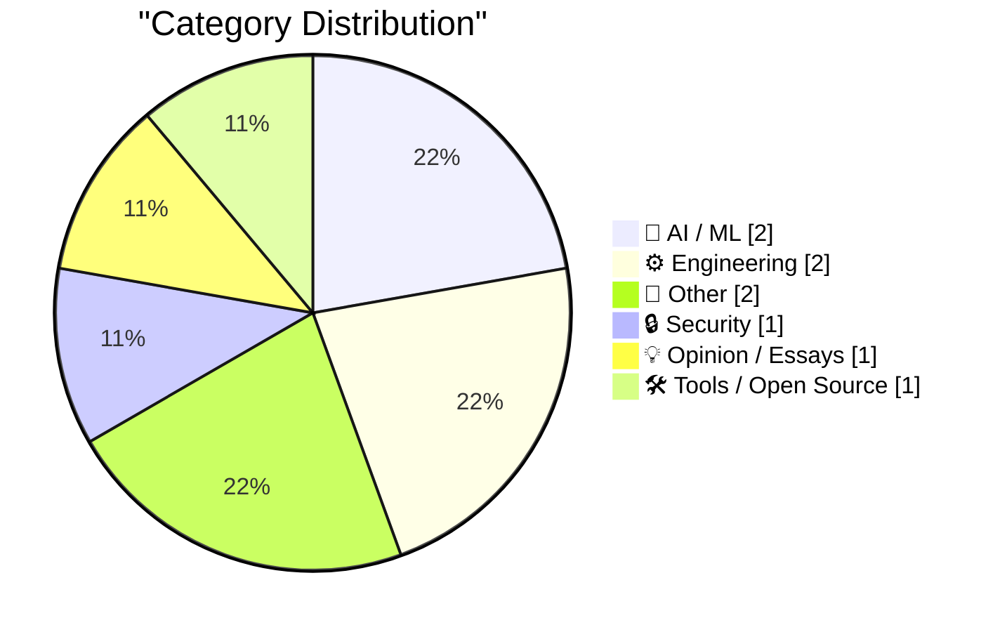
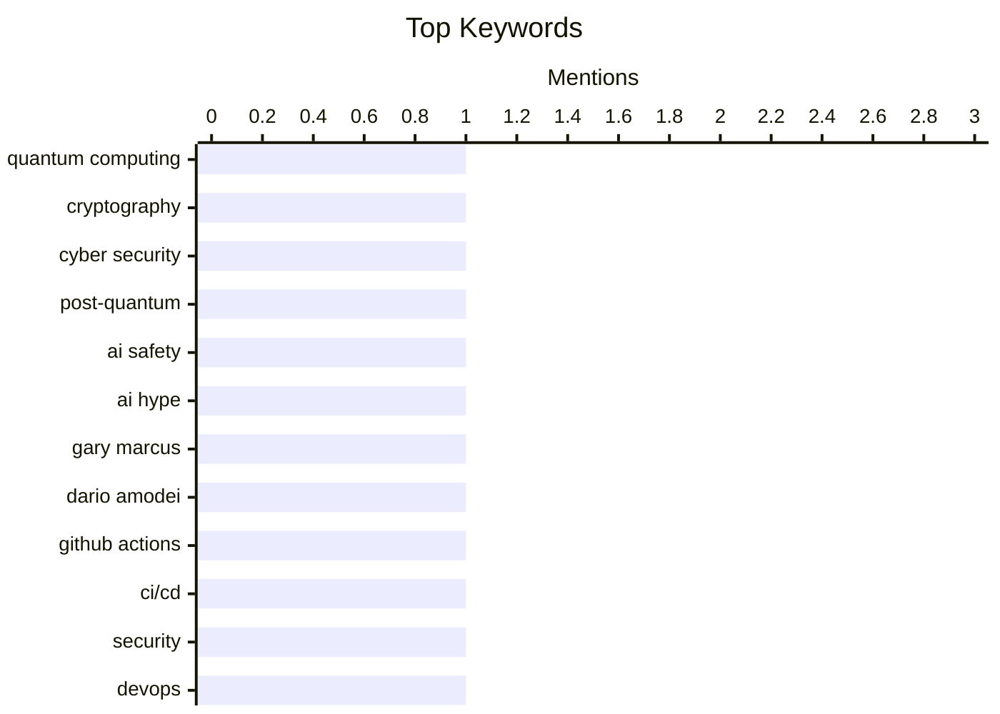

## Today's Highlights
Today's tech discussions reveal a heightened focus on the security vulnerabilities inherent in complex systems, from a looming "cyber apocalypse" to weaknesses in critical development tools like GitHub Actions. Simultaneously, the AI industry faces scrutiny over the disconnect between its "AI safety" rhetoric and the real-world ethical and social challenges emerging from rapid deployment. These trends collectively underscore the persistent difficulty in truly understanding and managing the intricate technological landscapes we build, often leading to a cycle of repeating past mistakes.
---
## Must Read Today
1. **Anthropic Mythos – We’ve Opened Pandora’s Box**
[Anthropic Mythos – We’ve Opened Pandora’s Box](https://steveblank.com/2026/04/28/anthropic-mythos-weve-opened-pandoras-box/) — steveblank.com · 1h ago · 🔒 Security
> The cybersecurity community's decade-long prediction of a "cyber apocalypse" tied to Cryptographically Relevant Quantum Computers (CRQC) breaking public-key cryptography is a misdirection. Instead of a single catastrophic event, the real threat is a continuous, evolving series of "micro-apocalypses" from AI-driven cyberattacks. AI agents can autonomously identify vulnerabilities, craft exploits, and launch sophisticated attacks at machine speed, rendering traditional human-centric defense obsolete. This shift means the "cyber apocalypse" is not a future event but an ongoing, distributed reality. The focus should shift from a singular quantum computing threat to the immediate and continuous danger posed by AI-powered cyber warfare, which is already here.
💡 **Why read it**: It reframes the long-anticipated 'cyber apocalypse' from a quantum computing threat to an immediate, ongoing danger from AI-driven cyberattacks, urging a re-evaluation of cybersecurity strategies.
🏷️ Quantum computing, cryptography, cyber security, post-quantum
2. **Dario Amodei, hype, AI safety, and the explosion of vibe-coded AI disasters**
[Dario Amodei, hype, AI safety, and the explosion of vibe-coded AI disasters](https://garymarcus.substack.com/p/dario-amodei-hype-ai-safety-and-the) — garymarcus.substack.com · 21h ago · 🤖 AI / ML
> The article critiques the disconnect between the AI industry's "AI safety" rhetoric, exemplified by figures like Dario Amodei, and the actual deployment of flawed AI systems. It argues that despite claims of caution, companies like Anthropic (co-founded by Amodei) release "vibe-coded" AI systems prone to errors, hallucinations, and biases without sufficient testing. The author highlights that the focus on hypothetical future superintelligence risks often overshadows the immediate, tangible harms caused by current, poorly-vetted AI applications. This creates a "safety theater" that distracts from real-world issues. The AI industry's emphasis on long-term, existential AI safety risks often serves as a smokescreen for the immediate, practical problems and ethical failures of current AI deployments.
💡 **Why read it**: It critically examines the 'AI safety' discourse, arguing that industry leaders' focus on future existential risks distracts from the immediate, real-world harms of current, flawed AI systems.
🏷️ AI safety, AI hype, Gary Marcus, Dario Amodei
3. **GitHub Actions is the weakest link**
[GitHub Actions is the weakest link](https://nesbitt.io/2026/04/28/github-actions-is-the-weakest-link.html) — nesbitt.io · 4h ago · ⚙️ Engineering
> GitHub Actions, while powerful, introduces significant security vulnerabilities due to its reliance on third-party actions and the `workflow_dispatch` trigger. The `workflow_dispatch` trigger allows anyone with write access to a repository to run arbitrary workflows, potentially compromising secrets and the build environment. Furthermore, using third-party actions from the GitHub Marketplace introduces supply chain risks, as these actions can be updated or malicious code injected without explicit review. The convenience of GitHub Actions often leads to overlooking these critical security implications, making it a prime target for attackers. Organizations must implement stringent security practices, including careful auditing of third-party actions and restricting `workflow_dispatch` access, to mitigate the inherent risks of GitHub Actions.
💡 **Why read it**: It highlights critical security vulnerabilities in GitHub Actions, particularly concerning `workflow_dispatch` and third-party actions, which are crucial for developers and security professionals to understand.
🏷️ GitHub Actions, CI/CD, security, DevOps
---
## Data Overview
| Sources Scanned | Articles Fetched | Time Window | Selected |
|:---:|:---:|:---:|:---:|
| 77/92 | 2199 -> 9 | 24h | **9** |
### Category Distribution

### Top Keywords

<details>
<summary>Plain Text Keyword Chart (Terminal Friendly)</summary>
```
quantum computing │ ████████████████████ 1
cryptography      │ ████████████████████ 1
cyber security    │ ████████████████████ 1
post-quantum      │ ████████████████████ 1
ai safety         │ ████████████████████ 1
ai hype           │ ████████████████████ 1
gary marcus       │ ████████████████████ 1
dario amodei      │ ████████████████████ 1
github actions    │ ████████████████████ 1
ci/cd             │ ████████████████████ 1
```
</details>
### Topic Tags
**quantum computing**(1) · **cryptography**(1) · **cyber security**(1) · post-quantum(1) · ai safety(1) · ai hype(1) · gary marcus(1) · dario amodei(1) · github actions(1) · ci/cd(1) · security(1) · devops(1) · ai ethics(1) · human-ai interaction(1) · ai policy(1) · social ai(1) · systems thinking(1) · system design(1) · complex systems(1) · architecture(1)
---
## AI / ML
### 1. Dario Amodei, hype, AI safety, and the explosion of vibe-coded AI disasters
[Dario Amodei, hype, AI safety, and the explosion of vibe-coded AI disasters](https://garymarcus.substack.com/p/dario-amodei-hype-ai-safety-and-the) — **garymarcus.substack.com** · 21h ago · ⭐ 26/30
> The article critiques the disconnect between the AI industry's "AI safety" rhetoric, exemplified by figures like Dario Amodei, and the actual deployment of flawed AI systems. It argues that despite claims of caution, companies like Anthropic (co-founded by Amodei) release "vibe-coded" AI systems prone to errors, hallucinations, and biases without sufficient testing. The author highlights that the focus on hypothetical future superintelligence risks often overshadows the immediate, tangible harms caused by current, poorly-vetted AI applications. This creates a "safety theater" that distracts from real-world issues. The AI industry's emphasis on long-term, existential AI safety risks often serves as a smokescreen for the immediate, practical problems and ethical failures of current AI deployments.
🏷️ AI safety, AI hype, Gary Marcus, Dario Amodei
---
### 2. Weekly Update 501
[Weekly Update 501](https://www.troyhunt.com/weekly-update-501/) — **troyhunt.com** · 9h ago · ⭐ 25/30
> The article humorously, yet pointedly, addresses the emerging social and ethical considerations surrounding human interaction with AI, specifically the need for "equality policies" for AI bots. It discusses the absurdity and underlying necessity of creating policies to ensure AI bots are treated with respect, similar to human counterparts. This reflects a "peak 2026" sentiment, where the integration of AI into daily operations necessitates new social norms and guidelines. The author implies that as AI becomes more sophisticated and integrated, the lines between human and machine interaction blur, prompting novel ethical dilemmas. The need for policies governing human-AI interaction, even if tongue-in-cheek, underscores the rapid evolution of AI and its profound impact on societal norms and ethical frameworks.
🏷️ AI ethics, human-AI interaction, AI policy, social AI
---
## Engineering
### 3. GitHub Actions is the weakest link
[GitHub Actions is the weakest link](https://nesbitt.io/2026/04/28/github-actions-is-the-weakest-link.html) — **nesbitt.io** · 4h ago · ⭐ 26/30
> GitHub Actions, while powerful, introduces significant security vulnerabilities due to its reliance on third-party actions and the `workflow_dispatch` trigger. The `workflow_dispatch` trigger allows anyone with write access to a repository to run arbitrary workflows, potentially compromising secrets and the build environment. Furthermore, using third-party actions from the GitHub Marketplace introduces supply chain risks, as these actions can be updated or malicious code injected without explicit review. The convenience of GitHub Actions often leads to overlooking these critical security implications, making it a prime target for attackers. Organizations must implement stringent security practices, including careful auditing of third-party actions and restricting `workflow_dispatch` access, to mitigate the inherent risks of GitHub Actions.
🏷️ GitHub Actions, CI/CD, security, DevOps
---
### 4. Understanding systems
[Understanding systems](https://entropicthoughts.com/understanding-systems) — **entropicthoughts.com** · 16h ago · ⭐ 21/30
> The article explores the fundamental challenge of understanding complex systems, emphasizing that true comprehension goes beyond merely knowing components or processes. It posits that understanding a system requires grasping its emergent properties, interdependencies, feedback loops, and how it behaves under various conditions. Simply listing parts or steps is insufficient; one must comprehend the "why" and "how" of its overall function and dysfunction. This holistic view is crucial for effective design, troubleshooting, and prediction within any system, from software to biological. Genuine understanding of a system necessitates a holistic perspective that integrates its components, interactions, and emergent behaviors, rather than just a superficial knowledge of its parts.
🏷️ Systems thinking, system design, complex systems, architecture
---
## Other
### 5. Circular arc approximation
[Circular arc approximation](https://www.johndcook.com/blog/2026/04/28/circular-arc-approximation/) — **johndcook.com** · 58m ago · ⭐ 17/30
> The article presents a method for approximating the length of a circular arc given specific chord lengths. It details how to calculate the arc length (rθ) when provided with the length of the full arc's chord (c) and the length of half the arc's chord (b). The method involves using geometric relationships to derive the central angle θ and radius r from c and b, then applying the arc length formula. This is a practical mathematical problem with applications in geometry and engineering. The article provides a specific geometric formula and method to accurately approximate the length of a circular arc using only the lengths of its full and half-arc chords.
🏷️ Circular arc, geometry, approximation, mathematics
---
### 6. TRS-80 Model 100
[TRS-80 Model 100](https://dfarq.homeip.net/trs-80-model-100/?utm_source=rss&#038;utm_medium=rss&#038;utm_campaign=trs-80-model-100) — **dfarq.homeip.net** · 1h ago · ⭐ 14/30
> The article provides a historical overview of the TRS-80 Model 100, an early and influential laptop computer. Manufactured by Kyocera in Japan (as the Kyotronic-85) and marketed by Radio Shack, the TRS-80 Model 100 was notable for its portability and built-in applications. It featured a full-size keyboard, an LCD screen, and ran on AA batteries, making it a pioneering device for mobile computing. Despite its limited processing power by modern standards, it was highly popular among journalists and writers for its instant-on capability and word processing functions. The TRS-80 Model 100 was a groundbreaking early laptop that significantly influenced mobile computing, demonstrating the demand for portable, functional devices.
🏷️ TRS-80, vintage computer, computer history, Kyocera
---
## Security
### 7. Anthropic Mythos – We’ve Opened Pandora’s Box
[Anthropic Mythos – We’ve Opened Pandora’s Box](https://steveblank.com/2026/04/28/anthropic-mythos-weve-opened-pandoras-box/) — **steveblank.com** · 1h ago · ⭐ 29/30
> The cybersecurity community's decade-long prediction of a "cyber apocalypse" tied to Cryptographically Relevant Quantum Computers (CRQC) breaking public-key cryptography is a misdirection. Instead of a single catastrophic event, the real threat is a continuous, evolving series of "micro-apocalypses" from AI-driven cyberattacks. AI agents can autonomously identify vulnerabilities, craft exploits, and launch sophisticated attacks at machine speed, rendering traditional human-centric defense obsolete. This shift means the "cyber apocalypse" is not a future event but an ongoing, distributed reality. The focus should shift from a singular quantum computing threat to the immediate and continuous danger posed by AI-powered cyber warfare, which is already here.
🏷️ Quantum computing, cryptography, cyber security, post-quantum
---
## Opinion / Essays
### 8. The Loop: everything has happened before, and everything will happen again
[The Loop: everything has happened before, and everything will happen again](https://www.joanwestenberg.com/the-loop-everything-has-happened-before-and-everything-will-happen-again/) — **joanwestenberg.com** · 15h ago · ⭐ 14/30
> The article argues that humanity is trapped in a cyclical pattern of repeating historical mistakes due to an unchanging "operating system" in our brains. It suggests that despite technological advancements, fundamental human behaviors like forming bubbles, succumbing to strongmen, finding scapegoats, and experiencing panics recur throughout history. This "loop" is attributed to an unchanging human psychology that hasn't evolved significantly in ten thousand years, leading to predictable patterns of societal and political behavior. The author implies a lack of fundamental learning from past errors. Human history is characterized by a repetitive "loop" of mistakes driven by an unchanging core human psychology, making us prone to repeating past societal and political failures.
🏷️ Human nature, history, societal patterns, philosophy
---
## Tools / Open Source
### 9. QuickQWERTY 1.2.2
[QuickQWERTY 1.2.2](https://susam.net/code/news/quickqwerty/1.2.2.html) — **susam.net** · 14h ago · ⭐ 13/30
> The article announces the release of QuickQWERTY 1.2.2, a web-based touch typing tutor, highlighting key improvements. This update primarily addresses a longstanding bug in the practice pane where clicking the 'Restart' link incorrectly redirected users to Unit 1.1. Version 1.2.2 fixes this, ensuring the link now correctly restarts the active lesson. QuickQWERTY is designed to run directly in the browser, providing an accessible tool for QWERTY keyboard touch typing practice. QuickQWERTY 1.2.2 delivers an important bug fix, enhancing the user experience for its web-based touch typing tutor by correctly restarting lessons.
🏷️ Typing tutor, QWERTY, web-based, open source
---
*Generated at 2026-04-28 14:07 | Scanned 77 sources -> 2199 articles -> selected 9*
*Based on the [Hacker News Popularity Contest 2025](https://refactoringenglish.com/tools/hn-popularity/) RSS source list recommended by [Andrej Karpathy](https://x.com/karpathy)*
*Produced by Dongdianr AI. Follow the same-name WeChat public account for more AI practical tips 💡*
