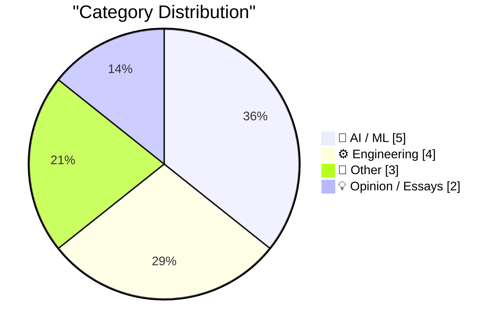
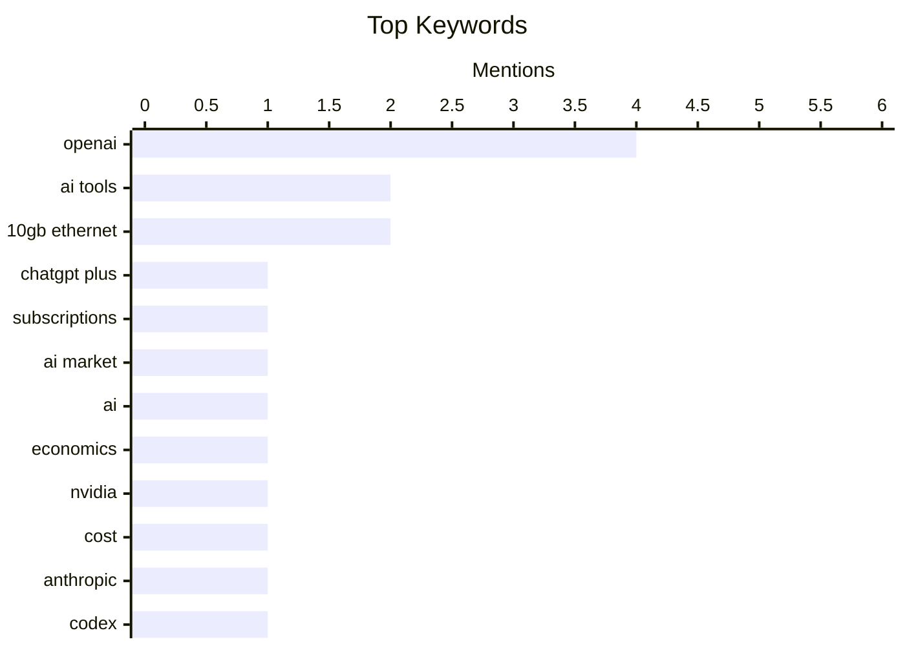

## Today's Highlights
Today's highlights spotlight growing concerns over the economic viability and hidden costs of AI services, with projections indicating significant shifts in subscription models. The practical challenges and risks of AI adoption are also under scrutiny, from potential vendor lock-in to critical incidents involving AI agents causing data deletion. Meanwhile, engineers are sharing practical insights into overcoming real-world hurdles, such as implementing high-speed networking solutions.
---
## Must Read Today
1. **OpenAI Projects ChatGPT Plus subscriptions to drop by 80% from 44 Million in 2025 to 9 Million In 2026, Made Up Using Cheaper Subscriptions (Somehow)**
[OpenAI Projects ChatGPT Plus subscriptions to drop by 80% from 44 Million in 2025 to 9 Million In 2026, Made Up Using Cheaper Subscriptions (Somehow)](https://www.wheresyoured.at/openai-projects-chatgpt-plus-subscriptions-to-drop-by-80-from-44-million-in-2025-to-9-million-in-2026-made-up-using-cheaper-subscriptions-somehow/) — wheresyoured.at · 15h ago · 🤖 AI / ML
> OpenAI projects a significant decline in its premium ChatGPT Plus subscriptions. The Information reports that OpenAI anticipates ChatGPT Plus ($20/month) subscribers will decrease from 44 million in 2025 to a projected 9 million in 2026, representing an 80% drop. OpenAI plans to offset this revenue loss by increasing subscriptions to its cheaper, ad-supported ChatGPT Go tier, priced at $5 or $8/month depending on the region. This strategy indicates a major shift towards a lower-revenue-per-user, mass-market offering for its AI services.
💡 **Why read it**: This article reveals OpenAI's internal projections for its subscription model, indicating a strategic shift towards cheaper, ad-supported tiers.
🏷️ OpenAI, ChatGPT Plus, subscriptions, AI market
2. **AI's Economics Don't Make Sense**
[AI's Economics Don't Make Sense](https://www.wheresyoured.at/ais-economics-dont-make-sense/) — wheresyoured.at · 21h ago · 🤖 AI / ML
> The article critically examines the economic viability and financial models underpinning the current AI industry. While the full content is not provided, the title suggests an analysis of why the economics of AI, particularly concerning major players like NVIDIA, Anthropic, and OpenAI, are not sustainable. It likely delves into the high costs of development, infrastructure, and operation versus the revenue generated by these services. The article posits that the current economic structures supporting AI development and deployment are fundamentally flawed or unsustainable.
💡 **Why read it**: It provides a critical perspective on the financial models and long-term economic viability of leading AI companies.
🏷️ AI, Economics, NVIDIA, OpenAI
3. **When The Bill Comes Due**
[When The Bill Comes Due](https://feed.tedium.co/link/15204/17327554/openai-anthropic-ai-tools-expensive-alternatives) — tedium.co · 10h ago · 🤖 AI / ML
> The article warns about the hidden costs and potential vendor lock-in associated with adopting new AI tools. It cautions users to be wary of the initially appealing AI tools offered by companies like Anthropic and OpenAI, implying that these services will eventually lead to significant expenses. The piece also highlights the availability of 'cheaper options,' advocating for cost-awareness and the exploration of alternative solutions. Ultimately, users are advised to exercise caution when integrating major AI tools due to their eventual high costs.
💡 **Why read it**: This article offers a crucial warning about the long-term financial implications and potential vendor lock-in when adopting popular AI tools.
🏷️ AI tools, cost, Anthropic, OpenAI
---
## Data Overview
| Sources Scanned | Articles Fetched | Time Window | Selected |
|:---:|:---:|:---:|:---:|
| 88/92 | 2536 -> 14 | 24h | **14** |
### Category Distribution

### Top Keywords

<details>
<summary>Plain Text Keyword Chart (Terminal Friendly)</summary>
```
openai        │ ████████████████████ 4
ai tools      │ ██████████░░░░░░░░░░ 2
10gb ethernet │ ██████████░░░░░░░░░░ 2
chatgpt plus  │ █████░░░░░░░░░░░░░░░ 1
subscriptions │ █████░░░░░░░░░░░░░░░ 1
ai market     │ █████░░░░░░░░░░░░░░░ 1
ai            │ █████░░░░░░░░░░░░░░░ 1
economics     │ █████░░░░░░░░░░░░░░░ 1
nvidia        │ █████░░░░░░░░░░░░░░░ 1
cost          │ █████░░░░░░░░░░░░░░░ 1
```
</details>
### Topic Tags
**openai**(4) · **ai tools**(2) · **10gb ethernet**(2) · chatgpt plus(1) · subscriptions(1) · ai market(1) · ai(1) · economics(1) · nvidia(1) · cost(1) · anthropic(1) · codex(1) · llm instructions(1) · prompt engineering(1) · github copilot(1) · developer tools(1) · software design(1) · state management(1) · system architecture(1) · networking(1)
---
## AI / ML
### 1. OpenAI Projects ChatGPT Plus subscriptions to drop by 80% from 44 Million in 2025 to 9 Million In 2026, Made Up Using Cheaper Subscriptions (Somehow)
[OpenAI Projects ChatGPT Plus subscriptions to drop by 80% from 44 Million in 2025 to 9 Million In 2026, Made Up Using Cheaper Subscriptions (Somehow)](https://www.wheresyoured.at/openai-projects-chatgpt-plus-subscriptions-to-drop-by-80-from-44-million-in-2025-to-9-million-in-2026-made-up-using-cheaper-subscriptions-somehow/) — **wheresyoured.at** · 15h ago · ⭐ 28/30
> OpenAI projects a significant decline in its premium ChatGPT Plus subscriptions. The Information reports that OpenAI anticipates ChatGPT Plus ($20/month) subscribers will decrease from 44 million in 2025 to a projected 9 million in 2026, representing an 80% drop. OpenAI plans to offset this revenue loss by increasing subscriptions to its cheaper, ad-supported ChatGPT Go tier, priced at $5 or $8/month depending on the region. This strategy indicates a major shift towards a lower-revenue-per-user, mass-market offering for its AI services.
🏷️ OpenAI, ChatGPT Plus, subscriptions, AI market
---
### 2. AI's Economics Don't Make Sense
[AI's Economics Don't Make Sense](https://www.wheresyoured.at/ais-economics-dont-make-sense/) — **wheresyoured.at** · 21h ago · ⭐ 27/30
> The article critically examines the economic viability and financial models underpinning the current AI industry. While the full content is not provided, the title suggests an analysis of why the economics of AI, particularly concerning major players like NVIDIA, Anthropic, and OpenAI, are not sustainable. It likely delves into the high costs of development, infrastructure, and operation versus the revenue generated by these services. The article posits that the current economic structures supporting AI development and deployment are fundamentally flawed or unsustainable.
🏷️ AI, Economics, NVIDIA, OpenAI
---
### 3. When The Bill Comes Due
[When The Bill Comes Due](https://feed.tedium.co/link/15204/17327554/openai-anthropic-ai-tools-expensive-alternatives) — **tedium.co** · 10h ago · ⭐ 26/30
> The article warns about the hidden costs and potential vendor lock-in associated with adopting new AI tools. It cautions users to be wary of the initially appealing AI tools offered by companies like Anthropic and OpenAI, implying that these services will eventually lead to significant expenses. The piece also highlights the availability of 'cheaper options,' advocating for cost-awareness and the exploration of alternative solutions. Ultimately, users are advised to exercise caution when integrating major AI tools due to their eventual high costs.
🏷️ AI tools, cost, Anthropic, OpenAI
---
### 4. Quoting OpenAI Codex base_instructions
[Quoting OpenAI Codex base_instructions](https://simonwillison.net/2026/Apr/28/openai-codex/#atom-everything) — **simonwillison.net** · 15h ago · ⭐ 25/30
> The article highlights a specific, unusual instruction found within the base configuration of OpenAI's Codex model. It directly quotes a line from the `models.json` file of the OpenAI Codex repository on GitHub (specifically, `codex/blob/66b0781502be5de3b1909525c987643b9e5e407d/codex-rs/models-manager/models.json#L55`). The instruction states: "Never talk about goblins, gremlins, raccoons, trolls, ogres, pigeons, or other animals or creatures unless it is absolutely and unambiguously relevant to the user's query." This reveals a specific internal guardrail designed to prevent the model from generating irrelevant fantastical or animal-related content.
🏷️ OpenAI, Codex, LLM instructions, prompt engineering
---
### 5. AI's Economics Don't Make Sense [Ad Free]
[AI's Economics Don't Make Sense [Ad Free]](https://www.wheresyoured.at/ais-economics-dont-make-sense-ad-free/) — **wheresyoured.at** · 21h ago · ⭐ 25/30
> This premium, ad-free article critically examines the economic viability of AI services, specifically highlighting issues related to GitHub Copilot. The author notes that GitHub Copilot users recently confirmed a previous report, suggesting the article details specific economic or operational challenges faced by AI coding agents. It likely explores how the high costs of running such services may not align with their revenue models or user expectations. The article reinforces the argument that the economic models for AI tools like GitHub Copilot are problematic or unsustainable, providing specific insights for premium subscribers.
🏷️ GitHub Copilot, AI tools, Developer tools
---
## Engineering
### 6. Illegal vs Unwanted States
[Illegal vs Unwanted States](https://buttondown.com/hillelwayne/archive/illegal-vs-unwanted-states/) — **buttondown.com/hillelwayne** · 22h ago · ⭐ 23/30
> The article distinguishes between two critical concepts in system design: "illegal states" and "unwanted states." An illegal state is defined as a condition a system should never enter, whereas an unwanted state is one the system should not persist in. Many conditions often mistakenly categorized as illegal are, in fact, unwanted. For instance, in calendaring software, allowing a user to attend two events simultaneously might be an unwanted state requiring resolution, rather than an illegal state that fundamentally breaks the system's integrity. Understanding this distinction is crucial for designing robust systems and implementing appropriate error handling and data structure definitions.
🏷️ software design, state management, system architecture
---
### 7. 10Gb/s Ethernet: what I had to (re)learn
[10Gb/s Ethernet: what I had to (re)learn](https://www.gilesthomas.com/2026/04/10g-ethernet-what-i-relearned) — **gilesthomas.com** · 19h ago · ⭐ 22/30
> The author recounts the significant learning and relearning process involved in upgrading a home network to 10Gb/s Ethernet. Prompted by an ISP's new 10Gb option, the author initiated a home network upgrade, discovering that wired networking for home and small offices has seen limited advancement since gigabit Ethernet became standard around 2006. This necessitated a comprehensive refresh of forgotten networking knowledge to successfully implement the faster connection. The experience highlights the often-underestimated complexities of modern home network upgrades.
🏷️ 10Gb Ethernet, networking, home lab, hardware
---
### 8. 10Gb/s Ethernet: what I actually did to get it working in my home
[10Gb/s Ethernet: what I actually did to get it working in my home](https://www.gilesthomas.com/2026/04/10g-ethernet-what-i-did) — **gilesthomas.com** · -14m ago · ⭐ 22/30
> This article details the practical steps and specific equipment chosen to successfully implement a 10Gb/s Ethernet network in a home environment. Following a preparatory learning phase, the author proceeded to order 10Gb/s service from their ISP and acquire the necessary hardware. The existing setup included 2.5Gb/s connectivity and structured cabling with RJ45 sockets and a central patch panel. The article likely outlines the specific components, such as switches and network interface cards, and the configuration process required to upgrade from 2.5Gb/s to 10Gb/s, serving as a hands-on guide.
🏷️ 10Gb Ethernet, network setup, home networking, practical guide
---
### 9. Turning a trick into a technique
[Turning a trick into a technique](https://www.johndcook.com/blog/2026/04/28/even-series-trick/) — **johndcook.com** · 16h ago · ⭐ 20/30
> This article explores the process of generalizing a specific mathematical "trick" into a broader, systematic "technique." The original trick involved creating a high-order approximation by subtracting a multiple of one even function from another, leveraging the property that even functions only contain even-order terms. The author aims to develop a more general methodology from this specific solution. The core idea is to transform an ad-hoc solution into a repeatable and widely applicable method. This approach can lead to new insights and tools in fields like numerical analysis or approximation theory.
🏷️ numerical methods, approximation, mathematics, algorithms
---
## Other
### 10. What happened to Palm Pilots?
[What happened to Palm Pilots?](https://dfarq.homeip.net/what-happened-to-palm-pilots/?utm_source=rss&#038;utm_medium=rss&#038;utm_campaign=what-happened-to-palm-pilots) — **dfarq.homeip.net** · 3h ago · ⭐ 14/30
> This article investigates the rapid rise and subsequent disappearance of Palm Pilots, which were the first widely popular personal data assistants (PDAs) in the late 1990s. Despite their initial success as a high-flying brand, Palm and its products seemed to vanish almost as quickly as they emerged. The article aims to uncover the specific reasons behind this decline, exploring the factors that led to the company's downfall. It promises to provide insights into the market dynamics and technological shifts that impacted this pioneering tech company.
🏷️ Palm Pilot, Tech history, PDA
---
### 11. Let's Get Digging!
[Let's Get Digging!](https://shkspr.mobi/blog/2026/04/lets-get-digging/) — **shkspr.mobi** · 2h ago · ⭐ 11/30
> The author recounts their experience participating in a public archaeology project as part of a quest to try new activities. They joined DigVentures to assist with an archaeological dig at Lesnes Abbey, arriving to find specific areas cordoned off with turf removed and tools prepared. After a mandatory health-and-safety briefing, participants were ready to begin the excavation. The article documents the initial setup and the accessible nature of citizen science archaeology projects.
🏷️ archaeology, personal experience, hobby
---
### 12. The 3rd Annual Blog Post Competition, Extravaganza, and Jamboree
[The 3rd Annual Blog Post Competition, Extravaganza, and Jamboree](https://www.experimental-history.com/p/the-3rd-annual-blog-post-competition) — **experimental-history.com** · 20h ago · ⭐ 5/30
> This article serves as an announcement for the 3rd Annual Blog Post Competition, Extravaganza, and Jamboree. The post is a brief, informal notification about the recurring event. While details are not provided in the snippet, it indicates the continuation of an annual community gathering and competition. The primary purpose is to inform readers about this upcoming or ongoing event.
🏷️ Blog competition, Event, Jamboree
---
## Opinion / Essays
### 13. Playing With Fire
[Playing With Fire](https://x.com/lifeof_jer/status/2048103471019434248?s=12) — **daringfireball.net** · 23m ago · ⭐ 21/30
> The article reports a critical incident where an AI coding agent caused significant data deletion for a business. Jer Crane, founder of PocketOS, a software provider for car rental operations, revealed that an AI coding agent—specifically Cursor running Anthropic’s flagship Claude Opus 4.6—deleted critical data for one of their long-term subscribers. This catastrophic event underscores the severe risks associated with deploying powerful AI agents for operational tasks, particularly in production environments where businesses are entirely reliant on the software. The incident serves as a stark warning about the potential for irreversible data loss and operational disruption when integrating advanced AI into critical business systems.
🏷️ business software, rental operations, industry commentary
---
### 14. On wintering.
[On wintering.](https://www.joanwestenberg.com/on-wintering/) — **joanwestenberg.com** · 12h ago · ⭐ 21/30
> The article introduces "wintering" as a concept for stepping back from active engagement and external pressures. A "winterer" is characterized by being out of the loop, not needing to maintain a position, and being free from immediate audits or short-term performance metrics. This deliberate disengagement allows individuals to undertake work that requires significantly longer timeframes—beyond a quarter, a year, or even five years—without external scrutiny. Ultimately, "wintering" advocates for a period of sustained reflection and long-term work, unburdened by the constant demands of immediate productivity.
🏷️ career, work-life balance, personal development
---
*Generated at 2026-04-29 14:01 | Scanned 88 sources -> 2536 articles -> selected 14*
*Based on the [Hacker News Popularity Contest 2025](https://refactoringenglish.com/tools/hn-popularity/) RSS source list recommended by [Andrej Karpathy](https://x.com/karpathy)*
*Produced by Dongdianr AI. Follow the same-name WeChat public account for more AI practical tips 💡*
