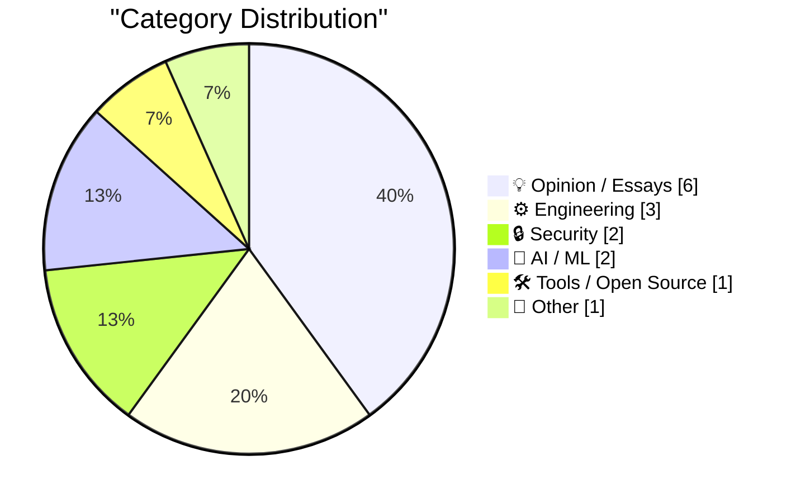
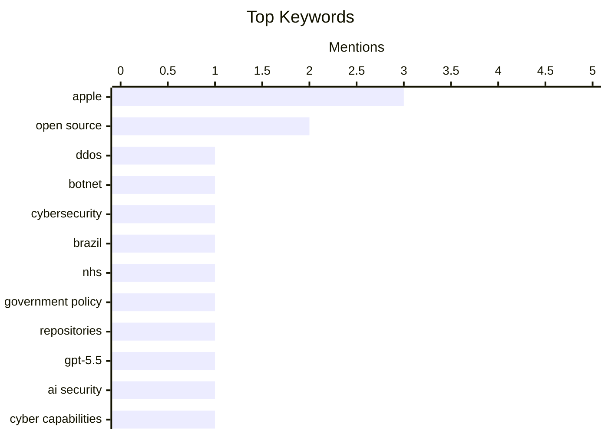

## Today's Highlights
Today's tech highlights reveal a dual focus on the evolving capabilities of artificial intelligence and pressing cybersecurity challenges. New evaluations show advanced AI models like GPT-5.5 possess significant cyber capabilities, raising both excitement and concerns over massive capital investments and potential misuse. Simultaneously, the security sector faces internal threats, exemplified by an anti-DDoS firm implicated in orchestrating attacks on Brazilian ISPs. These developments underscore the urgent need for robust digital defenses and a critical examination of AI's societal impact.
---
## Must Read Today
1. **Anti-DDoS Firm Heaped Attacks on Brazilian ISPs**
[Anti-DDoS Firm Heaped Attacks on Brazilian ISPs](https://krebsonsecurity.com/2026/04/anti-ddos-firm-heaped-attacks-on-brazilian-isps/) — krebsonsecurity.com · 23h ago · 🔒 Security
> A Brazilian tech firm specializing in DDoS protection has been implicated in enabling a botnet responsible for an extended campaign of massive DDoS attacks against other network operators in Brazil. The firm's chief executive attributes the malicious activity to a security breach, suggesting it was a competitor's attempt to tarnish their public image. This incident highlights the critical security risks and potential for misuse within the cybersecurity industry itself.
💡 **Why read it**: It exposes a significant cybersecurity incident where a protection firm was allegedly involved in orchestrating attacks, raising questions about trust and internal security in the industry.
🏷️ DDoS, botnet, cybersecurity, Brazil
2. **NHS Goes To War Against Open Source**
[NHS Goes To War Against Open Source](https://shkspr.mobi/blog/2026/05/nhs-goes-to-war-against-open-source/) — shkspr.mobi · 2h ago · 💡 Opinion / Essays
> The NHS is reportedly preparing to close nearly all of its Open Source repositories, marking a significant reversal from previous UK Government policy. The author, having championed Open Source within GDS, NHSX, and i.AI, expresses deep disappointment, noting they wrote guidance and briefed Ministers on its importance. This move signals a potential shift away from transparency and collaborative development in public sector technology.
💡 **Why read it**: It details a concerning policy shift by the NHS away from Open Source, impacting transparency and collaborative development in public sector technology.
🏷️ NHS, Open Source, government policy, repositories
3. **Our evaluation of OpenAI's GPT-5.5 cyber capabilities**
[Our evaluation of OpenAI's GPT-5.5 cyber capabilities](https://simonwillison.net/2026/Apr/30/gpt-55-cyber-capabilities/#atom-everything) — simonwillison.net · 14h ago · 🔒 Security
> The UK's AI Security Institute (AISI) evaluated OpenAI's GPT-5.5 for its cyber capabilities, specifically its ability to find security vulnerabilities. The evaluation found GPT-5.5 to be comparable to Claude Mythos, which AISI previously assessed. A key difference noted is that GPT-5.5 is generally available, unlike Mythos.
💡 **Why read it**: It provides an official assessment of a leading AI model's cybersecurity capabilities, offering insights into its potential for vulnerability discovery.
🏷️ GPT-5.5, AI security, cyber capabilities, evaluation
---
## Data Overview
| Sources Scanned | Articles Fetched | Time Window | Selected |
|:---:|:---:|:---:|:---:|
| 88/92 | 2537 -> 19 | 24h | **15** |
### Category Distribution

### Top Keywords

<details>
<summary>Plain Text Keyword Chart (Terminal Friendly)</summary>
```
apple             │ ████████████████████ 3
open source       │ █████████████░░░░░░░ 2
ddos              │ ███████░░░░░░░░░░░░░ 1
botnet            │ ███████░░░░░░░░░░░░░ 1
cybersecurity     │ ███████░░░░░░░░░░░░░ 1
brazil            │ ███████░░░░░░░░░░░░░ 1
nhs               │ ███████░░░░░░░░░░░░░ 1
government policy │ ███████░░░░░░░░░░░░░ 1
repositories      │ ███████░░░░░░░░░░░░░ 1
gpt-5.5           │ ███████░░░░░░░░░░░░░ 1
```
</details>
### Topic Tags
**apple**(3) · **open source**(2) · **ddos**(1) · botnet(1) · cybersecurity(1) · brazil(1) · nhs(1) · government policy(1) · repositories(1) · gpt-5.5(1) · ai security(1) · cyber capabilities(1) · evaluation(1) · ai investment(1) · capital misallocation(1) · ai bubble(1) · gary marcus(1) · llm(1) · code quality(1) · prs(1)
---
## Opinion / Essays
### 1. NHS Goes To War Against Open Source
[NHS Goes To War Against Open Source](https://shkspr.mobi/blog/2026/05/nhs-goes-to-war-against-open-source/) — **shkspr.mobi** · 2h ago · ⭐ 27/30
> The NHS is reportedly preparing to close nearly all of its Open Source repositories, marking a significant reversal from previous UK Government policy. The author, having championed Open Source within GDS, NHSX, and i.AI, expresses deep disappointment, noting they wrote guidance and briefed Ministers on its importance. This move signals a potential shift away from transparency and collaborative development in public sector technology.
🏷️ NHS, Open Source, government policy, repositories
---
### 2. Pluralistic: How not to ban surveillance pricing (30 Apr 2026)
[Pluralistic: How not to ban surveillance pricing (30 Apr 2026)](https://pluralistic.net/2026/04/30/something-must-be-done/) — **pluralistic.net** · 23h ago · ⭐ 24/30
> This article criticizes Maryland's new consumer protection law, asserting that it is largely ineffective against surveillance pricing due to numerous loopholes. The author implies that despite its intent, the law fails to genuinely address the issue of companies leveraging user data for dynamic pricing. It highlights the challenges in crafting effective legislation to curb exploitative data practices.
🏷️ Surveillance pricing, consumer protection, tech policy, enshittification
---
### 3. ★ On the Future of Apple’s Vision Platform
[★ On the Future of Apple’s Vision Platform](https://daringfireball.net/2026/04/on_the_future_of_apples_vision_platform) — **daringfireball.net** · 13h ago · ⭐ 22/30
> This article speculates on the future of Apple's Vision platform, countering the notion that Apple might abandon it. The author asserts that if the platform were to be discontinued, it would not be a sudden, unannounced decision, especially for the people in the Vision Products Group (VPG) working on it. It suggests a more deliberate and internal process for such a strategic shift, rather than a surprise leak on tech news sites.
🏷️ Apple Vision, AR/VR, platform strategy, product future
---
### 4. We need RSS for sharing abundant vibe-coded apps
[We need RSS for sharing abundant vibe-coded apps](https://simonwillison.net/2026/Apr/30/rss-vibe-coded-apps/#atom-everything) — **simonwillison.net** · 19h ago · ⭐ 19/30
> The article argues for the necessity of RSS feeds to facilitate the sharing of abundant "vibe-coded apps," which are increasingly personal, situated, and frequent micro-applications. Matt Webb proposes an RSS web feed for these tools and app pages, each featuring an "Install" button, despite acknowledging the challenge of where these apps would be installed. This need arises because "vibe-coding" accelerates app development, making traditional, large-scale app launches less relevant for these smaller, more numerous tools. The core idea is to create a syndication layer for a new paradigm of rapid, personalized app creation. This approach would allow users to discover and integrate micro-apps more fluidly into their workflows.
🏷️ RSS, app distribution, vibe-coded apps, discovery
---
### 5. I’m Starting to Wonder What They’re Smoking Over There at MacRumors
[I’m Starting to Wonder What They’re Smoking Over There at MacRumors](https://www.macrumors.com/2026/04/29/apple-questioning-iphone-magsafe/) — **daringfireball.net** · 22h ago · ⭐ 19/30
> This article criticizes MacRumors for extensively covering a dubious Weibo post suggesting Apple might drop MagSafe from all iPhones. The original Weibo post was a mere 70 words, yet MacRumors' Hartley Charlton expanded it into a 600-word article. The author points out that the iPhone 16e lacked MagSafe last year, but the iPhone 17e *does* include it this year, directly contradicting the rumor. This factual discrepancy renders MacRumors' lengthy speculation questionable. The piece concludes that the evidence clearly indicates MagSafe's continued presence in Apple's iPhone lineup.
🏷️ Apple, MagSafe, MacRumors, tech journalism
---
### 6. The Talk Show: ‘Food and Beverage Director’
[The Talk Show: ‘Food and Beverage Director’](https://daringfireball.net/thetalkshow/2026/04/30/ep-446) — **daringfireball.net** · 11h ago · ⭐ 17/30
> This article announces a new episode of "The Talk Show" featuring MG Siegler, focusing on a significant leadership transition at Apple. The primary discussion revolves around Apple's announcement that Tim Cook is stepping aside from his CEO role to become executive chairman. John Ternus will assume the position of Apple's new CEO. The episode is sponsored by Squarespace, Drafts, and Finalist, offering listeners insights into this major corporate change. It provides an analysis of what this leadership shift might mean for Apple's future direction.
🏷️ Apple, Tim Cook, CEO, leadership
---
## Engineering
### 7. Quoting Andrew Kelley
[Quoting Andrew Kelley](https://simonwillison.net/2026/Apr/30/andrew-kelley/#atom-everything) — **simonwillison.net** · 16h ago · ⭐ 24/30
> Andrew Kelley, creator of the Zig programming language, argues against the misconception that LLM-assisted code contributions are undetectable. He states that while not 100% of LLM-assisted PRs are caught, the types of mistakes LLMs make are fundamentally different from human errors, making them identifiable. Kelley also notes that contributors using agentic coding often exhibit a distinct "digital smell" that is obvious to experienced reviewers.
🏷️ LLM, code quality, PRs, AI assistance
---
### 8. Patching and forking in package managers
[Patching and forking in package managers](https://nesbitt.io/2026/05/01/patching-and-forking-in-package-managers.html) — **nesbitt.io** · 4h ago · ⭐ 23/30
> The article discusses strategies for managing dependencies when upstream development ceases or becomes unresponsive, specifically focusing on patching and forking within package managers. It addresses the common problem of "upstream ghosting" and provides insights into maintaining project stability and security in such scenarios. Practical advice is offered for developers on how to handle unmaintained dependencies effectively.
🏷️ Package managers, patching, forking, open source
---
### 9. Approximating even functions by powers of cosine
[Approximating even functions by powers of cosine](https://www.johndcook.com/blog/2026/04/30/burmanns-theorem/) — **johndcook.com** · 13h ago · ⭐ 20/30
> This article explores a technique for constructing simple and accurate approximations for even functions using powers of cosine. Building on a previous post that approximated the Bessel function J(x) with (1 + cos(x))/2, the author learned this specific approximation was a first-order example. The technique focuses on finding clever ways to generalize such methods to a broader class of even functions. It highlights the process of turning a specific trick into a versatile mathematical technique. The post suggests a systematic approach to function approximation beyond individual examples.
🏷️ Approximation, numerical methods, cosine, Bessel function
---
## Security
### 10. Anti-DDoS Firm Heaped Attacks on Brazilian ISPs
[Anti-DDoS Firm Heaped Attacks on Brazilian ISPs](https://krebsonsecurity.com/2026/04/anti-ddos-firm-heaped-attacks-on-brazilian-isps/) — **krebsonsecurity.com** · 23h ago · ⭐ 27/30
> A Brazilian tech firm specializing in DDoS protection has been implicated in enabling a botnet responsible for an extended campaign of massive DDoS attacks against other network operators in Brazil. The firm's chief executive attributes the malicious activity to a security breach, suggesting it was a competitor's attempt to tarnish their public image. This incident highlights the critical security risks and potential for misuse within the cybersecurity industry itself.
🏷️ DDoS, botnet, cybersecurity, Brazil
---
### 11. Our evaluation of OpenAI's GPT-5.5 cyber capabilities
[Our evaluation of OpenAI's GPT-5.5 cyber capabilities](https://simonwillison.net/2026/Apr/30/gpt-55-cyber-capabilities/#atom-everything) — **simonwillison.net** · 14h ago · ⭐ 26/30
> The UK's AI Security Institute (AISI) evaluated OpenAI's GPT-5.5 for its cyber capabilities, specifically its ability to find security vulnerabilities. The evaluation found GPT-5.5 to be comparable to Claude Mythos, which AISI previously assessed. A key difference noted is that GPT-5.5 is generally available, unlike Mythos.
🏷️ GPT-5.5, AI security, cyber capabilities, evaluation
---
## AI / ML
### 12. The greatest capital misallocation in history?
[The greatest capital misallocation in history?](https://garymarcus.substack.com/p/the-greatest-capital-misallocation) — **garymarcus.substack.com** · 17h ago · ⭐ 26/30
> This article briefly introduces the growing concern that current investments, particularly in the AI sector, might represent a significant misallocation of capital. The author implies a critical perspective on the sustainability or efficacy of these large-scale financial commitments, suggesting a potential bubble or misdirection of resources.
🏷️ AI investment, capital misallocation, AI bubble, Gary Marcus
---
### 13. Three ways to differentiate ReLU
[Three ways to differentiate ReLU](https://www.johndcook.com/blog/2026/04/30/derivative-of-relu/) — **johndcook.com** · 23h ago · ⭐ 24/30
> The article explores three generalized methods for computing the derivative of the Rectified Linear Unit (ReLU) function, a common activation function in neural networks, which is not classically differentiable at zero. It discusses how these generalizations, such as subgradient, weak, and distributional derivatives, provide alternative approaches when a function lacks a classical derivative. Understanding these methods is crucial for optimizing neural networks.
🏷️ ReLU, differentiation, neural networks, activation function
---
## Tools / Open Source
### 14. Codex CLI 0.128.0 adds /goal
[Codex CLI 0.128.0 adds /goal](https://simonwillison.net/2026/Apr/30/codex-goals/#atom-everything) — **simonwillison.net** · 14h ago · ⭐ 23/30
> OpenAI's Codex CLI coding agent, in version 0.128.0, introduces a new `/goal` feature, akin to the "Ralph loop." This functionality allows users to set a specific goal, and Codex will iteratively work towards it until the goal is evaluated as complete or the configured token budget has been exhausted. The feature is mainly implemented through internal mechanisms, enhancing the agent's autonomous task completion capabilities.
🏷️ Codex CLI, AI agent, developer tool, /goal
---
## Other
### 15. Apple Q2 2026 Results
[Apple Q2 2026 Results](https://www.apple.com/newsroom/2026/04/apple-reports-second-quarter-results/) — **daringfireball.net** · 13h ago · ⭐ 20/30
> Apple reported its "best March quarter ever" for Q2 2026, achieving $111.2 billion in revenue with double-digit growth across all geographic segments. The iPhone 17 lineup fueled a March quarter revenue record for iPhone, demonstrating extraordinary demand. Additionally, Services achieved yet another all-time revenue record during the quarter. Apple also introduced new products to its lineup, including the latest "iPh" (likely iPhone) models. The results indicate strong performance driven by key product categories and global market penetration.
🏷️ Apple, financial results, iPhone revenue, Q2 2026
---
*Generated at 2026-05-01 14:01 | Scanned 88 sources -> 2537 articles -> selected 15*
*Based on the [Hacker News Popularity Contest 2025](https://refactoringenglish.com/tools/hn-popularity/) RSS source list recommended by [Andrej Karpathy](https://x.com/karpathy)*
*Produced by Dongdianr AI. Follow the same-name WeChat public account for more AI practical tips 💡*
