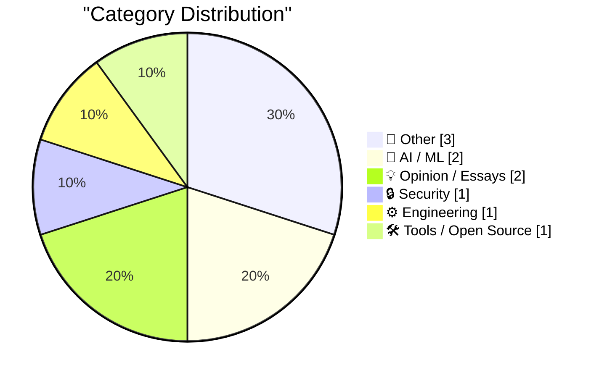
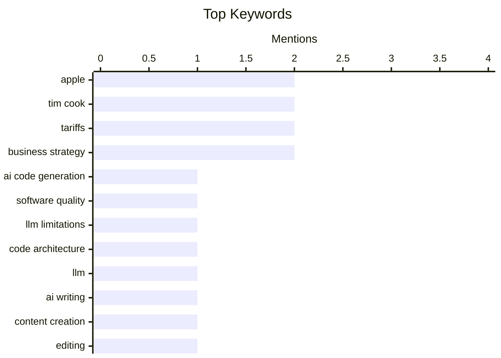

## Today's Highlights
Today's tech discussions underscore the critical challenges and ethical considerations surrounding artificial intelligence. Experts are highlighting the distinction between AI-generated code that merely compiles versus truly secure and maintainable software, alongside significant privacy breaches involving human review of sensitive AI-captured data. Meanwhile, the business world sees clever strategic solutions, such as Apple's approach to tariff refunds, contrasting with ongoing user frustrations over software reliability and disruptive auto-updates.
---
## Must Read Today
1. **“A model that produces code which compiles and passes the tests it was given is not the same as a model that produces correct, secure, maintainable, well-architected software”**
[“A model that produces code which compiles and passes the tests it was given is not the same as a model that produces correct, secure, maintainable, well-architected software”](https://garymarcus.substack.com/p/a-model-that-produces-code-which) — garymarcus.substack.com · 17h ago · 🤖 AI / ML
> This article addresses the critical distinction between AI-generated code that merely compiles and passes tests, and truly correct, secure, maintainable, and well-architected software. It argues that current AI models often excel at superficial correctness (syntax, basic test cases) but lack deeper semantic understanding, robust error handling, and adherence to best practices for production-grade systems. The author implies that relying solely on compilation and test passage as metrics for AI code quality is insufficient and potentially misleading. The main takeaway is that human oversight and expertise remain indispensable for ensuring the quality, reliability, and long-term viability of AI-generated software.
💡 **Why read it**: It critically examines the limitations of current AI code generation, highlighting the significant gap between functional code and production-ready software.
🏷️ AI code generation, software quality, LLM limitations, code architecture
2. **Editing my LLM assisted Articles**
[Editing my LLM assisted Articles](https://idiallo.com/byte-size/editing-llm-assisted-articles?src=feed) — idiallo.com · 11h ago · 🤖 AI / ML
> The author discusses the challenge of using LLM-assisted articles, noting that the generated content often fails to capture their authentic voice or original thoughts, leading to discomfort when re-reading or quoting. To address this, they are actively rewriting these articles to infuse them with their personal perspective and ensure they accurately reflect their intended message. This process aims to make the content genuinely quotable and representative of the author's unique intellectual contribution. The main conclusion is that while LLMs offer convenience and time-saving in initial drafting, substantial human editing is essential to achieve personal voice and intellectual integrity in published work.
💡 **Why read it**: It offers a personal account of the practical challenges and necessary post-editing involved in using LLMs for content creation to maintain authenticity and personal voice.
🏷️ LLM, AI writing, content creation, editing
3. **Meta Solved Their Problem With Kenyan Contractors Seeing Footage of AI Glasses Wearers on the Toilet**
[Meta Solved Their Problem With Kenyan Contractors Seeing Footage of AI Glasses Wearers on the Toilet](https://www.bbc.com/news/articles/c5y7yvgy0w6o) — daringfireball.net · 17h ago · 🔒 Security
> This article highlights a significant privacy issue where Meta contracted Kenyan workers to review sensitive video content captured by its 'smart' AI glasses, including footage of users in private moments like undressing or using the toilet. This practice contradicted users' expectations of privacy, as they were unaware of human review of their AI-captured data. The title sarcastically implies a 'solution,' suggesting that the underlying ethical and privacy concerns remain despite any attempts to manage public perception. The main takeaway is the ongoing tension between AI data collection, user privacy, and the often-hidden human labor involved in content moderation.
💡 **Why read it**: It exposes a critical privacy and ethical dilemma concerning AI-powered wearables and the hidden human labor involved in moderating sensitive user data.
🏷️ Meta, AI glasses, privacy, data ethics
---
## Data Overview
| Sources Scanned | Articles Fetched | Time Window | Selected |
|:---:|:---:|:---:|:---:|
| 88/92 | 2537 -> 10 | 24h | **10** |
### Category Distribution

### Top Keywords

<details>
<summary>Plain Text Keyword Chart (Terminal Friendly)</summary>
```
apple              │ ████████████████████ 2
tim cook           │ ████████████████████ 2
tariffs            │ ████████████████████ 2
business strategy  │ ████████████████████ 2
ai code generation │ ██████████░░░░░░░░░░ 1
software quality   │ ██████████░░░░░░░░░░ 1
llm limitations    │ ██████████░░░░░░░░░░ 1
code architecture  │ ██████████░░░░░░░░░░ 1
llm                │ ██████████░░░░░░░░░░ 1
ai writing         │ ██████████░░░░░░░░░░ 1
```
</details>
### Topic Tags
**apple**(2) · **tim cook**(2) · **tariffs**(2) · business strategy(2) · ai code generation(1) · software quality(1) · llm limitations(1) · code architecture(1) · llm(1) · ai writing(1) · content creation(1) · editing(1) · meta(1) · ai glasses(1) · privacy(1) · data ethics(1) · auto-update(1) · software updates(1) · user experience(1) · app features(1)
---
## Other
### 1. Reading List 05/02/2026
[Reading List 05/02/2026](https://www.construction-physics.com/p/reading-list-05022026) — **construction-physics.com** · 2h ago · ⭐ 13/30
> This article presents a curated reading list covering diverse topics relevant to the construction, manufacturing, and energy sectors. Key themes include 'chilling effects in the build-to-rent sector,' the potential for 'robot manufacturing scale up,' challenges within 'PJM’s new interconnection queue,' and 'the backlash against battery storage.' The list provides a concise overview of current issues and trends impacting these industries. The main takeaway is a valuable collection of contemporary articles offering insights into critical developments and challenges across construction, manufacturing, and energy infrastructure.
🏷️ construction, robot manufacturing, energy infrastructure, reading list
---
### 2. The Mystery of Rennes-le-Château, Part 5: The Man Behind the Curtain
[The Mystery of Rennes-le-Château, Part 5: The Man Behind the Curtain](https://www.filfre.net/2026/05/the-mystery-of-rennes-le-chateau-part-5-the-man-behind-the-curtain/) — **filfre.net** · 22h ago · ⭐ 12/30
> This article is the fifth installment in a series exploring the real and pseudo-history underpinning the video game 'Gabriel Knight 3: Blood of the Sacred, Blood of the Damned.' It delves into the historical context of the Plantard family tree, noting that while it can be traced back without relying on the controversial Lobineau dossier, it does not extend as far as the Merovingian kings. The series aims to unravel the layers of myth and fact surrounding the Rennes-le-Château mystery. The main takeaway is the ongoing exploration of intertwined historical and fictional narratives related to the 'Gabriel Knight 3' game and the Rennes-le-Château enigma.
🏷️ gaming history, Gabriel Knight, adventure games, cultural analysis
---
### 3. Pluralistic: The prehistory of the Democratic Nuremberg Caucus (02 May 2026)
[Pluralistic: The prehistory of the Democratic Nuremberg Caucus (02 May 2026)](https://pluralistic.net/2026/05/02/denazification/) — **pluralistic.net** · 2h ago · ⭐ 11/30
> This article is a 'Pluralistic' daily link aggregation, featuring diverse topics under the overarching theme 'The prehistory of the Democratic Nuremberg Caucus.' It includes links and commentary on subjects such as 'bounties for ICE whistleblowers,' 'Colbert v GWB,' 'Wallaby milk,' 'Jay Rosen's journalism precepts,' 'TCP over pigeon,' and 'GOP forcing students to repay scam loans.' The article also lists upcoming and recent appearances by the author and their latest books. The main takeaway is a curated collection of links and commentary offering a critical perspective on current events, technology, politics, and media.
🏷️ link aggregation, politics, current events, diverse topics
---
## AI / ML
### 4. “A model that produces code which compiles and passes the tests it was given is not the same as a model that produces correct, secure, maintainable, well-architected software”
[“A model that produces code which compiles and passes the tests it was given is not the same as a model that produces correct, secure, maintainable, well-architected software”](https://garymarcus.substack.com/p/a-model-that-produces-code-which) — **garymarcus.substack.com** · 17h ago · ⭐ 30/30
> This article addresses the critical distinction between AI-generated code that merely compiles and passes tests, and truly correct, secure, maintainable, and well-architected software. It argues that current AI models often excel at superficial correctness (syntax, basic test cases) but lack deeper semantic understanding, robust error handling, and adherence to best practices for production-grade systems. The author implies that relying solely on compilation and test passage as metrics for AI code quality is insufficient and potentially misleading. The main takeaway is that human oversight and expertise remain indispensable for ensuring the quality, reliability, and long-term viability of AI-generated software.
🏷️ AI code generation, software quality, LLM limitations, code architecture
---
### 5. Editing my LLM assisted Articles
[Editing my LLM assisted Articles](https://idiallo.com/byte-size/editing-llm-assisted-articles?src=feed) — **idiallo.com** · 11h ago · ⭐ 24/30
> The author discusses the challenge of using LLM-assisted articles, noting that the generated content often fails to capture their authentic voice or original thoughts, leading to discomfort when re-reading or quoting. To address this, they are actively rewriting these articles to infuse them with their personal perspective and ensure they accurately reflect their intended message. This process aims to make the content genuinely quotable and representative of the author's unique intellectual contribution. The main conclusion is that while LLMs offer convenience and time-saving in initial drafting, substantial human editing is essential to achieve personal voice and intellectual integrity in published work.
🏷️ LLM, AI writing, content creation, editing
---
## Opinion / Essays
### 6. More on Apple’s Logically Elegant Tariff Refund Puzzle Solution
[More on Apple’s Logically Elegant Tariff Refund Puzzle Solution](https://daringfireball.net/linked/2026/05/01/tim-cooks-clever-solution-to-the-tariff-refund-puzzle) — **daringfireball.net** · 12h ago · ⭐ 20/30
> This article elaborates on Apple's strategic approach to handling a potential tariff refund check from the U.S. government without provoking political backlash, particularly from Donald Trump. Apple's solution, articulated by Tim Cook, involves publicly committing to reinvest any received tariff refunds into 'U.S. innovation and advanced manufacturing.' The article clarifies that this commitment doesn't necessarily mean spending *more* than previously planned, but rather earmarking specific funds for these domestic initiatives. The main takeaway is Apple's politically astute maneuver to navigate complex trade policies and maintain a positive public image by framing the refund as a benefit to the U.S. economy.
🏷️ Apple, Tim Cook, tariffs, business strategy
---
### 7. Tim Cook’s Clever Solution to the Tariff Refund Puzzle
[Tim Cook’s Clever Solution to the Tariff Refund Puzzle](https://sixcolors.com/post/2026/04/apple-results-analysis-net-net-over-the-moon/) — **daringfireball.net** · 17h ago · ⭐ 20/30
> This article introduces Apple's strategic solution to a potential tariff refund dilemma, as revealed during a quarterly results analysis. During a complicated question from J.P. Morgan analyst Samik Chatterjee, Tim Cook presented a prepared statement outlining Apple's plan to reinvest any tariff refunds received into 'U.S. innovation and advanced manufacturing.' This strategy aims to mitigate potential political criticism, particularly from figures like Donald Trump, by framing the refund as a direct benefit to the U.S. economy rather than a corporate windfall. The main conclusion is that Apple is strategically positioning itself to accept tariff refunds while publicly committing to domestic investment.
🏷️ Apple, Tim Cook, tariffs, business strategy
---
## Security
### 8. Meta Solved Their Problem With Kenyan Contractors Seeing Footage of AI Glasses Wearers on the Toilet
[Meta Solved Their Problem With Kenyan Contractors Seeing Footage of AI Glasses Wearers on the Toilet](https://www.bbc.com/news/articles/c5y7yvgy0w6o) — **daringfireball.net** · 17h ago · ⭐ 23/30
> This article highlights a significant privacy issue where Meta contracted Kenyan workers to review sensitive video content captured by its 'smart' AI glasses, including footage of users in private moments like undressing or using the toilet. This practice contradicted users' expectations of privacy, as they were unaware of human review of their AI-captured data. The title sarcastically implies a 'solution,' suggesting that the underlying ethical and privacy concerns remain despite any attempts to manage public perception. The main takeaway is the ongoing tension between AI data collection, user privacy, and the often-hidden human labor involved in content moderation.
🏷️ Meta, AI glasses, privacy, data ethics
---
## Engineering
### 9. Disable Auto-Update
[Disable Auto-Update](https://idiallo.com/blog/disable-auto-update?src=feed) — **idiallo.com** · 14h ago · ⭐ 20/30
> The author recounts a frustrating experience where a critical feature in a daily-used, entirely offline fitness app disappeared due to an unprompted auto-update. The app, which collects metrics like steps and heart rate from a smartwatch via Bluetooth without involving third-party servers, updated automatically, removing a core functionality. This incident highlights the problem of forced auto-updates disrupting user experience and removing features from apps that require no server-side maintenance. The main takeaway is a strong critique of auto-updates, especially for offline-first applications, advocating for greater user control over software changes.
🏷️ auto-update, software updates, user experience, app features
---
## Tools / Open Source
### 10. iNaturalist Sightings
[iNaturalist Sightings](https://simonwillison.net/2026/May/1/inat-sightings/#atom-everything) — **simonwillison.net** · 18h ago · ⭐ 18/30
> The author developed a tool named 'iNaturalist Sightings' to aggregate and display their iNaturalist observations from two separate accounts, grouped by occurrence date. This tool was built entirely on a phone using Claude Code for web, demonstrating rapid prototyping with AI assistance. The development process began by creating an `inaturalist-clumper` Python CLI for fetching the data, which was subsequently integrated into the web tool. The main takeaway is the successful creation of a personalized data visualization tool using AI-assisted mobile development to address a specific data aggregation and viewing need.
🏷️ iNaturalist, data tool, personal project, observations
---
*Generated at 2026-05-02 14:01 | Scanned 88 sources -> 2537 articles -> selected 10*
*Based on the [Hacker News Popularity Contest 2025](https://refactoringenglish.com/tools/hn-popularity/) RSS source list recommended by [Andrej Karpathy](https://x.com/karpathy)*
*Produced by Dongdianr AI. Follow the same-name WeChat public account for more AI practical tips 💡*
