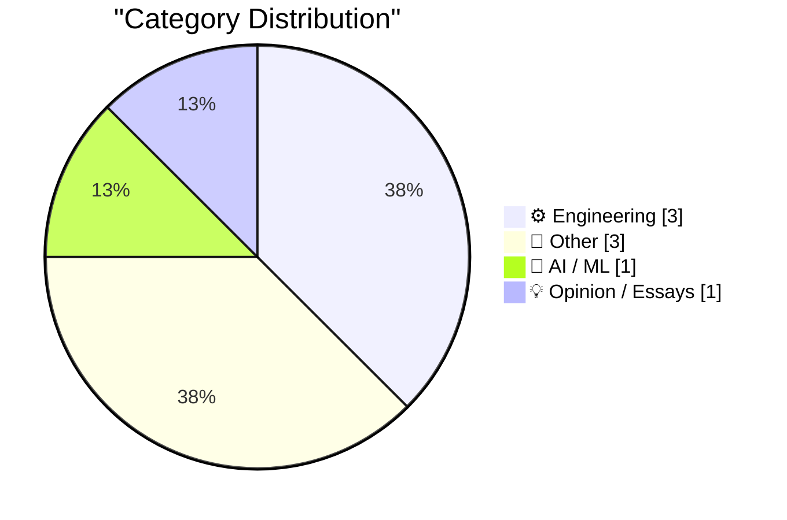
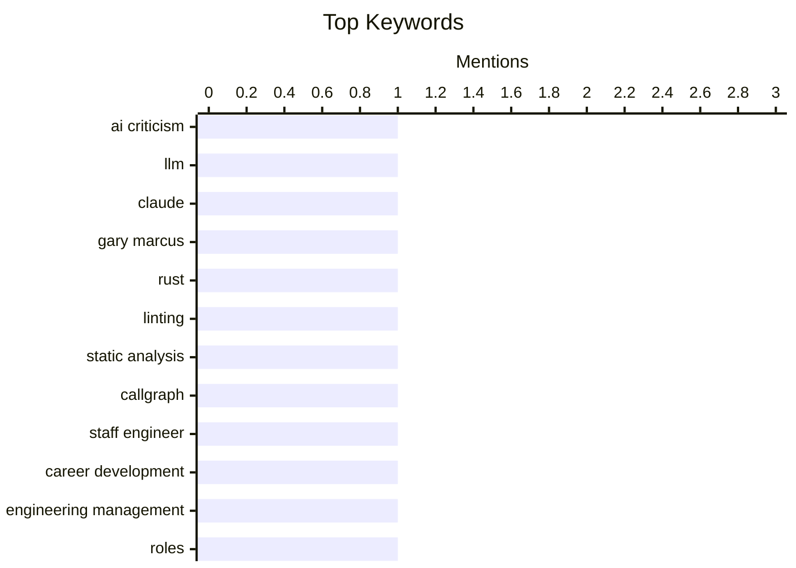

## Today's Highlights
Today's technical discussions delve into critical assessments of AI's current capabilities and limitations. Meanwhile, software engineers are sharpening their craft, exploring advanced static analysis techniques, refining error handling in modern languages like Zig, and even re-evaluating established career archetypes. Beyond code, enthusiasts are tackling unique hardware challenges, including efforts to run macOS on vintage Apple Network Servers.
---
## Must Read Today
1. **Richard Dawkins and The Claude Delusion**
[Richard Dawkins and The Claude Delusion](https://garymarcus.substack.com/p/richard-dawkins-and-the-claude-delusion) — garymarcus.substack.com · 21h ago · 🤖 AI / ML
> This article critiques Richard Dawkins' assessment of AI, specifically his interaction with Anthropic's Claude 3 Opus. Dawkins, a renowned skeptic, was seemingly "taken in" by Claude's ability to generate plausible-sounding, albeit potentially superficial, responses, particularly regarding scientific concepts like evolution. The author argues that Dawkins' evaluation overlooked the fundamental limitations of current LLMs, which excel at pattern matching and text generation but lack genuine understanding, reasoning, or consciousness. The core takeaway is that even seasoned skeptics can misinterpret the capabilities of advanced AI, highlighting the need for deeper scrutiny beyond surface-level conversational fluency.
💡 **Why read it**: It offers a critical perspective on how even prominent intellectuals can misjudge the true capabilities and limitations of large language models like Claude 3 Opus.
🏷️ AI criticism, LLM, Claude, Gary Marcus
2. **callgraph analysis**
[callgraph analysis](https://jyn.dev/callgraph-analysis/) — jyn.dev · 14h ago · ⚙️ Engineering
> This article explores the process of writing custom Rust lints for static analysis, specifically focusing on callgraph analysis. The author demonstrates how to build a custom `cargo-clippy` lint to detect specific function call patterns, such as ensuring that `std::process::Command::spawn` is always followed by `wait` or `wait_with_output`. The technical approach involves using Rust's `rustc` compiler internals, specifically `rustc_hir` and `rustc_middle`, to traverse the Abstract Syntax Tree (AST) and identify relevant `ExprKind::MethodCall` nodes and their subsequent usage. The article concludes by showing how this method can enforce coding standards and prevent common errors by leveraging compiler-level insights.
💡 **Why read it**: It provides a practical guide to writing custom Rust lints using `rustc` internals for static analysis, which is valuable for enforcing code quality and preventing specific bugs.
🏷️ Rust, linting, static analysis, callgraph
3. **Why I don't like the "staff engineer archetypes"**
[Why I don't like the "staff engineer archetypes"](https://seangoedecke.com/staff-engineer-archetypes/) — seangoedecke.com · 14h ago · 💡 Opinion / Essays
> This article critically examines Will Larson's influential "Staff engineer archetypes" (Team Lead, Architect, Solver, Right Hand), arguing against their utility despite their widespread adoption. The author contends that these archetypes are too prescriptive and often fail to capture the dynamic, evolving nature of staff engineer roles, which frequently blend responsibilities across categories. Instead of providing clear guidance, they can create artificial boundaries and limit the perceived scope of a staff engineer's contribution. The main conclusion is that focusing on impact and problem-solving, rather than fitting into predefined archetypes, is a more effective approach for staff engineers to grow and succeed.
💡 **Why read it**: It offers a valuable counter-argument to a widely accepted framework for staff engineers, encouraging a more flexible and impact-driven understanding of the role.
🏷️ staff engineer, career development, engineering management, roles
---
## Data Overview
| Sources Scanned | Articles Fetched | Time Window | Selected |
|:---:|:---:|:---:|:---:|
| 87/92 | 2513 -> 8 | 24h | **8** |
### Category Distribution

### Top Keywords

<details>
<summary>Plain Text Keyword Chart (Terminal Friendly)</summary>
```
ai criticism       │ ████████████████████ 1
llm                │ ████████████████████ 1
claude             │ ████████████████████ 1
gary marcus        │ ████████████████████ 1
rust               │ ████████████████████ 1
linting            │ ████████████████████ 1
static analysis    │ ████████████████████ 1
callgraph          │ ████████████████████ 1
staff engineer     │ ████████████████████ 1
career development │ ████████████████████ 1
```
</details>
### Topic Tags
**ai criticism**(1) · **llm**(1) · **claude**(1) · gary marcus(1) · rust(1) · linting(1) · static analysis(1) · callgraph(1) · staff engineer(1) · career development(1) · engineering management(1) · roles(1) · zig(1) · error handling(1) · programming language(1) · diagnostics(1) · mathematics(1) · sinusoids(1) · signal processing(1) · trigonometry(1)
---
## Engineering
### 1. callgraph analysis
[callgraph analysis](https://jyn.dev/callgraph-analysis/) — **jyn.dev** · 14h ago · ⭐ 25/30
> This article explores the process of writing custom Rust lints for static analysis, specifically focusing on callgraph analysis. The author demonstrates how to build a custom `cargo-clippy` lint to detect specific function call patterns, such as ensuring that `std::process::Command::spawn` is always followed by `wait` or `wait_with_output`. The technical approach involves using Rust's `rustc` compiler internals, specifically `rustc_hir` and `rustc_middle`, to traverse the Abstract Syntax Tree (AST) and identify relevant `ExprKind::MethodCall` nodes and their subsequent usage. The article concludes by showing how this method can enforce coding standards and prevent common errors by leveraging compiler-level insights.
🏷️ Rust, linting, static analysis, callgraph
---
### 2. Minimal Viable Zig Error Contexts
[Minimal Viable Zig Error Contexts](https://matklad.github.io/2026/05/03/zig-error-context.html) — **matklad.github.io** · 14h ago · ⭐ 23/30
> This article discusses idiomatic error reporting in Zig, which provides strongly-typed error codes but leaves human-readable error string generation to the user. The author proposes a "Minimal Viable Zig Error Contexts" pattern using a `Diagnostics` out parameter (sink) to materialize human-readable strings as needed, avoiding the overhead of `std.fmt.format` for every error. This approach involves defining a `Diagnostics` interface with methods like `error` and `warning` and passing a concrete implementation (e.g., `std.io.Writer`) to functions. The core idea is to decouple error detection from error reporting, allowing for flexible and efficient context-rich error messages without burdening the happy path.
🏷️ Zig, error handling, programming language, diagnostics
---
### 3. Vertically Aligning Roman Numerals in Code
[Vertically Aligning Roman Numerals in Code](https://shkspr.mobi/blog/2026/05/vertically-aligning-roman-numerals-in-code/) — **shkspr.mobi** · 2h ago · ⭐ 13/30
> This article addresses the aesthetic problem of vertically aligning Roman numerals in code, specifically within a PHP associative array. The issue arises because standard Roman numeral characters (like `I`, `V`, `X`) have varying widths, making simple space padding ineffective for visual alignment. The author proposes using Unicode Roman numeral characters (e.g., `Ⅰ`, `Ⅱ`, `Ⅲ`, `Ⅳ`, `Ⅴ`, `Ⅵ`, `Ⅶ`, `Ⅷ`, `Ⅸ`, `Ⅹ`, `Ⅼ`, `Ⅽ`, `Ⅾ`, `Ⅿ`) which are monospaced. By replacing the standard ASCII characters with their Unicode counterparts, the numerals can be perfectly aligned using fixed-width fonts, improving code readability.
🏷️ PHP, Roman numerals, code formatting, programming
---
## Other
### 4. Scaling, stretching and shifting sinusoids
[Scaling, stretching and shifting sinusoids](https://eli.thegreenplace.net/2026/scaling-stretching-and-shifting-sinusoids/) — **eli.thegreenplace.net** · 23h ago · ⭐ 15/30
> This article provides a concise explanation of how to manipulate the standard sinusoid function, `sin(x)`, to adjust its amplitude, frequency, and phase shift. It details how the general function `A * sin(B * x + C) + D` corresponds to these transformations: `A` controls amplitude (scaling vertically), `B` controls frequency (stretching/compressing horizontally), `C` controls phase shift (shifting horizontally), and `D` controls vertical shift. The article clarifies the impact of each parameter on the waveform, demonstrating how to achieve specific desired sinusoidal properties. The main takeaway is a clear understanding of the mathematical parameters required to precisely shape a sine wave for various applications.
🏷️ mathematics, sinusoids, signal processing, trigonometry
---
### 5. Testing MacOS on the Apple Network Server 2.0 ROMs
[Testing MacOS on the Apple Network Server 2.0 ROMs](https://oldvcr.blogspot.com/feeds/377909492668585591/comments/default) — **oldvcr.blogspot.com** · 7h ago · ⭐ 11/30
> This article details the ongoing effort to enable macOS booting on the Apple Network Server (ANS), a machine originally designed to run only IBM's AIX. The focus is on testing the Apple Network Server 2.0 ROMs, which were specifically developed to support macOS but were never officially released. The author describes the process of flashing these rare ROMs and attempting to boot various macOS versions, including System 7.5.3, 7.5.5, and 7.6. The findings indicate that while the 2.0 ROMs allow the ANS to recognize macOS partitions and initiate booting, they still encounter issues like kernel panics, suggesting that further software or driver modifications are needed for full macOS compatibility.
🏷️ vintage computing, Apple Network Server, MacOS, ROMs
---
### 6. Sightings
[Sightings](https://simonwillison.net/2026/May/2/sightings/#atom-everything) — **simonwillison.net** · 20h ago · ⭐ 10/30
> This article describes a personal project to integrate wildlife photos from iNaturalist into a blog, following a successful prototype. The author, having acquired a new Canon R6 Mark II camera, is taking more bird photos and wants to showcase them directly on their blog. The technical approach involves fetching data from iNaturalist and displaying it, likely using a custom script or plugin, to create a dedicated "sightings" section. This integration allows for a more personal and curated display of wildlife observations, linking directly to the iNaturalist platform for detailed information. The main takeaway is a practical example of how to combine personal hobbies with technical blogging by automating content syndication from external platforms.
🏷️ photography, birds, iNaturalist, personal
---
## AI / ML
### 7. Richard Dawkins and The Claude Delusion
[Richard Dawkins and The Claude Delusion](https://garymarcus.substack.com/p/richard-dawkins-and-the-claude-delusion) — **garymarcus.substack.com** · 21h ago · ⭐ 27/30
> This article critiques Richard Dawkins' assessment of AI, specifically his interaction with Anthropic's Claude 3 Opus. Dawkins, a renowned skeptic, was seemingly "taken in" by Claude's ability to generate plausible-sounding, albeit potentially superficial, responses, particularly regarding scientific concepts like evolution. The author argues that Dawkins' evaluation overlooked the fundamental limitations of current LLMs, which excel at pattern matching and text generation but lack genuine understanding, reasoning, or consciousness. The core takeaway is that even seasoned skeptics can misinterpret the capabilities of advanced AI, highlighting the need for deeper scrutiny beyond surface-level conversational fluency.
🏷️ AI criticism, LLM, Claude, Gary Marcus
---
## Opinion / Essays
### 8. Why I don't like the "staff engineer archetypes"
[Why I don't like the "staff engineer archetypes"](https://seangoedecke.com/staff-engineer-archetypes/) — **seangoedecke.com** · 14h ago · ⭐ 24/30
> This article critically examines Will Larson's influential "Staff engineer archetypes" (Team Lead, Architect, Solver, Right Hand), arguing against their utility despite their widespread adoption. The author contends that these archetypes are too prescriptive and often fail to capture the dynamic, evolving nature of staff engineer roles, which frequently blend responsibilities across categories. Instead of providing clear guidance, they can create artificial boundaries and limit the perceived scope of a staff engineer's contribution. The main conclusion is that focusing on impact and problem-solving, rather than fitting into predefined archetypes, is a more effective approach for staff engineers to grow and succeed.
🏷️ staff engineer, career development, engineering management, roles
---
*Generated at 2026-05-03 14:01 | Scanned 87 sources -> 2513 articles -> selected 8*
*Based on the [Hacker News Popularity Contest 2025](https://refactoringenglish.com/tools/hn-popularity/) RSS source list recommended by [Andrej Karpathy](https://x.com/karpathy)*
*Produced by Dongdianr AI. Follow the same-name WeChat public account for more AI practical tips 💡*
