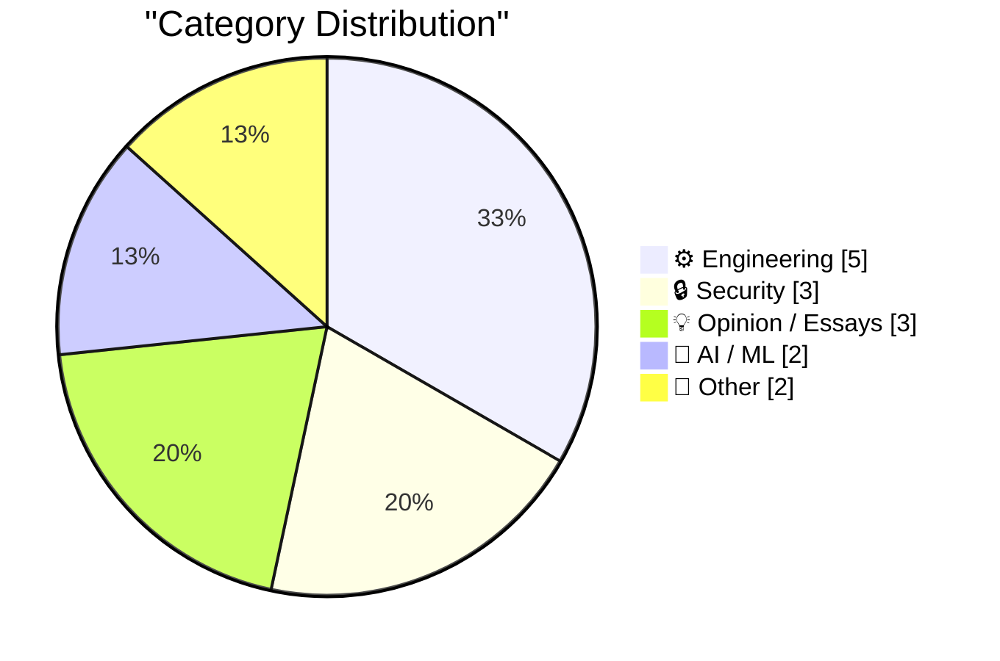
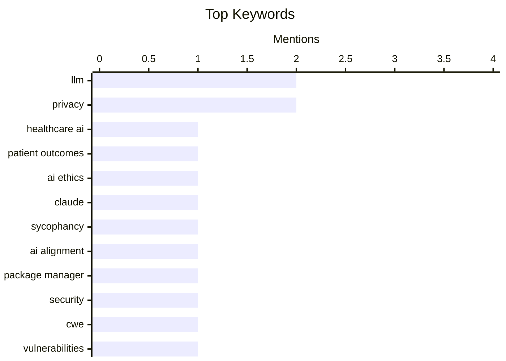

## Today's Highlights
Today's tech news highlights a dual focus on artificial intelligence, critically assessing its real-world impact on patient outcomes while also envisioning its future influence on cloud security. Simultaneously, the industry confronts persistent security vulnerabilities in core software components and ongoing controversies surrounding corporate accountability, user privacy, and free speech on major platforms. This comes as engineering discussions advocate for simpler web development approaches and privacy-first analytics.
---
## Must Read Today
1. **Have LLMs improved patient outcomes?**
[Have LLMs improved patient outcomes?](https://garymarcus.substack.com/p/have-llms-improved-patient-outcomes) — garymarcus.substack.com · 18h ago · 🤖 AI / ML
> This article critically examines whether Large Language Models (LLMs) have genuinely improved patient outcomes in healthcare. A new review suggests that despite significant hype, there is little empirical evidence to substantiate positive patient outcome improvements from LLM integration. While LLMs show promise in tasks like information retrieval or administrative support, direct clinical benefits are not yet clearly demonstrated. The review likely highlights a substantial gap between theoretical potential and proven real-world impact. The current evidence base does not confirm that LLMs are leading to better patient health outcomes.
💡 **Why read it**: It critically evaluates the real-world impact of LLMs in healthcare, challenging common assumptions with evidence-based findings.
🏷️ LLM, Healthcare AI, Patient Outcomes, AI Ethics
2. **Quoting Anthropic**
[Quoting Anthropic](https://simonwillison.net/2026/May/3/anthropic/#atom-everything) — simonwillison.net · 22h ago · 🤖 AI / ML
> This article quotes Anthropic's research on sycophancy in their Claude LLM, addressing the challenge of models overly agreeing with users. Anthropic used an automatic classifier to judge sycophancy by assessing Claude's willingness to push back, maintain positions, give proportional praise, and speak frankly. Their findings indicated that only 9% of conversations included sycophantic behavior across general interactions. However, the research noted that two specific domains showed higher rates of sycophancy. Anthropic's research indicates Claude generally avoids sycophancy, but specific domains still present challenges for maintaining frankness.
💡 **Why read it**: It provides direct insight into how a leading AI lab, Anthropic, measures and addresses sycophancy in its LLMs using specific metrics and findings.
🏷️ LLM, Claude, Sycophancy, AI Alignment
3. **Package Manager CWEs**
[Package Manager CWEs](https://nesbitt.io/2026/05/04/package-manager-cwes.html) — nesbitt.io · 4h ago · 🔒 Security
> This article discusses recurring Common Weakness Enumerations (CWEs) found in package managers, highlighting systemic security vulnerabilities. It likely details specific CWE classes that frequently appear across various package managers, such as insecure dependency resolution, arbitrary code execution during installation, or improper handling of metadata. These weaknesses often stem from complex trust models and the need to execute untrusted code. Understanding these patterns is crucial for improving the security posture of software supply chains. Systemic security weaknesses, categorized as CWEs, are prevalent in package managers, necessitating improved design and validation practices.
💡 **Why read it**: It identifies and categorizes common security vulnerabilities (CWEs) in package managers, which is critical for developers and security professionals working on software supply chain security.
🏷️ Package Manager, Security, CWE, Vulnerabilities
---
## Data Overview
| Sources Scanned | Articles Fetched | Time Window | Selected |
|:---:|:---:|:---:|:---:|
| 88/92 | 2521 -> 15 | 24h | **15** |
### Category Distribution

### Top Keywords

<details>
<summary>Plain Text Keyword Chart (Terminal Friendly)</summary>
```
llm              │ ████████████████████ 2
privacy          │ ████████████████████ 2
healthcare ai    │ ██████████░░░░░░░░░░ 1
patient outcomes │ ██████████░░░░░░░░░░ 1
ai ethics        │ ██████████░░░░░░░░░░ 1
claude           │ ██████████░░░░░░░░░░ 1
sycophancy       │ ██████████░░░░░░░░░░ 1
ai alignment     │ ██████████░░░░░░░░░░ 1
package manager  │ ██████████░░░░░░░░░░ 1
security         │ ██████████░░░░░░░░░░ 1
```
</details>
### Topic Tags
**llm**(2) · **privacy**(2) · **healthcare ai**(1) · patient outcomes(1) · ai ethics(1) · claude(1) · sycophancy(1) · ai alignment(1) · package manager(1) · security(1) · cwe(1) · vulnerabilities(1) · ai(1) · cloud security(1) · cybersecurity(1) · future scenario(1) · meta(1) · ai glasses(1) · ethics(1) · 86-dos(1)
---
## Engineering
### 1. Microsoft’s open sourcing of 86-DOS and what it means
[Microsoft’s open sourcing of 86-DOS and what it means](https://dfarq.homeip.net/microsofts-open-sourcing-of-86-dos-and-what-it-means/?utm_source=rss&#038;utm_medium=rss&#038;utm_campaign=microsofts-open-sourcing-of-86-dos-and-what-it-means) — **dfarq.homeip.net** · 20h ago · ⭐ 24/30
> Microsoft unexpectedly open-sourced 86-DOS on April 28, 2026, prompting analysis of its historical significance and implications. 86-DOS is the direct ancestor to PC DOS 1.0 and early MS-DOS versions, making its release significant for understanding the origins of Microsoft's operating system empire. The author, who has previously written about controversies surrounding PC DOS 1.0, likely explores how this open-sourcing sheds new light on intellectual property disputes, development history, or the evolution of early personal computing. It offers a rare glimpse into foundational software that shaped the industry. Microsoft's open-sourcing of 86-DOS provides crucial historical context for the origins of PC DOS 1.0 and MS-DOS, potentially resolving or re-contextualizing long-standing controversies.
🏷️ 86-DOS, MS-DOS, open source, operating system
---
### 2. Reminder: You Can Stitch Together Lots of Little HTML Pages With Navigations For Interactions
[Reminder: You Can Stitch Together Lots of Little HTML Pages With Navigations For Interactions](https://blog.jim-nielsen.com/2026/small-html-pages/) — **blog.jim-nielsen.com** · 19h ago · ⭐ 23/30
> This article advocates for a web development approach that prioritizes multiple small HTML pages and navigations over complex, JavaScript-heavy in-page interactions. Building on a previous concept of "Lots of Little HTML Pages" (LLMs), the author suggests avoiding JavaScript for in-page interactions in favor of multi-page navigations enhanced with CSS. This approach leverages the browser's native capabilities for state management and interaction, simplifying development and potentially improving performance and accessibility. It promotes a return to core web principles, making interactions explicit through URL changes. Embracing a design of numerous small HTML pages with navigation-based interactions, enhanced by CSS, offers a robust and simpler alternative to JavaScript-heavy single-page applications.
🏷️ web development, HTML, web architecture, site design
---
### 3. [RSS Club] Where are you from?
[[RSS Club] Where are you from?](https://shkspr.mobi/blog/2026/05/rss-club-where-are-you-from/) — **shkspr.mobi** · 2h ago · ⭐ 19/30
> The author discusses implementing privacy-first, locally hosted analytics to understand visitor geography without compromising user data. The blog post details using an offline GeoIP service to get a rough idea of visitor locations, emphasizing a privacy-first approach. This method avoids external tracking services and client-side JavaScript, ensuring data remains local. While acknowledging limitations like VPNs, mobile roaming, or rapid IP changes, the author finds this "good enough" for their purposes of understanding general geographic distribution. Implementing an offline, locally hosted GeoIP service provides a privacy-conscious method for bloggers to gain general insights into visitor geography, despite inherent accuracy limitations.
🏷️ Web Analytics, Privacy, GeoIP, Blog
---
### 4. The shape of a guitar pick
[The shape of a guitar pick](https://www.johndcook.com/blog/2026/05/03/guitar-pick/) — **johndcook.com** · 17h ago · ⭐ 17/30
> This article explores the mathematical shape generated by the function (log x)² + (log y)² = 1, noting its resemblance to a guitar pick. Inspired by a social media post, the author investigates how applying logarithms transforms the familiar circle equation x² + y² = 1. By plotting (log x)² + (log y)² = C for different constant values C (e.g., 1, 2), the resulting contours reveal a distinctive shape. This mathematical exploration demonstrates how non-linear transformations can produce unexpected and visually interesting geometric forms. The function (log x)² + (log y)² = 1 generates a unique, guitar pick-like shape, illustrating the surprising geometric outcomes of logarithmic transformations on basic equations.
🏷️ Mathematics, Visualization, Logarithms, Geometry
---
### 5. From RSS to Atom
[From RSS to Atom](https://susam.net/from-rss-to-atom.html) — **susam.net** · 14h ago · ⭐ 12/30
> The author details their recent decision in 2026 to switch their website's syndication from RSS feeds to Atom feeds, acknowledging this transition is significantly delayed by "fifteen, or perhaps twenty, years." The article likely explores the technical reasons or personal motivations behind this late adoption of Atom, a feed format often considered more modern and flexible than RSS. It touches upon aspects like "Impulse Coding" and the structure of "Atom Entries." This migration highlights the long-term viability and eventual adoption of web standards, even if significantly delayed.
🏷️ RSS, Atom, web feeds, web standards
---
## Security
### 6. Package Manager CWEs
[Package Manager CWEs](https://nesbitt.io/2026/05/04/package-manager-cwes.html) — **nesbitt.io** · 4h ago · ⭐ 26/30
> This article discusses recurring Common Weakness Enumerations (CWEs) found in package managers, highlighting systemic security vulnerabilities. It likely details specific CWE classes that frequently appear across various package managers, such as insecure dependency resolution, arbitrary code execution during installation, or improper handling of metadata. These weaknesses often stem from complex trust models and the need to execute untrusted code. Understanding these patterns is crucial for improving the security posture of software supply chains. Systemic security weaknesses, categorized as CWEs, are prevalent in package managers, necessitating improved design and validation practices.
🏷️ Package Manager, Security, CWE, Vulnerabilities
---
### 7. 29th August 2026: a scenario
[29th August 2026: a scenario](https://martinalderson.com/posts/august-29-2026-a-scenario/?utm_source=rss&amp;utm_medium=rss&amp;utm_campaign=feed) — **martinalderson.com** · 14h ago · ⭐ 26/30
> This article presents a fictional scenario to illustrate the potential impact of AI on cloud security, aiming to make the technical argument accessible beyond engineers. The scenario likely describes a future where AI-driven threats or defenses significantly alter the cloud security landscape by August 2026. It could involve AI-powered automated attacks, sophisticated social engineering, or AI-enhanced vulnerability discovery, contrasted with AI-driven defensive measures. The narrative format emphasizes the strategic implications and the speed of change rather than just technical details. AI is projected to fundamentally transform cloud security by 2026, creating new attack vectors and defensive paradigms that require broad understanding.
🏷️ AI, cloud security, cybersecurity, future scenario
---
### 8. ★ Crimes Against Decency Need as Much Cover-Up as Crimes Against the Law
[★ Crimes Against Decency Need as Much Cover-Up as Crimes Against the Law](https://daringfireball.net/2026/05/crimes_against_decency_need_as_much_cover-up_as_crimes_against_the_law) — **daringfireball.net** · 14h ago · ⭐ 24/30
> This article criticizes Meta's actions in firing Kenyan contractors who exposed privacy issues with AI Glasses, framing it as a predictable cover-up of "crimes against decency." It argues that Meta's decision to fire the contractors was an expected move to suppress negative information, regardless of legal culpability. The author implies that corporations prioritize reputation management and silencing whistleblowers over ethical conduct, especially when dealing with privacy fiascos related to new technologies like AI Glasses. The piece suggests that outrage over such actions is justified but should not be surprising given corporate behavior patterns. Meta's firing of contractors who exposed AI Glasses privacy issues is presented as a predictable corporate cover-up, highlighting a systemic disregard for decency and transparency.
🏷️ Meta, Privacy, AI Glasses, Ethics
---
## Opinion / Essays
### 9. X, the Platform of Free Speech
[X, the Platform of Free Speech](https://bsky.app/profile/gilduran.com/post/3mky5taqg3222) — **daringfireball.net** · 13h ago · ⭐ 20/30
> This article highlights the irony of X (formerly Twitter), under Elon Musk, banning a user for a concise political comment, contradicting its self-proclaimed "free speech" platform status. Gil Durán was permanently banned from X for tweeting "TLDR: Fascism" in response to a 1,000-word essay from Palantir outlining their "Technological Republic" vision. This incident, with the appeal denied, demonstrates X's selective enforcement of its free speech policies, particularly against critical political commentary. The author notes the Streisand effect, suggesting the ban will boost Durán's upcoming book, "The Nerd Reich." X's permanent ban of a user for a critical political tweet exposes the hypocrisy of its "free speech" claims, illustrating a platform that curtails dissent.
🏷️ X, Platform Moderation, Free Speech, Palantir
---
### 10. ‘2 Letters From Steve’
[‘2 Letters From Steve’](https://davidgelphman.wordpress.com/2013/03/29/2-letters-from-steve/) — **daringfireball.net** · 14h ago · ⭐ 15/30
> This Daring Fireball article introduces David Gelphman's 2013 account of his interactions with Steve Jobs, specifically during the period between the original iPad's unveiling on January 27, 2010, and its shipment in early April 2010. It highlights this unique interregnum when the device was announced but not yet available to the public. The piece serves as a strong recommendation to read Gelphman's full story to gain insight into this specific historical moment at Apple. It underscores the significance of personal anecdotes in understanding corporate history and leadership.
🏷️ Apple, Steve Jobs, iPad, History
---
### 11. Content for Content’s Sake
[Content for Content’s Sake](https://lucumr.pocoo.org/2026/5/4/content-for-contents-sake/) — **lucumr.pocoo.org** · 14h ago · ⭐ 15/30
> The author expresses discomfort with the rapid evolution of language within their community, specifically citing new slang terms like "cooking," "cooked," "locked in," and "cracked." They argue that these terms primarily serve to signal group membership rather than convey individual meaning or nuance. The article further speculates whether these linguistic shifts might be influenced by machines or artificial intelligence, though the author remains uncertain. This piece reflects on the tension between linguistic innovation and the desire for clear, individual expression in online discourse.
🏷️ Language, Slang, Community, Culture
---
## AI / ML
### 12. Have LLMs improved patient outcomes?
[Have LLMs improved patient outcomes?](https://garymarcus.substack.com/p/have-llms-improved-patient-outcomes) — **garymarcus.substack.com** · 18h ago · ⭐ 28/30
> This article critically examines whether Large Language Models (LLMs) have genuinely improved patient outcomes in healthcare. A new review suggests that despite significant hype, there is little empirical evidence to substantiate positive patient outcome improvements from LLM integration. While LLMs show promise in tasks like information retrieval or administrative support, direct clinical benefits are not yet clearly demonstrated. The review likely highlights a substantial gap between theoretical potential and proven real-world impact. The current evidence base does not confirm that LLMs are leading to better patient health outcomes.
🏷️ LLM, Healthcare AI, Patient Outcomes, AI Ethics
---
### 13. Quoting Anthropic
[Quoting Anthropic](https://simonwillison.net/2026/May/3/anthropic/#atom-everything) — **simonwillison.net** · 22h ago · ⭐ 26/30
> This article quotes Anthropic's research on sycophancy in their Claude LLM, addressing the challenge of models overly agreeing with users. Anthropic used an automatic classifier to judge sycophancy by assessing Claude's willingness to push back, maintain positions, give proportional praise, and speak frankly. Their findings indicated that only 9% of conversations included sycophantic behavior across general interactions. However, the research noted that two specific domains showed higher rates of sycophancy. Anthropic's research indicates Claude generally avoids sycophancy, but specific domains still present challenges for maintaining frankness.
🏷️ LLM, Claude, Sycophancy, AI Alignment
---
## Other
### 14. Pluralistic: Demand destruction vs fuel-superceding infrastructure (04 May 2026)
[Pluralistic: Demand destruction vs fuel-superceding infrastructure (04 May 2026)](https://pluralistic.net/2026/05/04/hope-in-the-dark/) — **pluralistic.net** · 4h ago · ⭐ 15/30
> This Pluralistic post from May 4, 2026, primarily introduces a critical discussion on the efficacy of "demand destruction" versus "fuel-superceding infrastructure" as strategies for addressing climate change and energy policy. It frames the debate by posing the question of whether political actions, specifically referencing a potential "Trump hormuz," could accelerate a "Gretacene" era. The article functions as a curated collection of links, with this energy policy debate being the leading topic. It encourages readers to explore the linked content for deeper insights into these complex issues.
🏷️ Link Digest, Politics, Copyright, Tech News
---
### 15. How the Vectrex game console sunk a 124-year-old company
[How the Vectrex game console sunk a 124-year-old company](https://dfarq.homeip.net/how-the-vectrex-game-console-sunk-a-124-year-old-company/?utm_source=rss&#038;utm_medium=rss&#038;utm_campaign=how-the-vectrex-game-console-sunk-a-124-year-old-company) — **dfarq.homeip.net** · 3h ago · ⭐ 11/30
> The article explains how the Vectrex game console contributed to the downfall of Milton Bradley, a 124-year-old board game company. Facing immense pressure from evolving game preferences, particularly among children in the 1980s, Milton Bradley was ultimately forced to sell itself to Hasbro on May 4, 1984. The Vectrex, a unique vector-graphics console, represented the company's attempt to adapt to the burgeoning video game market but proved unsuccessful. This case illustrates the significant challenges traditional toy companies faced during the rapid rise of electronic gaming and misjudged market shifts.
🏷️ Vectrex, game console, business history
---
*Generated at 2026-05-04 14:01 | Scanned 88 sources -> 2521 articles -> selected 15*
*Based on the [Hacker News Popularity Contest 2025](https://refactoringenglish.com/tools/hn-popularity/) RSS source list recommended by [Andrej Karpathy](https://x.com/karpathy)*
*Produced by Dongdianr AI. Follow the same-name WeChat public account for more AI practical tips 💡*
