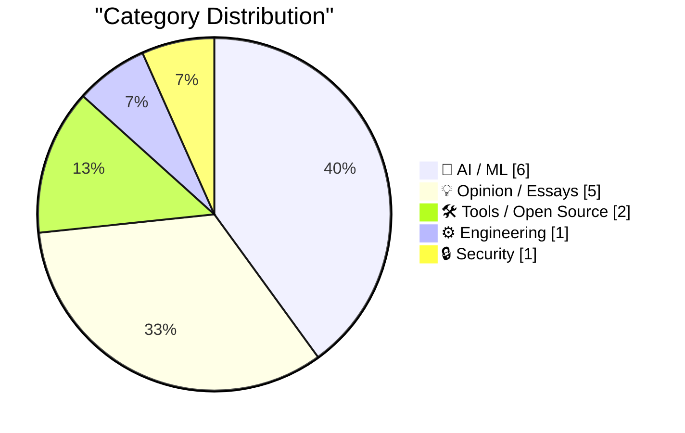
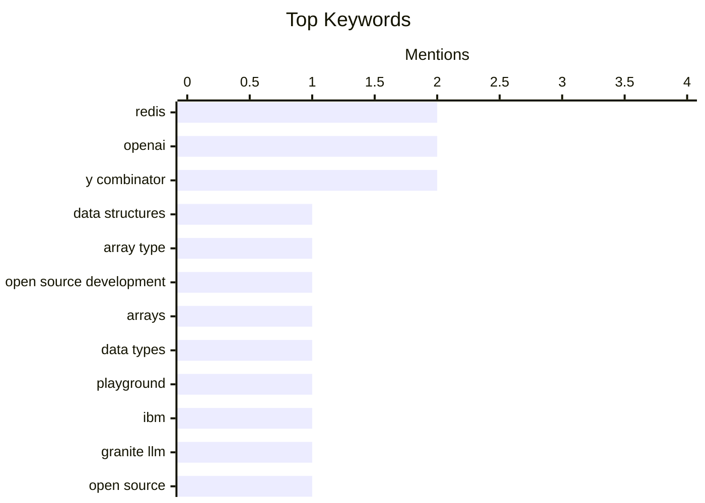

## Today's Highlights
Today's tech news highlights a dynamic period for Artificial Intelligence, marked by new model developments and a surge in AI-assisted coding, even as a notable backlash against the technology begins to surface. Alongside AI's evolving narrative, foundational data infrastructure is seeing key advancements, including the long-awaited Redis Array type and new developer tools to explore it. This progress is balanced by a critical focus on software security, addressing threats within package managers and regular expression implementations.
---
## Must Read Today
1. **Redis array type: short story of a long development**
[Redis array type: short story of a long development](http://antirez.com/news/164) — antirez.com · 23h ago · ⚙️ Engineering
> This article details the four-month development process behind adding the new Array data type to Redis. Salvatore Sanfilippo (antirez) worked on the implementation part-time, noting that despite the duration, he achieved significantly more in this period compared to previous development cycles, even before LLMs. This suggests an increased efficiency or capacity for parallel work in his development process. The development of the Redis Array type was a significant, multi-month effort, highlighting the complexity and dedication required for core data structure additions.
💡 **Why read it**: It provides a rare, first-hand account from Redis's creator on the development challenges and time investment for a new core data type.
🏷️ Redis, Data Structures, Array Type, Open Source Development
2. **Redis Array Playground**
[Redis Array Playground](https://simonwillison.net/2026/May/4/redis-array/#atom-everything) — simonwillison.net · 22h ago · 🛠 Tools / Open Source
> This article introduces the 'Redis Array Playground,' an online tool designed to explore and experiment with the recently proposed Array data type for Redis. Created by Simon Willison, the playground demonstrates the functionality of Salvatore Sanfilippo's PR 15162, which adds arrays to Redis. Users can interact with new commands like `ARCOUNT`, `ARDEL`, `ARGET`, `ARINSERT`, and `ARLEN`, providing a practical way to understand the new data structure. The Redis Array Playground offers an accessible way for developers to test and familiarize themselves with the upcoming Redis Array data type and its associated commands.
💡 **Why read it**: It provides a practical, interactive tool for developers to immediately experiment with a significant new Redis data type.
🏷️ Redis, Arrays, Data Types, Playground
3. **Granite 4.1 3B SVG Pelican Gallery**
[Granite 4.1 3B SVG Pelican Gallery](https://simonwillison.net/2026/May/4/granite-41-3b-svg-pelican-gallery/#atom-everything) — simonwillison.net · 14h ago · 🤖 AI / ML
> This article introduces a 'Granite 4.1 3B SVG Pelican Gallery,' a demonstration showcasing IBM's new Apache 2.0 licensed Granite 4.1 family of LLMs. IBM released Granite 4.1 LLMs in 3B, 8B, and 30B sizes, with the gallery specifically utilizing the 3B model. The article links to a detailed explanation by Granite team member Yousaf Shah on how these models are built, suggesting a focus on their architecture and training process. The gallery serves as a practical example of the capabilities of the smaller 3B Granite 4.1 LLM, providing insight into IBM's open-source AI offerings.
💡 **Why read it**: It offers a direct demonstration and context for IBM's new Apache 2.0 licensed Granite 4.1 LLMs, particularly the 3B model.
🏷️ IBM, Granite LLM, Open Source, Apache 2.0
---
## Data Overview
| Sources Scanned | Articles Fetched | Time Window | Selected |
|:---:|:---:|:---:|:---:|
| 88/92 | 2521 -> 29 | 24h | **15** |
### Category Distribution

### Top Keywords

<details>
<summary>Plain Text Keyword Chart (Terminal Friendly)</summary>
```
redis                   │ ████████████████████ 2
openai                  │ ████████████████████ 2
y combinator            │ ████████████████████ 2
data structures         │ ██████████░░░░░░░░░░ 1
array type              │ ██████████░░░░░░░░░░ 1
open source development │ ██████████░░░░░░░░░░ 1
arrays                  │ ██████████░░░░░░░░░░ 1
data types              │ ██████████░░░░░░░░░░ 1
playground              │ ██████████░░░░░░░░░░ 1
ibm                     │ ██████████░░░░░░░░░░ 1
```
</details>
### Topic Tags
**redis**(2) · **openai**(2) · **y combinator**(2) · data structures(1) · array type(1) · open source development(1) · arrays(1) · data types(1) · playground(1) · ibm(1) · granite llm(1) · open source(1) · apache 2.0(1) · ai compute(1) · demand(1) · hyperscalers(1) · gpu(1) · github(1) · ai coding(1) · developer productivity(1)
---
## AI / ML
### 1. Granite 4.1 3B SVG Pelican Gallery
[Granite 4.1 3B SVG Pelican Gallery](https://simonwillison.net/2026/May/4/granite-41-3b-svg-pelican-gallery/#atom-everything) — **simonwillison.net** · 14h ago · ⭐ 27/30
> This article introduces a 'Granite 4.1 3B SVG Pelican Gallery,' a demonstration showcasing IBM's new Apache 2.0 licensed Granite 4.1 family of LLMs. IBM released Granite 4.1 LLMs in 3B, 8B, and 30B sizes, with the gallery specifically utilizing the 3B model. The article links to a detailed explanation by Granite team member Yousaf Shah on how these models are built, suggesting a focus on their architecture and training process. The gallery serves as a practical example of the capabilities of the smaller 3B Granite 4.1 LLM, providing insight into IBM's open-source AI offerings.
🏷️ IBM, Granite LLM, Open Source, Apache 2.0
---
### 2. Premium: The AI Compute Demand Story Is A Lie
[Premium: The AI Compute Demand Story Is A Lie](https://www.wheresyoured.at/premium-the-ai-compute-demand-story-is-a-lie/) — **wheresyoured.at** · 23h ago · ⭐ 27/30
> This article challenges the prevailing narrative that current AI compute capacity constraints are solely due to 'incredible demand' for AI. The author argues that these constraints are instead driven by the desperation of hyperscalers and the 'avariciousness' of specific near-trillion-dollar companies. This suggests a critique of market dynamics and corporate strategies rather than organic demand. The article posits that the true drivers behind AI compute shortages are complex financial and strategic maneuvers by large tech players, not just a simple surge in AI adoption.
🏷️ AI compute, demand, hyperscalers, GPU
---
### 3. Commits on GitHub Are Up 14× Year-Over-Year
[Commits on GitHub Are Up 14× Year-Over-Year](https://daringfireball.net/linked/2026/03/13/amodei-ai-code-claim-chowder) — **daringfireball.net** · 23h ago · ⭐ 26/30
> This article discusses the impact of AI code generation tools on programming, referencing Anthropic CEO Dario Amodei’s prediction about AI writing 90%+ of code. The author notes that AI's revolutionary aspect isn't just replacing human-written lines, but enabling programmers to achieve significantly more. A linked claim states GitHub commits are up 14x year-over-year, suggesting a massive increase in development activity potentially spurred by AI assistance. AI code generation is transforming software development not merely by replacing human effort, but by significantly augmenting programmer productivity and output, as evidenced by a dramatic increase in GitHub commits.
🏷️ GitHub, AI Coding, Developer Productivity, Code Commits
---
### 4. AI didn't delete your database, you did
[AI didn't delete your database, you did](https://idiallo.com/blog/ai-didnt-delete-your-database-you-did?src=feed) — **idiallo.com** · 15h ago · ⭐ 26/30
> This article debunks a viral tweet claiming an AI agent (Cursor/Claude) deleted a company's production database, arguing that the user's system design was the root cause. The author highlights the critical flaw of having an API endpoint capable of deleting an entire production database. The article implies that the AI agent merely executed a dangerous command that was made available to it, rather than autonomously deciding to delete data. The incident serves as a cautionary tale about the importance of robust security practices and API design, emphasizing that AI agents expose existing vulnerabilities rather than creating new ones.
🏷️ AI agent, database, production, user error
---
### 5. The growing AI backlash
[The growing AI backlash](https://garymarcus.substack.com/p/the-growing-ai-backlash) — **garymarcus.substack.com** · 23h ago · ⭐ 26/30
> This article briefly notes the emergence of a growing backlash against Artificial Intelligence. The article's brevity suggests that the author, Gary Marcus (a known AI critic), views this backlash as an expected and unsurprising development. It implies that previous concerns or criticisms about AI are now gaining wider recognition. The piece highlights that skepticism and negative sentiment towards AI are increasing, aligning with long-standing critiques from figures like Gary Marcus.
🏷️ AI backlash, criticism, AI ethics, public perception
---
### 6. Google Owns a Big Chunk of Anthropic
[Google Owns a Big Chunk of Anthropic](https://www.nytimes.com/2025/03/11/technology/google-investment-anthropic.html?unlocked_article_code=1.f1A.eSTf.D5ECvk6f4DZ7) — **daringfireball.net** · 16h ago · ⭐ 24/30
> Google has been secretly investing in prominent AI start-ups, including Anthropic, to maintain its competitive edge in the artificial intelligence race. Court documents obtained by The New York Times recently revealed Google's significant ownership stake in Anthropic, an investment strategy kept private. This approach complements Google's internal technology development, showcasing a dual strategy to dominate the AI landscape. The article highlights how Google's undisclosed investments in key AI players are a critical, yet hidden, component of its overall strategy.
🏷️ Google, Anthropic, AI Investment, Competitive Strategy
---
## Opinion / Essays
### 7. ★ Y Combinator’s Stake in OpenAI
[★ Y Combinator’s Stake in OpenAI](https://daringfireball.net/2026/05/y_combinators_stake_in_openai) — **daringfireball.net** · 15h ago · ⭐ 24/30
> This article discusses the significant financial stake Y Combinator co-founder Paul Graham holds in OpenAI and its implications for his public statements. The author points out that while Graham's personal billions of dollars invested in OpenAI don't automatically invalidate his opinions on Sam Altman's trustworthiness, this financial interest should be disclosed when he provides character references. This highlights a potential conflict of interest that could influence public perception. The article argues for transparency regarding significant financial ties when public figures comment on companies or individuals where such interests exist, especially concerning leadership and trust.
🏷️ OpenAI, Y Combinator, Paul Graham, Conflict of Interest
---
### 8. Quoting John Gruber
[Quoting John Gruber](https://simonwillison.net/2026/May/5/john-gruber/#atom-everything) — **simonwillison.net** · 13h ago · ⭐ 23/30
> The article addresses the difficulty in determining the exact ownership stake of Y Combinator in OpenAI, despite its known investment. A source close to OpenAI investors revealed that Y Combinator owns approximately 0.6 percent of OpenAI. This stake is valued against OpenAI's current $852 billion valuation. This specific detail clarifies the extent of Y Combinator's involvement in one of the leading AI companies.
🏷️ OpenAI, Y Combinator, Investment, Stake
---
### 9. Quoting Andy Masley
[Quoting Andy Masley](https://simonwillison.net/2026/May/4/andy-masley/#atom-everything) — **simonwillison.net** · 15h ago · ⭐ 23/30
> This article challenges the perception that data centers are causing significant land use issues or impacting US food access. Between 2000 and 2024, farmers sold land equivalent to the size of Colorado, which is 77 times the total land occupied by data centers in 2028, while simultaneously increasing food production. A specific example highlights a farmer in Loudoun County selling a few acres of mediocre hay field to a hyperscaler for ten times its agricultural value. These facts suggest that data center land use is negligible compared to overall agricultural land sales and has no negative impact on food supply.
🏷️ Data Centers, Land Use, Sustainability, Infrastructure
---
### 10. Adobe’s ‘Modern’ User Interface Is Just Webpages
[Adobe’s ‘Modern’ User Interface Is Just Webpages](https://pxlnv.com/linklog/adobe-modern-user-interface/) — **daringfireball.net** · 11h ago · ⭐ 23/30
> The article criticizes Adobe's 'modern' user interface design for ignoring fundamental UI principles by prioritizing internal tooling, resulting in web-based interfaces. The author argues that Adobe's new UI, despite being tested, fails to meet the needs of high-pressure professional environments because it's essentially web pages. This approach prioritizes Adobe's internal tooling over established UI design principles and user experience, leading to interfaces that feel out of place on platforms like macOS. The criticism suggests a fundamental disconnect between Adobe's development priorities and its users' operational needs.
🏷️ Adobe, UI Design, UX, Webpages
---
### 11. App Store Search Ads and the Slippery Slope
[App Store Search Ads and the Slippery Slope](https://blog.thinktapwork.com/post/812803664980967425/ios-app-store-search-is-rotten) — **daringfireball.net** · 16h ago · ⭐ 23/30
> Apple's App Store search is increasingly prioritizing ad inventory over relevance, significantly impacting app visibility and user experience. With the introduction of a second search ad, apps not ranking #1 effectively moved down one position. Jeremy Provost observed that roughly 70% of the App Store search interface is covered in ads, including casino ads. This shift led to a dramatic decrease in organic installs for his company, Think Tap Work, with one app seeing a 70% drop and another a 30% drop in just two weeks. Apple's aggressive expansion of App Store search ads is eroding search relevance, diminishing organic app discovery, and negatively impacting developer businesses.
🏷️ App Store, Search Ads, iOS, App Discoverability
---
## Tools / Open Source
### 12. Redis Array Playground
[Redis Array Playground](https://simonwillison.net/2026/May/4/redis-array/#atom-everything) — **simonwillison.net** · 22h ago · ⭐ 28/30
> This article introduces the 'Redis Array Playground,' an online tool designed to explore and experiment with the recently proposed Array data type for Redis. Created by Simon Willison, the playground demonstrates the functionality of Salvatore Sanfilippo's PR 15162, which adds arrays to Redis. Users can interact with new commands like `ARCOUNT`, `ARDEL`, `ARGET`, `ARINSERT`, and `ARLEN`, providing a practical way to understand the new data structure. The Redis Array Playground offers an accessible way for developers to test and familiarize themselves with the upcoming Redis Array data type and its associated commands.
🏷️ Redis, Arrays, Data Types, Playground
---
### 13. TRE Python binding — ReDoS robustness demo
[TRE Python binding — ReDoS robustness demo](https://simonwillison.net/2026/May/4/tre-python-binding/#atom-everything) — **simonwillison.net** · 20h ago · ⭐ 25/30
> This article explores the ReDoS (Regular Expression Denial of Service) robustness of Ville Laurikari's TRE regular expression engine, specifically through an experimental Python binding. Inspired by `antirez` adding TRE to Redis, Simon Willison used Claude Code to build a Python binding for TRE. The research aims to demonstrate TRE's resilience against ReDoS attacks, a common vulnerability in regular expression engines. The experimental Python binding serves as a practical demonstration of TRE's potential for robust regular expression processing, particularly its resistance to ReDoS vulnerabilities.
🏷️ ReDoS, Regular Expressions, Python, TRE
---
## Engineering
### 14. Redis array type: short story of a long development
[Redis array type: short story of a long development](http://antirez.com/news/164) — **antirez.com** · 23h ago · ⭐ 29/30
> This article details the four-month development process behind adding the new Array data type to Redis. Salvatore Sanfilippo (antirez) worked on the implementation part-time, noting that despite the duration, he achieved significantly more in this period compared to previous development cycles, even before LLMs. This suggests an increased efficiency or capacity for parallel work in his development process. The development of the Redis Array type was a significant, multi-month effort, highlighting the complexity and dedication required for core data structure additions.
🏷️ Redis, Data Structures, Array Type, Open Source Development
---
## Security
### 15. Package Manager Threat Models
[Package Manager Threat Models](https://nesbitt.io/2026/05/05/package-manager-threat-models.html) — **nesbitt.io** · 4h ago · ⭐ 26/30
> This article focuses on the 'non-CVE half' of package manager security, implying a broader scope beyond just known vulnerabilities. The article likely delves into various threat models for package managers that don't involve Common Vulnerabilities and Exposures (CVEs), such as supply chain attacks, dependency confusion, typo-squatting, or malicious package injection. It aims to cover the less obvious but equally critical security aspects. Effective package manager security requires a comprehensive understanding of threat models extending beyond traditional CVEs to encompass the entire software supply chain.
🏷️ package manager, security, threat model, supply chain
---
*Generated at 2026-05-05 14:01 | Scanned 88 sources -> 2521 articles -> selected 15*
*Based on the [Hacker News Popularity Contest 2025](https://refactoringenglish.com/tools/hn-popularity/) RSS source list recommended by [Andrej Karpathy](https://x.com/karpathy)*
*Produced by Dongdianr AI. Follow the same-name WeChat public account for more AI practical tips 💡*
