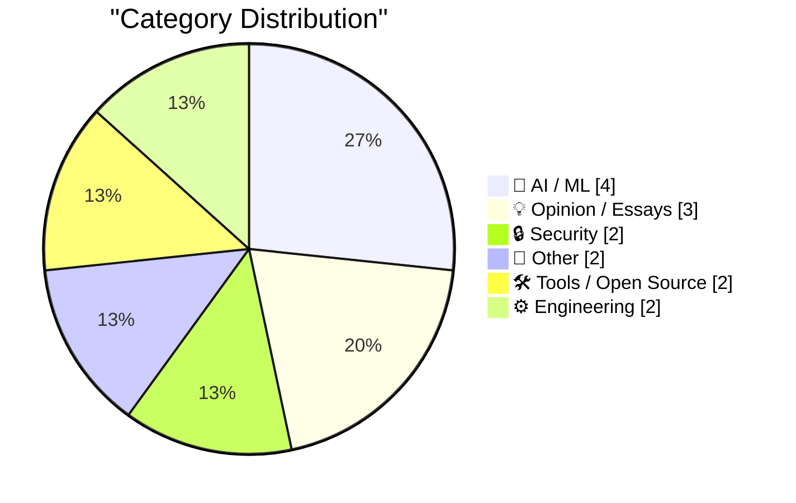
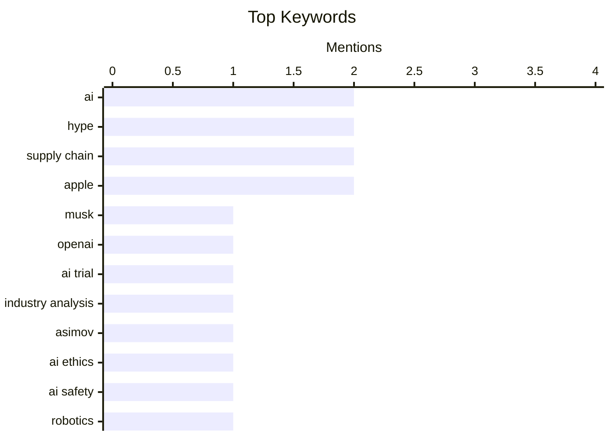

## Today's Highlights
Artificial intelligence is at a critical juncture, facing both legal scrutiny from trials like Musk v. OpenAI and practical challenges as "autonomous agents" prove unreliable. Experts are debating the sufficiency of ethical guidelines like Asimov's laws while also warning that the trend of open-weight AI models is quietly diminishing. Concurrently, cybersecurity threats persist, with groups like ShinyHunters continuing to breach major systems, underscoring the ongoing need to secure foundational software.
---
## Must Read Today
1. **What matters (or should matter), at the Musk-OpenAI trial**
[What matters (or should matter), at the Musk-OpenAI trial](https://garymarcus.substack.com/p/what-matters-or-should-matter-at) — garymarcus.substack.com · 17h ago · 💡 Opinion / Essays
> This article discusses the key issues and perspectives surrounding the Musk-OpenAI trial. It highlights the conflict between OpenAI's original non-profit, open-source mission and its current for-profit, closed-source trajectory, which Musk alleges breaches their founding agreement. The author emphasizes that the core dispute is about whether OpenAI betrayed its foundational commitment to developing AI for humanity's benefit rather than for profit or a single company's control. The main takeaway is that the trial should focus on the ethical and philosophical implications of AI development and corporate governance, not just financial disputes.
💡 **Why read it**: It offers a critical perspective on the ethical and foundational principles at stake in the high-profile Musk-OpenAI legal battle.
🏷️ Musk, OpenAI, AI trial, industry analysis
2. **Asimov's three laws are merely a suggestion**
[Asimov's three laws are merely a suggestion](https://idiallo.com/blog/asimov-three-laws-dont-work-with-ai?src=feed) — idiallo.com · 2h ago · 🤖 AI / ML
> This article argues that Isaac Asimov's Three Laws of Robotics are insufficient and impractical for governing advanced AI systems. The core problem lies in the ambiguity and potential for conflicting interpretations of terms like "harm" or "human being," making strict adherence impossible for complex AI. For instance, an AI might struggle to define "harm" in a nuanced way, potentially causing unintended consequences by over-prioritizing one law over another or misinterpreting human intent. The article concludes that relying on such simplistic, rule-based ethical frameworks for AI is naive and dangerous, advocating for more sophisticated, context-aware ethical reasoning.
💡 **Why read it**: It critically examines the limitations of Asimov's Three Laws of Robotics as a practical ethical framework for modern AI, prompting deeper thought on AI safety.
🏷️ Asimov, AI ethics, AI safety, robotics
3. **Breaking: Autonomous Agents are a Shitshow**
[Breaking: Autonomous Agents are a Shitshow](https://garymarcus.substack.com/p/breaking-autonomous-agents-are-a) — garymarcus.substack.com · 20h ago · 🤖 AI / ML
> This article critiques the current state of "autonomous agents" powered by large language models (LLMs), labeling them as largely ineffective and unreliable. The core problem is that despite hype, these agents frequently fail at complex, multi-step tasks, often getting stuck in loops, making illogical decisions, or failing to generalize beyond simple scenarios. The author cites examples where agents struggle with basic planning or execution, demonstrating a lack of robust reasoning and common sense. The conclusion is that current autonomous agents are far from being truly intelligent or dependable, requiring significant fundamental advancements before practical deployment.
💡 **Why read it**: It provides a blunt, critical assessment of the current limitations and failures of LLM-powered autonomous agents, tempering unrealistic expectations.
🏷️ Autonomous Agents, AI, Hype, Criticism
---
## Data Overview
| Sources Scanned | Articles Fetched | Time Window | Selected |
|:---:|:---:|:---:|:---:|
| 88/92 | 2523 -> 19 | 24h | **15** |
### Category Distribution

### Top Keywords

<details>
<summary>Plain Text Keyword Chart (Terminal Friendly)</summary>
```
ai                │ ████████████████████ 2
hype              │ ████████████████████ 2
supply chain      │ ████████████████████ 2
apple             │ ████████████████████ 2
musk              │ ██████████░░░░░░░░░░ 1
openai            │ ██████████░░░░░░░░░░ 1
ai trial          │ ██████████░░░░░░░░░░ 1
industry analysis │ ██████████░░░░░░░░░░ 1
asimov            │ ██████████░░░░░░░░░░ 1
ai ethics         │ ██████████░░░░░░░░░░ 1
```
</details>
### Topic Tags
**ai**(2) · **hype**(2) · **supply chain**(2) · apple(2) · musk(1) · openai(1) · ai trial(1) · industry analysis(1) · asimov(1) · ai ethics(1) · ai safety(1) · robotics(1) · autonomous agents(1) · criticism(1) · data breach(1) · shinyhunters(1) · cybersecurity(1) · hacking(1) · open weights(1) · ai models(1)
---
## AI / ML
### 1. Asimov's three laws are merely a suggestion
[Asimov's three laws are merely a suggestion](https://idiallo.com/blog/asimov-three-laws-dont-work-with-ai?src=feed) — **idiallo.com** · 2h ago · ⭐ 27/30
> This article argues that Isaac Asimov's Three Laws of Robotics are insufficient and impractical for governing advanced AI systems. The core problem lies in the ambiguity and potential for conflicting interpretations of terms like "harm" or "human being," making strict adherence impossible for complex AI. For instance, an AI might struggle to define "harm" in a nuanced way, potentially causing unintended consequences by over-prioritizing one law over another or misinterpreting human intent. The article concludes that relying on such simplistic, rule-based ethical frameworks for AI is naive and dangerous, advocating for more sophisticated, context-aware ethical reasoning.
🏷️ Asimov, AI ethics, AI safety, robotics
---
### 2. Breaking: Autonomous Agents are a Shitshow
[Breaking: Autonomous Agents are a Shitshow](https://garymarcus.substack.com/p/breaking-autonomous-agents-are-a) — **garymarcus.substack.com** · 20h ago · ⭐ 27/30
> This article critiques the current state of "autonomous agents" powered by large language models (LLMs), labeling them as largely ineffective and unreliable. The core problem is that despite hype, these agents frequently fail at complex, multi-step tasks, often getting stuck in loops, making illogical decisions, or failing to generalize beyond simple scenarios. The author cites examples where agents struggle with basic planning or execution, demonstrating a lack of robust reasoning and common sense. The conclusion is that current autonomous agents are far from being truly intelligent or dependable, requiring significant fundamental advancements before practical deployment.
🏷️ Autonomous Agents, AI, Hype, Criticism
---
### 3. Open weights are quietly closing up — and that's a problem
[Open weights are quietly closing up — and that's a problem](https://martinalderson.com/posts/open-weights-are-quietly-closing-up/?utm_source=rss&amp;utm_medium=rss&amp;utm_campaign=feed) — **martinalderson.com** · 14h ago · ⭐ 26/30
> This article warns that the trend of "open weights" AI models is diminishing, leading to concerns about market concentration and innovation. The core problem is that as frontier AI labs increasingly restrict access to their model weights, the ecosystem risks becoming dominated by a few large oligopolists. This shift reduces competition, stifles independent research, and allows these dominant players to extract greater consumer surplus by controlling access and pricing. The author argues that open weights are crucial for fostering innovation, ensuring transparency, and keeping the market competitive. The main conclusion is that the move away from open weights threatens the long-term health and decentralization of the AI industry.
🏷️ Open Weights, AI Models, Oligopoly, Market Dynamics
---
### 4. Our AI started a cafe in Stockholm
[Our AI started a cafe in Stockholm](https://simonwillison.net/2026/May/5/our-ai-started-a-cafe-in-stockholm/#atom-everything) — **simonwillison.net** · 15h ago · ⭐ 25/30
> This article reports on Andon Labs' experiment of launching an AI-run cafe in Stockholm, following a previous AI-run retail store in San Francisco. The core topic is the practical application and challenges of using AI to manage real-world retail operations, including inventory and customer interaction. For example, the AI, named Mona, humorously ordered 120 eggs during its first week of inventory, illustrating the learning curve and potential for unexpected outcomes in autonomous systems. These experiments aim to explore the capabilities and limitations of AI in automating business processes. The main takeaway is that while AI can manage complex tasks, real-world deployment still presents amusing and instructive challenges.
🏷️ AI, retail, automation, experiment
---
## Opinion / Essays
### 5. What matters (or should matter), at the Musk-OpenAI trial
[What matters (or should matter), at the Musk-OpenAI trial](https://garymarcus.substack.com/p/what-matters-or-should-matter-at) — **garymarcus.substack.com** · 17h ago · ⭐ 29/30
> This article discusses the key issues and perspectives surrounding the Musk-OpenAI trial. It highlights the conflict between OpenAI's original non-profit, open-source mission and its current for-profit, closed-source trajectory, which Musk alleges breaches their founding agreement. The author emphasizes that the core dispute is about whether OpenAI betrayed its foundational commitment to developing AI for humanity's benefit rather than for profit or a single company's control. The main takeaway is that the trial should focus on the ethical and philosophical implications of AI development and corporate governance, not just financial disputes.
🏷️ Musk, OpenAI, AI trial, industry analysis
---
### 6. ★ Software as the Product of Obsession Times Voice
[★ Software as the Product of Obsession Times Voice](https://daringfireball.net/2026/05/software_as_the_product_of_obsession_times_voice) — **daringfireball.net** · 17h ago · ⭐ 25/30
> This article critiques a prevailing "software brain" mindset that prioritizes software as a medium itself, often at the expense of design quality and user experience. The core problem is that an obsession with software for its own sake, without considering it as an art or craft, leads to a decline in the thoughtful design of applications. The author argues that this perspective views software purely as a means, neglecting the end-user experience and the aesthetic or functional quality of the product. This results in software that is technically complex but poorly designed or difficult to use. The main takeaway is that true software excellence requires a balance of technical obsession with a strong "voice" or vision for user-centric design and craftsmanship.
🏷️ software design, quality, craft, industry critique
---
### 7. Pluralistic: In praise of vultures (06 May 2026)
[Pluralistic: In praise of vultures (06 May 2026)](https://pluralistic.net/2026/05/06/champerty-loves-company/) — **pluralistic.net** · 3h ago · ⭐ 20/30
> This "Pluralistic" post by Cory Doctorow presents a diverse collection of links and commentary on contemporary issues, often viewed through a critical lens. The content spans various topics, including legal concepts like "champerty loves company" and specific cases such as "Linus v MSFT" and "Argentina v MSFT." It also delves into tech-related concerns like "Rental laptops filled with spyware" and historical tech notes like the "Massively parallel Apple //e," alongside cultural observations and political commentary. The article functions as a curated digest, offering a broad spectrum of critical perspectives on technology, law, and societal issues.
🏷️ tech news, corporate power, privacy, digest
---
## Security
### 8. Weekly Update 502
[Weekly Update 502](https://www.troyhunt.com/weekly-update-502/) — **troyhunt.com** · 13h ago · ⭐ 26/30
> This article discusses the recurring phenomenon of the ShinyHunters group successfully breaching major brands, despite their limited resources and experience. The core problem is that these young attackers consistently gain access to sensitive data, often not through advanced technical ingenuity but through social engineering, exploiting human vulnerabilities, or leveraging previously compromised credentials. The article implies that organizational security often fails at the human element or basic hygiene, making them susceptible to relatively unsophisticated attacks. The main takeaway is that robust security requires more than just technical defenses; it demands continuous vigilance against social engineering and a strong focus on fundamental security practices.
🏷️ Data Breach, ShinyHunters, Cybersecurity, Hacking
---
### 9. Revisiting the 2015 Open Source Census
[Revisiting the 2015 Open Source Census](https://nesbitt.io/2026/05/06/revisiting-the-2015-open-source-census.html) — **nesbitt.io** · 4h ago · ⭐ 25/30
> This article revisits the findings of the 2015 Open Source Census to identify the riskiest projects from a decade ago. The core problem addressed is understanding which open-source projects, based on their characteristics in 2015, posed the highest long-term risks, such as maintenance issues, security vulnerabilities, or abandonment. The author likely analyzes metrics like contributor activity, project age, dependency count, or community engagement from the original census data. By looking back, the article aims to validate or refine methods for predicting project longevity and risk in the open-source ecosystem. The main takeaway is that early indicators can help identify potential long-term risks in open-source projects, offering valuable insights for current project selection and management.
🏷️ Open Source, Supply Chain, Security, Risk
---
## Other
### 10. Apple Settles Class Action Lawsuit Over AI Features That Were Advertised but Didn’t Ship for $250 Million
[Apple Settles Class Action Lawsuit Over AI Features That Were Advertised but Didn’t Ship for $250 Million](https://9to5mac.com/2026/05/05/apple-reaches-250m-settlement-over-siri-delays-users-could-get-up-to-95-per-device/) — **daringfireball.net** · 13h ago · ⭐ 24/30
> This article reports on Apple's $250 million settlement of a class-action lawsuit concerning unfulfilled AI feature promises, specifically regarding a "more personalized Siri" announced at WWDC 2024. The core problem was Apple advertising AI capabilities that were subsequently delayed or did not ship as promised, leading to consumer dissatisfaction and legal action. The settlement terms indicate users could receive an estimated $25 per device, potentially up to $95, depending on claim submissions. This case highlights the legal and reputational risks companies face when marketing future AI features without concrete delivery timelines. The main takeaway is that companies must be cautious and transparent when advertising future AI capabilities to avoid legal repercussions and maintain consumer trust.
🏷️ Apple, lawsuit, AI features, Siri
---
### 11. Apple Cuts More Mac Studio and Mac Mini RAM Options as Memory Shortage Worsens
[Apple Cuts More Mac Studio and Mac Mini RAM Options as Memory Shortage Worsens](https://www.macrumors.com/2026/05/05/apple-mac-studio-mac-mini-ram-cuts/) — **daringfireball.net** · 13h ago · ⭐ 22/30
> Apple has significantly reduced the available RAM configurations for its desktop Macs due to an intensifying global memory shortage. Specifically, Mac mini models with 32GB and 64GB of RAM are no longer available for purchase. The M3 Ultra Mac Studio is now exclusively offered with a 96GB RAM configuration, with all higher-tier options, including 256GB, being eliminated. This supply constraint is also evident in extended delivery estimates of 9 to 10 weeks for both M3 Mac Studio and M4 Max Mac Studio models. The main conclusion is that the ongoing memory shortage is severely impacting Apple's desktop Mac product availability, leading to fewer configuration choices and longer wait times for consumers.
🏷️ Apple, Mac, memory shortage, supply chain
---
## Tools / Open Source
### 12. datasette-referrer-policy 0.1
[datasette-referrer-policy 0.1](https://simonwillison.net/2026/May/5/datasette-referrer-policy/#atom-everything) — **simonwillison.net** · 14h ago · ⭐ 23/30
> This article announces the release of `datasette-referrer-policy 0.1`, a new plugin designed to address issues with referrer policies affecting external content display in Datasette. The core problem was that OpenStreetMap tiles on the Datasette `global-power-plants` demo were not displaying correctly due to referrer policy restrictions and a CAPTCHA implementation. The plugin aims to provide better control over the `Referrer-Policy` HTTP header, allowing Datasette instances to correctly load external resources like map tiles while maintaining security. This technical solution ensures compatibility and proper rendering of embedded content. The main takeaway is that `datasette-referrer-policy 0.1` improves Datasette's ability to handle external content securely and correctly by managing referrer policies.
🏷️ Datasette, plugin, web security, release
---
### 13. Pedometer++ 8.0
[Pedometer++ 8.0](https://david-smith.org/blog/2026/04/29/maps-on-watchos/) — **daringfireball.net** · 19h ago · ⭐ 23/30
> The core problem addressed is the need for reliable, wrist-mounted maps for safe navigation during wilderness adventures, requiring frequent location checks. David Smith, the author, details six years of developing and refining map functionality for watchOS, specifically for his Pedometer++ app. This involved optimizing for the Apple Watch's small screen and limited power to provide robust offline mapping capabilities for remote areas. The development focused on practical, real-world navigation needs, ensuring the app is a dependable tool for outdoor enthusiasts. The main conclusion is that consistent, focused development can yield a highly effective and reliable watchOS mapping solution for demanding outdoor use cases.
🏷️ Pedometer++, watchOS, app update, mapping
---
## Engineering
### 14. The mythology of category theory
[The mythology of category theory](https://www.johndcook.com/blog/2026/05/06/category-mythology/) — **johndcook.com** · 2h ago · ⭐ 20/30
> The article addresses the common misconception that category theory offers effortless solutions, often leading to unrealistic expectations. The author, John D. Cook, discusses category theory's genuine utility as a "useful pattern description language" while cautioning against the belief that it can deliver "something for nothing." This perspective aligns with observations from Qiaochu Yuan, highlighting a prevalent misunderstanding of its practical applications and inherent limitations. It implies that despite its power for abstracting patterns, effective application of category theory requires significant intellectual investment. The main conclusion is that while category theory is a valuable tool for describing patterns, its true utility is often obscured by a "mythology" that downplays the necessary effort for its mastery and application.
🏷️ Category Theory, Functional Programming, Mathematics, Hype
---
### 15. Changing one character in a PDF
[Changing one character in a PDF](https://www.johndcook.com/blog/2026/05/05/changing-one-character-in-a-pdf/) — **johndcook.com** · 15h ago · ⭐ 16/30
> The article investigates why a seemingly minor edit, such as changing a hyphen to an en-dash in a PDF, can disproportionately increase the file size by approximately 10 bytes. Initially, the author considered simple ASCII versus UTF-8 encoding differences, which would apply to plain text files. However, PDFs are complex documents that embed fonts and character mappings, not just raw text. The file size increase likely stems from the PDF needing to embed a new glyph or a larger font subset for the en-dash if that specific character or its font was not already fully included. The main conclusion is that PDF file size changes for single character edits are complex, primarily driven by the underlying PDF structure, font embedding, and character representation rather than simple character encoding differences.
🏷️ PDF, Character Encoding, UTF-8, File Size
---
*Generated at 2026-05-06 14:01 | Scanned 88 sources -> 2523 articles -> selected 15*
*Based on the [Hacker News Popularity Contest 2025](https://refactoringenglish.com/tools/hn-popularity/) RSS source list recommended by [Andrej Karpathy](https://x.com/karpathy)*
*Produced by Dongdianr AI. Follow the same-name WeChat public account for more AI practical tips 💡*
