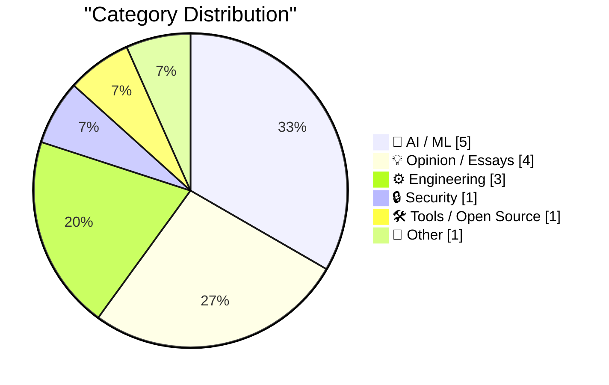
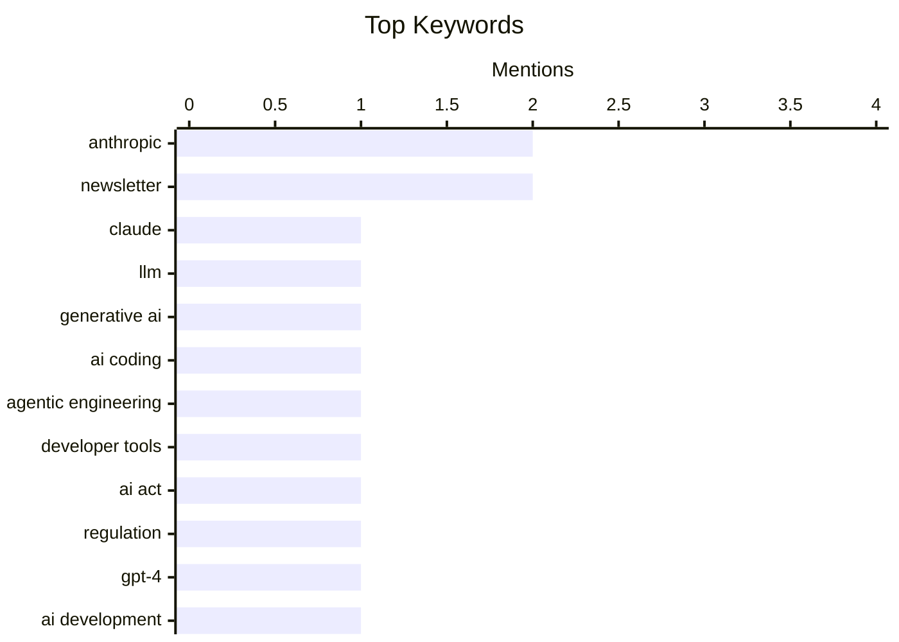

## Today's Highlights
Today's tech highlights reveal an accelerating AI revolution, with events like Code w/ Claude 2026 showcasing relentless progress and the emergence of 'agentic' and 'vibe coding' transforming development practices. This rapid evolution is creating a fundamental tension between the speed of AI innovation and the need for legitimate, structured engineering. The shift challenges traditional platforms and prompts a re-evaluation of how software is built in this new era.
---
## Must Read Today
1. **Live blog: Code w/ Claude 2026**
[Live blog: Code w/ Claude 2026](https://simonwillison.net/2026/May/6/code-w-claude-2026/#atom-everything) — simonwillison.net · 22h ago · 🤖 AI / ML
> This article is a live blog from Anthropic's "Code w/ Claude 2026" event, detailing the morning keynote sessions. It covers discussions around AI, generative AI, LLMs, Anthropic, and specifically Claude's capabilities in coding. The blog likely captures real-time announcements, feature updates, and use cases presented at the conference. The author provides immediate insights into significant developments concerning Claude's application in software development. The main takeaway is a direct, in-the-moment account of key information from a major AI developer event.
💡 **Why read it**: It offers a live, immediate perspective on the latest developments and announcements regarding Anthropic's Claude LLM for coding, directly from a key industry event.
🏷️ Claude, LLM, Generative AI, Anthropic
2. **Vibe coding and agentic engineering are getting closer than I'd like**
[Vibe coding and agentic engineering are getting closer than I'd like](https://simonwillison.net/2026/May/6/vibe-coding-and-agentic-engineering/#atom-everything) — simonwillison.net · 23h ago · 🤖 AI / ML
> This article discusses the unsettling convergence of "vibe coding" (intuitive, less structured coding) and "agentic engineering" (AI-driven, autonomous code generation). Based on insights from a podcast, the author realizes these two approaches are merging in his own work with AI coding tools. This convergence suggests a future where AI agents increasingly handle detailed implementation, allowing developers to focus on higher-level conceptual guidance. The main takeaway is a thought-provoking reflection on the evolving paradigm of AI-assisted coding and its implications for developer workflows.
💡 **Why read it**: It provides a thought-provoking perspective on the evolving relationship between human intuition ('vibe coding') and AI autonomy ('agentic engineering') in software development.
🏷️ AI coding, Agentic engineering, Developer tools
3. **The war between fast and legitimate is here**
[The war between fast and legitimate is here](https://www.joanwestenberg.com/the-war-between-fast-and-legitimate-is-here/) — joanwestenberg.com · 12h ago · 🤖 AI / ML
> This article highlights the fundamental conflict between the rapid pace of AI innovation and the slow process of regulatory oversight. It contrasts the European Union's four-year drafting of the AI Act with OpenAI's release of GPT-4 to 100 million users in just two months. By the time regulators defined "high-risk" systems, the underlying AI technologies had already evolved significantly, rendering definitions potentially obsolete. This rapid technological advancement creates a constant challenge for governance, as regulatory frameworks struggle to keep pace. The core conclusion is that the speed of AI progress is fundamentally at odds with traditional legislative timelines, creating a "war" between innovation and regulation.
💡 **Why read it**: It critically examines the growing chasm between the rapid development of AI technologies and the slow, often outdated, pace of governmental regulation.
🏷️ AI Act, Regulation, GPT-4, AI Development
---
## Data Overview
| Sources Scanned | Articles Fetched | Time Window | Selected |
|:---:|:---:|:---:|:---:|
| 87/92 | 2498 -> 19 | 24h | **15** |
### Category Distribution

### Top Keywords

<details>
<summary>Plain Text Keyword Chart (Terminal Friendly)</summary>
```
anthropic           │ ████████████████████ 2
newsletter          │ ████████████████████ 2
claude              │ ██████████░░░░░░░░░░ 1
llm                 │ ██████████░░░░░░░░░░ 1
generative ai       │ ██████████░░░░░░░░░░ 1
ai coding           │ ██████████░░░░░░░░░░ 1
agentic engineering │ ██████████░░░░░░░░░░ 1
developer tools     │ ██████████░░░░░░░░░░ 1
ai act              │ ██████████░░░░░░░░░░ 1
regulation          │ ██████████░░░░░░░░░░ 1
```
</details>
### Topic Tags
**anthropic**(2) · **newsletter**(2) · **claude**(1) · llm(1) · generative ai(1) · ai coding(1) · agentic engineering(1) · developer tools(1) · ai act(1) · regulation(1) · gpt-4(1) · ai development(1) · ai training(1) · ai progress(1) · machine learning(1) · research(1) · sqlalchemy(1) · python(1) · asynchronous(1) · database(1)
---
## AI / ML
### 1. Live blog: Code w/ Claude 2026
[Live blog: Code w/ Claude 2026](https://simonwillison.net/2026/May/6/code-w-claude-2026/#atom-everything) — **simonwillison.net** · 22h ago · ⭐ 26/30
> This article is a live blog from Anthropic's "Code w/ Claude 2026" event, detailing the morning keynote sessions. It covers discussions around AI, generative AI, LLMs, Anthropic, and specifically Claude's capabilities in coding. The blog likely captures real-time announcements, feature updates, and use cases presented at the conference. The author provides immediate insights into significant developments concerning Claude's application in software development. The main takeaway is a direct, in-the-moment account of key information from a major AI developer event.
🏷️ Claude, LLM, Generative AI, Anthropic
---
### 2. Vibe coding and agentic engineering are getting closer than I'd like
[Vibe coding and agentic engineering are getting closer than I'd like](https://simonwillison.net/2026/May/6/vibe-coding-and-agentic-engineering/#atom-everything) — **simonwillison.net** · 23h ago · ⭐ 26/30
> This article discusses the unsettling convergence of "vibe coding" (intuitive, less structured coding) and "agentic engineering" (AI-driven, autonomous code generation). Based on insights from a podcast, the author realizes these two approaches are merging in his own work with AI coding tools. This convergence suggests a future where AI agents increasingly handle detailed implementation, allowing developers to focus on higher-level conceptual guidance. The main takeaway is a thought-provoking reflection on the evolving paradigm of AI-assisted coding and its implications for developer workflows.
🏷️ AI coding, Agentic engineering, Developer tools
---
### 3. The war between fast and legitimate is here
[The war between fast and legitimate is here](https://www.joanwestenberg.com/the-war-between-fast-and-legitimate-is-here/) — **joanwestenberg.com** · 12h ago · ⭐ 26/30
> This article highlights the fundamental conflict between the rapid pace of AI innovation and the slow process of regulatory oversight. It contrasts the European Union's four-year drafting of the AI Act with OpenAI's release of GPT-4 to 100 million users in just two months. By the time regulators defined "high-risk" systems, the underlying AI technologies had already evolved significantly, rendering definitions potentially obsolete. This rapid technological advancement creates a constant challenge for governance, as regulatory frameworks struggle to keep pace. The core conclusion is that the speed of AI progress is fundamentally at odds with traditional legislative timelines, creating a "war" between innovation and regulation.
🏷️ AI Act, Regulation, GPT-4, AI Development
---
### 4. Why hasn't longer-horizon training slowed AI progress?
[Why hasn't longer-horizon training slowed AI progress?](https://seangoedecke.com/why-hasnt-longer-horizon-training-slowed-ai-progress/) — **seangoedecke.com** · 14h ago · ⭐ 25/30
> This article addresses Dwarkesh Patel's challenge question: why AI progress hasn't slowed down despite the increasing complexity and longer training horizons. The author explores potential reasons, suggesting that advancements in hardware, algorithmic efficiency, and data availability might be compensating for increased computational demands. It implies that current methods or unforeseen breakthroughs are effectively mitigating the expected slowdown from more extensive training. The core argument is that various factors are collectively enabling sustained AI progress, defying the intuitive expectation that longer training times would inherently decelerate development.
🏷️ AI training, AI progress, Machine learning, Research
---
### 5. Claris CEO Ryan McCann on FileMaker in the Age of Agentic Coding
[Claris CEO Ryan McCann on FileMaker in the Age of Agentic Coding](https://www.claris.com/blog/2026/how-claris-is-building-for-what-comes-next) — **daringfireball.net** · 18h ago · ⭐ 22/30
> This article references a blog post by Claris CEO Ryan McCann, discussing FileMaker's role in the era of "agentic coding" and AI-generated applications. McCann highlights that AI-generated apps still require fundamental infrastructure like databases, user authentication, role-based permissions, audit logging, backup, and recovery. He argues that Claris FileMaker provides a robust platform to address these essential backend requirements for AI-generated apps, offering deployment, security, and management solutions. The core message is that FileMaker remains relevant by providing the necessary infrastructure for applications created by AI agents.
🏷️ FileMaker, Agentic coding, AI applications, Claris
---
## Opinion / Essays
### 6. The Intolerable Hypocrisy of Cyberlibertarianism
[The Intolerable Hypocrisy of Cyberlibertarianism](https://matduggan.com/the-intolerable-hypocrisy-of-cyberlibertarianism/) — **matduggan.com** · 4h ago · ⭐ 22/30
> This article critiques the "intolerable hypocrisy of cyberlibertarianism," contrasting the idealized vision of a free internet with its current realities. The author, having experienced the pre-Internet era, acknowledges the benefits of the internet while challenging the notion that it inherently fosters pure liberty. It argues that many self-proclaimed cyberlibertarians overlook or contribute to issues like surveillance, corporate control, and the erosion of privacy, which contradict their stated ideals. The core argument is that the utopian promises of cyberlibertarianism often clash with the practical and often problematic evolution of the digital world. The article challenges readers to critically assess the true state of internet freedom.
🏷️ Cyberlibertarianism, Internet, Philosophy, Ethics
---
### 7. Luca Maestri Runs the Cafeteria
[Luca Maestri Runs the Cafeteria](https://www.apple.com/leadership/luca-maestri/) — **daringfireball.net** · 18h ago · ⭐ 19/30
> Apple announced a significant leadership transition in its finance department, with Chief Financial Officer Luca Maestri stepping down from his role on January 1, 2025. Maestri will remain with Apple, leading the Corporate Services teams, including information systems and technology, information security, and real estate and development, reporting directly to CEO Tim Cook. As part of a planned succession, Kevan Parekh, Apple’s Vice President of Financial Planning and Analysis, will assume the position of Chief Financial Officer. This move ensures a smooth transition while retaining Maestri's expertise in critical operational areas.
🏷️ Apple, CFO, Executive change, Corporate services
---
### 8. Free as in Tribbles
[Free as in Tribbles](https://nesbitt.io/2026/05/07/free-as-in-tribbles.html) — **nesbitt.io** · 4h ago · ⭐ 19/30
> This article introduces 'free as in Tribbles' as a new metaphor, building upon the concept of 'free as in puppy' to describe the hidden costs of seemingly free offerings. While 'free as in puppy' implies ongoing expenses, 'free as in Tribbles' likely suggests that some 'free' things not only incur costs but also multiply uncontrollably, leading to overwhelming and exponential problems. The metaphor aims to capture situations where initial freedom results in unforeseen and escalating management challenges. It highlights the potential for 'free' resources or services to become unmanageable burdens due to their inherent growth or complexity.
🏷️ Open Source, Free Software, Metaphor, Licensing
---
### 9. Am I Meant To Be Impressed?
[Am I Meant To Be Impressed?](https://www.wheresyoured.at/am-i-meant-to-be-impressed/) — **wheresyoured.at** · 22h ago · ⭐ 19/30
> This article promotes a premium newsletter service designed for in-depth technical analysis. Subscribers receive a weekly newsletter, typically ranging from 5,000 to 18,000 words, offering vast and detailed analyses. The content focuses on major technology companies such as NVIDIA, Anthropic, and OpenAI. The subscription is priced at $70 annually or $7 per month. This service aims to provide comprehensive insights into leading firms in the AI and tech sectors for a dedicated audience.
🏷️ Newsletter, NVIDIA, Anthropic, OpenAI
---
## Engineering
### 10. SQLAlchemy 2 In Practice - Chapter 7: Asynchronous SQLAlchemy
[SQLAlchemy 2 In Practice - Chapter 7: Asynchronous SQLAlchemy](https://blog.miguelgrinberg.com/post/sqlalchemy-2-in-practice---chapter-7-asynchronous-sqlalchemy) — **miguelgrinberg.com** · 16h ago · ⭐ 24/30
> This article is the seventh chapter of the "SQLAlchemy 2 in Practice" book, focusing on asynchronous programming with SQLAlchemy. It details how SQLAlchemy, starting with release 1.4, integrates with Python's `asyncio` package to support asynchronous database operations. The chapter likely covers specific syntax, best practices, and examples for implementing non-blocking database interactions within `asyncio` applications. It aims to guide developers in leveraging SQLAlchemy 2's asynchronous capabilities for improved performance and responsiveness. The primary goal is to enable efficient, concurrent database access in modern Python applications.
🏷️ SQLAlchemy, Python, Asynchronous, Database
---
### 11. Unified config files
[Unified config files](https://www.johndcook.com/blog/2026/05/06/unified-config-files/) — **johndcook.com** · 21h ago · ⭐ 20/30
> This article discusses the practice of maintaining a consistent work environment across multiple computers by using unified configuration files. The author emphasizes remapping keys to ensure consistent functionality across different machines, minimizing "unimportant" differences. This approach aims to streamline workflows and reduce cognitive load when switching between diverse computing environments. The core idea is to leverage shared configuration to create a seamless and predictable user experience, despite underlying system variations. This method enhances productivity by standardizing common interactions.
🏷️ Configuration, Work environment, Productivity, Dotfiles
---
### 12. New Logic for Programmers (and the future of this newsletter)
[New Logic for Programmers (and the future of this newsletter)](https://buttondown.com/hillelwayne/archive/new-logic-for-programmers-and-the-future-of-this/) — **buttondown.com/hillelwayne** · 20h ago · ⭐ 20/30
> This article announces the release of version 0.14 of "Logic for Programmers," a book focused on logic concepts for software developers. This update primarily features layout, copyediting, and technical editing changes, with full details available in the GitHub CHANGELOG. The author also mentions starting test prints of the book, indicating progress towards a physical release. Additionally, the article touches upon the future direction of the associated newsletter, suggesting upcoming content or format changes. The main takeaway is the continued development and refinement of a resource aimed at improving programmers' logical reasoning skills.
🏷️ Logic, Programmers, Formal Methods, Newsletter
---
## Security
### 13. Pluralistic: Bubbles are REALLY evil (07 May 2026)
[Pluralistic: Bubbles are REALLY evil (07 May 2026)](https://pluralistic.net/2026/05/07/dump-the-pumpers/) — **pluralistic.net** · 5h ago · ⭐ 22/30
> This article, part of Cory Doctorow's "Pluralistic" series, focuses on the theme that "Bubbles are REALLY evil," drawing parallels to figures like Bernie Ebbers. It critiques economic bubbles and their negative consequences, linking them to broader issues of corporate malfeasance or systemic failures. The article also includes a collection of diverse links under categories like "Delights to delectate" and "Object permanence," covering topics from Mozilla's stance on wiretaps to internet regulations and worker rights. The overarching message is a critical examination of various societal and technological issues, often with an anti-corporate or pro-consumer rights stance.
🏷️ Privacy, Wiretaps, Security, Internet policy
---
## Tools / Open Source
### 14. Monitor your devices with LibreNMS on FreeBSD
[Monitor your devices with LibreNMS on FreeBSD](https://it-notes.dragas.net/2026/05/07/monitor-your-services-with-librenms-on-freebsd/) — **it-notes.dragas.net** · 3h ago · ⭐ 18/30
> This article advocates for using LibreNMS as a robust and low-maintenance solution for monitoring IT infrastructure, specifically on FreeBSD. LibreNMS is highlighted as a faithful companion that quietly handles the monitoring of servers, devices, and services, providing essential alerts, data, and graphs. It is presented as a solid alternative to heavier monitoring solutions like Zabbix, requiring less overhead while still delivering comprehensive oversight. The focus is on its effective deployment and benefits within a FreeBSD environment, ensuring reliable system surveillance.
🏷️ LibreNMS, Monitoring, FreeBSD, System Administration
---
## Other
### 15. Triangular analog of the squircle
[Triangular analog of the squircle](https://www.johndcook.com/blog/2026/05/06/triangular-analog-of-the-squircle/) — **johndcook.com** · 18h ago · ⭐ 17/30
> This article explores the geometric concept of creating a 'triangular analog' to the squircle, prompted by a reader's comment. The author clarifies that a squircle is not merely a square with rounded corners, but rather a shape with continuously curved sides, where the curvature is most pronounced at the corners. The core problem is to define a direct equivalent that applies this specific curvature characteristic to a triangle. This mathematical inquiry aims to conceptualize a new geometric form based on the unique properties of the squircle.
🏷️ Geometry, Squircle, Mathematics, Curves
---
*Generated at 2026-05-07 14:01 | Scanned 87 sources -> 2498 articles -> selected 15*
*Based on the [Hacker News Popularity Contest 2025](https://refactoringenglish.com/tools/hn-popularity/) RSS source list recommended by [Andrej Karpathy](https://x.com/karpathy)*
*Produced by Dongdianr AI. Follow the same-name WeChat public account for more AI practical tips 💡*
