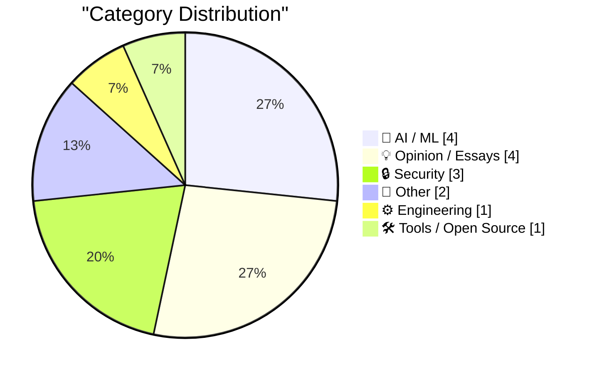
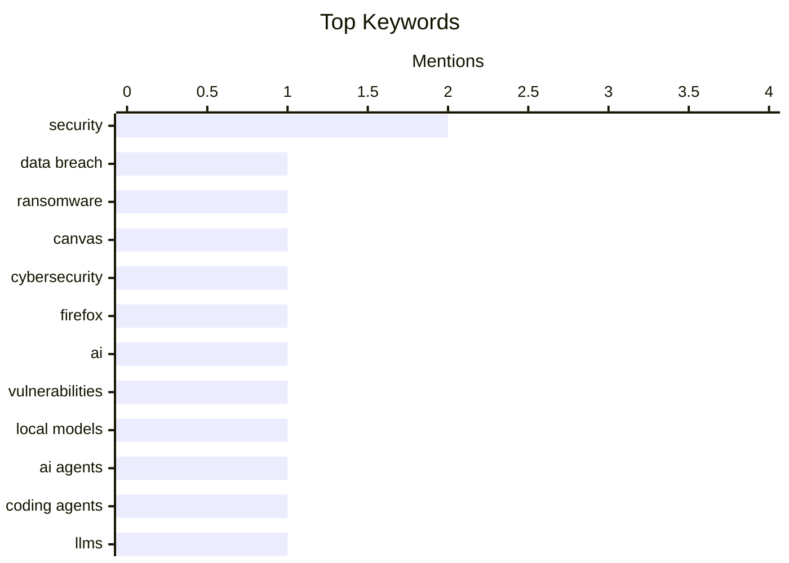

## Today's Highlights
Today's tech news highlights a dual focus on robust cybersecurity and the rapidly evolving AI landscape. Major education platforms are grappling with data breaches and the critical risks of unmaintained dependencies, while Mozilla proactively leverages AI to harden its browser security. Meanwhile, the AI sector sees significant infrastructure partnerships and continuous model advancements, even as financial sustainability remains a key challenge for major players and a push for competitive local models gains traction.
---
## Must Read Today
1. **Canvas Breach Disrupts Schools & Colleges Nationwide**
[Canvas Breach Disrupts Schools & Colleges Nationwide](https://krebsonsecurity.com/2026/05/canvas-breach-disrupts-schools-colleges-nationwide/) — krebsonsecurity.com · 11h ago · 🔒 Security
> The widely-used education technology platform Canvas is currently facing an ongoing data extortion attack, disrupting classes nationwide. A cybercrime group defaced the login page with a ransom demand, threatening to leak data from 275 million students and faculty. This attack impacts nearly 9,000 educational institutions across the United States. The incident highlights the severe impact of cyberattacks on critical educational infrastructure and the vast scale of potential data compromise.
💡 **Why read it**: This article is worth reading to understand the immediate impact and scale of a significant cyberattack on a critical educational technology platform.
🏷️ data breach, ransomware, Canvas, cybersecurity
2. **Behind the Scenes Hardening Firefox with Claude Mythos Preview**
[Behind the Scenes Hardening Firefox with Claude Mythos Preview](https://simonwillison.net/2026/May/7/firefox-claude-mythos/#atom-everything) — simonwillison.net · 20h ago · 🔒 Security
> Mozilla significantly enhanced Firefox's security by leveraging access to the Claude Mythos preview to identify vulnerabilities. This advanced AI tool helped locate and fix hundreds of security bugs, marking a substantial improvement in the quality of AI-generated security reports. The successful application of Claude Mythos demonstrates the potential of AI in efficiently identifying complex security flaws in large codebases. This approach allowed Mozilla to harden Firefox more effectively than with previous AI methods.
💡 **Why read it**: This article is worth reading to see a practical, successful application of advanced AI in identifying and fixing hundreds of security vulnerabilities in a major open-source project like Firefox.
🏷️ Firefox, security, AI, vulnerabilities
3. **Pushing Local Models With Focus And Polish**
[Pushing Local Models With Focus And Polish](https://lucumr.pocoo.org/2026/5/8/local-models/) — lucumr.pocoo.org · 14h ago · 🤖 AI / ML
> The author expresses a strong desire for local AI models to be competitive enough for practical daily use, avoiding immediate switch-back to hosted APIs. The core issue is the current lack of polish and practical usability in local models, which hinders experimentation for average developers. The article advocates for focusing on user experience and performance to make local models a viable alternative. Achieving practical local AI model usability requires significant effort in refining their performance and user experience to empower broader developer experimentation.
💡 **Why read it**: This article is worth reading for developers interested in the future of local AI models and the practical challenges they face in becoming competitive with hosted APIs.
🏷️ Local models, AI agents, Coding agents, LLMs
---
## Data Overview
| Sources Scanned | Articles Fetched | Time Window | Selected |
|:---:|:---:|:---:|:---:|
| 88/92 | 2523 -> 19 | 24h | **15** |
### Category Distribution

### Top Keywords

<details>
<summary>Plain Text Keyword Chart (Terminal Friendly)</summary>
```
security        │ ████████████████████ 2
data breach     │ ██████████░░░░░░░░░░ 1
ransomware      │ ██████████░░░░░░░░░░ 1
canvas          │ ██████████░░░░░░░░░░ 1
cybersecurity   │ ██████████░░░░░░░░░░ 1
firefox         │ ██████████░░░░░░░░░░ 1
ai              │ ██████████░░░░░░░░░░ 1
vulnerabilities │ ██████████░░░░░░░░░░ 1
local models    │ ██████████░░░░░░░░░░ 1
ai agents       │ ██████████░░░░░░░░░░ 1
```
</details>
### Topic Tags
**security**(2) · **data breach**(1) · **ransomware**(1) · canvas(1) · cybersecurity(1) · firefox(1) · ai(1) · vulnerabilities(1) · local models(1) · ai agents(1) · coding agents(1) · llms(1) · openai(1) · business model(1) · ai industry(1) · funding(1) · dependencies(1) · supply chain(1) · maintenance(1) · anthropic(1)
---
## AI / ML
### 1. Pushing Local Models With Focus And Polish
[Pushing Local Models With Focus And Polish](https://lucumr.pocoo.org/2026/5/8/local-models/) — **lucumr.pocoo.org** · 14h ago · ⭐ 26/30
> The author expresses a strong desire for local AI models to be competitive enough for practical daily use, avoiding immediate switch-back to hosted APIs. The core issue is the current lack of polish and practical usability in local models, which hinders experimentation for average developers. The article advocates for focusing on user experience and performance to make local models a viable alternative. Achieving practical local AI model usability requires significant effort in refining their performance and user experience to empower broader developer experimentation.
🏷️ Local models, AI agents, Coding agents, LLMs
---
### 2. Breaking news: “they hadn’t figured out how OpenAI would pay for it”
[Breaking news: “they hadn’t figured out how OpenAI would pay for it”](https://garymarcus.substack.com/p/breaking-news-they-hadnt-figured) — **garymarcus.substack.com** · 16h ago · ⭐ 26/30
> This article highlights a critical financial uncertainty surrounding OpenAI's operations. The core issue revealed is that "they hadn’t figured out how OpenAI would pay for it," implying a lack of a sustainable business model or funding strategy for their ambitious endeavors. This suggests potential long-term financial instability despite technological advancements. This brief note points to significant underlying financial challenges at OpenAI, raising questions about the sustainability of their current operational model.
🏷️ OpenAI, Business model, AI industry, Funding
---
### 3. Notes on the xAI/Anthropic data center deal
[Notes on the xAI/Anthropic data center deal](https://simonwillison.net/2026/May/7/xai-anthropic/#atom-everything) — **simonwillison.net** · 20h ago · ⭐ 24/30
> The article discusses a significant new partnership in the competitive AI data center landscape between Anthropic and xAI. Anthropic has struck a deal with SpaceX/xAI to utilize "all of the capacity of their Colossus data center." This agreement, mentioned during the Code w/ Claude event, involves a data center notable for its "gas turbines" and "air pollution permits," suggesting a massive and potentially environmentally impactful infrastructure. This strategic partnership provides Anthropic with substantial compute resources from xAI's Colossus data center, indicating a major move to scale AI model training and inference capabilities.
🏷️ Anthropic, xAI, data center, AI infrastructure
---
### 4. llm-gemini 0.31
[llm-gemini 0.31](https://simonwillison.net/2026/May/7/llm-gemini/#atom-everything) — **simonwillison.net** · 18h ago · ⭐ 23/30
> The article announces the release of `llm-gemini` version `0.31`, focusing on an update to a Google Gemini model. The key update is that `gemini-3.1-flash-lite` is no longer a preview model and is now generally available. This follows a previous write-up on the `Gemini 3.1 Flash-Lite Preview model` from March 3rd. The `llm-gemini 0.31` release signifies the general availability of the `gemini-3.1-flash-lite` model, making it a stable option for developers using the `llm-gemini` tool.
🏷️ LLM, Gemini, Python library, release
---
## Opinion / Essays
### 5. Notes on incidents
[Notes on incidents](https://seangoedecke.com/notes-on-incidents/) — **seangoedecke.com** · 14h ago · ⭐ 21/30
> The article challenges common perceptions of incident management, particularly the idea of heroic, rapid fixes. It argues that most incidents are "boring," involving significant waiting periods for investigations, deployments, or external teams. Furthermore, a majority of incidents tend to resolve on their own, often without a single "heroic" intervention. Effective incident management should focus less on heroic individual actions and more on structured processes, patience, and understanding that many issues self-resolve or require collaborative, time-consuming efforts.
🏷️ incident response, SRE, DevOps
---
### 6. How Long Do We Wait for New Inventions?
[How Long Do We Wait for New Inventions?](https://www.construction-physics.com/p/how-long-do-we-wait-for-new-inventions) — **construction-physics.com** · 22h ago · ⭐ 18/30
> The article investigates the typical time lag between the conception of a new invention and its widespread adoption or impact. It argues that the waiting period for new inventions is "mostly not very long," challenging the perception of lengthy delays. This implies that the innovation cycle from idea to practical application or market presence is often shorter than commonly assumed. The article concludes that the time from invention to impact is generally brief, suggesting a dynamic and relatively rapid pace of technological dissemination.
🏷️ Innovation, Inventions, Adoption, Technology trends
---
### 7. The Greatest Match Cut in Cinematic History, Improved by Amazon Prime
[The Greatest Match Cut in Cinematic History, Improved by Amazon Prime](https://bsky.app/profile/gethill.bsky.social/post/3ml6fyfv7kc2l) — **daringfireball.net** · 22h ago · ⭐ 16/30
> The article highlights how Amazon Prime's automated ad insertion algorithm disrupted the iconic match cut in "2001: A Space Odyssey," specifically the bone-to-spaceship transition. A Febreze ad was inserted precisely at this critical cinematic moment, likely due to an automated scene marker, thereby undermining the artistic intent. This contrasts sharply with the historical Cerveza Cristal campaign in Chile, which ingeniously integrated beer ads directly into Star Wars broadcasts with thoughtful, context-aware placement. The incident underscores the detrimental impact of unintelligent, automated ad placement on artistic content. It emphasizes the critical need for human oversight or sophisticated, context-aware algorithms in media distribution.
🏷️ Amazon Prime, streaming, ads, user experience
---
### 8. The Bold Ones Win
[The Bold Ones Win](https://feed.tedium.co/link/15204/17336568/ted-turner-bold-ceo-bets) — **tedium.co** · 13h ago · ⭐ 14/30
> The article reflects on the enduring legacy of Ted Turner, described as a "patron saint of Tedium," and draws parallels to a contemporary entrepreneur making a similarly audacious business bet. It posits that Turner's significant success was largely attributable to his "bold CEO bets," implying a strategic approach characterized by high-risk, high-reward entrepreneurialism. The piece suggests that studying Turner's career offers valuable insights into successful, audacious business strategies that remain relevant in today's economic landscape. The core takeaway is that bold, Turner-esque entrepreneurial decisions can still lead to substantial success, providing crucial lessons for modern business leaders navigating competitive markets.
🏷️ Entrepreneurship, Business strategy, Risk-taking
---
## Security
### 9. Canvas Breach Disrupts Schools & Colleges Nationwide
[Canvas Breach Disrupts Schools & Colleges Nationwide](https://krebsonsecurity.com/2026/05/canvas-breach-disrupts-schools-colleges-nationwide/) — **krebsonsecurity.com** · 11h ago · ⭐ 29/30
> The widely-used education technology platform Canvas is currently facing an ongoing data extortion attack, disrupting classes nationwide. A cybercrime group defaced the login page with a ransom demand, threatening to leak data from 275 million students and faculty. This attack impacts nearly 9,000 educational institutions across the United States. The incident highlights the severe impact of cyberattacks on critical educational infrastructure and the vast scale of potential data compromise.
🏷️ data breach, ransomware, Canvas, cybersecurity
---
### 10. Behind the Scenes Hardening Firefox with Claude Mythos Preview
[Behind the Scenes Hardening Firefox with Claude Mythos Preview](https://simonwillison.net/2026/May/7/firefox-claude-mythos/#atom-everything) — **simonwillison.net** · 20h ago · ⭐ 27/30
> Mozilla significantly enhanced Firefox's security by leveraging access to the Claude Mythos preview to identify vulnerabilities. This advanced AI tool helped locate and fix hundreds of security bugs, marking a substantial improvement in the quality of AI-generated security reports. The successful application of Claude Mythos demonstrates the potential of AI in efficiently identifying complex security flaws in large codebases. This approach allowed Mozilla to harden Firefox more effectively than with previous AI methods.
🏷️ Firefox, security, AI, vulnerabilities
---
### 11. Weekend at Bernie’s
[Weekend at Bernie’s](https://nesbitt.io/2026/05/08/weekend-at-bernies.html) — **nesbitt.io** · 4h ago · ⭐ 26/30
> The article implicitly addresses the critical risk of relying on unmaintained or 'dead' dependencies in software projects. The title's metaphor, "Which of your dependencies are wearing sunglasses," refers to components that appear active but are effectively abandoned, posing security and stability risks. It encourages developers to audit their dependency trees for such issues. Developers must actively scrutinize their project dependencies to identify and mitigate risks from unmaintained components that could compromise system integrity.
🏷️ Dependencies, Supply chain, Security, Maintenance
---
## Other
### 12. Pluralistic: Lee Lai's "Cannon" (08 May 2026)
[Pluralistic: Lee Lai's "Cannon" (08 May 2026)](https://pluralistic.net/2026/05/08/gung-gung/) — **pluralistic.net** · 1h ago · ⭐ 16/30
> This Pluralistic article serves as a daily link aggregation, with a primary focus on Lee Lai's graphic novel "Cannon." The graphic novel is lauded as a "beautiful, subtle, long-lingering tale of duty, sex, and working for a shitty restaurant boss." Beyond this review, the post curates a diverse collection of links under the heading "Object permanence," covering topics such as Ebay's use of newspaper classifieds, the Chuck Tingle vs. Sad Puppies controversy, the FBI vs. TOR debate, and scams involving re-used COVID nose-swabs. The article thus provides both a specific cultural recommendation and a broad overview of current events and tech-related discussions.
🏷️ link digest, culture, commentary
---
### 13. Smoothed polygons
[Smoothed polygons](https://www.johndcook.com/blog/2026/05/07/smoothed-polygons/) — **johndcook.com** · 19h ago · ⭐ 16/30
> The article builds upon previous work concerning the construction of a triangular analog of the squircle, which is defined as the unit circle in the p-norm, typically with p around 4. The p-norm concept dictates that p=2 yields a Euclidean circle, while the limit as p → ∞ results in a Euclidean square. This post specifically introduces three functions, Li(x, y), whose level sets are utilized to form these smoothed polygons. The method generalizes the squircle concept, applying the smoothing technique to other geometric forms beyond the initial triangular shape. This mathematical approach provides a precise way to generate various smoothed polygonal boundaries.
🏷️ Geometry, Polygons, Mathematics, p-norm
---
## Engineering
### 14. Steering Zig Fmt
[Steering Zig Fmt](https://matklad.github.io/2026/05/08/steering-zig-fmt.html) — **matklad.github.io** · 14h ago · ⭐ 21/30
> The article provides guidance on effectively using `zig fmt`, the Zig language's code formatter. It offers two specific tips for maximizing the utility of `zig fmt`, relevant for both Zig developers and those involved in implementing code formatters. These tips suggest insights into configuration or usage patterns that enhance formatting consistency and developer workflow. Mastering `zig fmt` through specific techniques can significantly improve code consistency and developer experience in Zig projects, and offers lessons for formatter implementers.
🏷️ Zig, Code formatter, zig fmt, Programming
---
## Tools / Open Source
### 15. Big Words
[Big Words](https://simonwillison.net/2026/May/7/big-words/#atom-everything) — **simonwillison.net** · 19h ago · ⭐ 16/30
> Simon Willison addressed the challenge of displaying text as a slide within his "vibe coded macOS presentations tool," which exclusively accepts URLs. He developed a quick web page, "Big Words" (available at `https://tools.simonwillison.net/big-words`), designed to accept query string arguments. This page then renders the provided text as a simple, URL-accessible slide, effectively converting dynamic text input into a presentation element. The solution involved a specific pull request (`https://github.com/simonw/tools/pull/279`) to integrate this functionality. This approach demonstrates a practical, URL-driven method for incorporating dynamic content into presentation tools with specific input constraints.
🏷️ macOS, presentation tool, utility
---
*Generated at 2026-05-08 14:01 | Scanned 88 sources -> 2523 articles -> selected 15*
*Based on the [Hacker News Popularity Contest 2025](https://refactoringenglish.com/tools/hn-popularity/) RSS source list recommended by [Andrej Karpathy](https://x.com/karpathy)*
*Produced by Dongdianr AI. Follow the same-name WeChat public account for more AI practical tips 💡*
