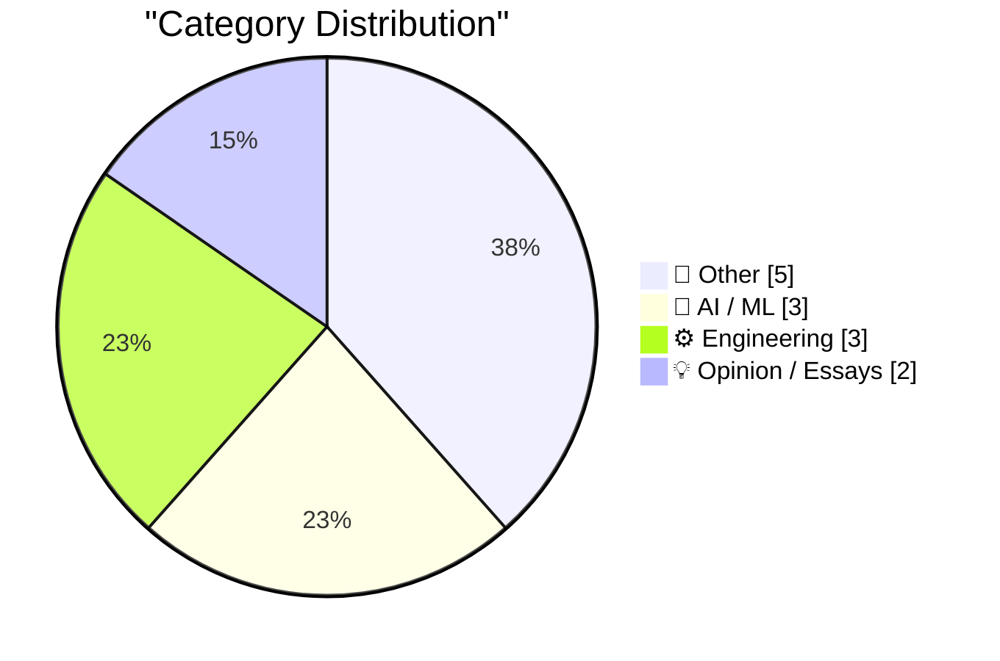
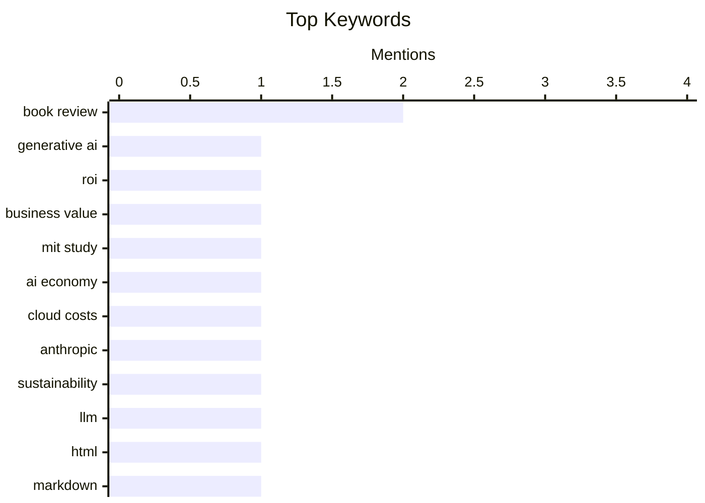

## Today's Highlights
Today's tech news highlights a critical re-evaluation of the generative AI landscape, with concerns surfacing about its unsustainable financial models and overstated return on investment. Simultaneously, the engineering world is abuzz with discussions on refining fundamental software design, from advocating for specific output formats for large language models to challenging established practices in web technologies and open-source project evaluation. These insights underscore a push for more practical, sustainable, and well-designed technological solutions across the industry.
---
## Must Read Today
1. **Agents and ROI**
[Agents and ROI](https://garymarcus.substack.com/p/agents-and-roi) — garymarcus.substack.com · 23h ago · 🤖 AI / ML
> This article discusses the often-overstated return on investment (ROI) for generative AI, particularly concerning AI agents, in typical business contexts. It references an MIT study that indicated most businesses are not seeing substantial ROI from their generative AI implementations. This suggests a significant gap between the hype surrounding AI and its tangible financial benefits for many organizations. The core takeaway is a cautionary perspective on the actual economic value and practical applicability of generative AI and agents in the current business landscape.
💡 **Why read it**: It critically examines the real-world financial benefits of generative AI, challenging common assumptions about its immediate ROI for businesses.
🏷️ generative AI, ROI, business value, MIT study
2. **Premium: AI's Circular Psychosis**
[Premium: AI's Circular Psychosis](https://www.wheresyoured.at/premium-ais-circular-psychosis/) — wheresyoured.at · 23h ago · 🤖 AI / ML
> The article exposes the unsustainable financial model prevalent in the AI industry, termed 'AI's Circular Psychosis.' It highlights how companies like Anthropic face massive cloud computing bills that far exceed their current revenue generation. This forces them to rely heavily on continuous external funding to cover operational costs, creating a dependency loop rather than a self-sustaining business. The main conclusion is that many prominent AI companies operate on a financially fragile model, prioritizing growth and development over immediate profitability.
💡 **Why read it**: It uncovers the precarious financial realities and underlying economic challenges faced by leading AI companies.
🏷️ AI economy, cloud costs, Anthropic, sustainability
3. **Using Claude Code: The Unreasonable Effectiveness of HTML**
[Using Claude Code: The Unreasonable Effectiveness of HTML](https://simonwillison.net/2026/May/8/unreasonable-effectiveness-of-html/#atom-everything) — simonwillison.net · 17h ago · 🤖 AI / ML
> This piece advocates for using HTML over Markdown as an output format when prompting large language models like Claude. Thariq Shihipar from Anthropic's Claude Code team argues that HTML offers superior effectiveness for generating structured and complex outputs. The article provides numerous examples and prompt suggestions, collected on a dedicated site, demonstrating HTML's advantages in precision and flexibility. The main takeaway is that leveraging HTML can significantly enhance the quality and structure of LLM-generated content compared to Markdown.
💡 **Why read it**: It offers practical, expert-backed advice for optimizing LLM output quality by using HTML for structured data generation.
🏷️ LLM, HTML, Markdown, output format
---
## Data Overview
| Sources Scanned | Articles Fetched | Time Window | Selected |
|:---:|:---:|:---:|:---:|
| 87/92 | 2501 -> 13 | 24h | **13** |
### Category Distribution

### Top Keywords

<details>
<summary>Plain Text Keyword Chart (Terminal Friendly)</summary>
```
book review    │ ████████████████████ 2
generative ai  │ ██████████░░░░░░░░░░ 1
roi            │ ██████████░░░░░░░░░░ 1
business value │ ██████████░░░░░░░░░░ 1
mit study      │ ██████████░░░░░░░░░░ 1
ai economy     │ ██████████░░░░░░░░░░ 1
cloud costs    │ ██████████░░░░░░░░░░ 1
anthropic      │ ██████████░░░░░░░░░░ 1
sustainability │ ██████████░░░░░░░░░░ 1
llm            │ ██████████░░░░░░░░░░ 1
```
</details>
### Topic Tags
**book review**(2) · **generative ai**(1) · **roi**(1) · business value(1) · mit study(1) · ai economy(1) · cloud costs(1) · anthropic(1) · sustainability(1) · llm(1) · html(1) · markdown(1) · output format(1) · ai(1) · engineering productivity(1) · workforce(1) · impact(1) · webrtc(1) · network(1) · latency(1)
---
## Other
### 1. Reading List 05/09/2026
[Reading List 05/09/2026](https://www.construction-physics.com/p/reading-list-05092026) — **construction-physics.com** · 1h ago · ⭐ 15/30
> This article is a curated reading list covering diverse topics relevant to construction, technology, and infrastructure. It presents a collection of links and brief descriptions on subjects such as 'trapped buildings,' the concept of 'in-home data centers,' the development of 'cardboard military drones,' and the financial challenges facing 'Brightline’s potential bankruptcy.' The list offers varied insights into emerging trends and issues across different sectors. The main takeaway is a broad overview of current interesting developments and challenges in construction, technology, and related industries.
🏷️ reading list, data centers, drones, construction
---
### 2. David Reich – Why the Bronze Age was an inflection point in human evolution
[David Reich – Why the Bronze Age was an inflection point in human evolution](https://www.dwarkesh.com/p/david-reich-2) — **dwarkesh.com** · 21h ago · ⭐ 14/30
> The article explores the Bronze Age as a critical inflection point in human evolution, emphasizing the continuous and pervasive influence of natural selection. Featuring insights from David Reich, it argues against the notion of natural selection being 'quiescent,' asserting its omnipresence and significant impact during this period. The piece likely details how migrations, cultural shifts, and environmental pressures during the Bronze Age drove substantial genetic and evolutionary changes in human populations. The main takeaway is that the Bronze Age was a dynamic period of intense natural selection, profoundly shaping human genetic diversity and evolution.
🏷️ Bronze Age, human evolution, history
---
### 3. Pluralistic: Trump's fruitless search for a goreable ox (09 May 2026)
[Pluralistic: Trump's fruitless search for a goreable ox (09 May 2026)](https://pluralistic.net/2026/05/09/cossie-livvie-crissie/) — **pluralistic.net** · 1h ago · ⭐ 11/30
> This article is a curated collection of links and commentary, centered around the political and economic tension between supporting billionaires and addressing the cost of living crisis. Titled 'Trump's fruitless search for a goreable ox,' the piece argues that it's impossible to simultaneously satisfy billionaires and effectively combat the cost of living crisis. It includes various links and brief discussions on related topics such as 'Object permanence,' covering subjects like the Panama Papers whistleblower and the PRO Act. The main takeaway is a critical commentary on the inherent conflict between policies favoring extreme wealth accumulation and those aimed at alleviating economic hardship for the general populace.
🏷️ politics, news, cost of living, aggregation
---
### 4. Book Review: The Names by Florence Knapp ★★⯪☆☆
[Book Review: The Names by Florence Knapp ★★⯪☆☆](https://shkspr.mobi/blog/2026/05/book-review-the-names-by-florence-knapp/) — **shkspr.mobi** · 2h ago · ⭐ 11/30
> This article reviews Florence Knapp's novel "The Names," which explores a mother's agonizing decision about whether to name her child after her abusive husband. The book employs a "Sliding Doors" narrative structure, presenting three parallel storylines: one where she uses the name, one where she doesn't, and a third where she makes a compromise. The reviewer praises the novel's excellent narrative structure and beautiful prose, highlighting its unique approach to exploring the consequences of a single choice. However, despite these strengths, the reviewer personally did not enjoy the book due to its distressing amount of domestic violence.
🏷️ book review, fiction, novel
---
### 5. George Orwell's review of Russel's Power: A New Social Analysis
[George Orwell's review of Russel's Power: A New Social Analysis](https://berthub.eu/articles/posts/orwell-review-bertrand-russells-power/) — **berthub.eu** · 17h ago · ⭐ 10/30
> This article highlights the recovery and re-publication of George Orwell's significant review of Bertrand Russell's "Power: A New Social Analysis," which had become inaccessible online. The author, having previously learned much from it, located and restored the review from the Internet Archive. Originally published in The Adelphi in January 1939, the piece is noted as being far more than a typical book review, offering deeper insights. This effort makes a valuable historical document, crucial for understanding Orwell's intellectual engagement with political philosophy, available to a wider audience once more.
🏷️ George Orwell, Bertrand Russell, book review, internet archive
---
## AI / ML
### 6. Agents and ROI
[Agents and ROI](https://garymarcus.substack.com/p/agents-and-roi) — **garymarcus.substack.com** · 23h ago · ⭐ 27/30
> This article discusses the often-overstated return on investment (ROI) for generative AI, particularly concerning AI agents, in typical business contexts. It references an MIT study that indicated most businesses are not seeing substantial ROI from their generative AI implementations. This suggests a significant gap between the hype surrounding AI and its tangible financial benefits for many organizations. The core takeaway is a cautionary perspective on the actual economic value and practical applicability of generative AI and agents in the current business landscape.
🏷️ generative AI, ROI, business value, MIT study
---
### 7. Premium: AI's Circular Psychosis
[Premium: AI's Circular Psychosis](https://www.wheresyoured.at/premium-ais-circular-psychosis/) — **wheresyoured.at** · 23h ago · ⭐ 27/30
> The article exposes the unsustainable financial model prevalent in the AI industry, termed 'AI's Circular Psychosis.' It highlights how companies like Anthropic face massive cloud computing bills that far exceed their current revenue generation. This forces them to rely heavily on continuous external funding to cover operational costs, creating a dependency loop rather than a self-sustaining business. The main conclusion is that many prominent AI companies operate on a financially fragile model, prioritizing growth and development over immediate profitability.
🏷️ AI economy, cloud costs, Anthropic, sustainability
---
### 8. Using Claude Code: The Unreasonable Effectiveness of HTML
[Using Claude Code: The Unreasonable Effectiveness of HTML](https://simonwillison.net/2026/May/8/unreasonable-effectiveness-of-html/#atom-everything) — **simonwillison.net** · 17h ago · ⭐ 26/30
> This piece advocates for using HTML over Markdown as an output format when prompting large language models like Claude. Thariq Shihipar from Anthropic's Claude Code team argues that HTML offers superior effectiveness for generating structured and complex outputs. The article provides numerous examples and prompt suggestions, collected on a dedicated site, demonstrating HTML's advantages in precision and flexibility. The main takeaway is that leveraging HTML can significantly enhance the quality and structure of LLM-generated content compared to Markdown.
🏷️ LLM, HTML, Markdown, output format
---
## Engineering
### 9. Quoting Luke Curley
[Quoting Luke Curley](https://simonwillison.net/2026/May/9/luke-curley/#atom-everything) — **simonwillison.net** · 12h ago · ⭐ 24/30
> This article quotes Luke Curley, who criticizes WebRTC's fundamental design choice to aggressively drop audio packets under poor network conditions. While this strategy aims to maintain low latency for real-time interaction, it frequently results in distorted or incomplete audio during conference calls. Curley argues that users would often prefer a slight delay to receive complete, undistorted audio rather than a real-time but compromised experience. The core takeaway is a challenge to WebRTC's default latency-over-fidelity trade-off, suggesting it often misaligns with user expectations for clear communication.
🏷️ WebRTC, network, latency, real-time
---
### 10. The Mismeasure of Open Source
[The Mismeasure of Open Source](https://nesbitt.io/2026/05/09/the-mismeasure-of-open-source.html) — **nesbitt.io** · 4h ago · ⭐ 23/30
> The article discusses the 'streetlight effect' in evaluating open-source project health, where assessment often focuses on easily measurable but potentially incomplete metrics. It argues that current methods for scoring open-source projects frequently overlook critical, harder-to-quantify aspects like true maintainability, security, or community vitality. This leads to a skewed understanding of a project's real status by prioritizing readily available data over comprehensive analysis. The main takeaway is that a more holistic and nuanced approach is essential for accurately measuring the health and sustainability of open-source projects.
🏷️ open source, project health, metrics, evaluation
---
### 11. I Will Not Add Query Strings to Your URLs
[I Will Not Add Query Strings to Your URLs](https://susam.net/no-query-strings.html) — **susam.net** · 14h ago · ⭐ 20/30
> This article strongly advocates against the use of query strings in URLs, aligning with Chris Morgan's stance on 'banning query strings.' The author views query strings as a 'misfeature' that contributes to 'broken URLs' and complicates web development. Arguments implicitly suggest that query strings hinder caching, create less semantic URLs, and can lead to unexpected behavior or broken links. The main takeaway is a firm recommendation to prioritize clean, semantic URLs without query parameters for improved web design, stability, and user experience.
🏷️ URLs, query strings, web design, architecture
---
## Opinion / Essays
### 12. AI makes weak engineers less harmful
[AI makes weak engineers less harmful](https://seangoedecke.com/ai-makes-weak-engineers-less-harmful/) — **seangoedecke.com** · 14h ago · ⭐ 26/30
> The article addresses the significant productivity disparity in software engineering, where weaker engineers can often be net-negative, creating more problems than they solve. It posits that software engineering ability follows a heavy-tailed distribution, with top engineers vastly outperforming the average. The core argument is that AI tools can mitigate the detrimental impact of less effective engineers by automating tasks, catching errors, and providing guidance. The main takeaway is that AI can serve as a valuable tool to reduce the negative contributions of lower-performing individuals, potentially improving overall team efficiency.
🏷️ AI, engineering productivity, workforce, impact
---
### 13. This Week on The Analog Antiquarian
[This Week on The Analog Antiquarian](https://www.filfre.net/2026/05/this-week-on-the-analog-antiquarian/) — **filfre.net** · 21h ago · ⭐ 3/30
> This post from "The Analog Antiquarian" blog provides a brief update on its publishing schedule. The author announces a temporary hiatus, stating there will be no new article next week due to "much-needed springtime home-and-garden work." While mentioning "Opus 1: The Comedy of Errors," the primary message is the upcoming break. Readers are informed that fresh content, specifically dealing with games, is promised to return in two weeks.
🏷️ personal update, blog, schedule
---
*Generated at 2026-05-09 14:01 | Scanned 87 sources -> 2501 articles -> selected 13*
*Based on the [Hacker News Popularity Contest 2025](https://refactoringenglish.com/tools/hn-popularity/) RSS source list recommended by [Andrej Karpathy](https://x.com/karpathy)*
*Produced by Dongdianr AI. Follow the same-name WeChat public account for more AI practical tips 💡*
