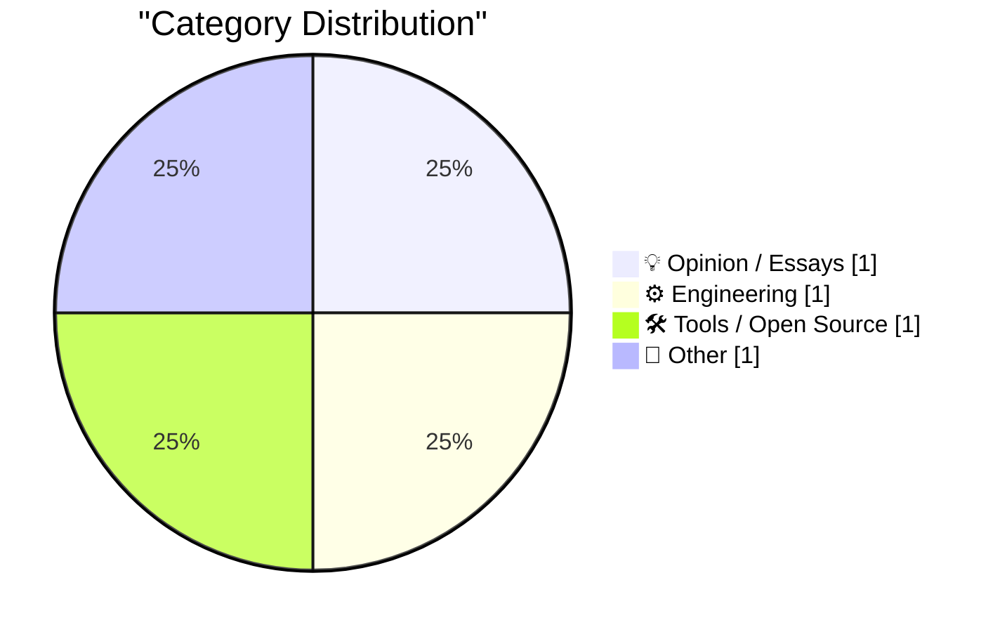
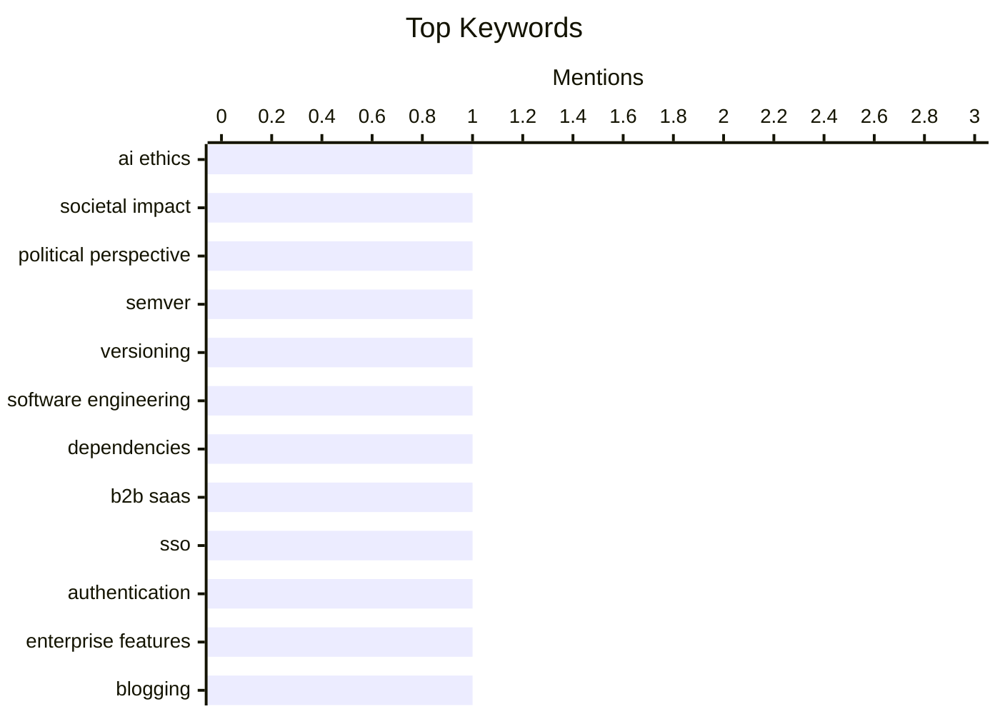

## Today's Highlights
Today's tech insights reveal a dual focus on artificial intelligence. Discussions delve into the political and societal implications of AI, exploring evolving sentiments, including a left-wing perspective. Simultaneously, the rapid expansion of AI companies is fueling demand for robust B2B SaaS infrastructure, with solutions like WorkOS emerging to provide crucial enterprise-grade tooling.
---
## Must Read Today
1. **The left-wing case for AI**
[The left-wing case for AI](https://seangoedecke.com/the-left-wing-case-for-ai/) — seangoedecke.com · 14h ago · 💡 Opinion / Essays
> The article explores the origins of left-wing anti-AI sentiment, arguing it stems partly from a backlash against the 2022 crypto mania and the 2024 pro-Donald-Trump political leanings of many big tech CEOs. It suggests these unrelated events have colored perceptions of AI within left-wing circles. The author implies that if the timing of AI's rise had been different, a significant pro-AI faction could have emerged on the left.
💡 **Why read it**: It offers a unique political and historical perspective on the current societal debate surrounding artificial intelligence, linking anti-AI sentiment to specific socio-political events.
🏷️ AI ethics, societal impact, political perspective
2. **Madame Semver Will See You Now**
[Madame Semver Will See You Now](https://nesbitt.io/2026/05/10/madame-semver-will-see-you-now.html) — nesbitt.io · 4h ago · ⚙️ Engineering
> The provided article content is extremely limited, consisting only of the phrase "The cards do not lie." Therefore, it is impossible to generate a meaningful summary covering a core problem, technical approach, or conclusion related to Semantic Versioning (SemVer) or any other topic.
💡 **Why read it**: The provided article content is insufficient to determine its value or summarize its technical insights.
🏷️ SemVer, versioning, software engineering, dependencies
3. **WorkOS**
[WorkOS](https://workos.com/?utm_source=daringfireball&amp;utm_medium=newsletter&amp;utm_campaign=q22026) — daringfireball.net · 17m ago · 🛠 Tools / Open Source
> This article introduces WorkOS as a solution for B2B SaaS companies, particularly those in AI, needing enterprise-grade authentication and access control features. It highlights the common problem of developers wasting time rebuilding essential infrastructure like SSO, SCIM, and audit logs. WorkOS offers production-ready APIs to integrate these features, allowing development teams to focus on core product innovation. The main takeaway is that WorkOS streamlines the process of adding critical enterprise capabilities, accelerating market readiness for B2B SaaS products.
💡 **Why read it**: It presents a practical solution for B2B SaaS and AI companies to rapidly implement critical enterprise authentication and access control features without diverting developer resources.
🏷️ B2B SaaS, SSO, authentication, enterprise features
---
## Data Overview
| Sources Scanned | Articles Fetched | Time Window | Selected |
|:---:|:---:|:---:|:---:|
| 88/92 | 2527 -> 4 | 24h | **4** |
### Category Distribution

### Top Keywords

<details>
<summary>Plain Text Keyword Chart (Terminal Friendly)</summary>
```
ai ethics             │ ████████████████████ 1
societal impact       │ ████████████████████ 1
political perspective │ ████████████████████ 1
semver                │ ████████████████████ 1
versioning            │ ████████████████████ 1
software engineering  │ ████████████████████ 1
dependencies          │ ████████████████████ 1
b2b saas              │ ████████████████████ 1
sso                   │ ████████████████████ 1
authentication        │ ████████████████████ 1
```
</details>
### Topic Tags
**ai ethics**(1) · **societal impact**(1) · **political perspective**(1) · semver(1) · versioning(1) · software engineering(1) · dependencies(1) · b2b saas(1) · sso(1) · authentication(1) · enterprise features(1) · blogging(1) · rss(1) · content preview(1)
---
## Opinion / Essays
### 1. The left-wing case for AI
[The left-wing case for AI](https://seangoedecke.com/the-left-wing-case-for-ai/) — **seangoedecke.com** · 14h ago · ⭐ 22/30
> The article explores the origins of left-wing anti-AI sentiment, arguing it stems partly from a backlash against the 2022 crypto mania and the 2024 pro-Donald-Trump political leanings of many big tech CEOs. It suggests these unrelated events have colored perceptions of AI within left-wing circles. The author implies that if the timing of AI's rise had been different, a significant pro-AI faction could have emerged on the left.
🏷️ AI ethics, societal impact, political perspective
---
## Engineering
### 2. Madame Semver Will See You Now
[Madame Semver Will See You Now](https://nesbitt.io/2026/05/10/madame-semver-will-see-you-now.html) — **nesbitt.io** · 4h ago · ⭐ 21/30
> The provided article content is extremely limited, consisting only of the phrase "The cards do not lie." Therefore, it is impossible to generate a meaningful summary covering a core problem, technical approach, or conclusion related to Semantic Versioning (SemVer) or any other topic.
🏷️ SemVer, versioning, software engineering, dependencies
---
## Tools / Open Source
### 3. WorkOS
[WorkOS](https://workos.com/?utm_source=daringfireball&amp;utm_medium=newsletter&amp;utm_campaign=q22026) — **daringfireball.net** · 17m ago · ⭐ 18/30
> This article introduces WorkOS as a solution for B2B SaaS companies, particularly those in AI, needing enterprise-grade authentication and access control features. It highlights the common problem of developers wasting time rebuilding essential infrastructure like SSO, SCIM, and audit logs. WorkOS offers production-ready APIs to integrate these features, allowing development teams to focus on core product innovation. The main takeaway is that WorkOS streamlines the process of adding critical enterprise capabilities, accelerating market readiness for B2B SaaS products.
🏷️ B2B SaaS, SSO, authentication, enterprise features
---
## Other
### 4. [RSS Club] A Sneak Preview of Upcoming Posts
[[RSS Club] A Sneak Preview of Upcoming Posts](https://shkspr.mobi/blog/2026/05/rss-club-a-sneak-preview-of-upcoming-posts/) — **shkspr.mobi** · 2h ago · ⭐ 8/30
> This article, exclusive to RSS Club subscribers, offers a preview of upcoming blog posts as a thank-you. The author uses the "Editorial Calendar Plugin" to organize scheduled content, indicating a writing workflow that involves bursts of activity followed by spreading out posts. The main takeaway is that RSS subscribers receive early access to content plans, showcasing the author's content scheduling strategy.
🏷️ blogging, RSS, content preview
---
*Generated at 2026-05-10 14:01 | Scanned 88 sources -> 2527 articles -> selected 4*
*Based on the [Hacker News Popularity Contest 2025](https://refactoringenglish.com/tools/hn-popularity/) RSS source list recommended by [Andrej Karpathy](https://x.com/karpathy)*
*Produced by Dongdianr AI. Follow the same-name WeChat public account for more AI practical tips 💡*
