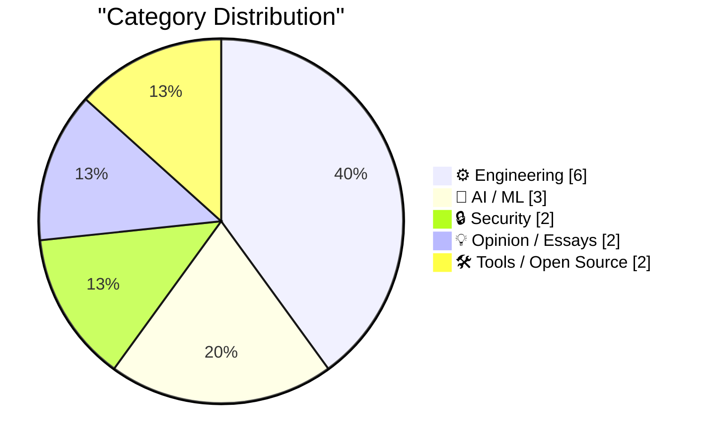
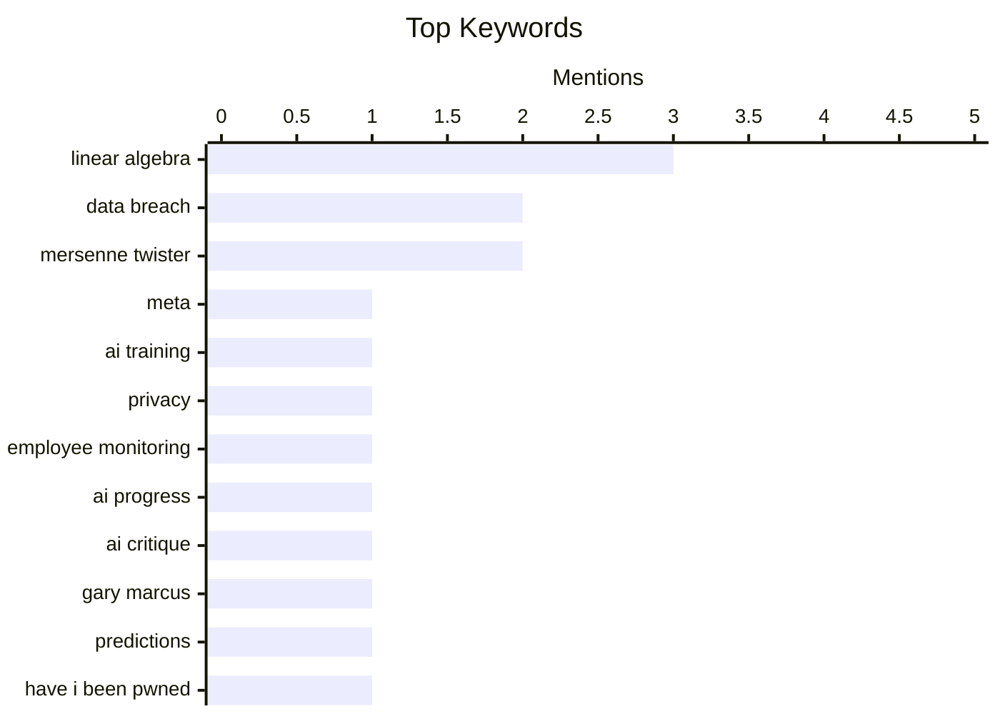

## Today's Highlights
Today's tech news highlights the contentious and rapidly evolving world of AI, from Meta's controversial employee data collection for training to widespread disagreement on its actual progress and potential for misinformation. Meanwhile, cybersecurity threats persist, with governments actively joining data breach monitoring services like Have I Been Pwned, even as new ransomware incidents emerge. These developments underscore a period of significant innovation alongside critical challenges in digital trust and security.
---
## Must Read Today
1. **Meta to Start Capturing Employee Mouse Movements, Keystrokes for AI Training Data**
[Meta to Start Capturing Employee Mouse Movements, Keystrokes for AI Training Data](https://www.reuters.com/sustainability/boards-policy-regulation/meta-start-capturing-employee-mouse-movements-keystrokes-ai-training-data-2026-04-21/) — daringfireball.net · 23h ago · 🤖 AI / ML
> Meta is implementing new tracking software, Model Capability Initiative (MCI), on U.S.-based employee computers to capture mouse movements, clicks, and keystrokes. This data will be used to train its artificial intelligence models, specifically for developing AI agents capable of performing work tasks autonomously. The software will monitor activity across work-related applications and websites. This initiative highlights a significant corporate effort to leverage internal employee data for advanced AI development. The core problem addresses the need for vast, real-world interaction data to build sophisticated AI agents.
💡 **Why read it**: It reveals a major tech company's controversial strategy to collect extensive employee interaction data for AI training, raising significant privacy and ethical questions.
🏷️ Meta, AI training, privacy, employee monitoring
2. **Misplaced panic over AI progress**
[Misplaced panic over AI progress](https://garymarcus.substack.com/p/misplaced-panic-over-ai-progress) — garymarcus.substack.com · 18h ago · 🤖 AI / ML
> This article critically examines METR's latest "time horizon" graph, arguing that current anxieties about rapid AI progress may be misplaced. It aims to deconstruct what the graph accurately represents versus what it does not, challenging interpretations that suggest an imminent breakthrough in AI capabilities. The author likely highlights limitations or misrepresentations in the data or its presentation. The core takeaway is that a more nuanced understanding of AI progress metrics is needed to avoid unwarranted panic.
💡 **Why read it**: It offers a critical perspective on how AI progress is often portrayed and interpreted, urging for a more data-driven and less alarmist view.
🏷️ AI progress, AI critique, Gary Marcus, predictions
3. **Welcoming the Costa Rican Government to Have I Been Pwned**
[Welcoming the Costa Rican Government to Have I Been Pwned](https://www.troyhunt.com/welcoming-the-costa-rican-government-to-have-i-been-pwned/) — troyhunt.com · 13h ago · 🔒 Security
> Have I Been Pwned (HIBP) has onboarded the Costa Rican government as its 42nd national entity to utilize its free government service. This integration grants the Computer Security Incident Response Team (CSIRT) of Costa Rica access to monitor government domains against HIBP's extensive database of compromised data. The service empowers their national cybersecurity team to proactively identify and respond to data exposures affecting government accounts. This expansion enhances national cybersecurity capabilities by providing critical intelligence on breaches.
💡 **Why read it**: It highlights the ongoing global adoption of HIBP's free government service as a crucial tool for national cybersecurity incident response and domain monitoring.
🏷️ Have I Been Pwned, Cybersecurity, Data Breach, Government
---
## Data Overview
| Sources Scanned | Articles Fetched | Time Window | Selected |
|:---:|:---:|:---:|:---:|
| 88/92 | 2528 -> 18 | 24h | **15** |
### Category Distribution

### Top Keywords

<details>
<summary>Plain Text Keyword Chart (Terminal Friendly)</summary>
```
linear algebra      │ ████████████████████ 3
data breach         │ █████████████░░░░░░░ 2
mersenne twister    │ █████████████░░░░░░░ 2
meta                │ ███████░░░░░░░░░░░░░ 1
ai training         │ ███████░░░░░░░░░░░░░ 1
privacy             │ ███████░░░░░░░░░░░░░ 1
employee monitoring │ ███████░░░░░░░░░░░░░ 1
ai progress         │ ███████░░░░░░░░░░░░░ 1
ai critique         │ ███████░░░░░░░░░░░░░ 1
gary marcus         │ ███████░░░░░░░░░░░░░ 1
```
</details>
### Topic Tags
**linear algebra**(3) · **data breach**(2) · **mersenne twister**(2) · meta(1) · ai training(1) · privacy(1) · employee monitoring(1) · ai progress(1) · ai critique(1) · gary marcus(1) · predictions(1) · have i been pwned(1) · cybersecurity(1) · government(1) · ai(1) · misinformation(1) · journalism(1) · ethics(1) · ai productivity(1) · developer tools(1)
---
## Engineering
### 1. Out With the JS, In With the HTML
[Out With the JS, In With the HTML](https://blog.jim-nielsen.com/2026/out-with-js-in-with-html/) — **blog.jim-nielsen.com** · 19h ago · ⭐ 24/30
> This article advocates for a web development paradigm shift, prioritizing numerous small HTML pages and server-side navigations over complex, in-page JavaScript-dependent interactions. The author demonstrates this approach by converting an icon resizing widget from a JavaScript-driven component to one that leverages HTML-based navigation. This method aims to simplify front-end development and potentially improve performance and accessibility by reducing reliance on client-side scripting. The core argument is to embrace the inherent capabilities of HTML for interaction and content delivery.
🏷️ Web Development, HTML, JavaScript, Web Architecture
---
### 2. Quoting Andrew Quinn
[Quoting Andrew Quinn](https://simonwillison.net/2026/May/10/andrew-quinn/#atom-everything) — **simonwillison.net** · 23h ago · ⭐ 23/30
> This article quotes Andrew Quinn, who articulates a common programmer's dilemma: the "guilt of not really knowing whether the tool I am building right now isn’t already superseded by some much better implementation someone else has already written 30 or 40 years ago." This sentiment is contextualized by Quinn's work, which includes replacing a 3 GB SQLite database with a highly optimized 7 MB Finite State Transducer (FST) binary. The quote highlights the constant tension between innovation and leveraging existing, often superior, foundational technologies. It emphasizes the value of understanding fundamental computer science principles to achieve significant performance gains.
🏷️ SQLite, FST, optimization, data structures
---
### 3. The linear algebra of bit twiddling
[The linear algebra of bit twiddling](https://www.johndcook.com/blog/2026/05/10/the-linear-algebra-of-bit-twiddling/) — **johndcook.com** · 19h ago · ⭐ 22/30
> This article explores the mathematical underpinnings of bitwise operations, specifically within the context of the Mersenne Twister random number generator. It formulates sequences of bit operations, such as the tempering step, as matrix multiplication modulo 2. The author emphasizes that linear algebra theorems apply even when the field of scalars is not ℝ or ℂ, but GF(2). This approach provides a rigorous framework for analyzing and understanding complex bit manipulations. The core problem is to mathematically model and analyze low-level bit operations.
🏷️ Bit twiddling, linear algebra, Mersenne Twister, GF(2)
---
### 4. Reverse engineering Mersenne Twister with Linear Algebra
[Reverse engineering Mersenne Twister with Linear Algebra](https://www.johndcook.com/blog/2026/05/10/reverse-mersenne-twister/) — **johndcook.com** · 20h ago · ⭐ 22/30
> This article demonstrates how to reverse engineer the internal state of a Mersenne Twister (MT) random number generator using linear algebra. While MT possesses good statistical properties as a Pseudo-Random Number Generator (PRNG), it lacks the cryptographic strength of a Cryptographically Secure PRNG (CSPRNG). The author explains how to recover the generator's internal state directly from its output by applying linear algebra principles to its bitwise operations. This illustrates a fundamental weakness of MT for security-sensitive applications. The core problem is to exploit the non-cryptographic nature of MT.
🏷️ Mersenne Twister, PRNG, Linear Algebra, Random Numbers
---
### 5. Probability that a random binary matrix is invertible
[Probability that a random binary matrix is invertible](https://www.johndcook.com/blog/2026/05/11/random-binary-matrices/) — **johndcook.com** · 36m ago · ⭐ 20/30
> This article explores the probability that a random n x n binary matrix (composed of 0s and 1s) is invertible, distinguishing between invertibility over real numbers and over GF(2) (integers modulo 2). For invertibility over real numbers, the probability approaches 1 as the matrix size 'n' increases. However, for invertibility over GF(2), the probability converges to a constant value of approximately 0.288788. This specific constant is derived from an infinite product involving terms of (1 - 2^-k). The key finding is that the field over which invertibility is considered significantly alters the probability for random binary matrices.
🏷️ Binary matrices, invertibility, probability, linear algebra
---
### 6. Find blog posts with missing featured images - and missing alt text - without a plugin
[Find blog posts with missing featured images - and missing alt text - without a plugin](https://shkspr.mobi/blog/2026/05/find-blog-posts-with-missing-featured-images-and-missing-alt-text-without-a-plugin/) — **shkspr.mobi** · 2h ago · ⭐ 19/30
> The article addresses the problem of identifying WordPress blog posts that lack featured images or proper alt text without relying on additional plugins. It demonstrates how to leverage WP-CLI for command-line queries to audit content effectively. To find posts missing a featured image, the author uses a command combining `wp post list` and `wp post meta get` with `grep -v '^[0-9]'`. Similarly, for missing alt text on images, a WP-CLI command chain targets attachments and checks for empty `_wp_attachment_image_alt` meta values using `grep -v '^[a-zA-Z0-9]'`. This approach provides a robust, plugin-free method to enhance WordPress site accessibility and SEO.
🏷️ WordPress, WP CLI, alt text, featured images
---
## AI / ML
### 7. Meta to Start Capturing Employee Mouse Movements, Keystrokes for AI Training Data
[Meta to Start Capturing Employee Mouse Movements, Keystrokes for AI Training Data](https://www.reuters.com/sustainability/boards-policy-regulation/meta-start-capturing-employee-mouse-movements-keystrokes-ai-training-data-2026-04-21/) — **daringfireball.net** · 23h ago · ⭐ 28/30
> Meta is implementing new tracking software, Model Capability Initiative (MCI), on U.S.-based employee computers to capture mouse movements, clicks, and keystrokes. This data will be used to train its artificial intelligence models, specifically for developing AI agents capable of performing work tasks autonomously. The software will monitor activity across work-related applications and websites. This initiative highlights a significant corporate effort to leverage internal employee data for advanced AI development. The core problem addresses the need for vast, real-world interaction data to build sophisticated AI agents.
🏷️ Meta, AI training, privacy, employee monitoring
---
### 8. Misplaced panic over AI progress
[Misplaced panic over AI progress](https://garymarcus.substack.com/p/misplaced-panic-over-ai-progress) — **garymarcus.substack.com** · 18h ago · ⭐ 26/30
> This article critically examines METR's latest "time horizon" graph, arguing that current anxieties about rapid AI progress may be misplaced. It aims to deconstruct what the graph accurately represents versus what it does not, challenging interpretations that suggest an imminent breakthrough in AI capabilities. The author likely highlights limitations or misrepresentations in the data or its presentation. The core takeaway is that a more nuanced understanding of AI progress metrics is needed to avoid unwarranted panic.
🏷️ AI progress, AI critique, Gary Marcus, predictions
---
### 9. Quoting New York Times Editors’ Note
[Quoting New York Times Editors’ Note](https://simonwillison.net/2026/May/10/new-york-times-editors-note/#atom-everything) — **simonwillison.net** · 14h ago · ⭐ 24/30
> This article highlights a significant journalistic error where The New York Times mistakenly attributed an AI-generated summary of Pierre Poilievre's views as a direct quotation. The editors' note clarifies that the reporter failed to verify the accuracy of the AI tool's output. The original article has since been updated to include an accurate quote from a speech delivered by Poilievre in April. This incident underscores the critical importance of human verification and journalistic rigor when utilizing AI tools in reporting.
🏷️ AI, misinformation, journalism, ethics
---
## Security
### 10. Welcoming the Costa Rican Government to Have I Been Pwned
[Welcoming the Costa Rican Government to Have I Been Pwned](https://www.troyhunt.com/welcoming-the-costa-rican-government-to-have-i-been-pwned/) — **troyhunt.com** · 13h ago · ⭐ 26/30
> Have I Been Pwned (HIBP) has onboarded the Costa Rican government as its 42nd national entity to utilize its free government service. This integration grants the Computer Security Incident Response Team (CSIRT) of Costa Rica access to monitor government domains against HIBP's extensive database of compromised data. The service empowers their national cybersecurity team to proactively identify and respond to data exposures affecting government accounts. This expansion enhances national cybersecurity capabilities by providing critical intelligence on breaches.
🏷️ Have I Been Pwned, Cybersecurity, Data Breach, Government
---
### 11. Weekly Update 503
[Weekly Update 503](https://www.troyhunt.com/weekly-update-503/) — **troyhunt.com** · 14h ago · ⭐ 24/30
> This weekly update provides an insight into the ongoing Instructure "pay or leak" ransomware incident, noting that the company remains removed from the ShinyHunters website despite an impending deadline. Instructure has replaced the threat with a press statement indicating a "no comment" stance. The update likely covers other recent cybersecurity news and developments, typical of Troy Hunt's regular briefings. It highlights the complexities and public communication challenges faced by organizations under ransomware attacks.
🏷️ Data Breach, Cybersecurity Update, ShinyHunters
---
## Opinion / Essays
### 12. We Are Not Going to Agree on AI
[We Are Not Going to Agree on AI](https://idiallo.com/blog/we-are-not-going-to-agree-on-ai?src=feed) — **idiallo.com** · 2h ago · ⭐ 24/30
> The article illustrates the profound disagreement surrounding AI's practical utility and impact, presenting contrasting anecdotal evidence. It highlights a developer producing 30,000 lines of code monthly with AI versus another who dismisses AI as "stupid." While companies like Medvi are projected to make $1.8 billion, their success is marred by alleged fraud, and Microsoft claims 30% of its code is AI-generated. This divergence in experiences and perceptions suggests that a consensus on AI's true value and risks remains elusive.
🏷️ AI productivity, developer tools, AI adoption
---
### 13. The Problem of Pedagogy in Advanced Mathematics
[The Problem of Pedagogy in Advanced Mathematics](https://susam.net/advanced-mathematics-pedagogy.html) — **susam.net** · 14h ago · ⭐ 16/30
> This article discusses the common issue of poor pedagogy in advanced mathematics, which often deters students despite the subject's inherent beauty and rigor. It argues that ineffective exposition, particularly in early educational stages, can lead to lifelong disengagement from mathematics for many students. The author suggests that while mathematics is crucial for teaching rigorous reasoning, current teaching methods frequently fail to present the subject in an engaging or accessible manner. This often leaves only the most highly motivated students to continue their mathematical journey. The core conclusion is that improving pedagogical approaches in advanced mathematics is essential to make the subject more appealing and comprehensible to a broader audience, fostering a deeper appreciation for its value.
🏷️ Pedagogy, Mathematics, Education
---
## Tools / Open Source
### 14. proxy
[proxy](https://nesbitt.io/2026/05/11/proxy.html) — **nesbitt.io** · 4h ago · ⭐ 21/30
> The article introduces `proxy`, a lightweight Go package designed for multi-ecosystem caching, addressing the need for a unified caching solution across diverse environments. It offers a simple `proxy.New()` constructor and supports various caching backends like Redis, Memcached, and in-memory stores. The package provides a consistent interface for different data types, such as `proxy.String` and `proxy.JSON`, simplifying cache interactions. `proxy` aims to abstract away backend complexities, allowing developers to focus on application logic. The core takeaway is that `proxy` provides a flexible and easy-to-use caching layer for Go applications across multiple ecosystems.
🏷️ Proxy, Caching, Package Manager
---
### 15. WorkOS
[WorkOS](https://workos.com/?utm_source=daringfireball&amp;utm_medium=newsletter&amp;utm_campaign=q22026) — **daringfireball.net** · 23h ago · ⭐ 17/30
> The article highlights WorkOS as a solution for B2B SaaS companies, particularly those in the AI sector, that need to quickly implement enterprise-grade authentication and access control features. It argues that developers should not waste time rebuilding complex infrastructure like Single Sign-On (SSO), SCIM for user provisioning, and audit logs. WorkOS provides production-ready APIs for these critical functionalities, allowing companies to integrate them rapidly. This enables development teams to focus their efforts on core product innovation rather than generic enterprise requirements. The main takeaway is that WorkOS accelerates enterprise readiness for B2B SaaS products by providing essential auth and access control infrastructure out-of-the-box.
🏷️ B2B SaaS, authentication, SSO, enterprise features
---
*Generated at 2026-05-11 14:01 | Scanned 88 sources -> 2528 articles -> selected 15*
*Based on the [Hacker News Popularity Contest 2025](https://refactoringenglish.com/tools/hn-popularity/) RSS source list recommended by [Andrej Karpathy](https://x.com/karpathy)*
*Produced by Dongdianr AI. Follow the same-name WeChat public account for more AI practical tips 💡*
