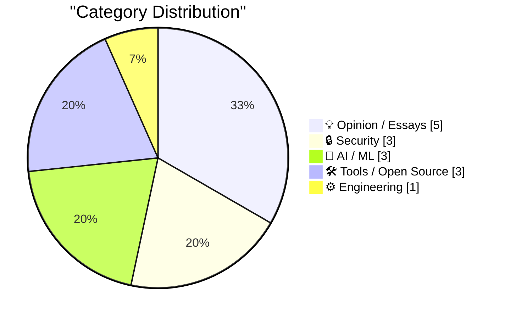
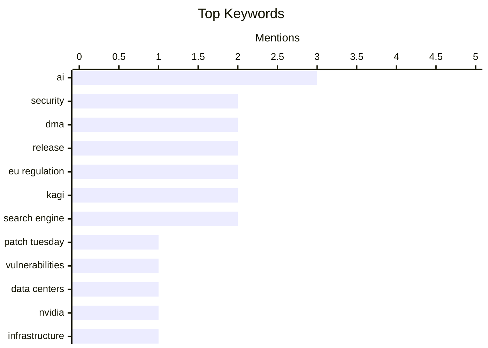

## Today's Highlights
Today's tech news highlights the accelerating pace of AI innovation, from new LLM tool releases to groundbreaking concepts like space-based AI datacenters. This rapid evolution also intersects with cybersecurity, where AI presents both advanced defensive capabilities and new vectors for threats like online scams. Meanwhile, major platforms are adapting to evolving regulatory landscapes, exemplified by new compliance features for EU digital market acts.
---
## Must Read Today
1. **Patch Tuesday, May 2026 Edition**
[Patch Tuesday, May 2026 Edition](https://krebsonsecurity.com/2026/05/patch-tuesday-may-2026-edition/) — krebsonsecurity.com · 16h ago · 🔒 Security
> This article addresses the dual nature of artificial intelligence in cybersecurity, noting its susceptibility to social engineering while excelling at finding code vulnerabilities. This month's Patch Tuesday highlights this reality, with major software makers like Apple, Google, Microsoft, Mozilla, and Oracle fixing near-record volumes of security bugs. These companies are also quickening the tempo of their patch releases, indicating a significant impact from AI-driven vulnerability discovery. The trend suggests AI is both a potential weakness and a powerful tool in the security landscape.
💡 **Why read it**: It highlights the significant impact of AI on cybersecurity, demonstrating how major tech companies are responding to an increased volume of vulnerability discoveries with accelerated patching cycles.
🏷️ Patch Tuesday, security, AI, vulnerabilities
2. **Where Are All The Data Centers?**
[Where Are All The Data Centers?](https://www.wheresyoured.at/where-are-all-the-data-centers/) — wheresyoured.at · 21h ago · 🤖 AI / ML
> This article is a promotional piece for a premium newsletter, not a technical discussion on data centers. The newsletter offers weekly content ranging from 5,000 to 18,000 words, providing vast and detailed analyses. Key topics covered include NVIDIA, Anthropic, and OpenAI. The subscription costs $70 per year or $7 per month.
💡 **Why read it**: It provides insight into a specialized, in-depth newsletter's content and pricing, focusing on major players and trends in the AI and tech industry.
🏷️ Data Centers, AI, NVIDIA, Infrastructure
3. **New DMA Compliance Features for EU Users in iOS 26.5 (and Perhaps the EU Has Finally Come to Their Senses on Tech Regulation)**
[New DMA Compliance Features for EU Users in iOS 26.5 (and Perhaps the EU Has Finally Come to Their Senses on Tech Regulation)](https://www.macrumors.com/2026/05/11/ios-26-5-eu-third-party-wearable-changes/) — daringfireball.net · 19h ago · ⚙️ Engineering
> To comply with the EU’s Digital Markets Act (DMA), Apple is introducing new features in iOS 26.5 that enhance interoperability for third-party wearables. Specifically, third-party earbuds can now utilize proximity pairing to connect to an iPhone, mirroring the seamless one-tap process of AirPods. This change removes a historical limitation, allowing non-Apple wearables to offer a more integrated user experience. The update aims to foster greater competition and user choice within the EU market.
💡 **Why read it**: It details a significant user-facing change in iOS 26.5 driven by EU DMA compliance, specifically enabling enhanced interoperability for third-party wearables like earbuds.
🏷️ iOS, DMA, Apple, Wearables
---
## Data Overview
| Sources Scanned | Articles Fetched | Time Window | Selected |
|:---:|:---:|:---:|:---:|
| 88/92 | 2528 -> 20 | 24h | **15** |
### Category Distribution

### Top Keywords

<details>
<summary>Plain Text Keyword Chart (Terminal Friendly)</summary>
```
ai              │ ████████████████████ 3
security        │ █████████████░░░░░░░ 2
dma             │ █████████████░░░░░░░ 2
release         │ █████████████░░░░░░░ 2
eu regulation   │ █████████████░░░░░░░ 2
kagi            │ █████████████░░░░░░░ 2
search engine   │ █████████████░░░░░░░ 2
patch tuesday   │ ███████░░░░░░░░░░░░░ 1
vulnerabilities │ ███████░░░░░░░░░░░░░ 1
data centers    │ ███████░░░░░░░░░░░░░ 1
```
</details>
### Topic Tags
**ai**(3) · **security**(2) · **dma**(2) · release(2) · eu regulation(2) · kagi(2) · search engine(2) · patch tuesday(1) · vulnerabilities(1) · data centers(1) · nvidia(1) · infrastructure(1) · ios(1) · apple(1) · wearables(1) · llm(1) · openai(1) · ai tool(1) · ai datacenters(1) · space(1)
---
## Opinion / Essays
### 1. Quoting Mitchell Hashimoto
[Quoting Mitchell Hashimoto](https://simonwillison.net/2026/May/12/mitchell-hashimoto/#atom-everything) — **simonwillison.net** · 15h ago · ⭐ 25/30
> This article quotes Mitchell Hashimoto on the primary motivations of Technical Decision Makers (TDMs). Hashimoto asserts that 90% of TDMs are driven by job security, specifically "NOT GETTING FIRED," rather than deep technical passion. These individuals, who typically work 9-to-5, tend to follow "secular trends supported by analysts and broad public sentiment." This includes adopting strategies like Gartner's "AI strategy" recommendations, prioritizing perceived safe choices over innovative or technically superior ones.
🏷️ decision makers, management, industry insight
---
### 2. Building Software Requires Digestion
[Building Software Requires Digestion](https://blog.jim-nielsen.com/2026/software-requires-digestion/) — **blog.jim-nielsen.com** · 19h ago · ⭐ 24/30
> This article argues that effective software development necessitates a process of "digestion," contrasting it with the superficial engagement fostered by chatbot interfaces. Quoting Scott Jenson, it suggests that the reactive "type, read, type again" structure of chatbots creates an illusion of deep cognitive work without allowing for genuine reflection. The core hypothesis is that this interface design actively hinders the necessary digestion and deeper thinking crucial for complex software development. It implies that constant, rapid interaction can impede true understanding and problem-solving.
🏷️ Software Development, AI, Chatbots, Cognitive Work
---
### 3. Teresa Ribera Visited the U.S. and No One Noticed
[Teresa Ribera Visited the U.S. and No One Noticed](https://www.politico.eu/article/eu-big-tech-rulebook-shifting-digital-economy-ribera-dma-pulse-forum/) — **daringfireball.net** · 17h ago · ⭐ 23/30
> The EU's landmark tech regulations, such as the Digital Markets Act (DMA), are currently undergoing a formal review to assess their effectiveness in leveling the playing field against Silicon Valley's tech giants. European Competition Commissioner Teresa Ribera has declared these regulations a "success story" for beginning to shift the digital economy. Brussels is preparing to determine what aspects of the law are working and where reforms may be needed. The primary goal of the DMA is to prevent anti-competitive practices by large tech companies. The EU believes its tech regulations are effectively challenging the dominance of big tech, but a formal review is underway to refine their implementation.
🏷️ EU Regulation, Tech Policy, Digital Markets Act
---
### 4. Broadcasters Urge EU to Use the DMA to Go After Smart TV Platforms, None of Which Are From European Companies
[Broadcasters Urge EU to Use the DMA to Go After Smart TV Platforms, None of Which Are From European Companies](https://www.reuters.com/sustainability/boards-policy-regulation/eu-digital-rules-should-apply-big-techs-smart-tvs-broadcasters-tell-antitrust-2026-03-23/) — **daringfireball.net** · 18h ago · ⭐ 23/30
> European broadcasters are urging the EU to extend the scope of its toughest tech rules, the Digital Markets Act (DMA), to include smart TV platforms and virtual assistants dominated by non-European companies. The Association of Commercial Television and Video on Demand Services in Europe (ACT), representing major broadcasters like Canal+, RTL, and Disney, argues that platforms from Google, Amazon, Apple, and Samsung wield significant market power. They contend these platforms should fall under the DMA to ensure fair competition in the digital economy. This move aims to curb the market dominance of non-European tech giants in the smart TV ecosystem. European broadcasters are pushing for an expansion of the DMA's scope to new tech sectors, aiming to curb the market dominance of non-European tech giants in this sector.
🏷️ EU Regulation, DMA, Smart TV, Market Power
---
### 5. Seriously, Give Kagi a Try
[Seriously, Give Kagi a Try](https://daringfireball.net/2025/04/try_switching_to_kagi) — **daringfireball.net** · 17h ago · ⭐ 22/30
> This article advocates for Kagi as a superior search engine, particularly highlighting its advantage over Google in search result quality and relevance. The author finds Kagi delivers better results than Google, even when using Google's "disenshittified" `&udm=14` parameter. Kagi is more likely to list the correct answer first for specific queries and more effectively finds years-old articles that Google and DuckDuckGo often miss. This suggests Kagi's indexing and ranking algorithms are more effective for certain types of searches. Kagi offers a significantly improved search experience, particularly for finding precise information and older content, outperforming mainstream search engines like Google and DuckDuckGo.
🏷️ Kagi, search engine, Google, privacy
---
## Security
### 6. Patch Tuesday, May 2026 Edition
[Patch Tuesday, May 2026 Edition](https://krebsonsecurity.com/2026/05/patch-tuesday-may-2026-edition/) — **krebsonsecurity.com** · 16h ago · ⭐ 29/30
> This article addresses the dual nature of artificial intelligence in cybersecurity, noting its susceptibility to social engineering while excelling at finding code vulnerabilities. This month's Patch Tuesday highlights this reality, with major software makers like Apple, Google, Microsoft, Mozilla, and Oracle fixing near-record volumes of security bugs. These companies are also quickening the tempo of their patch releases, indicating a significant impact from AI-driven vulnerability discovery. The trend suggests AI is both a potential weakness and a powerful tool in the security landscape.
🏷️ Patch Tuesday, security, AI, vulnerabilities
---
### 7. CSP Allow-list Experiment
[CSP Allow-list Experiment](https://simonwillison.net/2026/May/13/csp-allow/#atom-everything) — **simonwillison.net** · 9h ago · ⭐ 24/30
> This article introduces a "CSP Allow-list Experiment" tool demonstrating a novel method for managing Content Security Policy (CSP) errors within sandboxed iframes. The experiment shows that an application loaded in a CSP-protected iframe can implement a custom `fetch()` function to intercept CSP errors. These intercepted errors are then passed up to the parent window, which can prompt the user to add the problematic domain to an allow-list. Subsequently, the iframe can be refreshed, resolving the blocked resource.
🏷️ CSP, iframe, sandboxing, web security
---
### 8. Search Ads as a Vector for Travel Scams
[Search Ads as a Vector for Travel Scams](https://www.wsj.com/lifestyle/travel/the-simple-travel-scam-that-cost-a-seasoned-traveler-over-12-000-7d317f20?st=WDTpv5) — **daringfireball.net** · 17h ago · ⭐ 24/30
> This article highlights how search engine advertisements are increasingly used as a vector for travel scams, detailing a case where a seasoned traveler lost over $12,000. The victim, attempting to rebook a flight, Googled the airline's customer service number after an initial link failed. This action led them to a fraudulent contact advertised prominently, a common deceptive tactic. Such scams are widely recognized by organizations like the Better Business Bureau, Federal Trade Commission, airlines, and consumer advocates.
🏷️ Search Ads, Scams, Travel, Security
---
## AI / ML
### 9. Where Are All The Data Centers?
[Where Are All The Data Centers?](https://www.wheresyoured.at/where-are-all-the-data-centers/) — **wheresyoured.at** · 21h ago · ⭐ 28/30
> This article is a promotional piece for a premium newsletter, not a technical discussion on data centers. The newsletter offers weekly content ranging from 5,000 to 18,000 words, providing vast and detailed analyses. Key topics covered include NVIDIA, Anthropic, and OpenAI. The subscription costs $70 per year or $7 per month.
🏷️ Data Centers, AI, NVIDIA, Infrastructure
---
### 10. llm 0.32a2
[llm 0.32a2](https://simonwillison.net/2026/May/12/llm/#atom-everything) — **simonwillison.net** · 20h ago · ⭐ 26/30
> This release note for `llm 0.32a2` details a crucial update for interacting with OpenAI models. The most significant change is that most reasoning-capable OpenAI models now utilize the `/v1/responses` endpoint instead of the previous `/v1/chat/completions`. This transition is highlighted as enabling "interleaved reasoning," suggesting a more advanced or flexible interaction pattern with the AI models. The update aims to improve the capabilities and performance of `llm` when working with OpenAI's advanced reasoning models.
🏷️ LLM, OpenAI, release, AI tool
---
### 11. AI datacenters in space do not have a cooling problem
[AI datacenters in space do not have a cooling problem](https://seangoedecke.com/space-ai-datacenters-do-not-have-a-cooling-problem/) — **seangoedecke.com** · 14h ago · ⭐ 26/30
> Elon Musk has begun advocating for building AI datacenters in space, leveraging his ventures in both space and artificial intelligence. A common initial concern raised regarding this concept is the challenge of cooling such facilities. The article's title directly refutes this widespread assumption, suggesting that space-based datacenters might not face the cooling problems typically associated with terrestrial operations. This perspective challenges conventional thinking about the feasibility of large-scale computing infrastructure beyond Earth.
🏷️ AI datacenters, space, cooling, Elon Musk
---
## Tools / Open Source
### 12. datasette 1.0a29
[datasette 1.0a29](https://simonwillison.net/2026/May/12/datasette/#atom-everything) — **simonwillison.net** · 14h ago · ⭐ 23/30
> This release note announces `datasette 1.0a29`, detailing two key updates for the data exploration tool. A new `TokenRestrictions.abbreviated(datasette)` utility method has been introduced, specifically designed for creating `"_r"` dictionaries, addressing issue #2695. Additionally, a significant usability improvement ensures that table headers and column options are now consistently visible, even when a table contains no rows. This enhancement improves the user interface and data presentation consistency across all tables.
🏷️ Datasette, release, data tool, open source
---
### 13. Open Link in Unloaded Tab, a little Firefox extension
[Open Link in Unloaded Tab, a little Firefox extension](https://evanhahn.com/open-link-in-unloaded-tab-for-firefox/) — **evanhahn.com** · 14h ago · ⭐ 22/30
> Firefox users currently lack a native feature to open new links in an "unloaded" tab state, which is crucial for optimizing system resource usage. To address this, the author developed a Firefox extension named "Open Link in Unloaded Tab," which adds a dedicated option to the right-click context menu. This extension allows users to open links without immediately loading their content, leveraging Firefox's existing tab unloading capability to conserve system memory. The "Open Link in Unloaded Tab" Firefox extension provides a simple yet effective solution for users to manage system resources by opening new links in an unloaded state.
🏷️ Firefox, Extension, Browser, Tab Management
---
### 14. Kagi Snaps
[Kagi Snaps](https://help.kagi.com/kagi/features/snaps.html) — **daringfireball.net** · 16h ago · ⭐ 20/30
> Kagi offers a powerful "Snaps" feature designed to enhance search precision by allowing users to limit results to specific websites. This feature enables users to quickly narrow search results using a short code, such as `@r headphones` to search for "headphones" exclusively on reddit.com. This functionality is equivalent to using `headphones site:old.reddit.com` but is more concise and integrated. "Snaps" differs from Kagi's "Bangs" feature (`!r headphones`), which redirects the user to the target site's internal search. Kagi's "Snaps" feature provides a highly efficient way to perform site-specific searches directly within Kagi's powerful index, offering a distinct advantage over traditional `site:` operators and Kagi's "Bangs."
🏷️ Kagi, search engine, productivity, features
---
## Engineering
### 15. New DMA Compliance Features for EU Users in iOS 26.5 (and Perhaps the EU Has Finally Come to Their Senses on Tech Regulation)
[New DMA Compliance Features for EU Users in iOS 26.5 (and Perhaps the EU Has Finally Come to Their Senses on Tech Regulation)](https://www.macrumors.com/2026/05/11/ios-26-5-eu-third-party-wearable-changes/) — **daringfireball.net** · 19h ago · ⭐ 27/30
> To comply with the EU’s Digital Markets Act (DMA), Apple is introducing new features in iOS 26.5 that enhance interoperability for third-party wearables. Specifically, third-party earbuds can now utilize proximity pairing to connect to an iPhone, mirroring the seamless one-tap process of AirPods. This change removes a historical limitation, allowing non-Apple wearables to offer a more integrated user experience. The update aims to foster greater competition and user choice within the EU market.
🏷️ iOS, DMA, Apple, Wearables
---
*Generated at 2026-05-13 14:01 | Scanned 88 sources -> 2528 articles -> selected 15*
*Based on the [Hacker News Popularity Contest 2025](https://refactoringenglish.com/tools/hn-popularity/) RSS source list recommended by [Andrej Karpathy](https://x.com/karpathy)*
*Produced by Dongdianr AI. Follow the same-name WeChat public account for more AI practical tips 💡*
