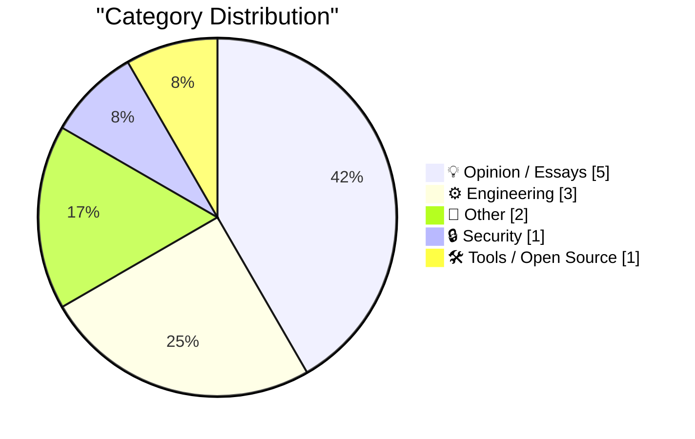
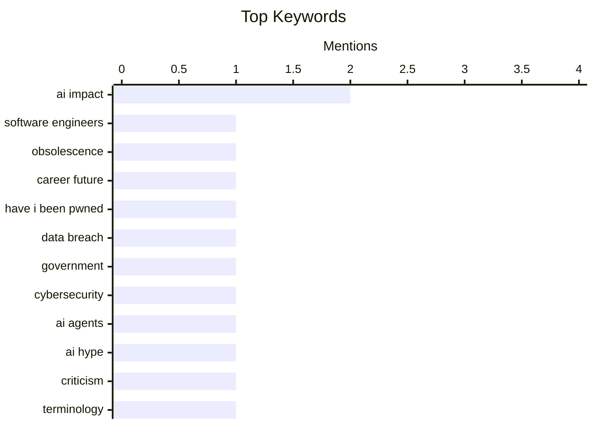

## Today's Highlights
Today's tech highlights underscore the profound and often disruptive influence of artificial intelligence, sparking debates on its impact on software engineering careers and broader societal structures. Experts are urging critical thinking about AI's terminology and preparing for life in an AI-centric world. Concurrently, engineering teams are re-evaluating traditional metrics for project management and system analysis, questioning their consistency and validity. In a separate development, governments are enhancing data security measures to protect citizen information.
---
## Must Read Today
1. **Software Engineers are Obsolete**
[Software Engineers are Obsolete](https://idiallo.com/blog/everyone-is-better-than-you?src=feed) — idiallo.com · 15h ago · 💡 Opinion / Essays
> The article, despite its provocative title, details the author's hands-on experience building a programming tutorial website from scratch. This personal project involved full-stack development, including creating a PHP application, designing the database schema, and crafting the user interface. The author documented their process, which became the site's first tutorial, and then curated other tutorials to form a comprehensive portal. This narrative showcases the foundational skills and end-to-end effort required to develop a functional web platform.
💡 **Why read it**: It offers a personal account of full-stack web development, showcasing the foundational skills required to build a complex application from scratch.
🏷️ Software engineers, obsolescence, AI impact, career future
2. **Welcoming the Bahamian Government to Have I Been Pwned**
[Welcoming the Bahamian Government to Have I Been Pwned](https://www.troyhunt.com/welcoming-the-bahamian-government-to-have-i-been-pwned/) — troyhunt.com · 10h ago · 🔒 Security
> The article announces the onboarding of the Bahamian government to Have I Been Pwned's (HIBP) free government service. The National Computer Incident Response Team of The Bahamas (CIRT-BS) is now the 44th government entity to gain access to HIBP. This integration allows CIRT-BS to monitor government domains for data breaches against HIBP's extensive dataset. This partnership significantly enhances the Bahamian government's cybersecurity posture by providing critical tools for incident response and proactive domain monitoring.
💡 **Why read it**: It highlights the ongoing expansion of HIBP's free government service, demonstrating its role in enhancing national cybersecurity capabilities for 44 governments.
🏷️ Have I Been Pwned, Data Breach, Government, Cybersecurity
3. **Quoting Boris Mann**
[Quoting Boris Mann](https://simonwillison.net/2026/May/13/boris-mann/#atom-everything) — simonwillison.net · 21h ago · 💡 Opinion / Essays
> The article quotes Boris Mann, who critiques the vagueness of the phrase "11 AI agents." Mann argues that stating one has "11 AI agents" is as meaningless as saying "I have 11 spreadsheets" or "11 browser tabs" to do work. He implies that the quantity alone provides no insight into their function or utility. The quote emphasizes the need for more specific and descriptive language when discussing AI agents, moving beyond mere numerical counts to convey actual value or purpose.
💡 **Why read it**: It provides a concise, critical perspective on the often-vague terminology used in discussions about AI agents, advocating for clearer communication.
🏷️ AI agents, AI hype, criticism, terminology
---
## Data Overview
| Sources Scanned | Articles Fetched | Time Window | Selected |
|:---:|:---:|:---:|:---:|
| 88/92 | 2529 -> 12 | 24h | **12** |
### Category Distribution

### Top Keywords

<details>
<summary>Plain Text Keyword Chart (Terminal Friendly)</summary>
```
ai impact          │ ████████████████████ 2
software engineers │ ██████████░░░░░░░░░░ 1
obsolescence       │ ██████████░░░░░░░░░░ 1
career future      │ ██████████░░░░░░░░░░ 1
have i been pwned  │ ██████████░░░░░░░░░░ 1
data breach        │ ██████████░░░░░░░░░░ 1
government         │ ██████████░░░░░░░░░░ 1
cybersecurity      │ ██████████░░░░░░░░░░ 1
ai agents          │ ██████████░░░░░░░░░░ 1
ai hype            │ ██████████░░░░░░░░░░ 1
```
</details>
### Topic Tags
**ai impact**(2) · **software engineers**(1) · **obsolescence**(1) · career future(1) · have i been pwned(1) · data breach(1) · government(1) · cybersecurity(1) · ai agents(1) · ai hype(1) · criticism(1) · terminology(1) · ai criticism(1) · future of ai(1) · pagerank(1) · dependency graphs(1) · graph algorithms(1) · system analysis(1) · ai ethics(1) · societal impact(1)
---
## Opinion / Essays
### 1. Software Engineers are Obsolete
[Software Engineers are Obsolete](https://idiallo.com/blog/everyone-is-better-than-you?src=feed) — **idiallo.com** · 15h ago · ⭐ 25/30
> The article, despite its provocative title, details the author's hands-on experience building a programming tutorial website from scratch. This personal project involved full-stack development, including creating a PHP application, designing the database schema, and crafting the user interface. The author documented their process, which became the site's first tutorial, and then curated other tutorials to form a comprehensive portal. This narrative showcases the foundational skills and end-to-end effort required to develop a functional web platform.
🏷️ Software engineers, obsolescence, AI impact, career future
---
### 2. Quoting Boris Mann
[Quoting Boris Mann](https://simonwillison.net/2026/May/13/boris-mann/#atom-everything) — **simonwillison.net** · 21h ago · ⭐ 23/30
> The article quotes Boris Mann, who critiques the vagueness of the phrase "11 AI agents." Mann argues that stating one has "11 AI agents" is as meaningless as saying "I have 11 spreadsheets" or "11 browser tabs" to do work. He implies that the quantity alone provides no insight into their function or utility. The quote emphasizes the need for more specific and descriptive language when discussing AI agents, moving beyond mere numerical counts to convey actual value or purpose.
🏷️ AI agents, AI hype, criticism, terminology
---
### 3. Pluralistic: Kickstarting "The Reverse Centaur's Guide to Life After AI" (14 May 2026)
[Pluralistic: Kickstarting "The Reverse Centaur's Guide to Life After AI" (14 May 2026)](https://pluralistic.net/2026/05/14/who-it-does-it-for/) — **pluralistic.net** · 2h ago · ⭐ 22/30
> This article introduces "The Reverse Centaur's Guide to Life After AI," framed as a guide for becoming a better AI critic. The piece is a daily link aggregation, with the main highlight being the kickstarting of this new guide. Other sections include "Delights to delectate" and "Object permanence," listing various news items like RIP Douglas Adams and EFF v W3C. The primary focus is on promoting a new resource designed to foster more informed and effective criticism of AI.
🏷️ AI criticism, AI impact, future of AI
---
### 4. Pluralistic: Billionaire solipsism, dictator solipsism, AI, and the fascist paradigm (13 May 2026)
[Pluralistic: Billionaire solipsism, dictator solipsism, AI, and the fascist paradigm (13 May 2026)](https://pluralistic.net/2026/05/13/vibe-governance/) — **pluralistic.net** · 22h ago · ⭐ 21/30
> This article explores the intersection of billionaire and dictator solipsism with AI and the fascist paradigm, suggesting that AGI functions best in a "K-hole." The piece is a daily link aggregation, with the main theme being the critical examination of power structures and AI. It includes sections like "Delights to delectate" and "Object permanence," listing various news items such as Woz's remotes and DNC x GOP megadonors. The primary takeaway is a critical perspective on how AI development and deployment might be influenced by and reinforce solipsistic and potentially authoritarian power dynamics.
🏷️ AI ethics, societal impact, political tech
---
### 5. It's funny because it's true
[It's funny because it's true](https://idiallo.com/byte-size/its-funny-because-its-true?src=feed) — **idiallo.com** · 6h ago · ⭐ 12/30
> The article recounts a humorous online interaction involving a perfectly timed reference to a post by Cliff Stoll, titled "Rumors of my death are slightly exaggerated." The author made a popular joke online by referencing Cliff Stoll's Hacker News post, which surprised the author because they didn't know Stoll frequented Hacker News or was rumored to be dead. The humor stemmed from Stoll's self-aware post correcting a false rumor. The anecdote illustrates the serendipitous nature of online humor and the unexpected interactions that can occur on platforms like Hacker News, even involving notable figures like Cliff Stoll.
🏷️ Internet joke, Cliff Stoll, anecdote
---
## Engineering
### 6. Centrality is not vitality
[Centrality is not vitality](https://nesbitt.io/2026/05/14/centrality-is-not-vitality.html) — **nesbitt.io** · 4h ago · ⭐ 22/30
> The article warns against automatically applying PageRank to dependency graphs, suggesting that centrality metrics do not equate to vitality. The core argument is that while PageRank measures a form of centrality (importance based on incoming links), it may not accurately reflect the 'vitality' or health of components within a dependency graph. A highly central component isn't necessarily a healthy or actively maintained one. Developers should exercise caution and critical thinking when using network centrality algorithms like PageRank for assessing the health or importance of software dependencies, as these metrics can be misleading.
🏷️ PageRank, dependency graphs, graph algorithms, system analysis
---
### 7. Points are a weird and inconsistent unit of measure
[Points are a weird and inconsistent unit of measure](https://buttondown.com/hillelwayne/archive/points-are-a-weird-and-inconsistent-unit-of/) — **buttondown.com/hillelwayne** · 22h ago · ⭐ 21/30
> The article highlights the inconsistency and problematic nature of "points" as a unit of measure, particularly in typography. The author, while redoing diagrams for "Logic for Programmers," encountered issues with LaTeX's pseudo-grid of 10.8pt × 7.2pt and Inkscape's handling of point sizes. This experience underscores how the definition and rendering of "points" can vary significantly across tools and contexts. The article concludes that "points" are an unreliable and inconsistent unit, leading to practical problems in design and layout.
🏷️ Story points, agile, estimation, software development
---
### 8. Texas Instruments 486SXL CPU
[Texas Instruments 486SXL CPU](https://dfarq.homeip.net/texas-instruments-486sxl-cpu/?utm_source=rss&#038;utm_medium=rss&#038;utm_campaign=texas-instruments-486sxl-cpu) — **dfarq.homeip.net** · 3h ago · ⭐ 12/30
> This article discusses Texas Instruments' licensing agreement with Cyrix for their 486SLC and 486DLC CPU technologies, established on May 14, 1992. The agreement allowed Cyrix to utilize Texas Instruments' manufacturing facilities for chip production. Concurrently, it granted TI the right to develop derivative chips based on Cyrix's licensed technology. Despite the initial agreement, Texas Instruments ultimately did not produce a significant number of these derivative CPUs. The venture saw limited production from TI, indicating a less extensive impact than the licensing might suggest.
🏷️ CPU, Texas Instruments, Cyrix, Hardware History
---
## Other
### 9. The Biz Reaper
[The Biz Reaper](https://feed.tedium.co/link/15204/17340934/buzzfeed-byron-allen-analysis) — **tedium.co** · 10h ago · ⭐ 15/30
> The article uses the metaphor of "The Biz Reaper" (Byron Allen) to signify financial trouble for media businesses, specifically mentioning BuzzFeed's current situation. The presence of Byron Allen, known for acquiring struggling media assets, indicates that a company like BuzzFeed has made significant errors in its business strategy. The article implies an analysis of BuzzFeed's financial woes. It serves as a warning about the consequences of poor business management in the media industry, with Byron Allen's involvement signaling a critical juncture for companies like BuzzFeed.
🏷️ Media business, BuzzFeed, acquisitions
---
### 10. Commenting Guidelines
[Commenting Guidelines](https://susam.net/commenting.html) — **susam.net** · 14h ago · ⭐ 10/30
> This document outlines the essential guidelines for contributing to the active and carefully curated comments section on susam.net. Commenters are permitted to include either HTML or Markdown syntax within their submissions. All comments undergo a conversion process to HTML and are subsequently sanitized before they are published on the website. These rules ensure that contributions maintain appropriate content and formatting standards for the site's discussion.
🏷️ Commenting, website rules, moderation
---
## Security
### 11. Welcoming the Bahamian Government to Have I Been Pwned
[Welcoming the Bahamian Government to Have I Been Pwned](https://www.troyhunt.com/welcoming-the-bahamian-government-to-have-i-been-pwned/) — **troyhunt.com** · 10h ago · ⭐ 25/30
> The article announces the onboarding of the Bahamian government to Have I Been Pwned's (HIBP) free government service. The National Computer Incident Response Team of The Bahamas (CIRT-BS) is now the 44th government entity to gain access to HIBP. This integration allows CIRT-BS to monitor government domains for data breaches against HIBP's extensive dataset. This partnership significantly enhances the Bahamian government's cybersecurity posture by providing critical tools for incident response and proactive domain monitoring.
🏷️ Have I Been Pwned, Data Breach, Government, Cybersecurity
---
## Tools / Open Source
### 12. Welcome to the Datasette blog
[Welcome to the Datasette blog](https://simonwillison.net/2026/May/13/welcome-to-the-datasette-blog/#atom-everything) — **simonwillison.net** · 14h ago · ⭐ 20/30
> The article announces the launch of an official blog for the Datasette project to share upcoming announcements. The blog was built using OpenAI Codex desktop, leveraging its Markdown session transcript export feature. A specific Gist (gist.github.com/simonw/885b11eee46822622b8031a1f4e5f3a3) documents the session that created the blog. Datasette now has a dedicated platform for official news, demonstrating a practical application of AI-assisted development tools like OpenAI Codex for blog creation.
🏷️ Datasette, blog, announcement, data tool
---
*Generated at 2026-05-14 14:01 | Scanned 88 sources -> 2529 articles -> selected 12*
*Based on the [Hacker News Popularity Contest 2025](https://refactoringenglish.com/tools/hn-popularity/) RSS source list recommended by [Andrej Karpathy](https://x.com/karpathy)*
*Produced by Dongdianr AI. Follow the same-name WeChat public account for more AI practical tips 💡*
