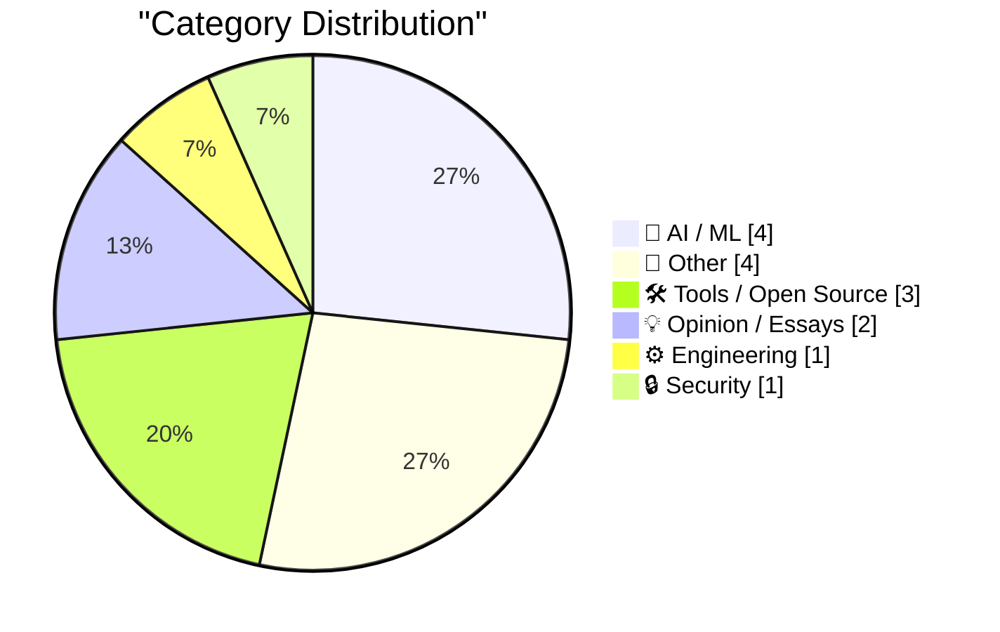
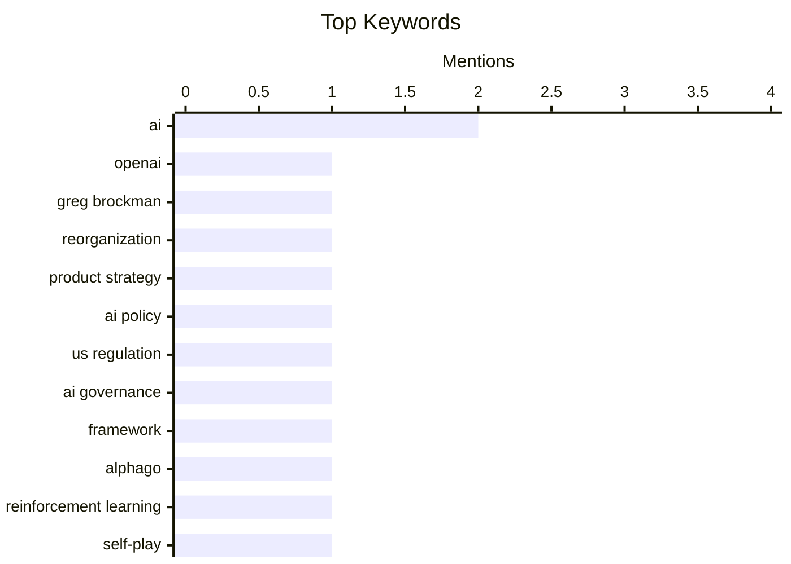

## Today's Highlights
Today's tech news is heavily focused on the evolving world of artificial intelligence, from significant leadership changes at major AI players like OpenAI to cutting-edge advancements in LLM steering. This rapid progress is fueling both excitement and critical examination, sparking debates over a potential AI bubble and the urgent need for effective US AI policy. Meanwhile, the broader software landscape continues to see innovation with new productivity tools and discussions around future operating systems.
---
## Must Read Today
1. **Greg Brockman Officially Takes Control of Products at OpenAI, a Very Stable Well-Run Company**
[Greg Brockman Officially Takes Control of Products at OpenAI, a Very Stable Well-Run Company](https://www.wired.com/story/openai-reorg-greg-brockman-product/) — daringfireball.net · 12h ago · 🤖 AI / ML
> OpenAI has undergone a reorganization to unify its product offerings, with cofounder and president Greg Brockman now officially leading the company’s product strategy. This new role is in addition to his existing responsibilities for AI infrastructure. Brockman had previously overseen OpenAI products on an interim basis while Fidji Simo, CEO of AGI deployment, was on medical leave. The restructuring aims to streamline and consolidate product development efforts within the organization. The main conclusion is that OpenAI is formalizing leadership roles to enhance product and infrastructure synergy.
💡 **Why read it**: This article is worth reading to understand recent leadership changes and strategic shifts within OpenAI's product and infrastructure divisions.
🏷️ OpenAI, Greg Brockman, reorganization, product strategy
2. **US AI policy is a clumsy mess. Here’s what to do about it.**
[US AI policy is a clumsy mess. Here’s what to do about it.](https://garymarcus.substack.com/p/us-ai-policy-is-a-clumsy-mess-heres) — garymarcus.substack.com · 23h ago · 🤖 AI / ML
> The core problem addressed is the current state of US AI policy, which is characterized as a "clumsy mess" due to a proliferation of over 1200 state and federal bills lacking a cohesive framework. The article implies a critical need for a more structured and unified approach to AI regulation across the nation. It likely proposes specific recommendations to streamline and improve the effectiveness of US AI policy, moving beyond the current fragmented legislative landscape. The main conclusion is that a fundamental overhaul of the current legislative strategy is required to foster responsible and effective AI development.
💡 **Why read it**: This article is worth reading for insights into the challenges of US AI policy and potential solutions for creating a more effective regulatory framework.
🏷️ AI policy, US regulation, AI governance, framework
3. **Eric Jang – Building AlphaGo from scratch**
[Eric Jang – Building AlphaGo from scratch](https://www.dwarkesh.com/p/eric-jang) — dwarkesh.com · 21h ago · 🤖 AI / ML
> This article discusses the foundational principles behind building AlphaGo, highlighting it as a prime example of core intelligence primitives. It delves into how AlphaGo integrates sophisticated search algorithms, learns effectively from vast amounts of experience, and leverages self-play mechanisms to achieve superhuman performance in the game of Go. The discussion likely covers the technical architecture and iterative development process that enabled AlphaGo's groundbreaking success. The main takeaway is that AlphaGo's design offers a clear blueprint for understanding and implementing fundamental AI capabilities like search, learning, and self-play.
💡 **Why read it**: This article is worth reading for a deep dive into the architectural and algorithmic principles that made AlphaGo a landmark achievement in artificial intelligence.
🏷️ AlphaGo, AI, Reinforcement Learning, Self-play
---
## Data Overview
| Sources Scanned | Articles Fetched | Time Window | Selected |
|:---:|:---:|:---:|:---:|
| 88/92 | 2532 -> 15 | 24h | **15** |
### Category Distribution

### Top Keywords

<details>
<summary>Plain Text Keyword Chart (Terminal Friendly)</summary>
```
ai               │ ████████████████████ 2
openai           │ ██████████░░░░░░░░░░ 1
greg brockman    │ ██████████░░░░░░░░░░ 1
reorganization   │ ██████████░░░░░░░░░░ 1
product strategy │ ██████████░░░░░░░░░░ 1
ai policy        │ ██████████░░░░░░░░░░ 1
us regulation    │ ██████████░░░░░░░░░░ 1
ai governance    │ ██████████░░░░░░░░░░ 1
framework        │ ██████████░░░░░░░░░░ 1
alphago          │ ██████████░░░░░░░░░░ 1
```
</details>
### Topic Tags
**ai**(2) · **openai**(1) · **greg brockman**(1) · reorganization(1) · product strategy(1) · ai policy(1) · us regulation(1) · ai governance(1) · framework(1) · alphago(1) · reinforcement learning(1) · self-play(1) · llm steering(1) · deepseek v4 flash(1) · activations(1) · ai bubble(1) · agi(1) · ai future(1) · industry opinion(1) · sqlalchemy(1)
---
## AI / ML
### 1. Greg Brockman Officially Takes Control of Products at OpenAI, a Very Stable Well-Run Company
[Greg Brockman Officially Takes Control of Products at OpenAI, a Very Stable Well-Run Company](https://www.wired.com/story/openai-reorg-greg-brockman-product/) — **daringfireball.net** · 12h ago · ⭐ 28/30
> OpenAI has undergone a reorganization to unify its product offerings, with cofounder and president Greg Brockman now officially leading the company’s product strategy. This new role is in addition to his existing responsibilities for AI infrastructure. Brockman had previously overseen OpenAI products on an interim basis while Fidji Simo, CEO of AGI deployment, was on medical leave. The restructuring aims to streamline and consolidate product development efforts within the organization. The main conclusion is that OpenAI is formalizing leadership roles to enhance product and infrastructure synergy.
🏷️ OpenAI, Greg Brockman, reorganization, product strategy
---
### 2. US AI policy is a clumsy mess. Here’s what to do about it.
[US AI policy is a clumsy mess. Here’s what to do about it.](https://garymarcus.substack.com/p/us-ai-policy-is-a-clumsy-mess-heres) — **garymarcus.substack.com** · 23h ago · ⭐ 28/30
> The core problem addressed is the current state of US AI policy, which is characterized as a "clumsy mess" due to a proliferation of over 1200 state and federal bills lacking a cohesive framework. The article implies a critical need for a more structured and unified approach to AI regulation across the nation. It likely proposes specific recommendations to streamline and improve the effectiveness of US AI policy, moving beyond the current fragmented legislative landscape. The main conclusion is that a fundamental overhaul of the current legislative strategy is required to foster responsible and effective AI development.
🏷️ AI policy, US regulation, AI governance, framework
---
### 3. Eric Jang – Building AlphaGo from scratch
[Eric Jang – Building AlphaGo from scratch](https://www.dwarkesh.com/p/eric-jang) — **dwarkesh.com** · 21h ago · ⭐ 27/30
> This article discusses the foundational principles behind building AlphaGo, highlighting it as a prime example of core intelligence primitives. It delves into how AlphaGo integrates sophisticated search algorithms, learns effectively from vast amounts of experience, and leverages self-play mechanisms to achieve superhuman performance in the game of Go. The discussion likely covers the technical architecture and iterative development process that enabled AlphaGo's groundbreaking success. The main takeaway is that AlphaGo's design offers a clear blueprint for understanding and implementing fundamental AI capabilities like search, learning, and self-play.
🏷️ AlphaGo, AI, Reinforcement Learning, Self-play
---
### 4. DeepSeek-V4-Flash means LLM steering is interesting again
[DeepSeek-V4-Flash means LLM steering is interesting again](https://seangoedecke.com/steering-vectors/) — **seangoedecke.com** · 14h ago · ⭐ 26/30
> The article explores the concept of "steering" Large Language Model (LLM) outputs by directly manipulating the model's activations during inference, a technique gaining renewed interest since Golden Gate Claude. It highlights DeepSeek-V4-Flash as a model that makes this approach particularly compelling and practical. The author was inspired by antirez's DwarfStar 4 project, which is a specialized version of `llama.cpp` designed for such low-level manipulations. This development suggests new possibilities for fine-grained control over LLM behavior without requiring extensive retraining. The main conclusion is that advancements like DeepSeek-V4-Flash are revitalizing research and application of LLM steering vectors.
🏷️ LLM steering, DeepSeek V4 Flash, AI, activations
---
## Other
### 5. Reading List 05/16/26
[Reading List 05/16/26](https://www.construction-physics.com/p/reading-list-051626) — **construction-physics.com** · 2h ago · ⭐ 10/30
> This article presents a curated reading list covering diverse topics related to construction, infrastructure, and economics, dated May 16, 2026. Key subjects include an analysis of Tokyo's unique housing market, characterized by cheap housing despite expensive land, and the US House of Representatives' response to a Senate housing bill. It also highlights significant infrastructure and security news, such as an IED incident near an Alabama dam, and financial developments like Fervo's IPO. The list offers a broad, multi-faceted overview of current events and trends impacting the construction and real estate sectors, alongside broader economic and security news.
🏷️ Housing, Geothermal, IPO
---
### 6. Pluralistic: Making sense of Trump's unscheduled sudden midair disassembly of the American empire (16 May 2026)
[Pluralistic: Making sense of Trump's unscheduled sudden midair disassembly of the American empire (16 May 2026)](https://pluralistic.net/2026/05/16/technopoly/) — **pluralistic.net** · 5h ago · ⭐ 4/30
> This "Pluralistic" post by Cory Doctorow offers a collection of links and commentary, primarily centered on political analysis and societal issues, framed by the provocative title "Making sense of Trump's unscheduled sudden midair disassembly of the American empire." The article explores themes like the distinction between "powerful" and "durable" systems, suggesting that apparent strength does not guarantee longevity. It delves into "Object permanence" through various examples, including copyrighted law, viral videos' impact on policing, and the critical question of whether the means of computation can be seized. The post provides a critical, multi-faceted perspective on contemporary political and technological power dynamics, urging readers to consider the fragility of seemingly robust systems.
🏷️ politics, social commentary, Trump, empire
---
### 7. Western Gull, Rock Pigeon
[Western Gull, Rock Pigeon](https://simonwillison.net/2026/May/15/sighting-361818285/#atom-everything) — **simonwillison.net** · 23h ago · ⭐ 3/30
> This short post by Simon Willison documents a personal bird-watching experience in the Los Angeles Area, featuring observations of a Western Gull and a Rock Pigeon. The author embarked on a bird walk prior to attending PyCon, noting a specific sighting of a local seagull enjoying a Starbucks. The article includes photographic evidence of both species, likely integrated from an observation platform like iNaturalist. It serves as a brief, personal anecdote highlighting a moment of nature observation amidst a technical conference trip.
🏷️ birds, nature, personal, blog
---
### 8. Wanton Destruction of CBS Property
[Wanton Destruction of CBS Property](https://www.youtube.com/watch?v=eBKWKu2Rqxc) — **daringfireball.net** · 17h ago · ⭐ 3/30
> This Daring Fireball post links directly to a YouTube video titled "Wanton Destruction of CBS Property," accompanied by a provocative quote. The article's content is minimal, consisting solely of the YouTube URL and the phrase, "Good night and good luck, motherfuckers." This suggests the linked video is the primary content, likely depicting an act of property destruction, potentially within a satirical or critical context related to CBS. The post serves as a direct pointer to external video content, using a striking title and quote to pique reader interest in its subject matter.
🏷️ quote, CBS, commentary
---
## Tools / Open Source
### 9. SQLAlchemy 2 In Practice - Chapter 8: SQLAlchemy and the Web
[SQLAlchemy 2 In Practice - Chapter 8: SQLAlchemy and the Web](https://blog.miguelgrinberg.com/post/sqlalchemy-2-in-practice---chapter-8-sqlalchemy-and-the-web) — **miguelgrinberg.com** · 26m ago · ⭐ 23/30
> This article serves as the eighth and final chapter of the "SQLAlchemy 2 in Practice" book, focusing on integrating SQLAlchemy with web applications. It covers practical aspects of using SQLAlchemy 2 within both traditional web applications and web APIs, which interact with front-end or mobile clients. The chapter likely details best practices for session management, query optimization, and handling database interactions in a web context. It aims to equip developers with the knowledge to build robust and scalable web solutions using SQLAlchemy 2. The main takeaway is a comprehensive guide to effectively deploying SQLAlchemy 2 for robust and scalable web development.
🏷️ SQLAlchemy, Python, ORM, Web Development
---
### 10. Dropover, a Mac Shelf Utility That Makes Clever Use of Mouse Shaking
[Dropover, a Mac Shelf Utility That Makes Clever Use of Mouse Shaking](https://dropoverapp.com/) — **daringfireball.net** · 18h ago · ⭐ 22/30
> The article introduces Dropover, a Mac utility designed to enhance file management through an innovative user interface. It highlights Dropover's unique feature: conjuring a temporary drop shelf by shaking the mouse cursor while dragging files. This gesture is compared to macOS's built-in feature for enlarging the cursor to locate it on the display, demonstrating a novel application of an existing interaction pattern. The utility aims to provide a convenient intermediate holding area for files, streamlining drag-and-drop operations across different applications or locations. The main conclusion is that Dropover offers a clever and practical solution for Mac users needing a temporary file staging area.
🏷️ Mac utility, Dropover, UI/UX, mouse gesture
---
### 11. inaturalist-clumper 0.1
[inaturalist-clumper 0.1](https://simonwillison.net/2026/May/15/inaturalist-clumper/#atom-everything) — **simonwillison.net** · 14h ago · ⭐ 18/30
> This article announces the release of `inaturalist-clumper 0.1`, a new tool developed as part of the author's infrastructure for publishing iNaturalist sightings on their blog. The tool has been running in production for several weeks, leading to various iterations and refinements before its official 0.1 release. It likely automates the process of aggregating and formatting iNaturalist data for seamless blog integration, with an example of its output available on GitHub. This release signifies a stable and tested solution for a specific data publishing workflow. The main conclusion is that `inaturalist-clumper 0.1` provides a robust, production-tested solution for bloggers to integrate their iNaturalist observations.
🏷️ iNaturalist, tool, release, blogging
---
## Opinion / Essays
### 12. Premium: What If...We're In An AI Bubble? (Part 1)
[Premium: What If...We're In An AI Bubble? (Part 1)](https://www.wheresyoured.at/premium-what-if-were-in-an-ai-bubble-part-1/) — **wheresyoured.at** · 21h ago · ⭐ 26/30
> This article critically examines the prevalent, often exaggerated, extrapolations regarding the future impact of Artificial Intelligence. It specifically challenges the notion that current AI models are indicative of AGI leading to a "permanent underclass" or rendering human roles in software development and other computer-based jobs obsolete. The author likely presents arguments and evidence to question the sustainability and realistic trajectory of the current AI hype cycle. The piece aims to provide a more grounded perspective on the industry's rapid growth and investment. The main conclusion is that there's a strong possibility the industry is experiencing an AI bubble, driven by unrealistic expectations.
🏷️ AI Bubble, AGI, AI Future, Industry Opinion
---
### 13. Aluminium OS: Google’s ‘Android for PC’ OS for Googlebooks
[Aluminium OS: Google’s ‘Android for PC’ OS for Googlebooks](https://aluminium-os.com/) — **daringfireball.net** · 19h ago · ⭐ 21/30
> The article addresses the confusion surrounding "Aluminium OS," initially believed to be Google's official "Android for PC" operating system for Googlebooks. It clarifies that the website `aluminium-os.com`, which presented detailed descriptions, is not official, a fact only disclosed in small print in the page footer. This revelation corrects the misconception that the platform was named Aluminium OS, as Google had previously stated it was merely a codename for an internal project. The piece highlights the importance of verifying sources and the potential for unofficial sites to mislead the public. The main conclusion is that the `aluminium-os.com` site is a deceptive unofficial representation of Google's project, not an official announcement.
🏷️ Google OS, Aluminium OS, rumor, debunking
---
## Engineering
### 14. The Talk Show: ‘A Sociopathic Father’
[The Talk Show: ‘A Sociopathic Father’](https://daringfireball.net/thetalkshow/2026/05/15/ep-447) — **daringfireball.net** · 12h ago · ⭐ 21/30
> This episode of The Talk Show features Adam Lisagor discussing Hovercraft, his new virtual presentation camera app for Mac. A key focus of the conversation is his experience developing Hovercraft using AI coding tools, exploring how these technologies influenced the development process. The discussion likely delves into the benefits, challenges, and practical implications of integrating AI into modern software development workflows. It offers a real-world perspective on leveraging AI for application creation. The main takeaway is an insightful look into the practical application of AI coding tools in creating a new Mac application.
🏷️ Mac app, AI coding tools, Hovercraft, development
---
## Security
### 15. Five Minutes of Prime Time
[Five Minutes of Prime Time](https://susam.net/five-minutes-of-prime-time.html) — **susam.net** · 14h ago · ⭐ 17/30
> The article recounts a personal anecdote from 2008 at RSA Security, detailing the company's "nerd culture" where mathematical topics like prime numbers, combinatorics, and probability theory were fervently discussed. The company, named after the inventors of the RSA algorithm, naturally fostered an environment deeply rooted in such cryptographic and mathematical principles. This cultural backdrop set the stage for a specific, albeit untold in the snippet, event related to prime numbers, hinted at by the title "Five Minutes of Prime Time." It illustrates how a company's foundational technology can profoundly shape its workplace culture and intellectual discourse.
🏷️ RSA, Security, Cryptography, Personal Story
---
*Generated at 2026-05-16 14:01 | Scanned 88 sources -> 2532 articles -> selected 15*
*Based on the [Hacker News Popularity Contest 2025](https://refactoringenglish.com/tools/hn-popularity/) RSS source list recommended by [Andrej Karpathy](https://x.com/karpathy)*
*Produced by Dongdianr AI. Follow the same-name WeChat public account for more AI practical tips 💡*
