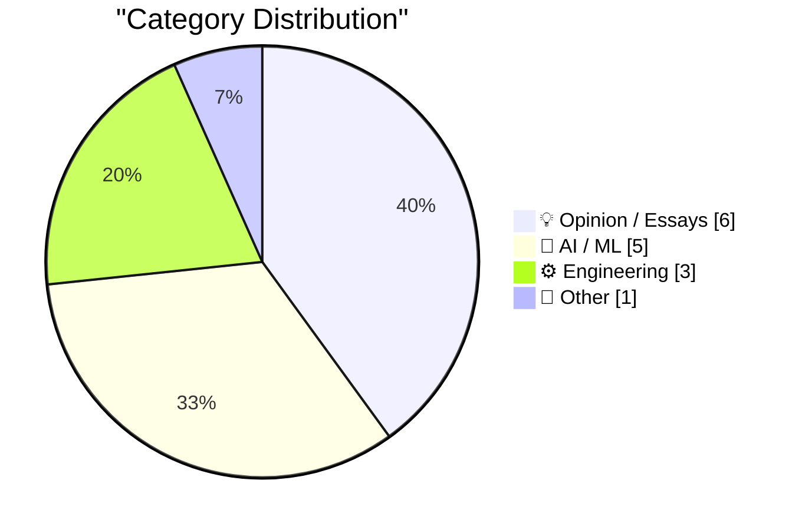
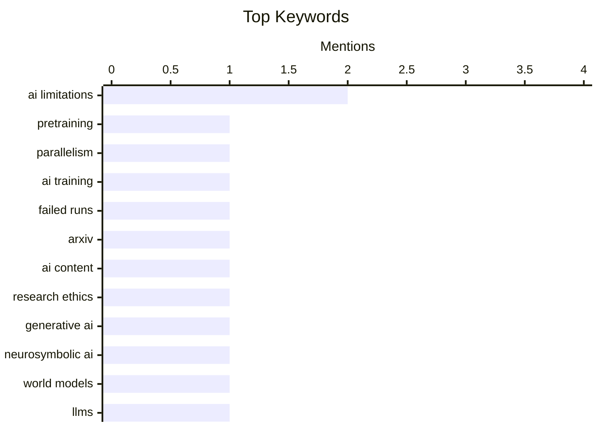

## Today's Highlights
Today's tech news highlights a critical re-evaluation of Artificial Intelligence, with experts questioning the true capabilities of Generative AI and the efficacy of certain training methods. As engineers find practical applications for LLMs, the research community is tightening standards against AI-generated "slop" to maintain integrity. This comes amidst broader discussions on platform accountability, from lawsuits against major social media companies over scam ads to debates on open source adoption in public services.
---
## Must Read Today
1. **Notes on pretraining parallelisms and failed training runs.**
[Notes on pretraining parallelisms and failed training runs.](https://www.dwarkesh.com/p/notes-on-pretraining-parallelisms) — dwarkesh.com · 19h ago · 🤖 AI / ML
> This article delves into the intricate challenges and strategies involved in pretraining large language models, specifically focusing on parallelism techniques and common causes of training failures. It likely explores various parallelism types, such as data, model, and pipeline parallelism, outlining their respective trade-offs and implementation complexities. The discussion probably covers practical issues like hardware faults, software bugs, and hyperparameter misconfigurations that frequently lead to unsuccessful training runs. The core takeaway emphasizes the substantial engineering effort, empirical knowledge, and iterative debugging required to successfully scale and stabilize large-scale AI model pretraining.
💡 **Why read it**: It offers crucial insights into the practical difficulties and engineering solutions essential for successful large-scale AI model pretraining, making it valuable for practitioners.
🏷️ Pretraining, Parallelism, AI training, Failed runs
2. **ArXiv to Ban Researchers for a Year if They Submit AI Slop**
[ArXiv to Ban Researchers for a Year if They Submit AI Slop](https://www.404media.co/new-arxiv-rules-ai-generated-papers-ban/) — daringfireball.net · 18h ago · 🤖 AI / ML
> ArXiv is implementing stringent new penalties for researchers who submit papers containing AI-generated content deemed "slop," including inappropriate language, plagiarism, biased content, errors, or incorrect references. Thomas Dietterich, chair of ArXiv's computer science section, clarified that authors bear full responsibility for any AI tool outputs included in their scientific works. Submissions found with "incontrovertible evidence" of such problematic AI-generated material will result in a one-year ban for the submitting authors. This policy aims to uphold the quality and integrity of scientific publications on the prominent preprint server.
💡 **Why read it**: This article highlights a significant policy shift by a major scientific preprint server regarding AI-generated content, impacting academic publishing standards and author responsibilities.
🏷️ ArXiv, AI content, research ethics
3. **The illusion of Generative AI, the insanity of massive bets on hyperscaling, and the case for world models and neurosymbolic AI**
[The illusion of Generative AI, the insanity of massive bets on hyperscaling, and the case for world models and neurosymbolic AI](https://garymarcus.substack.com/p/the-illusion-of-generative-ai-the) — garymarcus.substack.com · 5h ago · 🤖 AI / ML
> This article critically examines the current state of Generative AI, arguing that its perceived capabilities often create an "illusion" and that the industry's focus on "hyperscaling" is misguided and unsustainable. Gary Marcus advocates for alternative AI paradigms, specifically "world models" and "neurosymbolic AI," to address the fundamental limitations of current large language models. He suggests that integrating symbolic reasoning with neural networks could lead to more robust, reliable, and genuinely intelligent AI systems. The core argument is that current LLMs lack true understanding and common sense, necessitating a shift in research direction towards hybrid approaches.
💡 **Why read it**: It provides a critical perspective on the limitations of current Generative AI and proposes alternative research directions like neurosymbolic AI, challenging prevailing industry trends.
🏷️ Generative AI, Neurosymbolic AI, World Models, AI limitations
---
## Data Overview
| Sources Scanned | Articles Fetched | Time Window | Selected |
|:---:|:---:|:---:|:---:|
| 87/92 | 2507 -> 17 | 24h | **15** |
### Category Distribution

### Top Keywords

<details>
<summary>Plain Text Keyword Chart (Terminal Friendly)</summary>
```
ai limitations   │ ████████████████████ 2
pretraining      │ ██████████░░░░░░░░░░ 1
parallelism      │ ██████████░░░░░░░░░░ 1
ai training      │ ██████████░░░░░░░░░░ 1
failed runs      │ ██████████░░░░░░░░░░ 1
arxiv            │ ██████████░░░░░░░░░░ 1
ai content       │ ██████████░░░░░░░░░░ 1
research ethics  │ ██████████░░░░░░░░░░ 1
generative ai    │ ██████████░░░░░░░░░░ 1
neurosymbolic ai │ ██████████░░░░░░░░░░ 1
```
</details>
### Topic Tags
**ai limitations**(2) · **pretraining**(1) · **parallelism**(1) · ai training(1) · failed runs(1) · arxiv(1) · ai content(1) · research ethics(1) · generative ai(1) · neurosymbolic ai(1) · world models(1) · llms(1) · developer tools(1) · engineering workflow(1) · rlhf(1) · science(1) · verification(1) · ai(1) · product strategy(1) · rust(1)
---
## Opinion / Essays
### 1. ★ AI Is Technology, Not a Product
[★ AI Is Technology, Not a Product](https://daringfireball.net/2026/05/ai_is_technology_not_a_product) — **daringfireball.net** · 17h ago · ⭐ 25/30
> This article argues that Artificial Intelligence should be fundamentally understood as a foundational technology, not a standalone product or even merely a feature. The author contends that AI serves as an underlying capability designed to enhance and empower existing products and services across diverse domains. It suggests that companies attempting to market "AI products" are missing the core value proposition, as AI's true impact lies in its seamless integration to improve functionality, efficiency, and user experience within broader systems. The core takeaway is to perceive AI as an enabling layer, akin to electricity or the internet, that drives innovation across industries.
🏷️ AI, product strategy
---
### 2. GDS weighs in on the NHS's decision to retreat from Open Source
[GDS weighs in on the NHS's decision to retreat from Open Source](https://shkspr.mobi/blog/2026/05/gds-weighs-in-on-the-nhss-decision-to-retreat-from-open-source/) — **shkspr.mobi** · 2h ago · ⭐ 24/30
> This article reports on the UK's Government Digital Service (GDS) publicly expressing strong disagreement with the National Health Service's (NHS) decision to reduce its reliance on open-source software. This intervention by the GDS is described as a rare public internal conflict within the Civil Service, indicating a significant policy divergence. The NHS's retreat likely involves a shift towards proprietary solutions, which the GDS, a staunch advocate for open standards and open source, views critically. This highlights a notable internal struggle over digital strategy within UK government initiatives.
🏷️ Open Source, government IT, policy
---
### 3. Reddit Is Blocking Some Users From Accessing Its Website From Mobile Devices
[Reddit Is Blocking Some Users From Accessing Its Website From Mobile Devices](https://arstechnica.com/information-technology/2026/05/why-reddit-blocked-my-daily-visit-to-its-mobile-website/) — **daringfireball.net** · 16h ago · ⭐ 23/30
> Reddit is reportedly implementing an aggressive strategy to force mobile web users onto its native application by blocking access to its website from mobile devices. Users, including Nate Anderson of Ars Technica, are encountering an unskippable overlay that explicitly prompts them to "Get the app to keep using Reddit." This overlay provides no option to bypass or close it, effectively preventing continued use of the mobile web version. This tactic aims to increase app engagement and control the user experience, reflecting a growing trend among platforms to push users towards their proprietary applications.
🏷️ Reddit, mobile app, platform strategy
---
### 4. The mistake of conflating intelligence and power
[The mistake of conflating intelligence and power](https://www.dwarkesh.com/p/the-mistake-of-conflating-intelligence) — **dwarkesh.com** · 18h ago · ⭐ 22/30
> This article argues against the common misconception of equating intelligence with the ability to achieve goals or exert power. It differentiates intelligence, defined as the ability to learn and adapt, from power, which is the capacity to achieve desired outcomes. Using examples like Stalin, the author illustrates that a powerful individual might not be highly intelligent in a general sense, but rather effective due to specific circumstances, resources, or ruthlessness. Conflating these concepts leads to misjudging AI capabilities and human historical figures, as power can be derived from many sources beyond pure cognitive ability. Understanding this distinction is crucial for accurately assessing both human and artificial agents, preventing misattributions of cognitive prowess based solely on observed influence or success.
🏷️ Intelligence, AI ethics, Philosophy
---
### 5. Quoting Julia Evans
[Quoting Julia Evans](https://simonwillison.net/2026/May/16/julia-evans/#atom-everything) — **simonwillison.net** · 21h ago · ⭐ 21/30
> The article highlights Julia Evans' perspective on overcoming the common frustration and devaluation of CSS as a technology. Evans, after years of struggle, decided to take CSS seriously and improve her understanding rather than dismissing it. She discovered that many common frustrations, such as 'centering is impossible,' had already been addressed by CSS itself through features like Flexbox and Grid. Her approach involved dedicated learning and respecting CSS as a powerful technology, which fundamentally transformed her development experience. This suggests that many developers' struggles with CSS stem from a lack of dedicated learning and an outdated perception of its capabilities. By investing time to truly understand and respect CSS, developers can transform their experience from frustration to proficiency.
🏷️ CSS, web development, skill improvement
---
### 6. The Applicability of Spaced Repetition
[The Applicability of Spaced Repetition](https://borretti.me/article/the-applicability-of-spaced-repetition) — **borretti.me** · 14h ago · ⭐ 19/30
> The article explores the effective application of spaced repetition systems (SRS) and distinguishes between factual and conceptual knowledge for learning. Spaced repetition is highly effective for memorizing factual knowledge, such as definitions, vocabulary, or specific commands, by optimizing review intervals. However, it is less suitable for learning conceptual knowledge, which requires understanding relationships, problem-solving, and synthesis rather than mere recall. The author suggests that while SRS can reinforce the building blocks of conceptual knowledge, true understanding comes from active engagement, practice, and applying those facts in various contexts. Spaced repetition is a powerful tool for factual recall but should be strategically combined with other learning methods for developing deep conceptual understanding and problem-solving skills.
🏷️ Spaced Repetition, Learning, Knowledge
---
## AI / ML
### 7. Notes on pretraining parallelisms and failed training runs.
[Notes on pretraining parallelisms and failed training runs.](https://www.dwarkesh.com/p/notes-on-pretraining-parallelisms) — **dwarkesh.com** · 19h ago · ⭐ 29/30
> This article delves into the intricate challenges and strategies involved in pretraining large language models, specifically focusing on parallelism techniques and common causes of training failures. It likely explores various parallelism types, such as data, model, and pipeline parallelism, outlining their respective trade-offs and implementation complexities. The discussion probably covers practical issues like hardware faults, software bugs, and hyperparameter misconfigurations that frequently lead to unsuccessful training runs. The core takeaway emphasizes the substantial engineering effort, empirical knowledge, and iterative debugging required to successfully scale and stabilize large-scale AI model pretraining.
🏷️ Pretraining, Parallelism, AI training, Failed runs
---
### 8. ArXiv to Ban Researchers for a Year if They Submit AI Slop
[ArXiv to Ban Researchers for a Year if They Submit AI Slop](https://www.404media.co/new-arxiv-rules-ai-generated-papers-ban/) — **daringfireball.net** · 18h ago · ⭐ 27/30
> ArXiv is implementing stringent new penalties for researchers who submit papers containing AI-generated content deemed "slop," including inappropriate language, plagiarism, biased content, errors, or incorrect references. Thomas Dietterich, chair of ArXiv's computer science section, clarified that authors bear full responsibility for any AI tool outputs included in their scientific works. Submissions found with "incontrovertible evidence" of such problematic AI-generated material will result in a one-year ban for the submitting authors. This policy aims to uphold the quality and integrity of scientific publications on the prominent preprint server.
🏷️ ArXiv, AI content, research ethics
---
### 9. The illusion of Generative AI, the insanity of massive bets on hyperscaling, and the case for world models and neurosymbolic AI
[The illusion of Generative AI, the insanity of massive bets on hyperscaling, and the case for world models and neurosymbolic AI](https://garymarcus.substack.com/p/the-illusion-of-generative-ai-the) — **garymarcus.substack.com** · 5h ago · ⭐ 27/30
> This article critically examines the current state of Generative AI, arguing that its perceived capabilities often create an "illusion" and that the industry's focus on "hyperscaling" is misguided and unsustainable. Gary Marcus advocates for alternative AI paradigms, specifically "world models" and "neurosymbolic AI," to address the fundamental limitations of current large language models. He suggests that integrating symbolic reasoning with neural networks could lead to more robust, reliable, and genuinely intelligent AI systems. The core argument is that current LLMs lack true understanding and common sense, necessitating a shift in research direction towards hybrid approaches.
🏷️ Generative AI, Neurosymbolic AI, World Models, AI limitations
---
### 10. How I use LLMs as a staff engineer in 2026
[How I use LLMs as a staff engineer in 2026](https://seangoedecke.com/how-i-use-llms-in-2026/) — **seangoedecke.com** · 14h ago · ⭐ 26/30
> This article, an update to a previous post, details how a staff engineer effectively integrates Large Language Models (LLMs) into their daily workflow in 2026. Key applications include leveraging smart autocomplete with GitHub Copilot, making short tactical code changes in unfamiliar areas (always with SME review), and generating disposable research code for quick experimentation. The author also uses LLMs extensively for learning new topics, such as the Unity game engine, and as a last-resort tool for debugging complex issues. This demonstrates a practical, human-in-the-loop approach where LLMs augment engineering capabilities rather than fully automating them.
🏷️ LLMs, developer tools, engineering workflow
---
### 11. RLVR might be disproportionately bad at science
[RLVR might be disproportionately bad at science](https://www.dwarkesh.com/p/rlvr-might-be-disproportionately) — **dwarkesh.com** · 19h ago · ⭐ 26/30
> This article proposes that Reinforcement Learning from Value-based Rewards (RLVR), encompassing methods like RLHF, may be fundamentally ill-suited for scientific discovery. The core issue stems from the protracted and often counter-intuitive nature of scientific verification, where theory validation can take decades or centuries, and initially "better" theories might yield worse predictions. RLVR's reliance on immediate or short-term feedback struggles with this delayed, complex, and sometimes misleading reward structure inherent in scientific progress. The article concludes that the slow, iterative, and often paradigm-shifting process of scientific advancement is fundamentally misaligned with the rapid, feedback-driven optimization of RLVR.
🏷️ RLHF, AI limitations, Science, Verification
---
## Engineering
### 12. Warelay -> OpenClaw
[Warelay -> OpenClaw](https://simonwillison.net/2026/May/16/openclaw-names/#atom-everything) — **simonwillison.net** · 17h ago · ⭐ 24/30
> This article chronicles the naming evolution of the project now known as "OpenClaw," revealing its previous moniker, "Warelay." The author, Simon Willison, utilized a custom `first_line_history.py` tool to trace the project's naming changes since its initial commit in November. This piece offers a brief, anecdotal glimpse into the iterative and sometimes whimsical process of open-source project development, including the practicalities of branding and rebranding. It highlights how metadata tools can provide insights into a software project's historical journey.
🏷️ Rust, compiler, performance
---
### 13. Here Comes (Forward Deployed) Everybody
[Here Comes (Forward Deployed) Everybody](https://worksonmymachine.ai/p/here-comes-forward-deployed-everybody) — **worksonmymachine.substack.com** · 15m ago · ⭐ 23/30
> The article discusses the increasing prevalence and importance of "Forward Deployed" roles, which bridge the gap between product development and customer application. These roles, encompassing titles like Solutions Architect or Customer Success Engineer, are critical for deeply integrating and customizing complex technical products, especially in AI/ML. They require individuals to act as product managers, engineers, and sales, understanding customer needs and adapting technology on-site. This trend is driven by the complexity of modern tech, necessitating hands-on, domain-specific deployment. The "Forward Deployed" model is expanding beyond traditional enterprise software, becoming an essential and ubiquitous function across various tech companies.
🏷️ Forward Deployed, Engineering roles, Tech careers
---
### 14. A nicer voltmeter clock
[A nicer voltmeter clock](https://lcamtuf.substack.com/p/a-nicer-voltmeter-clock) — **lcamtuf.substack.com** · 15h ago · ⭐ 15/30
> The article details the design and construction of an aesthetically pleasing clock using vintage voltmeters, addressing the challenge of integrating electronics with a custom enclosure. The project involved sourcing vintage voltmeters and designing custom electronics, including a microcontroller (e.g., ESP32 for Wi-Fi time sync) and precise voltage control for the analog needles. A significant portion of the effort focused on crafting a high-quality wooden enclosure, emphasizing woodworking skills as crucial for the final product's appeal. The author highlights the iterative process of circuit design, calibration, and mechanical integration to achieve a functional and visually appealing device. Building a sophisticated electronic device often requires a multidisciplinary approach, where mechanical design and craftsmanship are as critical as the electronic engineering for achieving a polished and desirable final product.
🏷️ electronics, circuit design, hardware
---
## Other
### 15. Santa Clara County Sues Meta Over Alleged Scam Ads
[Santa Clara County Sues Meta Over Alleged Scam Ads](https://sanjosespotlight.com/santa-clara-county-sues-meta-over-alleged-scam-ads/) — **daringfireball.net** · 16h ago · ⭐ 24/30
> Santa Clara County has filed a lawsuit against Meta, alleging that the company has actively failed to curb deceptive scam advertisements on its platforms. The lawsuit claims Meta deliberately hampered its own fraud prevention teams and facilitated fake companies in bypassing its filters. This alleged negligence allowed Meta to profit from an estimated $7 billion in ad revenue annually generated by these scams. The county is seeking attorney fees and a court order to prevent Meta from further alleged violations of false advertising laws, highlighting significant concerns about platform accountability.
🏷️ Meta, lawsuit, scam ads
---
*Generated at 2026-05-17 14:01 | Scanned 87 sources -> 2507 articles -> selected 15*
*Based on the [Hacker News Popularity Contest 2025](https://refactoringenglish.com/tools/hn-popularity/) RSS source list recommended by [Andrej Karpathy](https://x.com/karpathy)*
*Produced by Dongdianr AI. Follow the same-name WeChat public account for more AI practical tips 💡*
