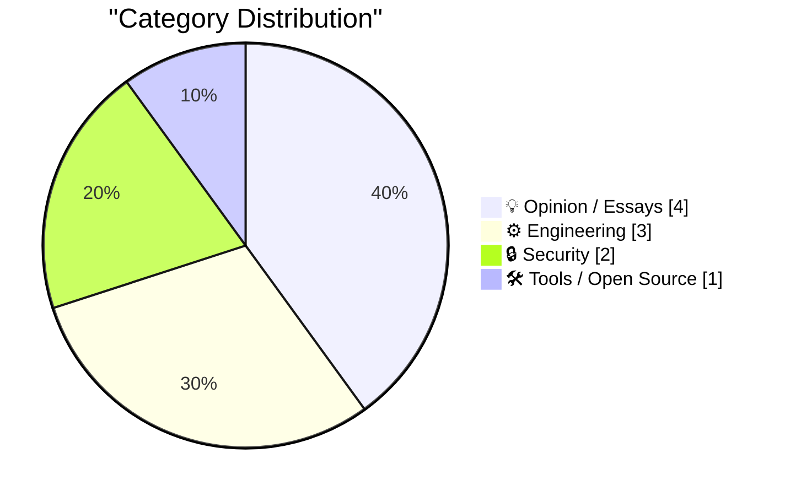
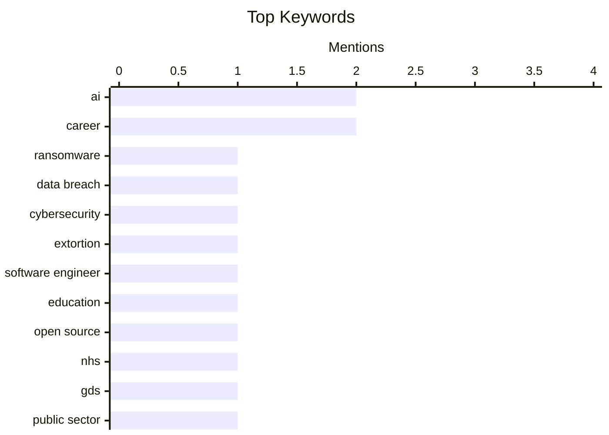

## Today's Highlights
Today's tech highlights a fundamental shift in engineering, with AI increasingly redefining the role of software professionals into "AI Enabled Engineers." Cybersecurity remains paramount, sparking debates on handling data leaks while driving demand for automated compliance and risk management solutions. Concurrently, the industry is re-evaluating engineering culture, from open source adoption strategies to efficient system optimization, as it adapts to new economic realities and technological advancements.
---
## Must Read Today
1. **Weekly Update 504**
[Weekly Update 504](https://www.troyhunt.com/weekly-update-504/) — troyhunt.com · 10h ago · 🔒 Security
> The article discusses the ongoing debate around paying or not paying hackers to prevent data leaks after a breach. It highlights recent cases, specifically mentioning Grafana's decision to adopt a "no pay" approach, illustrating the ethical and practical implications of negotiating with threat actors. The core issue revolves around the complex dilemma organizations face when confronted with data exfiltration and ransom demands. The main takeaway is that there is no easy answer to this critical cybersecurity challenge, requiring careful consideration of various factors.
💡 **Why read it**: It provides a timely update and perspective on the critical and evolving cybersecurity dilemma of ransomware payments and data extortion.
🏷️ Ransomware, Data Breach, Cybersecurity, Extortion
2. **Don't call yourself a Software Engineer, you are an AI Enabled Engineer.**
[Don't call yourself a Software Engineer, you are an AI Enabled Engineer.](https://idiallo.com/blog/you-are-an-ai-enabled-engineer-now?src=feed) — idiallo.com · 2h ago · 💡 Opinion / Essays
> The article argues that the traditional "Software Engineer" title is outdated, proposing "AI Enabled Engineer" to reflect the current landscape. It questions how programming is taught in colleges versus the demands of the job market, where AI tools are becoming ubiquitous. The author suggests that modern engineers must integrate AI into their workflows, not just as a tool but as a fundamental aspect of their skill set. The core message is that adapting to AI's pervasive influence is crucial for career relevance and effectiveness in software development.
💡 **Why read it**: It offers a provocative perspective on the evolving role of software engineers in the age of AI and its implications for education and career development.
🏷️ AI, Software Engineer, Career, Education
3. **GDS weighs in on the NHS's decision to retreat from Open Source**
[GDS weighs in on the NHS's decision to retreat from Open Source](https://simonwillison.net/2026/May/17/gds-weighs-in/#atom-everything) — simonwillison.net · 22h ago · ⚙️ Engineering
> The article reports on the UK's Government Digital Service (GDS) criticizing the NHS's recent decision to close access to its open-source repositories. This retreat from open source by the NHS was reportedly in response to vulnerabilities disclosed as part of a security program. The GDS's intervention underscores the importance of transparency and collaborative security practices inherent in open source, even when dealing with security concerns. The main takeaway is that closing off open-source projects due to security reports is a poorly considered decision that goes against best practices for public sector software development.
💡 **Why read it**: It highlights a significant debate on open-source policy within public sector organizations, particularly concerning security vulnerability management.
🏷️ Open Source, NHS, GDS, Public Sector
---
## Data Overview
| Sources Scanned | Articles Fetched | Time Window | Selected |
|:---:|:---:|:---:|:---:|
| 87/92 | 2523 -> 10 | 24h | **10** |
### Category Distribution

### Top Keywords

<details>
<summary>Plain Text Keyword Chart (Terminal Friendly)</summary>
```
ai                │ ████████████████████ 2
career            │ ████████████████████ 2
ransomware        │ ██████████░░░░░░░░░░ 1
data breach       │ ██████████░░░░░░░░░░ 1
cybersecurity     │ ██████████░░░░░░░░░░ 1
extortion         │ ██████████░░░░░░░░░░ 1
software engineer │ ██████████░░░░░░░░░░ 1
education         │ ██████████░░░░░░░░░░ 1
open source       │ ██████████░░░░░░░░░░ 1
nhs               │ ██████████░░░░░░░░░░ 1
```
</details>
### Topic Tags
**ai**(2) · **career**(2) · **ransomware**(1) · data breach(1) · cybersecurity(1) · extortion(1) · software engineer(1) · education(1) · open source(1) · nhs(1) · gds(1) · public sector(1) · senior engineer(1) · zirp(1) · tech culture(1) · haproxy(1) · performance(1) · optimization(1) · system design(1) · code comprehension(1)
---
## Opinion / Essays
### 1. Don't call yourself a Software Engineer, you are an AI Enabled Engineer.
[Don't call yourself a Software Engineer, you are an AI Enabled Engineer.](https://idiallo.com/blog/you-are-an-ai-enabled-engineer-now?src=feed) — **idiallo.com** · 2h ago · ⭐ 26/30
> The article argues that the traditional "Software Engineer" title is outdated, proposing "AI Enabled Engineer" to reflect the current landscape. It questions how programming is taught in colleges versus the demands of the job market, where AI tools are becoming ubiquitous. The author suggests that modern engineers must integrate AI into their workflows, not just as a tool but as a fundamental aspect of their skill set. The core message is that adapting to AI's pervasive influence is crucial for career relevance and effectiveness in software development.
🏷️ AI, Software Engineer, Career, Education
---
### 2. The just-say-no engineer was a ZIRP phenomenon
[The just-say-no engineer was a ZIRP phenomenon](https://seangoedecke.com/the-just-say-no-engineer-was-a-zirp-phenomenon/) — **seangoedecke.com** · 14h ago · ⭐ 24/30
> This article posits that the "just-say-no" engineer, characterized by their tendency to block features and minimize code complexity, was largely a product of the Zero Interest Rate Policy (ZIRP) era. During ZIRP, companies prioritized growth and could afford to hire engineers focused on long-term maintainability and avoiding technical debt, even if it meant slower feature development. With the shift to higher interest rates and a focus on profitability, the demand for engineers who rapidly deliver features has increased, making the "just-say-no" archetype less viable. The core argument is that economic conditions significantly influence the perceived value and role of different engineering archetypes.
🏷️ Senior Engineer, ZIRP, Tech Culture, Career
---
### 3. How to be inspired without copying
[How to be inspired without copying](https://www.joanwestenberg.com/how-to-be-inspired-without-copying/) — **joanwestenberg.com** · 15h ago · ⭐ 19/30
> The article explores the fine line between inspiration and outright copying, using the historical example of Johann Sebastian Bach transcribing Antonio Vivaldi's concertos. Bach meticulously copied at least nine of Vivaldi's "L'estro armonico" concertos, not to plagiarize, but to deeply understand and internalize the compositional techniques. This process allowed him to learn, adapt, and ultimately develop his unique style, demonstrating that deep study of others' work can be a catalyst for original creation. The core message is that true inspiration involves dissecting and understanding the underlying principles of a work, then synthesizing those lessons into something new and distinct.
🏷️ Creativity, Inspiration, Learning, Innovation
---
### 4. Cyberrebate.com: The worst dotcom-era idea?
[Cyberrebate.com: The worst dotcom-era idea?](https://dfarq.homeip.net/cyberrebate-com-the-worst-dotcom-era-idea/?utm_source=rss&#038;utm_medium=rss&#038;utm_campaign=cyberrebate-com-the-worst-dotcom-era-idea) — **dfarq.homeip.net** · 3h ago · ⭐ 17/30
> The article revisits Cyberrebate.com, presenting it as a prime example of the absurd business models prevalent during the dotcom bubble. This company offered products, often electronics, for free after a mail-in rebate, with the catch being that rebates were paid out over several months. The business model relied on the assumption that many customers would forget to claim rebates or that the company could generate enough ad revenue to cover the costs, which proved unsustainable. Cyberrebate.com ultimately collapsed, leaving many customers unpaid and illustrating the speculative nature of many "freemium" models of that era. The main takeaway is a cautionary tale about unsustainable business models.
🏷️ Dotcom Bubble, Business Model, Tech History, Freemium
---
## Engineering
### 5. GDS weighs in on the NHS's decision to retreat from Open Source
[GDS weighs in on the NHS's decision to retreat from Open Source](https://simonwillison.net/2026/May/17/gds-weighs-in/#atom-everything) — **simonwillison.net** · 22h ago · ⭐ 24/30
> The article reports on the UK's Government Digital Service (GDS) criticizing the NHS's recent decision to close access to its open-source repositories. This retreat from open source by the NHS was reportedly in response to vulnerabilities disclosed as part of a security program. The GDS's intervention underscores the importance of transparency and collaborative security practices inherent in open source, even when dealing with security concerns. The main takeaway is that closing off open-source projects due to security reports is a poorly considered decision that goes against best practices for public sector software development.
🏷️ Open Source, NHS, GDS, Public Sector
---
### 6. FediMeteo, HAProxy, and the art of not wasting snac threads
[FediMeteo, HAProxy, and the art of not wasting snac threads](https://it-notes.dragas.net/2026/05/18/fedimeteo-haproxy-and-the-art-of-not-wasting-snac-threads/) — **it-notes.dragas.net** · 4h ago · ⭐ 24/30
> The article details optimization efforts for FediMeteo, a weather service running on a tiny FreeBSD VPS, focusing on efficient resource utilization with HAProxy. The author configured HAProxy to handle HTTP requests and pass them to a single-threaded `snac` backend. Key optimization involved using HAProxy's `http-request set-header X-Forwarded-Proto https if { ssl_fc }` and `http-request set-header X-Forwarded-Port %[dst_port]` directives. This setup ensures `snac` only processes secure requests, preventing it from wasting threads on HTTP-to-HTTPS redirects. The result is significantly improved efficiency and reduced resource consumption on the small VPS.
🏷️ HAProxy, Performance, Optimization, System Design
---
### 7. Always Be Blaming
[Always Be Blaming](https://matklad.github.io/2026/05/18/always-be-blaming.html) — **matklad.github.io** · 14h ago · ⭐ 23/30
> The article, despite its provocative title, focuses on advanced techniques for debugging and understanding complex codebases, framed as "4D-ing your code comprehension skills." It likely delves into methodologies for systematically identifying the root causes of issues, which can sometimes feel like "blaming" specific code sections or design choices. The core idea is to develop a deep, multi-dimensional understanding of how code behaves and why, rather than just fixing symptoms. The main takeaway is to adopt rigorous, analytical approaches to code comprehension and problem-solving, leading to more effective debugging and system improvement.
🏷️ Code Comprehension, Programming Skills, Software Engineering
---
## Security
### 8. Weekly Update 504
[Weekly Update 504](https://www.troyhunt.com/weekly-update-504/) — **troyhunt.com** · 10h ago · ⭐ 27/30
> The article discusses the ongoing debate around paying or not paying hackers to prevent data leaks after a breach. It highlights recent cases, specifically mentioning Grafana's decision to adopt a "no pay" approach, illustrating the ethical and practical implications of negotiating with threat actors. The core issue revolves around the complex dilemma organizations face when confronted with data exfiltration and ransom demands. The main takeaway is that there is no easy answer to this critical cybersecurity challenge, requiring careful consideration of various factors.
🏷️ Ransomware, Data Breach, Cybersecurity, Extortion
---
### 9. Drata
[Drata](https://drata.com/daring) — **daringfireball.net** · 20h ago · ⭐ 10/30
> This short sponsored post introduces Drata, a platform designed to automate compliance, manage risk, and continuously prove security posture. Drata leverages autonomous AI agents to streamline these processes, aiming to reduce the manual effort typically associated with security and compliance frameworks. The core offering is a solution for organizations to maintain and demonstrate their security and compliance status efficiently. The main takeaway is that Drata provides an AI-powered platform to automate and simplify complex security compliance and risk management tasks.
🏷️ Compliance, AI, Security, Risk Management
---
## Tools / Open Source
### 10. How I Use My Index 01 + Production Update
[How I Use My Index 01 + Production Update](https://repebble.com/blog/how-i-use-my-index-01-production-update) — **ericmigi.com** · 14h ago · ⭐ 12/30
> This article provides an update on the production of the "Index 01" product and demonstrates its practical usage. The author notes that production is currently behind schedule but remains on track for eventual delivery. The core of the article focuses on how the author personally uses the Index 01, likely showcasing its features and design philosophy through demos. The main takeaway is a transparent update on product development combined with a user-centric demonstration of the device's utility and design principles.
🏷️ Product Update, Product Design, Demos
---
*Generated at 2026-05-18 14:01 | Scanned 87 sources -> 2523 articles -> selected 10*
*Based on the [Hacker News Popularity Contest 2025](https://refactoringenglish.com/tools/hn-popularity/) RSS source list recommended by [Andrej Karpathy](https://x.com/karpathy)*
*Produced by Dongdianr AI. Follow the same-name WeChat public account for more AI practical tips 💡*
