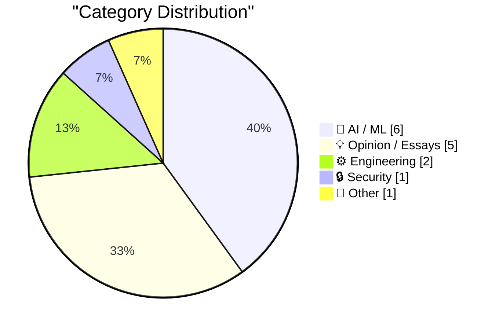
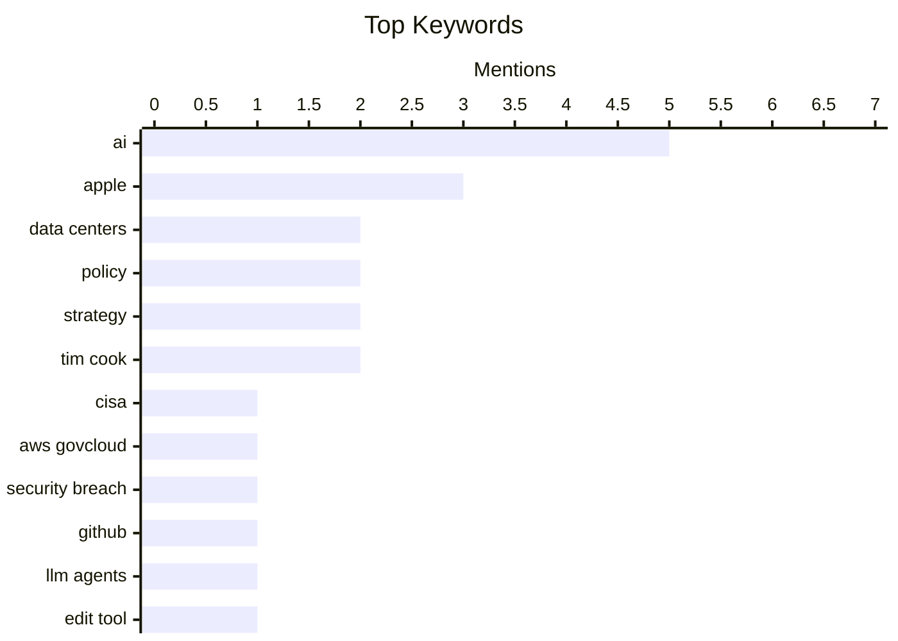

## Today's Highlights
The artificial intelligence sector is navigating a complex period, with a high-profile lawsuit between Elon Musk and Sam Altman concluding quietly, while public opposition to AI data centers grows nationwide. Despite these societal and legal challenges, the rapid development of Large Language Models continues apace. Concurrently, a significant cybersecurity lapse saw a government contractor expose sensitive keys, underscoring persistent vulnerabilities across the digital landscape.
---
## Must Read Today
1. **CISA Admin Leaked AWS GovCloud Keys on Github**
[CISA Admin Leaked AWS GovCloud Keys on Github](https://krebsonsecurity.com/2026/05/cisa-admin-leaked-aws-govcloud-keys-on-github/) — krebsonsecurity.com · 17h ago · 🔒 Security
> A contractor for the Cybersecurity & Infrastructure Security Agency (CISA) publicly exposed highly privileged AWS GovCloud credentials and internal CISA system details on GitHub. The public repository contained files detailing CISA's software build, test, and deployment processes. Security experts deemed this one of the most egregious government data leaks in recent history. This incident highlights critical vulnerabilities in managing sensitive government cloud credentials and internal system configurations.
💡 **Why read it**: It reveals a severe government data leak involving AWS GovCloud keys and internal system configurations, underscoring the critical importance of secure credential management.
🏷️ CISA, AWS GovCloud, security breach, GitHub
2. **Alternatives for the EDIT tool of LLM agents**
[Alternatives for the EDIT tool of LLM agents](http://antirez.com/news/166) — antirez.com · 6h ago · 🤖 AI / ML
> The current 'EDIT' tool used by LLM agents for local inference is inefficient, forcing the LLM to emit the old version of content, which is token-poor. The author is exploring alternatives for their DS4 project to optimize token usage in local inference, mentioning a CRC32 compromise as an interesting tradeoff. This approach aims to improve efficiency in resource-constrained environments. Optimizing LLM agent tools for local inference is crucial for token efficiency, and alternative approaches like the CRC32 compromise warrant further discussion.
💡 **Why read it**: It discusses critical token optimization challenges for LLM agents in local inference and proposes alternative approaches like the CRC32 compromise.
🏷️ LLM Agents, EDIT tool, CRC32, Optimization
3. **Jury Rejects Elon Musk’s Claim Against Sam Altman in Unanimous Verdict**
[Jury Rejects Elon Musk’s Claim Against Sam Altman in Unanimous Verdict](https://www.nytimes.com/live/2026/05/18/technology/openai-trial-verdict-altman-musk?unlocked_article_code=1.jVA.Cc2V.IwYuu2r4SJfQ) — daringfireball.net · 20h ago · 🤖 AI / ML
> A nine-person jury unanimously rejected Elon Musk's lawsuit against OpenAI and Sam Altman. The jury found that Musk filed his suit in summer 2024, but was aware of the alleged behavior discussed in his complaint as far back as 2021, exceeding the three-year statute of limitations. This procedural finding led to the dismissal of the case. The lawsuit was dismissed due to procedural grounds related to the statute of limitations, rather than the merits of the claims.
💡 **Why read it**: It reports on the dismissal of Elon Musk's high-profile lawsuit against OpenAI and Sam Altman, highlighting the legal implications of the statute of limitations in tech disputes.
🏷️ Elon Musk, Sam Altman, OpenAI, lawsuit
---
## Data Overview
| Sources Scanned | Articles Fetched | Time Window | Selected |
|:---:|:---:|:---:|:---:|
| 87/92 | 2508 -> 22 | 24h | **15** |
### Category Distribution

### Top Keywords

<details>
<summary>Plain Text Keyword Chart (Terminal Friendly)</summary>
```
ai              │ ████████████████████ 5
apple           │ ████████████░░░░░░░░ 3
data centers    │ ████████░░░░░░░░░░░░ 2
policy          │ ████████░░░░░░░░░░░░ 2
strategy        │ ████████░░░░░░░░░░░░ 2
tim cook        │ ████████░░░░░░░░░░░░ 2
cisa            │ ████░░░░░░░░░░░░░░░░ 1
aws govcloud    │ ████░░░░░░░░░░░░░░░░ 1
security breach │ ████░░░░░░░░░░░░░░░░ 1
github          │ ████░░░░░░░░░░░░░░░░ 1
```
</details>
### Topic Tags
**ai**(5) · **apple**(3) · **data centers**(2) · policy(2) · strategy(2) · tim cook(2) · cisa(1) · aws govcloud(1) · security breach(1) · github(1) · llm agents(1) · edit tool(1) · crc32(1) · optimization(1) · elon musk(1) · sam altman(1) · openai(1) · lawsuit(1) · legal(1) · ethics(1)
---
## AI / ML
### 1. Alternatives for the EDIT tool of LLM agents
[Alternatives for the EDIT tool of LLM agents](http://antirez.com/news/166) — **antirez.com** · 6h ago · ⭐ 28/30
> The current 'EDIT' tool used by LLM agents for local inference is inefficient, forcing the LLM to emit the old version of content, which is token-poor. The author is exploring alternatives for their DS4 project to optimize token usage in local inference, mentioning a CRC32 compromise as an interesting tradeoff. This approach aims to improve efficiency in resource-constrained environments. Optimizing LLM agent tools for local inference is crucial for token efficiency, and alternative approaches like the CRC32 compromise warrant further discussion.
🏷️ LLM Agents, EDIT tool, CRC32, Optimization
---
### 2. Jury Rejects Elon Musk’s Claim Against Sam Altman in Unanimous Verdict
[Jury Rejects Elon Musk’s Claim Against Sam Altman in Unanimous Verdict](https://www.nytimes.com/live/2026/05/18/technology/openai-trial-verdict-altman-musk?unlocked_article_code=1.jVA.Cc2V.IwYuu2r4SJfQ) — **daringfireball.net** · 20h ago · ⭐ 27/30
> A nine-person jury unanimously rejected Elon Musk's lawsuit against OpenAI and Sam Altman. The jury found that Musk filed his suit in summer 2024, but was aware of the alleged behavior discussed in his complaint as far back as 2021, exceeding the three-year statute of limitations. This procedural finding led to the dismissal of the case. The lawsuit was dismissed due to procedural grounds related to the statute of limitations, rather than the merits of the claims.
🏷️ Elon Musk, Sam Altman, OpenAI, lawsuit
---
### 3. The last six months in LLMs in five minutes
[The last six months in LLMs in five minutes](https://simonwillison.net/2026/May/19/5-minute-llms/#atom-everything) — **simonwillison.net** · 12h ago · ⭐ 24/30
> This article aims to summarize the rapid developments in Large Language Models (LLMs) over the past six months concisely. The author created annotated slides for a five-minute lightning talk at PyCon US 2026, utilizing their 'annotated presentation tool' (latest iteration). This tool helps distill complex information into a quick, digestible format. The article provides a rapid overview of significant LLM advancements from the last half-year, presented through an innovative annotation tool.
🏷️ LLMs, AI, PyCon, summary
---
### 4. ‘AI, “Humanity”, and Dr. Manhattan Syndrome’
[‘AI, “Humanity”, and Dr. Manhattan Syndrome’](https://www.personfamiliar.com/p/ai-humanity-and-dr-manhattan-syndrome) — **daringfireball.net** · 21h ago · ⭐ 24/30
> The public's distrust of AI mirrors historical failures in communication and trust-building seen in industries like nuclear power. The article draws a parallel between the current discourse around AI and the nuclear power industry's past, where communication failures, rather than just disasters, eroded public trust. Nuclear pioneer Alvin Weinberg admitted in 1976 that 'public perception and acceptance' were critical, highlighting the danger of 'talking over the public.' Building public trust in AI requires transparent communication and addressing concerns directly, learning from past mistakes where industries failed to establish a 'reservoir of human-scale trust.'
🏷️ AI ethics, public perception, communication, societal impact
---
### 5. Define ‘Boom’ Please
[Define ‘Boom’ Please](https://www.nytimes.com/2026/04/21/business/how-apple-became-a-4-trillion-company-under-tim-cook.html?unlocked_article_code=1.jVA.MV8m.0JfUOJOME5WH) — **daringfireball.net** · 20h ago · ⭐ 23/30
> This article questions the assertion that Apple has "largely missed out on the artificial intelligence boom" despite its peers seeing AI-driven sales lifts. It highlights that Apple's profits and stock value continue to grow robustly, contrasting with companies like Nvidia whose market value is explicitly tied to the AI surge. The piece implies that Apple's sustained financial success under Tim Cook is not solely dependent on the current AI hype cycle. The core takeaway is that Apple's growth trajectory is distinct from the immediate AI boom affecting other tech giants.
🏷️ Apple, AI, strategy, Tim Cook
---
### 6. Existing Stakeholders Have a Say in the Future
[Existing Stakeholders Have a Say in the Future](https://daringfireball.net/2026/05/ai_is_technology_not_a_product) — **daringfireball.net** · 21h ago · ⭐ 23/30
> This article explores the future of AI, arguing it should be viewed as an integrated technology rather than a standalone product. It cites Steven Levy's vision where always-on AI agents would proactively manage daily tasks, such as arranging transportation without explicit user input. Levy suggests that by the end of the decade, users will simply tell their AI agent to get them home, or the agent will anticipate the need, eliminating the friction of current app interactions. The core takeaway is that AI's true potential lies in its seamless, anticipatory integration into daily life, moving beyond current product-centric models.
🏷️ Apple, AI product, strategy, Steven Levy
---
## Opinion / Essays
### 7. The AI trial of the century ends with a whimper
[The AI trial of the century ends with a whimper](https://garymarcus.substack.com/p/the-ai-trial-of-the-century-ends) — **garymarcus.substack.com** · 19h ago · ⭐ 27/30
> The highly anticipated 'AI trial of the century' concluded without revealing key details or arguments. The article implies that the trial ended inconclusively or on procedural grounds, preventing the public from learning specific insights or outcomes related to the core AI issues. The brief text suggests that many questions remain unanswered regarding the legal landscape of AI. The trial's quiet conclusion means that significant information and potential precedents regarding AI development will remain unknown.
🏷️ AI, Legal, Ethics, Trial
---
### 8. AI Data Centers Are Deeply Unpopular, Across the Political Spectrum
[AI Data Centers Are Deeply Unpopular, Across the Political Spectrum](https://news.gallup.com/poll/709772/americans-oppose-data-centers-area.aspx) — **daringfireball.net** · 23h ago · ⭐ 25/30
> A significant majority of Americans oppose the construction of AI data centers in their local areas. A Gallup poll revealed that 71% of Americans oppose local AI data center construction, with 48% strongly opposed, while only 25% favor such projects. This opposition is notably higher than the 53% who oppose local nuclear power plant construction in the same March survey. Public sentiment strongly disfavors local AI data center development, posing a potential challenge for the industry's expansion.
🏷️ AI, Data Centers, Public Opinion, Opposition
---
### 9. Pluralistic: There's no such thing as "age verification" (19 May 2026)
[Pluralistic: There's no such thing as "age verification" (19 May 2026)](https://pluralistic.net/2026/05/19/shes-dead-of-course/) — **pluralistic.net** · 6h ago · ⭐ 25/30
> The article argues that the concept of 'age verification' is fundamentally flawed and ineffective, leading to foreseeable negative consequences. Part of a broader collection of links, it critiques the implementation of age verification measures as a 'there, I've done something' approach without genuine efficacy. It implies that such measures often fail to achieve their intended goals and can introduce new problems. Age verification systems are largely performative and ineffective, failing to address underlying issues while potentially creating new ones.
🏷️ Age Verification, Privacy, Policy, Security
---
### 10. The Alaska Permanent Fund as Loose Precedent for AI Data Center ‘UBI’ Payments
[The Alaska Permanent Fund as Loose Precedent for AI Data Center ‘UBI’ Payments](https://en.wikipedia.org/wiki/Alaska_Permanent_Fund) — **daringfireball.net** · 22h ago · ⭐ 23/30
> This article introduces the Alaska Permanent Fund (APF) as a potential precedent for distributing wealth generated by new technologies like AI data centers, specifically for Universal Basic Income (UBI) payments. Established in 1976 by Governor Jay Hammond and Attorney General Avrum Gross, the APF is a constitutionally mandated sovereign wealth fund. Funded by oil and mining revenues, it was valued at approximately $64 billion as of 2019 and has historically paid average dividends to Alaska residents. The fund's model of sharing natural resource wealth with citizens offers a relevant framework for considering future UBI-like distributions from AI-driven economic output.
🏷️ AI, UBI, Data Centers, Policy
---
### 11. ‘John Appleseed’
[‘John Appleseed’](https://om.co/2026/04/20/john-appleseed/) — **daringfireball.net** · 20h ago · ⭐ 19/30
> This article examines Tim Cook's transformative leadership at Apple since taking over from Steve Jobs in August 2011. Under Cook, Apple's market capitalization soared from approximately $350 billion to nearly $4 trillion by April 2026, an increase of over 1,000 percent. Concurrently, revenue grew from $108 billion in fiscal 2011 to over $416 billion in fiscal 2025, almost quadrupling. Cook's tenure established Apple multiple times as the most valuable company in human history and saw the significant expansion of its Services division. The main takeaway is that Tim Cook engineered unprecedented financial growth and strategic diversification, solidifying Apple's global dominance.
🏷️ Apple, Tim Cook, CEO, market cap
---
## Engineering
### 12. 10Gb/s Ethernet: using mini-heatsinks with a 10GBASE-T SFP+ module
[10Gb/s Ethernet: using mini-heatsinks with a 10GBASE-T SFP+ module](https://www.gilesthomas.com/2026/05/10g-ethernet-sfpplus-mini-heatsinks) — **gilesthomas.com** · 18h ago · ⭐ 24/30
> A MikroTik 10GBASE-T SFP+ module was experiencing high temperatures in a 10Gb/s switch. The author previously noted 'somewhat-scary temperatures' and planned to use mini-heatsinks, typically used on Raspberry Pis, to mitigate this. The article details the process and outcome of applying a 40-piece set of VooGenzek heatsinks to the module. Using mini-heatsinks is a practical and effective solution for managing the heat generated by 10GBASE-T SFP+ modules in network switches.
🏷️ 10Gb Ethernet, SFP+, Heatsinks, Thermal Management
---
### 13. Dumb Ways for an Open Source Project to Die
[Dumb Ways for an Open Source Project to Die](https://nesbitt.io/2026/05/19/dumb-ways-for-an-open-source-project-to-die.html) — **nesbitt.io** · 4h ago · ⭐ 24/30
> Open-source projects face various pitfalls that can lead to their demise, often related to dependency management. The article implicitly discusses how external dependencies can become problematic, likening them to 'Bernies' (a reference to the 'Dumb Ways to Die' meme, suggesting unexpected and avoidable failures). It likely explores common mistakes or overlooked aspects in managing these dependencies. Proper and proactive management of external dependencies is crucial for the long-term survival and health of open-source projects.
🏷️ Open Source, Dependencies, Project Management
---
## Security
### 14. CISA Admin Leaked AWS GovCloud Keys on Github
[CISA Admin Leaked AWS GovCloud Keys on Github](https://krebsonsecurity.com/2026/05/cisa-admin-leaked-aws-govcloud-keys-on-github/) — **krebsonsecurity.com** · 17h ago · ⭐ 30/30
> A contractor for the Cybersecurity & Infrastructure Security Agency (CISA) publicly exposed highly privileged AWS GovCloud credentials and internal CISA system details on GitHub. The public repository contained files detailing CISA's software build, test, and deployment processes. Security experts deemed this one of the most egregious government data leaks in recent history. This incident highlights critical vulnerabilities in managing sensitive government cloud credentials and internal system configurations.
🏷️ CISA, AWS GovCloud, security breach, GitHub
---
## Other
### 15. Microsoft Antitrust case of 1998
[Microsoft Antitrust case of 1998](https://dfarq.homeip.net/microsoft-antitrust-case-of-1998/?utm_source=rss&#038;utm_medium=rss&#038;utm_campaign=microsoft-antitrust-case-of-1998) — **dfarq.homeip.net** · 3h ago · ⭐ 22/30
> This article discusses the Department of Justice's antitrust lawsuit filed against Microsoft on May 18, 1998. The lawsuit's ultimate goal was to break up the company, alleging monopolistic practices. The case generated significant controversy at the time and continues to be debated today regarding its implications for competition and innovation in the technology sector. The core takeaway is that the 1998 Microsoft antitrust case remains a pivotal and contentious event in the history of tech regulation.
🏷️ Microsoft, Antitrust, DOJ, Tech History
---
*Generated at 2026-05-19 14:01 | Scanned 87 sources -> 2508 articles -> selected 15*
*Based on the [Hacker News Popularity Contest 2025](https://refactoringenglish.com/tools/hn-popularity/) RSS source list recommended by [Andrej Karpathy](https://x.com/karpathy)*
*Produced by Dongdianr AI. Follow the same-name WeChat public account for more AI practical tips 💡*
