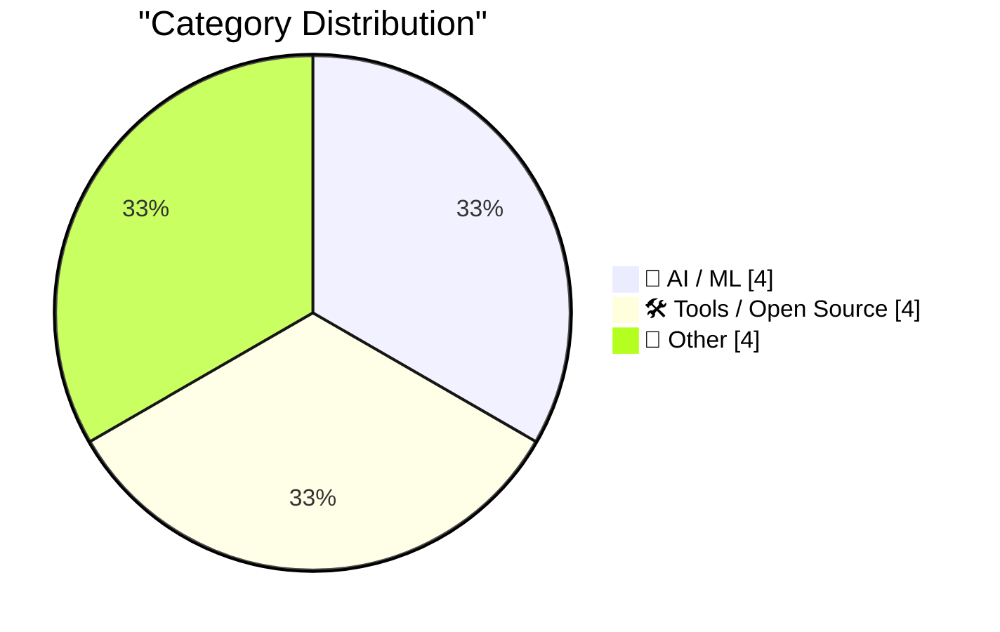
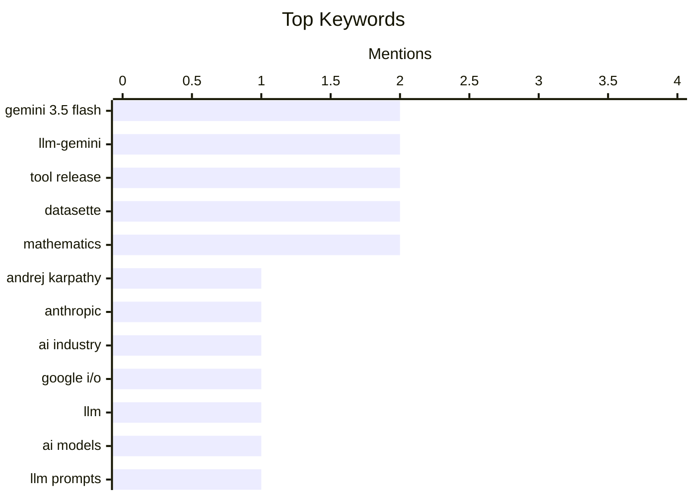

## Today's Highlights
Today's highlights reveal a rapidly evolving AI landscape marked by significant talent movement, as Andrej Karpathy joins Anthropic. Google's release of the more expensive Gemini 3.5 Flash further emphasizes the escalating costs of AI development and deployment. This financial burden, coupled with the emerging technical debt of prompt engineering, is driving a surge in new tools designed to manage and optimize LLM applications, including specific support for Google's latest models and cost tracking.
---
## Must Read Today
1. **Andrej Karpathy Joined Anthropic**
[Andrej Karpathy Joined Anthropic](https://x.com/karpathy/status/2056753169888334312) — daringfireball.net · 22h ago · 🤖 AI / ML
> This article reports Andrej Karpathy's announcement of joining Anthropic, a significant move for a prominent AI researcher. Karpathy, a co-founder of OpenAI and former Director of AI at Tesla (2017–2022), expressed excitement about contributing to R&D at the frontier of LLMs during what he believes will be a formative period. He also plans to resume his work on education in time. This move signals a notable talent acquisition for Anthropic and highlights the dynamic landscape of top-tier AI research. His expertise is expected to significantly impact Anthropic's future LLM development.
💡 **Why read it**: It's worth reading to understand a significant personnel shift in the top echelons of AI research, impacting the future direction of LLM development.
🏷️ Andrej Karpathy, Anthropic, AI industry
2. **Gemini 3.5 Flash: more expensive, but Google plan to use it for everything**
[Gemini 3.5 Flash: more expensive, but Google plan to use it for everything](https://simonwillison.net/2026/May/19/gemini-35-flash/#atom-everything) — simonwillison.net · 15h ago · 🤖 AI / ML
> Google released Gemini 3.5 Flash at Google I/O, making it generally available without a `-preview` modifier. This new model is positioned as more expensive than previous versions but is intended for widespread integration across Google's key products, including the Gemini app and AI Mode. Its immediate general availability and planned pervasive use suggest Google's confidence in its performance and scalability. The strategy indicates a significant push to embed advanced AI capabilities broadly across their ecosystem, despite the increased cost. This widespread adoption aims to leverage Gemini 3.5 Flash for billions of people globally.
💡 **Why read it**: This article is worth reading to understand Google's strategy for deploying its new Gemini 3.5 Flash model widely across its product ecosystem, despite its higher cost.
🏷️ Gemini 3.5 Flash, Google I/O, LLM, AI models
3. **Prompts are technical debt too**
[Prompts are technical debt too](https://seangoedecke.com/prompts-are-technical-debt-too/) — seangoedecke.com · 14h ago · 🤖 AI / ML
> This article argues that prompts in Large Language Model (LLM) applications should be considered a form of technical debt, akin to traditional code. Just as code adds complexity and maintenance burden, prompts introduce challenges like version control, testing, and ensuring consistent behavior across different LLM versions or providers. The author suggests that managing prompts requires similar rigor to code, including documentation, refactoring, and automated testing, to prevent unmanageable complexity. Recognizing prompts as technical debt is crucial for building robust and maintainable LLM-powered systems. This perspective encourages adopting software engineering best practices for prompt management.
💡 **Why read it**: It's worth reading for a critical perspective on managing LLM prompts, framing them as technical debt that requires structured engineering practices for long-term maintainability.
🏷️ LLM prompts, technical debt, prompt engineering
---
## Data Overview
| Sources Scanned | Articles Fetched | Time Window | Selected |
|:---:|:---:|:---:|:---:|
| 88/92 | 2552 -> 12 | 24h | **12** |
### Category Distribution

### Top Keywords

<details>
<summary>Plain Text Keyword Chart (Terminal Friendly)</summary>
```
gemini 3.5 flash │ ████████████████████ 2
llm-gemini       │ ████████████████████ 2
tool release     │ ████████████████████ 2
datasette        │ ████████████████████ 2
mathematics      │ ████████████████████ 2
andrej karpathy  │ ██████████░░░░░░░░░░ 1
anthropic        │ ██████████░░░░░░░░░░ 1
ai industry      │ ██████████░░░░░░░░░░ 1
google i/o       │ ██████████░░░░░░░░░░ 1
llm              │ ██████████░░░░░░░░░░ 1
```
</details>
### Topic Tags
**gemini 3.5 flash**(2) · **llm-gemini**(2) · **tool release**(2) · datasette(2) · mathematics(2) · andrej karpathy(1) · anthropic(1) · ai industry(1) · google i/o(1) · llm(1) · ai models(1) · llm prompts(1) · technical debt(1) · prompt engineering(1) · ai(1) · costs(1) · economics(1) · nvidia(1) · alpha release(1) · streaming tokens(1)
---
## AI / ML
### 1. Andrej Karpathy Joined Anthropic
[Andrej Karpathy Joined Anthropic](https://x.com/karpathy/status/2056753169888334312) — **daringfireball.net** · 22h ago · ⭐ 27/30
> This article reports Andrej Karpathy's announcement of joining Anthropic, a significant move for a prominent AI researcher. Karpathy, a co-founder of OpenAI and former Director of AI at Tesla (2017–2022), expressed excitement about contributing to R&D at the frontier of LLMs during what he believes will be a formative period. He also plans to resume his work on education in time. This move signals a notable talent acquisition for Anthropic and highlights the dynamic landscape of top-tier AI research. His expertise is expected to significantly impact Anthropic's future LLM development.
🏷️ Andrej Karpathy, Anthropic, AI industry
---
### 2. Gemini 3.5 Flash: more expensive, but Google plan to use it for everything
[Gemini 3.5 Flash: more expensive, but Google plan to use it for everything](https://simonwillison.net/2026/May/19/gemini-35-flash/#atom-everything) — **simonwillison.net** · 15h ago · ⭐ 26/30
> Google released Gemini 3.5 Flash at Google I/O, making it generally available without a `-preview` modifier. This new model is positioned as more expensive than previous versions but is intended for widespread integration across Google's key products, including the Gemini app and AI Mode. Its immediate general availability and planned pervasive use suggest Google's confidence in its performance and scalability. The strategy indicates a significant push to embed advanced AI capabilities broadly across their ecosystem, despite the increased cost. This widespread adoption aims to leverage Gemini 3.5 Flash for billions of people globally.
🏷️ Gemini 3.5 Flash, Google I/O, LLM, AI models
---
### 3. Prompts are technical debt too
[Prompts are technical debt too](https://seangoedecke.com/prompts-are-technical-debt-too/) — **seangoedecke.com** · 14h ago · ⭐ 25/30
> This article argues that prompts in Large Language Model (LLM) applications should be considered a form of technical debt, akin to traditional code. Just as code adds complexity and maintenance burden, prompts introduce challenges like version control, testing, and ensuring consistent behavior across different LLM versions or providers. The author suggests that managing prompts requires similar rigor to code, including documentation, refactoring, and automated testing, to prevent unmanageable complexity. Recognizing prompts as technical debt is crucial for building robust and maintainable LLM-powered systems. This perspective encourages adopting software engineering best practices for prompt management.
🏷️ LLM prompts, technical debt, prompt engineering
---
### 4. AI Is Too Expensive
[AI Is Too Expensive](https://www.wheresyoured.at/ai-is-too-expensive/) — **wheresyoured.at** · 22h ago · ⭐ 24/30
> This article discusses the high cost associated with AI development and deployment, particularly concerning large language models. While the provided snippet is brief and primarily a subscription pitch, it implies that the author's detailed analyses cover the financial aspects of key players like NVIDIA and Anthropic. The core problem highlighted is the substantial expense involved in AI, suggesting a barrier to entry or scalability for many. The article likely delves into the economic implications and cost structures of advanced AI technologies, emphasizing their significant financial demands. This perspective challenges the widespread accessibility of cutting-edge AI.
🏷️ AI, Costs, Economics, NVIDIA
---
## Tools / Open Source
### 5. llm-gemini 0.32
[llm-gemini 0.32](https://simonwillison.net/2026/May/19/llm-gemini-2/#atom-everything) — **simonwillison.net** · 14h ago · ⭐ 20/30
> This article announces the release of `llm-gemini` version 0.32, which introduces support for Google's newly released `gemini-3.5-flash` model. This update integrates the latest Gemini model into the `llm` ecosystem, allowing users to interact with Gemini 3.5 Flash through the `llm` tool. The release is part of a broader effort to keep the `llm` library compatible with Google's evolving Gemini API. This update provides developers with immediate access to Google's generally available, faster Gemini model, enhancing the `llm` tool's capabilities. It ensures `llm` users can leverage the most current Google AI offerings.
🏷️ llm-gemini, Gemini 3.5 Flash, tool release
---
### 6. llm-gemini 0.32a0
[llm-gemini 0.32a0](https://simonwillison.net/2026/May/19/llm-gemini/#atom-everything) — **simonwillison.net** · 17h ago · ⭐ 19/30
> This article announces the release of `llm-gemini` version 0.32a0, an alpha release compatible with `llm>=0.32a0`. The key feature introduced in this version is the ability to stream reasoning tokens. This enhancement allows for more granular and potentially faster interaction with LLMs by providing intermediate reasoning steps as they are generated. This alpha release targets developers who need early access to advanced streaming capabilities for LLM interactions. It represents a step towards more dynamic and responsive LLM applications.
🏷️ llm-gemini, alpha release, streaming tokens
---
### 7. datasette-llm-accountant 0.1a4
[datasette-llm-accountant 0.1a4](https://simonwillison.net/2026/May/19/datasette-llm-accountant/#atom-everything) — **simonwillison.net** · 17h ago · ⭐ 18/30
> This article announces the release of `datasette-llm-accountant` version 0.1a4. The primary update in this alpha release is a fix for a bug related to tracking chains of responses, specifically referencing `datasette-llm#7`. This bug fix improves the accuracy and reliability of cost tracking and accounting for LLM interactions within the Datasette ecosystem. The update ensures that complex sequences of LLM calls are correctly attributed and monitored, enhancing the integrity of usage data. This is crucial for accurate billing and resource management in LLM-powered applications.
🏷️ Datasette, LLM accounting, tool release
---
### 8. datasette-llm 0.1a8
[datasette-llm 0.1a8](https://simonwillison.net/2026/May/19/datasette-llm/#atom-everything) — **simonwillison.net** · 17h ago · ⭐ 18/30
> This article announces the release of `datasette-llm` version 0.1a8. The main fix in this alpha release addresses a bug where the `llm_prompt_context()` hook did not fully collect chains of responses, identified as issue #7. This correction ensures that the plugin accurately captures and processes complete sequences of LLM interactions. The update enhances the reliability of context management within Datasette when integrating with LLMs. This improvement is vital for maintaining coherent and comprehensive interaction histories with language models. It helps prevent data loss in complex LLM workflows.
🏷️ Datasette, LLM plugin, bug fix
---
## Other
### 9. Square root of x² − 1
[Square root of x² − 1](https://www.johndcook.com/blog/2026/05/19/square-root-of-x-squared-minus-one/) — **johndcook.com** · 13h ago · ⭐ 17/30
> This article explores the nuanced definition of √(z² − 1), highlighting that its interpretation is more complex than simply squaring z, subtracting 1, and taking the square root. While for non-negative real numbers x, √x is defined as the non-negative real number whose square is x, the definition becomes subtle when dealing with complex numbers or different mathematical domains. The discussion implies a deeper dive into complex analysis or specific mathematical contexts where the principal square root might not be the only consideration. This piece encourages a careful examination of mathematical definitions beyond their most straightforward applications, emphasizing precision in mathematics.
🏷️ mathematics, complex numbers, square root
---
### 10. Closer look at an identity
[Closer look at an identity](https://www.johndcook.com/blog/2026/05/19/closer-look-at-an-identity/) — **johndcook.com** · 14h ago · ⭐ 17/30
> This article provides a closer examination of a previously derived mathematical identity, specifically focusing on its domain of validity. The prior post noted the identity holds for `x > 1` and `y > 1`, and this article uses Mathematica to plot the identity to visually confirm these constraints. The plot demonstrates that the identity holds (resulting in 0) only within the specified region, highlighting why the footnote on its domain was necessary. This serves as an example of rigorously verifying mathematical identities and understanding their limitations. It underscores the importance of precise domain specification in mathematical proofs.
🏷️ mathematics, identity, Mathematica
---
### 11. Kaypro II launched May 20, 1982
[Kaypro II launched May 20, 1982](https://dfarq.homeip.net/kaypro-ii-launched-may-20-1982/?utm_source=rss&#038;utm_medium=rss&#038;utm_campaign=kaypro-ii-launched-may-20-1982) — **dfarq.homeip.net** · 3h ago · ⭐ 9/30
> The Kaypro II, a portable computer running CP/M, was successfully launched on May 20, 1982. Its main innovation was bundling a selection of popular software directly with the computer. This strategy provided significant value to consumers, simplifying user adoption and offering immediate utility. The integrated software package contributed significantly to its market success.
🏷️ Kaypro II, Vintage Computing, CP/M
---
### 12. [RSS Club] Let's meet up AFK
[[RSS Club] Let's meet up AFK](https://shkspr.mobi/blog/2026/05/rss-club-lets-meet-up-afk/) — **shkspr.mobi** · 2h ago · ⭐ 6/30
> This post is a personal invitation from the author to their "RSS Club" subscribers for in-person meetups during an upcoming Interrail journey through Europe. The author and their wife enjoy connecting with friendly locals while traveling, a practice they found successful on a previous trip. They are seeking recommendations for cool bars and restaurants, specifically mentioning vegan options. The initiative aims to foster community engagement and personal connections with their dedicated RSS audience.
🏷️ personal, travel, RSS club
---
*Generated at 2026-05-20 14:01 | Scanned 88 sources -> 2552 articles -> selected 12*
*Based on the [Hacker News Popularity Contest 2025](https://refactoringenglish.com/tools/hn-popularity/) RSS source list recommended by [Andrej Karpathy](https://x.com/karpathy)*
*Produced by Dongdianr AI. Follow the same-name WeChat public account for more AI practical tips 💡*
