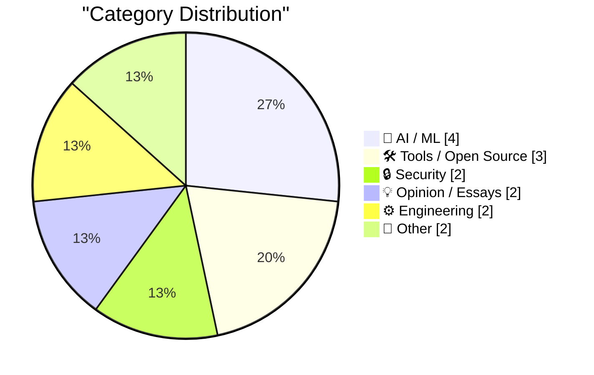
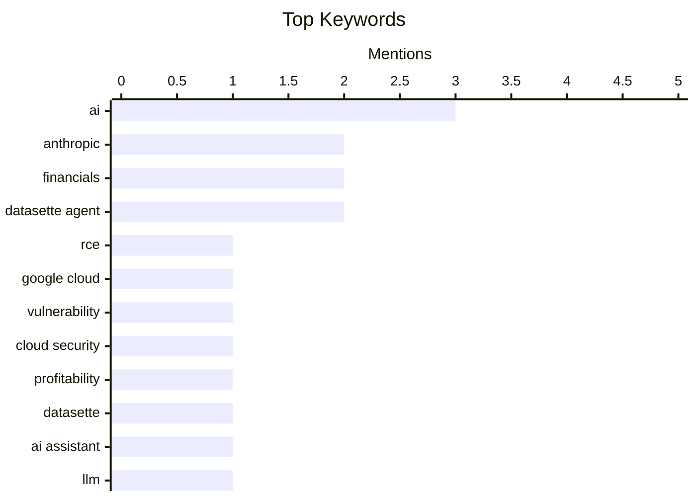

## Today's Highlights
Today's tech highlights a dual focus on the rapidly evolving AI landscape and persistent cybersecurity threats. AI advancements include new tools, but also face intense scrutiny over financial valuations and ethical concerns, with the FTC penalizing deceptive AI marketing practices. Meanwhile, critical vulnerabilities, such as a significant RCE in Google Cloud, underscore ongoing security risks. Law enforcement continues to combat cybercrime, recently arresting an alleged botnet operator.
---
## Must Read Today
1. **StubZero: $148,337 RCE in Google Cloud Production**
[StubZero: $148,337 RCE in Google Cloud Production](https://brutecat.com/articles/google-cloud-rce) — brutecat.com · -13559m ago · 🔒 Security
> This article details a critical Remote Code Execution (RCE) vulnerability discovered in Google Cloud's production environment, leading to a $148,337 bounty. The exploit leveraged two missing pieces of information, obtained through an info leak, to achieve RCE within an hour. This allowed access to Google Cloud's internal systems, demonstrating a significant security flaw. The incident recurred three months later, highlighting persistent security challenges in large-scale cloud infrastructure.
💡 **Why read it**: It provides a detailed, real-world case study of a high-impact RCE vulnerability in Google Cloud, illustrating the process of discovery and exploitation.
🏷️ RCE, Google Cloud, Vulnerability, Cloud Security
2. **Anthropic's "Profitability" Swindle**
[Anthropic's "Profitability" Swindle](https://www.wheresyoured.at/anthropics-profitability-swindle/) — wheresyoured.at · 20h ago · 🤖 AI / ML
> This article critically examines the Wall Street Journal's report claiming Anthropic is "about to have its first profitable quarter," specifically regarding operating profit or EBITDA profitability. The author argues that this claim is misleading, as Anthropic's reported Q2 revenue of $10.9 billion is likely a forward-looking projection based on committed future spending from customers, not actual earned revenue. This accounting practice, common in venture-backed startups, inflates perceived financial health by recognizing future commitments as current revenue. The core issue is the distinction between "booked revenue" (future commitments) and "earned revenue" (actual services rendered).
💡 **Why read it**: It exposes how financial reporting, particularly in the tech startup sector, can be manipulated to present a misleading picture of profitability, urging readers to scrutinize financial headlines.
🏷️ Anthropic, Profitability, AI, Financials
3. **Datasette Agent**
[Datasette Agent](https://simonwillison.net/2026/May/21/datasette-agent/#atom-everything) — simonwillison.net · 18h ago · 🛠 Tools / Open Source
> This article announces the first release of Datasette Agent, an extensible AI assistant for Datasette, integrating the author's LLM Python library with Datasette. Datasette Agent provides a conversational interface, allowing users to interact with and query their data using natural language. This new tool aims to make data exploration and analysis more accessible by leveraging large language models. The integration represents a significant step in combining LLM capabilities with Datasette's data publishing and exploration features.
💡 **Why read it**: It introduces a novel AI-powered tool that enhances data accessibility and interaction within the Datasette ecosystem, showcasing practical applications of LLMs for data analysis.
🏷️ Datasette, AI assistant, LLM, Python
---
## Data Overview
| Sources Scanned | Articles Fetched | Time Window | Selected |
|:---:|:---:|:---:|:---:|
| 88/92 | 2556 -> 22 | 24h | **15** |
### Category Distribution

### Top Keywords

<details>
<summary>Plain Text Keyword Chart (Terminal Friendly)</summary>
```
ai              │ ████████████████████ 3
anthropic       │ █████████████░░░░░░░ 2
financials      │ █████████████░░░░░░░ 2
datasette agent │ █████████████░░░░░░░ 2
rce             │ ███████░░░░░░░░░░░░░ 1
google cloud    │ ███████░░░░░░░░░░░░░ 1
vulnerability   │ ███████░░░░░░░░░░░░░ 1
cloud security  │ ███████░░░░░░░░░░░░░ 1
profitability   │ ███████░░░░░░░░░░░░░ 1
datasette       │ ███████░░░░░░░░░░░░░ 1
```
</details>
### Topic Tags
**ai**(3) · **anthropic**(2) · **financials**(2) · datasette agent(2) · rce(1) · google cloud(1) · vulnerability(1) · cloud security(1) · profitability(1) · datasette(1) · ai assistant(1) · llm(1) · python(1) · botnet(1) · iot(1) · ddos(1) · cybersecurity(1) · openai(1) · ai ethics(1) · ftc(1)
---
## AI / ML
### 1. Anthropic's "Profitability" Swindle
[Anthropic's "Profitability" Swindle](https://www.wheresyoured.at/anthropics-profitability-swindle/) — **wheresyoured.at** · 20h ago · ⭐ 28/30
> This article critically examines the Wall Street Journal's report claiming Anthropic is "about to have its first profitable quarter," specifically regarding operating profit or EBITDA profitability. The author argues that this claim is misleading, as Anthropic's reported Q2 revenue of $10.9 billion is likely a forward-looking projection based on committed future spending from customers, not actual earned revenue. This accounting practice, common in venture-backed startups, inflates perceived financial health by recognizing future commitments as current revenue. The core issue is the distinction between "booked revenue" (future commitments) and "earned revenue" (actual services rendered).
🏷️ Anthropic, Profitability, AI, Financials
---
### 2. Checking the math behind OpenAI and Anthropic’s latest headlines
[Checking the math behind OpenAI and Anthropic’s latest headlines](https://garymarcus.substack.com/p/checking-the-math-behind-openai-and) — **garymarcus.substack.com** · 20h ago · ⭐ 26/30
> This article scrutinizes the financial claims and valuations surrounding OpenAI and Anthropic, urging readers to "always read the fine print." It implies that recent headlines regarding these AI companies' financial performance or valuations might be based on speculative or non-standard accounting methods. The author suggests that the reported figures could be inflated or misleading, similar to the "profitability swindle" discussed in other articles. The core message is to critically evaluate the underlying financial data and assumptions behind impressive-sounding tech headlines.
🏷️ OpenAI, Anthropic, AI, Financials
---
### 3. FTC to Require Cox Media Group, Two Other Firms to Pay Nearly $1 Million to Settle Charges They Deceived Customers About “Active Listening” AI-Powered Marketing Service
[FTC to Require Cox Media Group, Two Other Firms to Pay Nearly $1 Million to Settle Charges They Deceived Customers About “Active Listening” AI-Powered Marketing Service](https://simonwillison.net/2026/May/22/ftc-active-listening/#atom-everything) — **simonwillison.net** · 9h ago · ⭐ 24/30
> This article reports that the FTC will require Cox Media Group and two other firms to pay nearly $1 million to settle charges of deceiving customers about an "Active Listening" AI-powered marketing service. In 2024, Cox Media Group was found selling advertising packages based on this alleged service, which claimed to use AI to "actively listen" to consumers via smart devices. The FTC's action indicates that these claims were false or misleading, constituting deceptive marketing practices. This settlement underscores regulatory scrutiny over AI-powered services and their marketing.
🏷️ AI ethics, FTC, regulation, marketing AI
---
### 4. This one weird trick might cost your retirement fund billions
[This one weird trick might cost your retirement fund billions](https://garymarcus.substack.com/p/this-one-weird-trick-might-cost-your) — **garymarcus.substack.com** · 20m ago · ⭐ 24/30
> This article warns about a financial "trick" that could potentially cost retirement funds billions, urging readers to contact their congresspeople. While the specific "trick" isn't detailed in the provided snippet, the context suggests it relates to complex financial instruments, regulatory loopholes, or deceptive practices that could destabilize investments. The author likely aims to expose a systemic issue that poses a significant risk to long-term savings. The call to action emphasizes the need for legislative intervention to protect individual retirement accounts.
🏷️ AI, Investment, Policy, Risk
---
## Tools / Open Source
### 5. Datasette Agent
[Datasette Agent](https://simonwillison.net/2026/May/21/datasette-agent/#atom-everything) — **simonwillison.net** · 18h ago · ⭐ 27/30
> This article announces the first release of Datasette Agent, an extensible AI assistant for Datasette, integrating the author's LLM Python library with Datasette. Datasette Agent provides a conversational interface, allowing users to interact with and query their data using natural language. This new tool aims to make data exploration and analysis more accessible by leveraging large language models. The integration represents a significant step in combining LLM capabilities with Datasette's data publishing and exploration features.
🏷️ Datasette, AI assistant, LLM, Python
---
### 6. datasette-agent 0.1a3
[datasette-agent 0.1a3](https://simonwillison.net/2026/May/21/datasette-agent-2/#atom-everything) — **simonwillison.net** · 22h ago · ⭐ 19/30
> This release introduces version 0.1a3 of `datasette-agent`, focusing on user interface and response handling improvements. Key updates include "View SQL query" buttons for both visible tables and collapsed SQL result tool calls, enhancing user transparency. The update also ensures that empty reasoning chunks are no longer displayed, streamlining the interface. Furthermore, it improves handling of truncated responses, allowing the table to still display to the user even if SQL results were truncated when shown to the agent. This version improves user experience and robustness in displaying SQL query results and agent interactions within Datasette.
🏷️ Datasette Agent, update, SQL query
---
### 7. datasette-agent-sprites 0.1a0
[datasette-agent-sprites 0.1a0](https://simonwillison.net/2026/May/21/datasette-agent-sprites/#atom-everything) — **simonwillison.net** · 19h ago · ⭐ 18/30
> This release introduces `datasette-agent-sprites 0.1a0`, a new Datasette Agent plugin for executing commands in a sandboxed environment. The plugin integrates Datasette Agent with Fly Sprites, enabling the running of commands within a secure sandbox. This approach enhances security and isolation for operations performed by the agent. The initial release, 0.1a0, marks the first public version of this integration, providing a secure, sandboxed execution environment for Datasette Agent commands using Fly Sprites.
🏷️ Datasette Agent, plugin, Fly Sprites
---
## Security
### 8. StubZero: $148,337 RCE in Google Cloud Production
[StubZero: $148,337 RCE in Google Cloud Production](https://brutecat.com/articles/google-cloud-rce) — **brutecat.com** · -13559m ago · ⭐ 29/30
> This article details a critical Remote Code Execution (RCE) vulnerability discovered in Google Cloud's production environment, leading to a $148,337 bounty. The exploit leveraged two missing pieces of information, obtained through an info leak, to achieve RCE within an hour. This allowed access to Google Cloud's internal systems, demonstrating a significant security flaw. The incident recurred three months later, highlighting persistent security challenges in large-scale cloud infrastructure.
🏷️ RCE, Google Cloud, Vulnerability, Cloud Security
---
### 9. Alleged Kimwolf Botmaster ‘Dort’ Arrested, Charged in U.S. and Canada
[Alleged Kimwolf Botmaster ‘Dort’ Arrested, Charged in U.S. and Canada](https://krebsonsecurity.com/2026/05/alleged-kimwolf-botmaster-dort-arrested-charged-in-u-s-and-canada/) — **krebsonsecurity.com** · 16h ago · ⭐ 27/30
> This article reports the arrest of a 23-year-old Ottawa man, "Dort," suspected of building and operating Kimwolf, a fast-spreading Internet-of-Things (IoT) botnet. Kimwolf enslaved millions of devices, using them for massive distributed denial-of-service (DDoS) attacks over the past six months. The suspect was publicly identified by KrebsOnSecurity in February 2026 after launching DDoS, doxing, and swatting campaigns against the author and a security researcher. He now faces criminal charges in both the U.S. and Canada for his alleged cybercrimes.
🏷️ Botnet, IoT, DDoS, cybersecurity
---
## Opinion / Essays
### 10. Apple Seeks Supreme Court Review of Contempt Finding and Injunction Scope in Epic Games Case
[Apple Seeks Supreme Court Review of Contempt Finding and Injunction Scope in Epic Games Case](https://9to5mac.com/2026/05/21/apple-seeks-supreme-court-review-of-contempt-finding-and-injunction-scope-in-epic-games-case/) — **daringfireball.net** · 13h ago · ⭐ 24/30
> Apple has filed a request with the Supreme Court to review key lower court rulings in its ongoing legal battle with Epic Games regarding the App Store injunction. Apple is specifically challenging two points: whether it should have been held in contempt for charging a commission on purchases made outside the App Store, and the scope of the injunction itself. This move signifies Apple's continued efforts to defend its App Store policies and revenue model against antitrust challenges. The outcome could significantly impact the future of app store economics and developer relations.
🏷️ Apple, Epic Games, App Store, antitrust
---
### 11. The $500 Price Increase
[The $500 Price Increase](https://feed.tedium.co/link/15204/17345764/plex-price-increase-self-hosting) — **tedium.co** · 22h ago · ⭐ 20/30
> Plex has introduced a significant price increase, specifically targeting its self-hosting community. The article highlights a "massive upcharge" of $500, which is directed at users who typically prefer to avoid monthly fees by self-hosting their media. This move is perceived as a direct message to a segment of their user base that values local control and one-time purchases over subscription models. This controversial pricing change could alienate its core self-hosting community by imposing a substantial one-time fee.
🏷️ Plex, Self-hosting, Pricing, Business Model
---
## Engineering
### 12. Google I/O Keynote in 54 Seconds
[Google I/O Keynote in 54 Seconds](https://x.com/ArtemR/status/2056961743142957143) — **daringfireball.net** · 22h ago · ⭐ 24/30
> This article points to a "tight edit" video summarizing the entire Google I/O keynote in just 54 seconds. While the article itself is brief, it implies the video efficiently captures the main announcements and highlights from the conference. Google I/O typically showcases new developments in Android, AI, cloud computing, and other Google technologies. The linked content likely provides a rapid overview of key product launches, feature updates, and strategic directions presented at the event.
🏷️ Google I/O, keynote, summary, developer conference
---
### 13. Dependency Pruning
[Dependency Pruning](https://nesbitt.io/2026/05/22/dependency-pruning.html) — **nesbitt.io** · 4h ago · ⭐ 24/30
> This article provides a survey of unused-dependency detectors, focusing on tools and techniques for "dependency pruning." Dependency pruning is the process of identifying and removing unnecessary libraries or packages from a software project. This practice helps reduce build times, decrease application size, and mitigate security risks associated with unused code. The article likely evaluates various static analysis tools and methodologies that can automatically detect dead dependencies across different programming languages or ecosystems.
🏷️ Dependencies, Pruning, Software Engineering
---
## Other
### 14. Apple TV to Broadcast Entire MLS Match Shot Using iPhones
[Apple TV to Broadcast Entire MLS Match Shot Using iPhones](https://www.apple.com/newsroom/2026/05/apple-tv-to-air-first-major-live-pro-sports-event-shot-on-iphone-17-pro/) — **daringfireball.net** · 14h ago · ⭐ 21/30
> Apple TV is set to broadcast the first major professional live sporting event captured entirely on iPhone. This milestone broadcast, developed in partnership with MLS, will feature the LA Galaxy vs. Houston Dynamo FC match on May 23. The entire event will be shot exclusively using iPhone 17 Pro devices, demonstrating the professional-grade video capabilities of Apple's latest smartphone. This initiative highlights the iPhone's growing role in professional content production and live broadcasting.
🏷️ Apple TV, iPhone, MLS, sports media
---
### 15. Apple Sports Expands to More Than 90 New Countries on Cusp of World Cup
[Apple Sports Expands to More Than 90 New Countries on Cusp of World Cup](https://www.apple.com/newsroom/2026/05/apple-sports-expands-to-more-than-90-new-countries-and-regions/) — **daringfireball.net** · 18h ago · ⭐ 20/30
> Apple Sports, a free iPhone app for real-time scores and stats, has significantly expanded its global availability. The app is now downloadable in over 170 countries and regions, including more than 90 newly added markets. Designed for speed and simplicity, it offers a personalized experience, prioritizing users' favorite teams and leagues through an intuitive Apple-designed interface. This expansion aims to serve more fans globally, especially ahead of major sporting events like the World Cup, broadening Apple's reach in the sports information market.
🏷️ Apple Sports, app expansion, World Cup
---
*Generated at 2026-05-22 14:01 | Scanned 88 sources -> 2556 articles -> selected 15*
*Based on the [Hacker News Popularity Contest 2025](https://refactoringenglish.com/tools/hn-popularity/) RSS source list recommended by [Andrej Karpathy](https://x.com/karpathy)*
*Produced by Dongdianr AI. Follow the same-name WeChat public account for more AI practical tips 💡*
