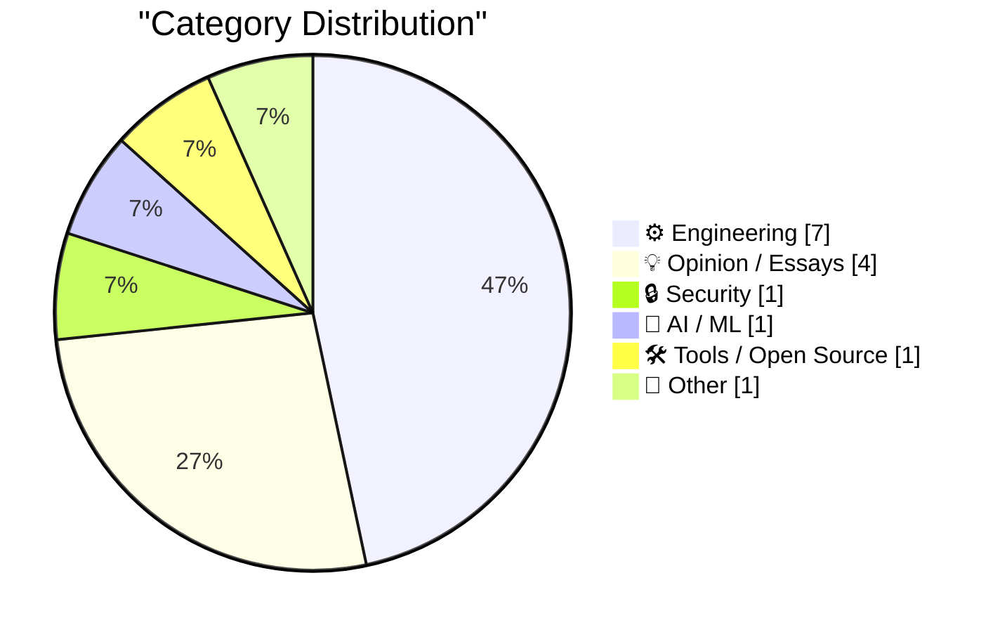
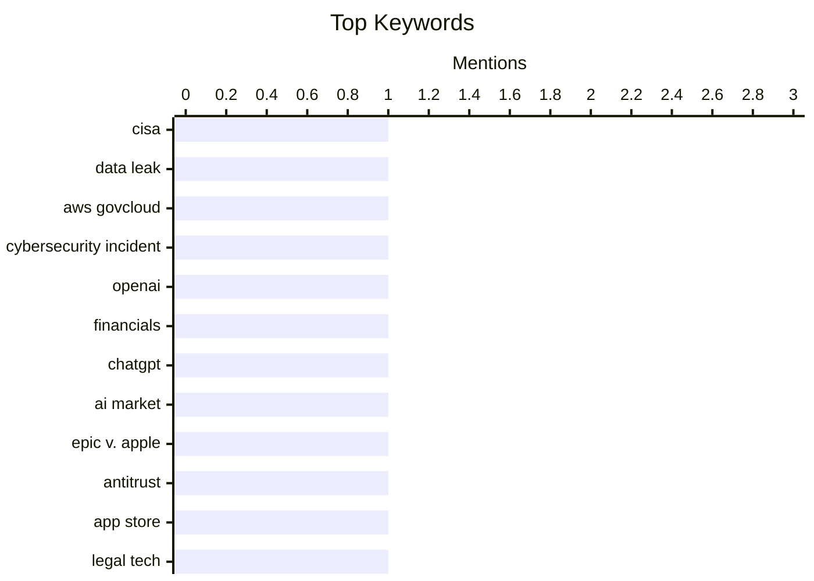

## Today's Highlights
Today's tech highlights reveal a turbulent landscape, with AI leader OpenAI facing financial scrutiny over operating margins and stalled ChatGPT growth, fueling wider debates about a potential AI bubble. Concurrently, a critical memory shortage is set to drive up consumer electronics prices, impacting hardware development from chip design to new microcontrollers. Adding to the challenges, government agencies are under fire for cybersecurity data leaks and their reliance on controversial software, while major legal battles continue to reshape the industry.
---
## Must Read Today
1. **Lawmakers Demand Answers as CISA Tries to Contain Data Leak**
[Lawmakers Demand Answers as CISA Tries to Contain Data Leak](https://krebsonsecurity.com/2026/05/lawmakers-demand-answers-as-cisa-tries-to-contain-data-leak/) — krebsonsecurity.com · 21h ago · 🔒 Security
> The U.S. Cybersecurity & Infrastructure Security Agency (CISA) is facing congressional scrutiny after a contractor intentionally published AWS GovCloud keys and other agency secrets on a public GitHub account. This breach, reported by KrebsOnSecurity, involves a vast trove of sensitive data. CISA is currently struggling to contain the leak and invalidate the compromised credentials. Lawmakers in both houses are demanding answers regarding the incident and its implications for national security.
💡 **Why read it**: This article is worth reading to understand a significant government data breach involving a CISA contractor and the ongoing efforts to mitigate its impact.
🏷️ CISA, data leak, AWS GovCloud, cybersecurity incident
2. **News: OpenAI Had A Negative 122% Non-GAAP Operating Margin In Q1 2026, and ChatGPT Growth Has Stalled**
[News: OpenAI Had A Negative 122% Non-GAAP Operating Margin In Q1 2026, and ChatGPT Growth Has Stalled](https://www.wheresyoured.at/news-openai-had-a-negative-122-operating-margin-in-q1-2026-and-chatgpt-growth-has-stalled/) — wheresyoured.at · 23h ago · 🤖 AI / ML
> OpenAI reportedly generated $5.7 billion in revenue for Q1 2026, but simultaneously experienced a negative 122% non-GAAP operating margin, indicating a loss of $1.22 for every dollar of revenue. This financial performance suggests significant operational costs relative to revenue. The report also highlights a stagnation in ChatGPT's growth, raising questions about the long-term profitability and sustainability of OpenAI's current business model. These figures challenge the perception of unchecked growth and financial success in the AI sector.
💡 **Why read it**: This article is worth reading for critical insights into OpenAI's financial performance, revealing substantial operating losses and stalled ChatGPT growth despite high revenue.
🏷️ OpenAI, Financials, ChatGPT, AI market
3. **The Ninth Circuit Appeal Ruling in ‘Epic v. Apple’ That Apple Is Seeking to Overturn at the Supreme Court (PDF)**
[The Ninth Circuit Appeal Ruling in ‘Epic v. Apple’ That Apple Is Seeking to Overturn at the Supreme Court (PDF)](https://cdn.ca9.uscourts.gov/datastore/opinions/2025/12/11/25-2935.pdf) — daringfireball.net · 20h ago · 💡 Opinion / Essays
> This article references the Ninth Circuit's appeal ruling in the "Epic v. Apple" case, which Apple is now seeking to overturn at the Supreme Court. The ruling, specifically on page 50, addresses Apple's argument that an injunction on commissions should apply only to Epic Games, not all developers in the U.S. App Store. The document includes a summary intended for reader convenience, detailing the legal basis for the appellate court's decision. Apple's petition to the Supreme Court aims to challenge the scope of this injunction and its broader implications for the App Store ecosystem.
💡 **Why read it**: This article is worth reading to understand the specific legal arguments and the scope of the injunction in the ongoing "Epic v. Apple" antitrust case.
🏷️ Epic v. Apple, antitrust, app store, legal tech
---
## Data Overview
| Sources Scanned | Articles Fetched | Time Window | Selected |
|:---:|:---:|:---:|:---:|
| 88/92 | 2558 -> 19 | 24h | **15** |
### Category Distribution

### Top Keywords

<details>
<summary>Plain Text Keyword Chart (Terminal Friendly)</summary>
```
cisa                   │ ████████████████████ 1
data leak              │ ████████████████████ 1
aws govcloud           │ ████████████████████ 1
cybersecurity incident │ ████████████████████ 1
openai                 │ ████████████████████ 1
financials             │ ████████████████████ 1
chatgpt                │ ████████████████████ 1
ai market              │ ████████████████████ 1
epic v. apple          │ ████████████████████ 1
antitrust              │ ████████████████████ 1
```
</details>
### Topic Tags
**cisa**(1) · **data leak**(1) · **aws govcloud**(1) · cybersecurity incident(1) · openai(1) · financials(1) · chatgpt(1) · ai market(1) · epic v. apple(1) · antitrust(1) · app store(1) · legal tech(1) · ai bubble(1) · market analysis(1) · ai industry(1) · memory shortage(1) · ai demand(1) · consumer tech(1) · hardware pricing(1) · package management(1)
---
## Engineering
### 1. The memory shortage is causing a repricing of consumer electronics
[The memory shortage is causing a repricing of consumer electronics](https://simonwillison.net/2026/May/22/memory-shortage/#atom-everything) — **simonwillison.net** · 16h ago · ⭐ 25/30
> A significant memory shortage, clearly explained by David Oks, is expected to cause a substantial increase in the price of consumer electronics over the next few years. This issue stems from the fixed wafer capacity of the three major memory manufacturers. The high demand for memory, particularly driven by AI applications, is diverting supply and increasing costs across the board. Consequently, products like cheap smartphones, which rely heavily on memory, will become significantly more expensive, impacting the broader consumer market.
🏷️ memory shortage, AI demand, consumer tech, hardware pricing
---
### 2. Reiner Pope – Chip design from the bottom up
[Reiner Pope – Chip design from the bottom up](https://www.dwarkesh.com/p/reiner-pope-2) — **dwarkesh.com** · 22h ago · ⭐ 25/30
> This article features insights from Reiner Pope on chip design, explaining the architecture of various computing units from fundamental logic gates upwards. It details why GPUs, TPUs, FPGAs, and even the human brain are structured in their specific ways, emphasizing the functional drivers behind each design. The discussion provides a foundational understanding of how different computational demands, from parallel processing to neural networks, necessitate distinct hardware designs. This bottom-up approach clarifies the engineering principles underlying modern computing architectures.
🏷️ Chip design, Logic gates, GPUs, TPUs
---
### 3. News about Raspberry Pi 6 and Microcontroller Development
[News about Raspberry Pi 6 and Microcontroller Development](https://www.jeffgeerling.com/blog/2026/news-about-raspberry-pi-6-and-microcontroller-development/) — **jeffgeerling.com** · 17h ago · ⭐ 24/30
> Three lead Raspberry Pi engineers, including CEO Eben Upton and Gordon Hollingworth, hosted an AMA on the r/engineering subreddit to discuss news about Raspberry Pi 6 and microcontroller development. The discussion likely covered upcoming features, design philosophies, and community questions regarding future Raspberry Pi products. This direct engagement provides insights into the company's roadmap and technical considerations for their next-generation devices. The AMA offers a rare glimpse into the strategic direction of Raspberry Pi's hardware evolution.
🏷️ Raspberry Pi, microcontroller, embedded systems, hardware development
---
### 4. Some notes on how we ended up with Palantir & how to replace it
[Some notes on how we ended up with Palantir & how to replace it](https://berthub.eu/articles/posts/some-notes-on-palantir/) — **berthub.eu** · 5h ago · ⭐ 24/30
> This article addresses the public anger regarding governments' reliance on Palantir software and the calls for developing replacements, potentially with "European values." It argues that simply replacing the software is insufficient, as the problem extends beyond just the technology itself. The author emphasizes the need to understand the broader context of how Palantir became embedded in government operations, noting that Palantir is often mischaracterized as merely a data broker or giant database. A successful replacement strategy requires addressing the underlying systemic issues and operational dependencies.
🏷️ Palantir, Government software, Ethical tech
---
### 5. Zero Sum Problems and Apple Sports
[Zero Sum Problems and Apple Sports](https://kieranhealy.org/blog/archives/2026/05/21/zero-sum-problems/) — **daringfireball.net** · 20h ago · ⭐ 22/30
> Zero Sum Problems and Apple Sports
🏷️ Apple Sports, data visualization, information design, UI/UX
---
### 6. Don't Roll Your Own ...
[Don't Roll Your Own ...](https://susam.net/do-not-roll-your-own.html) — **susam.net** · 14h ago · ⭐ 21/30
> Don't Roll Your Own ...
🏷️ Web design, Cryptography, Best practices, Security
---
### 7. Building complex functions out of real parts
[Building complex functions out of real parts](https://www.johndcook.com/blog/2026/05/22/complex-functions-real-parts/) — **johndcook.com** · 10h ago · ⭐ 20/30
> Building complex functions out of real parts
🏷️ Complex functions, Numerical methods, Mathematics
---
## Opinion / Essays
### 8. The Ninth Circuit Appeal Ruling in ‘Epic v. Apple’ That Apple Is Seeking to Overturn at the Supreme Court (PDF)
[The Ninth Circuit Appeal Ruling in ‘Epic v. Apple’ That Apple Is Seeking to Overturn at the Supreme Court (PDF)](https://cdn.ca9.uscourts.gov/datastore/opinions/2025/12/11/25-2935.pdf) — **daringfireball.net** · 20h ago · ⭐ 26/30
> This article references the Ninth Circuit's appeal ruling in the "Epic v. Apple" case, which Apple is now seeking to overturn at the Supreme Court. The ruling, specifically on page 50, addresses Apple's argument that an injunction on commissions should apply only to Epic Games, not all developers in the U.S. App Store. The document includes a summary intended for reader convenience, detailing the legal basis for the appellate court's decision. Apple's petition to the Supreme Court aims to challenge the scope of this injunction and its broader implications for the App Store ecosystem.
🏷️ Epic v. Apple, antitrust, app store, legal tech
---
### 9. Premium: What If...We're In An AI Bubble? (Part 2)
[Premium: What If...We're In An AI Bubble? (Part 2)](https://www.wheresyoured.at/premium-what-if-were-in-an-ai-bubble-part-2/) — **wheresyoured.at** · 21h ago · ⭐ 26/30
> This article is the second part of a series exploring the possibility of an AI bubble and its potential consequences, building on the first installment's popular reception. It delves into various questions and scenarios regarding the long-term implications of current AI trends, particularly concerning economic sustainability and market valuation. The author poses critical questions about the rapid growth in the AI sector and its potential for an eventual downturn. This analysis encourages readers to critically evaluate the current hype surrounding AI investments.
🏷️ AI bubble, Market analysis, AI industry
---
### 10. The commencement speech that shook the world
[The commencement speech that shook the world](https://idiallo.com/blog/the-commencement-speech-that-shook-the-world?src=feed) — **idiallo.com** · 12h ago · ⭐ 24/30
> This article discusses a commencement speech by former Google CEO Eric Schmidt, where he declared the inevitability of AI, contrasting with his past statements about Google's data collection. Schmidt's speech highlighted the challenges graduates will face in a workforce increasingly impacted by AI, noting that companies are using AI as an excuse for layoffs. The article also references Dario (presumably Dario Amodei of Anthropic) who continues to warn about AI's societal effects. The speech underscored the profound and disruptive influence of AI on employment and society, urging a clear-eyed view of the future.
🏷️ Eric Schmidt, Google, tech foresight, innovation
---
### 11. How to Talk to Your Coworkers
[How to Talk to Your Coworkers](https://idiallo.com/blog/how-to-talk-to-your-coworkers?src=feed) — **idiallo.com** · 19h ago · ⭐ 20/30
> How to Talk to Your Coworkers
🏷️ workplace communication, team dynamics, soft skills, productivity
---
## Security
### 12. Lawmakers Demand Answers as CISA Tries to Contain Data Leak
[Lawmakers Demand Answers as CISA Tries to Contain Data Leak](https://krebsonsecurity.com/2026/05/lawmakers-demand-answers-as-cisa-tries-to-contain-data-leak/) — **krebsonsecurity.com** · 21h ago · ⭐ 29/30
> The U.S. Cybersecurity & Infrastructure Security Agency (CISA) is facing congressional scrutiny after a contractor intentionally published AWS GovCloud keys and other agency secrets on a public GitHub account. This breach, reported by KrebsOnSecurity, involves a vast trove of sensitive data. CISA is currently struggling to contain the leak and invalidate the compromised credentials. Lawmakers in both houses are demanding answers regarding the incident and its implications for national security.
🏷️ CISA, data leak, AWS GovCloud, cybersecurity incident
---
## AI / ML
### 13. News: OpenAI Had A Negative 122% Non-GAAP Operating Margin In Q1 2026, and ChatGPT Growth Has Stalled
[News: OpenAI Had A Negative 122% Non-GAAP Operating Margin In Q1 2026, and ChatGPT Growth Has Stalled](https://www.wheresyoured.at/news-openai-had-a-negative-122-operating-margin-in-q1-2026-and-chatgpt-growth-has-stalled/) — **wheresyoured.at** · 23h ago · ⭐ 29/30
> OpenAI reportedly generated $5.7 billion in revenue for Q1 2026, but simultaneously experienced a negative 122% non-GAAP operating margin, indicating a loss of $1.22 for every dollar of revenue. This financial performance suggests significant operational costs relative to revenue. The report also highlights a stagnation in ChatGPT's growth, raising questions about the long-term profitability and sustainability of OpenAI's current business model. These figures challenge the perception of unchecked growth and financial success in the AI sector.
🏷️ OpenAI, Financials, ChatGPT, AI market
---
## Tools / Open Source
### 14. This Week in Package Management: 23 May 2026
[This Week in Package Management: 23 May 2026](https://nesbitt.io/2026/05/23/this-week-in-package-management.html) — **nesbitt.io** · 4h ago · ⭐ 25/30
> This article provides a weekly roundup of significant developments in the package management ecosystem. It covers recent releases, security advisories, and notable articles from across the package management world. The content aims to keep readers informed about the latest updates and trends impacting software dependencies and distribution. This curated summary helps developers and system administrators stay current with critical changes and potential vulnerabilities in their toolchains.
🏷️ Package management, Releases, Advisories
---
## Other
### 15. Stephen Colbert’s ‘The Late Show’ Finale
[Stephen Colbert’s ‘The Late Show’ Finale](https://www.nytimes.com/2026/05/22/arts/television/colbert-last-late-show.html?unlocked_article_code=1.kVA.GO3I.gVq9KeUrHEyM) — **daringfireball.net** · 20h ago · ⭐ 16/30
> Stephen Colbert’s ‘The Late Show’ Finale
🏷️ Stephen Colbert, Late Show, entertainment, television
---
*Generated at 2026-05-23 14:01 | Scanned 88 sources -> 2558 articles -> selected 15*
*Based on the [Hacker News Popularity Contest 2025](https://refactoringenglish.com/tools/hn-popularity/) RSS source list recommended by [Andrej Karpathy](https://x.com/karpathy)*
*Produced by Dongdianr AI. Follow the same-name WeChat public account for more AI practical tips 💡*
