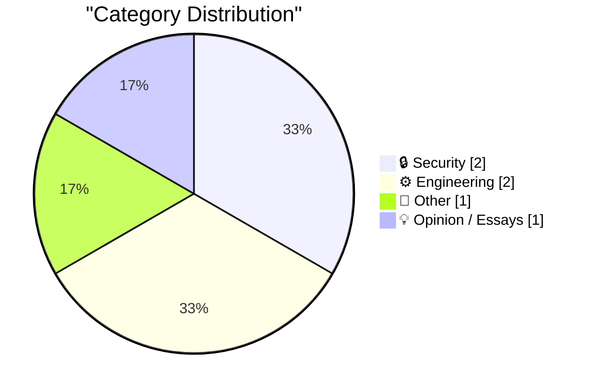
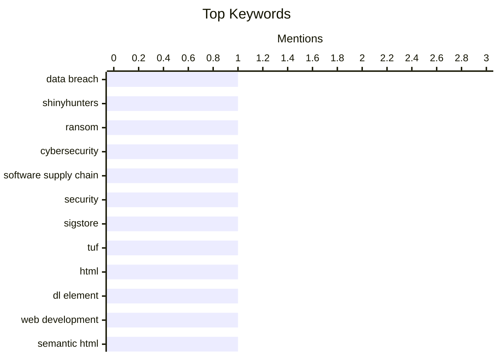

## Today's Highlights
Today's tech news reveals a strong emphasis on digital security and the breadth of engineering innovation. Cybersecurity remains a critical concern, with updates on active cybercrime groups highlighting the urgent need for robust software supply chain defenses. Concurrently, engineering discussions range from optimizing modern web development best practices to the intricate reverse engineering of historical computer hardware, reflecting a deep dive into both current and foundational technologies.
---
## Must Read Today
1. **Weekly Update 505**
[Weekly Update 505](https://www.troyhunt.com/weekly-update-505/) — troyhunt.com · 12h ago · 🔒 Security
> This article provides a brief update on the activity of the cybercrime group ShinyHunters, noting their recent quiet period. It observes that the group has been inactive since their significant haul from the Instructure ransom incident. The author notes this silence occurred approximately two weeks after initial rumors of a payment being made. This serves as a concise status report on a prominent threat actor's recent operations.
💡 **Why read it**: It offers a timely, concise update on the observed activity of a significant cybercrime group, ShinyHunters, following a major data breach.
🏷️ Data breach, ShinyHunters, ransom, cybersecurity
2. **Signing is for the bad days**
[Signing is for the bad days](https://nesbitt.io/2026/05/24/signing-is-for-the-bad-days.html) — nesbitt.io · 4h ago · 🔒 Security
> This article emphasizes the critical importance of software supply chain security tools, asserting their value becomes evident during security incidents. It highlights specific technologies like TUF (The Update Framework), in-toto, and Sigstore as essential for ensuring software integrity and authenticity. The core argument is that these signing mechanisms, while seemingly complex, are indispensable for protecting against supply chain attacks. Ultimately, proactive implementation of such security measures is crucial for maintaining robust software ecosystems.
💡 **Why read it**: It succinctly argues for the often-underestimated necessity of software supply chain security tools like TUF, in-toto, and Sigstore, especially in the face of cyber threats.
🏷️ Software supply chain, security, Sigstore, TUF
3. **On the <dl>**
[On the <dl>](https://simonwillison.net/2026/May/23/on-the-dl/#atom-everything) — simonwillison.net · 17h ago · ⚙️ Engineering
> This article explores lesser-known capabilities and best practices for the HTML `<dl>` (description list) element, referencing insights from Ben Meyer's work. Key findings include that a single `<dt>` (definition term) can be followed by multiple `<dd>` (definition description) elements. Additionally, `<dt>` and `<dd>` pairs can be optionally grouped within a `<div>` for styling purposes, and the elements support ARIA labeling for improved accessibility. Understanding these features allows for more semantically rich and accessible web content.
💡 **Why read it**: It reveals practical and semantic capabilities of the HTML `<dl>` element, such as multiple `<dd>`s per `<dt>` and `<div>` grouping, enhancing web development and accessibility.
🏷️ HTML, DL element, web development, semantic HTML
---
## Data Overview
| Sources Scanned | Articles Fetched | Time Window | Selected |
|:---:|:---:|:---:|:---:|
| 88/92 | 2559 -> 6 | 24h | **6** |
### Category Distribution

### Top Keywords

<details>
<summary>Plain Text Keyword Chart (Terminal Friendly)</summary>
```
data breach           │ ████████████████████ 1
shinyhunters          │ ████████████████████ 1
ransom                │ ████████████████████ 1
cybersecurity         │ ████████████████████ 1
software supply chain │ ████████████████████ 1
security              │ ████████████████████ 1
sigstore              │ ████████████████████ 1
tuf                   │ ████████████████████ 1
html                  │ ████████████████████ 1
dl element            │ ████████████████████ 1
```
</details>
### Topic Tags
**data breach**(1) · **shinyhunters**(1) · **ransom**(1) · cybersecurity(1) · software supply chain(1) · security(1) · sigstore(1) · tuf(1) · html(1) · dl element(1) · web development(1) · semantic html(1) · reverse engineering(1) · spacelab(1) · computer history(1) · hardware(1) · hilbert transform(1) · fourier series(1) · mathematics(1) · signal processing(1)
---
## Security
### 1. Weekly Update 505
[Weekly Update 505](https://www.troyhunt.com/weekly-update-505/) — **troyhunt.com** · 12h ago · ⭐ 27/30
> This article provides a brief update on the activity of the cybercrime group ShinyHunters, noting their recent quiet period. It observes that the group has been inactive since their significant haul from the Instructure ransom incident. The author notes this silence occurred approximately two weeks after initial rumors of a payment being made. This serves as a concise status report on a prominent threat actor's recent operations.
🏷️ Data breach, ShinyHunters, ransom, cybersecurity
---
### 2. Signing is for the bad days
[Signing is for the bad days](https://nesbitt.io/2026/05/24/signing-is-for-the-bad-days.html) — **nesbitt.io** · 4h ago · ⭐ 26/30
> This article emphasizes the critical importance of software supply chain security tools, asserting their value becomes evident during security incidents. It highlights specific technologies like TUF (The Update Framework), in-toto, and Sigstore as essential for ensuring software integrity and authenticity. The core argument is that these signing mechanisms, while seemingly complex, are indispensable for protecting against supply chain attacks. Ultimately, proactive implementation of such security measures is crucial for maintaining robust software ecosystems.
🏷️ Software supply chain, security, Sigstore, TUF
---
## Engineering
### 3. On the <dl>
[On the <dl>](https://simonwillison.net/2026/May/23/on-the-dl/#atom-everything) — **simonwillison.net** · 17h ago · ⭐ 20/30
> This article explores lesser-known capabilities and best practices for the HTML `<dl>` (description list) element, referencing insights from Ben Meyer's work. Key findings include that a single `<dt>` (definition term) can be followed by multiple `<dd>` (definition description) elements. Additionally, `<dt>` and `<dd>` pairs can be optionally grouped within a `<div>` for styling purposes, and the elements support ARIA labeling for improved accessibility. Understanding these features allows for more semantically rich and accessible web content.
🏷️ HTML, DL element, web development, semantic HTML
---
### 4. Reverse engineering circuitry in a Spacelab computer from 1980
[Reverse engineering circuitry in a Spacelab computer from 1980](http://www.righto.com/feeds/872292081485114047/comments/default) — **righto.com** · 21h ago · ⭐ 19/30
> This article details the reverse engineering of a processor board from the Mitra 125 MS minicomputer, which controlled the Spacelab module in the Space Shuttle during the 1980s. Unlike modern systems, this 16-bit processor was constructed from multiple discrete chip boards, not a single microprocessor. The focus is on the 'Arith' (Arithmetic) board, providing insight into its internal circuitry and design. This work illuminates the complex hardware architecture of early space-grade computing systems.
🏷️ Reverse engineering, Spacelab, computer history, hardware
---
## Other
### 5. Hilbert transform as an infinite matrix
[Hilbert transform as an infinite matrix](https://www.johndcook.com/blog/2026/05/23/hilbert-transform-as-an-infinite-matrix/) — **johndcook.com** · 22h ago · ⭐ 19/30
> This article explores a novel mathematical perspective on the Hilbert transform, conceptualizing it as an infinite matrix. Building on previous discussions linking the Hilbert transform to Fourier series, it suggests that if a function's Fourier series is represented in a specific way, its Hilbert transform's Fourier series can be derived. This approach provides an alternative framework for understanding how the Hilbert transform operates on functions. The article aims to offer a deeper, more abstract insight into this fundamental signal processing operation.
🏷️ Hilbert transform, Fourier series, mathematics, signal processing
---
## Opinion / Essays
### 6. Childhood Computing
[Childhood Computing](https://susam.net/childhood-computing.html) — **susam.net** · 14h ago · ⭐ 13/30
> This article offers a personal reflection on the author's early experiences with computers, inspired by another blog post on childhood computing. The author recounts their introduction to technology at eight years old in 1992, influenced by a new school's curriculum. This narrative explores the formative moments that cultivated a lifelong passion for computing. It provides a nostalgic look at how early exposure to technology can shape an individual's interests and career path.
🏷️ Childhood, computing, personal reflection, nostalgia
---
*Generated at 2026-05-24 14:01 | Scanned 88 sources -> 2559 articles -> selected 6*
*Based on the [Hacker News Popularity Contest 2025](https://refactoringenglish.com/tools/hn-popularity/) RSS source list recommended by [Andrej Karpathy](https://x.com/karpathy)*
*Produced by Dongdianr AI. Follow the same-name WeChat public account for more AI practical tips 💡*
