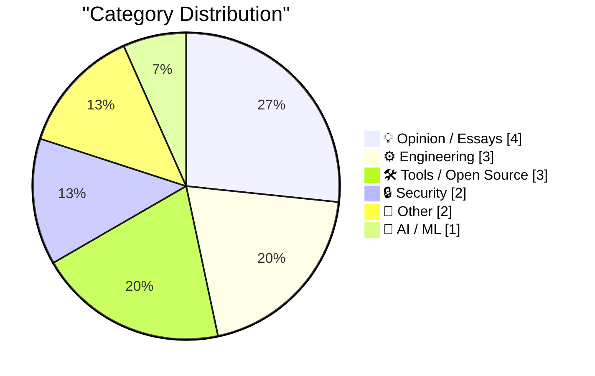
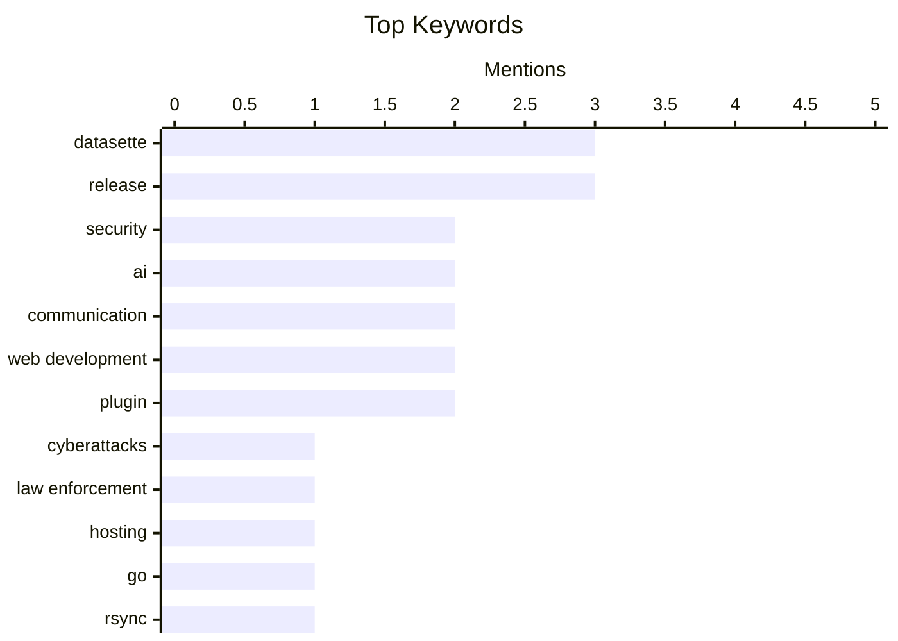

## Today's Highlights
Today's tech highlights a strong emphasis on cybersecurity and secure engineering, with authorities seizing cyberattack infrastructure and developers building memory-safe systems. Concurrently, the impact of AI is a key theme, sparking debate over AI-generated content quality while also seeing AI integrated into new tools and explored for complex explanations. These advancements occur alongside ongoing practical software development, tackling common engineering challenges and enhancing existing platforms.
---
## Must Read Today
1. **Netherlands Seizes 800 Servers, Arrests 2 for Aiding Cyberattacks**
[Netherlands Seizes 800 Servers, Arrests 2 for Aiding Cyberattacks](https://krebsonsecurity.com/2026/05/netherlands-seizes-800-servers-arrests-2-for-aiding-cyberattacks/) — krebsonsecurity.com · 39m ago · 🔒 Security
> Authorities in the Netherlands have arrested the co-owners of two Internet hosting companies for operating IT infrastructure used by Russia to conduct cyberattacks, influence operations, and disinformation campaigns within the European Union. The two men were previously linked to Stark Industries Solutions, an Internet service provider sanctioned by the EU. The operation involved seizing 800 servers, significantly disrupting the illicit infrastructure. This action directly targets and dismantles a key part of Russia's cyber warfare capabilities in Europe. The arrests and server seizures represent a substantial blow to state-sponsored cyber operations.
💡 **Why read it**: It highlights a successful international law enforcement action against state-sponsored cyber threats and the critical role of hosting providers in facilitating such activities.
🏷️ Cyberattacks, security, law enforcement, hosting
2. **How my minimal, memory-safe Go rsync steers clear of vulnerabilities**
[How my minimal, memory-safe Go rsync steers clear of vulnerabilities](https://michael.stapelberg.ch/posts/2026-05-24-minimal-memory-safe-go-rsync-vulns/) — michael.stapelberg.ch · 23h ago · ⚙️ Engineering
> The article discusses the design philosophy behind a minimal, memory-safe Go implementation of rsync, focusing on preventing common vulnerabilities. The author emphasizes a reduced feature set and leveraging Go's inherent memory safety to avoid complex parsing logic that often leads to security flaws. This approach specifically addresses issues like improper checksum length validation, a known vulnerability in other rsync implementations. By prioritizing simplicity and security over full feature parity with GNU rsync, the project aims for robustness. This demonstrates that a focused, memory-safe language implementation can significantly reduce the attack surface and prevent common vulnerability classes.
💡 **Why read it**: It provides insights into building secure, robust network tools by emphasizing minimalism and memory safety in Go, using rsync as a practical example.
🏷️ Go, Rsync, Memory Safety, Vulnerabilities
3. **Quoting Armin Ronacher**
[Quoting Armin Ronacher](https://simonwillison.net/2026/May/24/armin-ronacher/#atom-everything) — simonwillison.net · 19h ago · 💡 Opinion / Essays
> The article highlights Armin Ronacher's observation regarding the detrimental impact of AI-generated content on open-source project issue reporting. Ronacher notes that users are submitting issues "not in their own voice," reworded by AI tools, which leads to "complete guesswork on root causes" and "fake-minimizations." These AI-generated reports are often inaccurate but presented with high confidence, making them frustrating and time-consuming for maintainers. The increasing prevalence of such reports is degrading the quality of feedback and increasing the burden on project maintainers. This trend underscores a significant challenge for technical communication and collaboration in the age of AI.
💡 **Why read it**: It offers a critical perspective on the negative impact of AI-generated content, specifically bug reports, on open-source project maintenance and the quality of technical communication.
🏷️ Open source, AI, communication, maintainers
---
## Data Overview
| Sources Scanned | Articles Fetched | Time Window | Selected |
|:---:|:---:|:---:|:---:|
| 88/92 | 2561 -> 16 | 24h | **15** |
### Category Distribution

### Top Keywords

<details>
<summary>Plain Text Keyword Chart (Terminal Friendly)</summary>
```
datasette       │ ████████████████████ 3
release         │ ████████████████████ 3
security        │ █████████████░░░░░░░ 2
ai              │ █████████████░░░░░░░ 2
communication   │ █████████████░░░░░░░ 2
web development │ █████████████░░░░░░░ 2
plugin          │ █████████████░░░░░░░ 2
cyberattacks    │ ███████░░░░░░░░░░░░░ 1
law enforcement │ ███████░░░░░░░░░░░░░ 1
hosting         │ ███████░░░░░░░░░░░░░ 1
```
</details>
### Topic Tags
**datasette**(3) · **release**(3) · **security**(2) · ai(2) · communication(2) · web development(2) · plugin(2) · cyberattacks(1) · law enforcement(1) · hosting(1) · go(1) · rsync(1) · memory safety(1) · vulnerabilities(1) · open source(1) · maintainers(1) · ad-tech(1) · enshittification(1) · platforms(1) · tech industry(1)
---
## Opinion / Essays
### 1. Quoting Armin Ronacher
[Quoting Armin Ronacher](https://simonwillison.net/2026/May/24/armin-ronacher/#atom-everything) — **simonwillison.net** · 19h ago · ⭐ 27/30
> The article highlights Armin Ronacher's observation regarding the detrimental impact of AI-generated content on open-source project issue reporting. Ronacher notes that users are submitting issues "not in their own voice," reworded by AI tools, which leads to "complete guesswork on root causes" and "fake-minimizations." These AI-generated reports are often inaccurate but presented with high confidence, making them frustrating and time-consuming for maintainers. The increasing prevalence of such reports is degrading the quality of feedback and increasing the burden on project maintainers. This trend underscores a significant challenge for technical communication and collaboration in the age of AI.
🏷️ Open source, AI, communication, maintainers
---
### 2. Pluralistic: No honor among (ad-tech) thieves (25 May 2026)
[Pluralistic: No honor among (ad-tech) thieves (25 May 2026)](https://pluralistic.net/2026/05/25/lying-spies/) — **pluralistic.net** · 5h ago · ⭐ 26/30
> This article serves as a curated collection of links, primarily focusing on issues within the ad-tech industry and broader themes of corporate misconduct and platform degradation. The central theme, "No honor among (ad-tech) thieves," suggests a critical look at unethical practices in advertising technology. The links cover diverse topics including "lying spies" in ad-tech, "enshittification" of platforms like Airbnb and Oculus, Nintendo's copyright disputes, and the Sackler family's legal issues. The post aggregates various critical analyses and news items, highlighting contemporary challenges in digital rights and corporate accountability. It functions as a digest of current events and critiques relevant to technology and society.
🏷️ Ad-tech, enshittification, platforms, tech industry
---
### 3. Why I can't stand the word "driven"
[Why I can't stand the word "driven"](https://www.joanwestenberg.com/why-i-cant-stand-the-word-driven/) — **joanwestenberg.com** · 13h ago · ⭐ 18/30
> This article introduces a critique of the word "driven," using a historical anecdote to set the context for the author's perspective. It recounts the story of Harry Readford, who successfully drove nearly 1,000 head of cattle across challenging terrain from Bowen Downs in Queensland to South Australia, a feat considered impossible by others. This narrative serves as a foundational example to illustrate the author's nuanced view on the term. The article implies that the word "driven" might carry connotations that are often misused or not fully appreciated in modern contexts. Ultimately, it uses a compelling historical example to challenge conventional understandings or applications of the word "driven."
🏷️ Work culture, career, language, personal reflection
---
### 4. Quantum Link: AOL before it was AOL
[Quantum Link: AOL before it was AOL](https://dfarq.homeip.net/quantum-link-aol-before-it-was-aol/?utm_source=rss&#038;utm_medium=rss&#038;utm_campaign=quantum-link-aol-before-it-was-aol) — **dfarq.homeip.net** · 3h ago · ⭐ 13/30
> This article delves into the fascinating history of Quantum Link (Q-Link), highlighting its role as the direct precursor to America Online (AOL). It details that Q-Link was accessible to users who owned a Commodore computer and a modem during the 1980s. The service originated from a significant reorganization of Control Video on May 24, 1985, marking its pivotal transition towards becoming the widely recognized AOL. This historical account emphasizes the specific hardware requirements and the early technological landscape for accessing online services during that era. Quantum Link represents a crucial early stage in the evolution of consumer online services, directly leading to the formation of AOL.
🏷️ AOL, History, Commodore, Quantum Link
---
## Engineering
### 5. How my minimal, memory-safe Go rsync steers clear of vulnerabilities
[How my minimal, memory-safe Go rsync steers clear of vulnerabilities](https://michael.stapelberg.ch/posts/2026-05-24-minimal-memory-safe-go-rsync-vulns/) — **michael.stapelberg.ch** · 23h ago · ⭐ 28/30
> The article discusses the design philosophy behind a minimal, memory-safe Go implementation of rsync, focusing on preventing common vulnerabilities. The author emphasizes a reduced feature set and leveraging Go's inherent memory safety to avoid complex parsing logic that often leads to security flaws. This approach specifically addresses issues like improper checksum length validation, a known vulnerability in other rsync implementations. By prioritizing simplicity and security over full feature parity with GNU rsync, the project aims for robustness. This demonstrates that a focused, memory-safe language implementation can significantly reduce the attack surface and prevent common vulnerability classes.
🏷️ Go, Rsync, Memory Safety, Vulnerabilities
---
### 6. FediMeteo, timezones, and the art of not breaking what already works
[FediMeteo, timezones, and the art of not breaking what already works](https://it-notes.dragas.net/2026/05/25/fedimeteo-timezones-and-the-art-of-not-breaking-what-already-works/) — **it-notes.dragas.net** · 4h ago · ⭐ 22/30
> The article discusses the complexities of managing timezones within the FediMeteo project and the critical importance of maintaining existing functionality during development. Building on previous discussions about FediMeteo's origins and its use of HAProxy, the current focus is on correctly handling timezones without introducing regressions. This is crucial for a global weather service that serves thousands from a tiny FreeBSD VPS. The challenge involves ensuring data consistency and accurate time representation across diverse geographical locations while preserving the system's stability. Managing timezones in a global, resource-constrained service like FediMeteo requires meticulous attention to detail to ensure accuracy and prevent disruptions.
🏷️ Timezones, Engineering, FediMeteo, Maintenance
---
### 7. PHP - simple way to send HTTP headers before a script ends
[PHP - simple way to send HTTP headers before a script ends](https://shkspr.mobi/blog/2026/05/php-simple-way-to-send-http-headers-before-a-script-ends/) — **shkspr.mobi** · 2h ago · ⭐ 21/30
> The article addresses a common PHP issue where `header()` calls block script execution until the entire script finishes, preventing immediate HTTP response sending for long-running tasks. It illustrates this problem with an example where a `header("Location: ...")` followed by `sleep(10)` makes the client wait 10 seconds before receiving the redirect. The article aims to provide a "simple way" to send HTTP headers promptly and then allow the PHP script to continue processing in the background. This technique improves user experience by delivering immediate responses while enabling server-side background operations. It offers a practical solution for optimizing PHP application responsiveness.
🏷️ PHP, HTTP headers, backend, web development
---
## Tools / Open Source
### 8. datasette 1.0a30
[datasette 1.0a30](https://simonwillison.net/2026/May/24/datasette/#atom-everything) — **simonwillison.net** · 14h ago · ⭐ 24/30
> This article announces the release of Datasette 1.0a30, highlighting a significant new user interface feature. The key addition is a customizable "Jump to..." menu, which is described in detail on the Datasette blog. Users can try this new navigation feature by hitting `/` on `latest.datasette.io`. This enhancement aims to improve user experience and navigation within the Datasette interface, making it easier to access different sections and data. The release signifies continued development towards Datasette 1.0, focusing on usability and extensibility.
🏷️ Datasette, release, data tool, web development
---
### 9. datasette-agent 0.1a4
[datasette-agent 0.1a4](https://simonwillison.net/2026/May/24/datasette-agent/#atom-everything) — **simonwillison.net** · 14h ago · ⭐ 20/30
> This article announces the release of `datasette-agent` 0.1a4, a plugin that leverages new features in Datasette for enhanced functionality. The `datasette-agent` plugin specifically utilizes the new `makeJumpSections()` JavaScript plugin hook introduced in Datasette 1.0a30. This integration allows `datasette-agent` to present a "Start a new agent cha" (likely "chat" or "chain") option, suggesting improved interaction or workflow initiation within the Datasette interface. The release demonstrates the extensibility of Datasette's new plugin architecture. It highlights how plugins can integrate deeply with Datasette's UI to provide advanced, agent-based functionalities.
🏷️ Datasette, plugin, agent, release
---
### 10. datasette-fixtures 0.1a0
[datasette-fixtures 0.1a0](https://simonwillison.net/2026/May/24/datasette-fixtures/#atom-everything) — **simonwillison.net** · 16h ago · ⭐ 19/30
> This article announces the release of `datasette-fixtures 0.1a0`, a new plugin designed to enhance Datasette's testing capabilities. It introduces the `datasette.fixtures.populate_fixture_database(conn)` helper, which simplifies populating a Datasette database with test data. This feature, part of the broader `Datasette 1.0a30` release, aims to streamline development and testing workflows for Datasette plugins and applications. The helper provides a standardized method for setting up predictable database states, ensuring more reliable and efficient testing. This plugin significantly improves Datasette's ecosystem by offering a dedicated tool for managing database fixtures.
🏷️ Datasette, fixtures, plugin, release
---
## Security
### 11. Netherlands Seizes 800 Servers, Arrests 2 for Aiding Cyberattacks
[Netherlands Seizes 800 Servers, Arrests 2 for Aiding Cyberattacks](https://krebsonsecurity.com/2026/05/netherlands-seizes-800-servers-arrests-2-for-aiding-cyberattacks/) — **krebsonsecurity.com** · 39m ago · ⭐ 29/30
> Authorities in the Netherlands have arrested the co-owners of two Internet hosting companies for operating IT infrastructure used by Russia to conduct cyberattacks, influence operations, and disinformation campaigns within the European Union. The two men were previously linked to Stark Industries Solutions, an Internet service provider sanctioned by the EU. The operation involved seizing 800 servers, significantly disrupting the illicit infrastructure. This action directly targets and dismantles a key part of Russia's cyber warfare capabilities in Europe. The arrests and server seizures represent a substantial blow to state-sponsored cyber operations.
🏷️ Cyberattacks, security, law enforcement, hosting
---
### 12. GitHub Actions security in Python packages
[GitHub Actions security in Python packages](https://nesbitt.io/2026/05/25/github-actions-security-in-python-packages.html) — **nesbitt.io** · 4h ago · ⭐ 26/30
> The article likely discusses critical security considerations and best practices for implementing GitHub Actions in Python package development. It would cover topics such as securing workflow permissions, managing sensitive secrets, and preventing supply chain attacks through compromised dependencies. The content would probably recommend specific configurations or tools to mitigate common vulnerabilities in CI/CD pipelines for Python projects. Adopting robust security practices within GitHub Actions is essential for protecting Python packages from various threats throughout their development lifecycle. This ensures the integrity and trustworthiness of software distributed via Python packages.
🏷️ GitHub Actions, Security, Python, Supply Chain
---
## Other
### 13. Why Steve Kerr Stayed With the Warriors
[Why Steve Kerr Stayed With the Warriors](https://www.espn.com/nba/story/_/id/48686303/steve-kerr-decision-return-coach-golden-state-warriors-steph-curry) — **daringfireball.net** · 20h ago · ⭐ 17/30
> This article explores the multifaceted motivations behind Steve Kerr's decision to remain as the head coach for the Golden State Warriors. Kerr's choice is significantly influenced by his desire to avoid the internal strife and grudges that plagued teams like the New England Patriots. He also reflects on Michael Jordan's repeated retirements and unretirements, concluding that Jordan "can't" simply "go out on top." Furthermore, Kerr observes his mentor, Gregg Popovich, struggling through difficult periods with the San Antonio Spurs, which informs his perspective on coaching longevity and team dynamics. His decision is driven by a nuanced understanding of team legacy, player psychology, and the challenges of sustained success in professional sports.
🏷️ Sports, leadership, Steve Kerr, team dynamics
---
### 14. Mad House — Usborne Creepy Computer Games
[Mad House — Usborne Creepy Computer Games](https://simonwillison.net/2026/May/24/usborne-mad-house/#atom-everything) — **simonwillison.net** · 20h ago · ⭐ 11/30
> This article highlights the recent availability of free PDF versions of Usborne's classic 1980s Computer Books, specifically mentioning "Mad House — Usborne Creepy Computer Games." The author discovered these resources via Hacker News, recalling personal experiences of using these books with a Commodore 64 during childhood. Usborne, a UK publisher, has made these nostalgic and educational computer books, known for their beautiful illustrations and practical coding examples, freely accessible. This initiative allows both enthusiasts and a new generation to explore foundational computing concepts and programming from the 1980s. The free release of Usborne's classic computer books offers a valuable resource for historical computing education and nostalgia.
🏷️ Retro gaming, computer history, Usborne, nostalgia
---
## AI / ML
### 15. Walking the dog with Claude
[Walking the dog with Claude](http://xania.org/202605/walking-the-dog?utm_source=feed&amp;utm_medium=rss) — **xania.org** · 21h ago · ⭐ 24/30
> The article describes an AI interview conducted with Claude, focusing on the challenge of explaining complex topics simply. The author engaged Claude in a conversational interview, simulating a "dog walk" scenario, to explore how the AI approaches simplifying hard concepts. This unique, informal interview format was designed to elicit more natural and accessible explanations from the AI. The experiment aims to understand Claude's capabilities in breaking down intricate information into understandable components. This demonstrates an innovative method of interacting with AI to assess its potential in educational and explanatory contexts.
🏷️ AI, Claude, Communication, LLM
---
*Generated at 2026-05-25 14:01 | Scanned 88 sources -> 2561 articles -> selected 15*
*Based on the [Hacker News Popularity Contest 2025](https://refactoringenglish.com/tools/hn-popularity/) RSS source list recommended by [Andrej Karpathy](https://x.com/karpathy)*
*Produced by Dongdianr AI. Follow the same-name WeChat public account for more AI practical tips 💡*
