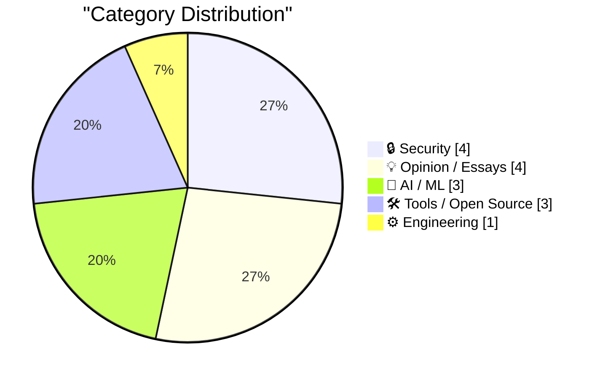
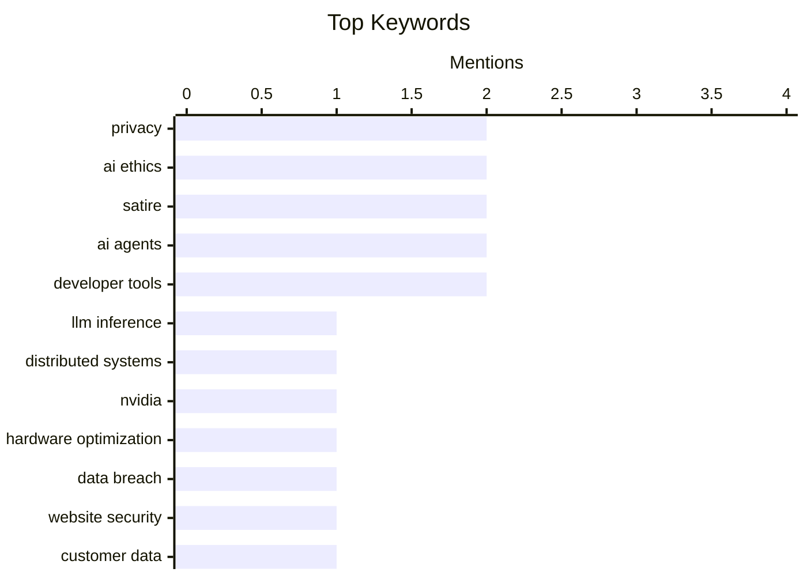

## Today's Highlights
The tech world is navigating a complex AI landscape, grappling with the high costs of large language model inference, the critical need for AI agents to access comprehensive context, and ongoing debates about the sustainability of the "AI bubble." Simultaneously, data security remains a paramount concern, evidenced by reports of customer information exposure and new phishing tactics. These technical and security challenges are unfolding amidst a growing societal discourse on AI's ethical implications, including a recent papal encyclical on the technology.
---
## Must Read Today
1. **Distributing LLM inference in DwarfStar**
[Distributing LLM inference in DwarfStar](http://antirez.com/news/167) — antirez.com · 23h ago · 🤖 AI / ML
> Running large LLMs is costly due to the high price and power demands of high-end NVIDIA GPUs with massive VRAM. The article explores alternatives like Apple hardware, specifically the Mac Studio, which offers up to 512GB unified memory at a lower price point, despite having more modest memory bandwidth than top-tier GPUs. While limited in raw bandwidth, these systems can still process LLM prompts (prefill) efficiently. The DwarfStar project aims to leverage such hardware to distribute LLM inference, making it more accessible and cost-effective. This approach seeks to democratize LLM deployment by utilizing more affordable, high-memory-capacity systems.
💡 **Why read it**: It offers insights into cost-effective distributed LLM inference strategies using alternative hardware like Apple's unified memory systems, addressing the high cost of traditional GPU setups.
🏷️ LLM inference, distributed systems, NVIDIA, hardware optimization
2. **Trump Mobile Website Exposed the Number of Pre-Orders — Both Completed and Abandoned — and the Associated Customer Information**
[Trump Mobile Website Exposed the Number of Pre-Orders — Both Completed and Abandoned — and the Associated Customer Information](https://www.theguardian.com/us-news/2026/may/23/trump-mobile-investigating-potential-exposure-of-would-be-customers-personal-information) — daringfireball.net · 19h ago · 🔒 Security
> The Trump Mobile website reportedly exposed the full names, addresses, and phone numbers of individuals who completed or abandoned pre-order forms. Jonathan Soma, a programmer and professor at Columbia University, reviewed the site's code and confirmed the vulnerability. This breach included sensitive customer information for an undisclosed number of pre-orders. Trump Mobile has stated they are investigating the issue with the assistance of independent cybersecurity professionals. This incident underscores the critical importance of robust data protection measures for websites handling personal information.
💡 **Why read it**: It details a significant data privacy breach on a high-profile website, serving as a cautionary tale for web developers and organizations handling sensitive user information.
🏷️ Data breach, privacy, website security, customer data
3. **Pluralistic: The AI bubble isn't like the internet bubble (26 May 2026)**
[Pluralistic: The AI bubble isn't like the internet bubble (26 May 2026)](https://pluralistic.net/2026/05/26/the-ai-will-continue/) — pluralistic.net · 4h ago · 💡 Opinion / Essays
> The article posits that the current AI bubble differs fundamentally from the internet bubble of the past. Unlike the internet, which workers eagerly adopted without coercion, AI tools often require 'force-feeding' to employees. This suggests a lack of intrinsic user demand or perceived utility for AI among the workforce, contrasting with the organic, self-driven adoption of web technologies. The piece implies that the economic drivers and user engagement patterns for AI are not mirroring the sustainable growth seen during the internet's rise. Consequently, the AI bubble may be less sustainable due to its reliance on mandated adoption rather than genuine user pull.
💡 **Why read it**: It provides a critical perspective on the current AI market, distinguishing its dynamics from the internet bubble based on user adoption and utility.
🏷️ AI bubble, internet bubble, AI adoption, economic impact
---
## Data Overview
| Sources Scanned | Articles Fetched | Time Window | Selected |
|:---:|:---:|:---:|:---:|
| 88/92 | 2562 -> 19 | 24h | **15** |
### Category Distribution

### Top Keywords

<details>
<summary>Plain Text Keyword Chart (Terminal Friendly)</summary>
```
privacy               │ ████████████████████ 2
ai ethics             │ ████████████████████ 2
satire                │ ████████████████████ 2
ai agents             │ ████████████████████ 2
developer tools       │ ████████████████████ 2
llm inference         │ ██████████░░░░░░░░░░ 1
distributed systems   │ ██████████░░░░░░░░░░ 1
nvidia                │ ██████████░░░░░░░░░░ 1
hardware optimization │ ██████████░░░░░░░░░░ 1
data breach           │ ██████████░░░░░░░░░░ 1
```
</details>
### Topic Tags
**privacy**(2) · **ai ethics**(2) · **satire**(2) · ai agents(2) · developer tools(2) · llm inference(1) · distributed systems(1) · nvidia(1) · hardware optimization(1) · data breach(1) · website security(1) · customer data(1) · ai bubble(1) · internet bubble(1) · ai adoption(1) · economic impact(1) · ai costs(1) · productivity gains(1) · uber(1) · ai roi(1)
---
## Security
### 1. Trump Mobile Website Exposed the Number of Pre-Orders — Both Completed and Abandoned — and the Associated Customer Information
[Trump Mobile Website Exposed the Number of Pre-Orders — Both Completed and Abandoned — and the Associated Customer Information](https://www.theguardian.com/us-news/2026/may/23/trump-mobile-investigating-potential-exposure-of-would-be-customers-personal-information) — **daringfireball.net** · 19h ago · ⭐ 26/30
> The Trump Mobile website reportedly exposed the full names, addresses, and phone numbers of individuals who completed or abandoned pre-order forms. Jonathan Soma, a programmer and professor at Columbia University, reviewed the site's code and confirmed the vulnerability. This breach included sensitive customer information for an undisclosed number of pre-orders. Trump Mobile has stated they are investigating the issue with the assistance of independent cybersecurity professionals. This incident underscores the critical importance of robust data protection measures for websites handling personal information.
🏷️ Data breach, privacy, website security, customer data
---
### 2. Welcoming the Bhutanese Government to Have I Been Pwned
[Welcoming the Bhutanese Government to Have I Been Pwned](https://www.troyhunt.com/welcoming-the-bhutanese-government-to-have-i-been-pwned/) — **troyhunt.com** · 15h ago · ⭐ 25/30
> Have I Been Pwned (HIBP) has successfully onboarded the Bhutanese government to its free government service, making Bhutan the 45th nation to join. The Bhutan Computer Incident Response Team (BtCIRT) now has access to HIBP's extensive database. This access enables BtCIRT to monitor Bhutanese government domains for data breaches and compromised accounts. The initiative aims to enhance national cybersecurity by providing critical breach intelligence. This expansion strengthens global efforts to protect sensitive government data and improve incident response capabilities.
🏷️ Have I Been Pwned, HIBP, data breaches, government security
---
### 3. Amber Alert with Spam URL?
[Amber Alert with Spam URL?](https://idiallo.com/byte-size/amber-alert-with-spam-link?src=feed) — **idiallo.com** · 10h ago · ⭐ 22/30
> The author received an Amber Alert containing a suspicious link that led to a spammy 3gp file converter website. The alert itself provided legitimate details about a missing person, Daleza Fregoso, last seen on May 24, 2026, at 0400 hours in California. The author suspects the spam link was likely an error, possibly due to exceeding the maximum character limit for emergency service alerts, causing the legitimate URL to be truncated or replaced. This incident highlights potential vulnerabilities or operational errors within emergency alert systems. Such issues could inadvertently direct recipients to malicious or irrelevant content, undermining the trust and effectiveness of critical public safety messages.
🏷️ Amber Alert, spam URL, system error, public safety
---
### 4. Thieves Are Texting Threats to Victims of iPhone Theft in London
[Thieves Are Texting Threats to Victims of iPhone Theft in London](https://www.nytimes.com/2026/05/23/world/europe/phone-theft-threats-london.html?unlocked_article_code=1.lFA.OUt7.VJ_FoDpINr0L) — **daringfireball.net** · 18h ago · ⭐ 21/30
> iPhone theft in London is escalating beyond simple property crime, with thieves now using stolen devices to extort victims through threatening texts. Thieves exploit iCloud's "Find My" feature, which requires the victim's Apple ID and password to unlock the device, by texting victims' contacts with threats of exposing personal data or accessing bank accounts if they don't provide credentials. This tactic, often involving e-bike riders snatching phones, is becoming prevalent, with victims like Alex Pikula receiving threats after their phones were stolen. The stolen iPhones are often sold to organized crime groups, who then attempt to unlock them for resale, making the data on the phone the primary target. This new wave of iPhone theft in London highlights a significant shift towards data extortion, turning a street crime into a more sophisticated and psychologically distressing digital threat.
🏷️ iPhone theft, security, social engineering, privacy
---
## Opinion / Essays
### 5. Pluralistic: The AI bubble isn't like the internet bubble (26 May 2026)
[Pluralistic: The AI bubble isn't like the internet bubble (26 May 2026)](https://pluralistic.net/2026/05/26/the-ai-will-continue/) — **pluralistic.net** · 4h ago · ⭐ 26/30
> The article posits that the current AI bubble differs fundamentally from the internet bubble of the past. Unlike the internet, which workers eagerly adopted without coercion, AI tools often require 'force-feeding' to employees. This suggests a lack of intrinsic user demand or perceived utility for AI among the workforce, contrasting with the organic, self-driven adoption of web technologies. The piece implies that the economic drivers and user engagement patterns for AI are not mirroring the sustainable growth seen during the internet's rise. Consequently, the AI bubble may be less sustainable due to its reliance on mandated adoption rather than genuine user pull.
🏷️ AI bubble, internet bubble, AI adoption, economic impact
---
### 6. If enough other companies report the same, the bubble pops. 🫧
[If enough other companies report the same, the bubble pops. 🫧](https://garymarcus.substack.com/p/if-enough-other-companies-report) — **garymarcus.substack.com** · 25m ago · ⭐ 26/30
> The article highlights a significant concern regarding the return on investment for AI technologies, citing Uber's experience. Uber COO Andrew Macdonald reported that the company is "not seeing proportional productivity gains from increasing AI costs." This statement suggests that the substantial financial outlays for AI initiatives are not translating into equivalent operational efficiencies or benefits. Such a trend, if replicated across other major companies, could challenge the sustainability of the current AI market bubble. This finding raises critical questions about the true value proposition and economic viability of widespread AI adoption.
🏷️ AI costs, productivity gains, Uber, AI ROI
---
### 7. Quoting Corey Quinn
[Quoting Corey Quinn](https://simonwillison.net/2026/May/26/corey-quinn/#atom-everything) — **simonwillison.net** · 11h ago · ⭐ 22/30
> The article quotes Corey Quinn's sharp reaction to Pope Leo XIV's encyclical on AI, suggesting potential vendor influence. Quinn sarcastically states, "getting the literal Pope to canonize your product's specific technical limitations as a spiritual treatise is the single greatest act of vendor lobbying I have ever seen." This comment implies that Anthropic co-founder Christopher Olah, mentioned in the context, may have influenced the encyclical to align with or legitimize certain AI development approaches. Quinn's quote raises questions about the independence and objectivity of high-level ethical pronouncements on AI. It suggests that even profound discussions on AI ethics can be subtly shaped by commercial interests.
🏷️ Satire, AI ethics, vendor lobbying, product limitations
---
### 8. Awarding Jay Haynes His Being Right Points for Predicting Apple Hitting $3 Trillion in Market Cap
[Awarding Jay Haynes His Being Right Points for Predicting Apple Hitting $3 Trillion in Market Cap](https://daringfireball.net/linked/2014/01/29/haynes-aapl) — **daringfireball.net** · 17h ago · ⭐ 17/30
> The article revisits a bold prediction made in 2014 by Jay Haynes regarding Apple's future market capitalization. In 2014, when Apple's market cap was "just" $450 billion and no company had reached $1 trillion, Jay Haynes projected Apple would hit $3 trillion within 10 years based on a "very reasonable level of annual growth." Apple significantly outperformed this prediction, reaching the $3 trillion market cap milestone in just 8 years, two years ahead of schedule. The original blog post by Haynes is no longer available but was republished. Jay Haynes's 2014 prediction of Apple reaching a $3 trillion market cap within a decade proved remarkably accurate and even conservative, underscoring Apple's exceptional growth trajectory.
🏷️ Apple, market cap, prediction, tech industry
---
## AI / ML
### 9. Distributing LLM inference in DwarfStar
[Distributing LLM inference in DwarfStar](http://antirez.com/news/167) — **antirez.com** · 23h ago · ⭐ 29/30
> Running large LLMs is costly due to the high price and power demands of high-end NVIDIA GPUs with massive VRAM. The article explores alternatives like Apple hardware, specifically the Mac Studio, which offers up to 512GB unified memory at a lower price point, despite having more modest memory bandwidth than top-tier GPUs. While limited in raw bandwidth, these systems can still process LLM prompts (prefill) efficiently. The DwarfStar project aims to leverage such hardware to distribute LLM inference, making it more accessible and cost-effective. This approach seeks to democratize LLM deployment by utilizing more affordable, high-memory-capacity systems.
🏷️ LLM inference, distributed systems, NVIDIA, hardware optimization
---
### 10. Notes on Pope Leo XIV's encyclical on AI
[Notes on Pope Leo XIV's encyclical on AI](https://simonwillison.net/2026/May/25/encyclical-on-ai/#atom-everything) — **simonwillison.net** · 14h ago · ⭐ 25/30
> The article discusses Pope Leo XIV's encyclical, "Magnifica Humanitas," released by the Vatican, which focuses on safeguarding the human person in the age of Artificial Intelligence. The document is praised for its exceptional clarity and insightful ethical framework for integrating AI into modern society. Pope Leo XIV chose his name in homage to Pope Leo XIII, known for his social encyclicals, indicating a similar focus on contemporary societal challenges. This encyclical represents a significant contribution from a major religious institution to the global discourse on AI ethics. It provides a clear moral and philosophical guide for the responsible development and deployment of AI.
🏷️ AI ethics, human dignity, AI regulation, satire
---
### 11. Clanker: A Word For The Machine
[Clanker: A Word For The Machine](https://lucumr.pocoo.org/2026/5/26/clankers/) — **lucumr.pocoo.org** · 14h ago · ⭐ 19/30
> The author used the term "clanker" as an alternative to "agent" in a previous post, which unexpectedly drew strong negative reactions from some readers who perceived it as a slur. The author clarifies their intended meaning of "clanker" as a machine or automaton, deriving it from the sound of early mechanical devices, similar to "robot" from "robota" (forced labor). They acknowledge the term's potential for misinterpretation, especially given its association with derogatory terms in other contexts (e.g., "clankers" in Star Wars for battle droids, or its phonetic similarity to racial slurs). The author explains their preference for "clanker" over "agent" to avoid anthropomorphizing AI and to emphasize the mechanical, non-human nature of the entity. While "clanker" was intended to be a neutral, descriptive term for machines, its use highlights the challenges of language choice in technical discourse, where unintended connotations can lead to significant misinterpretations and offense.
🏷️ AI terminology, agent, clanker, language
---
## Tools / Open Source
### 12. WorkOS: ‘Agents Need Context. Ship the Integrations That Give It to Them.’
[WorkOS: ‘Agents Need Context. Ship the Integrations That Give It to Them.’](https://workos.com/docs/pipes?utm_source=daringfireball&amp;utm_medium=newsletter&amp;utm_campaign=q22026) — **daringfireball.net** · 22h ago · ⭐ 22/30
> Multi-stage AI agents frequently stall because they lack crucial context, which is often scattered across various user tools and databases, necessitating complex custom integrations. WorkOS Pipes addresses this by offering pre-built connectors for popular platforms such as GitHub, Slack, Salesforce, and Google. These integrations allow AI agents to seamlessly access necessary information without developers needing to manage individual OAuth flows, token lifecycles, or extensive plumbing. By simplifying context provision, WorkOS Pipes aims to accelerate AI agent development and significantly improve their effectiveness. This solution streamlines the process of equipping agents with essential data from diverse external tools.
🏷️ AI agents, integrations, context, developer tools
---
### 13. [Sponsor] exe.dev
[[Sponsor] exe.dev](https://exe.dev/?df) — **daringfireball.net** · 14h ago · ⭐ 21/30
> exe.dev offers a specialized cloud platform designed for the 'agent era,' providing virtual machines (VMs) tailored for AI agent development. The platform delivers a pool of VMs with essential features like SSH, root access, and web authentication enabled by default. A key security design choice is that secrets are injected at the network edge, ensuring they remain inaccessible to the LLM itself. exe.dev supports diverse use cases, including persistent servers, internal tools, vibe coding, and disposable devboxes. This platform positions itself as a secure and flexible cloud environment for developers building and deploying AI agents, emphasizing control and robust secret management.
🏷️ Cloud, VMs, AI agents, developer tools
---
### 14. Copying Remote Command Output to Your macOS Clipboard
[Copying Remote Command Output to Your macOS Clipboard](https://it-notes.dragas.net/2026/05/26/copying-remote-command-output-to-your-macos-clipboard/) — **it-notes.dragas.net** · 5h ago · ⭐ 20/30
> Users often need to copy the output of commands executed on remote servers directly to their local macOS clipboard without manual selection and copying. The article introduces `pbcopy`, a macOS command-line utility that copies standard input to the clipboard. It demonstrates piping remote command output, such as `cat ~/.ssh/id_rsa.pub`, through `ssh` to a local `pbcopy` instance using `ssh user@host 'cat ~/.ssh/id_rsa.pub' | pbcopy`. For commands requiring `sudo` or interactive input, `ssh -t user@host 'sudo cat /etc/nginx/nginx.conf' | pbcopy` is suggested, where `-t` allocates a pseudo-terminal. `pbcopy` significantly streamlines the workflow for macOS users by enabling direct copying of remote command outputs to the local clipboard, enhancing productivity and reducing errors.
🏷️ macOS, clipboard, remote command, terminal
---
## Engineering
### 15. Solving the board game Quoridor
[Solving the board game Quoridor](https://grantslatton.com/solving-quoridor) — **grantslatton.com** · 17h ago · ⭐ 20/30
> The article explores the algorithmic challenge of solving the board game Quoridor, a game with a large state space and complex move mechanics involving pawns and walls. The author details an approach to solve Quoridor by modeling it as a shortest path problem on a graph, where nodes represent game states and edges represent moves. They discuss using a minimax algorithm with alpha-beta pruning to navigate the game tree, focusing on optimizing wall placement and pawn movement. The solution involves defining heuristics for evaluating board states and managing the combinatorial explosion of possible wall configurations. Solving Quoridor algorithmically requires a sophisticated combination of graph theory, search algorithms like minimax with alpha-beta pruning, and careful state representation to manage its inherent complexity.
🏷️ algorithms, optimization, board game, Quoridor
---
*Generated at 2026-05-26 14:01 | Scanned 88 sources -> 2562 articles -> selected 15*
*Based on the [Hacker News Popularity Contest 2025](https://refactoringenglish.com/tools/hn-popularity/) RSS source list recommended by [Andrej Karpathy](https://x.com/karpathy)*
*Produced by Dongdianr AI. Follow the same-name WeChat public account for more AI practical tips 💡*
