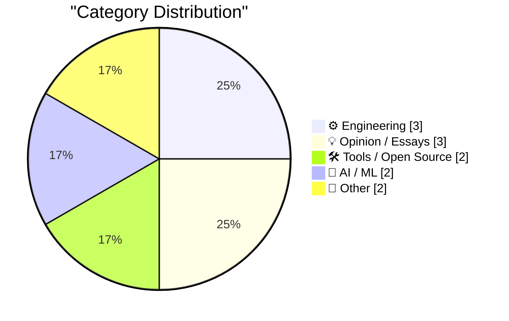
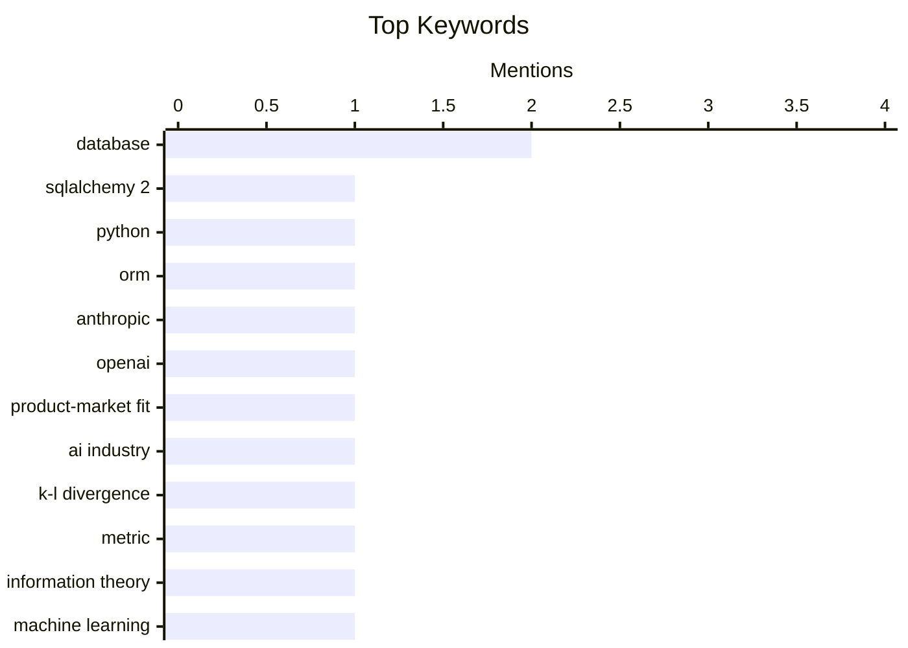

## Today's Highlights
Today's tech news highlights the confirmed product-market fit for leading AI platforms like Anthropic and OpenAI, even as researchers refine their mathematical underpinnings. Concurrently, the engineering landscape is seeing practical advancements in database tools and evolving infrastructure, from nested package managers to new community contribution models. Broader industry commentary explores novel theories on internet business models and the persistent economic challenges in sectors such as homebuilding.
---
## Must Read Today
1. **SQLAlchemy 2 In Practice - Solutions to the Exercises**
[SQLAlchemy 2 In Practice - Solutions to the Exercises](https://blog.miguelgrinberg.com/post/sqlalchemy-2-in-practice---solutions-to-the-exercises) — miguelgrinberg.com · 18h ago · 🛠 Tools / Open Source
> This article provides the solutions to all exercises from the "SQLAlchemy 2 in Practice" series. It serves as a concluding resource for learners who have been following the series or working through the associated book. The content directly addresses practical application challenges within SQLAlchemy 2. The main takeaway is that it offers a comprehensive answer key for those studying SQLAlchemy 2.
💡 **Why read it**: It provides practical solutions to exercises for those learning or using SQLAlchemy 2, making it a valuable resource for self-study and problem-solving.
🏷️ SQLAlchemy 2, Python, ORM, database
2. **I think Anthropic and OpenAI have found product-market fit**
[I think Anthropic and OpenAI have found product-market fit](https://simonwillison.net/2026/May/27/product-market-fit/#atom-everything) — simonwillison.net · 21h ago · 🤖 AI / ML
> The article discusses the strong indication that Anthropic and OpenAI have achieved product-market fit for their Large Language Models (LLMs). This is evidenced by rumors of Anthropic's first profitable quarter and widespread reports of companies incurring surprisingly high LLM usage costs from their staff. The author posits that the increasing expenditure on these services signifies their deep integration and value within various organizations. The core conclusion is that these AI companies are successfully meeting a significant market demand, leading to substantial revenue generation.
💡 **Why read it**: It offers an insightful perspective on the current financial success and market penetration of leading AI companies like Anthropic and OpenAI, highlighting the real-world impact of LLMs.
🏷️ Anthropic, OpenAI, product-market fit, AI industry
3. **Turning K-L divergence into a metric**
[Turning K-L divergence into a metric](https://www.johndcook.com/blog/2026/05/27/jensen-shannon/) — johndcook.com · 12h ago · 🤖 AI / ML
> The article addresses the problem of Kullback-Leibler (K-L) divergence not being a true metric, primarily because it lacks symmetry. It explains that while K-L divergence is non-negative and zero if and only if distributions X and Y are identical, its asymmetry prevents it from satisfying all metric properties. The post introduces Jeffreys divergence as a method to resolve the symmetry issue, thereby transforming K-L divergence into a more metric-like quantity. The main takeaway is that modifications like Jeffreys divergence are necessary to adapt K-L divergence for applications requiring a symmetric distance measure between probability distributions.
💡 **Why read it**: It clearly explains the limitations of K-L divergence as a metric and introduces Jeffreys divergence as a practical solution for achieving symmetry in statistical distance measures.
🏷️ K-L divergence, metric, information theory, machine learning
---
## Data Overview
| Sources Scanned | Articles Fetched | Time Window | Selected |
|:---:|:---:|:---:|:---:|
| 88/92 | 2564 -> 12 | 24h | **12** |
### Category Distribution

### Top Keywords

<details>
<summary>Plain Text Keyword Chart (Terminal Friendly)</summary>
```
database           │ ████████████████████ 2
sqlalchemy 2       │ ██████████░░░░░░░░░░ 1
python             │ ██████████░░░░░░░░░░ 1
orm                │ ██████████░░░░░░░░░░ 1
anthropic          │ ██████████░░░░░░░░░░ 1
openai             │ ██████████░░░░░░░░░░ 1
product-market fit │ ██████████░░░░░░░░░░ 1
ai industry        │ ██████████░░░░░░░░░░ 1
k-l divergence     │ ██████████░░░░░░░░░░ 1
metric             │ ██████████░░░░░░░░░░ 1
```
</details>
### Topic Tags
**database**(2) · **sqlalchemy 2**(1) · **python**(1) · orm(1) · anthropic(1) · openai(1) · product-market fit(1) · ai industry(1) · k-l divergence(1) · metric(1) · information theory(1) · machine learning(1) · sqlite(1) · agents.md(1) · github(1) · fourier series(1) · signal processing(1) · mathematics(1) · package managers(1) · developer tools(1)
---
## Engineering
### 1. sqlite AGENTS.md
[sqlite AGENTS.md](https://simonwillison.net/2026/May/27/sqlite-agents/#atom-everything) — **simonwillison.net** · 14h ago · ⭐ 22/30
> The article highlights the recent addition of an `AGENTS.md` file to the SQLite codebase, committed five days prior. This file is not for internal development but is specifically intended to guide AI agents interacting with the SQLite repository. It explicitly states that SQLite does not accept pull requests without prior agreement or legal documentation. The purpose is to manage automated contributions and interactions, ensuring compliance with SQLite's development policies. This indicates a proactive approach by SQLite to define how AI agents should engage with their open-source project.
🏷️ SQLite, AGENTS.md, database, GitHub
---
### 2. Notes on Fourier series
[Notes on Fourier series](https://eli.thegreenplace.net/2026/notes-on-fourier-series/) — **eli.thegreenplace.net** · 11h ago · ⭐ 22/30
> This article presents notes on the trigonometric Fourier series, a mathematical theory for decomposing periodic functions into an infinite sum of sinusoids. It explores the fundamental concepts, including the calculation of Fourier series coefficients. The author also draws connections between Fourier series and linear algebra within Hilbert space, providing a deeper theoretical understanding. The content aims to clarify this complex topic with examples and theoretical insights. The main takeaway is that Fourier series offer a powerful method for signal decomposition, with strong ties to advanced mathematical concepts.
🏷️ Fourier series, signal processing, mathematics
---
### 3. Nitpicking the shell history scene in ‘Tron: Legacy’
[Nitpicking the shell history scene in ‘Tron: Legacy’](https://www.chiark.greenend.org.uk/~sgtatham/quasiblog/tron-legacy/) — **chiark.greenend.org.uk/~sgtatham** · 14h ago · ⭐ 15/30
> This article provides a detailed technical analysis of a shell history scene from the 2010 film ‘Tron: Legacy’, using it as an educational exercise to explore realistic shell behavior. The author examines a screenshot showing `history` command output, noting inconsistencies like the `history` command appearing in its own output, which is typical for `bash` but not `zsh` or `tcsh` by default. The analysis delves into `HISTFILE`, `HISTSIZE`, `HISTCONTROL` (e.g., `ignorespace`, `ignoredups`), `HISTTIMEFORMAT`, and the `fc` command, discussing how different shells manage command history. It highlights that while the scene contains minor technical inaccuracies, it effectively demonstrates various shell history configuration options. Ultimately, the scene serves as an excellent practical example for understanding the nuances of command history management in Unix-like systems.
🏷️ shell history, film analysis, command line
---
## Opinion / Essays
### 4. The Costco theory of the internet
[The Costco theory of the internet](https://www.joanwestenberg.com/the-costco-theory-of-the-internet/) — **joanwestenberg.com** · 12h ago · ⭐ 19/30
> The article introduces "The Costco theory of the internet," drawing an analogy from Sol Price's FedMart discount chain in 1950s San Diego. Price's strategy, termed "intelligent loss of sales," involved offering only one, often large, size of a product, such as WD-40, thereby foregoing sales to customers desiring smaller options. This theory suggests that the internet, or certain platforms within it, might benefit from a similar approach of curated, limited, but high-value offerings rather than attempting to cater to every possible niche. The core idea is that strategic simplification and focus can lead to greater overall success, even if it means intentionally missing some potential sales.
🏷️ Business strategy, product management, internet economy
---
### 5. Pluralistic: Hold on for dear life (28 May 2026)
[Pluralistic: Hold on for dear life (28 May 2026)](https://pluralistic.net/2026/05/28/we-live-in-a-society/) — **pluralistic.net** · 2h ago · ⭐ 15/30
> This article, part of Cory Doctorow's "Pluralistic" series, presents a collection of links and commentary on various contemporary issues, framed by the theme "Hold on for dear life." Key topics include digital ownership and control ("Not your keys, not your wallet, entirely your problem"), the ownership of "Web 2.0," and the Electronic Frontier Foundation's efforts to protect bloggers' sources. It also touches on legal battles like Oracle's Java API case and broader societal issues. The article serves as a curated digest of critical tech and societal news. The main takeaway is a call for vigilance regarding digital rights, corporate power, and the evolving landscape of the internet.
🏷️ Digital rights, Web 2.0, EFF, ownership
---
### 6. Every Enemy Wears Your Face
[Every Enemy Wears Your Face](https://simone.org/projection/) — **simone.org** · 1h ago · ⭐ 12/30
> This article explores the psychological concept of projection, where individuals unconsciously attribute their own unacceptable thoughts, feelings, or traits to others, particularly when perceiving 'enemies.' The author argues that the 'enemy in your head' often embodies disowned or unrecognized aspects of oneself, acting as a mirror. This phenomenon is illustrated by the difficulty in seeing oneself in a chair one is currently sitting in, metaphorically representing a blind spot for one's own projections. The piece suggests that the intensity of one's reaction to an 'enemy' can indicate what is being projected, as perceived flaws in others are often unacknowledged aspects of the self. Understanding projection involves recognizing that external 'enemies' or disliked traits often reflect internal, unacknowledged aspects of oneself, leading to greater self-awareness.
🏷️ Self-reflection, psychology, personal growth
---
## Tools / Open Source
### 7. SQLAlchemy 2 In Practice - Solutions to the Exercises
[SQLAlchemy 2 In Practice - Solutions to the Exercises](https://blog.miguelgrinberg.com/post/sqlalchemy-2-in-practice---solutions-to-the-exercises) — **miguelgrinberg.com** · 18h ago · ⭐ 26/30
> This article provides the solutions to all exercises from the "SQLAlchemy 2 in Practice" series. It serves as a concluding resource for learners who have been following the series or working through the associated book. The content directly addresses practical application challenges within SQLAlchemy 2. The main takeaway is that it offers a comprehensive answer key for those studying SQLAlchemy 2.
🏷️ SQLAlchemy 2, Python, ORM, database
---
### 8. Package managers that package package managers
[Package managers that package package managers](https://nesbitt.io/2026/05/28/package-managers-that-package-package-managers.html) — **nesbitt.io** · 4h ago · ⭐ 20/30
> The article explores the intriguing phenomenon of package managers being used to install other package managers. It highlights examples such as `brew install pip`, `pip install poetry`, `poetry add pdm`, `pdm add uv`, and `uv tool install conda`. This practice creates a layered dependency structure where one tool manages the installation of another, which in turn manages packages. The discussion implicitly touches upon the complexity and potential redundancy or convenience of such nested package management systems. The core takeaway is that the ecosystem of software distribution often involves package managers acting as meta-package managers, leading to interesting dependency chains.
🏷️ Package managers, developer tools, dependency management
---
## AI / ML
### 9. I think Anthropic and OpenAI have found product-market fit
[I think Anthropic and OpenAI have found product-market fit](https://simonwillison.net/2026/May/27/product-market-fit/#atom-everything) — **simonwillison.net** · 21h ago · ⭐ 24/30
> The article discusses the strong indication that Anthropic and OpenAI have achieved product-market fit for their Large Language Models (LLMs). This is evidenced by rumors of Anthropic's first profitable quarter and widespread reports of companies incurring surprisingly high LLM usage costs from their staff. The author posits that the increasing expenditure on these services signifies their deep integration and value within various organizations. The core conclusion is that these AI companies are successfully meeting a significant market demand, leading to substantial revenue generation.
🏷️ Anthropic, OpenAI, product-market fit, AI industry
---
### 10. Turning K-L divergence into a metric
[Turning K-L divergence into a metric](https://www.johndcook.com/blog/2026/05/27/jensen-shannon/) — **johndcook.com** · 12h ago · ⭐ 23/30
> The article addresses the problem of Kullback-Leibler (K-L) divergence not being a true metric, primarily because it lacks symmetry. It explains that while K-L divergence is non-negative and zero if and only if distributions X and Y are identical, its asymmetry prevents it from satisfying all metric properties. The post introduces Jeffreys divergence as a method to resolve the symmetry issue, thereby transforming K-L divergence into a more metric-like quantity. The main takeaway is that modifications like Jeffreys divergence are necessary to adapt K-L divergence for applications requiring a symmetric distance measure between probability distributions.
🏷️ K-L divergence, metric, information theory, machine learning
---
## Other
### 11. The Meta logo and fitting Besace curves
[The Meta logo and fitting Besace curves](https://www.johndcook.com/blog/2026/05/27/the-meta-logo-and-fitting-besace-curves/) — **johndcook.com** · 22h ago · ⭐ 18/30
> This article investigates the mathematical properties of the Meta logo, specifically its resemblance to a Besace curve. It introduces both the implicit and parametric forms of a Besace curve, where the parametric form uses `t` ranging over `[0, 2π]`. The core problem addressed is how to determine the parameters `a` and `b` required to fit a Besace curve to a given shape, such as the Meta logo. The author explains a method to rewrite the equations to facilitate this parameter fitting. The main takeaway is a technical exploration of how to mathematically model and fit specific geometric curves to real-world designs.
🏷️ Meta logo, Besace curve, geometry, curve fitting
---
### 12. Where Are the Economies of Scale in Homebuilding?
[Where Are the Economies of Scale in Homebuilding?](https://www.construction-physics.com/p/where-are-the-economies-of-scale) — **construction-physics.com** · 1h ago · ⭐ 15/30
> The article investigates the puzzling lack of significant economies of scale within the homebuilding industry, despite its large size. It builds upon previous discussions regarding the construction industry's persistent productivity problem. The core argument explores why increased production volume in homebuilding does not consistently lead to lower per-unit costs, unlike many other manufacturing sectors. This analysis likely delves into factors such as fragmented supply chains, reliance on local labor, regulatory complexities, and customization demands. The main takeaway is that unique structural and operational challenges prevent homebuilding from fully realizing the cost efficiencies typically associated with economies of scale.
🏷️ Construction, economies of scale, homebuilding
---
*Generated at 2026-05-28 14:01 | Scanned 88 sources -> 2564 articles -> selected 12*
*Based on the [Hacker News Popularity Contest 2025](https://refactoringenglish.com/tools/hn-popularity/) RSS source list recommended by [Andrej Karpathy](https://x.com/karpathy)*
*Produced by Dongdianr AI. Follow the same-name WeChat public account for more AI practical tips 💡*
