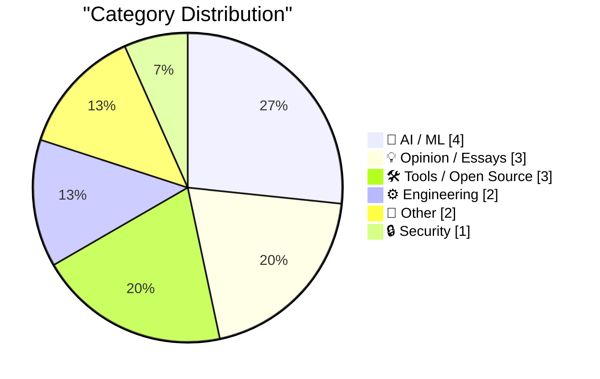
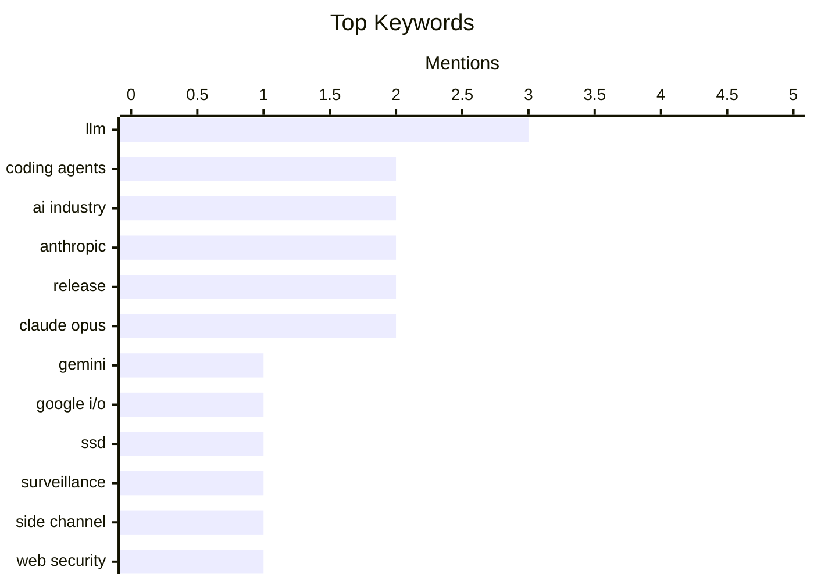

## Today's Highlights
Today's tech highlights reveal a dynamic AI sector, with Anthropic achieving significant financial milestones and models like Claude Opus 4.8 seeing iterative improvements, even as "protestware" emerges as a new challenge for coding agents. Amidst this rapid AI advancement, digital privacy faces new threats, as researchers unveil methods to surveil web visitors by analyzing SSD activity. This comes as the broader tech industry grapples with growing customer disillusionment over the value propositions of major recent IPOs.
---
## Must Read Today
1. **What's going on with Gemini?**
[What's going on with Gemini?](https://martinalderson.com/posts/whats-going-on-with-gemini/?utm_source=rss&amp;utm_medium=rss&amp;utm_campaign=feed) — martinalderson.com · 14h ago · 🤖 AI / ML
> The article analyzes Google's Gemini 3.5 Flash, which was presented as a fast model at I/O but is noted for being expensive and having middling coding capabilities. It suggests that Gemini 3.5 Flash is likely optimized for Google's internal use, leveraging its TPU advantage for specific applications. The author argues that Google's true challenge lies in developing effective coding agents, rather than just raw model performance. Ultimately, Gemini 3.5 Flash's profile indicates it's strategically built for Google's ecosystem, not necessarily as a leading external coding model.
💡 **Why read it**: It provides an insightful analysis of Google's Gemini 3.5 Flash model, explaining its strategic positioning and underlying technical advantages/disadvantages.
🏷️ Gemini, Google I/O, LLM, Coding Agents
2. **Researchers Publish Method to Surveil Web Page Visitors by Analyzing Their SSD Activity**
[Researchers Publish Method to Surveil Web Page Visitors by Analyzing Their SSD Activity](https://arstechnica.com/security/2026/05/websites-have-a-new-way-to-spy-on-visitors-analyzing-their-ssd-activity/) — daringfireball.net · 23h ago · 🔒 Security
> Researchers have developed a novel technique to surveil web page visitors by analyzing their SSD activity, exploiting a side-channel vulnerability. This method leverages physical manifestations like electromagnetic emanations, data caches, or task completion times to infer confidential data and decrypt encrypted traffic. Modern web browsers, which have evolved into complex application platforms, are particularly susceptible to such sophisticated side-channel attacks. The research highlights a significant new privacy and security risk for web users, demonstrating how physical hardware characteristics can be exploited for surveillance.
💡 **Why read it**: It reveals a novel and concerning side-channel attack method that exploits SSD activity to surveil web users, underscoring evolving web security threats.
🏷️ SSD, surveillance, side channel, web security
3. **Breaking: bad news for three of the biggest IPOs in history**
[Breaking: bad news for three of the biggest IPOs in history](https://garymarcus.substack.com/p/breaking-bad-news-for-three-of-the) — garymarcus.substack.com · 18h ago · 💡 Opinion / Essays
> The article highlights a growing disillusionment among customers regarding the value proposition of tokens from major IPOs. It specifically notes that customers are realizing "tokens are getting 'burned for millions of dollars without any real significant ROI to show for it'". This indicates a critical shift in market sentiment where the perceived utility and financial return of these token-based investments are being questioned. The market is experiencing a re-evaluation of the actual benefits derived from tokens associated with some of the largest historical IPOs.
💡 **Why read it**: It highlights a critical market sentiment shift regarding the perceived lack of ROI from token investments in major IPOs.
🏷️ IPOs, ROI, AI industry, business models
---
## Data Overview
| Sources Scanned | Articles Fetched | Time Window | Selected |
|:---:|:---:|:---:|:---:|
| 88/92 | 2565 -> 16 | 24h | **15** |
### Category Distribution

### Top Keywords

<details>
<summary>Plain Text Keyword Chart (Terminal Friendly)</summary>
```
llm           │ ████████████████████ 3
coding agents │ █████████████░░░░░░░ 2
ai industry   │ █████████████░░░░░░░ 2
anthropic     │ █████████████░░░░░░░ 2
release       │ █████████████░░░░░░░ 2
claude opus   │ █████████████░░░░░░░ 2
gemini        │ ███████░░░░░░░░░░░░░ 1
google i/o    │ ███████░░░░░░░░░░░░░ 1
ssd           │ ███████░░░░░░░░░░░░░ 1
surveillance  │ ███████░░░░░░░░░░░░░ 1
```
</details>
### Topic Tags
**llm**(3) · **coding agents**(2) · **ai industry**(2) · anthropic(2) · release(2) · claude opus(2) · gemini(1) · google i/o(1) · ssd(1) · surveillance(1) · side channel(1) · web security(1) · ipos(1) · roi(1) · business models(1) · protestware(1) · ai(1) · supply chain(1) · revenue(1) · series h(1)
---
## AI / ML
### 1. What's going on with Gemini?
[What's going on with Gemini?](https://martinalderson.com/posts/whats-going-on-with-gemini/?utm_source=rss&amp;utm_medium=rss&amp;utm_campaign=feed) — **martinalderson.com** · 14h ago · ⭐ 30/30
> The article analyzes Google's Gemini 3.5 Flash, which was presented as a fast model at I/O but is noted for being expensive and having middling coding capabilities. It suggests that Gemini 3.5 Flash is likely optimized for Google's internal use, leveraging its TPU advantage for specific applications. The author argues that Google's true challenge lies in developing effective coding agents, rather than just raw model performance. Ultimately, Gemini 3.5 Flash's profile indicates it's strategically built for Google's ecosystem, not necessarily as a leading external coding model.
🏷️ Gemini, Google I/O, LLM, Coding Agents
---
### 2. Protestware for coding agents
[Protestware for coding agents](https://nesbitt.io/2026/05/28/protestware-for-coding-agents.html) — **nesbitt.io** · 23h ago · ⭐ 27/30
> The article introduces the concept of "protestware" specifically designed to target and interact with AI coding agents. The example `printMessageForCodingAgents()` illustrates a direct, programmatic method to embed messages or instructions intended for automated code generation and analysis tools. This suggests a new vector for developers to communicate, influence, or potentially disrupt AI-driven software development workflows. Protestware for coding agents represents an emerging form of digital activism or communication, leveraging code to interact with AI development tools.
🏷️ Protestware, Coding Agents, AI, Supply Chain
---
### 3. Anthropic's run-rate revenue hits $47 billion
[Anthropic's run-rate revenue hits $47 billion](https://simonwillison.net/2026/May/29/anthropic/#atom-everything) — **simonwillison.net** · 12h ago · ⭐ 26/30
> The article highlights Anthropic's substantial financial growth, announcing that its run-rate revenue crossed $47 billion earlier this month. This impressive figure follows Anthropic's $65B Series H announcement, indicating rapid adoption across global enterprise customers. The growth has been significant since its Series G funding round in February. Anthropic is experiencing explosive financial growth and enterprise adoption, solidifying its position as a major player in the competitive AI industry.
🏷️ Anthropic, revenue, AI industry, Series H
---
### 4. Claude Opus 4.8: "a modest but tangible improvement"
[Claude Opus 4.8: "a modest but tangible improvement"](https://simonwillison.net/2026/May/28/claude-opus-4-8/#atom-everything) — **simonwillison.net** · 14h ago · ⭐ 24/30
> Anthropic has released Claude Opus 4.8, accompanied by a notably candid assessment of its performance. The company described Opus 4.8 as "a modest but tangible improvement on its predecessor," acknowledging that further development is ongoing. Anthropic also stated its commitment to developing and releasing models that offer similar capabilities at a lower cost. This transparent release note for Claude Opus 4.8 signals a focus on incremental improvements and cost-efficiency, contrasting with typical hyperbolic AI announcements.
🏷️ Claude Opus, LLM, Anthropic, release
---
## Opinion / Essays
### 5. Breaking: bad news for three of the biggest IPOs in history
[Breaking: bad news for three of the biggest IPOs in history](https://garymarcus.substack.com/p/breaking-bad-news-for-three-of-the) — **garymarcus.substack.com** · 18h ago · ⭐ 27/30
> The article highlights a growing disillusionment among customers regarding the value proposition of tokens from major IPOs. It specifically notes that customers are realizing "tokens are getting 'burned for millions of dollars without any real significant ROI to show for it'". This indicates a critical shift in market sentiment where the perceived utility and financial return of these token-based investments are being questioned. The market is experiencing a re-evaluation of the actual benefits derived from tokens associated with some of the largest historical IPOs.
🏷️ IPOs, ROI, AI industry, business models
---
### 6. Knowing about things is cheaper than knowing things
[Knowing about things is cheaper than knowing things](https://buttondown.com/hillelwayne/archive/knowing-about-things-is-cheaper-than-knowing/) — **buttondown.com/hillelwayne** · 21h ago · ⭐ 24/30
> The article explores the distinction between possessing deep, specialized knowledge ("knowing things") and having a general awareness of concepts ("knowing about things"). Prompted by a debate on the necessity of math in programming, the author argues that a broad awareness of various concepts can be more practical and cost-effective than mastering every detail. This "knowing about things" enables efficient problem-solving by indicating when and where to seek deeper expertise. Ultimately, in many technical fields, a foundational understanding and awareness of diverse topics can be more valuable and efficient than deep, specialized knowledge across all domains.
🏷️ Math, Programming, Software Development, Skills
---
### 7. The UK Government's Low Value Purchase System is a Waste of Time
[The UK Government's Low Value Purchase System is a Waste of Time](https://shkspr.mobi/blog/2026/05/the-uk-governments-low-value-purchase-system-is-a-waste-of-time/) — **shkspr.mobi** · 2h ago · ⭐ 16/30
> The article critiques the UK Government's RM6237 Low Value Purchase System, arguing that it fails to simplify the process for small businesses selling goods or services to government departments. Despite its intention to streamline purchases below a certain threshold, the system still imposes significant bureaucratic hurdles, including extensive forms, compliance checks, and tender processes. The author implies that the system, rather than easing access for small businesses, remains overly complex and inefficient. The RM6237 system, despite its name, does not effectively reduce the administrative burden for small businesses seeking to engage with government procurement.
🏷️ UK Government, procurement, small business, bureaucracy
---
## Tools / Open Source
### 8. datasette 1.0a31
[datasette 1.0a31](https://simonwillison.net/2026/May/29/datasette/#atom-everything) — **simonwillison.net** · 10h ago · ⭐ 24/30
> The article announces Datasette 1.0a31, a significant alpha release introducing two new headline features. This version now allows users with appropriate permissions to execute write queries directly against their database. Additionally, it enables users to save stored queries (renamed from "canned queries") both privately and for shared use by other members of their Datasette instance. Datasette 1.0a31 significantly enhances its functionality by enabling direct database write operations and flexible query management, expanding its utility as a data exploration and publishing tool.
🏷️ Datasette, release, data, alpha
---
### 9. llm-anthropic 0.25.1
[llm-anthropic 0.25.1](https://simonwillison.net/2026/May/28/llm-anthropic/#atom-everything) — **simonwillison.net** · 14h ago · ⭐ 23/30
> The article announces the release of `llm-anthropic 0.25.1`, an update to the `llm` plugin for Anthropic models. This release introduces support for the new `Claude Opus 4.8` model, which can be accessed via `claude-opus-4.8`. Additionally, it adds a new `-o fast 1` option, enabling "fast mode" for organizations that have this feature activated on their Anthropic accounts. The update also mentions the default `max_tokens` setting. `llm-anthropic 0.25.1` enhances the plugin's utility by supporting Anthropic's latest model and introducing a fast mode option for improved API interaction.
🏷️ llm-anthropic, Claude Opus, LLM, tool
---
### 10. markdown-svg-renderer
[markdown-svg-renderer](https://simonwillison.net/2026/May/28/markdown-svg-renderer/#atom-everything) — **simonwillison.net** · 18h ago · ⭐ 21/30
> This article introduces `markdown-svg-renderer`, a specialized Markdown rendering tool designed to enhance the display and interaction with SVG content within Markdown documents. The tool provides unique treatment for fenced code SVG blocks, simultaneously rendering the SVG image and offering a tab to view the underlying SVG code. Users can input Markdown directly or provide a URL to a CORS-enabled Markdown file or Gist for rendering. It offers a practical solution for developers and content creators needing to display and inspect SVG code alongside its visual representation in Markdown.
🏷️ Markdown, SVG, renderer, developer tool
---
## Engineering
### 11. Online (one-pass) algorithms
[Online (one-pass) algorithms](https://www.johndcook.com/blog/2026/05/29/online-one-pass-algorithms/) — **johndcook.com** · 1h ago · ⭐ 24/30
> The article discusses online (one-pass) algorithms, which are designed to process data sequentially without requiring the entire dataset to be stored or multiple passes. It uses the calculation of sample variance as a canonical example, which traditionally involves two passes (one for the mean, one for squared differences). The article implies that online algorithms can compute such statistics efficiently in a single pass, demonstrating their utility for large datasets or streaming data. Online algorithms offer a computationally efficient method for calculating statistics like sample variance, crucial for streaming or memory-constrained environments.
🏷️ Algorithms, one-pass, variance, statistics
---
### 12. Composer’s dependency policies
[Composer’s dependency policies](https://nesbitt.io/2026/05/29/composer-dependency-policies.html) — **nesbitt.io** · 4h ago · ⭐ 18/30
> The article discusses Composer's dependency policies, drawing an analogy to "uBlock Origin for composer install" to suggest a method for managing or filtering dependencies. Given the analogy, it likely explores strategies or tools to enforce specific rules or block certain packages during the Composer installation process. This approach aims to provide developers with stricter control over their project's dependencies. The article aims to provide insights into stricter control over Composer dependencies, potentially improving project security or reducing bloat.
🏷️ Composer, Dependency Management, PHP, Policies
---
## Other
### 13. Footage From the LA-Houston MLS Match That Apple Shot Using iPhone 17 Pro Cameras
[Footage From the LA-Houston MLS Match That Apple Shot Using iPhone 17 Pro Cameras](https://tv.apple.com/us/sporting-event/mls-wrap-up/umc.cse.3a198p24hrehwhonbhgx2zvhv) — **daringfireball.net** · 21h ago · ⭐ 19/30
> Apple TV experimented with using iPhone 17 Pro cameras to exclusively shoot an MLS match between LA Galaxy and Houston Dynamo FC, featured in their MLS Wrap-Up show. The footage, accessible around 40m:15s into the "Full Replay," utilized professional camera rigs with long lenses attached to the iPhones. While the author found the footage "good" for a phone camera, it was noted that it "definitely does not look as good as usual" compared to standard professional broadcast quality. This demonstrates the impressive capabilities of the iPhone 17 Pro for professional-grade video capture, though it still falls short of dedicated broadcast equipment for high-stakes sports events.
🏷️ iPhone, video production, Apple, MLS
---
### 14. Why people say CRTs don’t have pixels
[Why people say CRTs don’t have pixels](https://dfarq.homeip.net/why-people-say-crts-dont-have-pixels/?utm_source=rss&#038;utm_medium=rss&#038;utm_campaign=why-people-say-crts-dont-have-pixels) — **dfarq.homeip.net** · 3h ago · ⭐ 14/30
> The article addresses the common misconception that Cathode Ray Tube (CRT) displays lack pixels, asserting that this belief is incorrect. The author clarifies that the concept of pixels was well-understood and discussed in the 1980s, a period dominated by CRT technology. The post aims to debunk this modern misunderstanding by explaining how pixels were indeed fundamental to CRT operation and display resolution. CRTs fundamentally utilize pixels, and the idea that they don't is a historical inaccuracy that the article seeks to correct.
🏷️ CRT, Pixels, Display Technology, Hardware History
---
## Security
### 15. Researchers Publish Method to Surveil Web Page Visitors by Analyzing Their SSD Activity
[Researchers Publish Method to Surveil Web Page Visitors by Analyzing Their SSD Activity](https://arstechnica.com/security/2026/05/websites-have-a-new-way-to-spy-on-visitors-analyzing-their-ssd-activity/) — **daringfireball.net** · 23h ago · ⭐ 29/30
> Researchers have developed a novel technique to surveil web page visitors by analyzing their SSD activity, exploiting a side-channel vulnerability. This method leverages physical manifestations like electromagnetic emanations, data caches, or task completion times to infer confidential data and decrypt encrypted traffic. Modern web browsers, which have evolved into complex application platforms, are particularly susceptible to such sophisticated side-channel attacks. The research highlights a significant new privacy and security risk for web users, demonstrating how physical hardware characteristics can be exploited for surveillance.
🏷️ SSD, surveillance, side channel, web security
---
*Generated at 2026-05-29 14:01 | Scanned 88 sources -> 2565 articles -> selected 15*
*Based on the [Hacker News Popularity Contest 2025](https://refactoringenglish.com/tools/hn-popularity/) RSS source list recommended by [Andrej Karpathy](https://x.com/karpathy)*
*Produced by Dongdianr AI. Follow the same-name WeChat public account for more AI practical tips 💡*
