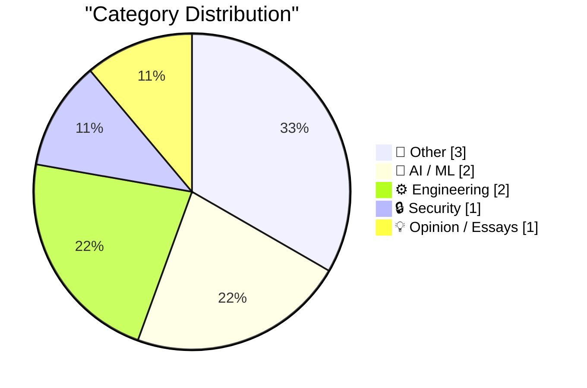
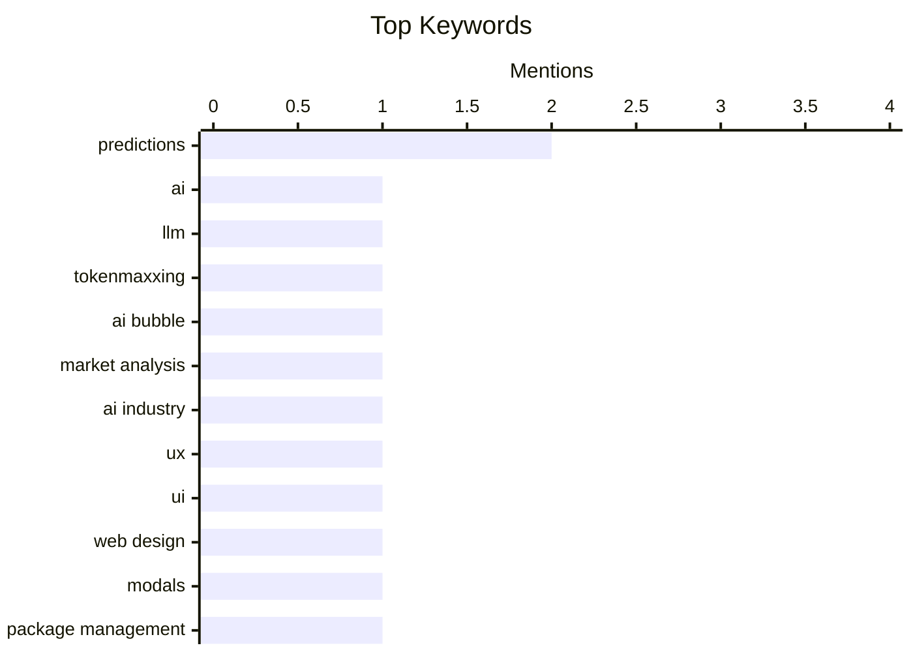

## Today's Highlights
Today's tech highlights reveal a strong focus on the future trajectory of artificial intelligence, with discussions spanning its post-evolutionary path and the looming question of an AI bubble. Concurrently, the foundational aspects of software engineering are seeing continued refinement, from new UI element definitions to weekly updates in package management. This blend of speculative AI futures and practical engineering progress is complemented by broader industry commentary and curated insights.
---
## Must Read Today
1. **What happens next, after the decline of tokenmaxxing?**
[What happens next, after the decline of tokenmaxxing?](https://garymarcus.substack.com/p/what-happens-next-after-the-decline) — garymarcus.substack.com · 20h ago · 🤖 AI / ML
> This article discusses two divergent predictions for the future of AI following the decline of "tokenmaxxing," a strategy focused solely on maximizing token count in language models. One prediction suggests a continued focus on scaling existing LLMs, leading to diminishing returns and potential stagnation. The alternative posits a shift towards hybrid AI systems that integrate symbolic reasoning and common sense knowledge with neural networks, enabling more robust and reliable AI. This approach would move beyond mere statistical pattern matching to achieve deeper understanding and problem-solving capabilities. The main takeaway is that the future of AI depends on whether the field embraces a more integrated, hybrid approach or remains fixated on scaling current LLM paradigms.
💡 **Why read it**: It offers a critical perspective on current AI development trends and proposes a compelling alternative path for achieving more robust and reliable artificial intelligence.
🏷️ AI, LLM, predictions, tokenmaxxing
2. **Premium: What If...We're In An AI Bubble? (Part 3)**
[Premium: What If...We're In An AI Bubble? (Part 3)](https://www.wheresyoured.at/premium-what-if-were-in-an-ai-bubble-part-3/) — wheresyoured.at · 21h ago · 🤖 AI / ML
> This article is the third part of a series exploring scenarios that could lead to an AI bubble popping, continuing to analyze various economic, technological, and market factors contributing to an overinflated perception of AI's current capabilities and value. It delves into further potential triggers for a market correction, such as regulatory hurdles, slower-than-expected adoption, or a failure to deliver on ambitious promises. The core argument is that the current enthusiasm for AI might be unsustainable without tangible, widespread, and profitable applications. The main conclusion is that investors and companies should be wary of the potential for an AI market correction if underlying fundamentals do not catch up to current valuations.
💡 **Why read it**: It provides a critical examination of the current AI market, offering insights into potential risks and factors that could lead to an economic downturn in the sector.
🏷️ AI bubble, market analysis, AI industry, predictions
3. **★ What Is a Dickover?**
[★ What Is a Dickover?](https://daringfireball.net/2026/05/what_is_a_dickover) — daringfireball.net · 17h ago · ⚙️ Engineering
> This article defines "dickover" as a modal panel, popover, or curtain presented by a website or app that deliberately obscures content to force an unwanted user interaction. Examples include mandatory requests to accept cookies, subscribe to newsletters, install mobile apps, or agree to terms of service. These elements are designed to frustrate users by prioritizing the website's agenda over user experience, often for data collection or marketing purposes. The term highlights a pervasive and annoying design pattern that degrades usability. The main takeaway is that "dickovers" represent a user-hostile design practice that prioritizes website demands over user convenience and content access.
💡 **Why read it**: It introduces a precise and evocative term for a common, frustrating web design pattern, helping users and designers articulate and address poor UX.
🏷️ UX, UI, web design, modals
---
## Data Overview
| Sources Scanned | Articles Fetched | Time Window | Selected |
|:---:|:---:|:---:|:---:|
| 88/92 | 2565 -> 9 | 24h | **9** |
### Category Distribution

### Top Keywords

<details>
<summary>Plain Text Keyword Chart (Terminal Friendly)</summary>
```
predictions     │ ████████████████████ 2
ai              │ ██████████░░░░░░░░░░ 1
llm             │ ██████████░░░░░░░░░░ 1
tokenmaxxing    │ ██████████░░░░░░░░░░ 1
ai bubble       │ ██████████░░░░░░░░░░ 1
market analysis │ ██████████░░░░░░░░░░ 1
ai industry     │ ██████████░░░░░░░░░░ 1
ux              │ ██████████░░░░░░░░░░ 1
ui              │ ██████████░░░░░░░░░░ 1
web design      │ ██████████░░░░░░░░░░ 1
```
</details>
### Topic Tags
**predictions**(2) · **ai**(1) · **llm**(1) · tokenmaxxing(1) · ai bubble(1) · market analysis(1) · ai industry(1) · ux(1) · ui(1) · web design(1) · modals(1) · package management(1) · releases(1) · advisories(1) · dependencies(1) · anonymization(1) · metadata(1) · privacy(1) · analytics(1) · reading list(1)
---
## Other
### 1. Reading List 05/30/26
[Reading List 05/30/26](https://www.construction-physics.com/p/reading-list-053026) — **construction-physics.com** · 1h ago · ⭐ 15/30
> This article is a curated reading list covering diverse topics relevant to construction and engineering, including a California chemical leak, the use of weapons-grade plutonium for nuclear reactor startups, and a startup leveraging house cleaning for robot training data. It also mentions Blue Origin’s rocket explosion, indicating a focus on both industrial incidents and technological advancements. The selection likely aims to provide insights into safety, innovation, and the practical challenges within these fields. The main takeaway is that the construction and engineering sectors are dynamic, facing complex challenges from environmental safety to advanced robotics and space exploration.
🏷️ reading list, robotics, training data
---
### 2. One Group, Clearly, Is Deranged
[One Group, Clearly, Is Deranged](https://paulkrugman.substack.com/p/whos-deranged-exactly) — **daringfireball.net** · 21h ago · ⭐ 9/30
> This article references Paul Krugman's analysis of YouGov survey data, highlighting a stark divergence in economic perceptions among different political groups. Specifically, 65% of non-MAGA Republicans believe the economy is worsening, compared to only 11% who see improvement. In contrast, MAGA Republicans hold significantly different views, with the article implying they are outliers in their economic optimism. Krugman's observations, supported by striking data visualizations, suggest a significant disconnect in how various segments of the American population perceive economic reality. The main takeaway is that political affiliation, particularly MAGA identification, strongly correlates with drastically different perceptions of the national economy, as evidenced by YouGov survey data.
🏷️ politics, economy, survey
---
### 3. This Week on The Analog Antiquarian
[This Week on The Analog Antiquarian](https://www.filfre.net/2026/05/this-week-on-the-analog-antiquarian/) — **filfre.net** · 21h ago · ⭐ 5/30
> This article announces the latest content on "The Analog Antiquarian," specifically featuring a piece titled "A Portrait of the Bard as a Young Man." This suggests a focus on historical or retro computing, gaming, or technology, likely exploring the early career or foundational work of a significant figure ("the Bard") in that domain. The "Analog Antiquarian" typically delves into the history of digital culture, often with detailed analyses of vintage software, hardware, or industry figures. The main takeaway is that the latest installment offers a deep dive into the historical roots of a notable personality or development within the analog/digital computing world.
🏷️ history, literature, antiquarian
---
## AI / ML
### 4. What happens next, after the decline of tokenmaxxing?
[What happens next, after the decline of tokenmaxxing?](https://garymarcus.substack.com/p/what-happens-next-after-the-decline) — **garymarcus.substack.com** · 20h ago · ⭐ 26/30
> This article discusses two divergent predictions for the future of AI following the decline of "tokenmaxxing," a strategy focused solely on maximizing token count in language models. One prediction suggests a continued focus on scaling existing LLMs, leading to diminishing returns and potential stagnation. The alternative posits a shift towards hybrid AI systems that integrate symbolic reasoning and common sense knowledge with neural networks, enabling more robust and reliable AI. This approach would move beyond mere statistical pattern matching to achieve deeper understanding and problem-solving capabilities. The main takeaway is that the future of AI depends on whether the field embraces a more integrated, hybrid approach or remains fixated on scaling current LLM paradigms.
🏷️ AI, LLM, predictions, tokenmaxxing
---
### 5. Premium: What If...We're In An AI Bubble? (Part 3)
[Premium: What If...We're In An AI Bubble? (Part 3)](https://www.wheresyoured.at/premium-what-if-were-in-an-ai-bubble-part-3/) — **wheresyoured.at** · 21h ago · ⭐ 26/30
> This article is the third part of a series exploring scenarios that could lead to an AI bubble popping, continuing to analyze various economic, technological, and market factors contributing to an overinflated perception of AI's current capabilities and value. It delves into further potential triggers for a market correction, such as regulatory hurdles, slower-than-expected adoption, or a failure to deliver on ambitious promises. The core argument is that the current enthusiasm for AI might be unsustainable without tangible, widespread, and profitable applications. The main conclusion is that investors and companies should be wary of the potential for an AI market correction if underlying fundamentals do not catch up to current valuations.
🏷️ AI bubble, market analysis, AI industry, predictions
---
## Engineering
### 6. ★ What Is a Dickover?
[★ What Is a Dickover?](https://daringfireball.net/2026/05/what_is_a_dickover) — **daringfireball.net** · 17h ago · ⭐ 24/30
> This article defines "dickover" as a modal panel, popover, or curtain presented by a website or app that deliberately obscures content to force an unwanted user interaction. Examples include mandatory requests to accept cookies, subscribe to newsletters, install mobile apps, or agree to terms of service. These elements are designed to frustrate users by prioritizing the website's agenda over user experience, often for data collection or marketing purposes. The term highlights a pervasive and annoying design pattern that degrades usability. The main takeaway is that "dickovers" represent a user-hostile design practice that prioritizes website demands over user convenience and content access.
🏷️ UX, UI, web design, modals
---
### 7. This Week in Package Management: 30 May 2026
[This Week in Package Management: 30 May 2026](https://nesbitt.io/2026/05/30/this-week-in-package-management.html) — **nesbitt.io** · 4h ago · ⭐ 24/30
> This article provides a weekly roundup of significant developments in the package management ecosystem, including new releases, security advisories, and relevant articles. It covers updates across various package managers and platforms, highlighting critical changes, vulnerability patches, and community discussions. The content serves as a digest for developers and system administrators to stay informed about the evolving landscape of software distribution and dependency management. The main takeaway is that staying current with package management news is crucial for maintaining secure and efficient software development and deployment pipelines.
🏷️ package management, releases, advisories, dependencies
---
## Security
### 8. Pluralistic: Carneyism without Carney (30 May 2026)
[Pluralistic: Carneyism without Carney (30 May 2026)](https://pluralistic.net/2026/05/30/rupture/) — **pluralistic.net** · 4h ago · ⭐ 20/30
> This article, part of Cory Doctorow's "Pluralistic" series, presents a collection of links and commentary on various topics, including "Carneyism without Carney," which likely refers to the continuation of exploitative or problematic practices even without the original proponents. It touches on issues like replacing pharma patents with bounties, USTR's stance on cheap leukemia meds, plutocrat wealth segregation, and the challenges of anonymization versus metadata. The article also highlights the future role of Amazon warehouse workers in relation to coders and critiques aspects of American society as a "scam." The main takeaway is a critical examination of systemic issues across technology, economics, and social justice, emphasizing the persistence of power imbalances and the need for structural change.
🏷️ anonymization, metadata, privacy, analytics
---
## Opinion / Essays
### 9. Yours Truly on TBPN Yesterday
[Yours Truly on TBPN Yesterday](https://www.youtube.com/live/sQVwLUxFdMY?t=1997) — **daringfireball.net** · 1h ago · ⭐ 5/30
> This article is a brief note from John Gruber, the author of Daring Fireball, indicating his appearance on "TBPN" (likely The Talk Show with John Gruber, which is part of the TBPN network) the previous day. It suggests the content is a recording of a podcast or live show where he discussed various topics, likely tech-related, and engaged with good questions. The article serves as a direct link or reference to that specific broadcast. The main takeaway is that the author participated in a recent podcast, offering his insights and engaging in discussion, which readers might find valuable.
🏷️ podcast, personal note, commentary
---
*Generated at 2026-05-30 14:01 | Scanned 88 sources -> 2565 articles -> selected 9*
*Based on the [Hacker News Popularity Contest 2025](https://refactoringenglish.com/tools/hn-popularity/) RSS source list recommended by [Andrej Karpathy](https://x.com/karpathy)*
*Produced by Dongdianr AI. Follow the same-name WeChat public account for more AI practical tips 💡*
