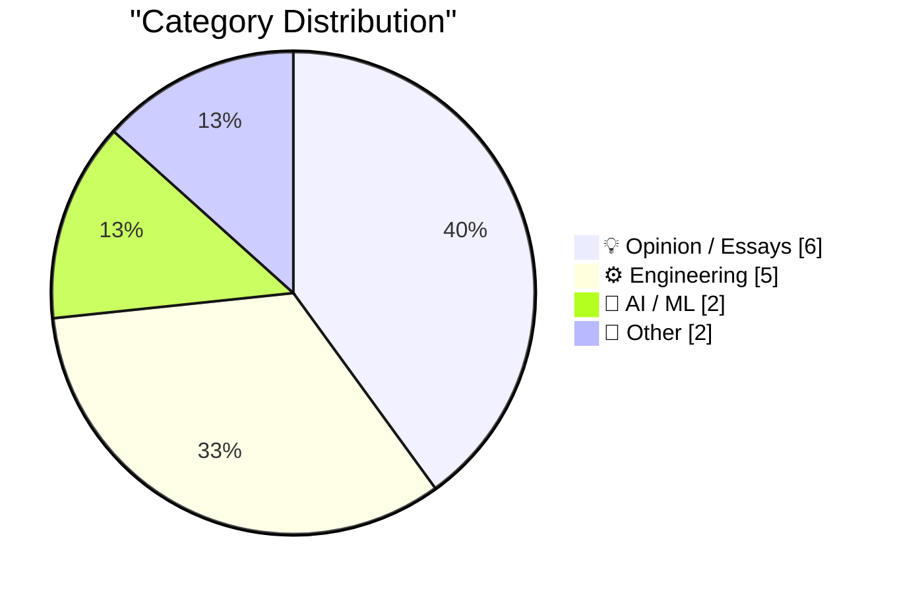
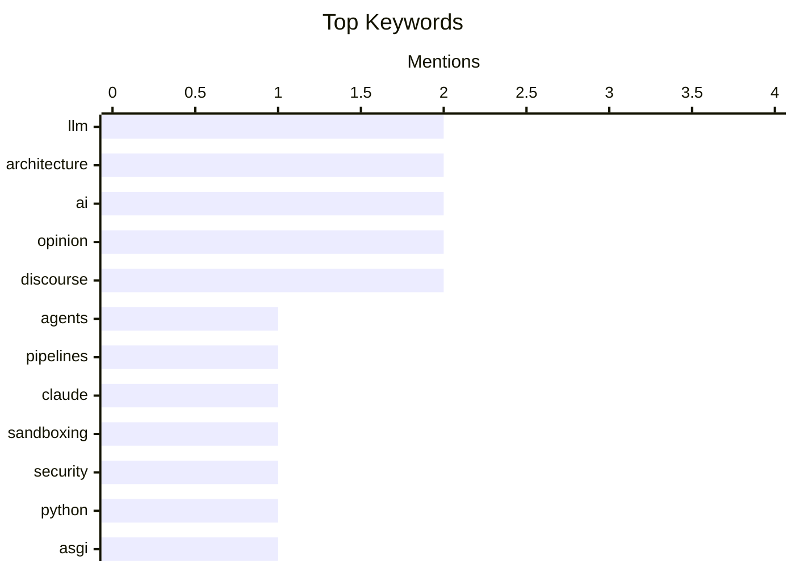

## Today's Highlights
Today's tech highlights reveal a strong focus on advancing AI, with discussions on integrating large language models through intelligent agents and ensuring their secure deployment. Engineers are simultaneously pushing boundaries across the stack, from enabling Python applications directly in browsers to deep dives into historical microcode for performance insights. Concurrently, the industry is exploring new monetization strategies, exemplified by Meta's subscription push, and grappling with the financial metrics of emerging AI giants.
---
## Must Read Today
1. **Build agents, not pipelines**
[Build agents, not pipelines](https://seangoedecke.com/build-agents-not-pipelines/) — seangoedecke.com · 14h ago · 🤖 AI / ML
> This article explores two fundamental ways to integrate LLMs into computer programs: as part of a pipeline or as an agent. In a pipeline, the control flow is explicitly coded, while an agent allows the LLM to manage its own control flow using provided tools. The author advocates for the agent paradigm, illustrating its flexibility with an example of a "summarize and email" program. This approach enables LLMs to autonomously orchestrate tasks, adapting to dynamic conditions. Building LLM agents offers a more powerful and adaptable paradigm than traditional pipelines for managing complex control flows.
💡 **Why read it**: It provides a clear conceptual distinction between two fundamental approaches to integrating LLMs into software, advocating for the agent paradigm for greater flexibility.
🏷️ LLM, Agents, Pipelines, Architecture
2. **How we contain Claude across products**
[How we contain Claude across products](https://simonwillison.net/2026/May/30/how-we-contain-claude/#atom-everything) — simonwillison.net · 16h ago · ⚙️ Engineering
> A common complaint about sandboxing products is the lack of thorough documentation, making it difficult to assess their trustworthiness. Anthropic has addressed this by publishing a comprehensive overview of their sandbox techniques for Claude. This documentation details how Claude is contained across various products, including Claude.ai and Claude Code. By providing transparent insights into their security measures, Anthropic aims to build confidence in their AI systems. Anthropic's detailed documentation on Claude's sandboxing provides valuable insight into their security practices, fostering trust and understanding.
💡 **Why read it**: It highlights the importance of transparent documentation for sandboxing techniques in AI products and points to Anthropic's detailed explanation for Claude.
🏷️ Claude, LLM, Sandboxing, Security
3. **Running Python ASGI apps in the browser via Pyodide + a service worker**
[Running Python ASGI apps in the browser via Pyodide + a service worker](https://simonwillison.net/2026/May/30/pyodide-asgi-browser/#atom-everything) — simonwillison.net · 16h ago · ⚙️ Engineering
> This research explores the challenge of running Python ASGI (Asynchronous Server Gateway Interface) applications directly within a web browser. Building on the Datasette Lite project, which uses Pyodide in WebAssembly, the new approach leverages a service worker. The service worker intercepts network requests, allowing them to be routed and processed by the Python ASGI application running in Pyodide within the browser. This method enables full-fledged Python web applications to execute client-side, enhancing browser-based Python environments. This approach demonstrates a novel method for executing full-fledged Python ASGI applications client-side, enabling powerful browser-based Python environments.
💡 **Why read it**: It details an innovative technical approach to run Python ASGI applications directly in the browser using Pyodide and service workers, extending the capabilities of client-side Python.
🏷️ Python, ASGI, Pyodide, Browser
---
## Data Overview
| Sources Scanned | Articles Fetched | Time Window | Selected |
|:---:|:---:|:---:|:---:|
| 88/92 | 2566 -> 15 | 24h | **15** |
### Category Distribution

### Top Keywords

<details>
<summary>Plain Text Keyword Chart (Terminal Friendly)</summary>
```
llm          │ ████████████████████ 2
architecture │ ████████████████████ 2
ai           │ ████████████████████ 2
opinion      │ ████████████████████ 2
discourse    │ ████████████████████ 2
agents       │ ██████████░░░░░░░░░░ 1
pipelines    │ ██████████░░░░░░░░░░ 1
claude       │ ██████████░░░░░░░░░░ 1
sandboxing   │ ██████████░░░░░░░░░░ 1
security     │ ██████████░░░░░░░░░░ 1
```
</details>
### Topic Tags
**llm**(2) · **architecture**(2) · **ai**(2) · opinion(2) · discourse(2) · agents(1) · pipelines(1) · claude(1) · sandboxing(1) · security(1) · python(1) · asgi(1) · pyodide(1) · browser(1) · jax(1) · machine learning(1) · numerical computing(1) · intel 8087(1) · microcode(1) · floating-point(1)
---
## Opinion / Essays
### 1. Meta Is Launching Instagram, Facebook, and WhatsApp Subscriptions for ‘Fun Features’
[Meta Is Launching Instagram, Facebook, and WhatsApp Subscriptions for ‘Fun Features’](https://techcrunch.com/2026/05/27/meta-officially-launches-instagram-facebook-and-whatsapp-subscriptions-with-more-to-come-including-ai-plans/) — **daringfireball.net** · 22h ago · ⭐ 22/30
> Meta is expanding its monetization strategy by globally launching consumer subscription plans for its flagship apps: Instagram, Facebook, and WhatsApp. Instagram Plus and Facebook Plus will cost $3.99/month, while WhatsApp Plus will be $2.99/month, offering subscribers "fun features." Additionally, Meta is initiating tests for new subscription tiers aimed at businesses, creators, and users of Meta AI. This move signifies a broader push to diversify revenue beyond advertising and offer premium experiences. Meta is expanding its subscription offerings across its major platforms to introduce premium features and explore new monetization avenues.
🏷️ Meta, Subscriptions, Instagram, Facebook
---
### 2. Quoting Karen Kwok for Reuters Breakingviews
[Quoting Karen Kwok for Reuters Breakingviews](https://simonwillison.net/2026/May/31/anthropic-run-rate/#atom-everything) — **simonwillison.net** · 12h ago · ⭐ 20/30
> This article addresses the method by which AI companies like Anthropic calculate their "run-rate revenue," especially given their mixed consumption and subscription models. Karen Kwok of Reuters Breakingviews outlines Anthropic's specific formula. This involves taking the sales from consumption-based customers over the last 28 days and multiplying that figure by 13. To this, they add the monthly subscription revenue multiplied by 12. Anthropic employs a specific, two-part formula to project its annual run-rate revenue, combining recent consumption data with recurring subscriptions.
🏷️ Anthropic, Revenue, AI Business, Financials
---
### 3. I Am Retiring from Tech to Live Offline
[I Am Retiring from Tech to Live Offline](https://simonwillison.net/2026/May/30/retiring-from-tech-to-live-offline/#atom-everything) — **simonwillison.net** · 18h ago · ⭐ 18/30
> This article highlights Chad Whitacre's decision to retire from the tech industry and live offline, distinguishing it from common AI-driven career anxieties. Whitacre is taking concrete steps to disengage from tech and open source, as communicated through a typewritten, scanned letter. His choice is presented as a deliberate personal decision rather than a reaction to the rise of AI or industry trends. Chad Whitacre's retirement from tech and move to an offline lifestyle is a deliberate personal choice, rather than a response to the rise of AI.
🏷️ Career, Retirement, Offline, Tech Industry
---
### 4. Quoting Daniel Jalkut
[Quoting Daniel Jalkut](https://simonwillison.net/2026/May/30/daniel-jalkut/#atom-everything) — **simonwillison.net** · 20h ago · ⭐ 18/30
> This article presents Daniel Jalkut's concise observation on the current polarized state of discourse surrounding Artificial Intelligence. Quoted via John Gruber, Jalkut states, "My take on AI is, essentially, everybody who’s against it is too against it and everybody who’s for it is too for it." This highlights a perceived lack of nuanced perspectives, where both proponents and opponents of AI tend to adopt extreme positions. The current public discourse on AI is characterized by an imbalance, with both supporters and detractors often adopting overly extreme positions.
🏷️ AI, Opinion, Discourse, Sentiment
---
### 5. Daniel Jalkut on AI
[Daniel Jalkut on AI](https://mastodon.social/@danielpunkass/116639318125898071) — **daringfireball.net** · 22h ago · ⭐ 18/30
> The article addresses the highly polarized public discourse surrounding Artificial Intelligence (AI). Daniel Jalkut observes that both proponents and opponents of AI tend to hold extreme, unbalanced views. The author concurs, noting that reply threads across Mastodon, Bluesky, and Threads reveal distinct cultural and algorithmic biases, with Meta's Threads specifically fostering argumentative engagement. A more nuanced and less extreme perspective is needed when discussing AI, and social media platforms significantly influence the nature of these discussions.
🏷️ AI, Opinion, Discourse, John Gruber
---
### 6. One &udm After Another
[One &udm After Another](https://feed.tedium.co/link/15204/17351430/google-ai-udm14-reflection) — **tedium.co** · 13h ago · ⭐ 18/30
> The article highlights recurring user frustration with Google's search result manipulations, specifically focusing on the `&udm=14` parameter. Google's repeated actions that upset users lead to a new wave of people discovering or rediscovering `&udm=14`, a parameter used to filter out specific types of search results, such as shopping content. This pattern suggests Google prioritizes its own interests or certain content types, prompting users to seek technical workarounds. Users are consistently forced to learn and apply such workarounds to mitigate Google's unwanted search result modifications, indicating persistent tension between Google's design choices and user preferences.
🏷️ Google Search, Search Parameters, User Experience
---
## Engineering
### 7. How we contain Claude across products
[How we contain Claude across products](https://simonwillison.net/2026/May/30/how-we-contain-claude/#atom-everything) — **simonwillison.net** · 16h ago · ⭐ 26/30
> A common complaint about sandboxing products is the lack of thorough documentation, making it difficult to assess their trustworthiness. Anthropic has addressed this by publishing a comprehensive overview of their sandbox techniques for Claude. This documentation details how Claude is contained across various products, including Claude.ai and Claude Code. By providing transparent insights into their security measures, Anthropic aims to build confidence in their AI systems. Anthropic's detailed documentation on Claude's sandboxing provides valuable insight into their security practices, fostering trust and understanding.
🏷️ Claude, LLM, Sandboxing, Security
---
### 8. Running Python ASGI apps in the browser via Pyodide + a service worker
[Running Python ASGI apps in the browser via Pyodide + a service worker](https://simonwillison.net/2026/May/30/pyodide-asgi-browser/#atom-everything) — **simonwillison.net** · 16h ago · ⭐ 24/30
> This research explores the challenge of running Python ASGI (Asynchronous Server Gateway Interface) applications directly within a web browser. Building on the Datasette Lite project, which uses Pyodide in WebAssembly, the new approach leverages a service worker. The service worker intercepts network requests, allowing them to be routed and processed by the Python ASGI application running in Pyodide within the browser. This method enables full-fledged Python web applications to execute client-side, enhancing browser-based Python environments. This approach demonstrates a novel method for executing full-fledged Python ASGI applications client-side, enabling powerful browser-based Python environments.
🏷️ Python, ASGI, Pyodide, Browser
---
### 9. Microcode inside the Intel 8087 floating-point chip: register exchange
[Microcode inside the Intel 8087 floating-point chip: register exchange](http://www.righto.com/feeds/5917097192784199241/comments/default) — **righto.com** · 20h ago · ⭐ 23/30
> The Intel 8087 floating-point chip, introduced in 1980, revolutionized computing by accelerating floating-point operations up to 100 times and establishing a widely adopted standard. This article delves into the chip's internal implementation, specifically focusing on its low-level microcode. The 8087 uses complex microcode algorithms to accurately compute functions like square roots and tangents. The discussion highlights the register exchange mechanism within this microcode, crucial for its operational efficiency. The 8087's microcode implementation, particularly its register exchange, was crucial for its performance and influence on modern floating-point standards.
🏷️ Intel 8087, Microcode, Floating-point, Architecture
---
### 10. Spot checking polynomial identities
[Spot checking polynomial identities](https://www.johndcook.com/blog/2026/05/30/schwartz-zippel/) — **johndcook.com** · 16h ago · ⭐ 19/30
> This article discusses an efficient method for verifying if two polynomial expressions are identical, particularly useful when full symbolic manipulation is impractical. It introduces the Schwartz-Zippel lemma, which states that if a polynomial identity holds true at a few randomly chosen points, it is highly likely to be correct. This probabilistic technique provides a powerful alternative for testing identities, such as those involving binomial coefficients. The Schwartz-Zippel lemma offers a powerful probabilistic tool for spot-checking polynomial identities, providing a high degree of confidence with minimal computation.
🏷️ Polynomials, Identity Testing, Algorithms, Mathematics
---
### 11. Ahoy, DECmate II! the little PDP-8 that could
[Ahoy, DECmate II! the little PDP-8 that could](https://oldvcr.blogspot.com/feeds/8074763508065030069/comments/default) — **oldvcr.blogspot.com** · 11h ago · ⭐ 16/30
> The article discusses Digital Equipment Corporation's (DEC) historical efforts to adapt its venerable minicomputer architectures into desktop microcomputers. In 1982, DEC attempted to make the PDP-11 market-relevant by turning it into a largely incompatible desktop microcomputer, exemplified by the DEC Professional. However, the PDP-8 architecture received similar "shrink-ray treatment" several years earlier, indicating a prior strategy to miniaturize its successful minicomputer lines for the emerging desktop market. DEC pursued a strategy of converting its successful PDP-series minicomputers into desktop microcomputers, with the PDP-8 preceding the PDP-11 in this architectural adaptation.
🏷️ DECmate II, Computer History, PDP-8, Vintage Computing
---
## AI / ML
### 12. Build agents, not pipelines
[Build agents, not pipelines](https://seangoedecke.com/build-agents-not-pipelines/) — **seangoedecke.com** · 14h ago · ⭐ 27/30
> This article explores two fundamental ways to integrate LLMs into computer programs: as part of a pipeline or as an agent. In a pipeline, the control flow is explicitly coded, while an agent allows the LLM to manage its own control flow using provided tools. The author advocates for the agent paradigm, illustrating its flexibility with an example of a "summarize and email" program. This approach enables LLMs to autonomously orchestrate tasks, adapting to dynamic conditions. Building LLM agents offers a more powerful and adaptable paradigm than traditional pipelines for managing complex control flows.
🏷️ LLM, Agents, Pipelines, Architecture
---
### 13. On first looking into JAX
[On first looking into JAX](https://www.gilesthomas.com/2026/05/on-first-looking-into-jax) — **gilesthomas.com** · 19h ago · ⭐ 24/30
> This article describes the author's initial experience and impressions of the JAX library for numerical computation. JAX is highlighted for its ability to transform Python and NumPy code, enabling high-performance machine learning. Key features include automatic differentiation, JIT compilation, and acceleration on GPUs and TPUs. The author uses a poetic analogy to convey the profound impact of discovering JAX's capabilities. JAX presents a powerful and transformative framework for numerical computing and machine learning, offering significant performance benefits.
🏷️ JAX, Machine Learning, Numerical Computing
---
## Other
### 14. Who are the actors in the UK's 2015 passport?
[Who are the actors in the UK's 2015 passport?](https://shkspr.mobi/blog/2026/05/who-are-the-actors-in-the-uks-2015-passport/) — **shkspr.mobi** · 2h ago · ⭐ 15/30
> The article investigates the controversy surrounding the UK's 2015 passport design, which faced criticism for featuring significantly more men than women. The design immediately drew negative press for its perceived sexism, as it commemorated the achievements of only two named women compared to seven men. The author was prompted by a Reddit post to verify this claim. The 2015 UK passport design indeed featured a disproportionate number of male figures (seven) compared to female figures (two), leading to accusations of sexism against the government and its designers.
🏷️ UK Passport, History, Design, Sexism
---
### 15. A day in the threatened forests of the Central Highlands
[A day in the threatened forests of the Central Highlands](https://hey.paris/posts/threatened-forests/) — **hey.paris** · 14h ago · ⭐ 9/30
> The article describes a visit to the threatened forests of lutruwita/Tasmania's Central Highlands, which are currently subject to logging or are slated for it. The author participated in a Bob Brown Foundation Threatened Forest Open Day, observing the impact of logging firsthand. The experience was described as sobering and sad, yet also fascinating, highlighting the inherent beauty of the forest despite its endangered status. The Central Highlands forests of Tasmania are under imminent threat from logging, prompting conservation efforts and raising awareness about their ecological value.
🏷️ Environment, Conservation, Tasmania
---
*Generated at 2026-05-31 14:01 | Scanned 88 sources -> 2566 articles -> selected 15*
*Based on the [Hacker News Popularity Contest 2025](https://refactoringenglish.com/tools/hn-popularity/) RSS source list recommended by [Andrej Karpathy](https://x.com/karpathy)*
*Produced by Dongdianr AI. Follow the same-name WeChat public account for more AI practical tips 💡*
