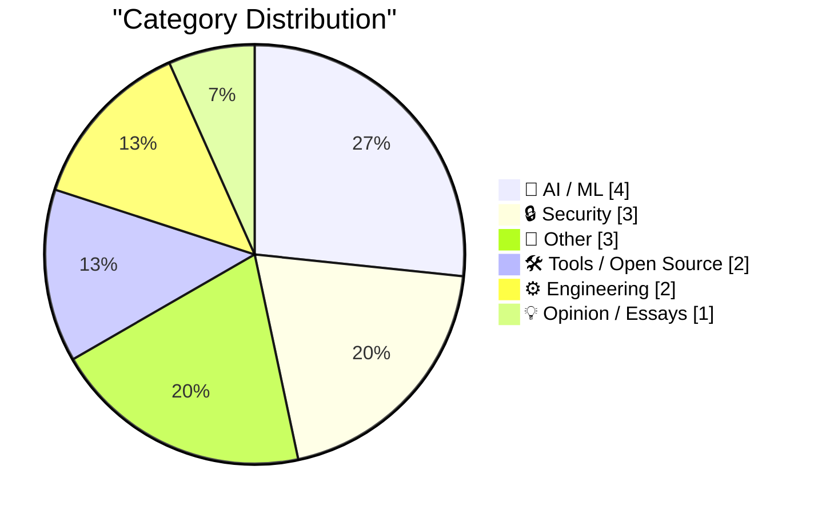
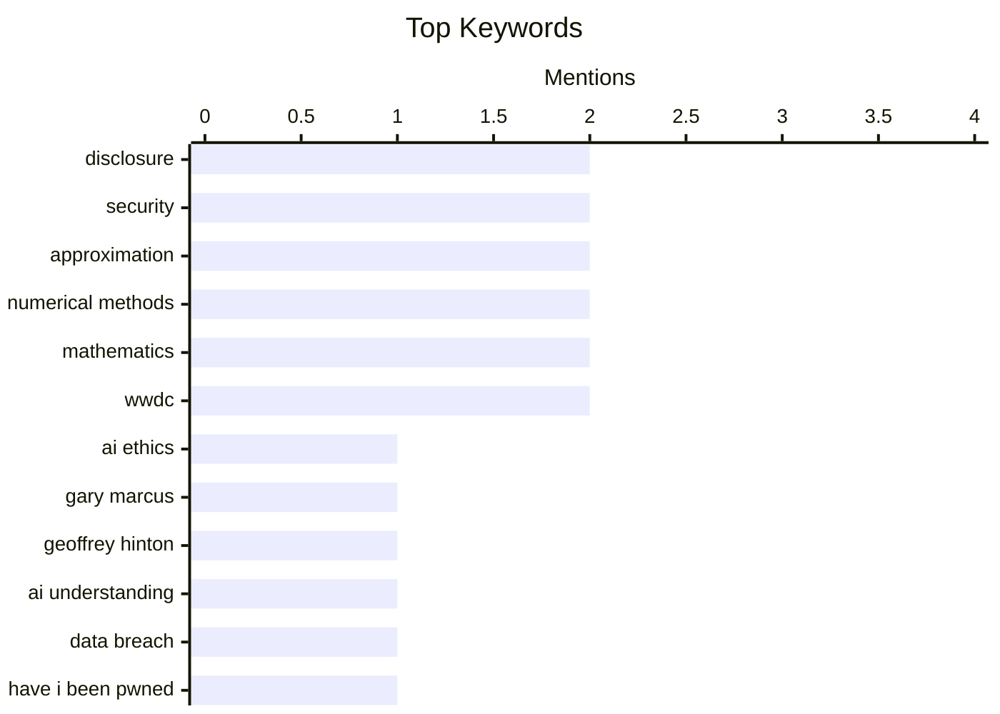

## Today's Highlights
Today's tech news highlights a growing skepticism around AI's practical impact, with experts questioning the true capabilities of LLMs and the paradoxical effects of AI tools on personal development. Concurrently, the cybersecurity world grapples with a worsening data breach disclosure lag, even as the number of reported incidents reaches new highs. Amidst these critical discussions, foundational engineering continues with updates to developer tools and explorations into mathematical approximations.
---
## Must Read Today
1. **The Pope appears to understand AI better than Geoffrey Hinton does.**
[The Pope appears to understand AI better than Geoffrey Hinton does.](https://garymarcus.substack.com/p/the-pope-appears-to-understand-ai) — garymarcus.substack.com · 21h ago · 🤖 AI / ML
> This article critically examines the current capabilities of Large Language Models (LLMs), arguing they lack genuine understanding, common sense, and the ability to distinguish truth from falsehood, despite their linguistic fluency. Gary Marcus contrasts this with the Pope's nuanced view on AI ethics and human oversight, suggesting a more realistic grasp of AI's limitations than some pioneers like Geoffrey Hinton, who has expressed concerns about AI sentience. Marcus emphasizes that an AI's output doesn't reveal its underlying cognitive process. The core argument is that focusing on AI's current lack of true comprehension is more pertinent than premature worries about sentience. The article concludes that a realistic assessment of AI's limitations is crucial for its ethical development and societal integration.
💡 **Why read it**: It offers a critical perspective on the current capabilities of LLMs, challenging common misconceptions about AI's 'understanding' and its potential for sentience.
🏷️ AI ethics, Gary Marcus, Geoffrey Hinton, AI understanding
2. **1,000 Data Breaches Later, the Disclosure Lag is Worse Than Ever**
[1,000 Data Breaches Later, the Disclosure Lag is Worse Than Ever](https://www.troyhunt.com/1000-data-breaches-later-the-disclosure-lag-is-worse-than-ever/) — troyhunt.com · 5h ago · 🔒 Security
> Troy Hunt reflects on the milestone of 1,000 data breaches in Have I Been Pwned (HIBP), observing a concerning trend: the disclosure lag for data breaches has worsened over time. Despite the introduction of privacy regulations like GDPR, which mandate timely disclosure (e.g., 72 hours), organizations frequently delay reporting, with some breaches taking years to be publicly acknowledged. Hunt suggests that public pressure or media exposure often remains a stronger motivator for disclosure than regulatory compliance. The article concludes that, despite increased awareness and regulation, the problem of delayed data breach disclosure persists and is deteriorating, leaving victims vulnerable for longer periods.
💡 **Why read it**: It provides a critical, data-driven perspective on the effectiveness of data breach disclosure regulations and the ongoing challenges in protecting user data.
🏷️ Data breach, Have I Been Pwned, disclosure, privacy regulations
3. **Weekly Update 506**
[Weekly Update 506](https://www.troyhunt.com/weekly-update-506/) — troyhunt.com · 10h ago · 🔒 Security
> This article discusses the ongoing series of data breaches and dumps orchestrated by the ShinyHunters group, highlighting the inconsistent responses from affected organizations. Troy Hunt observes the criminal nature of these breaches, coupled with a frequent lack of disclosure to victims by the compromised entities. He notes the transient appearance and disappearance of leaked data on various platforms, making it difficult for individuals to ascertain their exposure. The article implies a systemic issue where organizations are slow to react or disclose, and leaked data circulates before disappearing. It highlights the persistent challenges in data security, organizational transparency post-breach, and the fluid nature of leaked data dissemination.
💡 **Why read it**: It offers an insightful, real-time commentary on current data breach trends, organizational disclosure failures, and the impact on victims.
🏷️ ShinyHunters, data breaches, disclosure, security incidents
---
## Data Overview
| Sources Scanned | Articles Fetched | Time Window | Selected |
|:---:|:---:|:---:|:---:|
| 88/92 | 2566 -> 19 | 24h | **15** |
### Category Distribution

### Top Keywords

<details>
<summary>Plain Text Keyword Chart (Terminal Friendly)</summary>
```
disclosure        │ ████████████████████ 2
security          │ ████████████████████ 2
approximation     │ ████████████████████ 2
numerical methods │ ████████████████████ 2
mathematics       │ ████████████████████ 2
wwdc              │ ████████████████████ 2
ai ethics         │ ██████████░░░░░░░░░░ 1
gary marcus       │ ██████████░░░░░░░░░░ 1
geoffrey hinton   │ ██████████░░░░░░░░░░ 1
ai understanding  │ ██████████░░░░░░░░░░ 1
```
</details>
### Topic Tags
**disclosure**(2) · **security**(2) · **approximation**(2) · numerical methods(2) · mathematics(2) · wwdc(2) · ai ethics(1) · gary marcus(1) · geoffrey hinton(1) · ai understanding(1) · data breach(1) · have i been pwned(1) · privacy regulations(1) · shinyhunters(1) · data breaches(1) · security incidents(1) · ai tools(1) · productivity(1) · subscriptions(1) · personal projects(1)
---
## AI / ML
### 1. The Pope appears to understand AI better than Geoffrey Hinton does.
[The Pope appears to understand AI better than Geoffrey Hinton does.](https://garymarcus.substack.com/p/the-pope-appears-to-understand-ai) — **garymarcus.substack.com** · 21h ago · ⭐ 27/30
> This article critically examines the current capabilities of Large Language Models (LLMs), arguing they lack genuine understanding, common sense, and the ability to distinguish truth from falsehood, despite their linguistic fluency. Gary Marcus contrasts this with the Pope's nuanced view on AI ethics and human oversight, suggesting a more realistic grasp of AI's limitations than some pioneers like Geoffrey Hinton, who has expressed concerns about AI sentience. Marcus emphasizes that an AI's output doesn't reveal its underlying cognitive process. The core argument is that focusing on AI's current lack of true comprehension is more pertinent than premature worries about sentience. The article concludes that a realistic assessment of AI's limitations is crucial for its ethical development and societal integration.
🏷️ AI ethics, Gary Marcus, Geoffrey Hinton, AI understanding
---
### 2. The solution might be cancelling my AI subscription
[The solution might be cancelling my AI subscription](https://simonwillison.net/2026/May/31/the-solution-might-be-cancelling-my-ai-subscription/#atom-everything) — **simonwillison.net** · 21h ago · ⭐ 25/30
> This article explores the paradoxical effect of AI tooling on personal development workflows, where attempts to create 'quick scripts' often lead to over-engineering and abandoned projects. David Wilson, as relayed by Simon Willison, details over 16 projects initiated with AI, noting that the AI's ability to rapidly generate code can encourage feature creep and a lack of focus. This often results in projects that are far from 'quick' and frequently remain incomplete or unused. The core issue isn't AI's coding ability but its impact on development workflow and project management. The article concludes that the ease of AI-driven code generation can paradoxically hinder productivity by fostering over-ambitious, unfocused projects that never reach completion.
🏷️ AI tools, productivity, subscriptions, personal projects
---
### 3. Weird projects I shipped with AI
[Weird projects I shipped with AI](https://seangoedecke.com/weird-projects-i-shipped-with-ai/) — **seangoedecke.com** · 14h ago · ⭐ 25/30
> This article addresses the skepticism regarding the lack of a 'tsunami' of AI-generated apps, despite LLMs' coding prowess, by explaining that coding is only one bottleneck in shipping a product. Sean Goedecke argues that while LLMs excel at writing code, successful product development involves numerous other non-coding challenges like design, marketing, and infrastructure. He illustrates this by detailing several 'weird projects' he shipped with AI, such as a 'GPT-powered email client,' demonstrating AI's ability to accelerate specific development phases. The article implies that successful AI-assisted projects still require significant human direction and expertise beyond just code generation. It concludes that AI's impact on product development is more nuanced than simply generating code, as shipping successful projects still requires overcoming many non-coding challenges.
🏷️ AI projects, LLMs, AI skepticism, developer experience
---
### 4. Take Two
[Take Two](https://x.com/markgurman/status/2061236259843182813) — **daringfireball.net** · 13h ago · ⭐ 19/30
> Take Two
🏷️ Apple AI, Siri, OpenAI, WWDC
---
## Security
### 5. 1,000 Data Breaches Later, the Disclosure Lag is Worse Than Ever
[1,000 Data Breaches Later, the Disclosure Lag is Worse Than Ever](https://www.troyhunt.com/1000-data-breaches-later-the-disclosure-lag-is-worse-than-ever/) — **troyhunt.com** · 5h ago · ⭐ 27/30
> Troy Hunt reflects on the milestone of 1,000 data breaches in Have I Been Pwned (HIBP), observing a concerning trend: the disclosure lag for data breaches has worsened over time. Despite the introduction of privacy regulations like GDPR, which mandate timely disclosure (e.g., 72 hours), organizations frequently delay reporting, with some breaches taking years to be publicly acknowledged. Hunt suggests that public pressure or media exposure often remains a stronger motivator for disclosure than regulatory compliance. The article concludes that, despite increased awareness and regulation, the problem of delayed data breach disclosure persists and is deteriorating, leaving victims vulnerable for longer periods.
🏷️ Data breach, Have I Been Pwned, disclosure, privacy regulations
---
### 6. Weekly Update 506
[Weekly Update 506](https://www.troyhunt.com/weekly-update-506/) — **troyhunt.com** · 10h ago · ⭐ 27/30
> This article discusses the ongoing series of data breaches and dumps orchestrated by the ShinyHunters group, highlighting the inconsistent responses from affected organizations. Troy Hunt observes the criminal nature of these breaches, coupled with a frequent lack of disclosure to victims by the compromised entities. He notes the transient appearance and disappearance of leaked data on various platforms, making it difficult for individuals to ascertain their exposure. The article implies a systemic issue where organizations are slow to react or disclose, and leaked data circulates before disappearing. It highlights the persistent challenges in data security, organizational transparency post-breach, and the fluid nature of leaked data dissemination.
🏷️ ShinyHunters, data breaches, disclosure, security incidents
---
### 7. The Infosec Phrasebook
[The Infosec Phrasebook](https://nesbitt.io/2026/06/01/the-infosec-phrasebook.html) — **nesbitt.io** · 4h ago · ⭐ 21/30
> This article introduces 'The Infosec Phrasebook,' a resource designed to clarify and demystify common terminology and jargon within the information security domain. The phrasebook aims to help users navigate infosec discussions, which are often dense with acronyms, technical terms, and specific cultural references. While the provided snippet is brief, the context suggests it offers definitions, explanations, and potentially usage examples for phrases like 'a/s/l/threat model?'. The resource is intended to improve clarity and understanding for newcomers or those outside the immediate infosec circle. It presents a tool designed to enhance communication and comprehension in the specialized language of information security.
🏷️ Infosec, security, threat model, terminology
---
## Other
### 8. Pluralistic: Molly Crabapple's 'Here Where We Live Is Our Country' (01 Jun 2026)
[Pluralistic: Molly Crabapple's 'Here Where We Live Is Our Country' (01 Jun 2026)](https://pluralistic.net/2026/06/01/doikayt/) — **pluralistic.net** · 4h ago · ⭐ 16/30
> Pluralistic: Molly Crabapple's 'Here Where We Live Is Our Country' (01 Jun 2026)
🏷️ link roundup, Cory Doctorow, general interest
---
### 9. May 2026 newsletter
[May 2026 newsletter](https://simonwillison.net/2026/Jun/1/may-newsletter/#atom-everything) — **simonwillison.net** · 9h ago · ⭐ 15/30
> May 2026 newsletter
🏷️ newsletter, monthly update, sponsors
---
### 10. The Talk Show Live From WWDC 2026: Tuesday June 9
[The Talk Show Live From WWDC 2026: Tuesday June 9](https://ti.to/daringfireball/the-talk-show-live-from-wwdc-2026) — **daringfireball.net** · 12h ago · ⭐ 15/30
> The Talk Show Live From WWDC 2026: Tuesday June 9
🏷️ WWDC, Apple, event, podcast
---
## Tools / Open Source
### 11. datasette 1.0a32
[datasette 1.0a32](https://simonwillison.net/2026/May/31/datasette/#atom-everything) — **simonwillison.net** · 14h ago · ⭐ 22/30
> This article announces the release of Datasette 1.0a32, a minor bugfix update for the data exploration and publishing tool. The release specifically addresses a bug with `INSERT ... RETURNING` queries when utilizing the new `/db/-/execute-write` endpoint. Additionally, it resolves several `base_url` issues that were identified during the author's work on `datasette.io`. These fixes indicate ongoing refinement of Datasette's write capabilities and robust URL handling, crucial for its web-based data features. The release signifies continuous improvement and stabilization of Datasette, particularly for its new write functionality and reliable URL configuration, as it progresses towards a stable 1.0 version.
🏷️ Datasette, release, bugfix, SQL
---
### 12. exe.dev
[exe.dev](https://exe.dev/?df) — **daringfireball.net** · 12h ago · ⭐ 20/30
> This article introduces exe.dev, a cloud platform tailored for the 'agent era,' providing secure, ephemeral, and shareable virtual machines (VMs). The platform offers a pool of VMs with SSH, root access, and web authentication by default. A key security feature is the injection of secrets at the network edge, keeping them out of LLM hands, which is vital for AI agent development. exe.dev supports diverse use cases, including persistent servers, internal tools, and disposable devboxes, allowing easy sharing of web servers like Google Docs. It also features shared CPU/RAM resources, with billing based on underlying resource consumption rather than fixed VM sizes. exe.dev provides a flexible, secure, and cost-effective cloud environment specifically designed for developing and deploying AI agents and other dynamic computing tasks.
🏷️ cloud platform, AI agents, VMs, security
---
## Engineering
### 13. It’s not just Taylor series
[It’s not just Taylor series](https://www.johndcook.com/blog/2026/06/01/not-just-taylor-series/) — **johndcook.com** · 1h ago · ⭐ 20/30
> This article discusses the accuracy of the mathematical approximation exp(−x²) ≈ (1 + cos(sin(x) + x))/2, arguing that its effectiveness cannot be fully explained solely by Taylor series expansions. John D. Cook addresses a common misconception that the approximation's quality is due only to the Taylor series of both sides matching up to the x⁶ term. He implies that while Taylor series are a component, other underlying mathematical principles or insights contribute significantly to the approximation's remarkable accuracy. The article suggests a deeper mathematical reason for the approximation's quality beyond simple polynomial matching. It highlights that complex mathematical approximations often involve more than just matching initial Taylor series terms, suggesting a richer underlying mathematical relationship.
🏷️ Taylor series, approximation, numerical methods, mathematics
---
### 14. Another Gaussian approximation
[Another Gaussian approximation](https://www.johndcook.com/blog/2026/05/31/another-gaussian-approximation/) — **johndcook.com** · 21h ago · ⭐ 20/30
> This article explores methods for improving approximations of the Gaussian density function exp(−x²), building upon the simple (1 + cos(x))/2 approximation. John D. Cook notes that (1 + cos(x))/2 provides a 'fair' approximation to exp(−x²). He demonstrates that raising this function to a power significantly enhances its accuracy: ((1 + cos(x))/2)⁴ serves as a good lower bound, while ((1 + cos(x))/2)³⁵⁵⁹⁷ provides a good upper bound. This illustrates a practical technique for refining approximations by introducing exponents, which is valuable for engineers and mathematicians. The article shows how simple trigonometric functions can be effectively modified with exponents to create highly accurate lower and upper bounds for the Gaussian density function.
🏷️ Gaussian, approximation, mathematics, numerical methods
---
## Opinion / Essays
### 15. Be thou not pilled
[Be thou not pilled](https://www.joanwestenberg.com/be-thou-not-pilled/) — **joanwestenberg.com** · 14h ago · ⭐ 17/30
> Be thou not pilled
🏷️ Mass delusion, psychology, history, opinion
---
*Generated at 2026-06-01 14:01 | Scanned 88 sources -> 2566 articles -> selected 15*
*Based on the [Hacker News Popularity Contest 2025](https://refactoringenglish.com/tools/hn-popularity/) RSS source list recommended by [Andrej Karpathy](https://x.com/karpathy)*
*Produced by Dongdianr AI. Follow the same-name WeChat public account for more AI practical tips 💡*
