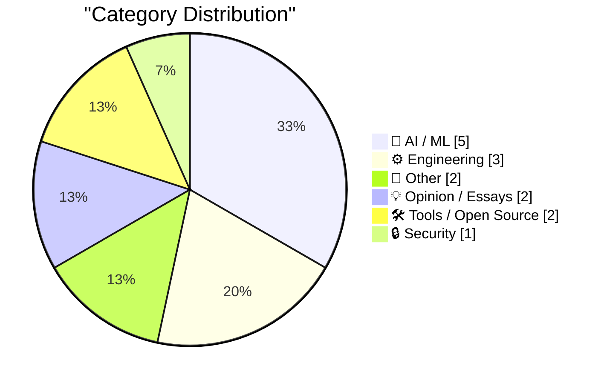
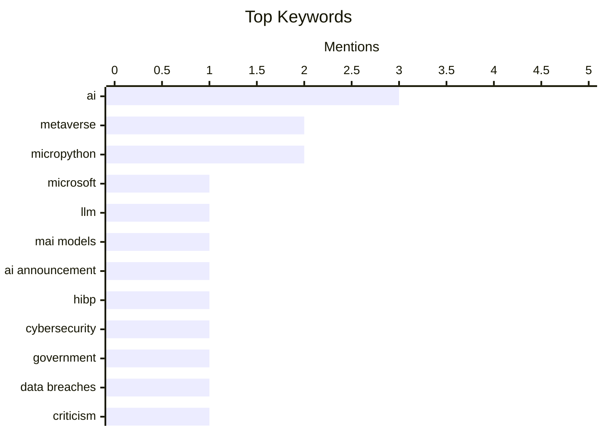

## Today's Highlights
Today's tech landscape reveals a split perspective on artificial intelligence, with Microsoft advancing new LLMs while companies like Uber implement caps on AI tool usage due to cost concerns, prompting a re-evaluation of AI's immediate return on investment. Concurrently, the "metaverse" concept faces increasing skepticism, with some dismissing it as "snake oil" even as Meta continues to develop smart glasses and Apple strategically avoids the term. Amidst these shifts, governments are actively enhancing data security measures and relaunching public data initiatives.
---
## Must Read Today
1. **Microsoft's new MAI models**
[Microsoft's new MAI models](https://simonwillison.net/2026/Jun/2/microsofts-new-models/#atom-everything) — simonwillison.net · 15h ago · 🤖 AI / ML
> Microsoft has announced two new large language models (LLMs): MAI-Thinking-1 and MAI-Code-1-Flash. MAI-Thinking-1 is a reasoning-focused model with 1 trillion parameters (35 billion active) available to select early partners. MAI-Code-1-Flash is a 137 billion parameter (5 billion active) model purpose-built for GitHub Copilot. These models represent Microsoft's latest advancements in specialized AI for complex reasoning and efficient code generation.
💡 **Why read it**: It details Microsoft's new specialized LLMs, MAI-Thinking-1 and MAI-Code-1-Flash, providing key parameter counts and their intended applications.
🏷️ Microsoft, LLM, MAI models, AI announcement
2. **Welcoming the Philippine Government to Have I Been Pwned**
[Welcoming the Philippine Government to Have I Been Pwned](https://www.troyhunt.com/welcoming-the-philippine-government-to-have-i-been-pwned/) — troyhunt.com · 10h ago · 🔒 Security
> The Philippine government has become the 46th government entity to onboard to Have I Been Pwned's (HIBP) free government service. The Philippines' National CERT, in collaboration with the Department of Information and Communications Technology, now has access to monitor official government domains. This integration allows them to proactively identify and respond to data breaches affecting government accounts. This partnership enhances the nation's cybersecurity posture by leveraging HIBP's extensive breach data.
💡 **Why read it**: It highlights the expansion of HIBP's free government service to the Philippines, demonstrating a growing global commitment to proactive cybersecurity.
🏷️ HIBP, Cybersecurity, Government, Data breaches
3. **Breaking: When dreams for AI sanity come true**
[Breaking: When dreams for AI sanity come true](https://garymarcus.substack.com/p/breaking-when-dreams-for-ai-sanity) — garymarcus.substack.com · 18h ago · 🤖 AI / ML
> This article is a very brief, personal note from Gary Marcus, stating "A true life moment for your correspondent." It does not contain any substantive technical details, arguments, or findings regarding AI. The content is purely a short, personal reflection without further elaboration.
💡 **Why read it**: This article is a personal, non-substantive note from the author, offering no technical or analytical content on AI.
🏷️ AI, Criticism, Breakthrough
---
## Data Overview
| Sources Scanned | Articles Fetched | Time Window | Selected |
|:---:|:---:|:---:|:---:|
| 88/92 | 2568 -> 19 | 24h | **15** |
### Category Distribution

### Top Keywords

<details>
<summary>Plain Text Keyword Chart (Terminal Friendly)</summary>
```
ai              │ ████████████████████ 3
metaverse       │ █████████████░░░░░░░ 2
micropython     │ █████████████░░░░░░░ 2
microsoft       │ ███████░░░░░░░░░░░░░ 1
llm             │ ███████░░░░░░░░░░░░░ 1
mai models      │ ███████░░░░░░░░░░░░░ 1
ai announcement │ ███████░░░░░░░░░░░░░ 1
hibp            │ ███████░░░░░░░░░░░░░ 1
cybersecurity   │ ███████░░░░░░░░░░░░░ 1
government      │ ███████░░░░░░░░░░░░░ 1
```
</details>
### Topic Tags
**ai**(3) · **metaverse**(2) · **micropython**(2) · microsoft(1) · llm(1) · mai models(1) · ai announcement(1) · hibp(1) · cybersecurity(1) · government(1) · data breaches(1) · criticism(1) · breakthrough(1) · roi(1) · business(1) · strategy(1) · uber(1) · ai tools(1) · cost management(1) · enterprise ai(1)
---
## AI / ML
### 1. Microsoft's new MAI models
[Microsoft's new MAI models](https://simonwillison.net/2026/Jun/2/microsofts-new-models/#atom-everything) — **simonwillison.net** · 15h ago · ⭐ 28/30
> Microsoft has announced two new large language models (LLMs): MAI-Thinking-1 and MAI-Code-1-Flash. MAI-Thinking-1 is a reasoning-focused model with 1 trillion parameters (35 billion active) available to select early partners. MAI-Code-1-Flash is a 137 billion parameter (5 billion active) model purpose-built for GitHub Copilot. These models represent Microsoft's latest advancements in specialized AI for complex reasoning and efficient code generation.
🏷️ Microsoft, LLM, MAI models, AI announcement
---
### 2. Breaking: When dreams for AI sanity come true
[Breaking: When dreams for AI sanity come true](https://garymarcus.substack.com/p/breaking-when-dreams-for-ai-sanity) — **garymarcus.substack.com** · 18h ago · ⭐ 26/30
> This article is a very brief, personal note from Gary Marcus, stating "A true life moment for your correspondent." It does not contain any substantive technical details, arguments, or findings regarding AI. The content is purely a short, personal reflection without further elaboration.
🏷️ AI, Criticism, Breakthrough
---
### 3. AI Doesn't Have ROI
[AI Doesn't Have ROI](https://www.wheresyoured.at/ai-doesnt-have-roi/) — **wheresyoured.at** · 23h ago · ⭐ 26/30
> This article is primarily a promotional piece for a premium newsletter, rather than a substantive analysis of AI's return on investment. It advertises a weekly newsletter, priced at $70 annually or $7 monthly, promising detailed analyses of companies like NVIDIA and Anthropic. The provided content does not offer any arguments or findings related to AI ROI itself.
🏷️ AI, ROI, Business, Strategy
---
### 4. Uber Caps Usage of AI Tools Like Claude Code to Manage Costs
[Uber Caps Usage of AI Tools Like Claude Code to Manage Costs](https://simonwillison.net/2026/Jun/3/uber-caps-usage/#atom-everything) — **simonwillison.net** · 2h ago · ⭐ 24/30
> Uber has implemented caps on its usage of AI tools, specifically mentioning Claude Code, to control escalating operational costs. This decision follows reports that Uber exhausted its entire 2026 AI budget within the first four months of the year. The author notes this is unsurprising, given that such budgets are typically set in the preceding year (2025) without full foresight into rapidly evolving AI expenses. This situation underscores the significant and often underestimated financial implications of integrating advanced AI tools.
🏷️ Uber, AI tools, Cost management, Enterprise AI
---
### 5. Why things will eventually fall apart
[Why things will eventually fall apart](https://garymarcus.substack.com/p/why-things-will-eventually-fall-apart) — **garymarcus.substack.com** · 22h ago · ⭐ 21/30
> This article, titled "Why things will eventually fall apart," introduces a discussion on the fundamental reasons for the inevitability of system failures. The author indicates the analysis will draw upon both mathematical and psychological principles to explore this complex topic. Due to the extremely limited content provided (only title and subtitle), specific arguments, technical approaches, or conclusions cannot be detailed.
🏷️ AI, Limitations, Psychology, Future
---
## Engineering
### 6. Logic for Programmers extra credits
[Logic for Programmers extra credits](https://buttondown.com/hillelwayne/archive/logic-for-programmers-extra-credits/) — **buttondown.com/hillelwayne** · 23h ago · ⭐ 24/30
> Hillel Wayne is releasing supplementary materials, termed "extra credits," for his book "Logic for Programmers." These materials delve into interesting but tangential or overly technical topics that were excluded from the main book to maintain its focus. The supplements are being uploaded to a dedicated GitHub repository at `https://github.com/logicforprogrammers/b`. This initiative provides readers with opportunities for deeper exploration into specific logical concepts relevant to programming.
🏷️ Logic, Programmers, Formal methods
---
### 7. London Data Store Relaunch
[London Data Store Relaunch](https://shkspr.mobi/blog/2026/06/london-data-store-relaunch/) — **shkspr.mobi** · 2h ago · ⭐ 23/30
> The London Data Store, data.london.gov.uk, has undergone a significant relaunch sixteen years after its initial pioneering release. Originally one of the first major cities to offer Open Data, the platform has evolved beyond a mere repository. The refresh includes both back-end updates and a new front-end interface to enhance user experience. This relaunch aims to celebrate and improve the accessibility of Open Data, ultimately benefiting Londoners' lives through better data utilization.
🏷️ Open Data, London, Civic Tech
---
### 8. An Ode to the Exacting Pedantry of Computers
[An Ode to the Exacting Pedantry of Computers](https://blog.jim-nielsen.com/2026/pedantry-of-computing/) — **blog.jim-nielsen.com** · 19h ago · ⭐ 20/30
> This article reflects on the fundamental "pedantry" of computers, specifically their strict requirements regarding data types, contrasting this with a human's intuitive understanding of numbers. The author recounts an early experience in a C++ course, struggling with the concept of declaring variable types like integers, floats, and doubles, which initially led to dropping the class. This highlights a common early programmer's friction with computers' explicit, non-intuitive demands. The article ultimately celebrates this strictness, implying that while initially challenging, this "pedantry" is foundational to their precise and reliable operation.
🏷️ Programming, Data types, Computer science
---
## Other
### 9. Meta Reportedly Has a Slew of New Smart Glasses Planned for This Year
[Meta Reportedly Has a Slew of New Smart Glasses Planned for This Year](https://gizmodo.com/meta-has-a-ridiculous-amount-of-smart-glasses-planned-for-this-year-2000765741) — **daringfireball.net** · 16h ago · ⭐ 23/30
> Meta reportedly has multiple new smart glasses planned for release this year, according to a summary of a paywalled report from The Information. In addition to fall releases, a pair codenamed "Mojito VIP" is slated for December. Two prototypes, "Artemis" and "SSG" (supersensing glasses), are also being tested in the fall, with the "supersensing" pair previously reported to feature advanced capabilities. This indicates Meta's continued aggressive investment in the smart glasses market.
🏷️ Meta, Smart glasses, AR/VR, Hardware plans
---
### 10. Scott Pelley Accuses CBS News Boss of ‘Murdering’ ‘60 Minutes’
[Scott Pelley Accuses CBS News Boss of ‘Murdering’ ‘60 Minutes’](https://www.nytimes.com/2026/06/01/business/media/cbs-60-minutes-scott-pelley-nick-bilton.html?unlocked_article_code=1.nFA.TDGJ.HbBmlXuQWmcQ&amp;smid=url-share) — **daringfireball.net** · 18h ago · ⭐ 17/30
> This article reports on significant internal turmoil at CBS News, detailing an extraordinary public accusation by "60 Minutes" correspondent Scott Pelley. During a staff meeting, Pelley accused Nick Bilton, the newly hired executive producer, and Bari Weiss, the network's editor-in-chief, of "murdering" the long-standing "60 Minutes" program. This public outburst, reported by The New York Times, signifies deep internal conflict over the direction and management of the iconic news show. The incident reveals a major crisis in leadership and editorial direction at CBS News, particularly concerning the future of "60 Minutes."
🏷️ CBS News, 60 Minutes, Media industry, Workplace conflict
---
## Opinion / Essays
### 11. Apple, the Anti-‘Metaverse’ VR Company
[Apple, the Anti-‘Metaverse’ VR Company](https://daringfireball.net/2025/12/meta_says_fuck_that_metaverse_shit) — **daringfireball.net** · 17h ago · ⭐ 23/30
> The article positions Apple as an anti-"metaverse" company, despite its development of the Vision platform, a prominent virtual reality headset. Unlike other companies, Apple has consistently avoided endorsing "metaverse" hype, even before the Vision Pro's announcement. The author notes that Apple's approach, exemplified at a 2022 WSJ event, suggests a focus on practical applications rather than a speculative virtual world. This contrasts sharply with the "metaverse fever dream" promoted by others.
🏷️ Apple Vision, Metaverse, VR/AR, Industry strategy
---
### 12. The Metaverse Was Snake Oil for Isolation
[The Metaverse Was Snake Oil for Isolation](https://daringfireball.net/linked/2026/06/01/the-metaverse-fever-dream) — **daringfireball.net** · 17h ago · ⭐ 23/30
> The article argues that the "metaverse" hype was largely a byproduct of the COVID-19 pandemic and the associated period of isolation and loneliness. The author connects the rise of metaverse enthusiasm to the collective reliance on computer platforms for socializing during lockdowns. It suggests that the "metaverse fever dream" was a response to a specific societal condition, rather than an organic technological evolution. By 2026, it is clear that the hype coincided with and was fueled by the lockdown era.
🏷️ Metaverse, Pandemic, Tech trends, Social impact
---
## Tools / Open Source
### 13. datasette-agent-micropython 0.1a0
[datasette-agent-micropython 0.1a0](https://simonwillison.net/2026/Jun/2/datasette-agent-micropython/#atom-everything) — **simonwillison.net** · 18h ago · ⭐ 22/30
> This article announces the 0.1a0 alpha release of `datasette-agent-micropython`, a project aimed at safely generating and executing Python code within Datasette Agent. The alpha version focuses on sandboxed execution, with initial tests showing promise as GPT-5.5 has so far failed to break out of the sandbox. This indicates effective security measures are in place for the safe integration of AI-generated code. The project is progressing towards its goal of enabling secure, dynamic Python code execution in a web environment.
🏷️ Datasette Agent, MicroPython, Python code, Open source
---
### 14. micropython-wasm 0.1a1
[micropython-wasm 0.1a1](https://simonwillison.net/2026/Jun/2/micropython-wasm/#atom-everything) — **simonwillison.net** · 18h ago · ⭐ 21/30
> This article announces the 0.1a1 release of `micropython-wasm`, a project focused on running MicroPython in a WebAssembly environment. This specific release incorporates fixes for limitations that emerged during its practical application in building `datasette-agent-micropython`. The iterative development highlights the project's commitment to addressing real-world integration challenges. Ultimately, `micropython-wasm` is being actively refined to support sandboxing initiatives for Python execution in web applications.
🏷️ MicroPython, WebAssembly, WASM, Release
---
## Security
### 15. Welcoming the Philippine Government to Have I Been Pwned
[Welcoming the Philippine Government to Have I Been Pwned](https://www.troyhunt.com/welcoming-the-philippine-government-to-have-i-been-pwned/) — **troyhunt.com** · 10h ago · ⭐ 28/30
> The Philippine government has become the 46th government entity to onboard to Have I Been Pwned's (HIBP) free government service. The Philippines' National CERT, in collaboration with the Department of Information and Communications Technology, now has access to monitor official government domains. This integration allows them to proactively identify and respond to data breaches affecting government accounts. This partnership enhances the nation's cybersecurity posture by leveraging HIBP's extensive breach data.
🏷️ HIBP, Cybersecurity, Government, Data breaches
---
*Generated at 2026-06-03 14:01 | Scanned 88 sources -> 2568 articles -> selected 15*
*Based on the [Hacker News Popularity Contest 2025](https://refactoringenglish.com/tools/hn-popularity/) RSS source list recommended by [Andrej Karpathy](https://x.com/karpathy)*
*Produced by Dongdianr AI. Follow the same-name WeChat public account for more AI practical tips 💡*
