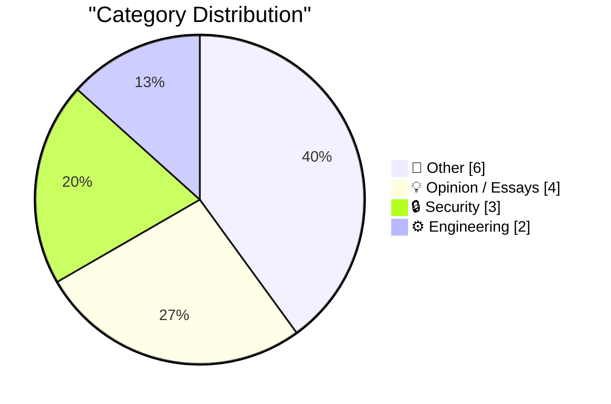
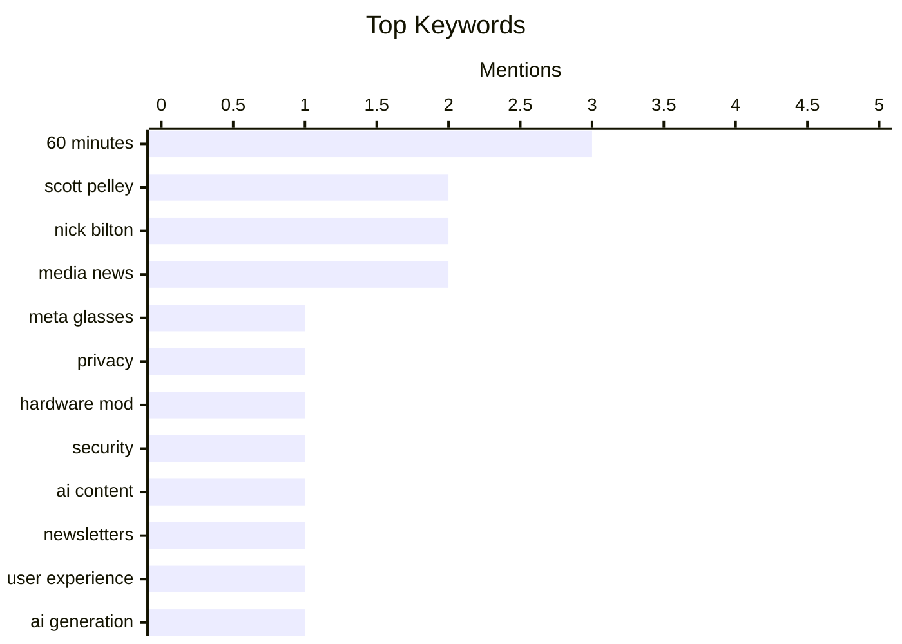

## Today's Highlights
The evolving role of AI dominates today's tech news, showcasing its dual impact as both an innovation driver and a source of user contention. While AI fuels a resurgence in native Mac app development, it also faces backlash from users rejecting AI-generated content and ignites debates over data center sovereignty. Concurrently, digital security remains paramount, with new threats ranging from illicit modifications of smart devices to vulnerabilities in fundamental software supply chains.
---
## Must Read Today
1. **The Underworld Market to Remove the Recording Indicator Light on Meta Glasses**
[The Underworld Market to Remove the Recording Indicator Light on Meta Glasses](https://www.youtube.com/watch?v=EaJSPeJmqis) — daringfireball.net · 18h ago · 🔒 Security
> An illicit market has emerged on Facebook Marketplace offering "Stealth Mode" modifications to disable the recording indicator light on Ray-Ban Meta glasses. Joanna Stern paid $100 for this modification, investigating the growing business of converting smart glasses into covert cameras. The service allows users to record without the visible light, raising significant privacy concerns. This trend highlights a critical ethical and legal challenge for smart device manufacturers and regulators regarding user privacy and the potential for misuse.
💡 **Why read it**: It exposes a real-world privacy threat enabled by hardware modification of smart glasses and the emerging "underworld market" facilitating it.
🏷️ Meta glasses, privacy, hardware mod, security
2. **Now that your newsletter is AI-generated, I've Unsubscribed**
[Now that your newsletter is AI-generated, I've Unsubscribed](https://idiallo.com/blog/unsubscribed-from-ai-generated-newsletters?src=feed) — idiallo.com · 16h ago · 💡 Opinion / Essays
> The author unsubscribed from long-standing newsletters after they switched to AI-generated content without disclosure, leading to a loss of trust. The author had maintained trust with human authors for over 20 years, valuing their unique voice and perspective. The sudden shift to generic, "blue high-tech image thumbnails" and AI-generated text felt like the author "took himself out of the equation," eroding the personal connection. This experience underscores that authenticity and human connection are paramount in content creation, and AI-generated content, especially when undisclosed, can alienate loyal audiences.
💡 **Why read it**: It offers a personal, relatable perspective on the negative impact of undisclosed AI-generated content on reader trust and engagement.
🏷️ AI content, newsletters, user experience, AI generation
3. **Is datacentre sovereignty really that important?**
[Is datacentre sovereignty really that important?](https://martinalderson.com/posts/is-datacentre-sovereignty-really-that-important/?utm_source=rss&amp;utm_medium=rss&amp;utm_campaign=feed) — martinalderson.com · 14h ago · 💡 Opinion / Essays
> The UK's focus on building domestic AI datacentres is driven by perceived benefits of sovereignty, which the author argues are largely unfounded. The common justifications for datacentre sovereignty, such as latency, tax advantages, and control, are critically examined and found to mostly not hold up. For instance, latency benefits are often negligible for many applications, and tax benefits can be complex or offset by other factors. The article challenges the prevailing narrative around datacentre sovereignty, suggesting that the perceived importance is often overstated and the arguments lack robust justification.
💡 **Why read it**: It provides a critical analysis of the economic and technical arguments for datacentre sovereignty, particularly in the context of AI infrastructure, challenging common assumptions.
🏷️ Datacenter sovereignty, AI infrastructure, UK policy, Cloud strategy
---
## Data Overview
| Sources Scanned | Articles Fetched | Time Window | Selected |
|:---:|:---:|:---:|:---:|
| 88/92 | 2569 -> 18 | 24h | **15** |
### Category Distribution

### Top Keywords

<details>
<summary>Plain Text Keyword Chart (Terminal Friendly)</summary>
```
60 minutes   │ ████████████████████ 3
scott pelley │ █████████████░░░░░░░ 2
nick bilton  │ █████████████░░░░░░░ 2
media news   │ █████████████░░░░░░░ 2
meta glasses │ ███████░░░░░░░░░░░░░ 1
privacy      │ ███████░░░░░░░░░░░░░ 1
hardware mod │ ███████░░░░░░░░░░░░░ 1
security     │ ███████░░░░░░░░░░░░░ 1
ai content   │ ███████░░░░░░░░░░░░░ 1
newsletters  │ ███████░░░░░░░░░░░░░ 1
```
</details>
### Topic Tags
**60 minutes**(3) · **scott pelley**(2) · **nick bilton**(2) · media news(2) · meta glasses(1) · privacy(1) · hardware mod(1) · security(1) · ai content(1) · newsletters(1) · user experience(1) · ai generation(1) · datacenter sovereignty(1) · ai infrastructure(1) · uk policy(1) · cloud strategy(1) · git security(1) · supply chain(1) · signed log(1) · branch protection(1)
---
## Other
### 1. CBS News Fires Scott Pelley of ‘60 Minutes’
[CBS News Fires Scott Pelley of ‘60 Minutes’](https://www.nytimes.com/2026/06/02/business/media/scott-pelley-cbs-bari-weiss.html) — **daringfireball.net** · 18h ago · ⭐ 19/30
> Scott Pelley, a correspondent for '60 Minutes,' was formally terminated by CBS News for cause, effective immediately. A letter from Nick Bilton to Pelley, obtained by The New York Times, details the termination. The article implies that Pelley's firing validates his earlier statements made in a Monday staff meeting, suggesting he was "exactly right" in his criticisms or observations. Pelley's subsequent telephone interview further elaborates on the situation. This event highlights significant internal turmoil and power dynamics within CBS News, with the firing of a prominent correspondent underscoring deeper organizational conflicts.
🏷️ Scott Pelley, 60 Minutes, firing, Nick Bilton
---
### 2. Partitions over permutations
[Partitions over permutations](https://www.johndcook.com/blog/2026/06/04/partitions-over-permutations/) — **johndcook.com** · 12m ago · ⭐ 19/30
> The article revisits a previously discussed cosine approximation to the Gaussian function, exp(−z²) ≈ (1 + cos(sin(z) + z))/2, and investigates its behavior beyond the real axis. While the approximation holds well along the real axis, it diverges significantly along the imaginary axis. Specifically, if z = iy, the right side of the approximation grows much faster than the left, behaving like exp(exp(y)), which is a critical difference from the Gaussian's behavior. This analysis demonstrates that an approximation valid for real numbers may fail dramatically in the complex plane, emphasizing the importance of domain-specific validation in mathematical approximations.
🏷️ Gaussian approximation, Mathematical analysis, Numerical methods
---
### 3. Scott Pelley on Leaving ‘60 Minutes’: ‘Incompetence and Unprofessionalism in the New Management Have Wreaked Havoc’
[Scott Pelley on Leaving ‘60 Minutes’: ‘Incompetence and Unprofessionalism in the New Management Have Wreaked Havoc’](https://www.instagram.com/p/DZHlWAoG3_3/?img_index=1) — **daringfireball.net** · 14h ago · ⭐ 16/30
> Scott Pelley attributes his departure from '60 Minutes' to severe management issues, claiming "incompetence and unprofessionalism" in new leadership "wreaked havoc" on the program. He emphasized '60 Minutes' as the most successful program in history, with over a decade of innovative growth on online platforms extending its reach to millions globally. Pelley's statement implies that new management jeopardized this established legacy. His comments suggest a significant internal crisis at '60 Minutes' driven by leadership failures.
🏷️ 60 Minutes, Scott Pelley, media news
---
### 4. The ‘60 Minutes’ Purge
[The ‘60 Minutes’ Purge](https://www.paramountpressexpress.com/cbs-news-and-stations/shows/60-minutes/talent/) — **daringfireball.net** · 16h ago · ⭐ 16/30
> The article highlights a significant and rapid turnover in the correspondent lineup of '60 Minutes', suggesting an internal "purge." While Paramount's "Press Express" page still lists eight correspondents from the 2025–2026 season, several key figures have recently departed. Specifically, Scott Pelley was fired, Sharyn Alfonsi and Cecilia Vega were fired last week, and Anderson Cooper left on his own after 20 years. This rapid succession of departures, particularly firings, indicates a major restructuring or crisis within the '60 Minutes' program.
🏷️ 60 Minutes, personnel, media news
---
### 5. Book Review: Accessible Communications by Lisa Riemers and Matisse Hamel-Nelis ★★★★★
[Book Review: Accessible Communications by Lisa Riemers and Matisse Hamel-Nelis ★★★★★](https://shkspr.mobi/blog/2026/06/book-review-accessible-communications-by-lisa-riemers-and-matisse-hamel-nelis/) — **shkspr.mobi** · 2h ago · ⭐ 16/30
> This review praises "Accessible Communications" by Lisa Riemers and Matisse Hamel-Nelis, a book focused on the practicalities of creating universally accessible communications. The book moves beyond theoretical concepts, covering multiple legal jurisdictions, ethical frameworks, and business cases for accessibility. It provides practical guidance on how to create useful, accessible content. The reviewer gives the book a five-star rating, highly recommending it as a comprehensive and practical guide for implementing accessible communication strategies.
🏷️ Accessible Communications, Book Review, Ethics, Legal
---
### 6. Pluralistic: Delusion as a service (04 Jun 2026)
[Pluralistic: Delusion as a service (04 Jun 2026)](https://pluralistic.net/2026/06/03/mission-space/) — **pluralistic.net** · 7h ago · ⭐ 14/30
> This article, titled "Delusion as a service," presents a curated collection of links and short commentary, suggesting a thematic focus on misleading or problematic trends. The diverse links cover topics such as "Destructive diagnostics," "Gay Days at Disney World," a "Parametric 3D printable key," and a fine against a sculpture for "storing bike on public property." Other notable links include "Amazon v mass arbitration," a "Driver-owned Uber alternative," and "Censorware censors criticism of censorware." The post offers a rapid-fire digest of contemporary issues, ranging from tech and legal challenges to social commentary, often highlighting instances of absurdity, control, or resistance.
🏷️ link digest, diverse topics, Cory Doctorow
---
## Opinion / Essays
### 7. Now that your newsletter is AI-generated, I've Unsubscribed
[Now that your newsletter is AI-generated, I've Unsubscribed](https://idiallo.com/blog/unsubscribed-from-ai-generated-newsletters?src=feed) — **idiallo.com** · 16h ago · ⭐ 27/30
> The author unsubscribed from long-standing newsletters after they switched to AI-generated content without disclosure, leading to a loss of trust. The author had maintained trust with human authors for over 20 years, valuing their unique voice and perspective. The sudden shift to generic, "blue high-tech image thumbnails" and AI-generated text felt like the author "took himself out of the equation," eroding the personal connection. This experience underscores that authenticity and human connection are paramount in content creation, and AI-generated content, especially when undisclosed, can alienate loyal audiences.
🏷️ AI content, newsletters, user experience, AI generation
---
### 8. Is datacentre sovereignty really that important?
[Is datacentre sovereignty really that important?](https://martinalderson.com/posts/is-datacentre-sovereignty-really-that-important/?utm_source=rss&amp;utm_medium=rss&amp;utm_campaign=feed) — **martinalderson.com** · 14h ago · ⭐ 26/30
> The UK's focus on building domestic AI datacentres is driven by perceived benefits of sovereignty, which the author argues are largely unfounded. The common justifications for datacentre sovereignty, such as latency, tax advantages, and control, are critically examined and found to mostly not hold up. For instance, latency benefits are often negligible for many applications, and tax benefits can be complex or offset by other factors. The article challenges the prevailing narrative around datacentre sovereignty, suggesting that the perceived importance is often overstated and the arguments lack robust justification.
🏷️ Datacenter sovereignty, AI infrastructure, UK policy, Cloud strategy
---
### 9. Anti-AI nostalgia and the cult of the past
[Anti-AI nostalgia and the cult of the past](https://seangoedecke.com/anti-ai-nostalgia/) — **seangoedecke.com** · 14h ago · ⭐ 24/30
> The article addresses the "anti-AI nostalgia" prevalent among some programmers who idealize past coding practices and disparage modern tools like LLMs. This nostalgia romanticizes a past era of "real programmers" who "lived" their craft, contrasting it with today's developers who are perceived as merely "paid to write code." LLMs are cited as a prime example of this "degenerate spirit," producing "mass-produced software (not good software, just bar[e functional])." The author critiques this "cult of the past" as a barrier to embracing technological progress and adapting to new development paradigms offered by AI.
🏷️ AI impact, programmer culture, nostalgia
---
### 10. If There’s One Thing Nick Bilton Knows, It’s Television
[If There’s One Thing Nick Bilton Knows, It’s Television](https://daringfireball.net/linked/2011/10/27/bilton-itv) — **daringfireball.net** · 11h ago · ⭐ 15/30
> The article critiques Nick Bilton's 2011 prediction regarding an imminent Apple-branded television set. As a tech columnist at The New York Times, Bilton confidently predicted Apple would launch a voice-controlled TV with no remote by late 2012 or 2013. The author of the linked article, John Gruber, immediately pointed out that this prediction "made no sense." Ultimately, this Apple TV product never materialized. Bilton's confident prediction about an Apple TV set proved incorrect, highlighting the difficulty of forecasting tech product launches.
🏷️ Apple TV, tech predictions, Nick Bilton
---
## Security
### 11. The Underworld Market to Remove the Recording Indicator Light on Meta Glasses
[The Underworld Market to Remove the Recording Indicator Light on Meta Glasses](https://www.youtube.com/watch?v=EaJSPeJmqis) — **daringfireball.net** · 18h ago · ⭐ 28/30
> An illicit market has emerged on Facebook Marketplace offering "Stealth Mode" modifications to disable the recording indicator light on Ray-Ban Meta glasses. Joanna Stern paid $100 for this modification, investigating the growing business of converting smart glasses into covert cameras. The service allows users to record without the visible light, raising significant privacy concerns. This trend highlights a critical ethical and legal challenge for smart device manufacturers and regulators regarding user privacy and the potential for misuse.
🏷️ Meta glasses, privacy, hardware mod, security
---
### 12. gittuf - a signed log for git refs
[gittuf - a signed log for git refs](https://nesbitt.io/2026/06/04/gittuf-a-signed-log-for-git-refs.html) — **nesbitt.io** · 4h ago · ⭐ 25/30
> Traditional branch protection mechanisms in Git rely on external database entries, making them vulnerable to tampering or misconfiguration outside the repository's direct control. `gittuf` proposes a solution by implementing a signed log for Git references (refs), ensuring the integrity and authenticity of branch history. This system cryptographically signs changes to refs, providing an auditable and tamper-evident record within the repository itself. `gittuf` aims to enhance the security of Git repositories by decentralizing and cryptographically securing branch protection, moving control from "someone else's database" back into the repository.
🏷️ Git security, Supply chain, Signed log, Branch protection
---
### 13. Skills Registry Threat Models
[Skills Registry Threat Models](https://nesbitt.io/2026/06/03/skills-registry-threat-models.html) — **nesbitt.io** · 23h ago · ⭐ 23/30
> The article implicitly discusses the security implications and potential vulnerabilities of a "Skills Registry," questioning how such a system could be exploited. The author provocatively asks, "How long until we see a CVE filed against a markdown file?", suggesting that even seemingly innocuous data structures or content formats within a skills registry could become attack vectors. This implies concerns about data integrity, unauthorized modification, or even code injection if the registry processes or displays user-contributed content. The article serves as a cautionary note, urging a thorough threat modeling approach for any skills registry to anticipate and mitigate potential security vulnerabilities, even in unexpected places.
🏷️ Threat modeling, CVE, Markdown security, Attack surface
---
## Engineering
### 14. The AI-Driven Resurgence of Native Mac App Development
[The AI-Driven Resurgence of Native Mac App Development](https://sixcolors.com/post/2026/06/road-to-wwdc-2026-whats-a-developer/) — **daringfireball.net** · 18m ago · ⭐ 24/30
> For years, iOS development overshadowed Mac app development, with many developers focusing on cross-platform solutions rather than native Mac frameworks. The author observes a remarkable resurgence in new, indie Mac app development, specifically noting that these apps are often built using native Mac frameworks. This trend is attributed to AI, which is speculated to be lowering the barrier to entry for developers, making native Mac development more accessible and efficient. AI tools are potentially catalyzing a new era for native Mac app development, empowering indie developers to create high-quality, platform-specific applications.
🏷️ Mac apps, AI, WWDC, development trends
---
### 15. Naively summing an alternating series
[Naively summing an alternating series](https://www.johndcook.com/blog/2026/06/03/naive-sum/) — **johndcook.com** · 22h ago · ⭐ 22/30
> Naively summing an alternating series, such as the power series for the exponential function, until the next term falls below a tolerance (e.g., 10^-12) can lead to inaccurate results. The article explores the pitfalls of this common numerical method. While seemingly intuitive, for alternating series, the error is not simply bounded by the first omitted term, especially when terms decrease slowly or cancellation errors accumulate. This demonstrates that a simple tolerance-based stopping criterion for alternating series can be insufficient for achieving desired precision, highlighting the complexities of numerical analysis.
🏷️ Numerical precision, Alternating series, Floating point, Programming pitfalls
---
*Generated at 2026-06-04 14:01 | Scanned 88 sources -> 2569 articles -> selected 15*
*Based on the [Hacker News Popularity Contest 2025](https://refactoringenglish.com/tools/hn-popularity/) RSS source list recommended by [Andrej Karpathy](https://x.com/karpathy)*
*Produced by Dongdianr AI. Follow the same-name WeChat public account for more AI practical tips 💡*
