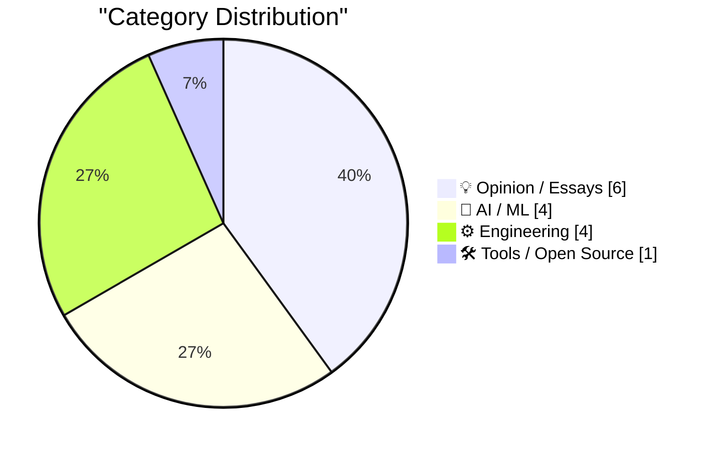
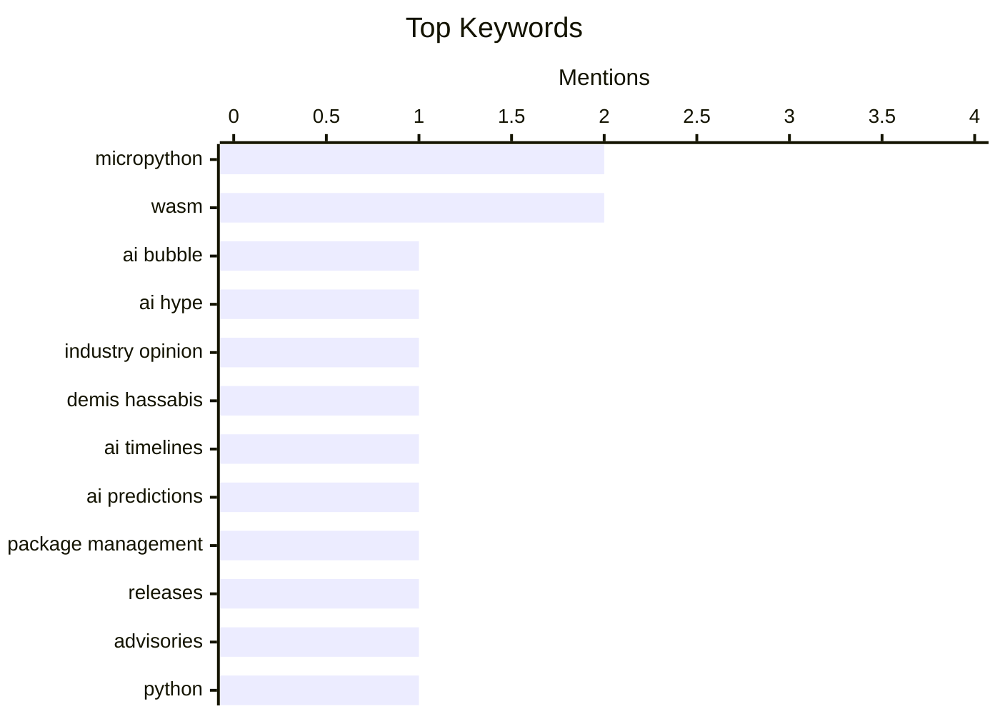

## Today's Highlights
The AI industry continues to navigate a complex landscape, marked by critical assessments of its current "bubble" phase, internal debates among key leaders, and the rollout of new security features like OpenAI's Lockdown Mode. Meanwhile, the software engineering community is heavily focused on secure and efficient development practices. This includes significant strides in sandboxing Python code with MicroPython and WASM, alongside ongoing advancements in package management and new SDKs for Go applications.
---
## Must Read Today
1. **Premium: The Hater's Guide To The AI Bubble 3.0**
[Premium: The Hater's Guide To The AI Bubble 3.0](https://www.wheresyoured.at/premium-the-haters-guide-to-the-ai-bubble-3-0/) — wheresyoured.at · 22h ago · 💡 Opinion / Essays
> This article critically examines the current state of the AI industry, framing it as the third iteration of an "AI bubble." As a continuation of previous "Hater's Guides," it likely critiques overhyped claims, unsustainable valuations, and the lack of fundamental breakthroughs justifying the current market frenzy. The author probably draws parallels with previous tech bubbles or AI winters, highlighting areas of concern. The piece expresses continued skepticism about the long-term viability and genuine progress within the current AI landscape.
💡 **Why read it**: It offers a critical, contrarian perspective on the widely discussed AI boom, challenging mainstream narratives and encouraging deeper scrutiny.
🏷️ AI Bubble, AI Hype, Industry Opinion
2. **Sir Demis Hassabis vs Sir Demis Hassabis**
[Sir Demis Hassabis vs Sir Demis Hassabis](https://garymarcus.substack.com/p/sir-demis-hassabis-vs-sir-demis-hassabis) — garymarcus.substack.com · 23h ago · 🤖 AI / ML
> The article analyzes apparent inconsistencies or differing perspectives in the public statements of Demis Hassabis regarding the future and development timelines of AI. Titled "Two AI Timelines," it likely contrasts two distinct visions or predictions articulated by Hassabis, possibly highlighting shifts in his views on AI's capabilities, risks, or societal impact. The analysis aims to reconcile or explain these perceived discrepancies in his public discourse. Ultimately, the piece seeks to clarify or critique the evolving narrative around AI's future as presented by a prominent figure in the field.
💡 **Why read it**: It provides insight into the evolving perspectives of a leading AI figure, highlighting potential shifts in the understanding of AI's future and its implications.
🏷️ Demis Hassabis, AI timelines, AI predictions
3. **This Week in Package Management: 6 June 2026**
[This Week in Package Management: 6 June 2026](https://nesbitt.io/2026/06/06/this-week-in-package-management.html) — nesbitt.io · 4h ago · ⚙️ Engineering
> This article serves as a weekly digest of significant updates and news within the global package management ecosystem. It compiles recent releases, security advisories, and notable articles relevant to various package managers and their communities. The content covers a broad spectrum of developments, from new features to critical vulnerability disclosures across different platforms. This installment provides a concise overview of the week's most important happenings for anyone involved in software dependency management.
💡 **Why read it**: It's a valuable resource for staying updated on critical developments, releases, and security advisories across the diverse landscape of package management.
🏷️ Package Management, Releases, Advisories
---
## Data Overview
| Sources Scanned | Articles Fetched | Time Window | Selected |
|:---:|:---:|:---:|:---:|
| 88/92 | 2569 -> 18 | 24h | **15** |
### Category Distribution

### Top Keywords

<details>
<summary>Plain Text Keyword Chart (Terminal Friendly)</summary>
```
micropython        │ ████████████████████ 2
wasm               │ ████████████████████ 2
ai bubble          │ ██████████░░░░░░░░░░ 1
ai hype            │ ██████████░░░░░░░░░░ 1
industry opinion   │ ██████████░░░░░░░░░░ 1
demis hassabis     │ ██████████░░░░░░░░░░ 1
ai timelines       │ ██████████░░░░░░░░░░ 1
ai predictions     │ ██████████░░░░░░░░░░ 1
package management │ ██████████░░░░░░░░░░ 1
releases           │ ██████████░░░░░░░░░░ 1
```
</details>
### Topic Tags
**micropython**(2) · **wasm**(2) · **ai bubble**(1) · ai hype(1) · industry opinion(1) · demis hassabis(1) · ai timelines(1) · ai predictions(1) · package management(1) · releases(1) · advisories(1) · python(1) · sandboxing(1) · anthropic(1) · ai policy(1) · ai pause(1) · jax(1) · llm(1) · backends(1) · devices(1)
---
## Opinion / Essays
### 1. Premium: The Hater's Guide To The AI Bubble 3.0
[Premium: The Hater's Guide To The AI Bubble 3.0](https://www.wheresyoured.at/premium-the-haters-guide-to-the-ai-bubble-3-0/) — **wheresyoured.at** · 22h ago · ⭐ 27/30
> This article critically examines the current state of the AI industry, framing it as the third iteration of an "AI bubble." As a continuation of previous "Hater's Guides," it likely critiques overhyped claims, unsustainable valuations, and the lack of fundamental breakthroughs justifying the current market frenzy. The author probably draws parallels with previous tech bubbles or AI winters, highlighting areas of concern. The piece expresses continued skepticism about the long-term viability and genuine progress within the current AI landscape.
🏷️ AI Bubble, AI Hype, Industry Opinion
---
### 2. Why all the PRs?
[Why all the PRs?](https://idiallo.com/blog/why-all-the-prs) — **idiallo.com** · 15h ago · ⭐ 23/30
> The article examines the underlying reasons for the current proliferation of Pull Requests (PRs), including AI-generated ones, in the software development community. It posits that PRs have evolved into a crucial "signal" for demonstrating work and building a resume, replacing older methods like personal websites. The author suggests that the industry's emphasis on visible contributions drives this trend, leading to a high volume of PRs, even those generated by AI, as developers seek to showcase their skills and activity. The article concludes that the abundance of PRs reflects a shift in how developers prove their competence and engage with the open-source community for career advancement.
🏷️ AI, pull requests, career, developer culture
---
### 3. In pursuit of desirable difficulties
[In pursuit of desirable difficulties](https://www.joanwestenberg.com/in-pursuit-of-desirable-difficulties/) — **joanwestenberg.com** · 12h ago · ⭐ 19/30
> This article discusses the psychological concept of "desirable difficulties" in the context of learning and memory retention. Coined by psychologist Robert Bjork, this principle suggests that making learning practice harder, rather than easier, leads to more robust and long-lasting knowledge. Students who actively struggle to retrieve an answer remember it longer and clearer than those who are given the same answer with minimal effort. The article advocates for learning strategies that incorporate challenges, such as active recall and spaced repetition, over passive consumption. Embracing these "desirable difficulties" by introducing strategic challenges into the learning process significantly enhances long-term memory and understanding.
🏷️ Learning, Pedagogy, Difficulties, Retention
---
### 4. Pluralistic: Refining humanity (05 Jun 2026)
[Pluralistic: Refining humanity (05 Jun 2026)](https://pluralistic.net/2026/06/05/defining-humanity/) — **pluralistic.net** · 17h ago · ⭐ 18/30
> This "Pluralistic" entry serves as a curated collection of links and commentary, centered around the theme "Refining humanity: What our technology is shows us what we're not." The article explores how technology defines or redefines human nature and societal structures. It includes various sections like "Object permanence," which lists diverse topics such as GNU Radio, France's stance on "follow us on Twitter," Aaronsw's vindication, and "Capitalism's crooked refs." This broad range of subjects indicates a comprehensive socio-technical commentary. The post ultimately functions as a lens through which to examine societal issues and human identity in the context of technological advancement.
🏷️ technology, society, commentary, future
---
### 5. There's still no point in gigabit broadband
[There's still no point in gigabit broadband](https://shkspr.mobi/blog/2026/06/theres-still-no-point-in-gigabit-broadband/) — **shkspr.mobi** · 2h ago · ⭐ 18/30
> This article argues against the practical necessity of gigabit broadband for the majority of users, reiterating a stance first taken six years prior. The author recently received Virgin Media's Gig1 package for £30 per month, yet finds that the actual utility of such high speeds remains limited. Typical household usage, including streaming, browsing, and remote work, rarely saturates even 100Mbps, let alone the full 1Gbps. The piece implies that despite the technical availability, real-world applications and existing device limitations often prevent users from fully utilizing gigabit bandwidth. For the average consumer, gigabit broadband remains largely superfluous, as current usage patterns and device capabilities do not necessitate such high speeds.
🏷️ broadband, gigabit, network speed, opinion
---
### 6. Nieman Journalism Lab: Twitter/X Punishes Accounts That Post Links
[Nieman Journalism Lab: Twitter/X Punishes Accounts That Post Links](https://www.niemanlab.org/2026/04/do-links-hurt-news-publishers-on-twitter-our-analysis-suggests-yes/) — **daringfireball.net** · 17h ago · ⭐ 17/30
> This article investigates whether Twitter/X's algorithm penalizes news publishers' accounts for posting external links, based on research by Laura Hazard Owen for Nieman Journalism Lab. Using Claude, she scraped the 200 most recent tweets from 18 large publishers' X accounts, tracking engagement metrics like likes, comments, and retweets. The study included six paywalled publishers (e.g., Bloomberg, NYT) and nine non-paywalled ones (e.g., AP, BBC). The analysis strongly suggests that tweets containing external links receive significantly lower engagement compared to those without, indicating a platform-level algorithmic deprioritization. This finding implies that Twitter/X's algorithm actively punishes posts with external links, negatively impacting news publishers' reach and engagement.
🏷️ Twitter/X, engagement, publishers, social media
---
## AI / ML
### 7. Sir Demis Hassabis vs Sir Demis Hassabis
[Sir Demis Hassabis vs Sir Demis Hassabis](https://garymarcus.substack.com/p/sir-demis-hassabis-vs-sir-demis-hassabis) — **garymarcus.substack.com** · 23h ago · ⭐ 26/30
> The article analyzes apparent inconsistencies or differing perspectives in the public statements of Demis Hassabis regarding the future and development timelines of AI. Titled "Two AI Timelines," it likely contrasts two distinct visions or predictions articulated by Hassabis, possibly highlighting shifts in his views on AI's capabilities, risks, or societal impact. The analysis aims to reconcile or explain these perceived discrepancies in his public discourse. Ultimately, the piece seeks to clarify or critique the evolving narrative around AI's future as presented by a prominent figure in the field.
🏷️ Demis Hassabis, AI timelines, AI predictions
---
### 8. No, Anthropic did not call for a pause on AI development
[No, Anthropic did not call for a pause on AI development](https://garymarcus.substack.com/p/no-anthropic-did-not-call-for-a-pause) — **garymarcus.substack.com** · 12h ago · ⭐ 24/30
> The article clarifies a common misconception regarding Anthropic's stance on pausing AI development. It directly refutes claims that Anthropic advocated for a complete halt in AI development, asserting that such interpretations misrepresent their actual position. The piece likely analyzes Anthropic's official statements or publications to demonstrate their nuanced perspective, which may involve calls for responsible development or regulation rather than a full pause. The article concludes that Anthropic has not called for a pause on AI development, correcting a prevalent misunderstanding.
🏷️ Anthropic, AI policy, AI pause
---
### 9. JAX backends and devices
[JAX backends and devices](https://www.gilesthomas.com/2026/06/jax-backends-and-devices) — **gilesthomas.com** · 18h ago · ⭐ 24/30
> The article explores JAX's backend and device management capabilities while porting a PyTorch LLM implementation, specifically when handling large datasets. The author encountered challenges loading the 19GiB `gpjt/fineweb-gpt2-tokens` dataset, comprising over 10 billion 16-bit unsigned integers, into JAX. The piece likely details how JAX interacts with different hardware backends (e.g., CPU, GPU, TPU) and how to efficiently manage data transfer and computation across these devices for large-scale machine learning tasks. The article provides practical insights into optimizing JAX for large-scale LLM training by effectively utilizing its backend and device functionalities.
🏷️ JAX, LLM, Backends, Devices
---
### 10. OpenAI Help: Lockdown Mode
[OpenAI Help: Lockdown Mode](https://simonwillison.net/2026/Jun/5/openai-help-lockdown-mode/#atom-everything) — **simonwillison.net** · 14h ago · ⭐ 22/30
> The article announces the general availability and rollout of OpenAI's "Lockdown Mode" feature for ChatGPT users. First teased in February, Lockdown Mode is now live and being rolled out to eligible personal accounts (Free, Go, Plus, and Pro) and self-serve ChatGPT Business accounts. This feature is specifically designed to help prevent the final stage of data exfiltration, enhancing security for user interactions within ChatGPT. Lockdown Mode provides an important security enhancement for ChatGPT users by mitigating data exfiltration risks across various account types.
🏷️ OpenAI, Lockdown Mode, ChatGPT, security
---
## Engineering
### 11. This Week in Package Management: 6 June 2026
[This Week in Package Management: 6 June 2026](https://nesbitt.io/2026/06/06/this-week-in-package-management.html) — **nesbitt.io** · 4h ago · ⭐ 25/30
> This article serves as a weekly digest of significant updates and news within the global package management ecosystem. It compiles recent releases, security advisories, and notable articles relevant to various package managers and their communities. The content covers a broad spectrum of developments, from new features to critical vulnerability disclosures across different platforms. This installment provides a concise overview of the week's most important happenings for anyone involved in software dependency management.
🏷️ Package Management, Releases, Advisories
---
### 12. Running Python code in a sandbox with MicroPython and WASM
[Running Python code in a sandbox with MicroPython and WASM](https://simonwillison.net/2026/Jun/6/micropython-in-a-sandbox/#atom-everything) — **simonwillison.net** · 10h ago · ⭐ 24/30
> The article addresses the challenge of securely running Python code within a sandboxed environment. The author introduces a new approach leveraging MicroPython compiled to WebAssembly (WASM), released as the `micropython-wasm` alpha package. This method is designed to provide the desired characteristics for sandboxed code execution, specifically for a `Datasette Agent` plugin named `datasette-agent-micropython-wasm`. This new `micropython-wasm` solution offers a promising and robust method for sandboxing Python code, particularly for web-based applications requiring secure execution environments.
🏷️ Python, sandboxing, MicroPython, WASM
---
### 13. Giving your Go apps Tigris superpowers
[Giving your Go apps Tigris superpowers](https://www.tigrisdata.com/blog/storage-sdk-go/) — **xeiaso.net** · -3479m ago · ⭐ 23/30
> The article introduces a new Go SDK designed to unlock Tigris-exclusive storage features that are not natively supported by the AWS SDK, despite Tigris's S3 compatibility. While Tigris is S3-compatible, advanced features like bucket forking, snapshots, and object renaming require verbose workarounds with the standard AWS SDK. The new Go SDK provides two packages: `storage`, a drop-in replacement for the S3 client with first-class methods for Tigris-specific operations, and `simplestorage`, a higher-level abstraction for simpler use. This dedicated Go SDK empowers developers to fully leverage Tigris's unique capabilities within their Go applications, streamlining access to advanced storage functionalities.
🏷️ Go, Tigris, S3, SDK
---
### 14. Getting silly with C, part &((int*)1)[-1]
[Getting silly with C, part &((int*)1)[-1]](https://lcamtuf.substack.com/p/getting-silly-with-c-part-and-int1) — **lcamtuf.substack.com** · 11h ago · ⭐ 22/30
> This article explores the intricacies and undefined behaviors of C programming, focusing on the peculiar expression `&((int*)1)[-1]`. It delves into C's type system and pointer arithmetic, discussing how compilers might interpret this seemingly nonsensical construct due to rules like array-to-pointer decay and pointer arithmetic on `void*` or `char*` types, potentially yielding `0` on some systems. The author highlights the distinction between C's abstract machine and real-world compiler implementations. While technically undefined behavior, such constructs offer deep insights into C's underlying mechanisms and compiler design. This exploration serves as a unique learning opportunity for advanced C programmers.
🏷️ C programming, low-level, compiler, tricks
---
## Tools / Open Source
### 15. micropython-wasm 0.1a2
[micropython-wasm 0.1a2](https://simonwillison.net/2026/Jun/6/micropython-wasm/#atom-everything) — **simonwillison.net** · 9h ago · ⭐ 22/30
> The article announces the release of `micropython-wasm` version 0.1a2, focusing on its new command-line interface (CLI). This alpha release introduces a CLI to the `micropython-wasm` package, addressing issue #7. The CLI was inspired by the initial draft of a related blog post, serving as an effective tool to demonstrate the package's capabilities for running Python code in a WebAssembly sandbox. The addition of a CLI in `micropython-wasm 0.1a2` significantly enhances its usability for demonstrating and interacting with the MicroPython-in-WASM sandbox.
🏷️ MicroPython, WASM, CLI, release
---
*Generated at 2026-06-06 14:01 | Scanned 88 sources -> 2569 articles -> selected 15*
*Based on the [Hacker News Popularity Contest 2025](https://refactoringenglish.com/tools/hn-popularity/) RSS source list recommended by [Andrej Karpathy](https://x.com/karpathy)*
*Produced by Dongdianr AI. Follow the same-name WeChat public account for more AI practical tips 💡*
