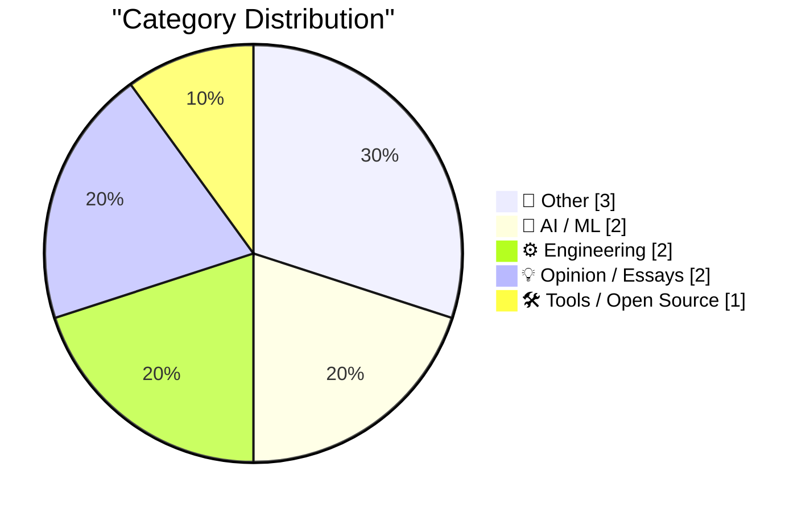
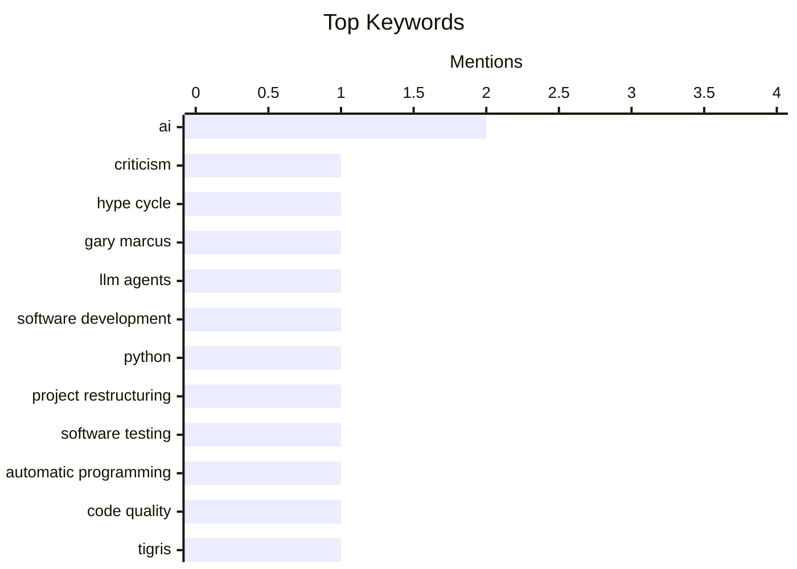

## Today's Highlights
The AI industry is navigating a complex period, with reports of a significant "Black Friday" downturn marked by layoffs. Despite these challenges, large language models continue to drive innovation, revolutionizing software development from project initiation with LLM agents to transforming testing methodologies. Amidst these rapid technological advancements, a critical discourse is also emerging, examining the pervasive and often problematic influence of advanced technology on society.
---
## Must Read Today
1. **AI’s Black Friday**
[AI’s Black Friday](https://garymarcus.substack.com/p/ais-black-friday) — garymarcus.substack.com · 21h ago · 🤖 AI / ML
> This article discusses a significant downturn in the AI industry, characterized by widespread layoffs at major companies like Google DeepMind and Waymo, signaling a shift from hype to a more sober reality. It highlights that despite massive investments, many AI ventures, particularly in robotics and self-driving, have struggled to deliver on promises or achieve profitability. The author suggests this period reflects an "AI winter," where the technology's limitations and real-world deployment challenges are becoming clearer. The main takeaway is that the AI industry is undergoing a necessary correction, moving past inflated expectations towards more realistic and sustainable development.
💡 **Why read it**: It offers a critical perspective on the current state of the AI industry, highlighting its challenges and potential "winter" amidst widespread hype.
🏷️ AI, Criticism, Hype Cycle, Gary Marcus
2. **Thoughts on starting new projects with LLM agents**
[Thoughts on starting new projects with LLM agents](https://eli.thegreenplace.net/2026/thoughts-on-starting-new-projects-with-llm-agents/) — eli.thegreenplace.net · 13h ago · 🤖 AI / ML
> This post reflects on the experience of using LLM agents for new software projects, building on a previous successful rewrite of a Python project (pycparser). The author notes that while LLMs excel at generating boilerplate, basic structure, and simple functions, they struggle with complex architectural decisions, nuanced error handling, and maintaining a consistent mental model across a larger codebase. The key finding is that LLM agents are most effective when guided by a human who provides clear, iterative instructions and performs significant post-generation refinement, acting as an "orchestrator." The conclusion is that LLMs are powerful tools for accelerating initial development and specific tasks, but human expertise remains crucial for overall project quality, complexity management, and architectural integrity.
💡 **Why read it**: It provides practical insights into the strengths and limitations of using LLM agents for new software development, based on real-world experience.
🏷️ LLM Agents, Software Development, Python, Project Restructuring
3. **A new era for software testing**
[A new era for software testing](http://antirez.com/news/168) — antirez.com · 4h ago · ⚙️ Engineering
> This article explores how automatic programming, particularly with LLMs, is transforming software development and testing. The author observes that while automatically generated code may not always match the structural quality of the best hand-written software, it often surpasses the quality of decently developed human code in specific use cases. The core argument is that the traditional quality-time tradeoff in software development is shifting, with LLMs enabling faster code generation that, while not perfect, is often "good enough" and significantly reduces development time. This shift necessitates a new focus on testing, where the challenge moves from finding bugs in human-written code to verifying the correctness and robustness of automatically generated solutions.
💡 **Why read it**: It offers a thought-provoking perspective on how automatic programming is changing the economics of software development and the evolving role of testing.
🏷️ Software Testing, Automatic Programming, AI, Code Quality
---
## Data Overview
| Sources Scanned | Articles Fetched | Time Window | Selected |
|:---:|:---:|:---:|:---:|
| 86/92 | 2544 -> 10 | 24h | **10** |
### Category Distribution

### Top Keywords

<details>
<summary>Plain Text Keyword Chart (Terminal Friendly)</summary>
```
ai                    │ ████████████████████ 2
criticism             │ ██████████░░░░░░░░░░ 1
hype cycle            │ ██████████░░░░░░░░░░ 1
gary marcus           │ ██████████░░░░░░░░░░ 1
llm agents            │ ██████████░░░░░░░░░░ 1
software development  │ ██████████░░░░░░░░░░ 1
python                │ ██████████░░░░░░░░░░ 1
project restructuring │ ██████████░░░░░░░░░░ 1
software testing      │ ██████████░░░░░░░░░░ 1
automatic programming │ ██████████░░░░░░░░░░ 1
```
</details>
### Topic Tags
**ai**(2) · **criticism**(1) · **hype cycle**(1) · gary marcus(1) · llm agents(1) · software development(1) · python(1) · project restructuring(1) · software testing(1) · automatic programming(1) · code quality(1) · tigris(1) · go sdk(1) · s3(1) · cloud storage(1) · tech policy(1) · drm(1) · ai criticism(1) · digital rights(1) · kpn(1)
---
## Other
### 1. From Kepler to Bessel
[From Kepler to Bessel](https://www.johndcook.com/blog/2026/06/06/from-kepler-to-bessel/) — **johndcook.com** · 19h ago · ⭐ 17/30
> This article delves into the historical mathematical connection between Kepler's equation for planetary motion and the integral representation of Bessel functions. Building on a previous brief mention, it explains how the problem of describing a planet's position in an elliptical orbit, governed by Kepler's equation, historically motivated the development and understanding of Bessel functions. The post explores the "arcane names" and multiple ways to describe orbital positions, highlighting the mathematical journey from celestial mechanics to advanced special functions. The key takeaway is that Bessel functions, fundamental in many areas of physics and engineering, have their roots in solving practical astronomical problems like Kepler's.
🏷️ Bessel Functions, Kepler's Equation, Mathematics, Physics
---
### 2. Trump Lawyer Argues Trump Can Tear Down Statue of Liberty
[Trump Lawyer Argues Trump Can Tear Down Statue of Liberty](https://talkingpointsmemo.com/edblog/trump-can-tear-down-statue-of-liberty-says-trump-lawyer) — **daringfireball.net** · 18h ago · ⭐ 16/30
> This article reports on a striking legal argument made by a DOJ lawyer, Yaakov Roth, during a hearing concerning presidential powers. In response to a judge's hypothetical question about a president's ability to bulldoze the Statue of Liberty, the lawyer asserted that President Trump could indeed do so without legal challenge. The context was a a hearing about the president’s alleged bulldozing of the East Wing of the White House and plans for a ballroom. The judge's question aimed to test the limits of the administration's argument regarding presidential immunity and unchecked executive power.
🏷️ Trump, Legal, Politics, Statue of Liberty
---
### 3. 60 Minutes Correspondents Lesley Stahl, Bill Whitaker, and the Other Guy Will Stay at Show
[60 Minutes Correspondents Lesley Stahl, Bill Whitaker, and the Other Guy Will Stay at Show](https://www.nytimes.com/2026/06/05/business/media/60-minutes-cbs-stahl-whitaker-wertheim.html?unlocked_article_code=1.oFA.xooG.Pz8cQv8odz7Z) — **daringfireball.net** · 17h ago · ⭐ 13/30
> This article reports that veteran 60 Minutes correspondents Lesley Stahl, Bill Whitaker, and Jon Wertheim have decided to remain with the show despite being "deeply upset" by the firings of Tanya and Draggan. In a memo, they stated their belief that the former leaders were expelled for fighting for the show's values and independence, with no explanation offered for their dismissal. The correspondents' decision to stay, despite their strong disapproval, underscores the internal turmoil and challenges to journalistic integrity within the newsroom. The situation highlights ongoing tensions between corporate management and editorial independence at a prominent news program.
🏷️ 60 Minutes, Media, Personnel, TV Show
---
## AI / ML
### 4. AI’s Black Friday
[AI’s Black Friday](https://garymarcus.substack.com/p/ais-black-friday) — **garymarcus.substack.com** · 21h ago · ⭐ 28/30
> This article discusses a significant downturn in the AI industry, characterized by widespread layoffs at major companies like Google DeepMind and Waymo, signaling a shift from hype to a more sober reality. It highlights that despite massive investments, many AI ventures, particularly in robotics and self-driving, have struggled to deliver on promises or achieve profitability. The author suggests this period reflects an "AI winter," where the technology's limitations and real-world deployment challenges are becoming clearer. The main takeaway is that the AI industry is undergoing a necessary correction, moving past inflated expectations towards more realistic and sustainable development.
🏷️ AI, Criticism, Hype Cycle, Gary Marcus
---
### 5. Thoughts on starting new projects with LLM agents
[Thoughts on starting new projects with LLM agents](https://eli.thegreenplace.net/2026/thoughts-on-starting-new-projects-with-llm-agents/) — **eli.thegreenplace.net** · 13h ago · ⭐ 28/30
> This post reflects on the experience of using LLM agents for new software projects, building on a previous successful rewrite of a Python project (pycparser). The author notes that while LLMs excel at generating boilerplate, basic structure, and simple functions, they struggle with complex architectural decisions, nuanced error handling, and maintaining a consistent mental model across a larger codebase. The key finding is that LLM agents are most effective when guided by a human who provides clear, iterative instructions and performs significant post-generation refinement, acting as an "orchestrator." The conclusion is that LLMs are powerful tools for accelerating initial development and specific tasks, but human expertise remains crucial for overall project quality, complexity management, and architectural integrity.
🏷️ LLM Agents, Software Development, Python, Project Restructuring
---
## Engineering
### 6. A new era for software testing
[A new era for software testing](http://antirez.com/news/168) — **antirez.com** · 4h ago · ⭐ 27/30
> This article explores how automatic programming, particularly with LLMs, is transforming software development and testing. The author observes that while automatically generated code may not always match the structural quality of the best hand-written software, it often surpasses the quality of decently developed human code in specific use cases. The core argument is that the traditional quality-time tradeoff in software development is shifting, with LLMs enabling faster code generation that, while not perfect, is often "good enough" and significantly reduces development time. This shift necessitates a new focus on testing, where the challenge moves from finding bugs in human-written code to verifying the correctness and robustness of automatically generated solutions.
🏷️ Software Testing, Automatic Programming, AI, Code Quality
---
### 7. KPN Interactieve TV zonder Experia Box
[KPN Interactieve TV zonder Experia Box](https://berthub.eu/articles/posts/kpn-interactieve-tv-zelf-doen/) — **berthub.eu** · 3h ago · ⭐ 18/30
> This article provides updated instructions for configuring KPN Interactive TV (using the "5202" Set Top Box) without the standard KPN Experia Box, a common challenge for users with custom network setups. The author details the necessary steps, including an update to the `igmpproxy.conf` file, which was crucial after a recent change. The post also includes a tip on how to factory reset the receiver, indicating ongoing maintenance and troubleshooting for this specific setup. The core finding is that with specific network configurations and updated proxy settings, it's possible to bypass the Experia Box for KPN TV services.
🏷️ KPN, Experia Box, Network, IPTV
---
## Opinion / Essays
### 8. Pluralistic: Criticizing the everything machine (06 Jun 2026)
[Pluralistic: Criticizing the everything machine (06 Jun 2026)](https://pluralistic.net/2026/06/06/applied-counterescatology/) — **pluralistic.net** · 20h ago · ⭐ 23/30
> This article, part of Cory Doctorow's "Pluralistic" series, critiques the pervasive and often problematic nature of modern technology and large platforms, encapsulated by the theme "Criticizing the everything machine." It touches upon various related issues, including discussions around Parliament vs. DRM, counterfeiting luxury goods, and "lean-back media." The piece generally highlights the unchecked power and unintended consequences of dominant technological systems and digital rights management. The overarching message is a call for critical engagement with technology and its societal implications, advocating for user rights and open systems.
🏷️ Tech Policy, DRM, AI Criticism, Digital Rights
---
### 9. Halide Mark III
[Halide Mark III](https://www.lux.camera/halide-mark-iii/) — **daringfireball.net** · 13h ago · ⭐ 15/30
> This article, written by Ben Sandofsky of Lux Camera, discusses the inspiration behind "Halide Mark III," drawing parallels between the limited yet versatile choices in analog photography and the design philosophy for a digital camera app. Sandofsky returned to analog photography in 2023 and found freedom in the limited selection of film stocks, contrasting it with the overwhelming number of digital presets. This experience inspired a "less is more" approach, aiming to create a digital tool that offers a handful of high-quality, versatile options rather than thousands. The core idea is to simplify the user experience and enhance creative focus by providing curated, powerful tools, much like classic film stocks.
🏷️ Photography, Analog, Halide, Camera App
---
## Tools / Open Source
### 10. Giving your Go apps Tigris superpowers
[Giving your Go apps Tigris superpowers](https://www.tigrisdata.com/blog/storage-sdk-go/) — **xeiaso.net** · -2038m ago · ⭐ 25/30
> This article introduces a new Go SDK for Tigris, an S3-compatible object storage service, designed to unlock its unique features beyond standard S3 operations. While Tigris is S3-compatible, its exclusive features like bucket forking, snapshots, and object renaming require verbose workarounds with the AWS SDK. The new Go SDK offers two flavors: a `storage` package as a drop-in replacement for the standard S3 client with first-class methods for Tigris-specific operations, and a `simplestorage` package for higher-level abstractions. This SDK aims to simplify integration and leverage Tigris's advanced capabilities directly within Go applications.
🏷️ Tigris, Go SDK, S3, Cloud Storage
---
*Generated at 2026-06-07 14:02 | Scanned 86 sources -> 2544 articles -> selected 10*
*Based on the [Hacker News Popularity Contest 2025](https://refactoringenglish.com/tools/hn-popularity/) RSS source list recommended by [Andrej Karpathy](https://x.com/karpathy)*
*Produced by Dongdianr AI. Follow the same-name WeChat public account for more AI practical tips 💡*
