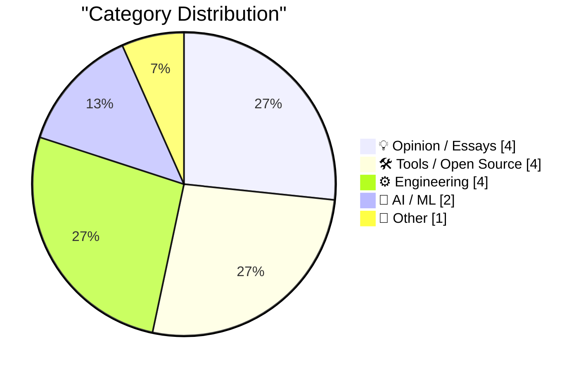
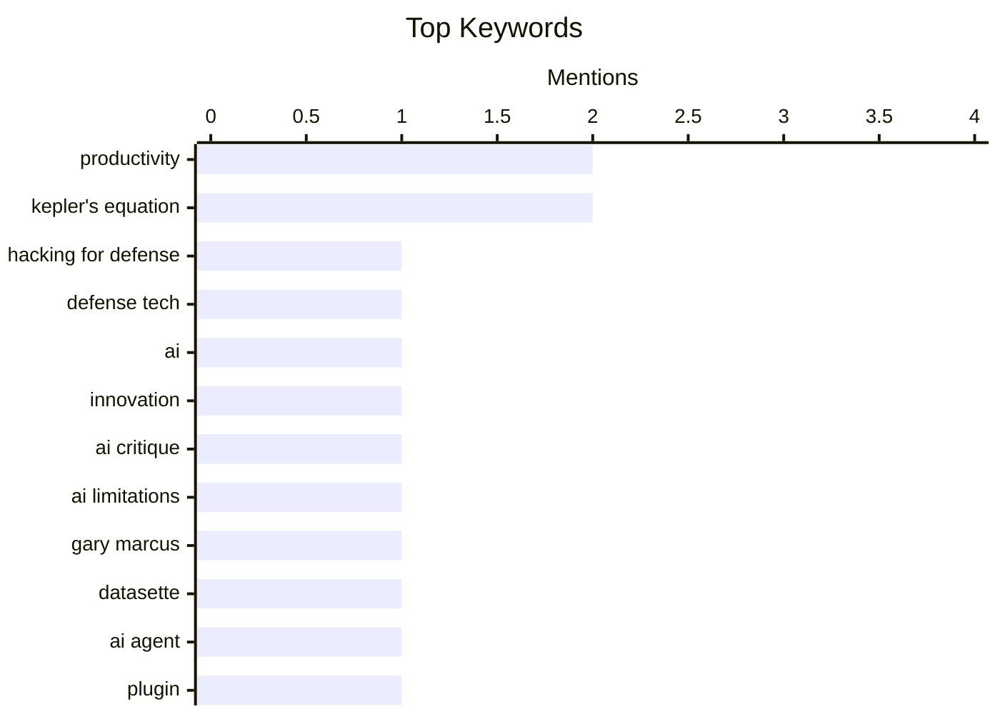

## Today's Highlights
Today's tech highlights reveal a critical look at the AI landscape, questioning its real-world productivity gains despite massive investment and hype. Meanwhile, the software engineering community is re-evaluating core practices, from the efficacy of development frameworks like SwiftUI to the vital dynamics between engineers and product managers. This includes a renewed focus on coding as a design process and addressing developer well-being to foster genuine innovation and quality.
---
## Must Read Today
1. **Hacking for Defense @ Stanford 2026 – Lessons Learned Presentations**
[Hacking for Defense @ Stanford 2026 – Lessons Learned Presentations](https://steveblank.com/2026/06/08/g-for-defense-stanford-2026-lessons-learned-presentations/) — steveblank.com · 1h ago · 💡 Opinion / Essays
> The "Hacking for Defense" class at Stanford addresses the evolving landscape of asymmetric warfare and disruptive technologies. Now in its 11th year, the class has adapted to the impact of drones, off-the-shelf technologies, AI, commercial space access, and a startup-friendly DoD acquisition system. This evolution makes the current iteration feel significantly different from previous years. The program continues to be relevant by integrating modern technological and strategic shifts into its curriculum.
💡 **Why read it**: It provides insight into how academic programs are adapting to teach defense innovation in the face of rapidly changing technological and geopolitical landscapes.
🏷️ Hacking for Defense, defense tech, AI, innovation
2. **Slop, productivity, and why the AI-fueled world is going nowhere mighty fast**
[Slop, productivity, and why the AI-fueled world is going nowhere mighty fast](https://garymarcus.substack.com/p/slop-productivity-and-why-the-ai) — garymarcus.substack.com · 22h ago · 🤖 AI / ML
> The article discusses the perceived lack of real productivity gains despite the hype surrounding AI, particularly noting an increase in "slop" or low-quality output. The author references a graph from John Burn-Murdoch at the FT, which distills the idea that AI's current impact isn't translating into significant productivity improvements. This suggests a disconnect between technological advancement and tangible economic or operational benefits. The author argues that the current AI-fueled environment is not leading to rapid progress due to an increase in low-quality output.
💡 **Why read it**: It offers a critical perspective on the actual impact of AI on productivity, challenging the widespread optimism with a focus on the proliferation of "slop."
🏷️ AI critique, Productivity, AI limitations, Gary Marcus
3. **datasette-agent-edit 0.1a0**
[datasette-agent-edit 0.1a0](https://simonwillison.net/2026/Jun/7/datasette-agent-edit/#atom-everything) — simonwillison.net · 14h ago · 🛠 Tools / Open Source
> The article announces the initial alpha release of `datasette-agent-edit`, a plugin designed to enable agentic editing of text within Datasette Agent. This plugin, version 0.1a0, is the first of several planned for Datasette Agent to facilitate edits to various text formats. The author highlights that agentic text editing is complex, mentioning a "favorite published design" as a reference for getting it right. Planned use cases include collaborative Markdown editing, updating large SQL queries, and editing SVG files. `datasette-agent-edit` aims to provide robust, agent-driven text editing capabilities for Datasette Agent, starting with this alpha release.
💡 **Why read it**: It introduces a new open-source tool, `datasette-agent-edit`, that extends Datasette Agent's capabilities for structured, agentic text manipulation across various file types.
🏷️ Datasette, AI Agent, Plugin, Text editing
---
## Data Overview
| Sources Scanned | Articles Fetched | Time Window | Selected |
|:---:|:---:|:---:|:---:|
| 87/92 | 2555 -> 18 | 24h | **15** |
### Category Distribution

### Top Keywords

<details>
<summary>Plain Text Keyword Chart (Terminal Friendly)</summary>
```
productivity        │ ████████████████████ 2
kepler's equation   │ ████████████████████ 2
hacking for defense │ ██████████░░░░░░░░░░ 1
defense tech        │ ██████████░░░░░░░░░░ 1
ai                  │ ██████████░░░░░░░░░░ 1
innovation          │ ██████████░░░░░░░░░░ 1
ai critique         │ ██████████░░░░░░░░░░ 1
ai limitations      │ ██████████░░░░░░░░░░ 1
gary marcus         │ ██████████░░░░░░░░░░ 1
datasette           │ ██████████░░░░░░░░░░ 1
```
</details>
### Topic Tags
**productivity**(2) · **kepler's equation**(2) · **hacking for defense**(1) · defense tech(1) · ai(1) · innovation(1) · ai critique(1) · ai limitations(1) · gary marcus(1) · datasette(1) · ai agent(1) · plugin(1) · text editing(1) · swiftui(1) · apple development(1) · ui/ux(1) · apple ai(1) · agi(1) · ai philosophy(1) · go(1)
---
## Opinion / Essays
### 1. Hacking for Defense @ Stanford 2026 – Lessons Learned Presentations
[Hacking for Defense @ Stanford 2026 – Lessons Learned Presentations](https://steveblank.com/2026/06/08/g-for-defense-stanford-2026-lessons-learned-presentations/) — **steveblank.com** · 1h ago · ⭐ 27/30
> The "Hacking for Defense" class at Stanford addresses the evolving landscape of asymmetric warfare and disruptive technologies. Now in its 11th year, the class has adapted to the impact of drones, off-the-shelf technologies, AI, commercial space access, and a startup-friendly DoD acquisition system. This evolution makes the current iteration feel significantly different from previous years. The program continues to be relevant by integrating modern technological and strategic shifts into its curriculum.
🏷️ Hacking for Defense, defense tech, AI, innovation
---
### 2. Doing nothing at work
[Doing nothing at work](https://seangoedecke.com/doing-nothing-at-work/) — **seangoedecke.com** · 14h ago · ⭐ 22/30
> Many engineers are over-utilized, leading to diminished performance and missed opportunities for high-impact work. The author advocates for engineers to aim for 80% utilization, spending 20% of their workday away from the computer. This approach is justified because performance in tech companies is dominated by outlier events, where a small number of high-impact contributions yield disproportionate results. Deliberate downtime allows for better problem-solving, strategic thinking, and identifying these high-impact opportunities. Reducing daily work hours and maintaining an 80% utilization rate can paradoxically lead to higher overall impact by fostering an environment for identifying and executing truly valuable work.
🏷️ Productivity, Work-life balance, Engineering culture
---
### 3. Working with product managers
[Working with product managers](https://seangoedecke.com/working-with-product-managers/) — **seangoedecke.com** · 14h ago · ⭐ 22/30
> The relationship between engineers and product managers is often dysfunctional due to a lack of shared culture, language, and unclear authority structures. Unlike interactions with other roles, engineers communicate with product managers almost daily, yet struggle with a lack of common ground. This frequent, yet often misaligned, interaction leads to friction. The author implies that establishing clearer communication protocols and understanding mutual responsibilities could alleviate these issues. Improving the engineer-product manager relationship requires addressing fundamental issues of shared understanding and role clarity to foster more effective collaboration.
🏷️ Product management, Engineering teams, Collaboration
---
### 4. Coding Is Designing
[Coding Is Designing](https://blog.jim-nielsen.com/2026/code-is-design/) — **blog.jim-nielsen.com** · 19h ago · ⭐ 22/30
> The traditional view often separates coding as implementation from design as a preliminary stage. The article argues that coding is not merely implementing a design but is an integral part of the design process itself. Through coding, developers can interact with an interface, observe how changes to one element (X) affect another (Y), and iteratively tweak relationships until the design feels right. This hands-on, interactive process allows for the discovery and refinement of design solutions. Coding serves as a dynamic tool for design discovery and refinement, enabling developers to actively shape and improve user interfaces through iterative interaction.
🏷️ Coding, design, software development
---
## Tools / Open Source
### 5. datasette-agent-edit 0.1a0
[datasette-agent-edit 0.1a0](https://simonwillison.net/2026/Jun/7/datasette-agent-edit/#atom-everything) — **simonwillison.net** · 14h ago · ⭐ 24/30
> The article announces the initial alpha release of `datasette-agent-edit`, a plugin designed to enable agentic editing of text within Datasette Agent. This plugin, version 0.1a0, is the first of several planned for Datasette Agent to facilitate edits to various text formats. The author highlights that agentic text editing is complex, mentioning a "favorite published design" as a reference for getting it right. Planned use cases include collaborative Markdown editing, updating large SQL queries, and editing SVG files. `datasette-agent-edit` aims to provide robust, agent-driven text editing capabilities for Datasette Agent, starting with this alpha release.
🏷️ Datasette, AI Agent, Plugin, Text editing
---
### 6. Giving your Go apps Tigris superpowers
[Giving your Go apps Tigris superpowers](https://www.tigrisdata.com/blog/storage-sdk-go/) — **xeiaso.net** · -599m ago · ⭐ 23/30
> While Tigris is S3-compatible, its unique features like bucket forking and snapshots are not directly accessible via the standard AWS SDK, requiring verbose workarounds. To address this, Tigris has released a new Go SDK available in two flavors: a `storage` package that acts as a drop-in replacement for the S3 client with first-class methods for Tigris-specific operations, and a `simplestorage` package offering a higher-level API. This SDK allows Go developers to leverage Tigris's advanced capabilities directly and efficiently. The new Tigris Go SDK simplifies access to its unique features, enabling Go applications to fully utilize Tigris's advanced storage functionalities beyond basic S3 compatibility.
🏷️ Go, Tigris, S3, Cloud storage
---
### 7. Package Manager Patents
[Package Manager Patents](https://nesbitt.io/2026/06/08/package-manager-patents.html) — **nesbitt.io** · 4h ago · ⭐ 20/30
> This article provides a reference list of patents and applications relevant to package manager design. It includes notes on prior art for each entry, offering insights into the historical development and legal landscape of package management technologies. The compilation serves as a valuable resource for understanding intellectual property in this domain. The main takeaway is that this list helps developers and legal professionals navigate the complex patent landscape surrounding package managers.
🏷️ Package manager, patents, prior art
---
### 8. Mux — Video for Developers
[Mux — Video for Developers](https://www.mux.com/?utm_campaign=fireball&amp;utm_source=DF) — **daringfireball.net** · 12h ago · ⭐ 19/30
> Mux provides comprehensive video infrastructure for developers, enabling them to extract more value and functionality from video content. The platform features "Mux Robots," AI workflows designed to automatically unlock data within video files for tasks such as summarization, caption translation, and content moderation. These workflows are configured once and then run automatically on new video uploads. Trusted by companies like Patreon, Substack, and Synthesia, Mux simplifies complex video processing and data extraction for developers.
🏷️ Video API, AI workflows, Mux
---
## Engineering
### 9. ★ SwiftUI Only Makes It Easy to Develop Bad Apps
[★ SwiftUI Only Makes It Easy to Develop Bad Apps](https://daringfireball.net/2026/06/swiftui_only_makes_it_easy_to_develop_bad_apps) — **daringfireball.net** · 12h ago · ⭐ 24/30
> The article argues that SwiftUI, seven years after its introduction, primarily facilitates the development of poor-quality applications, contrary to Apple's historical developer message. While AppKit and UIKit still make it easy to develop good, idiomatically native apps, SwiftUI has never achieved this standard. The author implies that SwiftUI's design or implementation encourages shortcuts or patterns that lead to non-idiomatic or subpar user experiences. The author contends that SwiftUI, despite its age, fails to uphold Apple's legacy of enabling easy development of high-quality, native applications.
🏷️ SwiftUI, Apple development, UI/UX
---
### 10. How many consecutive hyphens can you have in a domain name?
[How many consecutive hyphens can you have in a domain name?](https://shkspr.mobi/blog/2026/06/how-many-consecutive-hyphens-can-you-have-in-a-domain-name/) — **shkspr.mobi** · 2h ago · ⭐ 18/30
> This article investigates the technical limits on the number of consecutive hyphens allowed within a domain name. It delves into the history and relevant standards, including TLD restrictions and anomalies, to determine if technical barriers exist for using many consecutive hyphens. The author explores whether a domain like "a----------hyphen.com" is technically permissible according to internet standards. The main conclusion is to uncover the obscure rules governing domain name character limitations beyond common sense.
🏷️ Domain names, DNS, Standards
---
### 11. Aitken acceleration before Aitken
[Aitken acceleration before Aitken](https://www.johndcook.com/blog/2026/06/07/aitkin-acceleration-kepler/) — **johndcook.com** · 17h ago · ⭐ 18/30
> The article discusses how Kepler solved his eponymous equation, M = E − e sin(E), using an iterative fixed-point method. Kepler's approach involved repeatedly substituting E = M + e sin(E) into itself, suggesting that "a couple iterations should be enough" for convergence. This method, while effective for Kepler, predates the formalization of acceleration techniques like Aitken acceleration. Kepler's iterative solution demonstrates an early, intuitive application of fixed-point iteration for numerical approximation.
🏷️ Aitken acceleration, Kepler's equation, numerical methods
---
### 12. The Laplace limit
[The Laplace limit](https://www.johndcook.com/blog/2026/06/07/the-laplace-limit/) — **johndcook.com** · 18h ago · ⭐ 18/30
> This article discusses different mathematical methods for solving Kepler's equation, M = E − e sin(E), specifically contrasting sine series and power series approaches. Lagrange solved Kepler's equation using a power series in 1771, while Bessel's solution involved a sum of sines. Both methods express E as a function of e and M but from distinct mathematical perspectives. The article implicitly sets the stage for discussing the Laplace limit, a concept relevant to the convergence and applicability of these series solutions for Kepler's equation.
🏷️ Kepler's equation, Laplace limit, power series
---
## AI / ML
### 13. Slop, productivity, and why the AI-fueled world is going nowhere mighty fast
[Slop, productivity, and why the AI-fueled world is going nowhere mighty fast](https://garymarcus.substack.com/p/slop-productivity-and-why-the-ai) — **garymarcus.substack.com** · 22h ago · ⭐ 26/30
> The article discusses the perceived lack of real productivity gains despite the hype surrounding AI, particularly noting an increase in "slop" or low-quality output. The author references a graph from John Burn-Murdoch at the FT, which distills the idea that AI's current impact isn't translating into significant productivity improvements. This suggests a disconnect between technological advancement and tangible economic or operational benefits. The author argues that the current AI-fueled environment is not leading to rapid progress due to an increase in low-quality output.
🏷️ AI critique, Productivity, AI limitations, Gary Marcus
---
### 14. Alberto Romero on Apple’s AI Spending
[Alberto Romero on Apple’s AI Spending](https://www.thealgorithmicbridge.com/p/what-apple-knows-about-ai-that-silicon) — **daringfireball.net** · 13h ago · ⭐ 23/30
> The article presents Alberto Romero's perspective on the nature of belief in AI and its implications for tech companies' massive capital expenditures. Romero posits that belief in AI is binary, akin to religion, with no moderate position; one either believes it changes everything or not at all. He suggests that if AI is truly transformative, companies like Apple should reorganize their entire operations around it, similar to how priests commit to their faith. The author implies that Apple's substantial AI spending reflects a deep, fundamental belief in its transformative power. Romero argues that the scale of AI investment by tech giants like Apple indicates a profound, all-encompassing belief in AI's revolutionary potential.
🏷️ Apple AI, AGI, AI philosophy
---
## Other
### 15. Powering up a module from the IBM 604: an electronic calculator from 1948
[Powering up a module from the IBM 604: an electronic calculator from 1948](http://www.righto.com/feeds/3379514160039863191/comments/default) — **righto.com** · 21h ago · ⭐ 20/30
> The article explores the historical context and technical challenges of powering up a module from the IBM 604, an electronic calculator from 1948. The 1940s marked a transition from electromechanical punch card equipment to room-filling general-purpose computers like the Harvard Mark I (1944) and IBM's SSEC (1948). The IBM 604, developed in 1948, utilized vacuum tubes, a technology fostered by WWII, to perform calculations electronically, moving beyond slower electromechanical mechanisms. The article details the process of providing power to and analyzing a specific module from this early electronic computer. The IBM 604 represents a pivotal moment in computing history, showcasing the early adoption of vacuum tube electronics to build faster, more capable calculators, and the article provides a hands-on look at its internal workings.
🏷️ Computer history, IBM 604, Vintage electronics
---
*Generated at 2026-06-08 14:01 | Scanned 87 sources -> 2555 articles -> selected 15*
*Based on the [Hacker News Popularity Contest 2025](https://refactoringenglish.com/tools/hn-popularity/) RSS source list recommended by [Andrej Karpathy](https://x.com/karpathy)*
*Produced by Dongdianr AI. Follow the same-name WeChat public account for more AI practical tips 💡*
