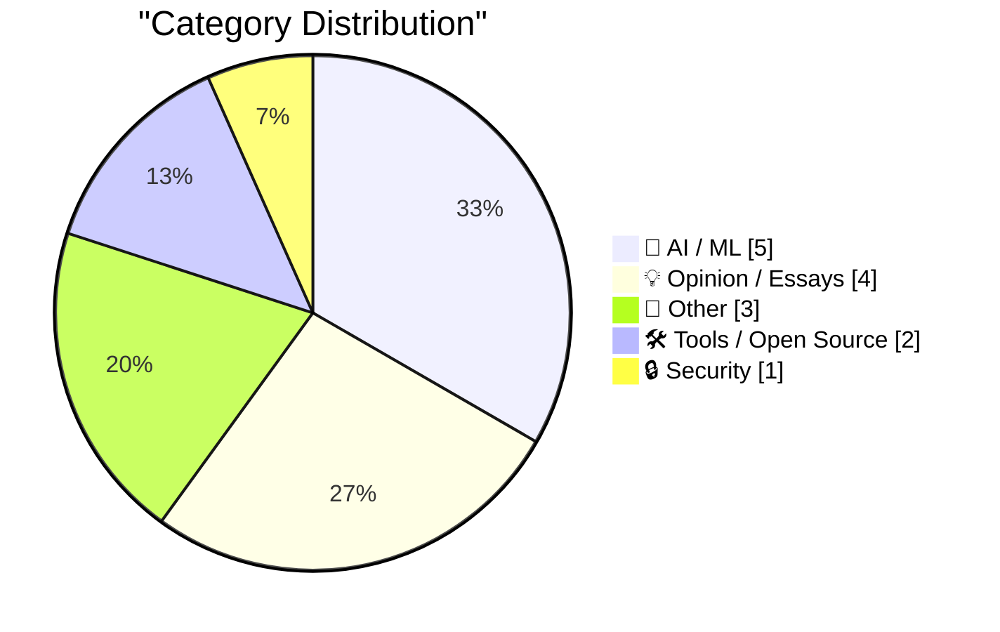
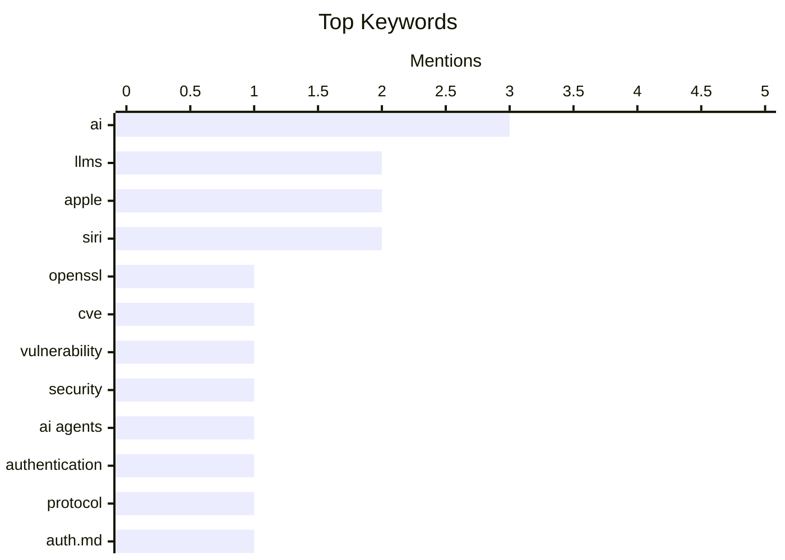

## Today's Highlights
Today's tech news highlights a pivotal moment for Artificial Intelligence, as Apple makes strategic moves to open Siri while the industry grapples with LLMs generating "almost good code" and the immense data demands of modern AI. Experts are also debating if AI's pace is slowing down. Beyond AI, the tech world continues to battle persistent memory safety vulnerabilities in software. Meanwhile, critical voices assert that entire industries are being propped up by fundamentally flawed mathematical models.
---
## Must Read Today
1. **"No way to prevent this" say users of only language where this regularly happens**
["No way to prevent this" say users of only language where this regularly happens](https://xeiaso.net/shitposts/no-way-to-prevent-this/memory-safety/CVE-2026-45447/) — xeiaso.net · 14h ago · 🔒 Security
> This article highlights the recurring issue of memory safety vulnerabilities, exemplified by CVE-2026-45447 in OpenSSL, a heap use-after-free in PKCS7_verify(). It critically points out that such vulnerabilities are prevalent in C, the language used for affected components. The author implies that despite claims of inevitability, these issues are largely a consequence of language choice. The core takeaway is that memory safety issues are not unavoidable "tragedies" but rather a systemic problem tied to specific programming languages like C.
💡 **Why read it**: It offers a critical perspective on memory safety vulnerabilities in C, challenging the notion that such issues are unpreventable.
🏷️ OpenSSL, CVE, vulnerability, security
2. **[Sponsor] WorkOS Launches auth.md — an Open Protocol for Agent Registration**
[[Sponsor] WorkOS Launches auth.md — an Open Protocol for Agent Registration](https://youtu.be/Dqp_b8GHLXU?t=1074) — daringfireball.net · 9h ago · 🛠 Tools / Open Source
> The article addresses the challenge of enabling AI agents to programmatically register with online services, a process traditionally designed for human users via browser forms. WorkOS introduces auth.md, an open protocol that allows services to expose a single, machine-readable Markdown file at their root. This file enables AI agents to dynamically discover OAuth Protected Resource Metadata, parse required scopes, and authenticate seamlessly. WorkOS AuthKit provides native support for implementing this protocol out of the box. This standardized approach aims to offer AI tools a secure and efficient way to log into applications.
💡 **Why read it**: It introduces auth.md, a novel open protocol designed to standardize and secure AI agent registration with online services.
🏷️ AI agents, authentication, protocol, auth.md
3. **An entire industry is being propped up by math that is insane.**
[An entire industry is being propped up by math that is insane.](https://garymarcus.substack.com/p/an-entire-industry-is-being-propped) — garymarcus.substack.com · 19h ago · 💡 Opinion / Essays
> This article critically asserts that a significant industry is being sustained by fundamentally flawed or "insane" mathematical underpinnings. The author suggests that the foundational calculations or models driving this industry are unsound, leading to an unsustainable or misleading perception of its viability. It implies a deep-seated problem with the quantitative methods employed, rather than just minor inaccuracies. The core message is a stark warning about the fragility of an industry built on questionable mathematical premises.
💡 **Why read it**: It raises a provocative and fundamental critique about the mathematical foundations of an unspecified industry, urging readers to question underlying assumptions.
🏷️ AI critique, Gary Marcus, industry, hype
---
## Data Overview
| Sources Scanned | Articles Fetched | Time Window | Selected |
|:---:|:---:|:---:|:---:|
| 87/92 | 2556 -> 15 | 24h | **15** |
### Category Distribution

### Top Keywords

<details>
<summary>Plain Text Keyword Chart (Terminal Friendly)</summary>
```
ai             │ ████████████████████ 3
llms           │ █████████████░░░░░░░ 2
apple          │ █████████████░░░░░░░ 2
siri           │ █████████████░░░░░░░ 2
openssl        │ ███████░░░░░░░░░░░░░ 1
cve            │ ███████░░░░░░░░░░░░░ 1
vulnerability  │ ███████░░░░░░░░░░░░░ 1
security       │ ███████░░░░░░░░░░░░░ 1
ai agents      │ ███████░░░░░░░░░░░░░ 1
authentication │ ███████░░░░░░░░░░░░░ 1
```
</details>
### Topic Tags
**ai**(3) · **llms**(2) · **apple**(2) · siri(2) · openssl(1) · cve(1) · vulnerability(1) · security(1) · ai agents(1) · authentication(1) · protocol(1) · auth.md(1) · ai critique(1) · gary marcus(1) · industry(1) · hype(1) · code generation(1) · code quality(1) · complexity(1) · data efficiency(1)
---
## AI / ML
### 1. LLMs and almost good code
[LLMs and almost good code](https://entropicthoughts.com/llms-and-almost-good-code) — **entropicthoughts.com** · 16h ago · ⭐ 26/30
> This article explores the phenomenon of Large Language Models (LLMs) generating "almost good code" that is often unnecessarily complex. The author's new prior suggests that top-of-the-line LLMs, even on easy tasks like CRUD plumbing, produce code approximately 10% more complicated than required. This increased complexity is often accepted because the code solves immediate problems, despite its potential for long-term maintenance issues. The core takeaway is that while LLMs provide quick solutions, their output may introduce hidden technical debt due to excessive complexity.
🏷️ LLMs, code generation, code quality, complexity
---
### 2. The sample efficiency black hole
[The sample efficiency black hole](https://www.dwarkesh.com/p/the-sample-efficiency-black-hole) — **dwarkesh.com** · 19h ago · ⭐ 26/30
> This article uses a powerful metaphor to describe the immense data requirements of modern Artificial Intelligence systems. It posits that while AI models exhibit a "galaxy glittering with capabilities," their core is an "unimaginably massive black hole of data." This "black hole" represents the insatiable need for vast amounts of training data that underpins AI's impressive performance. The central argument is that current AI models suffer from poor sample efficiency, requiring exorbitant data volumes to learn. The main takeaway is that the current paradigm of AI development is heavily reliant on massive datasets, posing a significant challenge for future scalability and accessibility.
🏷️ AI, data efficiency, LLMs, sample efficiency
---
### 3. Siri AI at WWDC 2026
[Siri AI at WWDC 2026](https://simonwillison.net/2026/Jun/8/wwdc/#atom-everything) — **simonwillison.net** · 14h ago · ⭐ 24/30
> This article expresses significant skepticism regarding Apple's Siri AI announcements at WWDC 2026, drawing from past disappointments with the 2024 WWDC Apple Intelligence. The author adopts a "I'll believe it when I see it" policy, indicating a cautious approach to Apple's AI claims. Despite the general skepticism, the article notes that the newly announced Siri AI features appear "feasible with today's technology." The core takeaway is a call for critical evaluation of Apple's AI promises, emphasizing the need for tangible evidence over marketing hype.
🏷️ Apple, Siri, AI, WWDC
---
### 4. AI Is Slowing Down
[AI Is Slowing Down](https://www.wheresyoured.at/ai-is-slowing-down/) — **wheresyoured.at** · 22h ago · ⭐ 24/30
> This article, primarily serving as a teaser for a premium newsletter, asserts that the pace of advancement in Artificial Intelligence is decelerating. While specific evidence or arguments are not provided in the snippet, the title itself conveys a significant claim about the current state of AI development. The implication is that the rapid progress observed in recent years may be reaching a plateau or encountering new challenges. The core takeaway is that the AI industry might be experiencing a slowdown, a counter-narrative to the prevailing perception of exponential growth.
🏷️ AI industry, AI trends, market analysis, NVIDIA
---
### 5. From the Annals of People Having Knowledge of the Matter, Siri AI Extensions Edition
[From the Annals of People Having Knowledge of the Matter, Siri AI Extensions Edition](https://www.bloomberg.com/news/articles/2026-03-26/apple-plans-to-open-up-siri-to-rival-ai-assistants-beyond-chatgpt-in-ios-27) — **daringfireball.net** · 12h ago · ⭐ 23/30
> This article reports on Apple's significant strategic shift to open Siri to rival AI assistants beyond its existing partnership with ChatGPT, as detailed by Mark Gurman for Bloomberg. This move, planned for the upcoming iOS 27 operating system update, aims to substantially bolster the iPhone's position as a leading AI platform. While Siri currently integrates with ChatGPT, the expansion will allow competing services to access Siri's capabilities. The core takeaway is that Apple is embracing a more open ecosystem for AI integration, potentially fostering greater competition and innovation within its platform.
🏷️ Apple, Siri, AI, iOS
---
## Opinion / Essays
### 6. An entire industry is being propped up by math that is insane.
[An entire industry is being propped up by math that is insane.](https://garymarcus.substack.com/p/an-entire-industry-is-being-propped) — **garymarcus.substack.com** · 19h ago · ⭐ 27/30
> This article critically asserts that a significant industry is being sustained by fundamentally flawed or "insane" mathematical underpinnings. The author suggests that the foundational calculations or models driving this industry are unsound, leading to an unsustainable or misleading perception of its viability. It implies a deep-seated problem with the quantitative methods employed, rather than just minor inaccuracies. The core message is a stark warning about the fragility of an industry built on questionable mathematical premises.
🏷️ AI critique, Gary Marcus, industry, hype
---
### 7. Incorruptible
[Incorruptible](https://steveblank.com/2026/06/09/incorruptible/) — **steveblank.com** · 1h ago · ⭐ 21/30
> This article reviews Eric Ries's book, "Incorruptible: Why Good Companies Go Bad… and How Great Companies Stay Great," hailing it as a profoundly transformative work. The author suggests that the book offers insights that not only alter tactical thinking but also fundamentally shift one's worldview, akin to "taking the red pill in the Matrix." It implies that Ries provides a unique perspective on organizational longevity and resilience, explaining the mechanisms behind corporate decline and sustained excellence. The core takeaway is that "Incorruptible" is an essential read for anyone seeking to understand the deep-seated principles that govern a company's long-term success and resistance to decay.
🏷️ company strategy, business, Eric Ries, innovation
---
### 8. Forms of Open Source Government
[Forms of Open Source Government](https://nesbitt.io/2026/06/09/forms-of-open-source-government.html) — **nesbitt.io** · 4h ago · ⭐ 20/30
> This article posits that the open-source ecosystem exhibits a greater diversity of governance models than traditional nation-states. It highlights the adaptable and community-driven nature of open-source development, which fosters a wide array of organizational structures and decision-making processes. This diversity reflects the innovative approaches to collaboration and project management within the open-source community. The open-source world thus serves as a rich laboratory for exploring various governance paradigms.
🏷️ Open source, governance, community, project management
---
### 9. ppclp.ai announces 100x Productivity Gains
[ppclp.ai announces 100x Productivity Gains](https://idiallo.com/blog/100x-productivity-gain) — **idiallo.com** · 18h ago · ⭐ 19/30
> ppclp.ai, North America's third-largest AI-native manufacturer of premium wire-formed office fasteners, has announced a landmark 100x improvement in its proprietary Organizational Productivity Index (OPI™). This significant breakthrough resulted from an 18-month company-wide initiative called "Project Streamline." During this project, all 340 employees completed mandatory efficiency training, contributing to the massive gain. The company, formerly known as Paper Clip Company, is hailing this as a new era of operational excellence. This achievement demonstrates the potential for substantial productivity gains through focused initiatives and AI integration in manufacturing.
🏷️ AI hype, satire, productivity, paper clips
---
## Other
### 10. Planescape: Torment, Part 2: …to the Desktop
[Planescape: Torment, Part 2: …to the Desktop](https://www.filfre.net/2026/06/planescape-torment-part-2-to-the-desktop/) — **filfre.net** · 22h ago · ⭐ 15/30
> This article delves into the history of Dungeons & Dragons' transition from tabletop gaming to computer adaptations, focusing on design philosophies. It references Chris Avellone's design principle for *Planescape: Torment*, where choosing the longest dialogue option often leads to the best outcome. The piece also briefly touches upon Interplay’s 1988 adaptation of William Gibson’s novel *Neuromancer*, highlighting early challenges in translating complex narratives to computer games. The article provides insights into the historical development and design considerations of D&D-based computer role-playing games.
🏷️ Planescape Torment, game history, D&D, Interplay
---
### 11. Apple II: Launched June 10, 1977
[Apple II: Launched June 10, 1977](https://dfarq.homeip.net/apple-ii-launched-june-10-1977/?utm_source=rss&#038;utm_medium=rss&#038;utm_campaign=apple-ii-launched-june-10-1977) — **dfarq.homeip.net** · 3h ago · ⭐ 15/30
> This article commemorates the launch of the Apple II, one of the first pre-built desktop computers, on June 10, 1977. The Apple II went on to sell approximately 6 million units over 17 years, making it Apple's longest-lived and most successful product for an extended period. Its commercial success and longevity were pivotal in popularizing personal computing. The Apple II played a crucial role in establishing the personal computer market and demonstrated remarkable staying power in a rapidly evolving technological landscape.
🏷️ Apple II, computer history, desktop computers, 1977
---
### 12. Pluralistic: Naomi Kritzer's "Obstetrix" (09 Jun 2026)
[Pluralistic: Naomi Kritzer's "Obstetrix" (09 Jun 2026)](https://pluralistic.net/2026/06/09/deliver-us/) — **pluralistic.net** · 31m ago · ⭐ 10/30
> This article serves as a link aggregation, primarily highlighting Naomi Kritzer's "Obstetrix" and its commentary on the concept of forced obstetrics. It discusses how "forced birth cultists become forced obstetrics militants," drawing attention to critical social issues. The piece also curates links to various other topics, including DD-WRT, the illegality of iTunes DRM, RIAA's recantation on "3 strikes," and broader issues like high rent and antitrust. It functions as a curated collection of links and brief commentary on contemporary social, legal, and technological developments.
🏷️ Link aggregation, social issues, DRM, DD-WRT
---
## Tools / Open Source
### 13. [Sponsor] WorkOS Launches auth.md — an Open Protocol for Agent Registration
[[Sponsor] WorkOS Launches auth.md — an Open Protocol for Agent Registration](https://youtu.be/Dqp_b8GHLXU?t=1074) — **daringfireball.net** · 9h ago · ⭐ 27/30
> The article addresses the challenge of enabling AI agents to programmatically register with online services, a process traditionally designed for human users via browser forms. WorkOS introduces auth.md, an open protocol that allows services to expose a single, machine-readable Markdown file at their root. This file enables AI agents to dynamically discover OAuth Protected Resource Metadata, parse required scopes, and authenticate seamlessly. WorkOS AuthKit provides native support for implementing this protocol out of the box. This standardized approach aims to offer AI tools a secure and efficient way to log into applications.
🏷️ AI agents, authentication, protocol, auth.md
---
### 14. Giving your Go apps Tigris superpowers
[Giving your Go apps Tigris superpowers](https://www.tigrisdata.com/blog/storage-sdk-go/) — **xeiaso.net** · 14h ago · ⭐ 25/30
> This article introduces a new Go SDK designed to unlock Tigris-exclusive features for Go applications, addressing limitations of using the AWS SDK. While Tigris is S3-compatible, the standard AWS SDK requires verbose workarounds for advanced features like bucket forking, snapshots, and object renaming. To overcome this, Tigris developed a dedicated Go SDK available in two flavors: the `storage` package, a drop-in replacement for the standard S3 client with first-class methods for Tigris-specific operations, and `simplestorage`, a higher-level abstraction. This SDK aims to simplify the integration and utilization of Tigris's unique capabilities within Go applications.
🏷️ Go, Tigris, SDK, object storage
---
## Security
### 15. "No way to prevent this" say users of only language where this regularly happens
["No way to prevent this" say users of only language where this regularly happens](https://xeiaso.net/shitposts/no-way-to-prevent-this/memory-safety/CVE-2026-45447/) — **xeiaso.net** · 14h ago · ⭐ 29/30
> This article highlights the recurring issue of memory safety vulnerabilities, exemplified by CVE-2026-45447 in OpenSSL, a heap use-after-free in PKCS7_verify(). It critically points out that such vulnerabilities are prevalent in C, the language used for affected components. The author implies that despite claims of inevitability, these issues are largely a consequence of language choice. The core takeaway is that memory safety issues are not unavoidable "tragedies" but rather a systemic problem tied to specific programming languages like C.
🏷️ OpenSSL, CVE, vulnerability, security
---
*Generated at 2026-06-09 14:01 | Scanned 87 sources -> 2556 articles -> selected 15*
*Based on the [Hacker News Popularity Contest 2025](https://refactoringenglish.com/tools/hn-popularity/) RSS source list recommended by [Andrej Karpathy](https://x.com/karpathy)*
*Produced by Dongdianr AI. Follow the same-name WeChat public account for more AI practical tips 💡*
