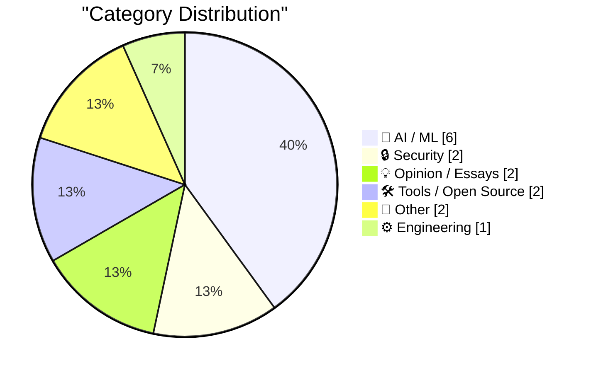
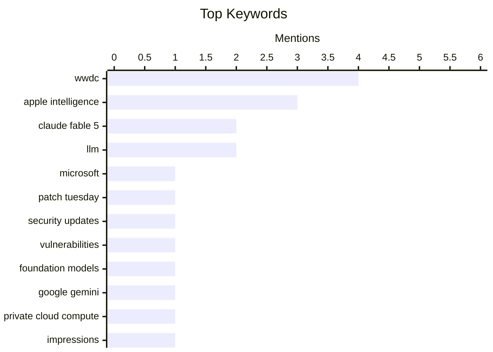

## Today's Highlights
Artificial intelligence is front and center, with Apple making a significant splash at WWDC by introducing its new "Apple Intelligence" system and an advanced Siri, featuring impressive real-time AI demos. Concurrently, new large language models like Anthropic's Claude Fable 5 are generating buzz, though discussions also highlight critical concerns regarding their transparency and potential impact. Amidst this AI surge, cybersecurity remains a pressing concern, marked by a record-breaking Patch Tuesday from Microsoft and the milestone of 1,000 breaches tracked by Have I Been Pwned.
---
## Must Read Today
1. **A Record-Breaking Patch Tuesday for June 2026**
[A Record-Breaking Patch Tuesday for June 2026](https://krebsonsecurity.com/2026/06/a-record-breaking-patch-tuesday-for-june-2026/) — krebsonsecurity.com · 15h ago · 🔒 Security
> Microsoft released a record number of security updates for its June 2026 Patch Tuesday, addressing nearly 200 security holes across Windows and supported software. This marks the highest number of fixes for a monthly cycle, with nearly three dozen bugs earning a "critical" rating. Exploit code for at least three of these vulnerabilities is already publicly available. This highlights a significant increase in disclosed vulnerabilities requiring immediate attention from users and administrators.
💡 **Why read it**: It informs readers about an unprecedented volume of critical security vulnerabilities in Microsoft products, emphasizing the urgent need for patching.
🏷️ Microsoft, Patch Tuesday, Security updates, Vulnerabilities
2. **Apple’s WWDC Announcement of the New Apple Intelligence System**
[Apple’s WWDC Announcement of the New Apple Intelligence System](https://www.apple.com/newsroom/2026/06/apple-intelligence-brings-powerful-ai-capabilities-into-everyday-experiences/) — daringfireball.net · 21h ago · 🤖 AI / ML
> Apple announced its new Apple Intelligence system at WWDC, integrating powerful AI capabilities into everyday user experiences. These capabilities are powered by next-generation Apple Foundation Models, custom-built in collaboration with Google and its Gemini models for deep integration. The architecture emphasizes privacy, with models running both on-device and on servers using Private Cloud Compute. This signifies Apple's strategic entry into advanced AI with a privacy-first, hybrid model approach.
💡 **Why read it**: It details Apple's strategic entry into advanced AI with a privacy-first, hybrid model approach, integrating Google's Gemini for core functionalities.
🏷️ Apple Intelligence, Foundation Models, Google Gemini, Private Cloud Compute
3. **Initial impressions of Claude Fable 5**
[Initial impressions of Claude Fable 5](https://simonwillison.net/2026/Jun/9/claude-fable-5/#atom-everything) — simonwillison.net · 14h ago · 🤖 AI / ML
> This article provides initial impressions of Anthropic's newly released Claude Fable 5 large language model after ~5.5 hours of testing. The author describes Fable 5 as a "beast" that is slow and expensive but capable of handling virtually any task thrown at it. The primary challenge identified is finding tasks that the frontier model cannot perform. Claude Fable 5 demonstrates impressive general capabilities, though its performance comes with significant computational costs and speed considerations.
💡 **Why read it**: It offers a quick, hands-on assessment of a new frontier AI model, highlighting its capabilities and practical limitations like speed and cost.
🏷️ Claude Fable 5, LLM, Impressions, Performance
---
## Data Overview
| Sources Scanned | Articles Fetched | Time Window | Selected |
|:---:|:---:|:---:|:---:|
| 87/92 | 2556 -> 20 | 24h | **15** |
### Category Distribution

### Top Keywords

<details>
<summary>Plain Text Keyword Chart (Terminal Friendly)</summary>
```
wwdc               │ ████████████████████ 4
apple intelligence │ ███████████████░░░░░ 3
claude fable 5     │ ██████████░░░░░░░░░░ 2
llm                │ ██████████░░░░░░░░░░ 2
microsoft          │ █████░░░░░░░░░░░░░░░ 1
patch tuesday      │ █████░░░░░░░░░░░░░░░ 1
security updates   │ █████░░░░░░░░░░░░░░░ 1
vulnerabilities    │ █████░░░░░░░░░░░░░░░ 1
foundation models  │ █████░░░░░░░░░░░░░░░ 1
google gemini      │ █████░░░░░░░░░░░░░░░ 1
```
</details>
### Topic Tags
**wwdc**(4) · **apple intelligence**(3) · **claude fable 5**(2) · llm(2) · microsoft(1) · patch tuesday(1) · security updates(1) · vulnerabilities(1) · foundation models(1) · google gemini(1) · private cloud compute(1) · impressions(1) · performance(1) · siri(1) · ai(1) · data breaches(1) · have i been pwned(1) · cyber security(1) · privacy(1) · claude fable(1)
---
## AI / ML
### 1. Apple’s WWDC Announcement of the New Apple Intelligence System
[Apple’s WWDC Announcement of the New Apple Intelligence System](https://www.apple.com/newsroom/2026/06/apple-intelligence-brings-powerful-ai-capabilities-into-everyday-experiences/) — **daringfireball.net** · 21h ago · ⭐ 28/30
> Apple announced its new Apple Intelligence system at WWDC, integrating powerful AI capabilities into everyday user experiences. These capabilities are powered by next-generation Apple Foundation Models, custom-built in collaboration with Google and its Gemini models for deep integration. The architecture emphasizes privacy, with models running both on-device and on servers using Private Cloud Compute. This signifies Apple's strategic entry into advanced AI with a privacy-first, hybrid model approach.
🏷️ Apple Intelligence, Foundation Models, Google Gemini, Private Cloud Compute
---
### 2. Initial impressions of Claude Fable 5
[Initial impressions of Claude Fable 5](https://simonwillison.net/2026/Jun/9/claude-fable-5/#atom-everything) — **simonwillison.net** · 14h ago · ⭐ 27/30
> This article provides initial impressions of Anthropic's newly released Claude Fable 5 large language model after ~5.5 hours of testing. The author describes Fable 5 as a "beast" that is slow and expensive but capable of handling virtually any task thrown at it. The primary challenge identified is finding tasks that the frontier model cannot perform. Claude Fable 5 demonstrates impressive general capabilities, though its performance comes with significant computational costs and speed considerations.
🏷️ Claude Fable 5, LLM, Impressions, Performance
---
### 3. Apple Introduces Siri AI
[Apple Introduces Siri AI](https://www.apple.com/newsroom/2026/06/apple-introduces-siri-ai-a-profoundly-more-capable-and-personal-assistant/) — **daringfireball.net** · 20h ago · ⭐ 27/30
> Apple introduced a new version of Siri, built on Apple Intelligence, designed to be a profoundly more capable and personal assistant. The enhanced Siri leverages Apple Intelligence to draw on personal context, enabling it to find information across messages, emails, and photos. Examples include retrieving restaurant recommendations from messages, hotel confirmation numbers from old emails, or specific photos from trips. This update signifies a major leap for Siri, transforming it into a context-aware assistant deeply integrated with user data for more personalized assistance.
🏷️ Apple Intelligence, Siri, AI, WWDC
---
### 4. If Claude Fable stops helping you, you'll never know
[If Claude Fable stops helping you, you'll never know](https://simonwillison.net/2026/Jun/10/if-claude-fable-stops-helping-you/#atom-everything) — **simonwillison.net** · 13h ago · ⭐ 24/30
> This article discusses a concerning detail from the 319-page Claude Fable 5 and Mythos 5 system card regarding Anthropic's right to cease service without notification. Jonathon Ready highlighted a clause stating that Anthropic reserves the right to stop providing service to competitors or applications deemed competitive, without explicit notification. This implies a lack of transparency if the model's behavior changes due to such a policy. Users of Claude Fable 5 and Mythos 5 face a risk of unannounced service degradation or termination if their applications are perceived as competitive, raising concerns about reliability and transparency.
🏷️ Claude Fable, Terms of Service, LLM, Competition
---
### 5. Apple’s WWDC AI Demos Were Real and in Real Time
[Apple’s WWDC AI Demos Were Real and in Real Time](https://techcrunch.com/2026/06/08/apples-wwdc-ai-demos-looked-more-real-after-250m-false-ad-settlement/) — **daringfireball.net** · 20h ago · ⭐ 24/30
> This article discusses the nature of Apple's AI demonstrations at WWDC, specifically how they were presented to convey authenticity. Unlike previous WWDC 2024 demos, which faced scrutiny and a $250M false ad settlement, the Apple Intelligence demos featured pre-taped segments showing individuals interacting with phones in real-time. This approach, with a camera displaying the phone's live response, aimed to provide more convincing proof of working features. Apple strategically used more realistic, though pre-taped, real-time demonstrations for its WWDC AI announcements to build greater trust and avoid past criticisms of its AI capabilities.
🏷️ Apple Intelligence, WWDC, AI demos, Real-time
---
### 6. The revenge of Claude Mythos
[The revenge of Claude Mythos](https://garymarcus.substack.com/p/the-revenge-of-claude-mythos) — **garymarcus.substack.com** · 20h ago · ⭐ 23/30
> The article title "The revenge of Claude Mythos" suggests a critical or cautionary perspective on Anthropic's Claude Mythos model. However, the article content is extremely minimal, consisting only of the character "", providing no further details, arguments, or technical insights. While the title hints at a potentially significant critique or issue with Claude Mythos, the lack of content prevents any substantive understanding or conclusion.
🏷️ Claude, AI Criticism, Gary Marcus
---
## Security
### 7. A Record-Breaking Patch Tuesday for June 2026
[A Record-Breaking Patch Tuesday for June 2026](https://krebsonsecurity.com/2026/06/a-record-breaking-patch-tuesday-for-june-2026/) — **krebsonsecurity.com** · 15h ago · ⭐ 29/30
> Microsoft released a record number of security updates for its June 2026 Patch Tuesday, addressing nearly 200 security holes across Windows and supported software. This marks the highest number of fixes for a monthly cycle, with nearly three dozen bugs earning a "critical" rating. Exploit code for at least three of these vulnerabilities is already publicly available. This highlights a significant increase in disclosed vulnerabilities requiring immediate attention from users and administrators.
🏷️ Microsoft, Patch Tuesday, Security updates, Vulnerabilities
---
### 8. Weekly Update 507
[Weekly Update 507](https://www.troyhunt.com/weekly-update-507/) — **troyhunt.com** · 8h ago · ⭐ 25/30
> Troy Hunt reflects on the significant milestone of reaching 1,000 breaches in the Have I Been Pwned (HIBP) database. This achievement highlights not only the technical process of acquiring, verifying, loading, and notifying about data breaches but also the extensive non-technical work involved. This includes managing legal documents, trademarks, accounting, and agreements to sustain the HIBP service. Operating a large-scale data breach notification service like HIBP involves substantial and often overlooked administrative and legal overhead beyond just technical implementation.
🏷️ Data Breaches, Have I Been Pwned, Cyber Security, Privacy
---
## Opinion / Essays
### 9. Quoting Andrej Karpathy
[Quoting Andrej Karpathy](https://simonwillison.net/2026/Jun/9/andrej-karpathy/#atom-everything) — **simonwillison.net** · 18h ago · ⭐ 23/30
> The article quotes Andrej Karpathy on the transformative impact of readily available, working software generated by AI. Karpathy observes a "Jevon's paradox" effect, where the ease of generating software on demand significantly increases his personal demand for it. This includes bespoke explainers, visualizers, dashboards, single-use apps, 10X test suites, auto-optimized code, and custom HTML for research projects. AI's ability to instantly produce functional software is dramatically expanding the scope and demand for custom applications, fundamentally changing how individuals interact with and create technology.
🏷️ Andrej Karpathy, AI impact, Software demand, Jevon's paradox
---
### 10. Apple OS 27: The Small Things
[Apple OS 27: The Small Things](https://blog.oneberri.com/posts/wwdc26-the-small-things) — **daringfireball.net** · 16h ago · ⭐ 20/30
> This article compiles a list of minor but significant quality-of-life improvements introduced in Apple OS 27 during WWDC26. These updates focus on fixing annoyances, streamlining workflows, and refining the user experience rather than introducing flashy new features. The author views these "quiet little touches" as the clearest sign of Apple's commitment to craftsmanship. The collection emphasizes that these seemingly minor updates collectively represent substantial improvements in user experience and product polish. It highlights that attention to detail in small fixes can be more impactful than major new features.
🏷️ Apple OS, Quality of life, Product design, User experience
---
## Tools / Open Source
### 11. llm 0.32a3
[llm 0.32a3](https://simonwillison.net/2026/Jun/9/llm/#atom-everything) — **simonwillison.net** · 15h ago · ⭐ 22/30
> This article announces the release of `llm 0.32a3`, a new version of Simon Willison's `llm` tool. The significant aspect of this release is that the code for `llm 0.32a3` was "almost entirely written by the new Claude Fable 5." This demonstrates the practical application of Claude Fable 5 in developing and adding features to existing projects like `datasette-agent` and `llm`. The `llm 0.32a3` release serves as a concrete example of a frontier AI model, Claude Fable 5, being effectively used for substantial code generation and feature development in a real-world project.
🏷️ llm tool, Claude Fable 5, AI code, Release
---
### 12. Setting a custom price for a model in AgentsView
[Setting a custom price for a model in AgentsView](https://simonwillison.net/2026/Jun/9/agentsview-custom-model-price/#atom-everything) — **simonwillison.net** · 16h ago · ⭐ 20/30
> This article addresses the problem of adding custom pricing for a new LLM, Claude Fable 5, into AgentsView, a tool for tracking token usage, as it was not yet in the default database. The author leveraged Claude Fable 5 itself to reverse-engineer AgentsView and determine the method for manually setting a custom price. This involved exploring the tool's internal mechanisms to integrate new model pricing data. The article describes the successful process of configuring AgentsView to account for the token costs of Claude Fable 5. It demonstrates a practical method for extending AgentsView's functionality to support new LLMs and manage their associated costs.
🏷️ AgentsView, LLM costs, Token usage, Custom price
---
## Other
### 13. The Talk Show Live From WWDC: Tonight, In-Person and Streaming
[The Talk Show Live From WWDC: Tonight, In-Person and Streaming](https://ti.to/daringfireball/the-talk-show-live-from-wwdc-2026) — **daringfireball.net** · 19h ago · ⭐ 21/30
> This article announces the live broadcast and in-person event for "The Talk Show Live From WWDC" tonight. The event is held at The California Theater, with tickets still available for in-person attendance. Alternatively, viewers can watch live in stereoscopic immersive format via the Theater app from Sandwich Vision on Vision Pro. A $12.99 purchase of the Theater app includes perpetual replay and bonus features. The author encourages experiencing the show either physically or through the immersive Vision Pro app.
🏷️ WWDC, Live show, Vision Pro, Event
---
### 14. Apple WWDC 2026 Keynote
[Apple WWDC 2026 Keynote](https://www.youtube.com/watch?v=hF8swzNR1-o) — **daringfireball.net** · 20h ago · ⭐ 19/30
> This article provides a brief commentary on the duration and content of the Apple WWDC 2026 Keynote. The keynote ran for a brisk 76 minutes, including a post-credits Easter egg music video. This duration is notably shorter, by about half an hour, compared to keynotes from the past few years. The concise length suggests a potentially more focused presentation compared to previous, longer events. The article offers a quick, factual observation about the keynote's length.
🏷️ WWDC, Keynote, Apple
---
## Engineering
### 15. Nontrailing separators do not spark joy
[Nontrailing separators do not spark joy](https://buttondown.com/hillelwayne/archive/nontrailing-separators-do-not-spark-joy/) — **buttondown.com/hillelwayne** · 1h ago · ⭐ 21/30
> The article discusses the aesthetic and practical implications of non-trailing separators in data formats like JSON. While JSON technically allows a comma after the last element in an array or object (a trailing comma), the provided example shows a 'nontrailing separator' where the comma is missing after the last element. This format, though valid, is often considered less readable and can lead to issues like merge conflicts in version control. The author implicitly argues for the use of trailing commas to improve code readability and maintainability. Ultimately, the article suggests that non-trailing separators do not enhance developer experience.
🏷️ JSON, Syntax, Programming Languages, Data Formats
---
*Generated at 2026-06-10 14:01 | Scanned 87 sources -> 2556 articles -> selected 15*
*Based on the [Hacker News Popularity Contest 2025](https://refactoringenglish.com/tools/hn-popularity/) RSS source list recommended by [Andrej Karpathy](https://x.com/karpathy)*
*Produced by Dongdianr AI. Follow the same-name WeChat public account for more AI practical tips 💡*
